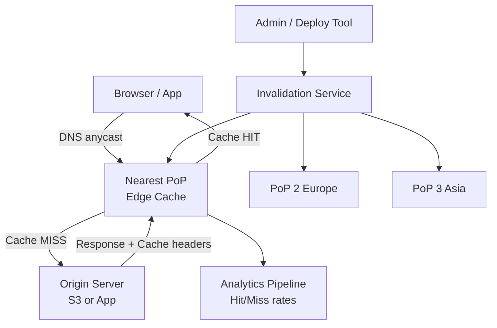
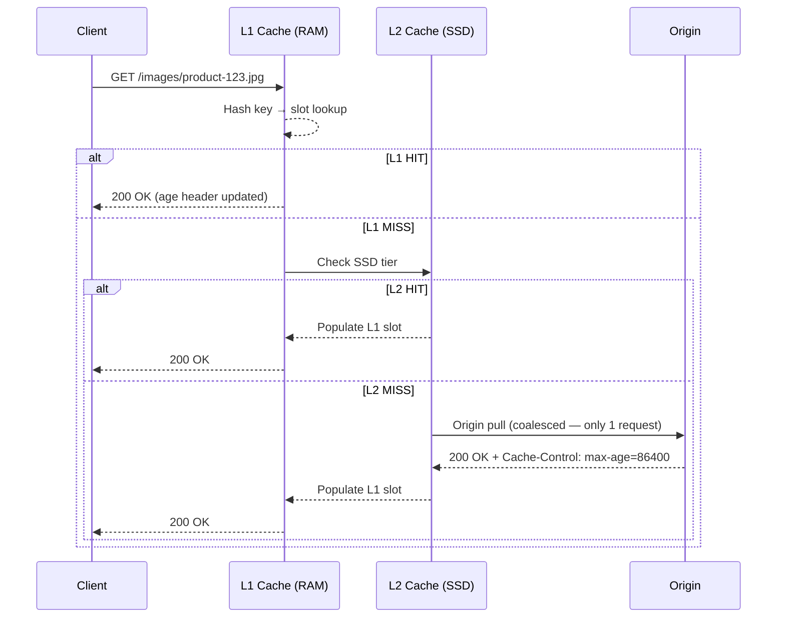
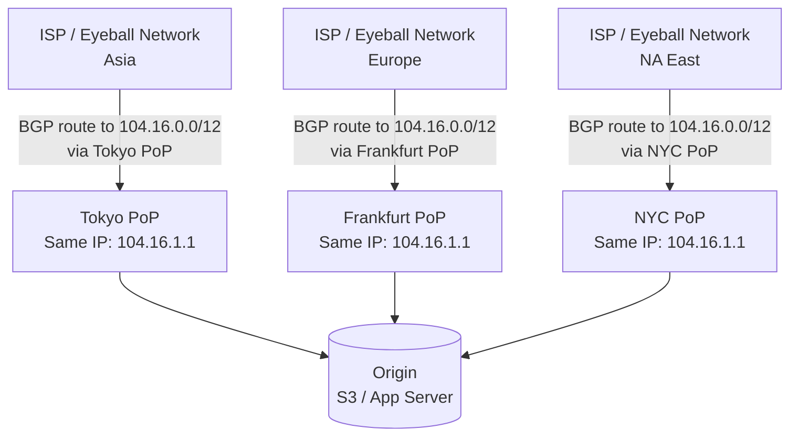
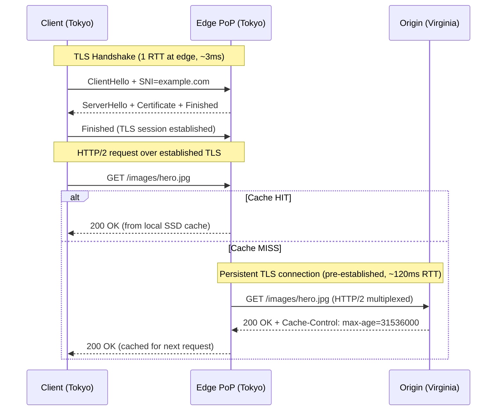
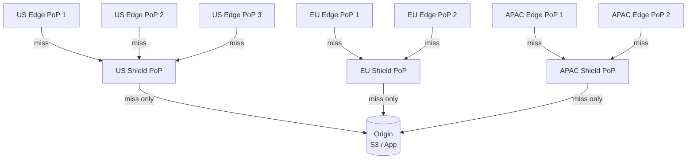

# Design a Content Delivery Network (CDN)

**Difficulty**: 🔴 Advanced
**Reading Time**: ~25 minutes
**Interview Frequency**: High

---

## The Core Problem

Serving 10 petabytes per day of static content from 200 Points of Presence (PoPs) worldwide with 99.99% availability requires solving routing (how does a user's DNS resolve to the nearest PoP?), caching (what gets cached for how long?), and invalidation (how do you purge content from 200 PoPs in under 30 seconds?) simultaneously.

## Functional Requirements

- Serve static content (images, JS, CSS, videos) from edge locations near users
- Reduce origin load by >95% through caching
- Support on-demand cache invalidation (purge by URL or tag)
- Provide SSL termination at edge
- Collect analytics on cache hit/miss rates per PoP

## Non-Functional Requirements

| Requirement | Target |
|-------------|--------|
| Cache hit ratio | > 95% for static assets |
| Latency | < 10ms from user to nearest PoP |
| Availability | 99.99% (52 min/year) |
| Invalidation propagation | < 30 seconds to all 200 PoPs |

## Back-of-Envelope Estimates

- **Daily traffic**: 10PB/day ÷ 86,400 sec = ~116GB/sec aggregate bandwidth
- **Cache storage**: 116GB/sec × 95% hit rate → origin sees 5.8GB/sec; edge cache needs ~10TB SSD per PoP to achieve 95% hit rate
- **Invalidation fan-out**: 1 purge request → 200 PoP API calls → 200 cache flushes, all within 30 seconds

## Key Design Decisions

1. **Anycast DNS for PoP Selection** — all 200 PoPs advertise the same IP range via BGP anycast; user's DNS query automatically routes to nearest PoP based on BGP routing tables; no application-level geography lookup needed.
2. **Origin Pull vs Origin Push** — origin pull: edge fetches from origin on first cache miss, then caches locally; simpler, works for all content; origin push: pre-upload hot content to all PoPs before it's requested; better for known high-traffic events (new product launch).
3. **Surrogate Key / Tag-Based Invalidation** — instead of purging by URL (one at a time), tag all assets related to product_id=123 with "product-123"; purge entire tag with one API call; CDN fans out to flush all matching assets at all PoPs.

## High-Level Architecture



## Top Interview Questions for This Problem

| Question | Tests |
|----------|-------|
| How does anycast routing work and why is it better than GeoDNS for CDN? | BGP anycast, DNS latency |
| How would you invalidate all images for a product that was just updated? | Tag-based invalidation, fan-out |
| How do you handle cache stampede when a popular object's TTL expires at a CDN PoP? | Thundering herd, coalescing requests |

## Related Concepts

- [Web cache edge caching strategies](../01-data-processing/web-cache)
- [Load balancer for in-PoP traffic distribution](./load-balancer)

---

## Component Deep Dive 1: Edge Cache Layer

The edge cache is the heart of a CDN — it is the component that eliminates origin round-trips and determines whether you achieve that 95%+ hit rate. Understanding how it works internally separates candidates who can describe a CDN from candidates who can design one.

### How It Works Internally

Each PoP runs a tiered cache. The L1 cache is an in-process memory store (typically 32–128 GB RAM per node) holding the hottest objects. The L2 cache is an SSD tier (4–20 TB per node) holding warm objects that spilled out of L1. When a request arrives, it hashes the request key (URL + Vary headers) against the L1 hash ring. On an L1 miss it checks L2. On an L2 miss it goes to origin, fetches the asset, stores it in both tiers, and returns it to the user — all within a single request lifecycle.

The cache eviction policy matters enormously at CDN scale. A naive LRU eviction fails because CDNs serve long-tail objects — thousands of URLs each requested once per day. LRU evicts them before their next request, guaranteeing misses. Production CDNs use **LFU with aging (LFUDA)** or **TinyLFU** (used in Caffeine, Varnish): each object tracks a frequency counter that decays over time, so a burst of requests for a new product page doesn't permanently displace a rarely-but-steadily-requested asset.

**Cache stampede** is the most dangerous failure mode. When a popular object's TTL expires, all queued requests simultaneously hit origin before the first response returns. At a PoP handling 200k req/sec for a hot asset, a single TTL expiry can fire 5,000–50,000 origin requests in under 100ms. The fix is **request coalescing (request collapsing)**: the cache holds the first miss request open, queues all duplicate inflight requests, fulfills them all from the single origin response, and never sends more than one origin request per cache key at a time.

### Cache Key Construction

A subtle but critical decision is what forms the cache key. URL alone is insufficient — personalized content, A/B variants, and compressed vs uncompressed responses must be separated. A production cache key includes:

- Normalized URL (sorted query params, lowercased host)
- Selected `Vary` header values (Accept-Encoding, Accept-Language)
- CDN tier identifier (to prevent L1/L2 key collisions)

Keys that are too broad cause unnecessary cache misses; keys that are too narrow create cache fragmentation where the same logical resource occupies dozens of cache slots.



### Eviction Strategy Trade-offs

| Approach | Hit Rate (hot content) | Hit Rate (long-tail) | Stampede Resistance | Complexity |
|----------|----------------------|---------------------|---------------------|------------|
| Pure LRU | High | Low — evicts cold-but-regular objects | None | Low |
| LFU with aging (LFUDA) | High | High — frequency decay keeps regulars | None | Medium |
| TinyLFU + window LRU | Highest — admission filter blocks one-hit wonders | High | None | High |
| TinyLFU + request coalescing | Highest | High | Full | High |

**Production choice**: TinyLFU (or its Caffeine/Varnish equivalent) combined with request coalescing is the industry standard. Cloudflare, Fastly, and Varnish Cache all implement variants of this combination.

---

## Component Deep Dive 2: Anycast Routing and PoP Selection

Routing a user to the nearest PoP sounds simple but hides significant operational complexity. The naive approach — GeoDNS, mapping IP ranges to geographic coordinates then resolving to the nearest PoP IP — fails in three ways: (1) DNS resolvers are often located far from the actual user (corporate resolvers, ISP resolvers that serve multiple regions), (2) "nearest by geography" is not "nearest by network latency" (a PoP in a different country may be reachable in 3ms via a direct peering link, while the geographically closer PoP requires 40ms through an overloaded ISP path), and (3) GeoDNS requires constant, expensive IP geolocation database updates.

### BGP Anycast

BGP anycast solves all three problems. Every PoP announces the same IP prefix (e.g., 104.16.0.0/12 — Cloudflare's range) via BGP to its upstream ISP peers. The global BGP routing table then contains hundreds of paths to the same prefix. When a user's packet is sent to any IP in that prefix, routers along the path forward it to whichever BGP-announced origin is fewest AS hops away — automatically selecting network-optimal routing without any application-level geo logic.

At 10x load: anycast routing itself doesn't break. BGP converges in 30–90 seconds after a PoP goes offline, so failover is handled at the network layer. The bottleneck at 10x becomes PoP capacity, not routing. Individual PoPs must shed load gracefully — a PoP that is overloaded should withdraw its BGP announcement so traffic re-routes to neighboring PoPs rather than queueing indefinitely.



### PoP Health and BGP Withdrawal

A PoP health daemon monitors CPU, memory, and network utilization every 5 seconds. If any metric crosses its threshold (e.g., CPU > 85% for 15 consecutive seconds), the daemon issues a BGP route withdrawal to upstream peers, removing this PoP from the global routing table within 30–90 seconds. Traffic automatically re-routes to the next-nearest PoP. When the PoP recovers, it re-announces the prefix and gradually re-receives traffic as BGP reconverges.

| Routing Method | Latency Accuracy | Failover Time | Operational Complexity | Works at Global Scale |
|---------------|-----------------|---------------|----------------------|----------------------|
| GeoDNS | Medium (IP geo is imprecise) | 60–300s (DNS TTL) | Medium | Yes, with DB maintenance |
| BGP Anycast | High (actual network path) | 30–90s (BGP convergence) | High (requires BGP expertise) | Yes |
| HTTP redirect (latency probing) | Highest (measured RTT) | 1–5s | Low | No — adds one RTT per cold request |

---

## Component Deep Dive 3: Cache Invalidation and Propagation

Cache invalidation at CDN scale is the hardest part of the system. The CAP theorem applies: you cannot simultaneously guarantee that a purge is consistent (all 200 PoPs see it instantly), available (the invalidation service never fails), and tolerant of network partitions (some PoPs may be temporarily unreachable).

### Tag-Based Invalidation

URL-by-URL invalidation fails for large content graphs. An e-commerce product page may reference 40 images, 3 CSS files, 2 JS bundles, and 1 JSON feed — all of which must be purged when the product is updated. Purging 46 URLs sequentially takes 46 API calls × ~100ms fanout = 4.6 seconds minimum. Tag-based (surrogate key) invalidation solves this: when an object is cached, the origin includes a `Surrogate-Key: product-123 category-electronics` response header. The CDN stores a reverse index mapping each tag to its set of cached URLs. A single purge call `DELETE /purge/tag/product-123` triggers the CDN to look up all URLs tagged `product-123` and flush them across all PoPs in a single fan-out.

### Invalidation Fan-Out Architecture

The invalidation service receives a purge request, writes it to a durable message queue (Kafka or SQS), and a fan-out worker reads each message and issues parallel purge calls to all 200 PoPs via their local management APIs. Each PoP's management API applies the purge to its local cache and responds with success/failure. The fan-out worker retries failed PoPs with exponential backoff and marks the invalidation as complete only when all 200 PoPs confirm, or when the configured deadline (30 seconds) is exceeded — at which point the PoPs that failed will serve stale content until their TTL expires naturally.

**Consistency trade-off**: Eventual consistency is the correct choice here. Requiring synchronous confirmation from all 200 PoPs before returning success to the caller would make the invalidation API as slow as the slowest PoP (potentially minutes if a PoP is in a degraded state). Instead, return success to the caller immediately after writing to the durable queue, and let the fan-out proceed asynchronously. Callers who need strong consistency can poll an invalidation status endpoint.

| Invalidation Strategy | Granularity | Fan-out Cost | Propagation Time | Best For |
|----------------------|-------------|--------------|-----------------|----------|
| URL purge | Single URL | 200 API calls per URL | < 5 seconds | Small, targeted changes |
| Tag/surrogate-key purge | Set of tagged URLs | 200 API calls per tag | < 10 seconds | Product/entity updates |
| Path prefix purge | All URLs under prefix | 200 API calls per prefix | < 15 seconds | Deploy rollouts |
| Full cache clear | All cached content | 200 API calls | 10–30 seconds | Emergency rollbacks |

---

## Data Model

The CDN control plane needs to track cached objects, their tags, PoP state, and invalidation history. Below is the schema for the invalidation tracking database (PostgreSQL is appropriate here — write volume is low, < 10k purge operations/day; reads are audit/monitoring queries).

```sql
-- Cached object registry (one row per cached URL per PoP)
CREATE TABLE cached_objects (
    cache_key        VARCHAR(2048)   NOT NULL,   -- normalized URL + vary hash
    pop_id           VARCHAR(32)     NOT NULL,   -- e.g. 'sin01', 'fra02', 'iad01'
    origin_url       TEXT            NOT NULL,
    content_type     VARCHAR(128),
    content_length   BIGINT,
    etag             VARCHAR(128),
    cached_at        TIMESTAMPTZ     NOT NULL DEFAULT NOW(),
    expires_at       TIMESTAMPTZ     NOT NULL,   -- cached_at + TTL
    hit_count        BIGINT          NOT NULL DEFAULT 0,
    last_hit_at      TIMESTAMPTZ,
    PRIMARY KEY (cache_key, pop_id)
);

-- Surrogate key (tag) → cache key mapping
CREATE TABLE cache_tags (
    tag              VARCHAR(256)    NOT NULL,   -- e.g. 'product-123', 'category-electronics'
    cache_key        VARCHAR(2048)   NOT NULL,
    pop_id           VARCHAR(32)     NOT NULL,
    created_at       TIMESTAMPTZ     NOT NULL DEFAULT NOW(),
    PRIMARY KEY (tag, cache_key, pop_id)
);
CREATE INDEX idx_cache_tags_tag ON cache_tags (tag);

-- Invalidation requests and their per-PoP status
CREATE TABLE invalidation_requests (
    invalidation_id  UUID            PRIMARY KEY DEFAULT gen_random_uuid(),
    request_type     VARCHAR(32)     NOT NULL,   -- 'url', 'tag', 'prefix', 'full'
    request_value    TEXT            NOT NULL,   -- the URL, tag name, or prefix
    requested_by     VARCHAR(256)    NOT NULL,   -- API key or service name
    requested_at     TIMESTAMPTZ     NOT NULL DEFAULT NOW(),
    status           VARCHAR(32)     NOT NULL DEFAULT 'pending', -- 'pending', 'propagating', 'complete', 'partial'
    completed_at     TIMESTAMPTZ,
    affected_urls    INTEGER,                    -- count of URLs flushed
    affected_pops    INTEGER                     -- count of PoPs that confirmed
);

-- Per-PoP invalidation delivery tracking
CREATE TABLE invalidation_pop_status (
    invalidation_id  UUID            NOT NULL REFERENCES invalidation_requests(invalidation_id),
    pop_id           VARCHAR(32)     NOT NULL,
    status           VARCHAR(32)     NOT NULL DEFAULT 'pending', -- 'pending', 'success', 'failed', 'timeout'
    sent_at          TIMESTAMPTZ,
    confirmed_at     TIMESTAMPTZ,
    retry_count      INTEGER         NOT NULL DEFAULT 0,
    error_message    TEXT,
    PRIMARY KEY (invalidation_id, pop_id)
);
CREATE INDEX idx_inv_pop_status ON invalidation_pop_status (status, sent_at)
    WHERE status IN ('pending', 'failed');

-- PoP registry and health state
CREATE TABLE pops (
    pop_id           VARCHAR(32)     PRIMARY KEY,
    region           VARCHAR(64)     NOT NULL,   -- 'asia-pacific', 'europe', 'north-america'
    city             VARCHAR(64)     NOT NULL,
    datacenter       VARCHAR(128),
    management_api   TEXT            NOT NULL,   -- internal API endpoint for cache operations
    bgp_announced    BOOLEAN         NOT NULL DEFAULT TRUE,
    health_status    VARCHAR(32)     NOT NULL DEFAULT 'healthy', -- 'healthy', 'degraded', 'offline'
    last_health_check TIMESTAMPTZ   NOT NULL DEFAULT NOW()
);
```

**Key indexes**: `idx_cache_tags_tag` is the hot path for tag-based invalidation — it must be a B-tree index on `tag` since lookups are always equality searches on a tag string. The partial index on `invalidation_pop_status` only indexes rows still needing work, keeping the index small and the retry worker fast.

---

## Scale Bottlenecks

| Traffic Level | Component That Breaks | Symptoms | Mitigation |
|---------------|----------------------|----------|------------|
| 10x baseline (1.16 TB/sec) | L1 cache memory per PoP | Hit rate drops from 95% → 70%; origin bandwidth spikes 6x | Expand PoP memory (256 GB/node), add more nodes per PoP via consistent hashing |
| 100x baseline (11.6 TB/sec) | Origin capacity at the 5% miss rate | Origin sees 580 GB/sec — far beyond single-datacenter capacity | Multi-region origins with latency-based origin selection; shield PoPs (mid-tier cache) in front of origin |
| 100x baseline | Invalidation fan-out queue depth | Purge propagation time grows from 30s → 10+ minutes as queue backs up | Partition invalidation queue by region; run regional fan-out workers instead of global |
| 1000x baseline (116 TB/sec) | BGP anycast PoP count — 200 PoPs averaging 580 GB/sec each | Individual PoP egress ports saturate (typical PoP has 400 Gbps egress) | Add 5x more PoPs (1000 total), peer directly with Tier-1 ISPs at IXPs for free egress, negotiate transit-free peering |
| 1000x baseline | DNS resolution throughput | CDN's own DNS infrastructure becomes the bottleneck | Distributed authoritative DNS (anycast DNS servers at each PoP), DNS response caching at recursive resolvers |

**Shield PoP (Origin Shield)** is the most important scaling pattern between 10x and 100x. Instead of all 200 edge PoPs pulling directly from origin on misses, you designate 5–10 "shield" PoPs per region. Edge PoPs check their regional shield PoP before going to origin. This concentrates origin traffic into a small number of shield nodes, dramatically increasing the effective cache hit rate seen by the origin. Netflix Open Connect uses exactly this pattern — ISP-embedded appliances pull from Netflix's shield tier rather than Netflix's actual servers.

---

## How Netflix Built This (Open Connect CDN)

Netflix serves 700 Gbps to 800 Gbps of peak streaming traffic and built a dedicated CDN called **Open Connect** rather than relying on commercial CDNs. The architectural decision was non-obvious: Netflix gives their CDN appliances (OCAs — Open Connect Appliances) to ISPs for free, to be installed in the ISP's own data centers.

**Scale**: Netflix has 17,000+ OCA deployments across 1,000+ ISPs in 6 continents. Each OCA is a commodity server loaded with 100–1,000+ TB of SSD/HDD storage. An OCA serves Netflix content directly from within the ISP's network, achieving sub-millisecond latency from user to CDN node and eliminating the ISP's transit bandwidth costs entirely.

**Specific technology choices**:
- OCAs run FreeBSD with a custom kernel tuned for sendfile() performance — zero-copy file serving saturates 100 Gbps NICs with fewer than 8 CPU cores
- Content is pre-positioned (pushed, not pulled) based on predictive popularity modeling: every night, Netflix's "fill" process uses the previous day's viewing data to predict the next day's top-watched titles per ISP and pushes those files to each OCA before demand arrives
- Storage uses RAID-Z2 (ZFS) across 36 HDDs per OCA node for density; SSDs are used only for the metadata index and hottest 5% of content
- BGP anycast is not used — Netflix uses DNS-based routing with real-time latency probing; their DNS redirector measures actual latency from the OCA to the ISP's DNS resolver and routes each user to the fastest-responding OCA in their network

**Non-obvious decision**: Netflix chose ISP-embedded appliances over traditional CDN PoPs because Netflix's traffic is so asymmetric (mostly large video files outbound, no user uploads) that the cost structure of buying rack space at ISP facilities and giving up appliances for free was cheaper than paying per-GB CDN egress rates. At Netflix's volume — 15% of total US internet traffic at peak — even a $0.001/GB reduction in CDN cost saves tens of millions of dollars per year.

Netflix published their OCA architecture at [Netflix Tech Blog: Open Connect](https://netflixtechblog.com/how-netflix-works-with-isps-around-the-globe-to-deliver-a-great-viewing-experience-56867cde49da).

---

## Interview Angle

**What the interviewer is testing:** The interviewer is evaluating whether you understand that a CDN is not just a cache — it is a globally distributed system with network routing, consistency, and failure-mode problems that require fundamentally different solutions than single-datacenter caching. They want to see whether you can decompose the system into its hard sub-problems (routing, caching policy, invalidation consistency) and articulate the trade-offs at each layer.

**Common mistakes candidates make:**

1. **Describing GeoDNS as the routing solution without acknowledging its limitations.** GeoDNS depends on accurate IP geolocation databases (which are ~80% accurate at city level), introduces an extra DNS round-trip per request, and has slow failover (bounded by DNS TTL). Candidates who mention GeoDNS without mentioning BGP anycast miss the key insight about how production CDNs route at the network layer, not the application layer.

2. **Treating cache invalidation as a synchronous operation.** Candidates often say "send a purge to all PoPs and wait for confirmation before returning success." At 200 PoPs, this means your invalidation API has P99 latency equal to the slowest PoP in the world — potentially 5–30 seconds. This fails SLAs for any interactive purge workflow. The correct answer is: write to a durable queue, fan out asynchronously, return an invalidation ID that callers can poll.

3. **Ignoring cache stampede entirely.** When asked about TTL expiry, candidates describe setting a long TTL and moving on. They miss that a popular object expiring at a busy PoP is a thundering herd problem — the fix (request coalescing) is a specific, named technique that interviewers are explicitly looking for.

**The insight that separates good from great answers:** The best candidates recognize that a CDN's "hit rate" metric is not just a caching parameter — it is a cost and resilience multiplier for the origin. A 95% hit rate means origin sees 5% of traffic; a 90% hit rate means origin sees 10% of traffic — double the origin load from a 5% metric change. This drives every decision: eviction policy, TTL length, request coalescing, shield PoPs. Candidates who frame all design decisions in terms of "how does this affect origin load?" demonstrate senior-level systems thinking.

---

## Key Numbers to Remember

| Metric | Value | Context |
|--------|-------|---------|
| Typical CDN hit rate target | 95%+ for static assets | Miss rate determines origin capacity requirements |
| Origin traffic at 95% hit rate | 5.8 GB/sec | For 116 GB/sec total traffic (10PB/day) |
| Cache SSD per PoP for 95% hit rate | ~10 TB | Depends on object size distribution and working set size |
| Invalidation fan-out time | < 30 seconds | Across 200 PoPs via async queue |
| BGP convergence time (failover) | 30–90 seconds | Time for traffic to re-route after a PoP withdraws BGP announcement |
| Request coalescing benefit | 1 origin request per cache key | Instead of 5,000–50,000 at TTL expiry for hot objects |
| Netflix OCA deployments | 17,000+ at 1,000+ ISPs | Each OCA: 100–1,000 TB storage, FreeBSD, zero-copy sendfile |
| Netflix peak streaming bandwidth | 700–800 Gbps | ~15% of total US internet traffic at peak |
| Cloudflare PoP count | 300+ | Anycast routing, same IP prefix announced globally |
| Typical PoP egress capacity | 400 Gbps | Physical NIC limit per PoP before adding more nodes |

---

*The deep-dive above covers the three critical sub-systems of any CDN: the edge cache (with TinyLFU + request coalescing), BGP anycast routing, and async invalidation fan-out. Master these three and you can answer every follow-up an interviewer throws at this problem.*

---

## SSL Termination and TLS at Edge

Every modern CDN terminates TLS at the edge PoP, not at the origin. This is non-negotiable at scale: establishing a TLS handshake from a user in Tokyo to an origin server in Virginia adds 150–200ms of latency on top of the 120ms physical round-trip time. By terminating TLS at the Tokyo PoP (< 5ms from the user), the handshake cost is paid locally and the PoP-to-origin connection uses a long-lived persistent TLS connection over a well-peered backbone path.

### How TLS Session Resumption Works at CDN Scale

A full TLS 1.3 handshake requires 1 RTT (down from 2 RTT in TLS 1.2). TLS session resumption (0-RTT) allows a returning client to send data on the very first packet, achieving true zero-RTT for repeat visitors. The CDN must distribute TLS session tickets across all nodes within a PoP so that if a client reconnects to a different edge node, the session ticket is still valid. This requires a shared session ticket key synchronized across all edge nodes within a PoP, typically via an in-memory key-value store (Redis or Memcached) with a 24-hour key rotation.

**Certificate management**: CDNs serve thousands of domains (customer CNAMEs). Storing a separate certificate per domain is operationally infeasible. Solutions:
- **SNI-based virtual hosting**: The client's TLS ClientHello includes the domain name (SNI extension), allowing one IP to serve certificates for thousands of domains
- **Certificate aggregation**: Wildcard certificates (`*.example.com`) or multi-SAN certificates bundle multiple domains into one certificate, reducing the number of certificates that must be distributed to all 200 PoPs
- **Automated certificate issuance**: Let's Encrypt ACME protocol with a CDN-managed DNS challenge — the CDN automatically issues, renews, and distributes certificates for all customer domains without human intervention



### HTTP/2 and HTTP/3 at the Edge

CDNs were among the first adopters of HTTP/2 and HTTP/3 (QUIC) because the benefits compound at the edge:

- **HTTP/2 multiplexing**: A single TCP connection carries multiple concurrent requests, eliminating the 6-connection limit browsers use with HTTP/1.1. At a CDN edge handling 200k req/sec per node, this reduces TCP connection overhead by 50–80%.
- **HTTP/3 / QUIC**: Replaces TCP with UDP-based QUIC, eliminating TCP head-of-line blocking. For users on lossy mobile networks (packet loss > 1%), QUIC reduces page load time by 15–30% because a single lost packet blocks the entire TCP stream, whereas QUIC only blocks the affected stream.
- **Server Push** (HTTP/2): Edge nodes can push sub-resources (CSS, JS) before the browser requests them, reducing waterfall latency for uncached pages.

---

## Edge Computing and Lambda@Edge

Modern CDNs have evolved beyond pure caching into edge compute platforms. The ability to run arbitrary code at every PoP unlocks use cases that pure caching cannot address.

### Why Edge Compute Matters

A pure caching CDN serves identical cached content to all users. But many requests require personalization: serve different content based on user's logged-in state, A/B test variant, geolocation, or device type. Without edge compute, personalized content is uncacheable and must always hit origin — destroying the CDN's cache hit rate.

Edge compute solves this by running a small function at the PoP that modifies the cache key, rewrites the request, or generates a personalized response fragment. The static wrapper (HTML shell, CSS, JS) is cached normally, and only the dynamic fragment (user's name, price in local currency) is computed at the edge.

**Cloudflare Workers example**: A Cloudflare Worker runs V8 JavaScript isolates (not Node.js — no process overhead) at all 300+ PoPs. Cold start time is < 5ms (vs 100–500ms for AWS Lambda). Each isolate has a 128 MB memory limit and a 50ms CPU time limit per request. Workers can read/write Cloudflare's KV store (eventually consistent, global) and Durable Objects (strongly consistent, single-region).

**Use cases enabled by edge compute**:
- A/B testing without origin round-trip (read experiment assignment from KV, modify request headers, route to appropriate origin)
- JWT authentication at edge (validate token, reject unauthenticated requests before they reach origin)
- Request/response transformation (convert WebP images for browsers that don't support it, rewrite API paths)
- Bot detection and rate limiting (run ML model at edge to score requests, block bots before origin)
- Geo-based content personalization (insert localized price, currency, or regulatory disclaimer based on `CF-IPCountry` header)

| Edge Compute Platform | Runtime | Cold Start | Memory | CPU Time Limit | Cost Model |
|----------------------|---------|------------|--------|----------------|------------|
| Cloudflare Workers | V8 isolates (JS/WASM) | < 5ms | 128 MB | 50ms/req | $0.50/million req |
| AWS Lambda@Edge | Node.js / Python | 100–500ms | 128 MB | 5 sec/req | $0.60/million req |
| Fastly Compute@Edge | WASM (any language) | < 1ms | 32 MB | 50ms/req | $0.50/million req |
| Akamai EdgeWorkers | JS | 10–50ms | 2 MB | 1 sec/req | Custom pricing |

---

## Origin Shield (Mid-Tier Caching)

Without origin shielding, every one of your 200 PoPs independently pulls from origin on a cache miss. For an object that is cold across all PoPs simultaneously (e.g., a new product launch where every user worldwide requests the product image in the same 60-second window), origin receives up to 200 simultaneous miss requests for the same object.

Origin shield inserts one or more **shield PoPs** between the edge PoPs and origin. Instead of 200 PoPs connecting directly to origin, you designate 5 shield PoPs globally (one per major region). Edge PoPs route their misses to the regional shield PoP; the shield PoP requests from origin on the edge's behalf. The shield PoP caches aggressively (long TTL, large storage), so subsequent misses from other edge PoPs in the region hit the shield cache rather than origin.

The result: instead of 200 origin connections on a cache miss, origin sees at most 5 connections (one per shield PoP, one per region). This reduces origin load by 97.5% relative to a flat CDN topology.



**Shield PoP placement considerations**:
- Place shield PoPs in regions with the lowest latency to origin (not the most users) — the shield's job is to be close to origin, not close to users
- Shield PoPs need larger storage than edge PoPs: they cache content for an entire region, not just a city
- Use consistent hashing to route edge misses to the same shield PoP for a given cache key — prevents duplicate fetches where two edge PoPs in the same region request the same object from different shield PoPs simultaneously

---

## Monitoring and Observability

A CDN generates enormous telemetry. Every PoP emits request logs, cache hit/miss metrics, error rates, and latency distributions. Processing this data in real time enables automatic PoP failover, cache effectiveness tuning, and SLA reporting.

### Key Metrics Per PoP

| Metric | Measurement | Alert Threshold | Action |
|--------|-------------|----------------|--------|
| Cache hit rate | (hits / total requests) × 100 | < 90% for 5 min | Investigate TTL config, check for cache key fragmentation |
| Origin error rate | (5xx from origin / misses) × 100 | > 1% for 2 min | Check origin health, consider serving stale-on-error |
| P99 TTFB (Time to First Byte) | Percentile of response latency | > 50ms for 5 min | Check L1/L2 cache, check origin latency from shield |
| Egress bandwidth | GB/sec per PoP | > 380 Gbps | Trigger BGP withdrawal to shed load to adjacent PoPs |
| TLS handshake latency | P99 ms | > 20ms | Investigate certificate chain length, session ticket distribution |
| Invalidation queue depth | Number of pending purge tasks | > 1000 for 2 min | Scale fan-out worker replicas |

### Stale-While-Revalidate and Stale-on-Error

Two `Cache-Control` extensions that dramatically improve availability:

**`stale-while-revalidate=N`**: Serve the cached (possibly stale) response immediately while fetching a fresh version in the background. The user gets zero-latency response; the cache refreshes asynchronously. Effectively extends the observable hit rate because requests that would have waited for origin fetch are now served stale.

**`stale-if-error=N`**: If origin returns a 5xx error or times out, serve the stale cached response for up to N seconds rather than passing the error to the user. A site with `stale-if-error=3600` can survive one hour of complete origin failure with zero user-visible errors — a powerful resilience mechanism that most teams underutilize.

---

## Video Streaming: Adaptive Bitrate and CDN Segmentation

Video streaming is the dominant CDN traffic type — Netflix, YouTube, and Twitch together account for more than 40% of global internet bandwidth. Video changes the CDN design in fundamental ways because video files are large (a 2-hour 4K movie is 50–80 GB) but access patterns are highly predictable (users always watch sequentially from the start, or skip to specific timestamps).

### DASH and HLS Segmentation

Both Apple HLS and MPEG-DASH work by splitting video into small segments (2–6 seconds each) and generating multiple quality renditions (240p, 480p, 1080p, 4K). The player downloads a manifest file (`.m3u8` or `.mpd`) listing all available renditions and segment URLs, then adaptively switches between renditions based on measured download speed.

This segmentation is CDN-friendly by design: each 2–6 second segment is a small, independently cacheable file (1–10 MB). The manifest file changes as new live segments are added (for live streaming) or is static (for VOD). Segment files are immutable once written — the same URL always returns the same bytes — which means TTLs can be very long (1 year) for segment files, while manifest files need short TTLs (2–6 seconds for live, long for VOD).

**CDN cache key design for video**:
- Segment files: `cache_key = URL`, `TTL = 31536000` (1 year), immutable
- VOD manifest: `cache_key = URL`, `TTL = 3600` (1 hour)
- Live manifest: `cache_key = URL`, `TTL = 2` (same as segment duration), `stale-while-revalidate=2`

### Byte-Range Requests and Partial Caching

Large video files generate byte-range requests (`Range: bytes=0-1048576`) — a client seeking to timestamp 01:23:45 requests only the bytes covering that timestamp, not the entire file. CDNs must handle these correctly:

1. If the full file is cached, the CDN slices out the requested byte range and returns it — no origin request needed
2. If only part of the file is cached (partial cache), the CDN either fetches the missing range from origin (range-aware origin pull) or fetches the full file and caches it
3. If the file is not cached at all, the CDN fetches the full file from origin regardless of the requested range (to maximize future cache reuse) — this is called "cache warming" on first request

**Bandwidth cost implication**: A user who watches only the first 5 minutes of a 2-hour movie still causes the CDN to cache the entire 50 GB file if the CDN is not range-aware. Production CDNs implement **lazy fetching** — only cache the bytes that were requested, and fetch additional ranges on demand — to avoid caching content that users never watch.

---

## Security: DDoS Mitigation at the Edge

CDN PoPs are positioned in front of origin servers, which makes them a natural DDoS mitigation layer. A CDN can absorb volumetric attacks (terabits-per-second UDP floods) that would overwhelm origin, because the attack traffic is distributed across hundreds of PoPs, each absorbing a fraction of the total attack volume.

### Types of DDoS the CDN Layer Handles

**Layer 3/4 volumetric attacks (UDP/TCP floods)**: Attacker sends massive volumes of traffic to the anycast IP. Each PoP absorbs its fraction of the traffic using hardware rate limiting at the NIC/ASIC level before packets reach application-layer processing. Cloudflare has absorbed attacks exceeding 3.8 Tbps using this approach (largest publicly disclosed DDoS as of 2023).

**Layer 7 application attacks (HTTP floods)**: Attacker sends valid HTTP requests at extreme volume (millions of req/sec), aiming to exhaust origin compute. The CDN's edge cache acts as the first line of defense — if the targeted URL is cached, the attack traffic hits the edge cache and never reaches origin. For uncached URLs (dynamic endpoints), rate limiting at the edge (per-IP, per-ASN, or behavioral fingerprinting) blocks attack traffic before it reaches origin.

**Cache poisoning**: An attacker sends a crafted request with headers designed to cause the CDN to cache a malicious response and serve it to legitimate users. Defense: strict cache key normalization (strip attacker-controlled headers before hashing the cache key), validate `Cache-Control` headers from origin (don't cache responses that origin didn't intend to cache).

| Attack Type | Attack Volume | CDN Defense Layer | Mitigation Mechanism |
|-------------|--------------|-------------------|----------------------|
| UDP flood | 1–3.8 Tbps | Network layer (L3) | Anycast absorption across 300+ PoPs, NIC-level rate limiting |
| SYN flood | 500M packets/sec | Transport layer (L4) | SYN cookies at edge, TCP proxy |
| HTTP flood (cached URL) | 10M req/sec | Edge cache (L7) | Cache hit serves attack traffic, origin never sees it |
| HTTP flood (dynamic URL) | 1M req/sec | Rate limiter (L7) | Per-IP rate limiting, behavioral bot scoring |
| Cache poisoning | Low volume | Cache key validation | Normalize cache keys, validate origin Cache-Control |

---

## Common CDN Anti-Patterns to Avoid

Understanding what goes wrong in production CDN deployments is as important as knowing the correct design. These are real failure modes observed in production systems.

### Anti-Pattern 1: Cache Key Fragmentation

Setting `Vary: Cookie` or `Vary: Authorization` on static assets causes the CDN to create separate cache entries for every unique cookie or auth token value. A site with 1 million users serving the same `/static/logo.png` but with `Vary: Cookie` creates 1 million distinct cache entries — all of which are the same bytes. Cache hit rate drops to near zero and origin load explodes. **Fix**: Strip cookies from requests for static assets at the edge, never set `Vary: Cookie` on static content.

### Anti-Pattern 2: Overly Short TTLs on Static Assets

Setting `max-age=300` (5 minutes) on versioned static assets (e.g., `main.a3f9b1.js` where the hash changes with every deploy) provides no benefit — the URL changes on each deploy anyway, so stale content is never served. But 5-minute TTLs cause constant origin revalidation. **Fix**: Set `max-age=31536000, immutable` for content-addressed (hashed filename) static assets. Use cache invalidation for the manifest/index.html which references these assets.

### Anti-Pattern 3: No Origin Shield for Multi-Region Origins

A team operating a CDN without origin shield finds that their origin, despite receiving only 5% of total traffic (at 95% CDN hit rate), is being hammered by 200 simultaneous connections for the same cold object during a traffic spike. They add origin capacity, but the real fix is a shield tier. **Fix**: Enable origin shielding in your CDN config. Costs ~10ms of additional latency for cache misses (the extra hop through the shield PoP) but reduces origin connection count by 95%+.

### Anti-Pattern 4: Synchronous Invalidation as a Deploy Gate

A deploy pipeline that waits for synchronous confirmation from all 200 PoPs before marking a deploy complete will block for 30–120 seconds on every deploy, and will fail the deploy if any PoP is degraded. **Fix**: Use asynchronous invalidation with a status polling endpoint. Mark the deploy complete once the invalidation is queued (durable write), not when all PoPs confirm. Accept that a small number of users may briefly see stale content during the propagation window.

---

## Capacity Planning Reference

Use these numbers when asked to justify hardware or bandwidth estimates in an interview.

### Per-PoP Node Sizing (single server, 2024 hardware)

| Component | Spec | Purpose |
|-----------|------|---------|
| CPU | 2× 32-core AMD EPYC | TLS offload, HTTP/2 framing, cache key hashing |
| RAM (L1 cache) | 256 GB DDR5 | Hot object cache — ~2M objects at 128 KB avg |
| NVMe SSD (L2 cache) | 4× 7.68 TB NVMe | Warm object cache — ~240M objects at 128 KB avg |
| NIC | 2× 100 GbE | Egress bandwidth — 200 Gbps per node |
| Nodes per PoP | 4–20 (varies by PoP tier) | Tier-1 PoPs (NYC, LON, SIN): 20 nodes = 4 Tbps egress |

### Traffic Model Assumptions

| Metric | Value | Derivation |
|--------|-------|------------|
| Avg object size (static) | 128 KB | Mix of images (300 KB), CSS (30 KB), JS (150 KB) |
| Avg object size (video segment) | 4 MB | 2-second segment at 16 Mbps (1080p) |
| Requests per GB of traffic | ~8,000 | At 128 KB avg object size |
| 10 PB/day in req/sec | ~930,000 req/sec global | 10PB ÷ 86400s ÷ 128KB |
| Per PoP req/sec (200 PoPs, uniform) | ~4,650 req/sec | 930k ÷ 200 — real PoPs vary 10x by tier |
| Tier-1 PoP req/sec (top 10 PoPs) | ~50,000–200,000 req/sec | 60% of traffic through 10% of PoPs |

### Storage for 95% Hit Rate

The working set size — the number of unique objects that account for 95% of requests — follows a power-law (Zipf) distribution. In practice, 10% of unique objects account for 90% of requests. For a CDN serving 50 million unique objects, the working set for 90% hit rate is ~5 million objects × 128 KB avg = ~640 GB per PoP. Achieving 95% requires caching the next tier of less-popular objects — roughly 3× the working set, or ~2 TB per PoP for this traffic profile. The 10 TB SSD estimate in the back-of-envelope section accounts for a more conservative object size distribution including video segments.

### Rule of Thumb: When to Build vs Buy a CDN

| Scale | Recommendation |
|-------|---------------|
| < 1 TB/day | Use a commercial CDN (Cloudflare free tier, AWS CloudFront) — no custom infrastructure justified |
| 1–100 TB/day | Commercial CDN with custom configuration (cache rules, edge functions, origin shield) |
| 100 TB–10 PB/day | Hybrid: commercial CDN for burst + dedicated infrastructure for baseline (cost optimization) |
| > 10 PB/day | Consider custom CDN or ISP-embedded appliances (Netflix model) — at this scale, per-GB CDN egress fees exceed the cost of custom hardware within 12–18 months |

---

## 📚 Resources & References

| Resource | Type | What You'll Learn |
|----------|------|------------------|
| [System Design Interview — Alex Xu](https://www.amazon.com/System-Design-Interview-insiders-Second/dp/B08CMF2CQF) | 📚 Book | Chapter on CDN design — caching, geo-routing, and push vs pull |
| [ByteByteGo — How CDN Works](https://www.youtube.com/@ByteByteGo) | 📺 YouTube | Search "CDN system design" — PoP placement, anycast routing, cache invalidation |
| [Cloudflare Engineering: How a CDN Works](https://blog.cloudflare.com/how-cloudflares-architecture-allows-us-to-scale-to-stop-the-biggest-attacks-in-history/) | 📖 Blog | Anycast routing and attack mitigation at 200+ Cloudflare PoPs |
| [Akamai: CDN at 2.5 Trillion Daily Interactions](https://www.akamai.com/blog/performance/the-internet-of-things-is-good-for-cdns) | 📖 Blog | How Akamai handles the world's largest content delivery network |
| [Netflix Open Connect: Custom CDN Architecture](https://netflixtechblog.com/how-netflix-works-with-isps-around-the-globe-to-deliver-a-great-viewing-experience-56867cde49da) | 📖 Blog | Netflix's dedicated CDN appliances embedded in ISP networks |
