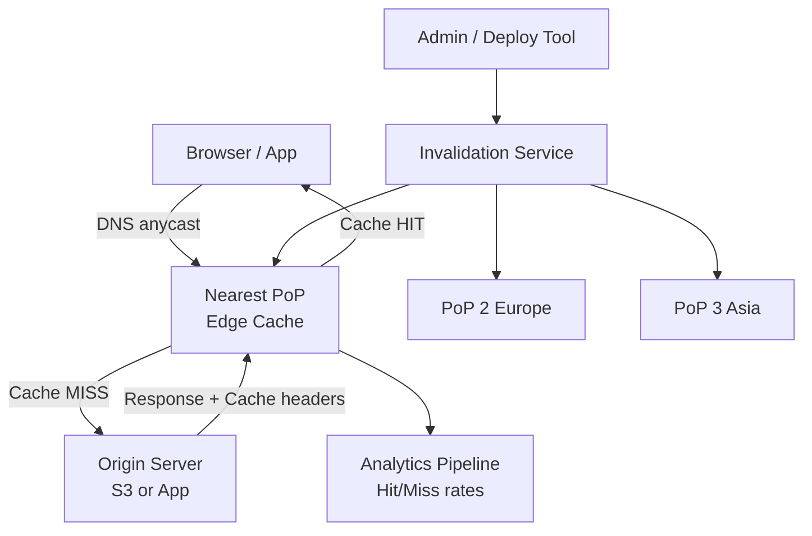

# Design a Content Delivery Network (CDN)

**Difficulty**: 🔴 Advanced
**Reading Time**: Coming Soon
**Interview Frequency**: High

---

> 🚧 **Full article coming soon.** This stub gives you the essentials to start thinking about this problem.

---

## The Core Problem

Serving 10 petabytes per day of static content from 200 Points of Presence (PoPs) worldwide with 99.99% availability requires solving routing (how does a user's DNS resolve to the nearest PoP?), caching (what gets cached for how long?), and invalidation (how do you purge content from 200 PoPs in under 30 seconds?) simultaneously.

## Functional Requirements

- Serve static content (images, JS, CSS, videos) from edge locations near users
- Reduce origin load by >95% through caching
- Support on-demand cache invalidation (purge by URL or tag)
- Provide SSL termination at edge
- Collect analytics on cache hit/miss rates per PoP

## Non-Functional Requirements

| Requirement | Target |
|-------------|--------|
| Cache hit ratio | > 95% for static assets |
| Latency | < 10ms from user to nearest PoP |
| Availability | 99.99% (52 min/year) |
| Invalidation propagation | < 30 seconds to all 200 PoPs |

## Back-of-Envelope Estimates

- **Daily traffic**: 10PB/day ÷ 86,400 sec = ~116GB/sec aggregate bandwidth
- **Cache storage**: 116GB/sec × 95% hit rate → origin sees 5.8GB/sec; edge cache needs ~10TB SSD per PoP to achieve 95% hit rate
- **Invalidation fan-out**: 1 purge request → 200 PoP API calls → 200 cache flushes, all within 30 seconds

## Key Design Decisions

1. **Anycast DNS for PoP Selection** — all 200 PoPs advertise the same IP range via BGP anycast; user's DNS query automatically routes to nearest PoP based on BGP routing tables; no application-level geography lookup needed.
2. **Origin Pull vs Origin Push** — origin pull: edge fetches from origin on first cache miss, then caches locally; simpler, works for all content; origin push: pre-upload hot content to all PoPs before it's requested; better for known high-traffic events (new product launch).
3. **Surrogate Key / Tag-Based Invalidation** — instead of purging by URL (one at a time), tag all assets related to product_id=123 with "product-123"; purge entire tag with one API call; CDN fans out to flush all matching assets at all PoPs.

## High-Level Architecture

## Top Interview Questions for This Problem

| Question | Tests |
|----------|-------|
| How does anycast routing work and why is it better than GeoDNS for CDN? | BGP anycast, DNS latency |
| How would you invalidate all images for a product that was just updated? | Tag-based invalidation, fan-out |
| How do you handle cache stampede when a popular object's TTL expires at a CDN PoP? | Thundering herd, coalescing requests |

## Related Concepts

- [Web cache edge caching strategies](../01-data-processing/web-cache)
- [Load balancer for in-PoP traffic distribution](./load-balancer)

---

*📚 Full deep-dive with multiple approaches, trade-off tables, and pseudocode coming soon.*

## 📚 Resources & References

| Resource | Type | What You'll Learn |
|----------|------|------------------|
| [System Design Interview — Alex Xu](https://www.amazon.com/System-Design-Interview-insiders-Second/dp/B08CMF2CQF) | 📚 Book | Chapter on CDN design — caching, geo-routing, and push vs pull |
| [ByteByteGo — How CDN Works](https://www.youtube.com/@ByteByteGo) | 📺 YouTube | Search "CDN system design" — PoP placement, anycast routing, cache invalidation |
| [Cloudflare Engineering: How a CDN Works](https://blog.cloudflare.com/how-cloudflares-architecture-allows-us-to-scale-to-stop-the-biggest-attacks-in-history/) | 📖 Blog | Anycast routing and attack mitigation at 200+ Cloudflare PoPs |
| [Akamai: CDN at 2.5 Trillion Daily Interactions](https://www.akamai.com/blog/performance/the-internet-of-things-is-good-for-cdns) | 📖 Blog | How Akamai handles the world's largest content delivery network |
| [Netflix Open Connect: Custom CDN Architecture](https://netflixtechblog.com/how-netflix-works-with-isps-around-the-globe-to-deliver-a-great-viewing-experience-56867cde49da) | 📖 Blog | Netflix's dedicated CDN appliances embedded in ISP networks |
