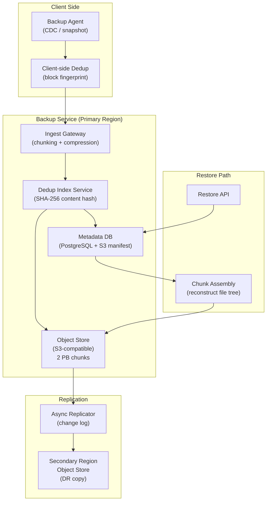
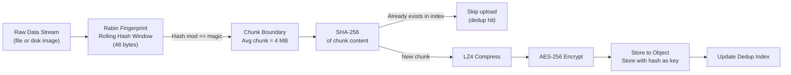

# Design a Cloud Backup System — 100 PB at RPO < 1 Hour

**Difficulty**: 🔴 Advanced
**Reading Time**: 28 minutes
**Interview Frequency**: Medium-High — frequently asked at storage companies, cloud providers, and enterprises

---

## Problem Statement

You are asked to design an enterprise cloud backup system that:

- **Works at**: 1 TB backup with nightly full — a single rsync or cloud snapshot handles it.
- **Breaks at**: 100 PB of enterprise data (VMs, databases, NAS) — nightly fulls take 200+ hours, storage costs become prohibitive, a single region failure makes all backups inaccessible, and restore during disaster takes 24+ hours.

Target SLAs: **RPO < 1 hour** (maximum 1 hour of data loss), **RTO < 4 hours** (back online within 4 hours), **100 PB total data**, **100:1 deduplication ratio for similar VM images**.

---

## Requirements

### Functional Requirements

| Requirement | Description |
|-------------|-------------|
| Backup Scheduling | Full, incremental, and differential backup types |
| Deduplication | Content-addressed dedup across all clients |
| Compression & Encryption | AES-256 encryption, LZ4/Zstd compression |
| Cross-Region Replication | Automatic replication to secondary region |
| Point-in-Time Restore | Restore to any backup point within retention period |
| Retention Policies | Configurable retention (daily 30 days, weekly 1 year, monthly 7 years) |

### Non-Functional Requirements

| Requirement | Target |
|-------------|--------|
| RPO | < 1 hour (incremental every 60 minutes) |
| RTO | < 4 hours (restore 10 TB in 4 hours = 700 MB/s) |
| Deduplication Ratio | > 50:1 for homogeneous VM environments |
| Backup Throughput | 10 TB/hour ingestion per region |
| Storage Efficiency | 100 PB raw → 2 PB stored (50:1 dedup ratio) |

---

## Capacity Estimates

- **100 PB total data**, 50:1 dedup ratio → **2 PB stored**
- **Incremental backup size**: ~1% change rate per hour → 100 PB × 1% = **1 TB new data/hour**
- **Cross-region bandwidth**: 1 TB/hour = **~2.3 Gbps** sustained replication
- **Metadata index size**: 2 PB ÷ 4 MB chunks = 500M chunks × 32 bytes hash = **16 GB metadata index**
- **Restore throughput needed**: 10 TB in 4 hours = **700 MB/s** from object storage

---

## High-Level Architecture

---

## Level 1 — Surface: Backup Type Trade-offs

| Backup Type | Description | Storage Cost | Restore Speed | RPO |
|-------------|-------------|--------------|---------------|-----|
| **Full** | Copy everything | 100% each time | Fast (one set) | Interval between fulls |
| **Incremental** | Copy changed blocks since last backup | ~1% per run | Slow (chain restore) | Interval (e.g., 1h) |
| **Differential** | Changed since last full | Grows over time | Medium (full + one diff) | Interval |
| **Synthetic Full** | Server-side merge of increments | Same as full | Fast | Interval of incrementals |

**Best practice**: Hourly incrementals for RPO < 1h, weekly synthetic full (merge on server without re-reading source data) to keep restore chain short.

---

## Level 2 — Deep Dive: Deduplication Engine

### Content-Addressed Storage with Variable-Length Chunking

Fixed-size chunks (e.g., 4 MB blocks) fail when a byte is inserted — all subsequent blocks shift, destroying dedup hits. **Variable-length chunking (CDC — Content Defined Chunking)** uses a rolling hash to find natural chunk boundaries that survive insertions.

**Dedup ratio by workload type**:
- Homogeneous VMs (same OS base): **100:1** — only diffs between images stored
- Mixed enterprise data: **10–20:1** — documents, email, databases deduplicate well
- Already-compressed data (JPEG, MP4): **1:1** — incompressible, no dedup benefit

### Cross-Region Replication

Only **new unique chunks** are replicated. With 50:1 dedup, 1 TB/hour of source changes → 20 GB/hour of new unique data to replicate → **~45 Mbps** sustained bandwidth (vs. 2.3 Gbps naive approach).

---

## Key Design Decisions

### 1. Client-Side vs. Server-Side Deduplication

| Approach | Bandwidth Saved | CPU Cost | Privacy |
|----------|----------------|----------|---------|
| **Client-side** | Yes — only unique chunks sent | High (on client) | Better (hash only sent to server) |
| **Server-side** | No — full data sent, dedup on ingest | Lower (centralized) | Lower (full data in transit) |
| **Hybrid** | Partial — client sends hash first, server confirms | Medium | Medium |

**Recommendation**: Use hybrid for bandwidth-constrained environments (branch offices). Pure server-side for high-bandwidth data centers.

### 2. Retention Policy and Garbage Collection

Chunks are reference-counted. When a backup manifest is deleted, chunk reference counts decrement. Chunks with count=0 are tombstoned and removed in a background GC job.

GC challenge: Must scan all manifests to verify reference counts — expensive at 500M chunks. **Solution**: Mark-and-sweep GC runs weekly during low-traffic windows. Tombstones collected after 24-hour grace period (protects against concurrent backup sessions).

### 3. Encryption Key Management

| Model | Key Control | Risk |
|-------|-------------|------|
| **Provider-managed** | Cloud provider holds keys | Provider can access data |
| **Customer-managed (BYOK)** | Customer holds master key | Customer responsible for key backup |
| **Client-side encryption** | Keys never leave client | Dedup effectiveness reduced (different keys = no dedup) |

For compliance (HIPAA, GDPR): Use customer-managed keys via KMS with envelope encryption. Dedup still works within a single customer's namespace.

---

## Interview Questions

| Question | What They're Testing | Key Answer Points |
|----------|---------------------|-------------------|
| How do you achieve 50:1 deduplication? | Storage internals | Variable-length chunking (CDC), content-addressed storage, SHA-256 fingerprinting, only new unique chunks stored |
| How do you meet RPO < 1 hour at 100 PB scale? | Scalability and requirements analysis | Incremental backups every 60 min, client-side dedup reduces transfer to ~20 GB/hour, parallel ingestion across many agents |
| What happens if the dedup index is lost? | Failure mode analysis | Index can be rebuilt by scanning all stored chunk manifests (expensive but possible), keep index replicated across AZs |

---

## 📚 Resources & References

| Resource | Type | What You'll Learn |
|----------|------|------------------|
| [AWS Disaster Recovery Strategies](https://aws.amazon.com/blogs/architecture/disaster-recovery-dr-architecture-on-aws-part-i-strategies-for-recovery-in-the-cloud/) | 📖 Blog | RPO/RTO trade-offs, pilot light, warm standby, active-active patterns |
| [Veeam Architecture Guide](https://helpcenter.veeam.com/docs/backup/vsphere/backup_architecture.html) | 📚 Docs | Enterprise backup architecture, dedup internals, synthetic fulls |
| [Designing Data-Intensive Applications](https://www.oreilly.com/library/view/designing-data-intensive-applications/9781491903063/) | 📚 Book | Chapter 5: Replication, Chapter 11: Streaming for backup pipelines |
| [ByteByteGo YouTube](https://www.youtube.com/@ByteByteGo) | 📺 YouTube | Visual explanations of backup and disaster recovery systems |

---

## Related Concepts

- [Disaster Recovery](./disaster-recovery) — backup is one component of the DR strategy
- [Distributed File System](./distributed-file-system) — Lustre/HDFS concepts apply to backup storage
- [Cloud Storage Gateway](./cloud-storage-gateway) — on-premise to cloud tiering uses similar principles
