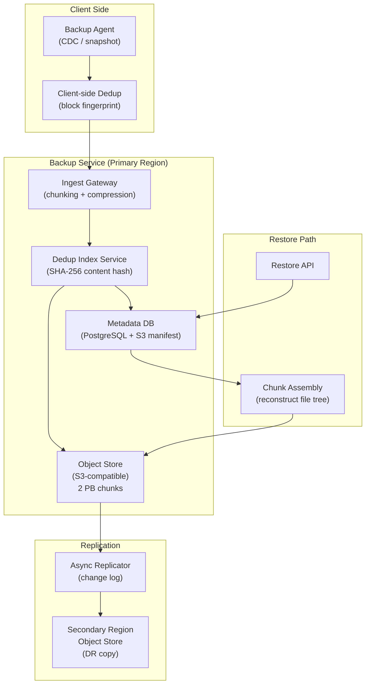
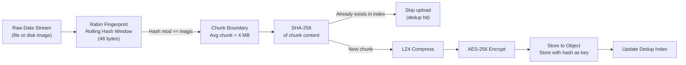
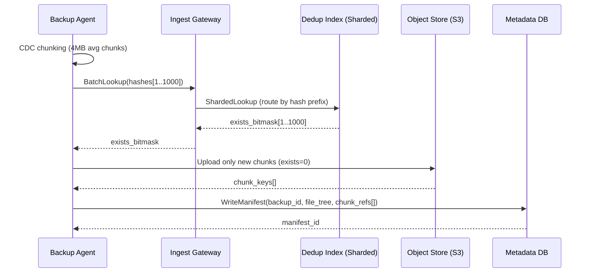
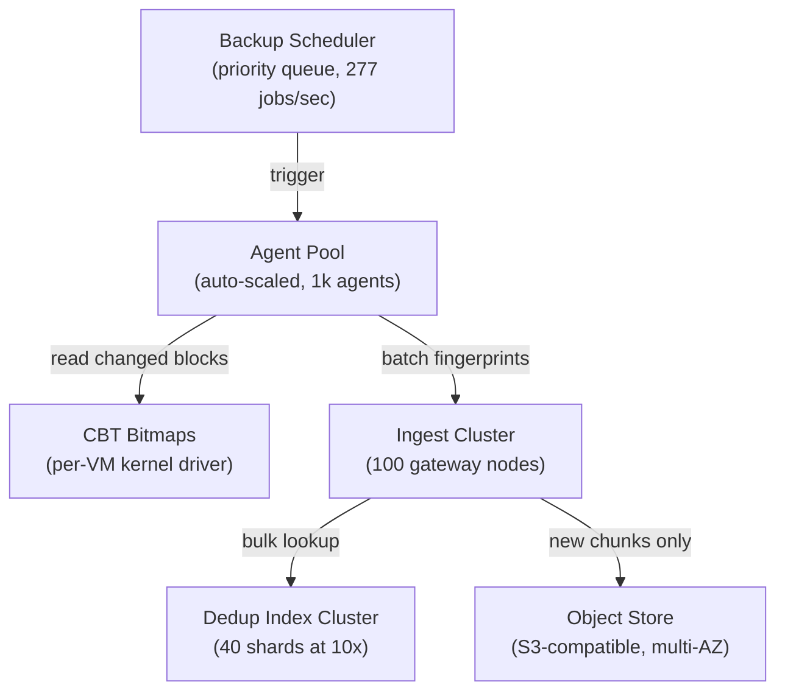

# Design a Cloud Backup System — 100 PB at RPO < 1 Hour

**Difficulty**: 🔴 Advanced
**Reading Time**: 28 minutes
**Interview Frequency**: Medium-High — frequently asked at storage companies, cloud providers, and enterprises

---

## Problem Statement

You are asked to design an enterprise cloud backup system that:

- **Works at**: 1 TB backup with nightly full — a single rsync or cloud snapshot handles it.
- **Breaks at**: 100 PB of enterprise data (VMs, databases, NAS) — nightly fulls take 200+ hours, storage costs become prohibitive, a single region failure makes all backups inaccessible, and restore during disaster takes 24+ hours.

Target SLAs: **RPO < 1 hour** (maximum 1 hour of data loss), **RTO < 4 hours** (back online within 4 hours), **100 PB total data**, **100:1 deduplication ratio for similar VM images**.

---

## Requirements

### Functional Requirements

| Requirement | Description |
|-------------|-------------|
| Backup Scheduling | Full, incremental, and differential backup types |
| Deduplication | Content-addressed dedup across all clients |
| Compression & Encryption | AES-256 encryption, LZ4/Zstd compression |
| Cross-Region Replication | Automatic replication to secondary region |
| Point-in-Time Restore | Restore to any backup point within retention period |
| Retention Policies | Configurable retention (daily 30 days, weekly 1 year, monthly 7 years) |

### Non-Functional Requirements

| Requirement | Target |
|-------------|--------|
| RPO | < 1 hour (incremental every 60 minutes) |
| RTO | < 4 hours (restore 10 TB in 4 hours = 700 MB/s) |
| Deduplication Ratio | > 50:1 for homogeneous VM environments |
| Backup Throughput | 10 TB/hour ingestion per region |
| Storage Efficiency | 100 PB raw → 2 PB stored (50:1 dedup ratio) |

---

## Capacity Estimates

- **100 PB total data**, 50:1 dedup ratio → **2 PB stored**
- **Incremental backup size**: ~1% change rate per hour → 100 PB × 1% = **1 TB new data/hour**
- **Cross-region bandwidth**: 1 TB/hour = **~2.3 Gbps** sustained replication
- **Metadata index size**: 2 PB ÷ 4 MB chunks = 500M chunks × 32 bytes hash = **16 GB metadata index**
- **Restore throughput needed**: 10 TB in 4 hours = **700 MB/s** from object storage

---

## High-Level Architecture



---

## Level 1 — Surface: Backup Type Trade-offs

| Backup Type | Description | Storage Cost | Restore Speed | RPO |
|-------------|-------------|--------------|---------------|-----|
| **Full** | Copy everything | 100% each time | Fast (one set) | Interval between fulls |
| **Incremental** | Copy changed blocks since last backup | ~1% per run | Slow (chain restore) | Interval (e.g., 1h) |
| **Differential** | Changed since last full | Grows over time | Medium (full + one diff) | Interval |
| **Synthetic Full** | Server-side merge of increments | Same as full | Fast | Interval of incrementals |

**Best practice**: Hourly incrementals for RPO < 1h, weekly synthetic full (merge on server without re-reading source data) to keep restore chain short.

---

## Level 2 — Deep Dive: Deduplication Engine

### Content-Addressed Storage with Variable-Length Chunking

Fixed-size chunks (e.g., 4 MB blocks) fail when a byte is inserted — all subsequent blocks shift, destroying dedup hits. **Variable-length chunking (CDC — Content Defined Chunking)** uses a rolling hash to find natural chunk boundaries that survive insertions.



**Dedup ratio by workload type**:
- Homogeneous VMs (same OS base): **100:1** — only diffs between images stored
- Mixed enterprise data: **10–20:1** — documents, email, databases deduplicate well
- Already-compressed data (JPEG, MP4): **1:1** — incompressible, no dedup benefit

### Cross-Region Replication

Only **new unique chunks** are replicated. With 50:1 dedup, 1 TB/hour of source changes → 20 GB/hour of new unique data to replicate → **~45 Mbps** sustained bandwidth (vs. 2.3 Gbps naive approach).

---

## Key Design Decisions

### 1. Client-Side vs. Server-Side Deduplication

| Approach | Bandwidth Saved | CPU Cost | Privacy |
|----------|----------------|----------|---------|
| **Client-side** | Yes — only unique chunks sent | High (on client) | Better (hash only sent to server) |
| **Server-side** | No — full data sent, dedup on ingest | Lower (centralized) | Lower (full data in transit) |
| **Hybrid** | Partial — client sends hash first, server confirms | Medium | Medium |

**Recommendation**: Use hybrid for bandwidth-constrained environments (branch offices). Pure server-side for high-bandwidth data centers.

### 2. Retention Policy and Garbage Collection

Chunks are reference-counted. When a backup manifest is deleted, chunk reference counts decrement. Chunks with count=0 are tombstoned and removed in a background GC job.

GC challenge: Must scan all manifests to verify reference counts — expensive at 500M chunks. **Solution**: Mark-and-sweep GC runs weekly during low-traffic windows. Tombstones collected after 24-hour grace period (protects against concurrent backup sessions).

### 3. Encryption Key Management

| Model | Key Control | Risk |
|-------|-------------|------|
| **Provider-managed** | Cloud provider holds keys | Provider can access data |
| **Customer-managed (BYOK)** | Customer holds master key | Customer responsible for key backup |
| **Client-side encryption** | Keys never leave client | Dedup effectiveness reduced (different keys = no dedup) |

For compliance (HIPAA, GDPR): Use customer-managed keys via KMS with envelope encryption. Dedup still works within a single customer's namespace.

---

## Interview Questions

| Question | What They're Testing | Key Answer Points |
|----------|---------------------|-------------------|
| How do you achieve 50:1 deduplication? | Storage internals | Variable-length chunking (CDC), content-addressed storage, SHA-256 fingerprinting, only new unique chunks stored |
| How do you meet RPO < 1 hour at 100 PB scale? | Scalability and requirements analysis | Incremental backups every 60 min, client-side dedup reduces transfer to ~20 GB/hour, parallel ingestion across many agents |
| What happens if the dedup index is lost? | Failure mode analysis | Index can be rebuilt by scanning all stored chunk manifests (expensive but possible), keep index replicated across AZs |

---

## 📚 Resources & References

| Resource | Type | What You'll Learn |
|----------|------|------------------|
| [AWS Disaster Recovery Strategies](https://aws.amazon.com/blogs/architecture/disaster-recovery-dr-architecture-on-aws-part-i-strategies-for-recovery-in-the-cloud/) | 📖 Blog | RPO/RTO trade-offs, pilot light, warm standby, active-active patterns |
| [Veeam Architecture Guide](https://helpcenter.veeam.com/docs/backup/vsphere/backup_architecture.html) | 📚 Docs | Enterprise backup architecture, dedup internals, synthetic fulls |
| [Designing Data-Intensive Applications](https://www.oreilly.com/library/view/designing-data-intensive-applications/9781491903063/) | 📚 Book | Chapter 5: Replication, Chapter 11: Streaming for backup pipelines |
| [ByteByteGo YouTube](https://www.youtube.com/@ByteByteGo) | 📺 YouTube | Visual explanations of backup and disaster recovery systems |

---

## Component Deep Dive 1: Deduplication Index Service

The Deduplication Index Service is the most critical architectural component in a cloud backup system. Everything else — ingestion throughput, cross-region bandwidth, storage cost — depends on the correctness and performance of this single service.

### How It Works Internally

When the backup agent finishes chunking a file, it sends a batch of chunk fingerprints (SHA-256 hashes, 32 bytes each) to the Dedup Index Service over gRPC. The service performs a bulk lookup against an in-memory hash table backed by persistent storage, and returns a bitmask: bit=1 means "chunk already stored, skip upload," bit=0 means "new chunk, please upload." The agent then uploads only the new chunks to the object store and returns their storage keys to the metadata service.

The index itself is a distributed hash table sharded by the first N bits of the SHA-256 hash. With 500M chunks × 32 bytes = 16 GB of raw index, a single index node can fit the full dataset in RAM at 2024 cloud server prices (64 GB instances cost ~$0.15/hr). At 10x scale (5B chunks, 160 GB), the index must be sharded across 4–8 nodes.

### Why Naive Approaches Fail at Scale

**Approach 1 — Single PostgreSQL table**: A `SELECT EXISTS` query per chunk at 500M chunks takes ~200ms per lookup, capping throughput at 5 lookups/sec per connection. With 10k chunks/second ingestion, you need 2,000 DB connections — connection overhead alone kills performance.

**Approach 2 — Bloom filter only**: A bloom filter allows false positives (claiming a chunk exists when it doesn't). False positives mean skipping uploads silently, producing incomplete backups. Tolerable for cache lookups, catastrophic for backup correctness.

**Correct approach**: In-memory hash table (Redis Cluster or custom) with append-only WAL on NVMe SSDs for durability. Reads are O(1) in-memory, writes are batched and appended to WAL. Recovery after crash replays WAL to rebuild in-memory state.



### Trade-off Table: Dedup Index Implementation Options

| Approach | Lookup Latency | Throughput | Durability | Memory Cost |
|----------|---------------|------------|------------|-------------|
| PostgreSQL B-tree | 5–200ms | 5k ops/sec/node | Strong (WAL) | Low (disk) |
| Redis Cluster | 0.2–1ms | 500k ops/sec | Good (AOF/RDB) | High (full in RAM) |
| Custom WAL + in-memory hashtable | 0.05–0.2ms | 2M ops/sec | Good (replay WAL) | High (full in RAM) |

**Recommendation**: Redis Cluster for teams with operational familiarity; custom in-memory service for maximum throughput (Backblaze B2, Veeam Cloud Connect use custom implementations).

---

## Component Deep Dive 2: Incremental Backup Scheduler and Change Tracking

The scheduler is the component that determines what data to back up on each cycle. At 100 PB scale with a 1-hour RPO, the scheduler must track block-level changes across potentially 100,000+ VMs and physical servers simultaneously.

### Internal Mechanics

**Change Block Tracking (CBT)** is the standard mechanism for VMs (VMware vSphere, Hyper-V). A kernel driver hooks into the storage layer and records which 512-byte or 4KB blocks have been written since the last checkpoint. On backup trigger, the agent queries the CBT bitmap, reads only changed blocks, and sends them for dedup + ingestion.

For physical servers and NAS, **inotify / FSEvents** at the filesystem level tracks changed files. File-level change tracking (vs block-level) is simpler but produces larger incremental sets because a 1-byte change to a 100 MB file adds the entire file to the incremental.

At 100,000 VMs × average 10 GB VM changed per hour = 1 PB/hour raw change volume. With 50:1 dedup, this reduces to 20 TB/hour of new data — still requiring parallel ingestion across hundreds of ingest gateway nodes.

### Scale Behavior at 10x Load

At 10x baseline (1,000,000 VMs, 10 PB raw changes/hour), several components become bottlenecks:

1. **Scheduler fanout**: Triggering 1M backup jobs/hour = 277 jobs/second. A single scheduler node can handle ~10k jobs/second with proper priority queuing, so scheduling itself is not the bottleneck.
2. **Dedup index becomes the bottleneck**: 10x chunks = 5B chunks. Index sharding must expand from 4 to 40 nodes. Consistent hashing ensures minimal rehashing during scale-out.
3. **Metadata DB write amplification**: 1M manifests/hour × average 10k chunk refs per manifest = 10B chunk ref writes/hour. PostgreSQL JSONB or a dedicated manifest store (Apache Cassandra) handles this better than row-per-chunk relational storage.



---

## Component Deep Dive 3: Cross-Region Replication and Consistency

The replication layer ensures that if the primary region becomes unavailable, all backups taken up to the RPO boundary can be restored from the secondary region. This requires more than simple S3 cross-region replication — the metadata DB must also be consistent with the object store in the secondary region.

### Specific Technical Decisions

**Problem**: Object store replication (S3 CRR) is asynchronous. If a backup manifest is written to the primary region metadata DB but the referenced chunks have not yet replicated to the secondary region, a restore attempt from the secondary will fail with missing chunks.

**Solution — Write-ahead replication ordering**:
1. Chunks are replicated first, confirmed by the secondary object store.
2. Only after chunk replication confirmation does the metadata DB write the manifest as "replicated: true."
3. The secondary region's manifest index only exposes backups where "replicated: true" to prevent partial restores.

This adds approximately 500ms–2s of latency to the backup commit but ensures restore consistency.

**RPO calculation with async replication**: If replication lag is P99 = 5 minutes, and incremental backups run every 60 minutes, effective RPO = 60 minutes + 5 minutes replication lag = 65 minutes. For strict RPO < 60 minutes, synchronous replication to secondary (higher write latency, ~+30ms cross-region) or reduce incremental interval to 50 minutes.

| Replication Mode | RPO Impact | Write Latency | Bandwidth Cost |
|-----------------|-----------|---------------|----------------|
| Async (S3 CRR default) | RPO + replication lag (P99 ~5 min) | None | Low (background) |
| Sync (dual-write) | RPO exactly = backup interval | +20–50ms cross-region | Same |
| Semi-sync (ack after 1 region confirms) | RPO = backup interval, lag acceptable | +5ms | Same |

---

## Data Model

The data model has three primary entities: backup jobs, file manifests, and chunk references.

```sql
-- Backup job tracking
CREATE TABLE backup_jobs (
  job_id          UUID PRIMARY KEY DEFAULT gen_random_uuid(),
  client_id       UUID NOT NULL,                    -- customer tenant
  source_host     VARCHAR(255) NOT NULL,            -- VM name / hostname
  backup_type     ENUM('full','incremental','differential','synthetic_full'),
  started_at      TIMESTAMPTZ NOT NULL,
  completed_at    TIMESTAMPTZ,
  status          ENUM('running','completed','failed','cancelled'),
  source_size_bytes  BIGINT,                        -- raw data scanned
  transferred_bytes  BIGINT,                        -- unique bytes uploaded
  dedup_ratio     NUMERIC(6,2),                     -- source / transferred
  manifest_id     UUID,                             -- FK to backup_manifests
  region          VARCHAR(64) NOT NULL,
  replicated      BOOLEAN DEFAULT FALSE,            -- secondary confirmed
  INDEX idx_backup_jobs_client_host (client_id, source_host, started_at DESC)
);

-- File tree manifest (stored as JSONB or separate rows)
CREATE TABLE backup_manifests (
  manifest_id     UUID PRIMARY KEY,
  job_id          UUID NOT NULL REFERENCES backup_jobs(job_id),
  client_id       UUID NOT NULL,
  root_path       TEXT NOT NULL,                   -- '/' or 'C:\' or '/vmfs/...'
  total_files     INT,
  total_chunks    INT,
  created_at      TIMESTAMPTZ NOT NULL,
  retention_class ENUM('daily','weekly','monthly','yearly'),
  expires_at      TIMESTAMPTZ,                      -- GC deletes after this
  INDEX idx_manifests_client_expires (client_id, expires_at)
);

-- Chunk registry (the dedup index — can be in Redis or separate DB)
CREATE TABLE chunks (
  chunk_hash      CHAR(64) PRIMARY KEY,            -- SHA-256 hex, 64 chars
  size_bytes      INT NOT NULL,                     -- original uncompressed
  compressed_size INT NOT NULL,
  object_key      VARCHAR(512) NOT NULL,            -- s3://bucket/sha256[0:2]/sha256[2:4]/sha256
  uploaded_at     TIMESTAMPTZ NOT NULL,
  ref_count       INT NOT NULL DEFAULT 1,          -- GC reference counting
  replicated_at   TIMESTAMPTZ                       -- NULL = not yet replicated
);

-- Per-manifest chunk references (for GC and restore)
CREATE TABLE manifest_chunks (
  manifest_id     UUID NOT NULL REFERENCES backup_manifests(manifest_id),
  chunk_hash      CHAR(64) NOT NULL REFERENCES chunks(chunk_hash),
  file_path       TEXT NOT NULL,                    -- file this chunk belongs to
  offset_in_file  BIGINT NOT NULL,                  -- byte offset for assembly
  sequence_num    INT NOT NULL,                     -- ordering within file
  PRIMARY KEY (manifest_id, file_path, sequence_num),
  INDEX idx_mc_manifest (manifest_id)
);

-- Retention policy configuration per client
CREATE TABLE retention_policies (
  policy_id       UUID PRIMARY KEY,
  client_id       UUID NOT NULL,
  daily_retain    INT DEFAULT 30,                   -- days
  weekly_retain   INT DEFAULT 52,                   -- weeks
  monthly_retain  INT DEFAULT 84,                   -- months (7 years)
  yearly_retain   INT DEFAULT 7,
  INDEX idx_retention_client (client_id)
);
```

**Object store key convention**: `s3://tenant-{client_id}/chunks/{sha256[0:2]}/{sha256[2:4]}/{sha256_full}.lz4.enc` — first 4 hex chars provide ~65k prefix directories to avoid S3 list performance issues above 1M keys per prefix.

---

## Scale Bottlenecks

| Traffic Level | Component That Breaks | Symptoms | Mitigation |
|---------------|----------------------|----------|------------|
| 10x baseline (1M VMs, 10 PB raw/hr) | Dedup Index (40 shards needed vs 4) | Lookup latency spikes > 5ms, throughput cap at 50k/sec per node | Consistent hash sharding, scale-out to 40 index nodes |
| 10x baseline | Metadata DB write rate | Manifest commit backlog, backup jobs stall at finalize step | Migrate from PostgreSQL to Cassandra for manifest_chunks (write-optimized LSM) |
| 100x baseline (10M VMs) | Ingest Gateway TLS termination | CPU-bound at ~200k TLS handshakes/sec per node | Offload TLS to hardware NICs (DPDK) or dedicated TLS proxy tier |
| 100x baseline | Cross-region bandwidth (200 Gbps needed) | Replication lag grows from 5 min to 50 min, RPO SLA breach | Deduplicate before replication (enforce at chunk level), compress replication stream, use WAN optimizer |
| 1000x baseline (100M VMs) | Scheduler job queue | 2,770 jobs/sec overwhelms single priority queue, jobs delayed by hours | Partition scheduler by client_id across 100 scheduler nodes, use distributed queue (Apache Kafka) |
| 1000x baseline | GC reference counting | Weekly GC scan takes > 7 days (longer than GC window) | Shard GC by chunk_hash prefix, run 100 parallel GC workers, switch to log-structured storage that handles compaction |

---

## How Dropbox Built Their Backup and Storage System

Dropbox's transition from AWS S3 to their own object storage system, codenamed **Magic Pocket**, is one of the most documented large-scale storage migrations in the industry. By 2016, Dropbox was storing over **500 PB of user data** (files, not just backups) and moved the vast majority off AWS S3 onto their own infrastructure — saving hundreds of millions of dollars annually.

**Specific technology choices:**

- **Block storage format**: Dropbox split every user file into 4 MB blocks (fixed-size, not CDC). They chose fixed-size for operational simplicity and because user files (documents, photos) have different change patterns than VM disk images — CDC's main benefit (surviving byte insertions) matters more for sequential disk images than for named files.
- **Deduplication scope**: Per-user dedup only, not cross-user dedup. Cross-user dedup introduces legal risk (can a provider prove no user data is shared across tenant boundaries?) and compliance complications. Per-user dedup still achieves good ratios for repeated file versions.
- **Erasure coding**: Rather than 3-replica storage (3x cost), Magic Pocket uses **Reed-Solomon erasure coding** (14+3 configuration: data split into 14 shards, 3 parity shards, any 14 of 17 can reconstruct). This reduces storage overhead from 3x to 1.21x — a massive cost saving at 500 PB scale.
- **Infrastructure scale**: Magic Pocket runs across Dropbox's own data centers with custom-designed storage servers (OCP form factor, 72 TB raw HDD per 1U server), and as of 2016 stored 90% of Dropbox data with 99.9999999% (9 nines) durability.
- **Non-obvious architectural decision**: Dropbox chose **zone-aware erasure coding** where the 14+3 shards are distributed across 3 failure zones such that any single zone failure leaves 11+ shards available (14 needed for reconstruction). This is stricter than typical erasure-coding deployments that only guarantee durability, not availability during zone failure.

Source: [Dropbox Magic Pocket Blog (2016)](https://dropbox.tech/infrastructure/inside-the-magic-pocket)

---

## Interview Angle

**What the interviewer is testing:** Whether the candidate understands that "backup" is fundamentally a data pipeline problem — not just "copy files to S3" — and can reason about the interplay between deduplication, chunking strategy, metadata consistency, and cross-region ordering guarantees.

**Common mistakes candidates make:**

1. **Proposing nightly full backups**: Candidates say "take a full snapshot every night" without recognizing this requires 100+ hours for 100 PB and produces storage proportional to data size × backup count. Correct answer is incremental + synthetic full on server side.

2. **Ignoring the dedup index durability problem**: Candidates design a dedup index but don't address what happens when the index is lost. Without the index, stored chunks become orphaned (no way to know what's referenced). Correct answer: index is rebuilt from scanning all manifests (expensive but deterministic), plus index is replicated across AZs.

3. **Conflating RPO and RTO**: Many candidates use these interchangeably. RPO is about data loss (how old can the restored data be?); RTO is about downtime (how long until the system is back online?). They require completely different mechanisms — RPO is solved by backup frequency, RTO is solved by restore throughput and pre-provisioned infrastructure.

**The insight that separates good from great answers:** Understanding that **cross-region replication ordering must be chunk-first, manifest-second**. A naive implementation replicates the metadata manifest and object chunks in parallel; if the primary region fails between the two, the secondary has manifests pointing to chunks that don't exist yet. Chunk replication must complete before the manifest is committed as "restorable" in the secondary region — this is identical to the WAL-first principle in databases.

---

## Key Numbers to Remember

| Metric | Value | Context |
|--------|-------|---------|
| CDC average chunk size | 4 MB (min 1 MB, max 16 MB) | Rabin fingerprint rolling hash, 48-byte window |
| SHA-256 fingerprint size | 32 bytes | 500M chunks × 32B = 16 GB index fits in RAM |
| Dedup ratio — homogeneous VMs | 100:1 | Same OS base image, only diffs stored |
| Dedup ratio — mixed enterprise | 10–20:1 | Documents, email, databases |
| Dedup ratio — already-compressed | 1:1 | JPEG, MP4, zip files — no dedup benefit |
| Ingest throughput target | 10 TB/hour | = 2.8 GB/sec sustained ingestion per region |
| Cross-region bandwidth (with dedup) | ~45 Mbps | 1 TB/hr raw → 20 GB/hr unique → ~45 Mbps at 50:1 ratio |
| Restore throughput needed | 700 MB/sec | 10 TB restore in 4 hours (RTO target) |
| GC cycle frequency | Weekly | Mark-and-sweep of ref_count=0 chunks |
| Tombstone grace period | 24 hours | Protects against concurrent backup sessions during GC |
| Dropbox Magic Pocket erasure coding overhead | 1.21x | Reed-Solomon 14+3, vs 3x for triple replication |
| Metadata index size at 100 PB | 16 GB | 500M chunks × 32 bytes per SHA-256 fingerprint |

---

## Restore Path Deep Dive

The restore path is almost always the afterthought in backup design — until disaster strikes and a 4-hour RTO becomes a 36-hour outage. Restore correctness and speed deserve the same architectural attention as ingestion.

### Restore Mechanics: Chunk Reassembly

To restore a file, the system must:
1. Look up the backup manifest for the requested point-in-time (backup_job_id or timestamp).
2. Traverse the file tree in the manifest to find the list of (chunk_hash, offset_in_file, sequence_num) rows for each file.
3. Fetch each unique chunk from the object store (many files share chunks due to dedup — fetch once, apply to all).
4. Decrypt (AES-256-GCM) and decompress (LZ4) each chunk.
5. Write chunks to the restore target in offset order.

**Parallelism is critical**: Fetching 10 TB at 700 MB/sec requires ~500 concurrent object-store requests (each at ~10 MB effective throughput, limited by S3 per-object GET rate of ~1.4 GB/s per prefix shard). The restore agent must parallelize chunk fetches aggressively.

**Dedup benefit during restore**: If 100 VMs share the same OS base chunks, a full restore of all 100 VMs fetches the base chunks only once from object storage (they're the same chunk_hash). Subsequent VMs assemble from local cache. This can reduce restore bandwidth by 50–80x for homogeneous VM fleets.

### Restore Tiering: Hot vs Cold Chunks

Not all backup generations are equally likely to be restored. A tiered storage strategy reduces cost without sacrificing RTO:

| Tier | Storage Class | Retrieval Latency | Cost | Use Case |
|------|--------------|-------------------|------|----------|
| Hot (last 7 days) | S3 Standard / NVMe | Immediate (< 1ms) | ~$0.023/GB/month | Primary recovery target, most restores |
| Warm (8–90 days) | S3 Standard-IA | Immediate (< 1ms) | ~$0.0125/GB/month | Monthly recovery, ransomware rollback |
| Cold (91 days – 7 years) | S3 Glacier Instant | Milliseconds | ~$0.004/GB/month | Compliance / long-term audit restores |
| Archive (7+ years) | S3 Glacier Deep Archive | 12 hours | ~$0.00099/GB/month | Legal hold, regulated industries |

**RTO impact**: If a ransomware attack requires restoring 30-day-old backups from Warm tier, RTO is not impacted (Instant Retrieval). If compliance requires restoring a 10-year-old archive, plan for 12-hour retrieval + 4-hour reassembly = 16-hour RTO, which should be documented in the DR plan.

### Partial Restore and Granular Recovery

Enterprise workloads need granular restore — not just "restore the entire VM" but "restore this database table" or "restore this specific file from 3 days ago." The metadata model must support this:

- **File-level restore**: Traverse manifest for a single file_path, fetch only its chunks. For a 1 GB file from a 10 TB VM backup, fetch 250 chunks instead of 2.5M chunks.
- **Application-consistent restore**: For databases (SQL Server, Oracle), the backup agent captures a VSS/application snapshot to ensure transaction consistency at backup time. Restore must replay transaction logs forward from the last consistent snapshot.
- **Bare-metal restore**: Restore entire disk image to new hardware. Requires bootloader and partition table chunks — the manifest must capture disk geometry metadata alongside file tree metadata.

---

## Encryption and Key Management Deep Dive

At 100 PB with multi-tenant data, encryption is not optional — and the key management architecture directly affects deduplication effectiveness and compliance posture.

### Envelope Encryption Pattern

Every chunk is encrypted with a unique **Data Encryption Key (DEK)** generated per backup job. The DEK is itself encrypted by the customer's **Key Encryption Key (KEK)** stored in a KMS (AWS KMS, Azure Key Vault, or HashiCorp Vault). The encrypted DEK is stored alongside the backup manifest.

```
chunk_ciphertext = AES-256-GCM(chunk_plaintext, DEK)
encrypted_DEK    = KMS.Encrypt(DEK, customer_KEK_id)
manifest.dek     = encrypted_DEK
```

**Why this preserves deduplication**: All chunks from the same customer are encrypted with the same DEK (per backup job or per day). The dedup fingerprint (SHA-256) is computed on the **plaintext chunk before encryption**, so identical plaintext blocks produce the same fingerprint and deduplicate correctly — even though the stored ciphertext uses the same DEK. Cross-customer dedup is intentionally impossible (different KEKs, different DEKs).

### Key Rotation

When a customer rotates their KEK, the service must re-encrypt all DEKs without re-encrypting or re-uploading any actual chunk data. This is a metadata-only operation:

1. Fetch all manifest records for the customer.
2. For each manifest: decrypt encrypted_DEK using old KEK, re-encrypt DEK using new KEK.
3. Write updated encrypted_DEK back to manifest.

At 1M manifests per customer, this operation touches only ~50 MB of metadata (50 bytes per DEK), not the 2 PB of chunk data.

---

## 📚 Resources & References

| Resource | Type | What You'll Learn |
|----------|------|------------------|
| [AWS Disaster Recovery Strategies](https://aws.amazon.com/blogs/architecture/disaster-recovery-dr-architecture-on-aws-part-i-strategies-for-recovery-in-the-cloud/) | 📖 Blog | RPO/RTO trade-offs, pilot light, warm standby, active-active patterns |
| [Veeam Architecture Guide](https://helpcenter.veeam.com/docs/backup/vsphere/backup_architecture.html) | 📚 Docs | Enterprise backup architecture, dedup internals, synthetic fulls |
| [Designing Data-Intensive Applications](https://www.oreilly.com/library/view/designing-data-intensive-applications/9781491903063/) | 📚 Book | Chapter 5: Replication, Chapter 11: Streaming for backup pipelines |
| [Dropbox Magic Pocket](https://dropbox.tech/infrastructure/inside-the-magic-pocket) | 📖 Blog | How Dropbox built 500 PB storage with Reed-Solomon erasure coding |
| [ByteByteGo YouTube](https://www.youtube.com/@ByteByteGo) | 📺 YouTube | Visual explanations of backup and disaster recovery systems |

---

## Failure Modes and Mitigations

Understanding how each component fails in production separates a theoretical design from a production-ready one.

| Failure | Component | Detection | Recovery | Prevention |
|---------|-----------|-----------|----------|------------|
| Dedup index node crash | Dedup Index Service | Health check timeout (< 10s) | Replay WAL from NVMe SSD; read-only mode during recovery | Replicate WAL to standby node; recovery < 60s |
| Object store write failure | Ingest Gateway | S3 PutObject 5xx response | Retry with exponential backoff (max 3 attempts), then dead-letter queue for manual inspection | Multi-AZ object store; cross-region fallback bucket |
| Cross-region replication lag > RPO | Replicator | Lag metric > 55 min alert | Throttle new backups to prioritize replication catch-up | Monitor lag per-minute; alert at 30 min, page at 50 min |
| Manifest written but chunks missing | Metadata DB / Replicator | Restore verification job finds missing chunks | Re-upload missing chunks from agent (if still online) or mark manifest as corrupt | Chunk-first, manifest-second ordering; nightly manifest verification scan |
| GC deletes live chunks | GC Service | Restore failures increase, chunk 404 errors in logs | Restore from object store versioning (if enabled) | Tombstone grace period 24h; GC only runs when no active backup jobs overlap |
| Agent CBT bitmap corruption | Backup Agent | CBT query returns error or all-blocks-changed | Fall back to full backup for that VM, reset CBT bitmap | Monitor CBT error rate per agent; auto-full-backup on CBT error |
| Client clock skew | Backup Agent | Manifest timestamps inconsistent | Use server-assigned timestamps, not client timestamps | NTP enforced on all agents; server clock is authoritative for backup timestamps |

### Backup Verification (Often Skipped, Always Critical)

A backup that has never been tested for restore is not a backup — it is a hope. Production backup systems run automated restore verification:

1. **Chunk-level verification**: Nightly job samples 0.1% of stored chunks, downloads and verifies SHA-256 hash matches the stored key. Detects silent bitrot in object storage.
2. **Manifest integrity check**: Weekly scan verifies every chunk reference in every active manifest resolves to an existing object in the store. Catches GC bugs and replication gaps.
3. **Application-level restore test**: Monthly automated restore of a representative VM to an isolated sandbox, verifying the OS boots and application responds. This is the only true end-to-end RTO validation.

These three verification tiers map to different failure classes:
- Chunk-level = storage layer bitrot (hardware failure, cosmic rays on HDDs)
- Manifest integrity = software bugs in GC, replication, or dedup index
- Application restore = integration failure (wrong restore order, missing transaction logs, incompatible software versions)

All three tiers should report to a **Backup Health Dashboard** that gives operators a single-pane view of:
- Percent of backup jobs completed on schedule (target: > 99.5%)
- Average dedup ratio per client (detect anomalies like ransomware encrypting data, which destroys dedup ratio overnight — a dedup ratio drop from 50:1 to 1:1 for a VM is a ransomware early-warning signal)
- Replication lag P50 / P99 / max
- GC queue depth (chunks pending deletion)
- Last successful automated restore test per client

---

## Capacity Planning Reference

| Scale | VMs | Raw Data | Stored (50:1) | Index RAM | Ingest Nodes | Dedup Shards |
|-------|-----|----------|----------------|-----------|--------------|--------------|
| Small | 1,000 | 1 PB | 20 TB | 320 MB | 2 | 1 |
| Medium | 10,000 | 10 PB | 200 TB | 3.2 GB | 20 | 4 |
| Large | 100,000 | 100 PB | 2 PB | 16 GB | 200 | 8 |
| XL | 1,000,000 | 1 EB | 20 PB | 160 GB | 2,000 | 40 |

Rule of thumb: add 1 dedup index shard per 12.5 TB of stored unique data (to keep each shard under 2 GB of RAM for hot-path lookups).

Storage cost estimate at Large scale (2 PB stored):
- S3 Standard (hot 7 days): 2 PB × 7/365 × $0.023/GB = ~$9,000/month
- S3 Standard-IA (8–90 days): 2 PB × 83/365 × $0.0125/GB = ~$58,000/month
- S3 Glacier Instant (91 days – 7 years): 2 PB × $0.004/GB = ~$8,200/month
- Total storage (excluding transfer): ~$75,000/month for 100 PB raw, 2 PB stored

---

## Related Concepts

- [Disaster Recovery](./disaster-recovery) — backup is one component of the DR strategy
- [Distributed File System](./distributed-file-system) — Lustre/HDFS concepts apply to backup storage
- [Cloud Storage Gateway](./cloud-storage-gateway) — on-premise to cloud tiering uses similar principles
