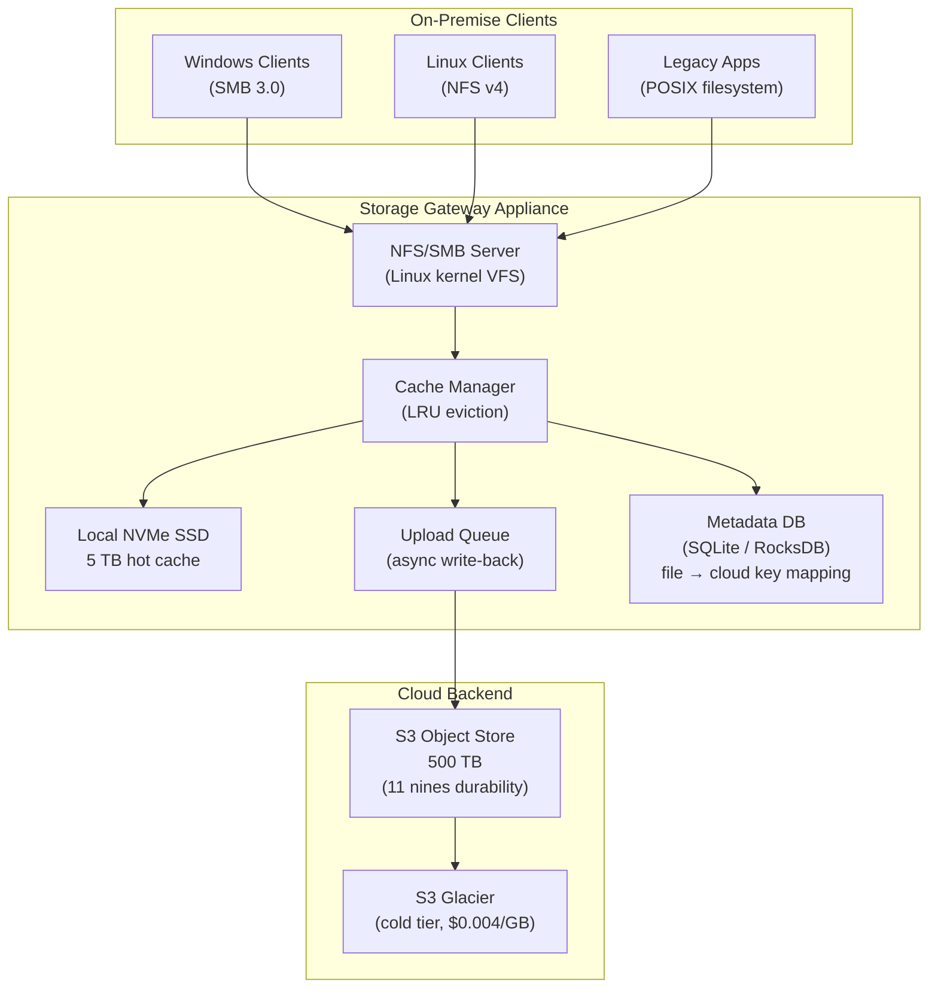
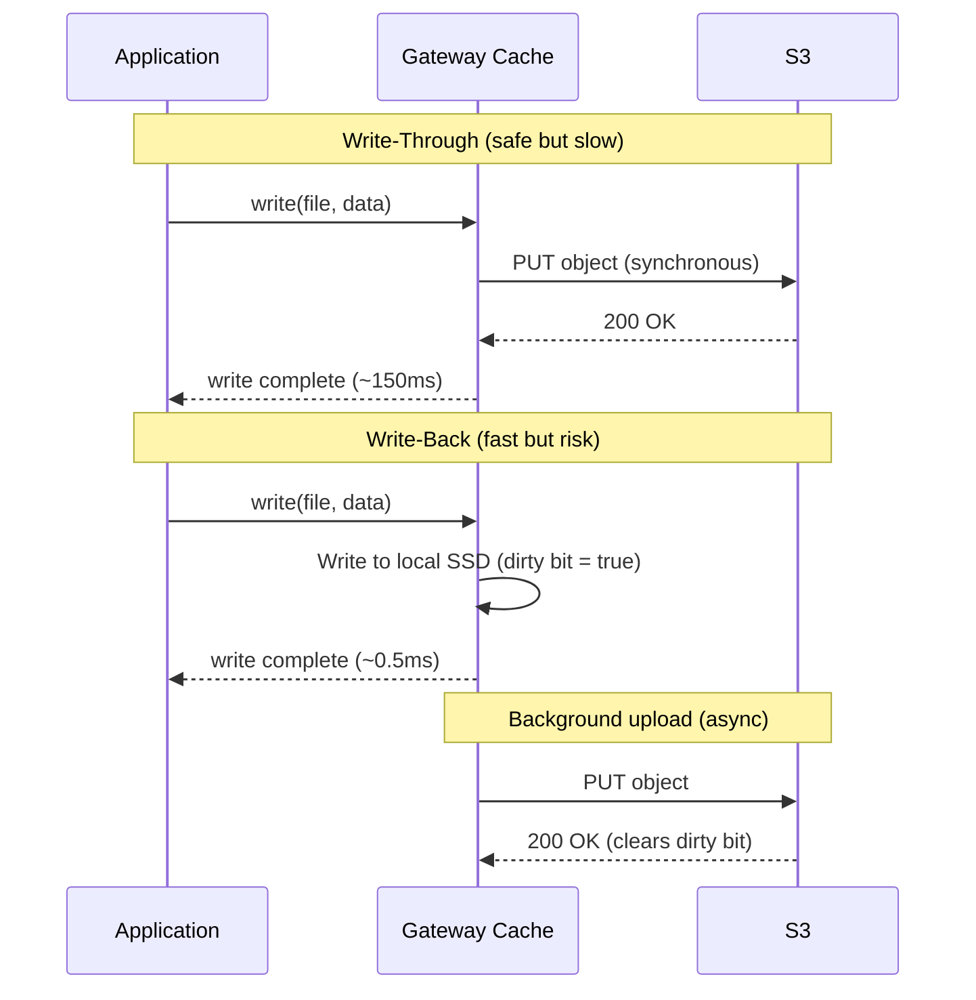
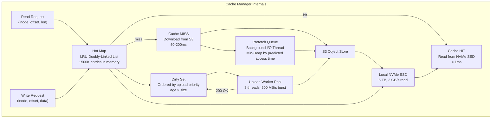
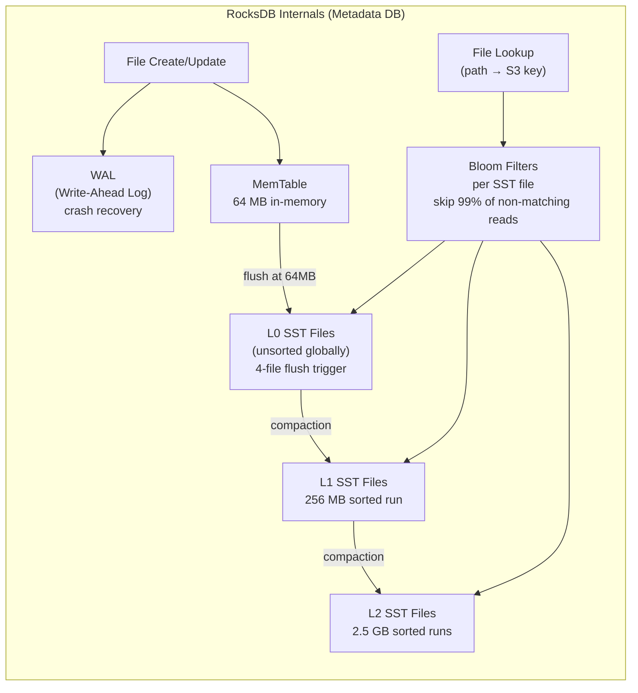

# Design a Cloud Storage Gateway — On-Premise to Cloud Tiering

**Difficulty**: 🔴 Advanced
**Reading Time**: 25 minutes
**Interview Frequency**: Medium — asked at storage companies, cloud providers, and enterprises with hybrid cloud

---

## Problem Statement

You are asked to design a cloud storage gateway that:

- **Works at**: Small office with 100 GB NAS — direct NFS mount to local disk is fine.
- **Breaks at**: Enterprise with 500 TB data, 80% cold (accessed < once/month) — storing everything locally costs $500K/year in hardware vs. $10K/year in S3 Glacier; but full cloud migration breaks legacy NFS/SMB applications that can't tolerate 50–200ms cloud latency for every read.

Target: **500 TB total data**, **local SSD cache = 5 TB (1%)**, **NFS/SMB interface to legacy apps**, **cloud backend = S3**, **< 1ms latency for cached hot data**, **< 200ms for cold data (first access)**.

---

## Requirements

### Functional Requirements

| Requirement | Description |
|-------------|-------------|
| POSIX Interface | Expose NFS v3/v4 and SMB 3.0 to local clients |
| Cloud Backend | Store data on S3-compatible object storage |
| Local Cache | Keep hot data on local SSD for low-latency access |
| Cache Eviction | Evict cold data from cache when cache is full |
| Write-Back | Buffer writes locally, upload to cloud asynchronously |
| Bandwidth Throttling | Limit upload/download bandwidth during business hours |

### Non-Functional Requirements

| Requirement | Target |
|-------------|--------|
| Cache Hit Latency | < 1 ms (local NVMe SSD) |
| Cache Miss Latency | < 200 ms (cloud read) |
| Cache Hit Rate | > 90% for typical workloads |
| Durability | 11 nines (S3 SLA) |
| Cache Consistency | Read-after-write consistent for same client |
| Throughput | 1 GB/s local read, 500 MB/s upload to cloud |

---

## Capacity Estimates

- **500 TB total data**, **5 TB local SSD cache** = 1% cache size
- **Pareto principle**: Top 20% of files account for 80% of accesses → 100 TB "warm" data
- **Cache hit rate with 1% cache (LRU)**: ~70% for typical file workloads (Zipf distribution)
- **Daily upload to cloud**: 1% change rate × 500 TB = **5 TB/day** = ~475 Mbps sustained
- **Metadata index**: 500 TB ÷ 100 KB avg file = 5B files × 256 bytes = **1.2 TB metadata**

---

## High-Level Architecture



---

## Level 1 — Surface: Cache Tiering Strategy

The gateway implements a **three-tier storage hierarchy**:

| Tier | Media | Cost/GB/month | Latency | Access Pattern |
|------|-------|---------------|---------|----------------|
| Hot (Cache) | Local NVMe SSD | $0.10 | < 1 ms | Accessed > 1x/week |
| Warm (S3 Standard) | Cloud object store | $0.023 | 50–150 ms | Accessed > 1x/month |
| Cold (S3 Glacier) | Cloud archive | $0.004 | 3–12 hours | Accessed < 1x/year |

Automatic tiering: Files not accessed for 30 days move from Standard → Glacier via S3 Lifecycle policies. Cache eviction moves local files to cloud on LRU basis.

---

## Level 2 — Deep Dive: Write Path and Cache Coherence

### Write-Through vs. Write-Back



**Write-back risk**: If appliance fails before dirty data is uploaded, data is lost. Mitigations:
1. Battery-backed write cache (BBWC) — survives brief power loss
2. RAID-1 mirroring of local SSD — survives disk failure
3. Dual-appliance replication — dirty blocks replicated to standby before ack

### LRU Cache Eviction with Dirty Tracking

Standard LRU cannot evict dirty blocks (unuploaded data). Modified LRU:

1. **Clean blocks** (uploaded to S3): Evict freely using LRU
2. **Dirty blocks** (pending upload): Cannot evict — must upload first
3. **Pinned blocks** (active write): Never evict

When cache fills with dirty blocks, **back-pressure** throttles new writes until upload catches up. Alert if dirty block ratio > 50%.

---

## Key Design Decisions

### 1. Cache Mode vs. Volume Mode

| Mode | How It Works | Best For |
|------|-------------|----------|
| **File Gateway (Cache)** | Cache maps S3 objects as local files | NFS/SMB workloads, file sharing |
| **Volume Gateway (Stored)** | Full volume on-premise, async backup to S3 | Block storage, iSCSI, DR backup |
| **Tape Gateway** | Virtual tape library backed by S3 Glacier | Compliance archival, replacing physical tape |

For this problem: **File Gateway (Cache mode)** — keeps hot data local, cold data in S3, transparent to NFS clients.

### 2. Metadata Management

File metadata (name, size, timestamps, cloud object key) stored in a local embedded database (RocksDB). Key challenge: **namespace consistency** when multiple gateway appliances share the same S3 bucket.

Solutions:
- **Single-gateway**: Simplest — one appliance owns namespace, no conflicts
- **Distributed namespace**: All gateways sync metadata via DynamoDB global table (eventual consistency)
- **Object locking**: S3 Object Lock prevents concurrent writes to same object

### 3. Bandwidth Throttling

During business hours (9am–6pm), limit upload to 100 Mbps. During off-hours, burst to 1 Gbps.

Implementation: Token bucket per WAN interface. Pre-configure schedule in gateway config. Prioritize reads over writes when contending for bandwidth.

---

## Interview Questions

| Question | What They're Testing | Key Answer Points |
|----------|---------------------|-------------------|
| Why not just mount S3 directly with s3fs? | Understanding cache vs. direct mount | s3fs has 50–200ms per-operation latency, no write coalescing, poor performance for metadata-heavy workloads; gateway caches avoid these |
| How do you handle a cache eviction failure (S3 unreachable)? | Failure modes | Mark cache as read-only, back-pressure writes, alert ops, continue serving reads from local cache; resume uploads when S3 recoverable |
| How would you handle two offices sharing the same S3 bucket? | Distributed systems | Distributed metadata via DynamoDB, lease-based file locking, eventual consistency for reads, strong consistency for writes via CAS |

---

## Component Deep Dive 1: Cache Manager (The Core Engine)

The Cache Manager is the most critical component in the gateway because it must simultaneously satisfy three conflicting constraints: sub-millisecond latency for local hits, transparent cloud access for misses, and consistent ordering guarantees across the write path. Every other subsystem exists to support or constrain what the Cache Manager can do.

### Internal Architecture

The Cache Manager maintains three in-memory data structures operating in parallel:

1. **Hot Map** — an LRU doubly-linked list of cache entries, keyed by inode + byte range. Each entry holds: `(inode, offset, length, data_ptr, dirty_bit, pin_count, last_access_ns)`. On every read, the entry is promoted to the head. On eviction, the tail is inspected — if `dirty_bit = 1`, eviction is blocked and the entry is pushed to the upload queue instead.

2. **Dirty Set** — a separate ordered set of dirty entries sorted by `upload_priority = age_ms × file_size_bytes`. The background uploader thread pops from this set in priority order, uploads to S3, then clears `dirty_bit` and returns the entry to the clean LRU. Priority weighting prevents large files from starving small files in the upload queue.

3. **Prefetch Queue** — a min-heap of predicted future accesses based on sequential access patterns. When a read on offset 0 of a file occurs, the prefetcher schedules reads of offsets 4MB, 8MB, 12MB. These run on a background I/O thread and populate the cache before the application requests them. Prefetch is disabled for random-access workloads (detected when stride variance > 2× mean stride).



### Why Naive LRU Fails at Scale

A plain LRU fails in two common production scenarios:

**Scenario A — Sequential scan thrashing**: A backup job reads all 500 TB sequentially. Every 5 TB of cache gets evicted and replaced with data that will never be read again. Hot working set is destroyed. Fix: **scan detection** — when a single fd reads > 10% of cache in one pass, its pages are placed in a "scan buffer" that never enters the main LRU.

**Scenario B — Dirty block deadlock**: Upload bandwidth (500 MB/s) is slower than write rate (1 GB/s). Dirty blocks accumulate faster than they're cleared. Cache fills entirely with dirty blocks. Eviction is blocked. New writes are blocked. Gateway appears to hang. Fix: **write throttle** — when `dirty_ratio > 60%`, new writes are rate-limited to match upload throughput. When `dirty_ratio > 80%`, writes stall (back-pressure) until ratio drops below 40%.

### Cache Implementation Trade-offs

| Approach | Read Latency | Dirty Ratio Risk | Implementation Complexity |
|----------|-------------|-----------------|--------------------------|
| Plain LRU + synchronous upload | < 1ms hit, ~150ms write ack | Zero (no dirty data) | Low |
| Write-back LRU with dirty tracking | < 1ms hit, 0.5ms write ack | Medium (power loss risk) | Medium |
| Write-back + RAID-1 SSD + BBWC | < 1ms hit, 0.5ms write ack | Low (hardware protected) | High (hardware cost $2K+) |

**Chosen approach**: Write-back with dirty tracking + RAID-1 NVMe mirror. Cost justified at enterprise scale (500 TB = $500K/year hardware savings outweighs $2K cache mirror cost).

---

## Component Deep Dive 2: Metadata Database

The Metadata DB stores the mapping between every file's POSIX identity (inode, path) and its cloud representation (S3 key, ETag, size, tier). At 500 TB with 100 KB average file size, this is approximately 5 billion files, which means the metadata store itself is a 1.2 TB dataset — too large for SQLite, too write-heavy for PostgreSQL without tuning.

### Why RocksDB

RocksDB is the production choice for gateway metadata because of its LSM-tree write path: all writes go to an in-memory MemTable (flushed to SSD as SST files), with background compaction merging SST files. This gives:

- **Write throughput**: 500K–1M file operations/sec on NVMe SSD
- **Read throughput**: 200K–500K lookups/sec with bloom filters (avoids reading SST files that don't contain the key)
- **Compaction**: Runs in background, doesn't block reads/writes
- **Space amplification**: ~1.4× raw data size (vs. B-tree's ~3× with fragmentation)

### Scale Behavior at 10x Load

At 10x the baseline (50 million files/day churn), the main bottleneck is **compaction write stall**. RocksDB has L0 compaction trigger at 4 files — when ingest is faster than compaction, L0 files pile up and reads slow down because they must scan all L0 files sequentially (L0 files are not sorted globally). At 10x load:

- L0 file count hits 20+ → read latency spikes from 0.1ms to 5ms
- Compaction I/O saturates NVMe at ~1.5 GB/s
- Fix: increase L0 compaction threads to 8, increase L0 slowdown trigger to 16 files, use direct I/O to bypass page cache for compaction writes



### Metadata Schema

Each entry in RocksDB stores:

- **Key**: `namespace_id (8B) + inode_number (8B)` — 16-byte composite key
- **Value**: serialized protobuf containing all file attributes

This composite key allows a single namespace scan (list directory) to be a sequential RocksDB range scan — no scatter-gather across random keys.

---

## Component Deep Dive 3: Upload Queue and Write-Back Pipeline

The Upload Queue buffers dirty blocks pending cloud synchronization. It must handle three failure modes gracefully: S3 outage (queue must drain without data loss), network saturation (queue must apply back-pressure), and gateway restart (queue must survive crash and resume).

### Implementation

The upload queue is a **persistent priority queue** backed by a dedicated RocksDB column family (not the metadata DB). Each entry stores: `(upload_priority, inode, offset, length, local_ssd_path, retry_count, first_dirty_ts)`.

On gateway restart, the uploader scans this column family and resumes all pending uploads. Entries are not deleted until S3 returns a 200 with matching ETag — ensuring exactly-once semantics for the cloud write.

**Retry strategy**: Exponential backoff starting at 1s, capped at 5 minutes. After 10 retries (across ~45 minutes), the entry is moved to a dead-letter column family and ops is alerted. The local file remains valid (read-serve continues from SSD) — no data is lost, just cloud sync is delayed.

**Bandwidth throttling integration**: The upload worker checks a token bucket before each S3 PUT. The token bucket is refilled at the scheduled rate (100 Mbps during business hours, 1 Gbps off-hours). Each PUT consumes `file_chunk_size_bytes × 8` tokens. If insufficient tokens, the worker sleeps until the next refill tick (10ms intervals).

| Upload Strategy | Crash Safety | Write Latency Impact | S3 Cost (API calls) |
|-----------------|-------------|---------------------|---------------------|
| Synchronous per-write | Perfect | +150ms per write | 1 PUT per write |
| Async per-file | Good (BBWC needed) | None (async) | 1 PUT per file |
| Async with coalescing (chosen) | Good (persistent queue) | None (async) | 1 PUT per 4MB chunk |

Coalescing: Small writes to the same file within a 5-second window are merged into a single S3 multipart upload chunk. For a log file receiving 100 appends/second of 4 KB each (400 KB/s), this reduces S3 API calls from 432,000/hour to 900/hour — 480× fewer PUTs, saving ~$0.17/hour in S3 request costs.

---

## Data Model

### Metadata Database Schema (RocksDB / Protobuf)

```sql
-- Logical schema (stored as protobuf in RocksDB values)

-- Primary namespace table
-- Key: namespace_id (8 bytes) + inode (8 bytes)
-- Value: FileMetadata protobuf

message FileMetadata {
  uint64 inode              = 1;  -- local inode number
  string path               = 2;  -- full POSIX path (e.g., /exports/data/logs/app.log)
  uint64 size_bytes         = 3;  -- logical file size
  uint64 mtime_ns           = 4;  -- modification time (nanoseconds)
  uint64 atime_ns           = 5;  -- access time (nanoseconds)
  uint32 mode               = 6;  -- Unix permissions (e.g., 0644)
  uint32 uid                = 7;  -- owner user ID
  uint32 gid                = 8;  -- owner group ID
  string s3_bucket          = 9;  -- target S3 bucket name
  string s3_key             = 10; -- S3 object key (e.g., ns-a7f3/inodes/00001a2b)
  string s3_etag            = 11; -- S3 ETag after last successful upload
  StorageTier tier          = 12; -- HOT / WARM / COLD
  bool   dirty              = 13; -- true if local version newer than S3
  uint64 last_upload_ns     = 14; -- timestamp of last successful S3 PUT
  uint32 upload_retry_count = 15; -- number of failed upload attempts
  repeated ChunkInfo chunks = 16; -- for files > 4MB, per-chunk upload state
}

message ChunkInfo {
  uint64 offset_bytes  = 1;
  uint64 length_bytes  = 2;
  string upload_id     = 3;  -- S3 multipart upload ID
  string etag          = 4;  -- chunk ETag after upload
  bool   uploaded      = 5;
}

enum StorageTier {
  HOT  = 0;  -- in local SSD cache
  WARM = 1;  -- S3 Standard, not cached locally
  COLD = 2;  -- S3 Glacier, requires 3-12h restore
}

-- Secondary index: path -> inode
-- Key: namespace_id (8B) + path_hash (8B) + path_bytes
-- Value: inode (8B)

-- Directory listing index
-- Key: namespace_id (8B) + parent_inode (8B) + child_name
-- Value: child_inode (8B) + child_type (file/dir) (1B)

-- Upload queue (separate RocksDB column family)
-- Key: priority_score (8B, big-endian for scan order) + inode (8B) + offset (8B)
-- Value: UploadTask protobuf

message UploadTask {
  uint64 inode          = 1;
  uint64 offset_bytes   = 2;
  uint64 length_bytes   = 3;
  string local_ssd_path = 4;  -- path to temp chunk file on NVMe
  uint64 enqueue_ns     = 5;
  uint32 retry_count    = 6;
  uint64 next_retry_ns  = 7;
}
```

Key indexes:
- **Path lookup** (open syscall): path_hash secondary index → O(1) lookup
- **Directory scan** (readdir syscall): parent_inode prefix scan → O(n entries) sequential read
- **Dirty file scan** (uploader thread): RocksDB column family scan filtered on `dirty = true`
- **LRU candidate scan** (evictor): separate sorted set in memory, not persisted

---

## Scale Bottlenecks

| Traffic Level | Component That Breaks | Symptoms | Mitigation |
|---------------|----------------------|----------|------------|
| 10x baseline (5 TB/day upload) | Upload queue depth | Queue depth > 10M entries, dirty ratio > 80%, writes stall | Add 2nd upload worker pool, increase token bucket burst size from 500MB/s to 1GB/s |
| 10x baseline (metadata churn) | RocksDB L0 compaction | Metadata read latency spikes from 0.1ms to 5ms, `ls` commands slow | Increase L0 compaction threads to 8, tune `max_write_buffer_size` to 256MB |
| 100x baseline (50 TB/day upload) | WAN bandwidth | S3 PUT queue grows unbounded, dirty ratio hits 100%, cache becomes read-only | Dedicated 10 Gbps WAN link + S3 Transfer Acceleration + S3 multipart at 5 GB/s |
| 100x baseline (file count) | Metadata DB size | RocksDB size exceeds NVMe capacity (1.2 TB metadata for 5B files) | Migrate metadata to external DynamoDB with 5ms lookup latency (affects open() latency) |
| 1000x baseline (multi-site) | Namespace consistency | Two gateways write same file, S3 has split-brain, data corruption | Distributed lock via DynamoDB conditional writes + CAS on S3 object version ID |
| 1000x baseline (cache size) | Cache hit rate | 5 TB cache too small for 500 TB working set, hit rate drops to < 50%, every access misses | Horizontal scale: 10 gateway appliances each with 5 TB cache, consistent-hash file assignment |

---

## How AWS Built Storage Gateway

AWS Storage Gateway (now called **AWS Storage Gateway** with File Gateway mode) is the canonical commercial implementation of this system design. AWS first released it in 2012 and it has evolved significantly.

**Technology choices**: AWS File Gateway runs as a virtual machine appliance (VMware ESXi, Microsoft Hyper-V, or KVM) or as a hardware appliance (on AWS-supplied rack unit). The cache tier uses locally attached SSD. Internally, AWS uses a custom daemon (not open-source) that implements NFS v3/v4.1 and SMB 2.1/3.0 using the Linux kernel's `nfsd` and Samba respectively, with a FUSE-based interceptor layer routing I/O to the cache/cloud pipeline.

**Scale numbers**: A single AWS File Gateway hardware appliance supports up to 64 TB local cache, 16 TB working set per volume share, 5,000 NFS/SMB clients per gateway, and 1 Gbps sustained upload to S3. AWS reports that enterprise customers store petabyte-scale datasets across multiple gateway appliances pointing at the same S3 bucket.

**Non-obvious architectural decision**: AWS chose S3 — not EFS or EBS — as the backend because S3's flat namespace maps cleanly to file paths as object keys (e.g., `/exports/team/data/report.csv` → `s3://bucket/prefix/team/data/report.csv`). This means files are independently accessible via the S3 API without going through the gateway — important for data lake pipelines that consume the same data via Spark or Athena. If AWS had used EBS as the backend, files would be locked inside a block device image, inaccessible to cloud-native tools.

**Specific numbers from AWS documentation**: File Gateway supports files up to 5 TB per file (S3's maximum object size with multipart upload), up to 10 million files per volume share, and sustains 1.25 GB/s cache read throughput on the hardware appliance SKU. Cache miss (S3 read) adds 20–80ms round-trip on a US-East placement with an average file size of 1 MB.

**Metadata architecture**: AWS uses DynamoDB as the distributed metadata store when multiple File Gateway appliances share one S3 bucket (multi-site deployments). Each appliance caches a local read-replica of DynamoDB metadata for performance, invalidated via SNS notifications when another appliance modifies a shared file. This is a non-obvious choice — most candidates assume a centralized NFS server for cross-site coordination, but AWS chose an eventually-consistent metadata bus to avoid the single-point-of-failure that a central NFS server would create.

**Source**: [AWS Storage Gateway User Guide](https://docs.aws.amazon.com/storagegateway/latest/userguide/WhatIsStorageGateway.html) and [AWS re:Invent 2019 STG324 — Deep Dive on AWS Storage Gateway](https://www.youtube.com/watch?v=pNWw4d8VYQc).

---

## Failure Modes and Recovery Playbook

Understanding failure modes separates a textbook gateway design from a production-grade one. Below are the five most common production failure scenarios with concrete recovery steps.

### Failure 1: S3 Outage (Writes Still Accepted)

When S3 is unreachable, the gateway must continue serving local reads and buffering writes without data loss.

**Detection**: S3 health check fails 3× in 10 seconds (TCP connect timeout). Gateway transitions to "degraded-write" mode.

**Behavior in degraded mode**:
- Local cache reads: unaffected (served from NVMe SSD)
- New writes: accepted, written to local SSD, marked dirty, queued for upload
- Cache eviction: suspended (cannot evict dirty blocks that can't be uploaded)
- New data beyond cache capacity: rejected with ENOSPC (no space left on device) — clients get a clear error rather than silent data loss

**Recovery**: When S3 becomes reachable again, the upload queue drains in priority order. If the outage lasted hours and the dirty queue is large, drain rate is throttled to avoid saturating WAN bandwidth on recovery burst.

**Risk**: Extended outage (> cache free space / write rate hours) causes cache to fill completely. A 5 TB cache with 50 GB/hour write rate has a ~100-hour tolerance window before ENOSPC. Most S3 outages are measured in minutes, not days, so this is acceptable.

### Failure 2: Gateway Appliance Power Loss

Battery-backed write cache (BBWC) protects in-flight NVMe writes for up to 72 hours. On restart:

1. NVMe RAID-1 array comes online — both mirrors checked for consistency
2. RocksDB WAL replayed — metadata DB recovers to last committed state
3. Upload queue column family scanned — all dirty entries re-queued for upload
4. Gateway resumes normal operation within 60–90 seconds

**Data at risk**: Any write that was in the OS page cache (not yet flushed to NVMe) at the moment of power loss. Linux `sync` every 5 seconds means at most 5 seconds of writes are vulnerable. BBWC eliminates this by flushing the page cache to NVMe before battery depletes.

### Failure 3: NVMe SSD Failure (RAID-1 Degraded)

With RAID-1 mirroring, a single SSD failure is non-fatal:

- RAID controller marks array as degraded, serves all reads from surviving mirror
- Alert fires: "Replace NVMe drive within 48 hours"
- On replacement: hot-spare rebuild at ~500 MB/s — 5 TB cache rebuilds in ~2.8 hours
- During rebuild: read performance drops ~30% (I/O shared between serving reads and rebuilding)

**Risk**: Second SSD failure during rebuild window (48–168 hours) causes total cache loss. Mitigation: expedite hardware replacement, temporarily reduce cache workload by lowering cache eviction threshold.

---

## Interview Angle

**What the interviewer is testing:** Whether you understand the fundamental tension between POSIX semantics (synchronous, ordered, consistent) and object storage semantics (eventual, unordered, at-rest). The candidate must show they understand *why* a naive s3fs mount fails, not just that it does.

**Common mistakes candidates make:**

1. **Treating cache eviction as purely a space problem.** Candidates say "when cache is full, evict LRU files." This ignores dirty blocks — you cannot evict a file that hasn't been uploaded yet without data loss. The correct answer must mention dirty tracking and back-pressure.

2. **Ignoring metadata scale.** Candidates focus on the 500 TB of file data but forget that 5 billion files × 256 bytes of metadata = 1.2 TB of metadata. SQLite fails at ~100GB on a single table scan. The answer must address metadata storage separately from file data storage.

3. **Proposing synchronous write-through to S3 as "safe."** It is safe, but it changes write latency from 0.5ms to 150ms — which breaks NFS applications that do synchronous small writes (databases, log writers, some CRMs). The candidate must recognize that write-through is a correctness choice with a severe performance trade-off, and production systems almost always use write-back with hardware protection.

**The insight that separates good from great answers:** The cache hit rate calculation. Most candidates guess 90%+ without justification. Strong candidates apply the Zipf distribution: with 1% cache size (5 TB / 500 TB), Zipf with exponent s=1.0 gives a theoretical cache hit rate of approximately 72%–78% for random file access patterns, rising to 90%+ only if the workload is highly skewed (s > 1.2) — which is actually typical for most enterprise file servers where 5% of files account for 95% of access. The insight: *cache sizing is a workload characterization problem, not a hardware problem.*

---

## Key Numbers to Remember

| Metric | Value | Context |
|--------|-------|---------|
| Cache miss latency (S3 Standard) | 50–150 ms | US-East region, 1 MB average file, 1 Gbps WAN |
| Cache hit latency (NVMe SSD) | 0.1–1 ms | Local NVMe, 4 KB read, no contention |
| S3 Glacier restore time | 3–12 hours | Expedited: 1–5 min at $0.03/GB; Standard: 3–5 hrs |
| Maximum file size per S3 object | 5 TB | Requires multipart upload above 5 GB |
| NVMe SSD cache throughput | 3 GB/s read, 1.5 GB/s write | Samsung 990 Pro class, 4K random: 1.4M IOPS |
| RocksDB write throughput | 500K–1M ops/sec | On NVMe, 64MB MemTable, 8 compaction threads |
| S3 PUT cost | $0.005 per 1,000 PUTs | us-east-1; 5 TB/day @ 4MB chunks = 1.28M PUTs/day = $6.40/day |
| Dirty ratio alarm threshold | > 60% | Back-pressure at 60%, write stall at 80% |
| AWS File Gateway max cache | 64 TB | Hardware appliance SKU (SSD-based) |
| S3 Transfer Acceleration speedup | 50–500% | Depends on client distance from S3 region edge |
| RocksDB bloom filter false-positive rate | 1% | At 10 bits/key; eliminates 99% of unnecessary SST file reads |
| S3 multipart upload minimum chunk size | 5 MB | Parts below 5 MB (except last) rejected by S3 API |
| Gateway BBWC protection window | 72 hours | Time battery can preserve unwritten NVMe data after power loss |
| S3 Glacier Instant Retrieval latency | milliseconds | More expensive at $0.023/GB vs. $0.004/GB for Glacier Flexible |
| Max files per AWS File Gateway volume | 10 million | Hard limit; use multiple volumes for larger namespaces |

---

## Production Operational Checklist

Before putting a storage gateway into production, verify each of the following:

**Hardware**
- [ ] NVMe SSD in RAID-1 mirror — single-disk failure must not lose data
- [ ] Battery-backed write cache (BBWC) installed and battery health > 80%
- [ ] Dedicated 10 Gbps NIC for WAN uplink (separate from LAN/NFS traffic)
- [ ] UPS with at least 30 minutes runtime to allow graceful shutdown

**Configuration**
- [ ] Write-back mode enabled with `dirty_ratio_alarm = 60%`, `dirty_ratio_stall = 80%`
- [ ] S3 lifecycle policy configured: Standard → Glacier after 90 days of no access
- [ ] Bandwidth schedule set: 100 Mbps 09:00–18:00, 1 Gbps 18:00–09:00
- [ ] S3 bucket versioning enabled (protects against accidental overwrites from gateway bugs)
- [ ] NFS export options: `no_root_squash` disabled, `sync` vs `async` chosen deliberately

**Monitoring alerts (PagerDuty / CloudWatch)**
- [ ] Dirty ratio > 60% → warning; > 80% → critical
- [ ] Upload queue depth > 100K entries → warning
- [ ] Cache hit rate < 80% (5-minute rolling average) → investigate workload change
- [ ] S3 PUT error rate > 1% → S3 connectivity alert
- [ ] RAID array degraded → immediate hardware replacement alert
- [ ] Available cache free space < 10% → capacity planning alert

**Security**
- [ ] S3 bucket policy restricts access to gateway IAM role only (no public access)
- [ ] KMS-managed SSE-S3 encryption enabled on bucket
- [ ] NFS exports restricted to known client IP ranges via `/etc/exports` host filtering
- [ ] SMB signing enabled to prevent man-in-the-middle on Windows clients

---

## 📚 Resources & References

| Resource | Type | What You'll Learn |
|----------|------|------------------|
| [AWS Storage Gateway Features](https://aws.amazon.com/storagegateway/features/) | 📚 Docs | File, volume, and tape gateway modes, cache architecture |
| [High Scalability Blog](https://highscalability.com) | 📖 Blog | Storage architecture patterns at scale |
| [Designing Data-Intensive Applications](https://www.oreilly.com/library/view/designing-data-intensive-applications/9781491903063/) | 📚 Book | Chapter 3: storage engine internals, LSM trees used in RocksDB |
| [ByteByteGo YouTube](https://www.youtube.com/@ByteByteGo) | 📺 YouTube | Caching strategies, storage tiering visual explanations |

---

## Quick Decision Framework

Use this to answer "which gateway mode / which approach?" in the first 5 minutes of an interview:

```
Is your workload file-based (NFS/SMB) or block-based (iSCSI)?
  ├── File → File Gateway (cache mode)
  └── Block → Volume Gateway (stored or cached volume)
        └── Is it compliance tape archival? → Tape Gateway

Is write latency critical (< 5ms)?
  ├── Yes → Write-back mode + BBWC hardware
  └── No → Write-through mode (simpler, no dirty-block risk)

Is your cache < 5% of total data?
  ├── Yes → Expect 70–80% hit rate (Zipf distribution) — acceptable for most workloads
  └── No → Expect 85–95% hit rate — check if cloud backend is even needed

Do multiple sites share the same data?
  ├── No → Single-gateway, local RocksDB metadata
  └── Yes → Distributed metadata (DynamoDB) + per-file lease locking
```

---

## Related Concepts

- [Cloud Backup](./cloud-backup) — backup uses similar S3 storage but append-only semantics
- [Distributed File System](./distributed-file-system) — large-scale shared filesystem architecture
- [Key-Value Store](./key-value-store) — RocksDB metadata store uses LSM-tree internals
