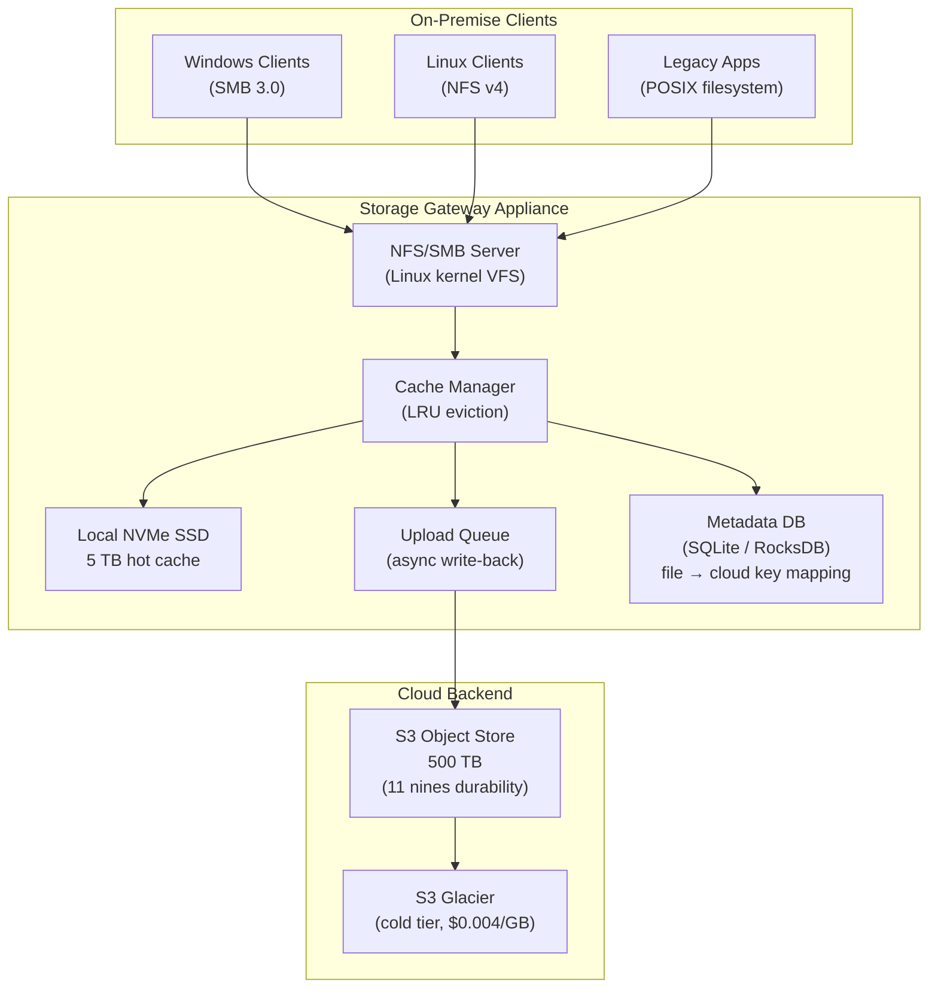
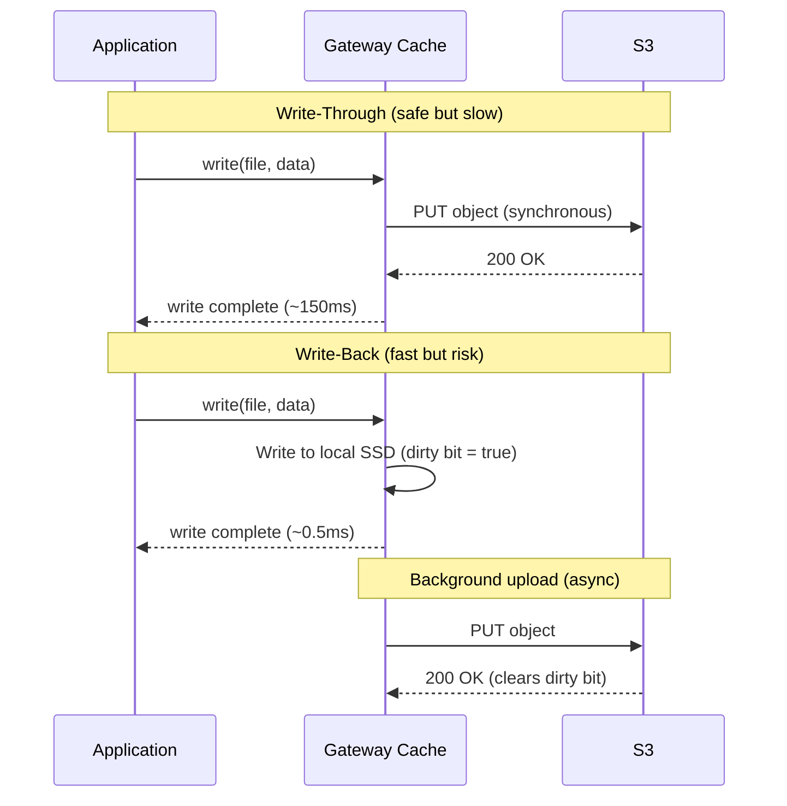

# Design a Cloud Storage Gateway — On-Premise to Cloud Tiering

**Difficulty**: 🔴 Advanced
**Reading Time**: 25 minutes
**Interview Frequency**: Medium — asked at storage companies, cloud providers, and enterprises with hybrid cloud

---

## Problem Statement

You are asked to design a cloud storage gateway that:

- **Works at**: Small office with 100 GB NAS — direct NFS mount to local disk is fine.
- **Breaks at**: Enterprise with 500 TB data, 80% cold (accessed < once/month) — storing everything locally costs $500K/year in hardware vs. $10K/year in S3 Glacier; but full cloud migration breaks legacy NFS/SMB applications that can't tolerate 50–200ms cloud latency for every read.

Target: **500 TB total data**, **local SSD cache = 5 TB (1%)**, **NFS/SMB interface to legacy apps**, **cloud backend = S3**, **< 1ms latency for cached hot data**, **< 200ms for cold data (first access)**.

---

## Requirements

### Functional Requirements

| Requirement | Description |
|-------------|-------------|
| POSIX Interface | Expose NFS v3/v4 and SMB 3.0 to local clients |
| Cloud Backend | Store data on S3-compatible object storage |
| Local Cache | Keep hot data on local SSD for low-latency access |
| Cache Eviction | Evict cold data from cache when cache is full |
| Write-Back | Buffer writes locally, upload to cloud asynchronously |
| Bandwidth Throttling | Limit upload/download bandwidth during business hours |

### Non-Functional Requirements

| Requirement | Target |
|-------------|--------|
| Cache Hit Latency | < 1 ms (local NVMe SSD) |
| Cache Miss Latency | < 200 ms (cloud read) |
| Cache Hit Rate | > 90% for typical workloads |
| Durability | 11 nines (S3 SLA) |
| Cache Consistency | Read-after-write consistent for same client |
| Throughput | 1 GB/s local read, 500 MB/s upload to cloud |

---

## Capacity Estimates

- **500 TB total data**, **5 TB local SSD cache** = 1% cache size
- **Pareto principle**: Top 20% of files account for 80% of accesses → 100 TB "warm" data
- **Cache hit rate with 1% cache (LRU)**: ~70% for typical file workloads (Zipf distribution)
- **Daily upload to cloud**: 1% change rate × 500 TB = **5 TB/day** = ~475 Mbps sustained
- **Metadata index**: 500 TB ÷ 100 KB avg file = 5B files × 256 bytes = **1.2 TB metadata**

---

## High-Level Architecture

---

## Level 1 — Surface: Cache Tiering Strategy

The gateway implements a **three-tier storage hierarchy**:

| Tier | Media | Cost/GB/month | Latency | Access Pattern |
|------|-------|---------------|---------|----------------|
| Hot (Cache) | Local NVMe SSD | $0.10 | < 1 ms | Accessed > 1x/week |
| Warm (S3 Standard) | Cloud object store | $0.023 | 50–150 ms | Accessed > 1x/month |
| Cold (S3 Glacier) | Cloud archive | $0.004 | 3–12 hours | Accessed < 1x/year |

Automatic tiering: Files not accessed for 30 days move from Standard → Glacier via S3 Lifecycle policies. Cache eviction moves local files to cloud on LRU basis.

---

## Level 2 — Deep Dive: Write Path and Cache Coherence

### Write-Through vs. Write-Back

**Write-back risk**: If appliance fails before dirty data is uploaded, data is lost. Mitigations:
1. Battery-backed write cache (BBWC) — survives brief power loss
2. RAID-1 mirroring of local SSD — survives disk failure
3. Dual-appliance replication — dirty blocks replicated to standby before ack

### LRU Cache Eviction with Dirty Tracking

Standard LRU cannot evict dirty blocks (unuploaded data). Modified LRU:

1. **Clean blocks** (uploaded to S3): Evict freely using LRU
2. **Dirty blocks** (pending upload): Cannot evict — must upload first
3. **Pinned blocks** (active write): Never evict

When cache fills with dirty blocks, **back-pressure** throttles new writes until upload catches up. Alert if dirty block ratio > 50%.

---

## Key Design Decisions

### 1. Cache Mode vs. Volume Mode

| Mode | How It Works | Best For |
|------|-------------|----------|
| **File Gateway (Cache)** | Cache maps S3 objects as local files | NFS/SMB workloads, file sharing |
| **Volume Gateway (Stored)** | Full volume on-premise, async backup to S3 | Block storage, iSCSI, DR backup |
| **Tape Gateway** | Virtual tape library backed by S3 Glacier | Compliance archival, replacing physical tape |

For this problem: **File Gateway (Cache mode)** — keeps hot data local, cold data in S3, transparent to NFS clients.

### 2. Metadata Management

File metadata (name, size, timestamps, cloud object key) stored in a local embedded database (RocksDB). Key challenge: **namespace consistency** when multiple gateway appliances share the same S3 bucket.

Solutions:
- **Single-gateway**: Simplest — one appliance owns namespace, no conflicts
- **Distributed namespace**: All gateways sync metadata via DynamoDB global table (eventual consistency)
- **Object locking**: S3 Object Lock prevents concurrent writes to same object

### 3. Bandwidth Throttling

During business hours (9am–6pm), limit upload to 100 Mbps. During off-hours, burst to 1 Gbps.

Implementation: Token bucket per WAN interface. Pre-configure schedule in gateway config. Prioritize reads over writes when contending for bandwidth.

---

## Interview Questions

| Question | What They're Testing | Key Answer Points |
|----------|---------------------|-------------------|
| Why not just mount S3 directly with s3fs? | Understanding cache vs. direct mount | s3fs has 50–200ms per-operation latency, no write coalescing, poor performance for metadata-heavy workloads; gateway caches avoid these |
| How do you handle a cache eviction failure (S3 unreachable)? | Failure modes | Mark cache as read-only, back-pressure writes, alert ops, continue serving reads from local cache; resume uploads when S3 recoverable |
| How would you handle two offices sharing the same S3 bucket? | Distributed systems | Distributed metadata via DynamoDB, lease-based file locking, eventual consistency for reads, strong consistency for writes via CAS |

---

## 📚 Resources & References

| Resource | Type | What You'll Learn |
|----------|------|------------------|
| [AWS Storage Gateway Features](https://aws.amazon.com/storagegateway/features/) | 📚 Docs | File, volume, and tape gateway modes, cache architecture |
| [High Scalability Blog](https://highscalability.com) | 📖 Blog | Storage architecture patterns at scale |
| [Designing Data-Intensive Applications](https://www.oreilly.com/library/view/designing-data-intensive-applications/9781491903063/) | 📚 Book | Chapter 3: storage engine internals, LSM trees used in RocksDB |
| [ByteByteGo YouTube](https://www.youtube.com/@ByteByteGo) | 📺 YouTube | Caching strategies, storage tiering visual explanations |

---

## Related Concepts

- [Cloud Backup](./cloud-backup) — backup uses similar S3 storage but append-only semantics
- [Distributed File System](./distributed-file-system) — large-scale shared filesystem architecture
- [Key-Value Store](./key-value-store) — RocksDB metadata store uses LSM-tree internals
