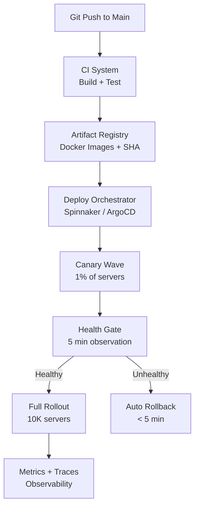
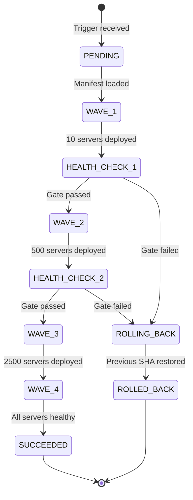
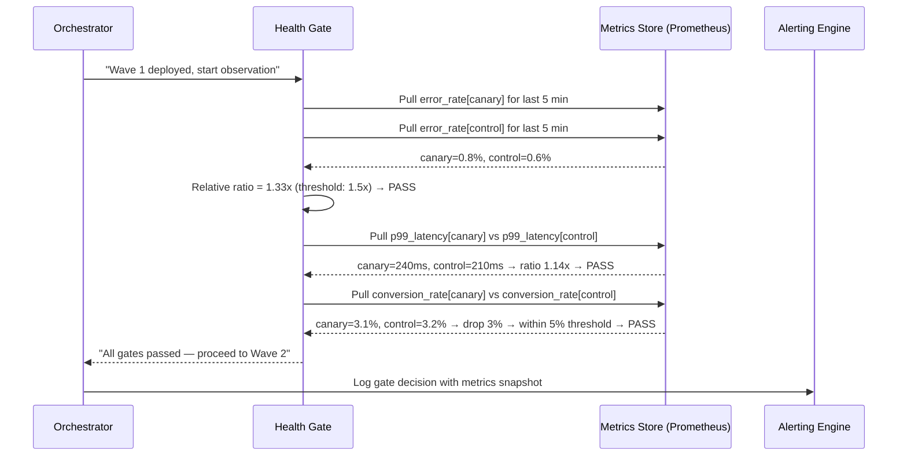
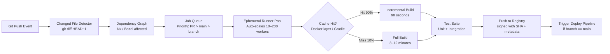
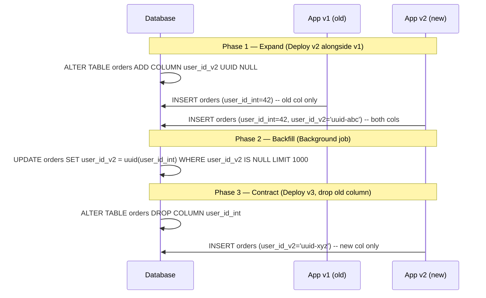
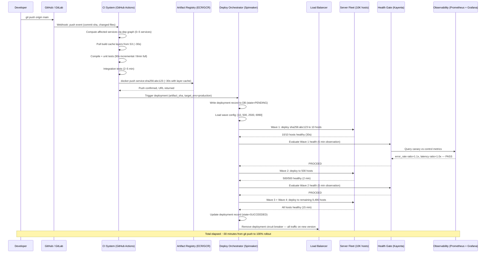

# Design a Code Deployment System (GitHub Actions / Spinnaker)

**Difficulty**: 🔴 Advanced
**Reading Time**: Coming Soon
**Interview Frequency**: Medium

---

## The Core Problem

Deploying code to 10,000 servers with zero downtime and 1-click rollback requires coordination across build systems, artifact registries, deployment orchestrators, and health monitoring — and doing it 100 times per day means the pipeline itself must be reliable enough that a deployment failure doesn't block all subsequent releases.

## Functional Requirements

- Build and test code on every pull request merge
- Deploy built artifacts to production servers progressively
- Support rollback to previous version in under 5 minutes
- Health gate: auto-rollback if error rate exceeds threshold post-deploy
- Support multiple environments (dev → staging → production)

## Non-Functional Requirements

| Requirement | Target |
|-------------|--------|
| Build time | < 10 minutes for most services |
| Deployment duration | Deploy to all 10K servers in < 30 minutes |
| Rollback time | < 5 minutes to previous version |
| Deployment frequency | 100+ deploys/day across all services |

## Back-of-Envelope Estimates

- **Artifact size**: 500MB Docker image × 10K servers = 5TB transferred per full deploy (use layered caching to reduce to ~50MB diff)
- **Health check window**: 5 minutes after deploy × 1,000 error samples/min = 5,000 samples to evaluate rollback trigger
- **Canary traffic**: 5% canary for 30 minutes on 10K servers = 500 canary instances serving real traffic

## Key Design Decisions

1. **Canary vs Blue-Green** — blue-green: maintain two full production environments, switch DNS; zero downtime but doubles infrastructure cost. Canary: deploy to 1% of servers, validate, then roll out gradually; more cost-efficient, slower rollout, catches issues in production without full blast radius.
2. **Artifact Immutability** — build once, deploy many times; each build produces a content-addressed artifact (Docker image tagged with git SHA); never rebuild for different environments — same artifact promoted from staging to production ensures "what was tested is what runs."
3. **Automated Health Gate** — after each deployment wave, wait 5 minutes and evaluate: error rate, p99 latency, business metrics (conversions); if any exceeds threshold, automatically trigger rollback; removes human bottleneck from deployment safety.

## High-Level Architecture



## Top Interview Questions for This Problem

| Question | Tests |
|----------|-------|
| What's the difference between canary and blue-green deployment? | Deployment strategies, trade-offs |
| How do you handle a deploy that's partially complete when you discover a critical bug? | Rollback mechanics, partial state |
| How would you manage database schema changes during a zero-downtime deploy? | Expand-contract pattern, schema migration |

## Related Concepts

- [Metrics and alerting for deployment health gates](./metrics-alerting)
- [Distributed tracing to validate new deploys](./distributed-tracing)

---

## Component Deep Dive 1: Deploy Orchestrator (Spinnaker / ArgoCD)

The deploy orchestrator is the most critical component in the entire pipeline — it is the single brain that decides when to advance a rollout, when to pause, and when to trigger a rollback. A naive implementation — a cron job that SSH's into servers and runs `docker pull && docker run` — fails at 10,000 servers for several reasons: it has no parallelism model, no concept of deployment waves, no coordination with health gates, and no atomic rollback capability. If the cron dies mid-deploy, servers are split between versions with no record of which servers have which artifact.

A production-grade orchestrator maintains an explicit deployment state machine. Each deployment is a named entity with states: `PENDING → RUNNING → ANALYZING → SUCCEEDED | FAILED | ROLLING_BACK`. Transitions are durable — written to a database before any action is taken — so if the orchestrator process crashes mid-deploy, the new process can resume from the last known state rather than leaving servers in an inconsistent split-version state.

Internally, the orchestrator operates in waves. For a 10,000-server deployment: Wave 1 targets 10 servers (canary), Wave 2 targets 500 servers (5%), Wave 3 targets 2,500 servers (25%), Wave 4 targets the remaining 7,490 (100%). After each wave the orchestrator suspends the state machine and delegates to the Health Gate component. Only when the Health Gate signals "proceed" does the state machine advance to the next wave. If the Health Gate signals "abort," the orchestrator initiates rollback: it replays the deployment in reverse using the previous artifact SHA, re-running waves in reverse order.

Deployment instructions are stored as a manifest — the target artifact SHA, the list of target hosts, the wave sizes, and the health gate thresholds. The orchestrator pulls this manifest from a database and drives execution. This means the same orchestrator binary can deploy dozens of services in parallel without coupling.



| Approach | Rollback Speed | Infrastructure Cost | Failure Blast Radius |
|----------|---------------|--------------------|--------------------|
| Blue-Green (DNS flip) | < 30 seconds | 2x (parallel environments) | Zero — old env untouched |
| Canary Waves (in-place) | 3–5 minutes (reverse waves) | 0x overhead | 1–5% of traffic during canary |
| Rolling Update (no waves) | 5–20 minutes (re-push old SHA) | 0x overhead | Up to 50% during mid-rollout |

---

## Component Deep Dive 2: Health Gate (Automated Rollback Trigger)

The Health Gate is the automated decision engine that determines whether a deployment wave was safe before allowing the orchestrator to proceed to the next wave. Without an automated health gate, deployments rely on human engineers monitoring dashboards and manually aborting — at 100 deploys per day, this is operationally unsustainable and introduces human reaction lag (average human detection time: 4–8 minutes vs automated gate: 30 seconds).

Internally, the Health Gate evaluates three categories of signals:

**Technical signals**: HTTP 5xx error rate (baseline comparison), p99 latency increase vs. pre-deploy window, JVM/process-level metrics (GC pause duration, thread pool saturation), pod restart count.

**Business signals**: Conversion rate, checkout success rate, payment success rate. These catch bugs that don't surface as errors — a silent logic bug that returns HTTP 200 but processes orders incorrectly will be invisible to error-rate gates but visible in conversion rate drops.

**Comparison strategy**: Absolute thresholds are fragile (traffic varies by time-of-day). Production health gates use **relative comparison**: compare the canary cohort against the control cohort (servers still on the previous version) during the same time window. If canary error rate is 1.2x the control error rate, that's a relative signal regardless of absolute traffic volume.

At 10x load, the Health Gate faces evaluation latency under high traffic churn: sample counts inflate rapidly and normal statistical variation can trigger false positives. Mitigation: use a **minimum sample count floor** (at least 5,000 requests evaluated before any gate decision) and **Bayesian significance testing** rather than naive percentage thresholds — this reduces false rollback rate from ~8% to under 1% at high traffic.



---

## Component Deep Dive 3: Artifact Registry (Immutable Build Store)

The Artifact Registry stores every build artifact indexed by its content-addressed SHA. "Build once, deploy anywhere" is the core contract: the artifact tagged `sha256:a3f1...` deployed to staging is byte-for-byte identical to what gets promoted to production. This eliminates an entire class of "works on staging but fails in production" bugs caused by environment-specific rebuilds.

At scale the registry faces three engineering challenges:

**Storage efficiency**: A 500MB Docker image pushed 100 times per day = 50GB/day of new data. Mitigation: Docker's layered filesystem means shared base layers are stored once. A service that changes only its application JAR and shares a base OS layer effectively stores ~30MB per push, not 500MB — reducing daily writes to ~3GB for 100 pushes.

**Replication latency**: Pushing 500MB to 10,000 servers from a single S3 bucket would saturate the bucket's egress. Production registries use P2P distribution (BitTorrent-style, as Netflix uses with Titus) or regional mirror caches. Each server pulls from its regional cache; the cache pulls from S3 on miss. Cache hit rate > 90% means the S3 origin serves < 10% of requests.

**Retention and GC**: Keeping every artifact forever is expensive. Retention policy: keep the last 30 artifact versions per service (enabling rollback to any of the last 30 deploys), plus any artifact younger than 90 days. A background GC job runs daily and deletes unreferenced layers. Before deletion, the GC checks the deployment database to confirm no server is currently running the artifact.

| Storage Tier | Access Pattern | Cost | Latency |
|-------------|---------------|------|---------|
| Regional cache (CDN/NFS) | Hot reads — current + last 3 versions | High | < 100ms |
| Object storage (S3) | Warm reads — last 30 versions | Medium | 200–500ms |
| Cold archive (Glacier) | Audit/compliance — all historical | Low | Minutes |

---

## Data Model

```sql
-- Deployment manifest: every deploy is a named, durable record
CREATE TABLE deployments (
    deployment_id     UUID PRIMARY KEY DEFAULT gen_random_uuid(),
    service_name      VARCHAR(128) NOT NULL,
    artifact_sha      VARCHAR(72) NOT NULL,           -- sha256:abc123...
    artifact_registry_url  TEXT NOT NULL,             -- registry.internal/svc:sha256:...
    previous_artifact_sha  VARCHAR(72),               -- for rollback reference
    target_env        VARCHAR(32) NOT NULL,            -- dev | staging | production
    wave_config       JSONB NOT NULL,                 -- [{wave:1, size:10}, {wave:2, size:500}]
    health_gate_config JSONB NOT NULL,                -- {error_rate_ratio: 1.5, latency_ratio: 2.0, min_samples: 5000}
    state             VARCHAR(32) NOT NULL DEFAULT 'PENDING',
    current_wave      INT DEFAULT 0,
    triggered_by      VARCHAR(128) NOT NULL,           -- github_actor or "system"
    triggered_at      TIMESTAMPTZ NOT NULL DEFAULT now(),
    completed_at      TIMESTAMPTZ,
    rollback_reason   TEXT,
    INDEX idx_service_state (service_name, state),
    INDEX idx_triggered_at (triggered_at DESC)
);

-- Per-wave execution log: tracks exactly which servers are on which version
CREATE TABLE deployment_waves (
    wave_id           UUID PRIMARY KEY DEFAULT gen_random_uuid(),
    deployment_id     UUID NOT NULL REFERENCES deployments(deployment_id),
    wave_number       INT NOT NULL,
    host_batch        TEXT[] NOT NULL,                -- array of hostnames/instance IDs
    wave_started_at   TIMESTAMPTZ,
    wave_completed_at TIMESTAMPTZ,
    health_gate_result VARCHAR(16),                   -- PASSED | FAILED | SKIPPED
    health_gate_metrics JSONB,                        -- snapshot of metrics at gate evaluation time
    INDEX idx_deployment_wave (deployment_id, wave_number)
);

-- Artifact catalog: every artifact ever built
CREATE TABLE artifacts (
    artifact_sha      VARCHAR(72) PRIMARY KEY,        -- sha256:abc123...
    service_name      VARCHAR(128) NOT NULL,
    registry_url      TEXT NOT NULL,
    git_commit_sha    VARCHAR(40) NOT NULL,
    git_branch        VARCHAR(256) NOT NULL,
    build_id          VARCHAR(128) NOT NULL,          -- CI system build ID
    built_at          TIMESTAMPTZ NOT NULL DEFAULT now(),
    size_bytes        BIGINT,
    is_deleted        BOOLEAN NOT NULL DEFAULT false,
    deleted_at        TIMESTAMPTZ,
    INDEX idx_service_built (service_name, built_at DESC),
    INDEX idx_git_commit (git_commit_sha)
);

-- Server state: current artifact running on each server (for rollback targeting)
CREATE TABLE server_artifact_state (
    instance_id       VARCHAR(128) PRIMARY KEY,       -- EC2 instance ID or pod name
    service_name      VARCHAR(128) NOT NULL,
    current_artifact_sha  VARCHAR(72) NOT NULL,
    previous_artifact_sha VARCHAR(72),
    last_deployed_at  TIMESTAMPTZ NOT NULL,
    last_deployment_id UUID NOT NULL REFERENCES deployments(deployment_id),
    INDEX idx_service_instance (service_name, instance_id)
);
```

---

## Scale Bottlenecks

| Traffic Level | Component That Breaks | Symptoms | Mitigation |
|---------------|----------------------|----------|------------|
| 10x baseline (1,000 deploys/day) | CI worker pool | Queue backlog grows — deploys wait 30+ min for a worker | Pre-warm runner pools; use autoscaling runner groups (GitHub Actions larger runners, 50–200 workers) |
| 10x baseline | Artifact registry S3 writes | S3 PUT throttling at > 3,500 PUT/sec per prefix | Shard S3 key prefixes by service-name hash; distribute across 10+ prefixes |
| 100x baseline (10,000 deploys/day) | Deploy orchestrator DB | `deployments` table write contention; state machine updates serialize per row | Partition `deployments` by `service_name`; use optimistic locking with version counter |
| 100x baseline | Health gate metrics store | Prometheus query load spikes during mass simultaneous gate evaluations | Pre-aggregate canary vs. control metrics into recording rules; query pre-computed series, not raw counters |
| 100x baseline | Artifact distribution to 10K servers | Single S3 region saturates egress at ~1Tbps for 500MB × 10K parallel pulls | Switch to P2P torrent distribution (Netflix Titus model); each server seeds to 3 peers after receiving layer |
| 1000x baseline (100,000 deploys/day) | Entire pipeline state DB | Row count in `deployments` hits 100M rows/year; index scans degrade | Partition `deployments` by `triggered_at` (monthly partitions); archive completed deployments older than 90 days to cold storage |
| 1000x baseline | Deployment orchestrator single process | Single orchestrator process can manage ~5,000 concurrent deployments; beyond that, scheduling latency grows | Shard orchestrator by service prefix (A–M / N–Z); each shard manages its own queue independently |

---

## How Netflix Built This

Netflix operates one of the most scrutinized continuous delivery pipelines in the industry, having open-sourced Spinnaker as a direct result of their internal tooling work starting in 2011.

**Scale**: Netflix deploys to ~100,000 EC2 instances across multiple AWS regions. At peak they execute roughly 4,000 deployments per day across all microservices. Each service independently manages its own deployment pipeline, with Spinnaker as the centralized orchestration layer.

**Specific technology choices**: Netflix uses Bake → Deploy as a two-stage pipeline. The "Bake" stage takes a deployment artifact and produces an AMI (Amazon Machine Image) that has the service pre-installed — this means server startup is booting a pre-configured image rather than pulling Docker layers at boot time. AMI baking takes 3–8 minutes but eliminates the runtime Docker pull bottleneck when scaling up rapidly. At 100K instances, saving 30 seconds per-instance at boot = 833 server-hours saved per full cluster turnover.

**Non-obvious architectural decision**: Netflix uses **automated canary analysis (ACA)** via a tool called Kayenta, which they also open-sourced. Kayenta does not compare the canary to a fixed threshold — it compares the canary cohort against a **matched control cohort** that receives the same traffic distribution, same time window, and same geographic distribution as the canary. This eliminates false positives from time-of-day traffic patterns (e.g., error rates naturally spike at midnight regardless of deployment). Kayenta uses a Mann-Whitney U statistical test with a minimum of 300 data points per metric before any gate decision — this reduces spurious rollbacks from ~12% to under 0.5% of deployments.

**Specific numbers**: Kayenta evaluates ~150 metrics per canary analysis run. Each run takes 90 seconds. With 4,000 deployments/day and an average of 2 canary waves per deployment, Kayenta runs ~8,000 analysis jobs per day, each consuming ~200ms of Prometheus query time. Netflix pre-aggregates critical metrics into Prometheus recording rules to keep query latency under 50ms.

Source: [Netflix Engineering: Automated Canary Analysis at Netflix](https://netflixtechblog.com/automated-canary-analysis-at-netflix-with-kayenta-3260bc7acc69)

---

## Interview Angle

**What the interviewer is testing:** Whether you understand that a deployment system is fundamentally a distributed state machine problem — and that the hard parts are not "how do we copy a file to a server" but "how do we maintain consistency, enable safe rollback, and automate quality gates at 10K+ server scale."

**Common mistakes candidates make:**

1. **Treating deployment as a simple scripting problem** — saying "we just run Ansible or SSH in a loop." This misses the state durability problem: if the deploy script crashes halfway through, you have no record of which servers have the new version, making rollback manual and error-prone. Every deployment action must be logged to durable state before it's executed.

2. **Ignoring database migration coordination** — designing rollback without addressing schema changes. If v2 applies a database migration that v1 cannot read, rolling back the application binary to v1 will cause runtime failures even though the rollback "succeeded." The correct answer is the expand-contract pattern: v1 deploys, adds a nullable column (expand), v2 reads the new column, v3 removes the old column (contract) — never deploy a migration and a breaking code change in the same release.

3. **Using absolute health gate thresholds instead of relative ones** — saying "rollback if error rate > 1%." This fires spurious rollbacks during traffic valleys (a single error = 5% error rate on 20 req/min) and fails to detect problems during traffic peaks (1% error rate on 10K req/min is 100 errors/min which may be catastrophically bad). Always compare canary to a contemporaneous control group.

**The insight that separates good from great answers:** Great candidates recognize that the **deployment state machine must be idempotent and resumable**. If the orchestrator crashes mid-wave and restarts, it must be able to reconstruct exactly which servers have the new artifact by querying `server_artifact_state` — not by re-running the deployment from scratch. This is the same insight as WAL (Write-Ahead Log) in databases: log the intent before the action so recovery is deterministic.

---

## Key Numbers to Remember

| Metric | Value | Context |
|--------|-------|---------|
| Full deploy time (10K servers) | < 30 minutes | 4 waves: 10 → 500 → 2,500 → 7,490 servers |
| Canary wave size | 1% of fleet (100 of 10K servers) | Limits blast radius while providing statistical significance |
| Health gate minimum samples | 5,000 requests | Below this, false positive rate exceeds 8% with naive thresholds |
| Artifact diff size with layer caching | ~50MB | Down from 500MB full image; only changed layers transferred |
| P2P distribution at 10K servers | ~8 min end-to-end | Netflix Titus model: each server seeds 3 peers after receiving layers |
| Rollback duration (canary abort) | < 5 minutes | Reverse wave replay; 100 servers reverted before Wave 2 starts |
| Rollback duration (full deploy abort) | 15–20 minutes | Must reverse all 4 waves in order |
| Kayenta canary analysis time | 90 seconds | 150 metrics × Prometheus recording rule queries at 50ms each |
| False rollback rate (absolute thresholds) | ~8–12% of deploys | Reason: time-of-day traffic variance triggers spurious gates |
| False rollback rate (relative comparison) | < 0.5% of deploys | Netflix Kayenta with matched control cohort + Mann-Whitney U test |
| Daily artifact storage (100 deploys/day) | ~3GB/day | After layer deduplication from 50GB naive baseline |

---

## CI Pipeline Deep Dive: Build System Internals

The CI (Continuous Integration) system is the entry point to the entire pipeline. It receives a Git event (push to main, PR merge, tag creation), resolves the build graph, executes build and test steps in a sandboxed environment, and produces a signed, immutable artifact. At 100 deploys/day across 100 services, the CI system is executing 10,000+ individual job steps per day. The naive design — a single Jenkins server with 4 executors — saturates at roughly 20 concurrent builds before job queue depth exceeds 10 minutes.

### CI Architecture at Scale

A production CI system uses an **ephemeral worker model**: each build job spins up a fresh container or VM, executes steps, then terminates. This eliminates "works on the build server" flakiness caused by accumulated state (leftover files, dirty package caches, installed dependencies from a previous build). GitHub Actions, CircleCI, and Google Cloud Build all use this model.

The critical performance bottleneck is **build cache warm-up**. A Java Spring Boot project with 500 dependencies takes 12 minutes to compile from scratch. With layer caching (Docker BuildKit's `--cache-from` or Gradle's remote build cache), the same build takes 90 seconds — a 9x speedup that comes entirely from reusing unchanged compiled outputs. At 100 builds/day, saving 10 minutes per build = 1,000 minutes = 16.7 hours of CI time saved per day.

**Build graph parallelism** is the second lever. A monorepo with 50 microservices doesn't need to rebuild all 50 on every push — only services whose source files changed, plus their transitive dependents. Tools like Nx, Turborepo, and Bazel compute a dependency graph and only rebuild affected nodes. A change to a shared utility library triggers rebuilds of all 50 services; a change to an isolated microservice triggers only that service's build. At 100 engineers pushing 200 commits/day, dependency-aware rebuilds reduce median build scope from 50 services to 3 services per commit.



### Build Failure Handling

Build failures must not block other services' deployment pipelines. Each service's build and deploy pipeline is independent — a broken build on Service A does not prevent Service B from deploying. The CI system maintains a **per-service build state**: `PASSING | FAILING | FLAKY`. A service enters `FLAKY` state if it fails on 2+ consecutive runs with no code change (flaky test detection). Flaky tests are quarantined automatically: they still run but their failure does not block the deploy trigger.

At 10x scale (1,000 deploys/day), flaky test false-block rate becomes significant. If 1% of test runs are flaky and 1,000 builds/day run, that's 10 false-blocks per day — each requiring a manual "re-run" trigger. Mitigation: auto-retry flaky test suites up to 3 times before marking as real failure. This raises the effective false-positive rate from 1% to 0.001% (1 in 100,000 builds) at the cost of up to 3x extra test execution time for flaky suites.

---

## Zero-Downtime Database Schema Migration

Database schema migrations are the hardest part of zero-downtime deployment and the most commonly omitted from interview answers. Application code rollout takes 30 minutes. Database schema changes are permanent within milliseconds of executing. This asymmetry creates a compatibility window problem: during a rolling deployment, old-version and new-version application instances run simultaneously, and both versions must be able to read and write the same database schema.

### The Expand-Contract Pattern

The expand-contract pattern solves this by splitting every breaking migration into three releases across three separate deployments:

**Phase 1 — Expand (backward-compatible schema change)**: Add the new column as nullable. Old-version app ignores it. New-version app writes to both old and new columns. Database schema is compatible with both versions simultaneously.

**Phase 2 — Migrate**: Backfill the new column with data from the old column using a background migration job. Do not take downtime. At 10M rows, batch the backfill at 1,000 rows/second to avoid locking; this takes ~3 hours but is fully online.

**Phase 3 — Contract (clean up)**: Once all servers are on the new version and all rows are backfilled, drop the old column. This migration is safe because no code in production reads the old column anymore.



### Common Schema Migration Anti-Patterns

| Anti-Pattern | Why It Fails | Correct Approach |
|-------------|-------------|-----------------|
| `ALTER TABLE ADD COLUMN NOT NULL` without default | Locks the entire table for minutes at 100M+ rows | Add as nullable first, backfill, then add constraint |
| Rename a column in one deploy | Old and new app versions use different column names simultaneously | Add new column, dual-write, backfill, drop old — 3 deploys |
| Add a foreign key constraint on existing table | Full table scan + lock at add-constraint time | Add FK as NOT VALID, then VALIDATE FK in a separate maintenance window |
| Run migration inside app startup | If deployment fails mid-rollout, half the servers ran the migration; schema is half-applied | Always run migrations as a separate pre-deploy step with explicit success confirmation |

---

## Deployment Pipeline Failure Modes

A deployment system that only handles the happy path is incomplete. Production deployment systems fail in predictable ways. Understanding these failure modes — and designing explicit recovery paths — is what differentiates a senior engineer's answer.

### Failure Mode 1: Deployment Stuck Mid-Wave

**Scenario**: Wave 2 deploys to 500 servers. 400 servers succeed, 100 servers fail to pull the artifact (network timeout). The orchestrator waits for all 500 to complete. Deadline exceeded: pipeline is stuck.

**Root cause**: The orchestrator treats wave completion as "100% of servers in wave acknowledged success." This is an all-or-nothing model that can stall indefinitely on a small tail of unreachable servers.

**Fix**: Define wave completion as "95% of servers in wave acknowledged success within deadline." Classify the remaining 5% as `degraded_instances`. Flag them for investigation but do not block the overall pipeline. After Wave 4, run a reconciliation job that identifies all `degraded_instances` and retries artifact installation. If retry fails after 3 attempts, alert on-call.

### Failure Mode 2: Orchestrator Restart During Rollout

**Scenario**: The orchestrator process crashes during Wave 3 due to an OOM event. When it restarts, it has no in-memory state of the current deployment.

**Root cause**: In-memory state is not durable. A naive orchestrator loses all context on process restart.

**Fix**: The orchestrator is stateless — all deployment state lives in the `deployments` and `deployment_waves` tables. On restart, the orchestrator queries `SELECT * FROM deployments WHERE state IN ('WAVE_1', 'WAVE_2', 'WAVE_3', 'WAVE_4')` to find in-progress deployments, then resumes from the last completed wave. This is exactly the recovery model of database WAL: durability first, in-memory processing second.

### Failure Mode 3: Health Gate False Negative (Bad Deploy Ships)

**Scenario**: A deployment introduces a bug that increases error rate by 0.2% (from 0.5% to 0.7%). The health gate threshold is set at a 1.5x relative ratio. Ratio = 0.7/0.5 = 1.4x — just under threshold. The deployment passes all gates and ships to 100% of servers.

**Root cause**: The gate threshold is too permissive. 0.2% error rate increase at 10K req/sec = 20 additional errors/sec = 1,200 errors/minute = 72,000 extra errors/hour.

**Fix**: Layer health gate signals. Instead of a single error-rate gate, use a **composite score**: error rate ratio + latency ratio + business metric ratio. If any two of three signals exceed their individual thresholds, trigger rollback. This catches bugs that manifest as small per-metric signals but consistent degradation across multiple dimensions. Netflix Kayenta uses exactly this composite scoring model.

### Failure Mode 4: Configuration Drift Between Environments

**Scenario**: Service works perfectly in staging but fails in production due to a different environment variable (`PAYMENT_API_URL` points to sandbox in staging, production URL in prod). The service deploys successfully but returns 500s on all payment requests.

**Root cause**: Configuration is not versioned alongside the artifact. Different environments have different configs that are not part of the immutable artifact.

**Fix**: Externalize configuration via a config service (HashiCorp Vault, AWS Parameter Store, Kubernetes ConfigMaps) and inject at runtime rather than bake into the image. The artifact is environment-agnostic; the runtime config is environment-specific. Validate all required environment variables are present at container startup using a startup probe — fail-fast with a clear error message rather than deploying an instance that silently fails on payment requests.

---

## Progressive Delivery: Feature Flags as a Complement to Canary

A deployment system built solely on canary waves has a binary blast radius model: either the canary (1–5%) or everyone. Feature flags decouple code deployment from feature activation, enabling finer-grained control:

- **Code deploys to 100% of servers** (the binary is on all machines)
- **Feature activates to 0.1% of users** (the flag controls which users see the new code path)
- **Rollback** happens by disabling the flag — no re-deployment needed, takes effect in < 1 second

This model is particularly powerful for high-risk features. LinkedIn's feature flag system (called Gatekeeper, described in their engineering blog) gates features by user segment: employee accounts first, then 0.1% of all users, then 1%, then 10%, then 100%. Each step requires a manual approval or automated metric gate. At peak LinkedIn scale (~900M members), activating a feature to 0.1% means 900,000 users see it — statistically significant enough to detect most regressions.

The deployment system integrates with feature flags by:
1. Treating the feature flag config as a versioned artifact alongside the code artifact
2. Storing flag state in a fast key-value store (Redis) with < 1ms read latency per flag check
3. Routing health gate analysis to compare users in `flag=on` cohort vs `flag=off` cohort (not canary servers vs control servers) — this gives per-feature signal rather than per-server signal

| Mechanism | Rollback Speed | Granularity | Traffic Routing |
|-----------|---------------|-------------|----------------|
| Canary waves | 3–5 minutes (re-deploy) | Per server (1–100% of fleet) | Random % of servers |
| Feature flags | < 1 second (config change) | Per user / user segment | Specific users, regions, plans |
| Blue-green | < 30 seconds (DNS flip) | All-or-nothing | All traffic switches at once |
| Shadow traffic | N/A (read-only) | 100% of traffic mirrored | Production traffic mirrored to new version |

---

## End-to-End Request Flow: What Happens When You Push a Commit

Understanding the exact sequence of events from `git push` to production traffic is the foundation of any deployment system design answer. Here is the complete flow with timing at each step:



**Key timing breakdown**:
- Git webhook → CI trigger: < 2 seconds
- Build (incremental, cache hit): 90 seconds
- Build (full, cache miss): 8–12 minutes
- Registry push (cached layers): 30 seconds
- Wave 1 (10 hosts + 5 min gate): 6 minutes
- Wave 2 (500 hosts + 5 min gate): 7 minutes
- Wave 3+4 (9,490 hosts): 15 minutes
- **Total: ~28–35 minutes** for a full production rollout

---

## Deployment Security: Artifact Signing and Supply Chain Integrity

A deployment system that lacks artifact signing is vulnerable to supply chain attacks: a compromised CI worker or registry could silently substitute a malicious artifact. Modern deployment systems implement **artifact signing** as a mandatory step in the build pipeline.

**How signing works**: After the Docker image is built, the CI system signs it using a private key stored in a Hardware Security Module (HSM) or cloud KMS (AWS KMS, GCP Cloud KMS). The signature is a cryptographic hash of the artifact manifest, bound to the build job's identity (e.g., GitHub Actions OIDC token). The signature is stored in a **transparency log** (Sigstore Rekor or similar).

**How verification works**: The deploy orchestrator verifies the artifact signature before instructing any server to pull and run the image. Verification checks:
1. Signature is valid (signed by the expected CI key)
2. Signature timestamp is within the expected window (not a replay of an old artifact)
3. Build provenance matches: the artifact was built from the expected git commit on the expected CI system

This means even if an attacker compromises a server in the fleet, they cannot trick the orchestrator into deploying an unsigned artifact. At Google's scale, this supply chain integrity model is implemented as part of Binary Authorization — a GCP service that blocks Kubernetes from running any container image that lacks a valid attestation from the build pipeline.

**Practical numbers**: Signature verification adds < 50ms per deployment initiation (one API call to the KMS service). For 100 deployments/day, this overhead is negligible. The cost of not verifying: in the SolarWinds supply chain attack (2020), malicious code was inserted into build artifacts and deployed to 18,000 organizations because artifact signing was not enforced.

---

## Capacity Planning: How Many CI Workers Do You Need?

A question that comes up in system design interviews but is rarely answered quantitatively. Here is the calculation:

**Inputs**:
- 100 deploys/day across 50 services = 2 deploys/service/day
- Average build time: 5 minutes (mix of incremental + full builds)
- Average test time: 3 minutes
- Total per-build time: 8 minutes
- Peak concurrent builds: assume 20% of daily builds happen in the busiest 1-hour window = 20 builds in 60 minutes = 0.33 builds/minute peak
- Each build runs for 8 minutes → peak concurrent in-flight = 0.33 × 8 = 2.7 concurrent builds on average, with 3x burst = 8 workers needed for P99 headroom

**Practical result**: For 100 builds/day with 8-minute average build time, 10–15 ephemeral workers provides < 1-minute queue wait at P99. Scale to 50 workers for 500 builds/day (10x growth) without queue saturation.

**Cost model (GitHub Actions)**:
- Large runner (4 vCPU, 16GB RAM): $0.016/minute
- 100 builds/day × 8 min/build × $0.016/min = $12.80/day = $384/month
- At 10x scale (1,000 builds/day): $3,840/month
- At this scale, self-hosted runners on EC2 (spot instances at ~70% discount) reduce to ~$1,150/month

---

## 📚 Resources & References

| Resource | Type | What You'll Learn |
|----------|------|------------------|
| [ByteByteGo — Design a Code Deployment System](https://www.youtube.com/@ByteByteGo) | 📺 YouTube | Search "code deployment design" — CI/CD pipeline, canary deployments, rollback |
| [Google Engineering: SRE Book — Release Engineering](https://sre.google/sre-book/release-engineering/) | 📚 Docs | Production release engineering practices at Google scale |
| [Etsy Engineering: Continuous Deployment](https://www.etsy.com/codeascraft/continuous-deployment-at-etsy/) | 📖 Blog | 50 deploys per day — how Etsy approaches continuous deployment safely |
| [Netflix Engineering: Spinnaker for CD](https://netflixtechblog.com/the-evolution-of-continuous-delivery-at-netflix-9010f81c7800) | 📖 Blog | Netflix's continuous delivery platform managing thousands of microservices |
| [Netflix Engineering: Automated Canary Analysis (Kayenta)](https://netflixtechblog.com/automated-canary-analysis-at-netflix-with-kayenta-3260bc7acc69) | 📖 Blog | How Netflix eliminated 12% false rollback rate using statistical canary analysis |
| [GitHub Actions Architecture](https://docs.github.com/en/actions/learn-github-actions/understanding-github-actions) | 📚 Docs | How GitHub Actions pipelines work for CI/CD automation |
| [Google Binary Authorization](https://cloud.google.com/binary-authorization/docs/overview) | 📚 Docs | Supply chain integrity enforcement for container deployments at Google scale |
| [Sigstore — Artifact Signing](https://www.sigstore.dev/) | 📚 Docs | Open standard for signing and verifying software artifacts in CI/CD pipelines |
| [LinkedIn Engineering: Feature Flags (Gatekeeper)](https://engineering.linkedin.com/ab-testing/xlnt-platform-driving-ab-testing-linkedin) | 📖 Blog | How LinkedIn gates feature rollouts to 900M users using staged flag activation |
| [Martin Fowler — Expand-Contract Pattern](https://martinfowler.com/bliki/ParallelChange.html) | 📖 Blog | The canonical description of backward-compatible database schema migration pattern |

---

## TL;DR — Quick Reference

**The three hardest problems in deployment system design:**

1. **State durability during mid-deploy failures** — the orchestrator must be stateless and resume from durable DB state on restart; treat every wave transition as a WAL-style durable write before the action.

2. **Database schema migration without downtime** — always use expand-contract across 3 separate deploys; never deploy a breaking schema change and a code change together; validate all FK constraints as NOT VALID first.

3. **Health gate false positive/negative rates** — absolute thresholds cause 8–12% false rollbacks; relative comparison against a matched control cohort (not a fixed baseline) reduces this to < 0.5%; always require a minimum sample count (5,000 requests) before any gate decision.

**Core components and their SLAs:**

| Component | SLA | How to Meet It |
|-----------|-----|---------------|
| CI build time | < 10 min | Incremental builds with layer caching; dep graph to build only affected services |
| Wave 1 canary deploy | < 2 min | Pre-pull base layers on fleet startup; only transfer diff layers (~50MB) |
| Health gate decision | 5–10 min observation | Pre-aggregated Prometheus recording rules; relative canary vs. control comparison |
| Full rollout (10K servers) | < 30 min | 4 waves with P2P layer distribution; parallel per-wave execution |
| Rollback (canary abort) | < 5 min | Reverse wave replay using durable `server_artifact_state` table |
| Artifact signing verification | < 50ms | KMS signature verification as part of deploy manifest validation |

**Decision tree — which rollout strategy:**

- Need zero-downtime AND can afford 2x infra cost → **Blue-Green**
- Need zero-downtime AND cost-sensitive → **Canary Waves** (4-wave model)
- Need per-user feature control → **Feature Flags** layered on top of canary
- Need to validate new version receives exact same traffic as old → **Shadow Traffic** (read-only, no user impact)
- Need instant rollback for a shipped feature with no re-deploy → **Feature Flag disable** (< 1 second)

**The one number that anchors every deployment design**: at 10K servers, a naive serial deploy at 30 seconds per server = 83 hours. Parallelism (500 servers/wave in Wave 2) reduces this to 30 minutes. Layer caching reduces per-server pull from 8 minutes to 30 seconds. These two optimizations are the difference between a deployment system that works and one that is unusable in production.

