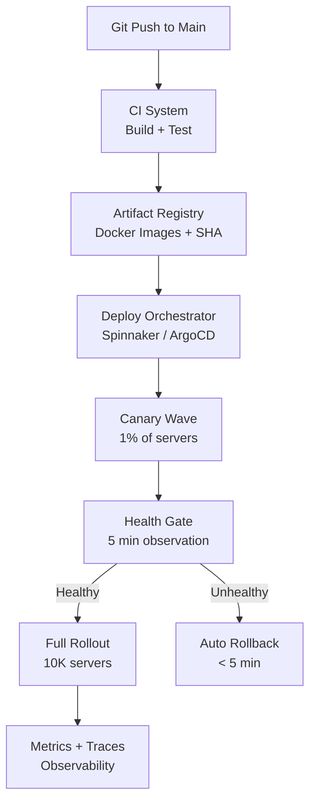

# Design a Code Deployment System (GitHub Actions / Spinnaker)

**Difficulty**: 🔴 Advanced
**Reading Time**: Coming Soon
**Interview Frequency**: Medium

---

> 🚧 **Full article coming soon.** This stub gives you the essentials to start thinking about this problem.

---

## The Core Problem

Deploying code to 10,000 servers with zero downtime and 1-click rollback requires coordination across build systems, artifact registries, deployment orchestrators, and health monitoring — and doing it 100 times per day means the pipeline itself must be reliable enough that a deployment failure doesn't block all subsequent releases.

## Functional Requirements

- Build and test code on every pull request merge
- Deploy built artifacts to production servers progressively
- Support rollback to previous version in under 5 minutes
- Health gate: auto-rollback if error rate exceeds threshold post-deploy
- Support multiple environments (dev → staging → production)

## Non-Functional Requirements

| Requirement | Target |
|-------------|--------|
| Build time | < 10 minutes for most services |
| Deployment duration | Deploy to all 10K servers in < 30 minutes |
| Rollback time | < 5 minutes to previous version |
| Deployment frequency | 100+ deploys/day across all services |

## Back-of-Envelope Estimates

- **Artifact size**: 500MB Docker image × 10K servers = 5TB transferred per full deploy (use layered caching to reduce to ~50MB diff)
- **Health check window**: 5 minutes after deploy × 1,000 error samples/min = 5,000 samples to evaluate rollback trigger
- **Canary traffic**: 5% canary for 30 minutes on 10K servers = 500 canary instances serving real traffic

## Key Design Decisions

1. **Canary vs Blue-Green** — blue-green: maintain two full production environments, switch DNS; zero downtime but doubles infrastructure cost. Canary: deploy to 1% of servers, validate, then roll out gradually; more cost-efficient, slower rollout, catches issues in production without full blast radius.
2. **Artifact Immutability** — build once, deploy many times; each build produces a content-addressed artifact (Docker image tagged with git SHA); never rebuild for different environments — same artifact promoted from staging to production ensures "what was tested is what runs."
3. **Automated Health Gate** — after each deployment wave, wait 5 minutes and evaluate: error rate, p99 latency, business metrics (conversions); if any exceeds threshold, automatically trigger rollback; removes human bottleneck from deployment safety.

## High-Level Architecture

## Top Interview Questions for This Problem

| Question | Tests |
|----------|-------|
| What's the difference between canary and blue-green deployment? | Deployment strategies, trade-offs |
| How do you handle a deploy that's partially complete when you discover a critical bug? | Rollback mechanics, partial state |
| How would you manage database schema changes during a zero-downtime deploy? | Expand-contract pattern, schema migration |

## Related Concepts

- [Metrics and alerting for deployment health gates](./metrics-alerting)
- [Distributed tracing to validate new deploys](./distributed-tracing)

---

*📚 Full deep-dive with multiple approaches, trade-off tables, and pseudocode coming soon.*

## 📚 Resources & References

| Resource | Type | What You'll Learn |
|----------|------|------------------|
| [ByteByteGo — Design a Code Deployment System](https://www.youtube.com/@ByteByteGo) | 📺 YouTube | Search "code deployment design" — CI/CD pipeline, canary deployments, rollback |
| [Google Engineering: SRE Book — Release Engineering](https://sre.google/sre-book/release-engineering/) | 📚 Docs | Production release engineering practices at Google scale |
| [Etsy Engineering: Continuous Deployment](https://www.etsy.com/codeascraft/continuous-deployment-at-etsy/) | 📖 Blog | 50 deploys per day — how Etsy approaches continuous deployment safely |
| [Netflix Engineering: Spinnaker for CD](https://netflixtechblog.com/the-evolution-of-continuous-delivery-at-netflix-9010f81c7800) | 📖 Blog | Netflix's continuous delivery platform managing thousands of microservices |
| [GitHub Actions Architecture](https://docs.github.com/en/actions/learn-github-actions/understanding-github-actions) | 📚 Docs | How GitHub Actions pipelines work for CI/CD automation |
