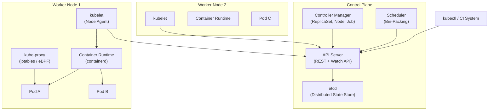
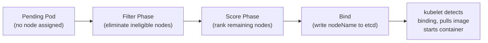
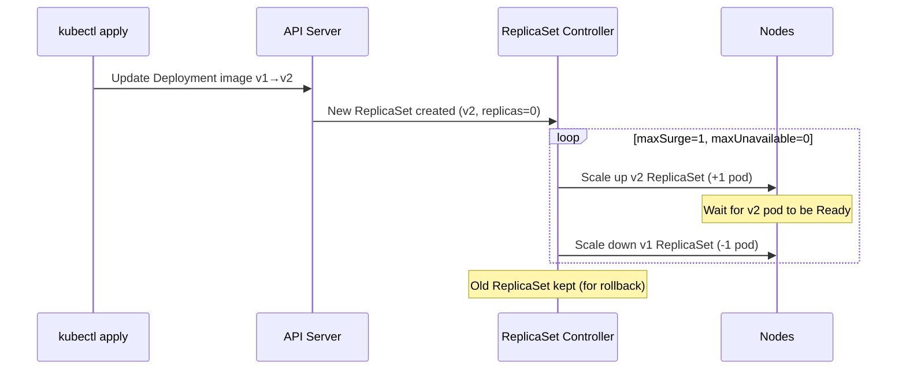
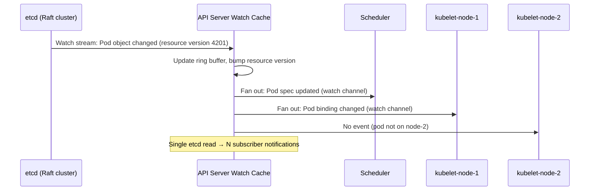
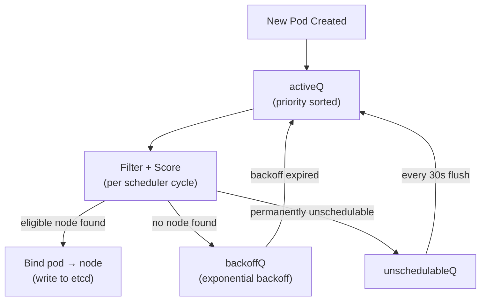

# Design a Container Orchestration System (Kubernetes-Style)

**Difficulty**: 🔴 Advanced
**Reading Time**: 30 minutes
**Interview Frequency**: High — common at senior/staff engineer interviews at cloud-native companies

---

## Problem Statement

You are asked to design a container orchestration platform that:

- **Works at**: 10 containers across 2 nodes — a simple Docker Compose handles this.
- **Breaks at**: 10,000 containers across 500 nodes — manual placement, health checking, and restarts become impossible. You need automated scheduling, self-healing, rolling deployments, and service discovery at scale.

Target scale: **10,000 running pods**, **500 worker nodes**, **1,000 deploys/day**, **sub-30-second scheduling latency**.

---

## Requirements

### Functional Requirements

| Requirement | Description |
|-------------|-------------|
| Scheduling | Place containers on nodes based on resource availability |
| Health Checking | Detect and restart failed containers automatically |
| Service Discovery | Route traffic to healthy container instances |
| Rolling Deployments | Update containers with zero downtime |
| Autoscaling | Scale pods up/down based on CPU/memory metrics |
| Resource Isolation | Guarantee CPU/memory limits per container |

### Non-Functional Requirements

| Requirement | Target |
|-------------|--------|
| Scheduling Latency | < 30 seconds from pod creation to running |
| Control Plane Availability | 99.99% (< 52 min/year downtime) |
| Max Cluster Size | 5,000 nodes, 150,000 pods |
| API Server Throughput | 10,000 req/sec |
| etcd Write Throughput | 1,000 writes/sec |

---

## Capacity Estimates

- **500 nodes × 20 pods/node** = 10,000 pods
- **Each pod spec**: ~2 KB → 10,000 × 2 KB = **20 MB state in etcd**
- **Health check interval**: 10s per pod → 10,000 ÷ 10 = **1,000 health events/sec**
- **API server**: 1,000 engineers × 10 deploys/day = ~**120 API calls/min**
- **etcd**: 3-node cluster handles ~**10,000 writes/sec** (practical limit: keep < 2,000/sec for stability)

---

## High-Level Architecture



---

## Level 1 — Surface: The Control Loop Pattern

The entire system is built on **reconciliation loops**:

1. **Desired state** is written to etcd (e.g., "run 3 replicas of nginx")
2. **Controllers** watch etcd for changes
3. **Controller compares** desired vs actual state
4. **Controller acts** to drive actual → desired (create/delete pods)
5. **Repeat forever**

This is called a **level-triggered** (not edge-triggered) control loop — the system re-evaluates full state periodically, not just on events. This makes it resilient to missed events.

---

## Level 2 — Deep Dive: Scheduling Algorithm

### The Pod Scheduling Pipeline

When a pod is created, the scheduler runs it through two phases:



**Filter predicates** (eliminate nodes that can't run the pod):
- Not enough CPU/memory
- Node has taint that pod doesn't tolerate
- Node affinity doesn't match
- Node is in NotReady state

**Scoring functions** (rank eligible nodes):
- **LeastRequestedPriority**: Prefer nodes with most free resources (spread load)
- **BalancedResourceAllocation**: Prefer balanced CPU/memory ratio
- **ImageLocalityPriority**: Prefer nodes that already have the container image cached

### Bin-Packing vs. Spreading

| Strategy | Goal | When to Use |
|----------|------|-------------|
| **Bin-packing** | Fill nodes fully, fewer nodes needed | Cost optimization, batch workloads |
| **Spreading** | Distribute evenly across nodes | High availability, latency-sensitive |
| **Hybrid** | Pack to quota, spread across failure domains | Production default |

Kubernetes defaults to **spreading** (LeastRequested). Cost-optimized clusters use bin-packing plugins.

---

## Key Design Decisions

### 1. Declarative vs. Imperative API

**Imperative**: "Start 3 nginx containers now."
**Declarative**: "Desired state = 3 nginx replicas. System reconciles to match."

Kubernetes chose **declarative** because:
- Idempotent: re-applying the same config is safe
- Self-healing: controller continuously drives toward desired state
- Auditable: etcd is the source of truth, not in-memory state

Trade-off: Declarative adds latency (reconciliation loop) vs. imperative (immediate action). Scheduling a pod takes 5–30 seconds rather than milliseconds.

### 2. etcd as the Sole State Store

All cluster state lives in etcd (a Raft-based key-value store). The API server is stateless — it only reads/writes etcd.

| Pro | Con |
|-----|-----|
| Single source of truth | etcd is a bottleneck (max ~2,000 writes/sec practical) |
| Watch API enables real-time notifications | Large clusters must shard or use etcd tuning |
| Raft provides consistency | etcd failure = control plane unavailable |

At 5,000+ nodes Kubernetes recommends dedicated high-memory etcd machines and separate etcd clusters for events vs. core objects.

### 3. Horizontal Pod Autoscaler (HPA) Design

HPA runs a control loop:
1. Metrics server scrapes CPU from kubelets every 15s
2. HPA controller computes `desiredReplicas = ceil(currentReplicas × (currentMetric / targetMetric))`
3. Updates Deployment replica count
4. Scheduler places new pods

**Scale-up**: Fast (1–3 minutes). **Scale-down**: Slow (5 minutes stabilization window) to avoid flapping.

---

## Rolling Deployment Strategy



- **maxSurge=1**: At most 1 extra pod above desired count during rollout
- **maxUnavailable=0**: Zero pods unavailable at any time (zero-downtime)
- Old ReplicaSet is kept for instant rollback: `kubectl rollout undo deployment/nginx`

---

## Component Deep Dive 1: The API Server — Watch Mechanism and State Distribution

The API Server is the nerve center of the entire control plane. Every component — the scheduler, controller manager, kubelets on 500 worker nodes — communicates exclusively through the API server. Nothing talks to etcd directly. This design means the API server must handle not just REST requests but also **long-lived streaming watch connections** from thousands of concurrent clients.

### How Watches Work Internally

When the scheduler starts, it opens a `GET /api/v1/pods?watch=true` HTTP/2 long-poll to the API server. The API server does NOT poll etcd for each watch subscriber. Instead, it maintains an in-memory **watch cache** (an LRU ring buffer of recent events, typically 100 MB per resource type). When etcd emits a change event via its own watch mechanism, the API server:

1. Deserializes the etcd protobuf event
2. Applies RBAC authorization and namespace filtering
3. Writes the serialized object to the in-memory watch cache
4. Fans out to all matching open watch connections

This means 500 kubelets watching pods do NOT cause 500 etcd reads — they all read from the API server's in-memory cache.



### Why Naive Approaches Fail

A naive design where each controller polls etcd directly would saturate etcd at 500+ nodes. etcd's practical write throughput ceiling is ~2,000 writes/sec on a 3-node cluster with NVMe SSDs; read throughput is higher but Raft serializes all writes. Kubernetes explicitly prohibits direct etcd access from components other than the API server for this reason.

### API Server Implementation Options

| Approach | Latency | Throughput | Trade-off |
|----------|---------|------------|-----------|
| **Direct etcd polling** per component | 50–200 ms/watch | Collapses at 50+ clients | No amplification layer; etcd overloaded |
| **In-memory watch cache (current)** | <5 ms fan-out | 10,000+ concurrent watches | Memory-heavy; cache warm-up needed after restart |
| **Event bus (e.g., Kafka)** | 5–50 ms | Horizontally scalable | Breaks Kubernetes's consistency model; out-of-order risk |

The in-memory watch cache wins because it colocates the fan-out with the consistency boundary (etcd Raft log).

---

## Component Deep Dive 2: The Scheduler — Gang Scheduling and Priority Queues

The scheduler appears simple in diagrams but hides significant complexity in production clusters. Two behaviors that break naive implementations: **gang scheduling** for ML workloads and **priority preemption** when the cluster is full.

### Internal Mechanics: The Scheduling Queue

The scheduler does not process pods FIFO. It maintains a **priority queue** with three internal queues:

- **activeQ**: Pods ready to be scheduled right now (sorted by priority class)
- **backoffQ**: Pods that failed scheduling — backing off with exponential delay (1s, 2s, 4s, up to 10s)
- **unschedulableQ**: Pods that cannot possibly be scheduled with current cluster state (e.g., requesting GPU when no GPU nodes exist)

Every 30 seconds, pods are moved from `unschedulableQ` back to `activeQ` for retry — catching cases where new nodes were added or resources freed.



### Scale Behavior at 10x Load

At a 5,000-node cluster with 150,000 pods, the filter phase is the bottleneck. Running all predicates against 5,000 nodes per pod is O(nodes × predicates). Kubernetes mitigates this with **percentage-based node sampling**: instead of checking all 5,000 nodes, the scheduler samples `max(100, 50% of nodes)` = 2,500. This halves scheduling latency with negligible placement quality loss.

**Gang scheduling** (all-or-nothing placement for ML jobs) requires scheduling N pods atomically. Kubernetes does not natively support gang scheduling; production ML platforms (Volcano, Yunikorn) add a custom scheduler plugin that holds pods in a pending pool until all N can be placed simultaneously — critical for distributed training jobs (PyTorch DDP, JAX) where a partial placement deadlocks.

| Scenario | Default Scheduler | With Gang Plugin |
|----------|------------------|-----------------|
| ML training job (8 GPU pods) | May place 7/8, 1 stuck | Waits until all 8 nodes available |
| Scheduling latency | 1–5s per pod | 5–60s (waits for gang) |
| Resource efficiency | Higher utilization | Lower (holds resources) |

---

## Component Deep Dive 3: etcd — Raft Consensus and Write Path

etcd is not just a key-value store — it is the cluster's **serializable source of truth**. Every pod creation, node registration, and service update goes through a Raft consensus write, which means a **majority of etcd nodes (quorum) must acknowledge** before the write is considered committed.

### Raft Write Path

A write from the API server (`PUT /registry/pods/default/nginx`) triggers:

1. API server sends write to etcd leader
2. Leader appends to local WAL (write-ahead log), broadcasts to followers
3. Followers append to their WAL, send ACK
4. Leader commits when quorum (2 of 3) ACK
5. Leader applies to in-memory B-tree (bbolt), notifies watchers
6. API server receives "committed" response — returns 200 to caller

**End-to-end latency**: 2–5 ms on a LAN with NVMe SSDs. **Practical write ceiling**: 2,000 writes/sec for a 3-node cluster to maintain <10 ms p99.

### etcd Compaction and Defragmentation

etcd keeps all historical revisions of every key (for watch replay). Without compaction, etcd storage grows unbounded. Kubernetes configures etcd to compact every 5 minutes, keeping only the last 8 hours of revisions. After compaction, defragmentation reclaims disk space — but defrag **blocks writes for 100–500 ms**, so production clusters schedule it during low-traffic windows.

**Separate etcd clusters for events**: Kubernetes event objects (`kubectl get events`) generate ~3× more writes than core objects. Large clusters run a dedicated etcd cluster for events to protect the core object store from event write storms.

---

## Data Model

The following shows the actual etcd key structure and API object schemas used in Kubernetes-style orchestration.

```sql
-- etcd stores objects as: /registry/{resource}/{namespace}/{name} = protobuf(JSON)
-- Key examples:
-- /registry/pods/default/nginx-abc12
-- /registry/nodes/worker-node-001
-- /registry/services/production/payment-svc
-- /registry/deployments/production/payment-deployment

-- Pod object schema (simplified JSON)
{
  "apiVersion": "v1",
  "kind": "Pod",
  "metadata": {
    "name": "nginx-abc12",                -- globally unique in namespace
    "namespace": "default",
    "uid": "3e4f5a6b-7c8d-9e0f-...",      -- UUID assigned by API server
    "resourceVersion": "4201",            -- monotonic etcd revision
    "labels": { "app": "nginx", "version": "1.26" },
    "annotations": { "prometheus.io/scrape": "true" },
    "creationTimestamp": "2025-05-01T10:00:00Z"
  },
  "spec": {
    "nodeName": "worker-node-042",        -- empty until scheduler binds
    "schedulerName": "default-scheduler",
    "containers": [
      {
        "name": "nginx",
        "image": "nginx:1.26",
        "resources": {
          "requests": { "cpu": "100m", "memory": "128Mi" },
          "limits":   { "cpu": "500m", "memory": "512Mi" }
        },
        "readinessProbe": {
          "httpGet": { "path": "/healthz", "port": 8080 },
          "initialDelaySeconds": 5,
          "periodSeconds": 10
        },
        "livenessProbe": {
          "httpGet": { "path": "/healthz", "port": 8080 },
          "failureThreshold": 3,
          "periodSeconds": 10
        }
      }
    ],
    "restartPolicy": "Always",
    "terminationGracePeriodSeconds": 30
  },
  "status": {
    "phase": "Running",                   -- Pending | Running | Succeeded | Failed | Unknown
    "podIP": "10.244.3.15",
    "hostIP": "192.168.1.42",
    "conditions": [
      { "type": "Ready", "status": "True", "lastTransitionTime": "..." }
    ],
    "containerStatuses": [
      { "name": "nginx", "ready": true, "restartCount": 0, "imageID": "..." }
    ]
  }
}

-- Node object (resource inventory tracked by API server)
{
  "kind": "Node",
  "metadata": { "name": "worker-node-042" },
  "spec": {
    "taints": [],
    "unschedulable": false
  },
  "status": {
    "capacity":   { "cpu": "8", "memory": "32Gi", "pods": "110" },
    "allocatable":{ "cpu": "7800m", "memory": "30Gi", "pods": "110" },
    "conditions": [
      { "type": "Ready", "status": "True", "lastHeartbeatTime": "..." }
    ],
    "nodeInfo": { "kubeletVersion": "v1.29.0", "osImage": "Ubuntu 22.04 LTS" }
  }
}
```

**Index strategy**: etcd is not a relational DB — it has no secondary indexes. The API server builds in-memory indexes (by label selector, by namespace) from its watch cache. A query like `kubectl get pods -l app=nginx` is answered from the API server's in-memory label index, not from etcd directly.

---

## Scale Bottlenecks

| Traffic Level | Component That Breaks | Symptoms | Mitigation |
|---------------|----------------------|----------|------------|
| **10x baseline** (100k pods, 5k nodes) | Scheduler filter phase | Scheduling latency >30s; `PodSchedulingLatency` p99 spikes | Enable node sampling (percentageOfNodesToScore=50); add scheduler replicas (only 1 active, others standby) |
| **10x baseline** (1k deploys/hour) | etcd write throughput | `etcd_disk_wal_fsync_duration_seconds` >10 ms; API 503s | Separate event etcd cluster; use SSDs; tune `--quota-backend-bytes` |
| **100x baseline** (500k pods) | API server watch fan-out | High CPU on API server; watch lag >5s | Horizontal scale API server (stateless); increase watch cache size (`--watch-cache-sizes`) |
| **100x baseline** | kubelet → API server heartbeats | Node controller false-positive NotReady | Increase `--node-monitor-grace-period`; add API server replicas behind LB |
| **1000x baseline** (5M pods) | etcd B-tree memory | OOM on etcd nodes; slow compaction | Shard etcd by namespace; migrate to Vitess-backed etcd (experimental); use virtual kubelet for serverless burst |
| **1000x baseline** | Controller manager reconcile loops | ReplicaSet controller queue depth grows; deployments stall | Increase `--concurrent-rc-syncs`, `--concurrent-deployment-syncs`; shard controllers by namespace |

---

## How Uber Built Container Orchestration at Scale

Uber ran one of the largest Kubernetes deployments outside of hyperscalers, managing **hundreds of thousands of pods** across multiple regions to support their ride-sharing, Eats, and Freight platforms. At peak they ran **~2,500 Kubernetes clusters** rather than one mega-cluster — a deliberate architectural choice.

**Why multi-cluster instead of one giant cluster?**
Uber's platform team documented that a single global Kubernetes cluster became unmanageable beyond ~5,000 nodes. The blast radius of a control plane incident would take down all services globally. Instead, they adopted a **cell-based architecture**: each cell is a Kubernetes cluster serving a specific region or service tier (e.g., `prod-us-east-rides`, `prod-us-west-eats`). This limits failure domains to 1 cell.

**Specific technology choices:**
- **Custom scheduler plugins** (replacing default bin-packing) to enforce pod anti-affinity between payment services for PCI compliance isolation
- **Cluster federation layer (Peloton)** — Uber's open-source resource manager that sits above Kubernetes clusters and does cross-cluster scheduling for batch ML jobs. Peloton manages ~300,000 batch tasks/day across the fleet.
- **Custom autoscaler**: Uber found Kubernetes HPA's 15-second metrics scrape interval too slow for traffic spikes during ride surge pricing. They built a predictive scaler that uses historical traffic patterns (same time last week) to pre-scale pods 5 minutes before predicted demand, reducing cold-start latency from 90 seconds to under 10 seconds.
- **etcd tuning**: Each cluster's etcd runs on `i3.2xlarge` AWS instances (NVMe SSD, 8 vCPU, 61 GB RAM) with dedicated IOPs, achieving sustained 3,000 writes/sec with p99 fsync latency of 4 ms.

The Peloton resource manager was open-sourced at [github.com/uber/peloton](https://github.com/uber/peloton) and its design is detailed in Uber Engineering Blog posts from 2019–2021.

---

## Interview Angle

**What the interviewer is testing:** Whether you understand that container orchestration is fundamentally a **distributed systems consistency problem** (how do 500 agents agree on cluster state?) rather than just a "start containers on machines" problem. They want to see understanding of the control loop pattern, the role of etcd as the consistency anchor, and the scheduler's filter/score architecture.

**Common mistakes candidates make:**

1. **Treating the scheduler as a real-time allocator** — saying "the scheduler directly starts containers on nodes." Wrong: the scheduler only writes a `nodeName` field to etcd. The kubelet independently watches etcd and pulls the pod spec. This decoupling is critical — the scheduler can fail without affecting running workloads.

2. **Ignoring the watch mechanism** — designing a polling architecture where kubelets and controllers poll the API server every N seconds. This collapses under load. The correct answer is long-poll watches with server-side fan-out from the in-memory watch cache, allowing O(1) API server work per etcd change regardless of watcher count.

3. **Not mentioning the reconciliation loop's idempotency** — candidates describe a single-pass "detect failure → restart" flow. Interviewers probe: "What if the restart message is lost?" The correct answer: the controller re-evaluates full desired vs. actual state on every loop iteration, not just on events. A missed event is caught on the next reconcile cycle (default: 30s for most controllers).

**The insight that separates good from great answers:** The scheduler's bind step is optimistically locking etcd — two schedulers could race to bind the same pod to different nodes. Kubernetes handles this with a **leader election** mechanism (only one scheduler is active, others are standby) AND an **etcd compare-and-swap** on the pod's `resourceVersion` field during binding. If the CAS fails (another writer modified the pod), the scheduler retries. This is the same optimistic concurrency used throughout Kubernetes — `resourceVersion` is your distributed lock.

---

## Key Numbers to Remember

| Metric | Value | Context |
|--------|-------|---------|
| Max nodes per cluster | 5,000 nodes | Kubernetes official support ceiling (v1.29) |
| Max pods per cluster | 150,000 pods | ~30 pods/node at max node count |
| etcd practical write throughput | 2,000 writes/sec | 3-node cluster, NVMe SSD, <10 ms p99 |
| etcd max write throughput | 10,000 writes/sec | Burst capacity; unsustainable long-term |
| Scheduling latency (p50) | 5–15 seconds | Pod creation to Running on healthy cluster |
| Scheduling latency (p99) | 30 seconds | Target SLO in large clusters |
| Node heartbeat interval | 10 seconds | kubelet → API server NodeStatus update |
| Node failure detection time | 40 seconds | `--node-monitor-grace-period` default |
| Pod eviction delay after node failure | 5 minutes | `--pod-eviction-timeout` default |
| HPA metrics scrape interval | 15 seconds | metrics-server scrape cadence |
| HPA scale-down stabilization | 5 minutes | Prevents flapping after traffic drop |
| API server horizontal scale | 3–5 replicas | Behind load balancer; stateless |
| etcd compaction interval | 5 minutes | Prevents unbounded revision growth |
| Watch cache size (default) | 100 MB/resource | In-memory ring buffer per object type |

---

## Interview Questions

| Question | What They're Testing | Key Answer Points |
|----------|---------------------|-------------------|
| How does the scheduler place a pod on a node? | Scheduling pipeline knowledge | Filter (eliminate) → Score (rank) → Bind (write to etcd) → kubelet detects binding |
| What happens when a node goes down? | Self-healing understanding | Node controller detects NotReady after 40s grace period, marks pods as Terminating, ReplicaSet controller creates replacements |
| How do you scale to 10,000 nodes? | Scalability bottlenecks | etcd write throughput, API server horizontal scaling, event sharding, reducing watch cardinality |
| How do 500 kubelets watch pods without overwhelming etcd? | Watch mechanism | API server watch cache fans out single etcd event to all watchers; kubelets never touch etcd directly |
| What is `resourceVersion` and why does it matter? | Optimistic concurrency | Monotonic etcd revision; used as compare-and-swap token to prevent race conditions during writes |

---

## 📚 Resources & References

| Resource | Type | What You'll Learn |
|----------|------|------------------|
| [Kubernetes Architecture Overview](https://kubernetes.io/docs/concepts/architecture/) | 📚 Docs | Control plane components, data plane, API server internals |
| [Kubernetes The Hard Way](https://github.com/kelseyhightower/kubernetes-the-hard-way) | 📖 Blog | Bootstrap a cluster from scratch — builds deep understanding |
| [ByteByteGo YouTube Channel](https://www.youtube.com/@ByteByteGo) | 📺 YouTube | Visual walkthroughs of container orchestration concepts |
| [Borg, Omega, and Kubernetes](https://research.google/pubs/pub44843/) | 📖 Blog | Google's lessons from 15 years of cluster managers |
| [System Design Interview — Alex Xu](https://www.amazon.com/System-Design-Interview-insiders-Second/dp/B08CMF2CQF) | 📚 Book | Chapter on distributed systems infrastructure |

---

## Related Concepts

- [Distributed Locking](./distributed-locking) — etcd uses Raft consensus, similar to distributed lock concepts
- [Key-Value Store](./key-value-store) — etcd is a distributed key-value store
- [Load Balancer](./load-balancer) — kube-proxy implements service load balancing
- [Metrics & Alerting](./metrics-alerting) — HPA relies on metrics pipeline
