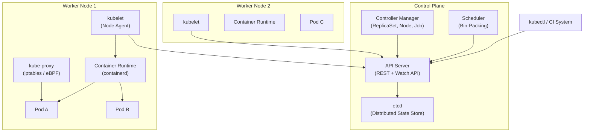
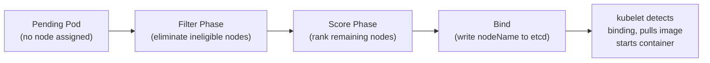
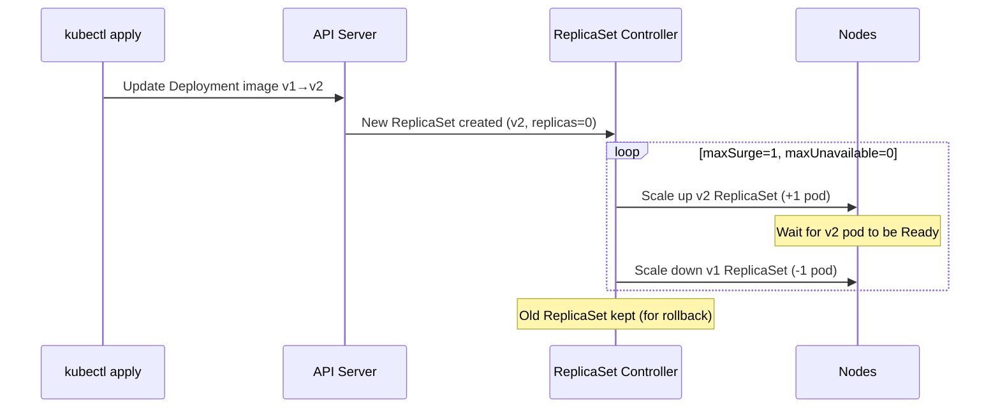

# Design a Container Orchestration System (Kubernetes-Style)

**Difficulty**: 🔴 Advanced
**Reading Time**: 30 minutes
**Interview Frequency**: High — common at senior/staff engineer interviews at cloud-native companies

---

## Problem Statement

You are asked to design a container orchestration platform that:

- **Works at**: 10 containers across 2 nodes — a simple Docker Compose handles this.
- **Breaks at**: 10,000 containers across 500 nodes — manual placement, health checking, and restarts become impossible. You need automated scheduling, self-healing, rolling deployments, and service discovery at scale.

Target scale: **10,000 running pods**, **500 worker nodes**, **1,000 deploys/day**, **sub-30-second scheduling latency**.

---

## Requirements

### Functional Requirements

| Requirement | Description |
|-------------|-------------|
| Scheduling | Place containers on nodes based on resource availability |
| Health Checking | Detect and restart failed containers automatically |
| Service Discovery | Route traffic to healthy container instances |
| Rolling Deployments | Update containers with zero downtime |
| Autoscaling | Scale pods up/down based on CPU/memory metrics |
| Resource Isolation | Guarantee CPU/memory limits per container |

### Non-Functional Requirements

| Requirement | Target |
|-------------|--------|
| Scheduling Latency | < 30 seconds from pod creation to running |
| Control Plane Availability | 99.99% (< 52 min/year downtime) |
| Max Cluster Size | 5,000 nodes, 150,000 pods |
| API Server Throughput | 10,000 req/sec |
| etcd Write Throughput | 1,000 writes/sec |

---

## Capacity Estimates

- **500 nodes × 20 pods/node** = 10,000 pods
- **Each pod spec**: ~2 KB → 10,000 × 2 KB = **20 MB state in etcd**
- **Health check interval**: 10s per pod → 10,000 ÷ 10 = **1,000 health events/sec**
- **API server**: 1,000 engineers × 10 deploys/day = ~**120 API calls/min**
- **etcd**: 3-node cluster handles ~**10,000 writes/sec** (practical limit: keep < 2,000/sec for stability)

---

## High-Level Architecture

---

## Level 1 — Surface: The Control Loop Pattern

The entire system is built on **reconciliation loops**:

1. **Desired state** is written to etcd (e.g., "run 3 replicas of nginx")
2. **Controllers** watch etcd for changes
3. **Controller compares** desired vs actual state
4. **Controller acts** to drive actual → desired (create/delete pods)
5. **Repeat forever**

This is called a **level-triggered** (not edge-triggered) control loop — the system re-evaluates full state periodically, not just on events. This makes it resilient to missed events.

---

## Level 2 — Deep Dive: Scheduling Algorithm

### The Pod Scheduling Pipeline

When a pod is created, the scheduler runs it through two phases:

**Filter predicates** (eliminate nodes that can't run the pod):
- Not enough CPU/memory
- Node has taint that pod doesn't tolerate
- Node affinity doesn't match
- Node is in NotReady state

**Scoring functions** (rank eligible nodes):
- **LeastRequestedPriority**: Prefer nodes with most free resources (spread load)
- **BalancedResourceAllocation**: Prefer balanced CPU/memory ratio
- **ImageLocalityPriority**: Prefer nodes that already have the container image cached

### Bin-Packing vs. Spreading

| Strategy | Goal | When to Use |
|----------|------|-------------|
| **Bin-packing** | Fill nodes fully, fewer nodes needed | Cost optimization, batch workloads |
| **Spreading** | Distribute evenly across nodes | High availability, latency-sensitive |
| **Hybrid** | Pack to quota, spread across failure domains | Production default |

Kubernetes defaults to **spreading** (LeastRequested). Cost-optimized clusters use bin-packing plugins.

---

## Key Design Decisions

### 1. Declarative vs. Imperative API

**Imperative**: "Start 3 nginx containers now."
**Declarative**: "Desired state = 3 nginx replicas. System reconciles to match."

Kubernetes chose **declarative** because:
- Idempotent: re-applying the same config is safe
- Self-healing: controller continuously drives toward desired state
- Auditable: etcd is the source of truth, not in-memory state

Trade-off: Declarative adds latency (reconciliation loop) vs. imperative (immediate action). Scheduling a pod takes 5–30 seconds rather than milliseconds.

### 2. etcd as the Sole State Store

All cluster state lives in etcd (a Raft-based key-value store). The API server is stateless — it only reads/writes etcd.

| Pro | Con |
|-----|-----|
| Single source of truth | etcd is a bottleneck (max ~2,000 writes/sec practical) |
| Watch API enables real-time notifications | Large clusters must shard or use etcd tuning |
| Raft provides consistency | etcd failure = control plane unavailable |

At 5,000+ nodes Kubernetes recommends dedicated high-memory etcd machines and separate etcd clusters for events vs. core objects.

### 3. Horizontal Pod Autoscaler (HPA) Design

HPA runs a control loop:
1. Metrics server scrapes CPU from kubelets every 15s
2. HPA controller computes `desiredReplicas = ceil(currentReplicas × (currentMetric / targetMetric))`
3. Updates Deployment replica count
4. Scheduler places new pods

**Scale-up**: Fast (1–3 minutes). **Scale-down**: Slow (5 minutes stabilization window) to avoid flapping.

---

## Rolling Deployment Strategy

- **maxSurge=1**: At most 1 extra pod above desired count during rollout
- **maxUnavailable=0**: Zero pods unavailable at any time (zero-downtime)
- Old ReplicaSet is kept for instant rollback: `kubectl rollout undo deployment/nginx`

---

## Interview Questions

| Question | What They're Testing | Key Answer Points |
|----------|---------------------|-------------------|
| How does the scheduler place a pod on a node? | Scheduling pipeline knowledge | Filter (eliminate) → Score (rank) → Bind (write to etcd) → kubelet detects binding |
| What happens when a node goes down? | Self-healing understanding | Node controller detects NotReady after 40s grace period, marks pods as Terminating, ReplicaSet controller creates replacements |
| How do you scale to 10,000 nodes? | Scalability bottlenecks | etcd write throughput, API server horizontal scaling, event sharding, reducing watch cardinality |

---

## 📚 Resources & References

| Resource | Type | What You'll Learn |
|----------|------|------------------|
| [Kubernetes Architecture Overview](https://kubernetes.io/docs/concepts/architecture/) | 📚 Docs | Control plane components, data plane, API server internals |
| [Kubernetes The Hard Way](https://github.com/kelseyhightower/kubernetes-the-hard-way) | 📖 Blog | Bootstrap a cluster from scratch — builds deep understanding |
| [ByteByteGo YouTube Channel](https://www.youtube.com/@ByteByteGo) | 📺 YouTube | Visual walkthroughs of container orchestration concepts |
| [Borg, Omega, and Kubernetes](https://research.google/pubs/pub44843/) | 📖 Blog | Google's lessons from 15 years of cluster managers |
| [System Design Interview — Alex Xu](https://www.amazon.com/System-Design-Interview-insiders-Second/dp/B08CMF2CQF) | 📚 Book | Chapter on distributed systems infrastructure |

---

## Related Concepts

- [Distributed Locking](./distributed-locking) — etcd uses Raft consensus, similar to distributed lock concepts
- [Key-Value Store](./key-value-store) — etcd is a distributed key-value store
- [Load Balancer](./load-balancer) — kube-proxy implements service load balancing
- [Metrics & Alerting](./metrics-alerting) — HPA relies on metrics pipeline
