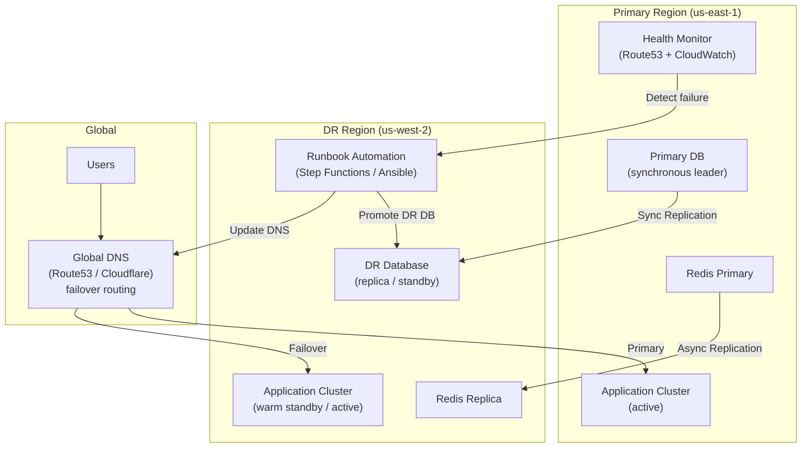
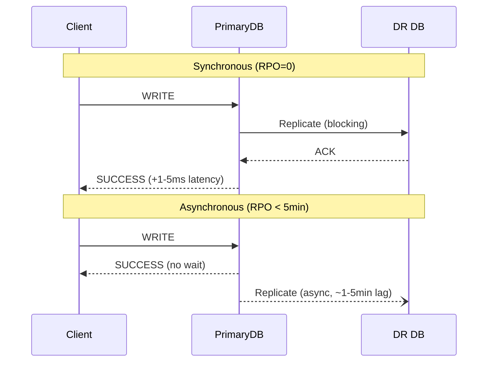
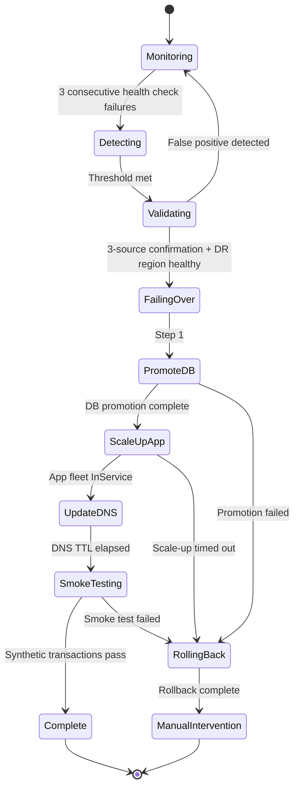

# Design a Disaster Recovery System — RPO = 0, RTO < 15 Minutes

**Difficulty**: 🔴 Advanced
**Reading Time**: 30 minutes
**Interview Frequency**: High — appears in interviews for SRE, infrastructure, and senior backend roles

---

## Problem Statement

You are asked to design a disaster recovery (DR) system that:

- **Works at**: A single-region application — if the region goes down, accept a few hours of downtime.
- **Breaks at**: Financial services, healthcare, or e-commerce handling $1M/hour revenue — a 4-hour outage costs $4M and violates regulatory SLAs. You need **RPO = 0** (zero data loss) and **RTO < 15 minutes** (back online in 15 minutes), which cannot be achieved with backups alone.

Target: **RPO = 0**, **RTO < 15 minutes**, region-level failure recovery, automated runbook execution, annual DR drill passing.

---

## Requirements

### Functional Requirements

| Requirement | Description |
|-------------|-------------|
| Data Replication | Synchronous or asynchronous replication to DR region |
| Failover Automation | Trigger failover via runbook with minimal manual steps |
| Health Monitoring | Detect primary region failure within 60 seconds |
| DNS Failover | Redirect traffic to DR region automatically |
| Data Consistency | Guarantee no data loss (RPO = 0) or bound acceptable loss |
| DR Drill | Test failover without customer impact quarterly |

### Non-Functional Requirements

| Requirement | Target |
|-------------|--------|
| RPO | 0 (synchronous replication) or < 5 minutes (async) |
| RTO | < 15 minutes (automated runbook) |
| Detection Time | < 60 seconds (health check failure threshold) |
| DNS TTL | < 60 seconds for quick propagation |
| Replication Lag | < 500 ms (synchronous), < 5 minutes (async) |
| Annual DR Test Success Rate | 100% (mandatory for compliance) |

---

## Capacity Estimates

- **Synchronous replication write amplification**: every write acknowledged only after DR region confirms → adds **1–5 ms** latency per write (geographic distance dependent)
- **Async replication bandwidth**: 100K writes/sec × 1 KB/write = **100 MB/s** continuous replication traffic
- **Failover window breakdown**: 60s detect + 120s DNS propagation + 300s app warm-up + 300s smoke test = **~13 minutes** total RTO
- **DR infrastructure cost**: Active-active = 2× cost; warm standby = ~1.2× cost; pilot light = ~1.05× cost

---

## High-Level Architecture



---

## Level 1 — Surface: DR Strategy Spectrum

| Strategy | RTO | RPO | Cost vs. Primary | Description |
|----------|-----|-----|-----------------|-------------|
| **Backup & Restore** | Hours | Hours | 5% | Restore from S3 backup on failure |
| **Pilot Light** | 30–60 min | Minutes | 10–15% | Core services running (DB replica), app servers off |
| **Warm Standby** | 5–30 min | Seconds | 30–50% | Full stack running at reduced capacity |
| **Active-Active** | < 1 min | 0 | 100% | Both regions serving traffic simultaneously |

**Selection framework**:
- Revenue > $1M/hour → Active-Active
- Revenue $100K–$1M/hour → Warm Standby
- Revenue < $100K/hour → Pilot Light
- Non-critical systems → Backup & Restore

---

## Level 2 — Deep Dive: Achieving RPO = 0

RPO = 0 requires that no writes are lost during failover. This means every write must be durably committed in the DR region before acknowledging to the client.

### Synchronous vs. Asynchronous Replication Trade-off



**Synchronous replication cost**: 1–5 ms added write latency per the speed-of-light from us-east-1 to us-west-2 (~40 ms round trip). For most applications, this is acceptable.

**When to use async**: Write-heavy workloads where 1–5 ms added latency is unacceptable (HFT, gaming) and 5-minute RPO is acceptable per business requirements.

### Automated Failover Runbook

The runbook is the difference between RTO = 2 hours (manual) and RTO = 15 minutes (automated).

```
RUNBOOK: Primary Region Failure

Step 1: DETECT (automated, 60s)
  - Health check fails 3 consecutive times
  - CloudWatch alarm triggers SNS → Lambda

Step 2: VALIDATE (automated, 30s)
  - Confirm not a false positive (check from 3 locations)
  - Check DR region health (don't fail over to broken DR)

Step 3: PROMOTE DR DATABASE (automated, 60s)
  - RDS: aws rds promote-read-replica --db-instance-identifier dr-db
  - Wait for DR DB to accept writes (health check loop)

Step 4: SCALE UP DR FLEET (automated, 120s)
  - Auto Scaling Group: set desired capacity to production level
  - Wait for instances to be InService

Step 5: UPDATE DNS (automated, 30s)
  - Route53: update failover record to DR endpoint
  - DNS TTL = 60s → propagates in ~60 seconds

Step 6: SMOKE TEST (automated, 120s)
  - Run synthetic transactions against DR endpoint
  - Alert on-call if smoke test fails

Step 7: NOTIFY (automated)
  - PagerDuty alert with runbook status
  - Status page update
```

---

## Key Design Decisions

### 1. Database Failover: Automated vs. Manual Promotion

| Approach | RTO Contribution | Risk |
|----------|-----------------|------|
| Manual DBA promotion | 30–60 min | Slow but human-verified |
| Automated promotion | 1–2 min | Risk of split-brain if false positive |

**Split-brain risk**: If primary region is not truly down (network partition only), both primary and DR DB may accept writes → data divergence. Mitigations:
- STONITH (Shoot The Other Node In The Head) — forcibly terminate primary before promoting DR
- Quorum-based failover — require majority agreement that primary is down
- Automated promotion only if primary region health check fails from 3 independent locations

### 2. DNS TTL and Propagation

Route53 low TTL (60s): DNS resolvers refresh quickly, minimizing time users are routed to dead primary.
Trade-off: Lower TTL → more DNS queries → higher Route53 cost, but negligible at $0.40/million queries.

For health-check-based failover: Route53 takes ~60–120 seconds to propagate after health check failure is detected. This is unavoidable — factor into RTO budget.

### 3. Stateful Services: Session and Cache

| Service | Failover Challenge | Solution |
|---------|------------------|----------|
| User sessions (JWT) | Stateless — no migration needed | JWT signed with same secret in DR region |
| User sessions (server-side) | Session stored in primary Redis | Async-replicate Redis to DR; accept re-login for ~5min of sessions |
| Distributed cache | Cold start in DR | Warm DR cache with top 1,000 keys; accept cache miss spike on failover |

---

## Interview Questions

| Question | What They're Testing | Key Answer Points |
|----------|---------------------|-------------------|
| How do you achieve RPO=0 without adding 40ms write latency? | Trade-off analysis | You generally can't — synchronous replication within same region (AZ failover) gives RPO=0 with ~1ms overhead; cross-region RPO=0 requires accepting the latency or redesigning writes |
| How do you test DR without impacting production? | Operational maturity | DR drill using isolated traffic (synthetic users), dark launch to DR region, chaos engineering with fault injection on copy of prod, Game Day exercises |
| What's the biggest risk in automated failover? | Failure mode reasoning | False positive causing unnecessary failover (split-brain); mitigate with multi-source health checks, conservative detection thresholds, STONITH before promotion |

---

## Component Deep Dive 1: Automated Failover Orchestration Engine

The failover orchestration engine is the single most critical component in a DR system. It is the difference between RTO = 2 hours (war room, manual steps, partial information) and RTO < 15 minutes (automated runbook, deterministic execution, automatic rollback). Getting this wrong — either a missed failover or an unnecessary one — can cost millions of dollars.

### How It Works Internally

The orchestration engine runs as a state machine, not a simple script. Each failover attempt transitions through well-defined states: `MONITORING → DETECTING → VALIDATING → FAILING_OVER → SMOKE_TESTING → COMPLETE` (or `ROLLING_BACK` on failure). This matters because partial failovers — where DNS was updated but the database was not yet promoted — are more dangerous than no failover at all.

A typical implementation uses AWS Step Functions (or equivalent) to model the state machine. Each step has a built-in retry policy with exponential backoff and a hard timeout. If any step exceeds its timeout, the state machine transitions to `ROLLING_BACK` and pages the on-call engineer with the exact state that failed.

The validation phase (Step 2 in the runbook) is where most naive implementations fail. A single health check endpoint going down does not mean the region is dead — it could be a network partition between the health checker and the app, a single availability zone failure (which AZ-level failover handles without cross-region failover), or a transient network blip. Robust validation requires:

1. Three independent health checks from geographically separated vantage points
2. Correlation of application-level health (HTTP 200 rate) with infrastructure health (EC2 instance status, RDS event log)
3. A minimum consecutive failure threshold (3 failures × 20s intervals = 60s detection window)
4. A "canary query" — a synthetic write to the primary database — to confirm the DB is truly unreachable, not just the app layer

### Why Naive Approaches Fail at Scale

A simple "if health check fails, update DNS" script fails in three critical ways:

**Problem 1: Split-brain.** The primary region is network-partitioned from your monitoring infrastructure, but is still accepting writes from clients that have cached the DNS record. If you promote the DR replica to writable at this point, both regions accept writes simultaneously. When the partition heals, you have diverged data with no automatic merge strategy.

**Problem 2: False positives.** At 10,000 EC2 instances across two regions, the probability that at least one health check endpoint returns a non-200 at any given moment is nearly 100%. A naive single-check implementation would constantly trigger unnecessary failovers.

**Problem 3: Cascading runbook.** If the DR database promotion succeeds but the Auto Scaling Group scale-up fails (e.g., EC2 capacity exhausted in the DR region), you have a promoted writable DB with no application servers to serve it — and your original primary is now being STONITH'd. The state machine must detect partial completion and execute a defined rollback, not just halt.

### Orchestration State Machine Diagram



### Trade-off Table: Orchestration Implementation Options

| Approach | Execution Latency | Complexity | Blast Radius on Bug | Best For |
|----------|------------------|------------|---------------------|----------|
| AWS Step Functions | +2s overhead per step | Medium — JSON-defined states | Low — bad state → step fails, not runaway | Teams on AWS, compliance-heavy |
| Custom Lambda chain | ~500ms per step | Low — just functions | High — a bug in Lambda N can skip all subsequent steps | Simple 3-step runbooks |
| Ansible Tower playbook | 5–10s per task | Medium — YAML playbooks | Medium — idempotent tasks limit damage | Multi-cloud, on-prem hybrid |
| Kubernetes Operator | Near-zero overhead | High — custom controller | Low — reconciliation loop is self-healing | K8s-native infrastructure |

**Recommendation**: Step Functions for AWS-native stacks. The visual execution history and built-in retry/catch semantics make debugging a failed runbook post-incident dramatically faster than tracing Lambda logs.

---

## Component Deep Dive 2: Database Replication and Promotion

The database layer is where RPO promises are made or broken. Every other layer of the stack is stateless or easily reconstructed — application servers are re-launched from AMIs, caches are re-warmed, load balancers are reconfigured. The database is the source of truth. If it has data loss, the DR system has failed its primary objective.

### Internal Mechanics

In PostgreSQL (the most common choice for synchronous DR replication), the replication pipeline works as follows:

1. A write transaction commits on the primary, writing to the Write-Ahead Log (WAL).
2. The WAL sender process streams the WAL record to the standby's WAL receiver over a persistent TCP connection.
3. In **synchronous mode** (`synchronous_commit = remote_write`), the primary WAL sender waits for the standby's WAL receiver to acknowledge writing the record to its WAL buffer before returning success to the client. This does NOT wait for the standby to flush to disk, giving a practical RPO of ~0 with minimal latency overhead (~1–3ms for same-city, ~5–15ms for cross-region).
4. In **synchronous mode** (`synchronous_commit = remote_apply`), the primary waits for the standby to apply the WAL record to its data pages — true RPO = 0 but +20–40ms latency cross-region.
5. For Amazon RDS Multi-AZ, synchronous replication is the default within an AWS region, giving RPO = 0 for AZ-level failure at ~1ms overhead. Cross-region read replicas use asynchronous replication.

### Scale Behavior at 10x Load

At 10x write load (e.g., scaling from 10K to 100K writes/sec), the replication pipeline introduces a new bottleneck: WAL sender throughput. A single WAL sender process on a large RDS instance can saturate at approximately 800 MB/s of WAL throughput. At 1 KB average write size, that is roughly 800K writes/sec — adequate for most workloads but a real ceiling for write-heavy financial systems. The mitigation is logical replication with multiple publication slots (one per shard) distributed across multiple standby nodes.

```mermaid
sequenceDiagram
    participant Client
    participant Primary as Primary DB
    participant WALSender as WAL Sender Process
    participant WALReceiver as DR WAL Receiver
    participant DRDB as DR DB

    Client->>Primary: BEGIN; UPDATE accounts SET balance=balance-100; COMMIT
    Primary->>Primary: Write to WAL buffer (in-memory)
    Primary->>WALSender: Notify: new WAL record
    WALSender->>WALReceiver: Stream WAL record (TCP, persistent)
    WALReceiver->>DRDB: Write to DR WAL buffer
    WALReceiver-->>WALSender: ACK (remote_write)
    WALSender-->>Primary: Standby confirmed write
    Primary-->>Client: COMMIT SUCCESS (+5ms)
    Note over DRDB: Applies WAL async<br/>(data pages updated<br/>within ~100ms)
```

### Database Promotion Timeline

When the runbook triggers `promote-read-replica`, the following sequence occurs on AWS RDS:

1. AWS stops WAL receiver on the standby (no more incoming replication)
2. Standby applies all remaining WAL records in its receive buffer (~0–500ms depending on lag)
3. Standby writes a `recovery.signal` file and performs a controlled shutdown of recovery mode
4. Standby starts as a new writable primary, accepting connections on the same endpoint
5. AWS updates the CNAME for the RDS endpoint to point to the new primary (~30s)

Total time: **60–120 seconds** for RDS. For self-managed PostgreSQL, `pg_ctl promote` takes 5–30 seconds but endpoint reconfiguration is manual.

---

## Component Deep Dive 3: DNS Failover and Traffic Routing

DNS failover is the final step that makes the DR system user-visible. All the correct database promotion and application scaling means nothing if users are still hitting a dead endpoint. DNS is deceptively simple — "just update a record" — but the propagation model creates hard timing constraints that must be designed around, not wished away.

### How DNS TTL Creates Minimum RTO

DNS records have a TTL (Time To Live) that tells resolvers how long to cache the record. A TTL of 300 seconds means that even after you update the Route53 record to point to the DR region, users whose DNS resolver cached the old record will continue hitting the primary region for up to 5 minutes. This creates a hard floor on user-visible RTO:

**User-visible RTO = Failover detection time + Runbook execution time + Remaining DNS TTL of most recently cached record**

With a 60-second TTL (Route53's minimum recommended for DR), the worst case is that a user cached the record 1 second before the failover was triggered, giving them 59 more seconds on the stale record. In practice, the distribution is uniform, so median additional wait is 30 seconds.

### Route53 Health-Check-Based Failover

Route53 supports **failover routing policies** with attached health checks. The mechanism:

1. A primary DNS record (type A/CNAME) is tagged as `PRIMARY` with a health check pointing to a health endpoint on the primary ALB.
2. A secondary DNS record is tagged as `SECONDARY` (failover target).
3. Route53 polls the health check endpoint every 10 seconds from 3–5 regional health checkers.
4. If the health check fails for 3 consecutive polls (30 seconds), Route53 automatically stops serving the `PRIMARY` record and returns the `SECONDARY` record to new DNS queries.
5. Previously cached primary records continue to be served by resolvers until their TTL expires.

### Trade-off Table: DNS Failover Approaches

| Approach | Failover Trigger Time | Client Impact | Complexity | Limitation |
|----------|----------------------|---------------|------------|------------|
| Route53 Health Check | 30–60s automatic | Transparent after TTL | Low | TTL still applies; no active connections migrated |
| Anycast (Cloudflare) | < 10s | Minimal — IP doesn't change | Medium | Requires BGP control, complex for most teams |
| Client-side retry with SDK | Immediate (next retry) | Brief error, then reconnects | High — requires SDK changes | Only works for applications you control |
| Traffic Manager (Azure Front Door) | 60–90s | Transparent | Medium | Azure-specific |

**Key insight**: For existing TCP connections (long-lived WebSocket connections, database connections from an app server), DNS failover does nothing. Those connections are to the IP address of the primary, not the hostname. The application must detect connection failure and re-resolve the hostname to get the new IP. Design all connection pools with aggressive timeout settings (connect timeout = 5s, idle timeout = 60s) so they fail fast and reconnect during failover.

---

## Data Model

The DR system itself needs persistent state — health check results, runbook execution logs, replication lag metrics, and failover history. Using a PostgreSQL schema:

```sql
-- Replication lag tracking (sampled every 10 seconds)
CREATE TABLE replication_lag_samples (
    sample_id        BIGSERIAL PRIMARY KEY,
    sampled_at       TIMESTAMPTZ NOT NULL DEFAULT now(),
    primary_region   VARCHAR(20) NOT NULL,       -- e.g. 'us-east-1'
    dr_region        VARCHAR(20) NOT NULL,       -- e.g. 'us-west-2'
    lag_bytes        BIGINT NOT NULL,            -- bytes of WAL not yet applied in DR
    lag_seconds      NUMERIC(8,3) NOT NULL,      -- seconds behind primary
    replication_mode VARCHAR(20) NOT NULL        -- 'synchronous' | 'asynchronous'
);
CREATE INDEX idx_lag_samples_time ON replication_lag_samples(sampled_at DESC);

-- Failover event log
CREATE TABLE failover_events (
    event_id         UUID PRIMARY KEY DEFAULT gen_random_uuid(),
    triggered_at     TIMESTAMPTZ NOT NULL DEFAULT now(),
    trigger_reason   VARCHAR(100) NOT NULL,   -- 'health_check_failure' | 'manual' | 'dr_drill'
    primary_region   VARCHAR(20) NOT NULL,
    dr_region        VARCHAR(20) NOT NULL,
    rto_target_secs  INTEGER NOT NULL DEFAULT 900,   -- 15 minutes
    detection_secs   INTEGER,                        -- actual time to detect failure
    runbook_secs     INTEGER,                        -- actual runbook execution time
    dns_propagation_secs INTEGER,                    -- measured DNS propagation time
    total_rto_secs   INTEGER,                        -- total user-visible RTO
    outcome          VARCHAR(20) NOT NULL,            -- 'success' | 'partial' | 'rolled_back'
    notes            TEXT
);

-- Runbook step execution log (one row per step per failover)
CREATE TABLE runbook_steps (
    step_id          BIGSERIAL PRIMARY KEY,
    event_id         UUID NOT NULL REFERENCES failover_events(event_id),
    step_name        VARCHAR(100) NOT NULL,   -- 'validate', 'promote_db', 'scale_app', 'update_dns', 'smoke_test'
    started_at       TIMESTAMPTZ NOT NULL,
    completed_at     TIMESTAMPTZ,
    duration_ms      INTEGER GENERATED ALWAYS AS (
                       EXTRACT(MILLISECONDS FROM completed_at - started_at)::INTEGER
                     ) STORED,
    status           VARCHAR(20) NOT NULL,    -- 'running' | 'success' | 'failed' | 'skipped'
    error_message    TEXT,
    retry_count      INTEGER NOT NULL DEFAULT 0
);

-- Health check results (ingested from Route53, Datadog, etc.)
CREATE TABLE health_check_results (
    check_id         BIGSERIAL PRIMARY KEY,
    checked_at       TIMESTAMPTZ NOT NULL DEFAULT now(),
    region           VARCHAR(20) NOT NULL,
    endpoint_url     VARCHAR(500) NOT NULL,
    http_status      INTEGER,                -- NULL if connection failed
    response_ms      INTEGER,               -- NULL if connection failed
    is_healthy       BOOLEAN NOT NULL,
    checker_location VARCHAR(50) NOT NULL    -- 'us-east-1', 'eu-west-1', 'ap-southeast-1'
);
CREATE INDEX idx_health_checks_region_time ON health_check_results(region, checked_at DESC);

-- DR drill schedule and results
CREATE TABLE dr_drills (
    drill_id         UUID PRIMARY KEY DEFAULT gen_random_uuid(),
    scheduled_for    TIMESTAMPTZ NOT NULL,
    drill_type       VARCHAR(50) NOT NULL,   -- 'read_replica_failover' | 'full_region_failover' | 'runbook_walkthrough'
    is_isolated      BOOLEAN NOT NULL,       -- true = synthetic traffic only, false = production
    executed_at      TIMESTAMPTZ,
    passed           BOOLEAN,
    rto_achieved_secs INTEGER,
    rpo_achieved_secs INTEGER,
    findings         TEXT
);
```

---

## Scale Bottlenecks

| Traffic Level | Component That Breaks | Symptoms | Mitigation |
|---------------|----------------------|----------|------------|
| 10x baseline (100K writes/sec) | WAL sender process on primary DB | Replication lag climbs from 0ms to 5–30s; synchronous writes stall waiting for DR ACK | Upgrade DB instance; enable WAL compression (30–50% reduction in bytes streamed); split WAL into multiple replication slots by table group |
| 100x baseline (1M writes/sec) | WAL sender TCP bandwidth (800 MB/s ceiling) | DR replica falls behind by minutes; RPO SLA violated | Horizontal shard split — each shard replicates independently; logical replication with multiple publication slots |
| 100x baseline | DNS infrastructure during failover spike | Route53 rate limit hit (~100 API calls/sec); Cloudflare API 429s | Pre-stage DR DNS records; failover is a single record UPDATE, not bulk changes; use exponential backoff in runbook DNS step |
| 100x baseline | EC2 On-Demand capacity in DR region | Auto Scaling Group scale-up fails with `InsufficientInstanceCapacity` | Reserve EC2 capacity in DR region (1-year Reserved Instances or On-Demand Capacity Reservations); use multiple instance types in launch template |
| 1000x baseline (10M writes/sec) | Cross-region replication itself | Physical bandwidth between regions saturated (~10 Gbps limit on AWS inter-region links at sustained load) | Move to multi-region active-active with sharded writes per region; eliminate cross-region sync replication entirely; use CRDTs or event sourcing for eventual consistency |
| Any level, cold DR cache | Redis DR replica cold on failover | Cache hit rate drops from 90% → 0% for ~10 minutes; thundering herd on DB | Pre-warm DR cache: async replicate top 10K hot keys every 5 minutes; use probabilistic early expiry (PER) to prevent dog-pile |

---

## DR Drill Design

A DR system that has never been tested in production conditions is not a DR system — it is a theoretical construct. DR drills must be designed carefully to validate the actual RTO/RPO without causing customer impact.

### Three Types of DR Drills

**1. Isolated Synthetic Traffic Drill (quarterly minimum)**

Route 1–5% of synthetic traffic (generated by a load testing tool like Gatling or k6) to the DR region 48 hours before the drill. During the drill, simulate a primary region failure by:
- Blocking all DNS resolution to the primary region endpoint (iptables rules on health check instances)
- Verifying that Route53 detects the failure within 30–60 seconds
- Measuring actual RTO with synthetic users as the canopy

This validates the automated runbook without any production customer impact. Limitation: synthetic traffic does not capture every code path, so smoke tests may pass even when real customer journeys would fail.

**2. Live Traffic Canary Failover (semi-annual)**

Route 1% of production traffic to the DR region using a weighted routing policy. This validates:
- DR database handles real query patterns (not just synthetic benchmarks)
- Session replication is working (real users' sessions are present in DR region)
- Any latency-sensitive code paths that behave differently with cross-region cache misses

**3. Full Region Failover Drill (annual, mandatory for SOC2/PCI compliance)**

Execute a complete failover during a planned maintenance window, communicate to customers in advance, and measure every step of the runbook. This is the only drill that validates the full system including DNS propagation at real scale. The 15-minute RTO target must be demonstrated to the compliance auditor with a signed run-report showing detection time, each runbook step duration, and total user-visible recovery time.

### Runbook Documentation Standard

Every runbook step must be documented with: the command executed, the expected output, the success condition, the failure condition, and the manual intervention path if automation fails. A runbook that says "promote the database" is not a runbook — it is a note. A runbook that says "`aws rds promote-read-replica --db-instance-identifier prod-dr-replica-1 --region us-west-2` → wait for status `available` → verify with `psql -h dr-endpoint -c 'SELECT pg_is_in_recovery();'` returns `false`" is operational documentation.

---

## How Netflix Built This

Netflix operates a multi-region active-active architecture across AWS regions (us-east-1, us-west-2, eu-west-1) handling **200 million+ subscribers** and **700,000+ concurrent streams** at peak. Their DR approach is more aggressive than traditional warm standby — they call it **Chaos Engineering at the infrastructure level**.

**Technology choices**: Netflix uses Apache Cassandra as their primary distributed data store, configured with replication factor 3 across three AWS availability zones per region, and cross-region replication through Cassandra's built-in multi-datacenter replication. This gives them RPO = 0 for single-AZ failures and RPO < 30 seconds for region-level failures, with no manual intervention required — Cassandra's gossip protocol handles topology changes automatically.

**Specific numbers**: Netflix's Cassandra clusters handle approximately **1 million reads/sec and 300,000 writes/sec** per cluster across their video metadata and user state stores. The WAL-equivalent (Cassandra's commit log) is written to SSD locally, and replication between DCs uses Cassandra's snitch mechanism to route writes to the nearest datacenter first, then asynchronously to the remote datacenter.

**Non-obvious architectural decision**: Netflix does not treat DR as a separate "failover" event. Instead, they run continuous Chaos Engineering (the famous Netflix Chaos Monkey and Chaos Kong tools) that intentionally terminates random instances, entire AZs, and even entire regions in production during business hours. The reasoning: if your system can survive random instance termination during Tuesday afternoon traffic, it will survive an actual region failure at 3am. The "DR drill" is not a quarterly exercise — it happens continuously. Chaos Kong specifically simulates a full region failure, redirecting all traffic from one AWS region to another, on a regular schedule.

**Source**: Netflix Engineering Blog — "Chaos Engineering Upgraded" (2020), "Active-Active for Multi-Regional Resiliency" (2013), and the Simian Army GitHub repository.

### Lessons Applicable to Your Design

Netflix's approach surfaces three lessons that most teams skip:

**Lesson 1 — DR must be invisible.** If failover requires customer notification or is treated as a special event, your DR system has already failed its design goal. The target is that customers notice a brief increase in error rate (< 0.1%) for < 60 seconds and nothing else. This is only possible with active-active traffic routing, not warm standby.

**Lesson 2 — Runbooks rot.** Netflix discovered through Chaos Engineering that runbooks written 6 months earlier fail to execute correctly because the environment had changed — new services added, dependency endpoints changed, IAM permissions modified. Runbooks must be executed against production (in isolated form) at least quarterly to catch drift before a real incident. Their Chaos Kong exercises serve as automated runbook validation.

**Lesson 3 — The database is not the hardest part.** Netflix found that their most frequent failover complications involved stateful microservices that used in-memory queues, local file storage, or sticky load balancing — not the primary database. Cassandra's eventual consistency model made the DB layer resilient; the application layer had dozens of hidden statefulness assumptions. Audit every microservice for local state before declaring your DR system production-ready.

For teams not at Netflix scale: the Active-Active architecture Netflix runs requires 2× infrastructure cost and significantly more engineering complexity. The ROI calculation should start with: what is the cost of 15 minutes of downtime? If the answer is less than the annual cost of running a second full production stack, warm standby with automated runbooks delivers the correct trade-off.

---

## Interview Angle

**What the interviewer is testing:** The interviewer wants to see whether you understand that DR is not a backup strategy — it is an operational discipline requiring automation, testing, and operational runbooks. They are testing your ability to make quantitative trade-offs between RPO/RTO targets and cost/complexity, and whether you understand the failure modes that turn a theoretical DR plan into a production disaster.

**Common mistakes candidates make:**

1. **Treating backup as DR.** Saying "we take daily snapshots to S3" when asked for RPO = 0, RTO < 15 minutes. Backup = recovery from data corruption or deletion (hours-day timescale). DR = recovery from infrastructure failure (minutes timescale). They solve different problems with different architectures.

2. **Ignoring split-brain.** Designing automated failover without describing how you prevent both regions from accepting writes simultaneously. This is the single most dangerous failure mode in DR systems. Every interviewer who has been on a 3am incident involving split-brain will probe this hard. The correct answer involves STONITH, quorum-based promotion, and fencing.

3. **Underestimating stateful services.** Focusing entirely on the database and forgetting sessions, caches, message queue offsets, and in-flight background jobs. A complete DR design must enumerate every stateful component and describe its failover behavior explicitly.

4. **Skipping the DR drill.** Not mentioning how you validate the system works. A DR plan that has never been tested is not a DR plan — it is a hope. Automated DR drills with synthetic traffic, executed quarterly or continuously (Netflix-style), are the only way to know your RTO target is achievable.

**The insight that separates good from great answers:** RTO is a budget you must allocate. Break it into: detection time (60s) + validation time (30s) + DB promotion (90s) + app scaling (120s) + DNS propagation (60s) + smoke test (120s) = 480s = 8 minutes. Now you have margin before the 15-minute SLA. Every component that takes longer than its budget must be optimized or parallelized. Great candidates sketch this budget on the whiteboard rather than vaguely promising "under 15 minutes."

---

## Key Numbers to Remember

| Metric | Value | Context |
|--------|-------|---------|
| Route53 health check detection time | 30–60 seconds | 3 consecutive failures × 10–20s interval |
| DNS TTL minimum for DR | 60 seconds | Balances propagation speed vs. Route53 query cost ($0.40/million queries) |
| Cross-region synchronous replication latency | 5–15 ms added write latency | us-east-1 to us-west-2 (~40ms round trip, ÷2 for one-way + processing) |
| RDS read replica promotion time | 60–120 seconds | Time from API call to new primary accepting writes |
| WAL sender throughput ceiling | ~800 MB/s | Single WAL sender on large RDS instance; ~800K writes/sec at 1KB avg write |
| Async replication lag (cross-region) | 1–5 minutes | Under normal load; can grow to 30+ minutes under heavy write bursts |
| EC2 Auto Scaling scale-up time | 2–4 minutes | From desired capacity change to all instances InService |
| Cassandra cross-DC replication lag | < 30 seconds | Under normal network conditions; p99 at Netflix scale |
| Cache miss spike duration on failover | 5–15 minutes | Time for DR cache to warm from organic traffic |
| Total RTO budget breakdown | 60+30+90+120+60+120 = 480s | Detection + Validate + DB promote + Scale + DNS + Smoke test |
| DR infrastructure cost multiplier | 1.05× – 2.0× | Pilot Light (1.05×) → Warm Standby (1.3×) → Active-Active (2.0×) |
| Route53 health check poll interval | 10 seconds | Default; minimum is 10s (fast) or 30s (standard) |
| RDS synchronous standby write overhead | ~1 ms (same AZ), ~5–15 ms (cross-region) | Depends on inter-region network round-trip time |
| False-positive failover rate target | < 1 per year | Higher rate = "failover fatigue"; operators start ignoring alerts |
| Maximum acceptable replication lag before alert | 30 seconds async, 0 ms sync | Alert at 50% of RPO budget to allow time to investigate |
| EC2 Reserved Capacity cost for DR | ~30% of On-Demand price | 1-year reservation; eliminates `InsufficientInstanceCapacity` risk |
| Minimum DR drill frequency (SOC2 / PCI) | Quarterly isolated + Annual full | Compliance requirement; documented RTO evidence required |

---

## 📚 Resources & References

| Resource | Type | What You'll Learn |
|----------|------|------------------|
| [AWS DR Strategies Blog](https://aws.amazon.com/blogs/architecture/disaster-recovery-dr-architecture-on-aws-part-i-strategies-for-recovery-in-the-cloud/) | 📖 Blog | Complete RPO/RTO spectrum with AWS implementation patterns |
| [Google SRE Book — Cascading Failures](https://sre.google/sre-book/addressing-cascading-failures/) | 📖 Blog | How failures propagate and how to design for graceful degradation |
| [Designing Data-Intensive Applications](https://www.oreilly.com/library/view/designing-data-intensive-applications/9781491903063/) | 📚 Book | Chapter 9: consistency during failover, split-brain prevention |
| [ByteByteGo — Disaster Recovery](https://www.youtube.com/@ByteByteGo) | 📺 YouTube | Visual comparison of DR strategies |

---

---

## Quick Decision Guide

Use this when scoping a DR design in an interview or production planning:

| Question | If YES → | If NO → |
|----------|----------|---------|
| Revenue > $500K/hour? | Active-Active (RPO=0, RTO<1min) | Continue to next question |
| Revenue $50K–$500K/hour? | Warm Standby (RPO<30s, RTO<15min) | Continue to next question |
| Regulatory requirement (PCI, HIPAA)? | Warm Standby minimum + quarterly drill | Continue to next question |
| Write-heavy, 1M+ writes/sec? | Async replication + accept RPO<5min | Synchronous replication is fine |
| Single team maintains DR? | Fully automated runbook (Step Functions) | Shared runbook + on-call rotation |
| Cross-region distance > 1000 km? | Async replication (sync adds 10–30ms) | Synchronous replication viable |

---

## Related Concepts

- [Cloud Backup](./cloud-backup) — backup is the foundation layer of DR
- [Distributed Locking](./distributed-locking) — preventing split-brain during failover
- [Metrics & Alerting](./metrics-alerting) — health checks that trigger the DR runbook
