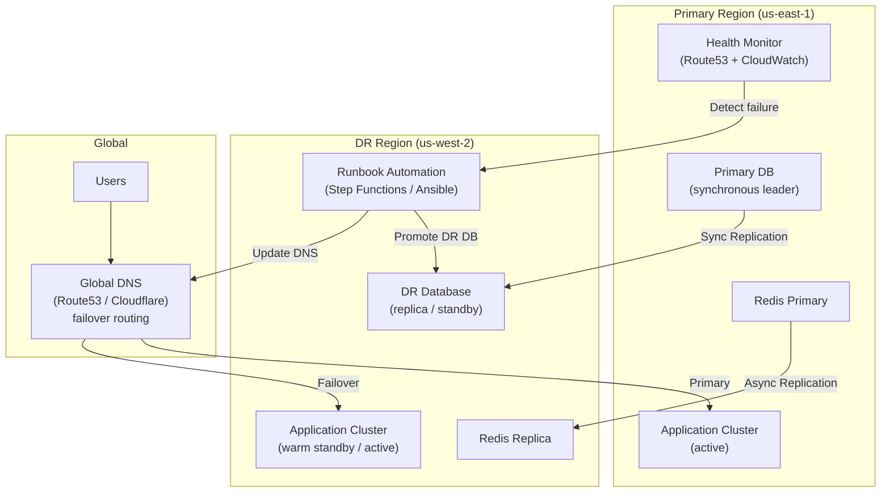
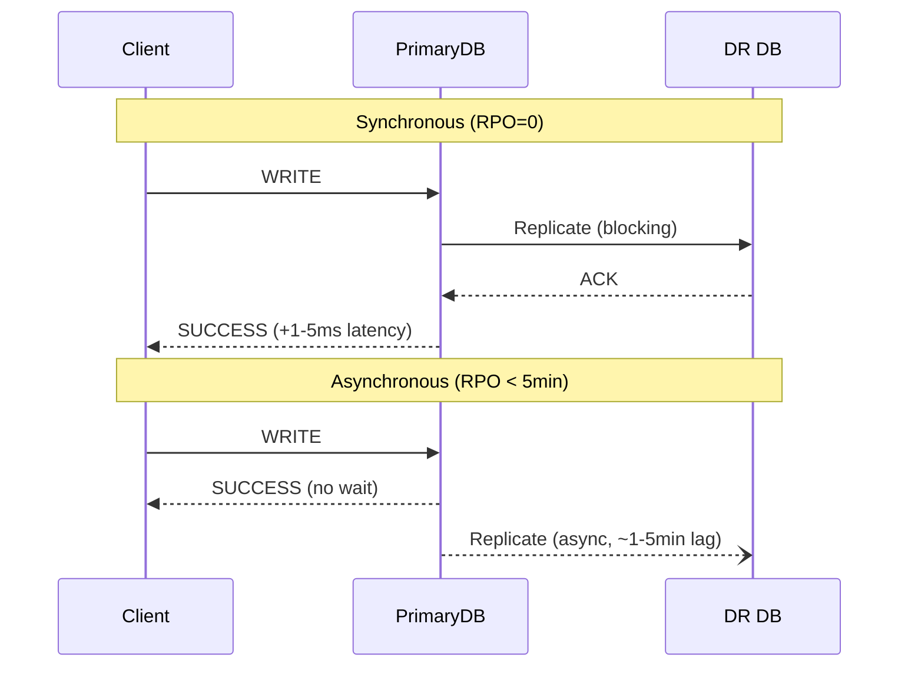

# Design a Disaster Recovery System — RPO = 0, RTO < 15 Minutes

**Difficulty**: 🔴 Advanced
**Reading Time**: 30 minutes
**Interview Frequency**: High — appears in interviews for SRE, infrastructure, and senior backend roles

---

## Problem Statement

You are asked to design a disaster recovery (DR) system that:

- **Works at**: A single-region application — if the region goes down, accept a few hours of downtime.
- **Breaks at**: Financial services, healthcare, or e-commerce handling $1M/hour revenue — a 4-hour outage costs $4M and violates regulatory SLAs. You need **RPO = 0** (zero data loss) and **RTO < 15 minutes** (back online in 15 minutes), which cannot be achieved with backups alone.

Target: **RPO = 0**, **RTO < 15 minutes**, region-level failure recovery, automated runbook execution, annual DR drill passing.

---

## Requirements

### Functional Requirements

| Requirement | Description |
|-------------|-------------|
| Data Replication | Synchronous or asynchronous replication to DR region |
| Failover Automation | Trigger failover via runbook with minimal manual steps |
| Health Monitoring | Detect primary region failure within 60 seconds |
| DNS Failover | Redirect traffic to DR region automatically |
| Data Consistency | Guarantee no data loss (RPO = 0) or bound acceptable loss |
| DR Drill | Test failover without customer impact quarterly |

### Non-Functional Requirements

| Requirement | Target |
|-------------|--------|
| RPO | 0 (synchronous replication) or < 5 minutes (async) |
| RTO | < 15 minutes (automated runbook) |
| Detection Time | < 60 seconds (health check failure threshold) |
| DNS TTL | < 60 seconds for quick propagation |
| Replication Lag | < 500 ms (synchronous), < 5 minutes (async) |
| Annual DR Test Success Rate | 100% (mandatory for compliance) |

---

## Capacity Estimates

- **Synchronous replication write amplification**: every write acknowledged only after DR region confirms → adds **1–5 ms** latency per write (geographic distance dependent)
- **Async replication bandwidth**: 100K writes/sec × 1 KB/write = **100 MB/s** continuous replication traffic
- **Failover window breakdown**: 60s detect + 120s DNS propagation + 300s app warm-up + 300s smoke test = **~13 minutes** total RTO
- **DR infrastructure cost**: Active-active = 2× cost; warm standby = ~1.2× cost; pilot light = ~1.05× cost

---

## High-Level Architecture



---

## Level 1 — Surface: DR Strategy Spectrum

| Strategy | RTO | RPO | Cost vs. Primary | Description |
|----------|-----|-----|-----------------|-------------|
| **Backup & Restore** | Hours | Hours | 5% | Restore from S3 backup on failure |
| **Pilot Light** | 30–60 min | Minutes | 10–15% | Core services running (DB replica), app servers off |
| **Warm Standby** | 5–30 min | Seconds | 30–50% | Full stack running at reduced capacity |
| **Active-Active** | < 1 min | 0 | 100% | Both regions serving traffic simultaneously |

**Selection framework**:
- Revenue > $1M/hour → Active-Active
- Revenue $100K–$1M/hour → Warm Standby
- Revenue < $100K/hour → Pilot Light
- Non-critical systems → Backup & Restore

---

## Level 2 — Deep Dive: Achieving RPO = 0

RPO = 0 requires that no writes are lost during failover. This means every write must be durably committed in the DR region before acknowledging to the client.

### Synchronous vs. Asynchronous Replication Trade-off



**Synchronous replication cost**: 1–5 ms added write latency per the speed-of-light from us-east-1 to us-west-2 (~40 ms round trip). For most applications, this is acceptable.

**When to use async**: Write-heavy workloads where 1–5 ms added latency is unacceptable (HFT, gaming) and 5-minute RPO is acceptable per business requirements.

### Automated Failover Runbook

The runbook is the difference between RTO = 2 hours (manual) and RTO = 15 minutes (automated).

```
RUNBOOK: Primary Region Failure

Step 1: DETECT (automated, 60s)
  - Health check fails 3 consecutive times
  - CloudWatch alarm triggers SNS → Lambda

Step 2: VALIDATE (automated, 30s)
  - Confirm not a false positive (check from 3 locations)
  - Check DR region health (don't fail over to broken DR)

Step 3: PROMOTE DR DATABASE (automated, 60s)
  - RDS: aws rds promote-read-replica --db-instance-identifier dr-db
  - Wait for DR DB to accept writes (health check loop)

Step 4: SCALE UP DR FLEET (automated, 120s)
  - Auto Scaling Group: set desired capacity to production level
  - Wait for instances to be InService

Step 5: UPDATE DNS (automated, 30s)
  - Route53: update failover record to DR endpoint
  - DNS TTL = 60s → propagates in ~60 seconds

Step 6: SMOKE TEST (automated, 120s)
  - Run synthetic transactions against DR endpoint
  - Alert on-call if smoke test fails

Step 7: NOTIFY (automated)
  - PagerDuty alert with runbook status
  - Status page update
```

---

## Key Design Decisions

### 1. Database Failover: Automated vs. Manual Promotion

| Approach | RTO Contribution | Risk |
|----------|-----------------|------|
| Manual DBA promotion | 30–60 min | Slow but human-verified |
| Automated promotion | 1–2 min | Risk of split-brain if false positive |

**Split-brain risk**: If primary region is not truly down (network partition only), both primary and DR DB may accept writes → data divergence. Mitigations:
- STONITH (Shoot The Other Node In The Head) — forcibly terminate primary before promoting DR
- Quorum-based failover — require majority agreement that primary is down
- Automated promotion only if primary region health check fails from 3 independent locations

### 2. DNS TTL and Propagation

Route53 low TTL (60s): DNS resolvers refresh quickly, minimizing time users are routed to dead primary.
Trade-off: Lower TTL → more DNS queries → higher Route53 cost, but negligible at $0.40/million queries.

For health-check-based failover: Route53 takes ~60–120 seconds to propagate after health check failure is detected. This is unavoidable — factor into RTO budget.

### 3. Stateful Services: Session and Cache

| Service | Failover Challenge | Solution |
|---------|------------------|----------|
| User sessions (JWT) | Stateless — no migration needed | JWT signed with same secret in DR region |
| User sessions (server-side) | Session stored in primary Redis | Async-replicate Redis to DR; accept re-login for ~5min of sessions |
| Distributed cache | Cold start in DR | Warm DR cache with top 1,000 keys; accept cache miss spike on failover |

---

## Interview Questions

| Question | What They're Testing | Key Answer Points |
|----------|---------------------|-------------------|
| How do you achieve RPO=0 without adding 40ms write latency? | Trade-off analysis | You generally can't — synchronous replication within same region (AZ failover) gives RPO=0 with ~1ms overhead; cross-region RPO=0 requires accepting the latency or redesigning writes |
| How do you test DR without impacting production? | Operational maturity | DR drill using isolated traffic (synthetic users), dark launch to DR region, chaos engineering with fault injection on copy of prod, Game Day exercises |
| What's the biggest risk in automated failover? | Failure mode reasoning | False positive causing unnecessary failover (split-brain); mitigate with multi-source health checks, conservative detection thresholds, STONITH before promotion |

---

## 📚 Resources & References

| Resource | Type | What You'll Learn |
|----------|------|------------------|
| [AWS DR Strategies Blog](https://aws.amazon.com/blogs/architecture/disaster-recovery-dr-architecture-on-aws-part-i-strategies-for-recovery-in-the-cloud/) | 📖 Blog | Complete RPO/RTO spectrum with AWS implementation patterns |
| [Google SRE Book — Cascading Failures](https://sre.google/sre-book/addressing-cascading-failures/) | 📖 Blog | How failures propagate and how to design for graceful degradation |
| [Designing Data-Intensive Applications](https://www.oreilly.com/library/view/designing-data-intensive-applications/9781491903063/) | 📚 Book | Chapter 9: consistency during failover, split-brain prevention |
| [ByteByteGo — Disaster Recovery](https://www.youtube.com/@ByteByteGo) | 📺 YouTube | Visual comparison of DR strategies |

---

## Related Concepts

- [Cloud Backup](./cloud-backup) — backup is the foundation layer of DR
- [Distributed Locking](./distributed-locking) — preventing split-brain during failover
- [Metrics & Alerting](./metrics-alerting) — health checks that trigger the DR runbook
