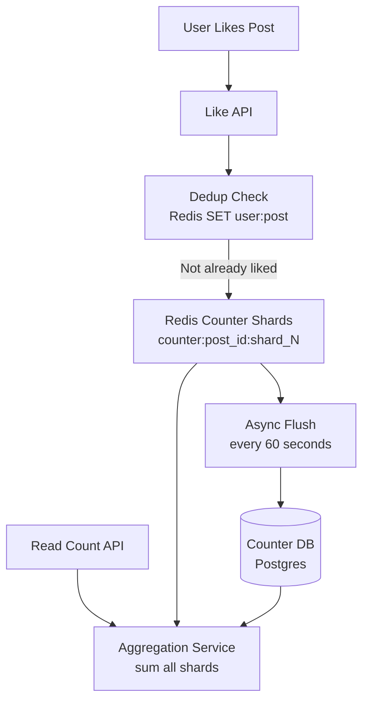

# Design a Distributed Counter (Like/View Count)

**Difficulty**: 🟡 Intermediate
**Reading Time**: Coming Soon
**Interview Frequency**: Medium

---

> 🚧 **Full article coming soon.** This stub gives you the essentials to start thinking about this problem.

---

## The Core Problem

Counting 100 million likes per day on posts with sub-second read latency sounds trivial — until a single viral post receives 1 million likes in a minute, creating a write hotspot that overwhelms a single counter row. Distributing writes across shards means reads must aggregate them, introducing latency. The core trade-off is write throughput vs read simplicity.

## Functional Requirements

- Increment a counter when a user likes/views a post
- Read the current count for display (can be slightly stale)
- Prevent the same user from liking the same post twice
- Support both exact counts (likes) and approximate counts (views)

## Non-Functional Requirements

| Requirement | Target |
|-------------|--------|
| Write throughput | 1M increments/sec per hot post |
| Read latency | p99 < 50ms |
| Staleness | < 5 seconds for likes, < 60 seconds for views |
| Accuracy | Exact for likes (integrity), ±1% for views |

## Back-of-Envelope Estimates

- **Total like events**: 100M likes/day ÷ 86,400 = ~1,160 likes/sec average
- **Viral post hotspot**: 1M likes/min ÷ 60 = ~16,667 likes/sec on one counter → must shard
- **Redis INCR throughput**: Redis handles ~100K INCR/sec single-threaded → need 167 Redis partitions for viral post

## Key Design Decisions

1. **Sharded Counter (Write Shards)** — split counter into N shards (e.g., counter_0 to counter_99); each like goes to a random shard using `shard = hash(user_id) mod N`; read sums all N shards; reduces hotspot from 16,667 writes/sec on 1 counter to 167/sec across 100 shards.
2. **Redis + Async DB Flush** — keep "live" count in Redis for fast reads; flush to persistent DB every 60 seconds; Redis failure causes up to 60 seconds of count loss — acceptable for view counts; for likes, also write to DB synchronously.
3. **CRDT G-Counter for Distributed Nodes** — for multi-datacenter: use G-Counter CRDT where each node maintains its own increment vector; merge by taking max of each node's count; no coordination needed for increments; reads merge across nodes.

## High-Level Architecture

## Top Interview Questions for This Problem

| Question | Tests |
|----------|-------|
| How do you handle 1M likes/sec on a single viral post without a hotspot? | Sharded counters, write distribution |
| How do you prevent a user from liking the same post multiple times? | Deduplication, set membership |
| What's the difference between exact and approximate counting for this use case? | HyperLogLog, trade-off reasoning |

## Related Concepts

- [Top-K analysis using similar counting techniques](../01-data-processing/top-k-analysis)
- [Redis data structures for counting operations](../../../03-redis/concepts/redis-data-structures-deep-dive)

---

*📚 Full deep-dive with multiple approaches, trade-off tables, and pseudocode coming soon.*

## 📚 Resources & References

| Resource | Type | What You'll Learn |
|----------|------|------------------|
| [ByteByteGo — Design a Distributed Counter](https://www.youtube.com/@ByteByteGo) | 📺 YouTube | Search "distributed counter" — CRDT counters, Redis INCR, and consistency trade-offs |
| [Redis INCR and Rate Limiting Patterns](https://redis.io/docs/manual/patterns/rate-limiting/) | 📚 Docs | Atomic counter operations and sliding window rate limiting |
| [Facebook Engineering: CRDT-Based Counters](https://engineering.fb.com/2020/03/17/data-infrastructure/scribe/) | 📖 Blog | Eventual consistency for high-volume counting at Facebook scale |
| [Google's Bigtable: Atomic Counters](https://research.google/pubs/pub27898/) | 📖 Blog | Atomic read-modify-write operations in distributed storage |
| [CRDTs for Distributed Counting](https://crdt.tech/) | 📚 Docs | G-Counters and PN-Counters for eventually consistent distributed incrementing |
