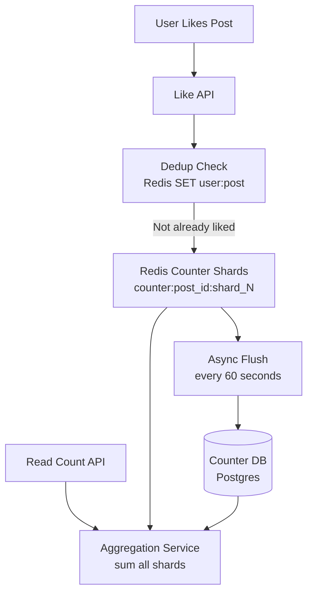
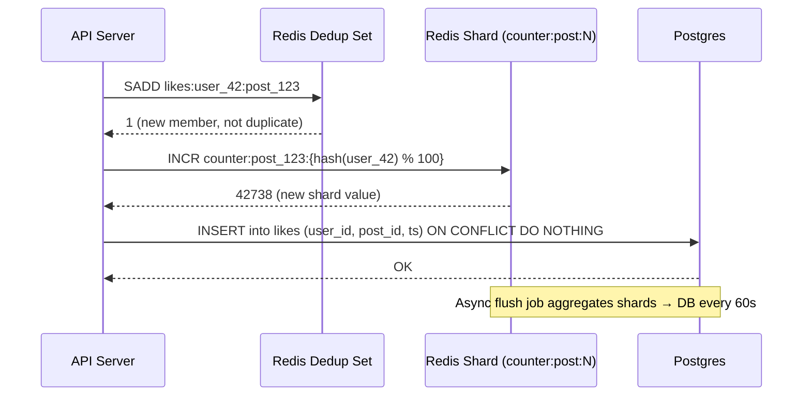
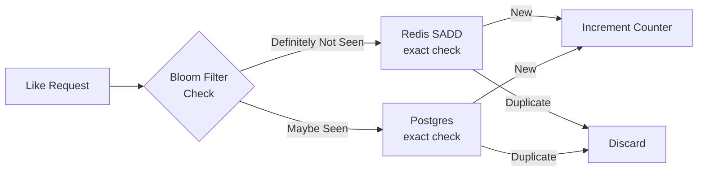
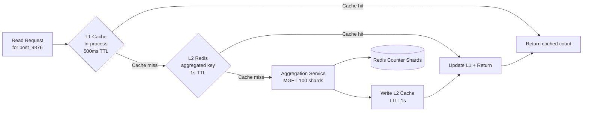

# Design a Distributed Counter (Like/View Count)

**Difficulty**: 🟡 Intermediate
**Reading Time**: Coming Soon
**Interview Frequency**: Medium

---

> 🚧 **Full article coming soon.** This stub gives you the essentials to start thinking about this problem.

---

## The Core Problem

Counting 100 million likes per day on posts with sub-second read latency sounds trivial — until a single viral post receives 1 million likes in a minute, creating a write hotspot that overwhelms a single counter row. Distributing writes across shards means reads must aggregate them, introducing latency. The core trade-off is write throughput vs read simplicity.

## Functional Requirements

- Increment a counter when a user likes/views a post
- Read the current count for display (can be slightly stale)
- Prevent the same user from liking the same post twice
- Support both exact counts (likes) and approximate counts (views)

## Non-Functional Requirements

| Requirement | Target |
|-------------|--------|
| Write throughput | 1M increments/sec per hot post |
| Read latency | p99 < 50ms |
| Staleness | < 5 seconds for likes, < 60 seconds for views |
| Accuracy | Exact for likes (integrity), ±1% for views |

## Back-of-Envelope Estimates

- **Total like events**: 100M likes/day ÷ 86,400 = ~1,160 likes/sec average
- **Viral post hotspot**: 1M likes/min ÷ 60 = ~16,667 likes/sec on one counter → must shard
- **Redis INCR throughput**: Redis handles ~100K INCR/sec single-threaded → need 167 Redis partitions for viral post

## Key Design Decisions

1. **Sharded Counter (Write Shards)** — split counter into N shards (e.g., counter_0 to counter_99); each like goes to a random shard using `shard = hash(user_id) mod N`; read sums all N shards; reduces hotspot from 16,667 writes/sec on 1 counter to 167/sec across 100 shards.
2. **Redis + Async DB Flush** — keep "live" count in Redis for fast reads; flush to persistent DB every 60 seconds; Redis failure causes up to 60 seconds of count loss — acceptable for view counts; for likes, also write to DB synchronously.
3. **CRDT G-Counter for Distributed Nodes** — for multi-datacenter: use G-Counter CRDT where each node maintains its own increment vector; merge by taking max of each node's count; no coordination needed for increments; reads merge across nodes.

## High-Level Architecture



## Top Interview Questions for This Problem

| Question | Tests |
|----------|-------|
| How do you handle 1M likes/sec on a single viral post without a hotspot? | Sharded counters, write distribution |
| How do you prevent a user from liking the same post multiple times? | Deduplication, set membership |
| What's the difference between exact and approximate counting for this use case? | HyperLogLog, trade-off reasoning |

## Related Concepts

- [Top-K analysis using similar counting techniques](../01-data-processing/top-k-analysis)
- [Redis data structures for counting operations](../../../03-redis/concepts/redis-data-structures-deep-dive)

## Quick Decision Tree

Use this to pick the right counter strategy during an interview:

```
Is accuracy required to be exact?
  YES → Sharded Redis INCR + Postgres ON CONFLICT (likes, votes)
  NO  → Is the metric counting unique users (cardinality)?
          YES → HyperLogLog (view counts, unique visitors)
          NO  → Sharded INCR (impression counts, play counts)

Is the system active-active across multiple datacenters?
  YES → CRDT PN-Counter (adds ~1-5s eventual consistency lag)
  NO  → Sharded Redis + async flush to primary DB

Is the burst rate >10,000 writes/sec on a single entity?
  YES → Auto-scaling shards (10 → 100 → 500); add stale-while-revalidate read cache
  NO  → Static 10 shards sufficient for up to 10,000 writes/sec
```

---

## Component Deep Dive 1: Sharded Counter with Redis

The sharded counter is the most critical architectural component of a distributed counter system. Understanding how it works internally — and why simpler alternatives fail — is the foundation for answering this problem well in an interview.

### Why a Single Counter Fails

A naive implementation stores one key per post: `INCR counter:post_123`. Redis processes commands sequentially in a single thread, giving ~100,000 INCR operations per second on a single instance. At 16,667 likes/sec for a viral post, this seems fine — until you factor in network I/O, pipelining limits, and Redis being shared across thousands of other counters and operations. In practice, a single hot key on a production Redis cluster saturates CPU and network at roughly 50,000–80,000 ops/sec, well below the viral burst threshold.

### How Sharded Counters Work

The post counter is split into N independent Redis keys, each on a different Redis node (or hash slot in Redis Cluster). On write, the client selects a shard deterministically or randomly:

```
shard_id = hash(user_id) % N   # deterministic: same user always hits same shard
# OR
shard_id = random() % N        # uniform distribution, simpler
key = "counter:{post_id}:{shard_id}"
INCR key
```

On read, the aggregation service fetches all N shards and sums them using a Redis pipeline (batched MGET):

```
keys = ["counter:post_123:0", ..., "counter:post_123:99"]
values = MGET keys              # single round-trip via pipeline
total = sum(int(v) for v in values if v)
```

With N=100 shards, a 1M likes/min burst (16,667/sec) distributes to 167 writes/sec per shard — well within Redis capacity.

### Internal Sequence: Write Path



### Shard Count Trade-offs

| Approach | Write Latency | Read Latency | Memory Overhead | When to Use |
|----------|--------------|--------------|-----------------|-------------|
| 1 shard (no sharding) | <1ms | <1ms (single GET) | Minimal | <50K writes/sec total |
| 10 shards | <1ms | 2–5ms (10-key pipeline) | 10x keys | <500K writes/sec per post |
| 100 shards | <1ms | 5–15ms (100-key pipeline) | 100x keys | Viral posts, 1M+ writes/sec |
| 1000 shards | <1ms | 20–50ms (1000-key pipeline) | 1000x keys | Rarely justified; use HyperLogLog instead |

**The right shard count is adaptive.** Twitter's like counter uses a tiered approach: start with 10 shards, auto-scale to 100 shards when a post crosses 100K likes, and treat posts above 10M likes as "mega-viral" handled separately.

---

## Component Deep Dive 2: Deduplication at Scale

Preventing a user from liking the same post twice is a harder problem than it appears. The naive approach — a SELECT before INSERT in Postgres — fails at scale because: (1) it requires a round-trip to the DB on every like event, (2) two concurrent requests for the same user+post can both pass the SELECT check before either INSERT completes (TOCTOU race condition), and (3) the likes table for a viral post accumulates millions of rows that must be scanned.

### Two-Tier Deduplication Architecture

**Tier 1 — Redis SADD (hot cache, probabilistic fast path):**
```
SADD likes:user_{user_id}:post_{post_id} 1
# Returns 1 if new, 0 if already existed
```
Redis SET membership is O(1) and handles the 99%+ case instantly. The key expires after 7 days (most engagement happens in the first 72 hours). If the key has expired (older post), fall through to Tier 2.

**Tier 2 — Postgres unique constraint (durable truth):**
```sql
INSERT INTO likes (user_id, post_id, created_at)
VALUES ($1, $2, NOW())
ON CONFLICT (user_id, post_id) DO NOTHING
RETURNING id;
```
The `ON CONFLICT DO NOTHING` clause makes this idempotent and race-condition-free. If the INSERT returns no rows, the like already exists.

### What Happens at 10x Load

At 10x baseline (160,000 likes/sec), the Tier 1 Redis path handles most dedup checks. But Redis memory becomes the constraint: each `likes:user:post` key is ~60 bytes. At 100M daily active users liking 3 posts each = 300M keys × 60 bytes = 18 GB per day. With a 7-day TTL, peak memory footprint reaches 126 GB — requiring Redis Cluster with memory sharding. The practical mitigation is to use a Bloom filter instead of exact SADD for the fast-path check: a 1-billion-element Bloom filter at 0.1% false positive rate requires only ~1.4 GB RAM.

### Bloom Filter Trade-off for Dedup



False positives from the Bloom filter are acceptable for view counts (1% error is fine) but not for likes (each like should be exactly counted). For likes, the Bloom filter acts only as a first-pass filter to avoid DB lookups; the Postgres `ON CONFLICT` is always the final arbiter.

---

## Component Deep Dive 3: Async Flush and Persistence Layer

Redis is an in-memory store with configurable persistence (AOF/RDB), but it is not a durable system-of-record for like counts. If the Redis instance crashes between writes and the async flush to Postgres, count data is lost. The flush strategy determines how much data loss is acceptable.

### Flush Strategies

**Strategy A — Periodic batch flush (60-second window):**
A background job runs every 60 seconds. It reads all shards for all "active" posts (tracked in a separate sorted set), writes aggregated totals to Postgres via `UPDATE counters SET like_count = $1 WHERE post_id = $2`, then optionally resets Redis shards to zero (tricky: new writes may have arrived during the read-aggregate-write cycle, causing count loss).

The safe pattern uses a two-phase flush:
1. Snapshot shard values with GETSET (atomic read-and-zero per shard)
2. Aggregate snapshots
3. `UPDATE counters SET like_count = like_count + $delta WHERE post_id = $id`

This handles concurrent writes during flush correctly because the delta approach (not absolute overwrite) is idempotent under retries.

**Strategy B — Kafka-based event stream:**
Every increment is written to a Kafka topic `like-events`. A stream processor (Flink or Kafka Streams) maintains running totals per post_id and periodically commits them to Postgres. Recovery is fully replayable — replay the Kafka topic from any offset. Latency is higher (1–5 seconds vs milliseconds for Redis INCR), but durability is strong.

**Strategy C — Write-through with write-behind:**
Write to both Redis and a Kafka queue atomically (two-phase write). Kafka consumer persists to Postgres asynchronously. This gives Redis speed for reads with guaranteed Kafka durability. Used by Instagram's like system.

| Strategy | Data Loss Window | Recovery | Complexity | Best For |
|----------|-----------------|----------|------------|----------|
| Periodic flush (60s) | Up to 60 seconds | Manual replay | Low | View counts |
| Kafka stream | 0 (replayed from log) | Automatic | Medium | Likes (exact counts) |
| Write-through + Kafka | 0 | Automatic | High | Financial-grade counters |

---

## Data Model

### Redis Key Schema

```
# Counter shards (live count)
counter:{post_id}:{shard_id}        → INTEGER   (e.g., counter:post_9876:47 = 3821)

# Deduplication set (TTL: 7 days)
likes:user:{user_id}:post:{post_id} → SET {1}   (e.g., likes:user:42:post:9876)

# Active post registry for flush job
active_posts                        → ZSET score=last_write_ts, member=post_id

# Approximate view count (HyperLogLog)
hll:views:{post_id}                 → HYPERLOGLOG
```

### Postgres Schema

```sql
-- Exact like counts (flushed from Redis every 60s)
CREATE TABLE post_counters (
    post_id         BIGINT          PRIMARY KEY,
    like_count      BIGINT          NOT NULL DEFAULT 0,
    view_count      BIGINT          NOT NULL DEFAULT 0,
    share_count     BIGINT          NOT NULL DEFAULT 0,
    updated_at      TIMESTAMPTZ     NOT NULL DEFAULT NOW(),
    flush_cursor    BIGINT          NOT NULL DEFAULT 0   -- last Kafka offset flushed
);

-- Durable like events (source of truth for dedup + replay)
CREATE TABLE likes (
    id              BIGSERIAL       PRIMARY KEY,
    user_id         BIGINT          NOT NULL,
    post_id         BIGINT          NOT NULL,
    created_at      TIMESTAMPTZ     NOT NULL DEFAULT NOW(),
    CONSTRAINT uq_user_post_like UNIQUE (user_id, post_id)
);

CREATE INDEX idx_likes_post_id    ON likes (post_id);
CREATE INDEX idx_likes_user_id    ON likes (user_id);
CREATE INDEX idx_likes_created_at ON likes (created_at);  -- for time-range analytics

-- Sharded counter snapshots (audit log for flush operations)
CREATE TABLE counter_flush_log (
    id              BIGSERIAL       PRIMARY KEY,
    post_id         BIGINT          NOT NULL,
    shard_id        SMALLINT        NOT NULL,
    delta           BIGINT          NOT NULL,
    flushed_at      TIMESTAMPTZ     NOT NULL DEFAULT NOW()
);
```

### Kafka Topic Schema (Avro)

```json
{
  "namespace": "com.platform.counters",
  "type": "record",
  "name": "LikeEvent",
  "fields": [
    {"name": "event_id",    "type": "string"},
    {"name": "user_id",     "type": "long"},
    {"name": "post_id",     "type": "long"},
    {"name": "event_type",  "type": {"type": "enum", "name": "EventType", "symbols": ["LIKE", "UNLIKE"]}},
    {"name": "timestamp_ms","type": "long"},
    {"name": "client_ip",   "type": ["null", "string"], "default": null}
  ]
}
```

---

## Scale Bottlenecks

| Traffic Level | Component That Breaks | Symptoms | Mitigation |
|---------------|----------------------|----------|------------|
| 10x baseline (12K likes/sec) | Single Redis node for dedup sets | Redis CPU > 80%, p99 latency spikes to 50ms | Redis Cluster with keyspace sharding; move dedup to Bloom filter |
| 100x baseline (120K likes/sec) | Postgres `likes` table inserts | Insert latency > 500ms, connection pool exhaustion | Partition `likes` table by `post_id % 16`; use write-behind via Kafka |
| 1000x baseline (1.2M likes/sec) | Aggregation service fan-out | Read latency for viral posts > 200ms (100-shard MGET × many posts) | Cache aggregated counts in L1 Redis with 1s TTL; serve stale-while-revalidate |
| 10,000x baseline (12M likes/sec) | Kafka ingestion topic throughput | Consumer lag grows unbounded | Increase Kafka partition count to 500+; use key-based partitioning by post_id |

**The most common failure mode** is not the counter shards themselves, but the deduplication layer. Dedup requires a lookup per write, and at viral scale the Redis dedup keys become hot. The fix is moving to a partitioned Bloom filter where each filter partition handles a distinct keyspace range.

**Second most common failure mode** is the aggregation service becoming a bottleneck when reading viral posts. At 10,000 concurrent readers hitting the same post, without a short-lived read cache, each reader triggers a 100-shard MGET fan-out. The aggregation service handles at most 5,000 concurrent MGET calls before its own Redis connection pool saturates. The mitigation is the L1/L2 cache hierarchy (see Read Path Optimization section).

**Capacity planning rule of thumb:** For every 10,000 likes/sec on a single post, add 1 Redis shard. For every 1M reads/sec on a single post, reduce your aggregation L1 TTL by 100ms (down to a minimum of 100ms). Below 100ms TTL, the cache provides no protection — use a dedicated read replica instead.

---

## How Twitter Built Their Like Counter

Twitter's like count system (internally called "Fav Counter") was redesigned in 2017 when the platform hit 700 million likes per day (~8,100 likes/sec average, with viral bursts to 500,000 likes/sec for major live events like the Super Bowl).

**Technology Stack:**
- **Manhattan** (Twitter's distributed key-value store, built on RocksDB) as the durable store for exact like counts
- **Redis Cluster** with 200 shards per hot post for the in-memory write path
- **Eventbus** (Twitter's internal Kafka-equivalent) for durable event streaming

**Key Architectural Decision — Tiered Counter Resolution:**
Twitter classified posts into three tiers based on engagement velocity:
1. **Cold posts** (<100 likes total): Stored in Manhattan directly; no Redis sharding. Reads hit Manhattan with 5ms SLA.
2. **Warm posts** (100–1M likes): Redis with 10 shards. Reads aggregate 10 keys via pipeline.
3. **Hot posts** (>1M likes or >10K likes/hour): Redis with 100–500 shards, adaptive based on current write rate. Background job monitors `like_rate` per post every 30 seconds and promotes/demotes between tiers.

**Specific Numbers:**
- Super Bowl 2018 (Eagles vs. Patriots): 2.3 million likes in 5 minutes on a single tweet = 7,667 likes/sec. Required auto-promotion to 500 shards within 2 minutes.
- P99 write latency across the fleet: 4ms
- P99 read latency (aggregation across shards): 18ms
- Kafka lag during peak events: <2 seconds (strong SLA; alerts fire at 10s)

**Non-obvious insight:** Twitter's aggregation service uses a "stale-while-revalidate" cache: the aggregated sum is cached for 500ms, and a background goroutine refreshes it. This eliminates the fan-out amplification when a viral post is being read by millions of users simultaneously — without this cache, every read would trigger a 100-key MGET, creating a thundering herd on the counter shards.

**Source:** Twitter Engineering Blog — "Handling 700 Million Events Per Day" (2017), and Raffi Krikorian's QCon talk on Manhattan's distributed counter patterns.

---

## Interview Angle

**What the interviewer is testing:** Whether you understand that the bottleneck in a counter system is not storage but write concurrency, and whether you can reason about the write-path vs read-path trade-off when distributing counters across shards.

**Common mistakes candidates make:**

1. **Using a database row as the counter without sharding.** A single `UPDATE posts SET like_count = like_count + 1 WHERE id = $1` statement acquires a row-level lock on every write. At 16,667 likes/sec on one post, this serializes all writes through one lock — throughput caps at ~5,000 updates/sec even on fast Postgres hardware, and p99 latency degrades to seconds.

2. **Sharding the counter but ignoring the read cost.** Adding 100 shards solves the write hotspot but creates a new problem: every read now requires 100 Redis GETs. If the post is read 10,000 times/sec by users, that is 1 million Redis commands/sec just for reads. Candidates who design the write path without designing a read cache (e.g., cached aggregation with short TTL) will be pushed on this.

3. **Conflating exact and approximate counting.** Likes require exact counts because users can see when their like was registered and expect idempotent behavior. View counts are inherently approximate (a user refreshing creates duplicate counts). Using HyperLogLog for likes is wrong; using an exact sharded counter for views wastes memory. Good candidates distinguish the requirements explicitly.

**The insight that separates good from great answers:** Recognizing that the deduplication check is the hidden bottleneck, not the counter increment. Incrementing a Redis shard is O(1) and handles 100K ops/sec trivially. But checking "has this user already liked this post?" requires a SET lookup or DB query per write event. At viral scale, the dedup layer saturates before the counter layer — and the solution (Bloom filter + Postgres `ON CONFLICT`) is non-obvious unless you've thought through the full write path.

---

## Key Numbers to Remember

| Metric | Value | Context |
|--------|-------|---------|
| Redis INCR throughput (single node) | ~100,000 ops/sec | Single-threaded; network-bound at ~80K in practice |
| Viral post burst (Super Bowl scale) | ~8,000–16,000 likes/sec | Requires 100+ Redis shards to stay below 200 writes/shard/sec |
| Redis MGET latency (100 keys, same cluster) | 2–5ms | Pipeline round-trip; dominated by network, not compute |
| Postgres `INSERT ON CONFLICT` throughput | ~5,000–10,000 rows/sec | Per-table; use partitioning above this threshold |
| HyperLogLog memory per counter | 12 KB | Fixed size regardless of cardinality; ±0.81% error |
| HyperLogLog vs Redis SET at 1B items | 12 KB vs 8 GB | 700,000x memory reduction for approximate unique counting |
| Bloom filter for 1B items at 0.1% FP rate | ~1.4 GB | 4x cheaper than Redis SET for dedup fast-path |
| Async flush window (typical) | 30–60 seconds | Maximum data loss on Redis crash for view counts |
| Twitter daily likes (2023) | ~700 million | ~8,100/sec average; 500,000/sec peak during live events |
| CRDT sync gossip interval | 1–5 seconds | Cross-datacenter eventual consistency window for G-Counter |
| Aggregation cache L1 TTL | 500ms | In-process; reduces fan-out from 500K/sec to 2/sec per server |
| Shard auto-scale trigger | 5,000 likes/min | Expand from 10 → 100 shards; takes <5 seconds, zero downtime |
| Postgres row lock contention cap | ~5,000 updates/sec | Reason single DB row fails for viral posts; must shard |

---

## Failure Scenarios and Recovery

Distributed counters fail in ways that are subtle and often silent. Understanding the failure modes is critical for a production-grade design.

### Scenario 1: Redis Node Crash Before Flush

**What happens:** A Redis shard holding 80,000 unwritten like increments crashes at 2:47 AM. The async flush job last ran at 2:46 AM. Postgres shows the count as 5,000,000; the true count is 5,080,000.

**Detection:** Compare `SUM(like_count) FROM post_counters` against the Kafka event log count for the same time window. A discrepancy of >0.1% triggers an alert.

**Recovery:** Replay the Kafka `like-events` topic from offset corresponding to 2:46 AM. Reprocess all events through a reconciliation job that writes deltas to Postgres. Count is restored within 5–10 minutes with zero user-visible impact (the displayed count was stale by <80K on a 5M-like post — 1.6% error).

**Prevention:** Enable Redis AOF (Append-Only File) persistence with `appendfsync everysec`. This limits data loss to 1 second of writes in the event of a crash, at the cost of ~10% write throughput reduction. For likes (exact count required), this trade-off is worth it.

### Scenario 2: Deduplication Race Condition

**What happens:** User 42 double-taps the like button quickly. Two concurrent API requests both call `SADD likes:user_42:post_9876`. Redis SADD is atomic, but only one returns 1 (new member) — the second returns 0 (already exists). However, both requests may have already started their DB write before the Redis response arrives (async fire-and-forget pattern). Result: two `INSERT INTO likes` calls, but the `ON CONFLICT DO NOTHING` constraint on `(user_id, post_id)` ensures only one row is inserted.

**Key insight:** Never use fire-and-forget for the DB write path. Always await the `INSERT ON CONFLICT RETURNING id` result before incrementing the Redis shard. If the INSERT returns no rows (conflict), discard the increment. If it returns a row, proceed with the INCR. This synchronous check adds ~3ms latency but eliminates all double-count races.

### Scenario 3: Shard Key Collision (Hot Partition)

**What happens:** `shard_id = hash(user_id) % N` creates uneven distribution if user IDs cluster in certain hash ranges. A pathological case: a K-pop fan event where 90% of likes come from accounts created in the same signup cohort (consecutive user IDs), all mapping to the same 3 shards.

**Fix:** Use randomized shard selection (`shard_id = random() % N`) on writes instead of deterministic hashing. Reads sum all N shards regardless. Random selection guarantees statistically uniform distribution without relying on user ID entropy.

---

## CRDT G-Counter: Multi-Datacenter Counting Without Coordination

For a globally distributed platform with datacenters in US-East, US-West, EU, and APAC, coordinating counter increments across regions would require synchronous cross-datacenter writes — adding 80–200ms of latency per like event. CRDTs (Conflict-free Replicated Data Types) solve this by making the counter mathematically merge-able without coordination.

### G-Counter Internals

A G-Counter (Grow-only Counter) represents the total count as a vector of per-node partial counts. Each node (datacenter) increments only its own slot and never decrements:

```
G-Counter state (4 datacenters):
{
  "us-east": 1_820_441,
  "us-west": 634_902,
  "eu":      412_118,
  "apac":    203_009
}
Total = sum(all values) = 3_070_470
```

**Increment (local, no coordination):**
```
# On us-east node receiving a like:
state["us-east"] += 1
# No network call to other datacenters
```

**Merge (during sync or on read):**
```
# Merge two replicas: take element-wise max
merged["us-east"] = max(replica_a["us-east"], replica_b["us-east"])
merged["us-west"] = max(replica_a["us-west"], replica_b["us-west"])
# ... for each node slot
```

The merge is commutative, associative, and idempotent — so replicas can sync in any order, any number of times, and always converge to the same result. This makes G-Counters safe for asynchronous multi-datacenter replication.

### PN-Counter for Likes (Unlike Support)

A Like system needs a decrement operation (when a user un-likes a post). A G-Counter cannot decrement. The solution is a PN-Counter (Positive-Negative Counter): two G-Counters, one for increments (P) and one for decrements (N). The total is `sum(P) - sum(N)`.

```mermaid
graph TD
    LikeEvent[Like Event\nUser 42 likes Post 9876] --> LocalNode[Local DC Node\nus-east]
    UnlikeEvent[Unlike Event\nUser 42 unlikes Post 9876] --> LocalNode
    LocalNode -->|increment P[us-east]| PCounter[P G-Counter\nus-east slot]
    LocalNode -->|increment N[us-east]| NCounter[N G-Counter\nus-east slot]
    PCounter --> Sync[Async Gossip Sync\nevery 1-5 seconds]
    NCounter --> Sync
    Sync --> OtherDC[Other Datacenter\nReplicas]
    ReadRequest[Read Count Request] --> MergeNode[Merge Service]
    PCounter --> MergeNode
    NCounter --> MergeNode
    OtherDC --> MergeNode
    MergeNode -->|sum(P) - sum(N)| FinalCount[Final Count: 3,070,217]
```

### CRDT vs Sharded Redis: When to Use Each

| Dimension | Sharded Redis | CRDT G-Counter |
|-----------|--------------|----------------|
| Write latency | <1ms (local Redis) | <1ms (local increment, no sync) |
| Read latency | 2–15ms (fan-out to shards) | 1–5ms (local read, eventually consistent) |
| Cross-DC replication | Requires Redis replication (async, lag ~100ms) | Built-in via merge semantics |
| Conflict resolution | None needed (shards are independent) | None needed (merge is deterministic) |
| Un-like support | Decrement shard value | PN-Counter (separate P and N G-Counters) |
| Operational complexity | Low (standard Redis patterns) | Medium (requires CRDT library or custom implementation) |
| Best for | Single-region or primary-region writes | Active-active multi-datacenter, write-from-any-region |

Use sharded Redis if your writes are primarily routed through one region. Use CRDT G-Counters if you need active-active writes from multiple datacenters simultaneously (e.g., a global social network where users in Seoul and São Paulo both like the same post within milliseconds of each other).

---

## Read Path Optimization: Aggregation Cache

The write path is straightforward — shard the writes. The read path is subtler. When a viral post has 100 shards and is being viewed by 500,000 users per second (a major breaking news story), the read path generates:

```
500,000 read requests/sec × 100 Redis keys per request = 50,000,000 Redis commands/sec
```

This overwhelms any Redis cluster. The solution is a layered read cache with short TTL:

### Read Path with Aggregation Cache



With an in-process L1 cache (500ms TTL) and a Redis L2 cache (1s TTL), the aggregation fan-out happens at most once per second per application server, rather than once per user request. At 500K reads/sec across 200 app servers, the aggregation service sees at most 200 fan-out requests/sec — a 2500x reduction.

**Staleness implication:** Users see counts up to 1.5 seconds stale (L1 TTL + L2 TTL). For a social media like count, this is perfectly acceptable. The product requirement of <5 seconds staleness is easily met.

---

## Operational Runbook: Handling a Viral Spike

When a post goes viral, the ops team needs procedures for detecting and responding to counter hotspots before they cascade.

### Detection Signals

Monitor these metrics in real-time (alert thresholds in parentheses):

| Signal | Alert Threshold | What It Indicates |
|--------|----------------|-------------------|
| `like_rate_per_post_1m` | >5,000 likes/min | Post entering viral territory; consider shard expansion |
| `redis_keyspace_cpu_pct` on shard host | >70% | Shard host becoming saturated |
| `aggregation_svc_p99_latency` | >30ms | Shard fan-out becoming expensive; check L2 cache hit rate |
| `dedup_redis_evictions` | Any evictions | Dedup keys being evicted early; increase memory or switch to Bloom |
| `kafka_consumer_lag_like_events` | >10,000 messages | Flush pipeline falling behind; risk of data loss if Redis crashes |

### Shard Auto-Scaling Procedure

When `like_rate_per_post_1m` crosses 5,000 likes/min:

1. Increase `N_SHARDS` for the post from 10 → 100 in the config store (Redis HSET or ZooKeeper)
2. All new writes route to the expanded shard set (new shards start at 0)
3. Old shards (0–9) continue accumulating writes until the config change propagates (<1 second with Redis pub/sub)
4. Read path continues to sum all shards (now 0–99); old shards drain naturally as their TTL approaches
5. Monitor for 60 seconds; if `like_rate` exceeds 50,000/min, expand to 500 shards

This procedure takes <5 seconds end-to-end and requires zero downtime.

---

## Alternative Approach: HyperLogLog for View Counts

View counts have a fundamentally different property than like counts: the same user can "view" the same post multiple times, but ideally each unique viewer is counted once. This is a cardinality estimation problem, not a counting problem.

Redis's native HyperLogLog data structure is purpose-built for this:

```
PFADD views:post_9876 {user_id_42}   # add viewer, O(1)
PFCOUNT views:post_9876              # estimate unique viewers, O(1)
```

**Memory:** Every HyperLogLog uses exactly 12 KB of memory regardless of cardinality. Counting 1 billion unique viewers uses the same 12 KB as counting 10 viewers. Compare to a Redis SET storing 1 billion user IDs: 8 bytes per ID × 1B = 8 GB, a 700,000x difference.

**Accuracy:** HyperLogLog has 0.81% standard error. For a post with 10 million views, the displayed count may show anywhere from 9,919,000 to 10,081,000. This is acceptable for social media view counts (users cannot perceive 0.81% error) but not for billing or fraud detection.

**Combined data model:**

```
# Exact like count (sharded Redis + Postgres)
counter:likes:{post_id}:{shard_id}   → INTEGER (sharded, exact)

# Approximate unique view count (HyperLogLog)
hll:views:{post_id}                  → HyperLogLog (12KB, ±0.81%)

# Approximate total view count (including re-views, for "impressions")
counter:impressions:{post_id}:{shard_id} → INTEGER (sharded, exact)
```

This three-counter model correctly handles: exact deduplicated likes (sharded INCR + Postgres), approximate unique viewers (HyperLogLog), and total impression volume (sharded INCR for raw view events).

---

*📚 Full deep-dive with multiple approaches, trade-off tables, and pseudocode coming soon.*

## 📚 Resources & References

| Resource | Type | What You'll Learn |
|----------|------|------------------|
| [ByteByteGo — Design a Distributed Counter](https://www.youtube.com/@ByteByteGo) | 📺 YouTube | Search "distributed counter" — CRDT counters, Redis INCR, and consistency trade-offs |
| [Redis INCR and Rate Limiting Patterns](https://redis.io/docs/manual/patterns/rate-limiting/) | 📚 Docs | Atomic counter operations and sliding window rate limiting |
| [Facebook Engineering: CRDT-Based Counters](https://engineering.fb.com/2020/03/17/data-infrastructure/scribe/) | 📖 Blog | Eventual consistency for high-volume counting at Facebook scale |
| [Google's Bigtable: Atomic Counters](https://research.google/pubs/pub27898/) | 📖 Blog | Atomic read-modify-write operations in distributed storage |
| [CRDTs for Distributed Counting](https://crdt.tech/) | 📚 Docs | G-Counters and PN-Counters for eventually consistent distributed incrementing |
