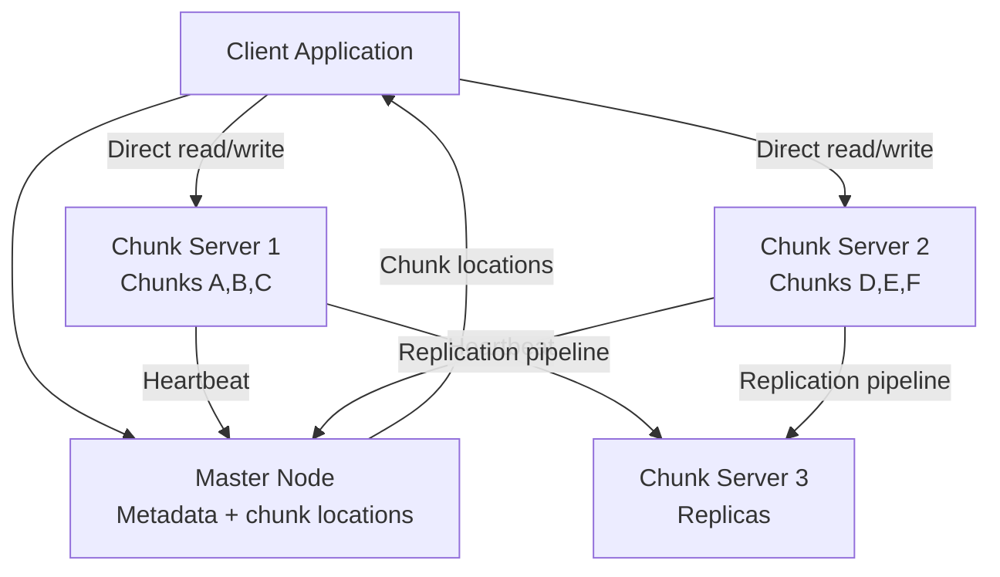

# Design a Distributed File System (GFS/HDFS)

**Difficulty**: 🔴 Advanced
**Reading Time**: Coming Soon
**Interview Frequency**: Medium

---

> 🚧 **Full article coming soon.** This stub gives you the essentials to start thinking about this problem.

---

## The Core Problem

Storing 100 petabytes of data with fault tolerance across thousands of commodity servers that fail frequently — Google's GFS paper assumed hardware failure is the norm, not the exception. The design must detect failed nodes, re-replicate their chunks, and serve ongoing reads/writes without interruption, all while maintaining metadata consistency.

## Functional Requirements

- Store large files (GB to TB) reliably across many nodes
- Read and write files with fault tolerance (tolerate 2+ node failures)
- Support large sequential reads/writes (batch analytics workloads)
- Automatic re-replication when chunk servers fail

## Non-Functional Requirements

| Requirement | Target |
|-------------|--------|
| Durability | 11 nines (data replicated to 3+ nodes) |
| Fault tolerance | Tolerate simultaneous failure of 2 rack-level nodes |
| Throughput | 10GB/sec aggregate read, 1GB/sec write per cluster |
| Scale | 100PB storage across 50,000 commodity servers |

## Back-of-Envelope Estimates

- **Chunk count**: 100PB ÷ 64MB per chunk = ~1.6B chunks; metadata per chunk = 100 bytes → 160GB metadata (must fit in master RAM)
- **Replication traffic**: Writing 1GB file × 3 replicas = 3GB network traffic per file write
- **Failure rate**: 50,000 servers × 0.5% monthly failure rate = 250 server failures/month = ~8/day

## Key Design Decisions

1. **Large Chunk Size (64MB)** — large chunks reduce metadata size (fewer chunks = less master state) and enable large sequential reads without per-chunk overhead; trade-off: small files waste space and can cause hot spots on a few chunks.
2. **Single Master for Metadata** — master holds all namespace metadata in RAM for fast access; not a bottleneck because clients cache chunk locations and communicate directly with chunk servers for data; master only handles open/close/rename operations.
3. **Chunk Replication Pipeline** — writer streams data to first replica, which pipelines to second, which pipelines to third; all replicas must acknowledge before write is considered committed; tolerates single node failure during write.

## High-Level Architecture

## Top Interview Questions for This Problem

| Question | Tests |
|----------|-------|
| How does the master handle chunk server failures without downtime? | Heartbeat monitoring, re-replication |
| Why is a single master acceptable and what are its limits? | Metadata-only bottleneck, RAM constraints |
| How does GFS handle concurrent writes to the same file region? | Write order, consistency model |

## Related Concepts

- [Distributed messaging system for large-scale data pipelines](./distributed-messaging)
- [Dropbox for user-facing file storage comparison](../06-storage-files/file-sharing)

---

*📚 Full deep-dive with multiple approaches, trade-off tables, and pseudocode coming soon.*

## 📚 Resources & References

| Resource | Type | What You'll Learn |
|----------|------|------------------|
| [System Design Interview Vol 2 — Alex Xu](https://www.amazon.com/System-Design-Interview-Insiders-Guide/dp/1736049119) | 📚 Book | Chapter on designing a distributed file storage system like Dropbox |
| [ByteByteGo — Design a Distributed File System](https://www.youtube.com/@ByteByteGo) | 📺 YouTube | Search "distributed file system design" — chunking, replication, metadata |
| [Google File System Paper](https://research.google/pubs/pub51/) | 📖 Blog | The foundational distributed file system paper that inspired HDFS |
| [HDFS Architecture Guide](https://hadoop.apache.org/docs/r1.2.1/hdfs_design.html) | 📚 Docs | How Hadoop HDFS handles chunk storage, replication, and namenode |
| [Amazon S3 Architecture and Durability](https://aws.amazon.com/blogs/storage/amazon-s3-update-strong-read-after-write-consistency/) | 📚 Docs | How S3 achieves 11 nines of durability with erasure coding |
