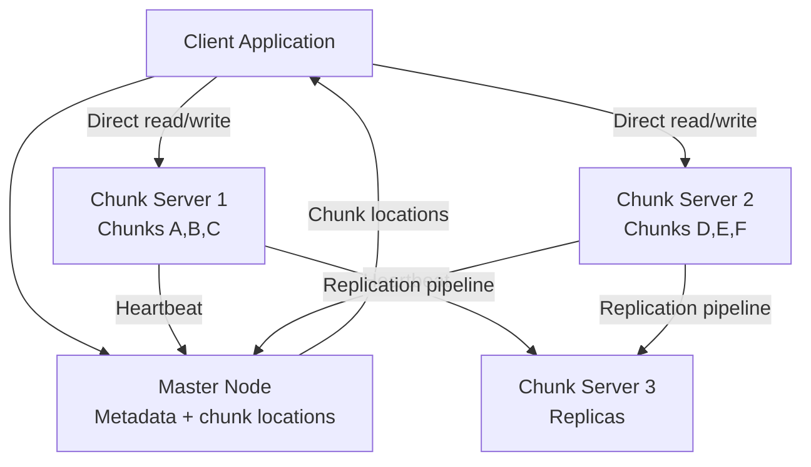
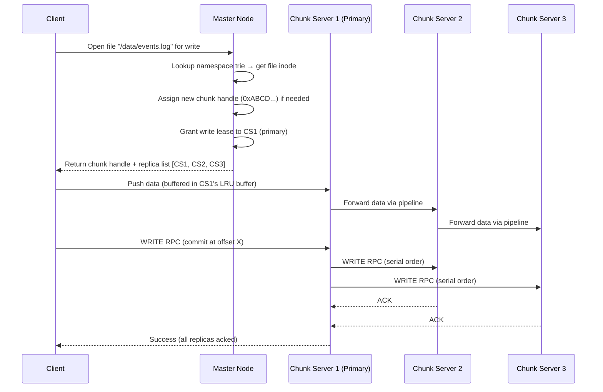
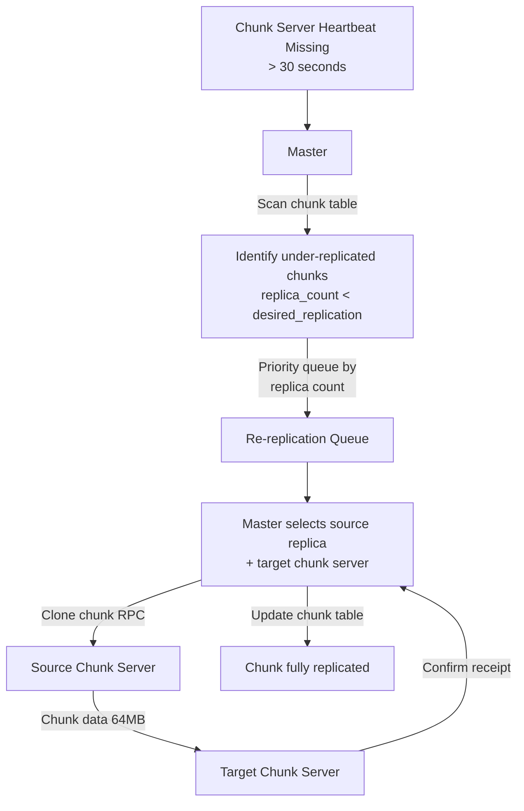
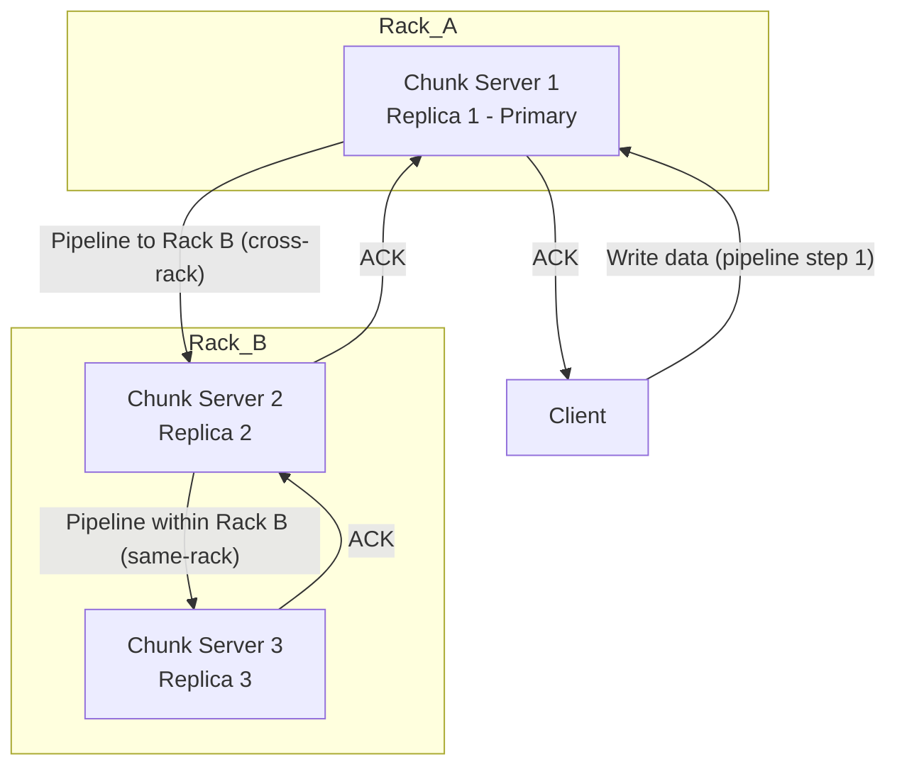

# Design a Distributed File System (GFS/HDFS)

**Difficulty**: 🔴 Advanced
**Reading Time**: Coming Soon
**Interview Frequency**: Medium

---

## The Core Problem

Storing 100 petabytes of data with fault tolerance across thousands of commodity servers that fail frequently — Google's GFS paper assumed hardware failure is the norm, not the exception. The design must detect failed nodes, re-replicate their chunks, and serve ongoing reads/writes without interruption, all while maintaining metadata consistency.

## Functional Requirements

- Store large files (GB to TB) reliably across many nodes
- Read and write files with fault tolerance (tolerate 2+ node failures)
- Support large sequential reads/writes (batch analytics workloads)
- Automatic re-replication when chunk servers fail

## Non-Functional Requirements

| Requirement | Target |
|-------------|--------|
| Durability | 11 nines (data replicated to 3+ nodes) |
| Fault tolerance | Tolerate simultaneous failure of 2 rack-level nodes |
| Throughput | 10GB/sec aggregate read, 1GB/sec write per cluster |
| Scale | 100PB storage across 50,000 commodity servers |

## Back-of-Envelope Estimates

- **Chunk count**: 100PB ÷ 64MB per chunk = ~1.6B chunks; metadata per chunk = 100 bytes → 160GB metadata (must fit in master RAM)
- **Replication traffic**: Writing 1GB file × 3 replicas = 3GB network traffic per file write
- **Failure rate**: 50,000 servers × 0.5% monthly failure rate = 250 server failures/month = ~8/day

## Key Design Decisions

1. **Large Chunk Size (64MB)** — large chunks reduce metadata size (fewer chunks = less master state) and enable large sequential reads without per-chunk overhead; trade-off: small files waste space and can cause hot spots on a few chunks.
2. **Single Master for Metadata** — master holds all namespace metadata in RAM for fast access; not a bottleneck because clients cache chunk locations and communicate directly with chunk servers for data; master only handles open/close/rename operations.
3. **Chunk Replication Pipeline** — writer streams data to first replica, which pipelines to second, which pipelines to third; all replicas must acknowledge before write is considered committed; tolerates single node failure during write.

## High-Level Architecture



## Top Interview Questions for This Problem

| Question | Tests |
|----------|-------|
| How does the master handle chunk server failures without downtime? | Heartbeat monitoring, re-replication |
| Why is a single master acceptable and what are its limits? | Metadata-only bottleneck, RAM constraints |
| How does GFS handle concurrent writes to the same file region? | Write order, consistency model |

## Related Concepts

- [Distributed messaging system for large-scale data pipelines](./distributed-messaging)
- [Dropbox for user-facing file storage comparison](../06-storage-files/file-sharing)

---

## Component Deep Dive 1: Master Node / NameNode — The Metadata Brain

The master node (called NameNode in HDFS) is the single most critical component of any distributed file system. It holds the entire namespace — every directory, every file name, every chunk handle, and every chunk-to-server mapping — entirely in RAM. In a 100PB cluster with 64MB chunks, that is roughly 1.6 billion chunks. At 100 bytes of metadata per chunk (chunk handle, version number, replica locations, checksum), the master must maintain ~160GB of hot metadata. This is why GFS engineers chose RAM over disk lookups: a disk seek for every chunk location request at 10k ops/sec would saturate any I/O subsystem.

**How it works internally**: The master maintains three in-memory data structures. First, a namespace tree implemented as a prefix-compressed trie mapping full path names to file metadata (inode-like objects). Second, a chunk handle table mapping 64-bit chunk handles to their current version number, replication factor, and the list of chunk servers holding live replicas. Third, a lease table recording which chunk server holds the current write lease for each chunk (the "primary" for mutations). All mutations to these structures are journaled to a write-ahead log (operation log) on local disk and replicated to shadow masters before the response is returned to the client. On restart, the master replays this log plus periodic checkpoints to rebuild in-memory state.

**Why naive approaches fail at scale**: A simple approach — store all metadata in a single relational database — fails because SQL databases cannot serve 10,000+ random metadata lookups per second for a cluster handling concurrent reads from 50,000 servers. Connection overhead, lock contention, and disk I/O bound query latency above 1ms per op. GFS sidesteps this entirely by keeping metadata in RAM and accepting the constraint that the master machine must have sufficient DRAM. For Google's 2003 production cluster, 64GB RAM was enough; modern HDFS deployments commonly use master nodes with 256–512GB RAM.

**Master internals sequence diagram**:



**Implementation trade-offs for metadata storage**:

| Approach | Latency | Throughput | Trade-off |
|----------|---------|------------|-----------|
| In-memory trie (GFS/HDFS) | <1ms lookup | 50k ops/sec per master | Master RAM is hard limit; ~160GB for 100PB |
| On-disk B-tree (ext4/XFS inode table) | 1–10ms lookup | 5k ops/sec | No RAM limit but disk I/O bottleneck |
| Distributed KV store (e.g., etcd/Zookeeper) | 2–5ms lookup | 20k ops/sec | No single point of failure; higher complexity |

The in-memory approach wins for read-heavy workloads where metadata is accessed millions of times per minute. The distributed KV approach (used by CephFS and modern HDFS Federation) wins when metadata volume exceeds single-node RAM capacity.

---

## Component Deep Dive 2: Chunk Replication and Re-replication Pipeline

Chunk replication serves two distinct purposes: durability (surviving disk and server failures) and throughput (clients can read from any replica, spreading load across chunk servers). GFS uses synchronous chain replication for writes and asynchronous re-replication for failure recovery — these two paths have fundamentally different consistency and latency properties.

**Internal mechanics of write replication**: When a client writes to a chunk, the master grants a 60-second renewable lease to one chunk server (the primary). The lease mechanism is critical — it prevents split-brain scenarios where two servers simultaneously believe they are the primary. The client pushes raw data to all chunk servers in a pipelined fashion: it sends data to the closest server, which forwards to the next, which forwards to the last. This pipeline minimizes client uplink usage. Once all servers have buffered the data, the client sends a WRITE RPC to the primary. The primary assigns a serial mutation number (total order across all writes to this chunk) and forwards the WRITE RPC with the serial number to secondaries. All secondaries apply mutations in serial-number order and ACK back to the primary. The primary replies to the client only when all secondaries have ACKed. A single secondary failure during this window causes the write to fail from the client's perspective, requiring a retry.

**Scale behavior at 10x load**: At baseline (5,000 writes/sec cluster-wide), the primary for each hot chunk handles ~10 mutation forwarding RPCs per second — well within a single server's 100k RPC/sec capacity. At 50,000 writes/sec (10x), hot chunks become a bottleneck because all writes to the same chunk must be serialized through one primary. GFS mitigates this by splitting large files into many chunks, distributing primaries across hundreds of servers. At 500,000 writes/sec (100x), the master's lease-grant rate (one RPC per new primary assignment) can become a bottleneck — addressed by longer lease durations and client-side caching of lease information.

**Re-replication after failure**:



The master prioritizes re-replication by urgency: chunks with only 1 replica remaining (one more failure = data loss) are cloned before chunks with 2 replicas. Network bandwidth for re-replication is throttled — GFS limits re-replication to 50MB/sec per chunk server to avoid crowding out foreground reads and writes.

---

## Component Deep Dive 3: Consistency Model and Lease Management

GFS provides a relaxed consistency model that is well-suited to append-heavy workloads but confusing for developers expecting POSIX semantics. Understanding this model is essential for interview discussions.

**Defined vs. consistent regions**: After a mutation, a file region is "consistent" if all clients see the same data regardless of which replica they read from. It is "defined" if it is consistent AND reflects the mutation completely. GFS guarantees that sequential writes to a single chunk are defined. Concurrent writes to the same region are consistent but potentially undefined (the data is some interleaving of the concurrent writes, identical across replicas but possibly garbled from any single writer's perspective). Record appends — the primary append operation in GFS — are defined but may contain duplicates: if a replica fails mid-append, the master re-drives the append, potentially writing the record twice on replicas that already received the first attempt. Applications must tolerate duplicate records (typically by including a checksum and sequence number in each record).

**Lease expiry and stale replica detection**: Each chunk has a version number stored by the master. When the master grants a new lease (on chunk server restart or lease renewal), it increments the version number and sends it to all up-to-date replicas. A chunk server that missed the version increment (e.g., it was offline during a write) holds a stale replica with an old version number. When that server rejoins and reports its chunks via heartbeat, the master detects the version mismatch and marks that replica as stale — it will not be handed to clients and will be garbage-collected. This version-based staleness detection is O(1) per replica and adds negligible overhead to heartbeat processing.

**Specific technical decisions**: GFS chose to make the master the sole authority on version numbers rather than using a distributed consensus protocol (Paxos/Raft) because the master is already a single point of coordination. Adding distributed consensus would add 10–50ms to every write for quorum acknowledgment. The trade-off is that master crashes require careful replay of the operation log to recover the correct version state — a cold restart takes 60–120 seconds for a large cluster.

---

## Data Model

The master stores metadata across three logical tables. In a real implementation these live in RAM (Go maps / C++ hash maps) backed by a write-ahead log on disk.

```sql
-- File namespace table (stored as compressed trie in RAM, shown as SQL for clarity)
CREATE TABLE file_namespace (
    inode_id        BIGINT PRIMARY KEY,          -- 64-bit unique inode number
    parent_inode_id BIGINT REFERENCES file_namespace(inode_id),
    name            VARCHAR(255) NOT NULL,        -- path component (not full path)
    is_directory    BOOLEAN NOT NULL DEFAULT FALSE,
    owner           VARCHAR(64),
    permissions     SMALLINT,                     -- Unix-style rwxrwxrwx
    created_at      BIGINT,                       -- Unix epoch ms
    modified_at     BIGINT,
    replication     SMALLINT DEFAULT 3,           -- desired replica count
    chunk_size_bytes INT DEFAULT 67108864,        -- 64MB default
    INDEX idx_parent (parent_inode_id, name)
);

-- Chunk registry table (one row per 64MB chunk of each file)
CREATE TABLE chunk_registry (
    chunk_handle    BIGINT PRIMARY KEY,           -- globally unique 64-bit handle
    inode_id        BIGINT REFERENCES file_namespace(inode_id),
    chunk_index     INT NOT NULL,                 -- position within file (0-based)
    chunk_version   INT NOT NULL DEFAULT 1,       -- incremented on each lease grant
    checksum        BIGINT,                       -- CRC32 of full chunk
    size_bytes      INT,                          -- actual bytes (last chunk may be < 64MB)
    INDEX idx_inode_chunk (inode_id, chunk_index)
);

-- Replica location table (one row per physical copy of a chunk)
CREATE TABLE chunk_replicas (
    chunk_handle    BIGINT REFERENCES chunk_registry(chunk_handle),
    server_id       VARCHAR(64) NOT NULL,         -- "hostname:port" of chunk server
    replica_version INT NOT NULL,                 -- version on THIS server (may lag if stale)
    is_primary      BOOLEAN DEFAULT FALSE,        -- TRUE if this server holds current lease
    lease_expires   BIGINT,                       -- Unix epoch ms, NULL if not primary
    PRIMARY KEY (chunk_handle, server_id)
);

-- Chunk server registry (updated by heartbeat, every 5 seconds)
CREATE TABLE chunk_servers (
    server_id           VARCHAR(64) PRIMARY KEY,  -- "hostname:port"
    rack_id             VARCHAR(32),              -- for rack-aware placement
    total_bytes         BIGINT,                   -- raw disk capacity
    used_bytes          BIGINT,
    last_heartbeat_ms   BIGINT,                   -- Unix epoch ms
    chunks_reported     INT,                      -- count from last block report
    is_decommissioning  BOOLEAN DEFAULT FALSE
);
```

**Key access patterns**:
- `file_namespace` is accessed for every `open()` — must be in RAM, lookup O(depth of path)
- `chunk_registry` is accessed to map byte offset → chunk_index: `chunk_index = floor(offset / 64MB)`
- `chunk_replicas` is scanned on every chunk server heartbeat to detect stale versions
- Master never reads `chunk_replicas` from disk during steady-state — it is rebuilt in RAM from chunk server block reports on startup

---

## Scale Bottlenecks

| Traffic Level | Component That Breaks | Symptoms | Mitigation |
|---------------|----------------------|----------|------------|
| 10x baseline (100k file ops/sec) | Master CPU for namespace lock contention | Metadata ops latency spikes from 1ms to 50ms; clients time out on open() | Directory-level read-write locks; pre-split large directories |
| 100x baseline (1M file ops/sec) | Master RAM exhausted — 1.6B chunks at 200 bytes = 320GB | Master OOM kill; full cluster outage | HDFS Federation: partition namespace into sub-namespaces across multiple NameNodes |
| 100x baseline (aggregate write BW) | Network switch uplinks between racks saturate at 10Gbps | Write latency spikes during cross-rack replication; pipeline stalls | Rack-aware replica placement (2 replicas same rack, 1 cross-rack); erasure coding to cut replication overhead by 50% |
| 1000x baseline | Individual chunk servers become hot spots for popular chunks | 1 chunk server serves 80% of reads for a viral dataset; disk I/O at 100% | Add read replicas on demand; consistent hashing for load-balanced reads; CDN-like edge caching for hot data |
| 1000x baseline (failure storm) | Re-replication bandwidth floods network during mass failure | All 50k servers rebooting simultaneously generates 50k × 64MB × 3 = 9.6PB of re-replication traffic | Exponential backoff on re-replication; prioritize 1-replica-remaining chunks; throttle per-server re-replication bandwidth |

---

## How Google Built GFS

Google published the GFS paper (Ghemawat, Gobioff, Leung) at SOSP 2003, describing a production system running since 2001. The design choices are non-obvious and worth studying specifically.

**Technology choices**: GFS ran on commodity Linux servers with IDE disks (not RAID). Google explicitly chose not to use RAID because DFS-level replication across physically separate machines provides better fault isolation than RAID within a single machine. A RAID array still has a single power supply, single CPU, and single NIC — none of which RAID protects against. The master ran on a single server with 64GB RAM in 2003, sufficient to hold metadata for clusters up to ~1 exabyte.

**Specific numbers from the paper**: Google's production cluster in 2003 had 1,000 chunk servers, each with 4TB of storage, totalling 4PB raw (≈1.3PB usable at 3x replication). The master served ~3,500 read RPCs/sec and ~750 write RPCs/sec. Each client cached up to 2,048 chunk location entries, drastically reducing master load — measured master load was 1–2% of what a naive design (client asks master for every chunk access) would require. Chunk servers each stored ~600 chunks (chunks are 64MB, 4TB / 64MB ≈ 62,500 chunks per server — the 600-chunk figure refers to the number of active/recently-accessed chunks tracked in memory).

**The non-obvious architectural decision**: GFS chose relaxed consistency over strong consistency specifically to enable high-throughput concurrent appends. Google's internal use case was log aggregation: thousands of MapReduce jobs appending records to shared output files. Under strong consistency (serializable writes), every concurrent append would require a distributed lock, adding 10–50ms per write. GFS instead made record append atomic at the record level (up to 16MB per append) and guaranteed at-least-once delivery with possible duplicates. Applications deduplicate using sequence numbers in the record header. This relaxed model enabled Google to achieve 200MB/sec sustained append throughput to a single file from 100 concurrent writers — impossible under a strict serializable model.

**Source**: [The Google File System — SOSP 2003](https://research.google/pubs/pub51/)

---

## Interview Angle

**What the interviewer is testing**: Whether the candidate understands the fundamental tension between metadata centralization (single master = simple, fast) and metadata scalability (single master = RAM limit, single point of failure). Strong candidates articulate exactly when the single-master model breaks and what production systems (HDFS Federation, CephFS) do differently.

**Common mistakes candidates make**:

1. **Treating the master as a data path bottleneck**: Candidates often say "the master is a bottleneck because all reads go through it." This is wrong — clients contact the master only to get chunk locations (metadata), then read/write directly from chunk servers. The master handles metadata ops only, which are lightweight and cacheable. The real master bottleneck is RAM capacity for chunk metadata, not CPU or network throughput.

2. **Ignoring the consistency model**: Candidates design the system and then say "it provides strong consistency." GFS explicitly does not — it provides relaxed consistency with defined-but-possibly-duplicate record appends. Not knowing this signals unfamiliarity with the actual GFS paper, which interviewers notice immediately.

3. **Over-engineering replication with Paxos/Raft**: Candidates who have studied distributed consensus propose using Raft for every chunk write. Raft adds 2–3 round trips per write for leader election and quorum acknowledgment. GFS uses a simpler lease-based primary model that adds only 1 extra round trip (primary forwards to secondaries) and achieves the same durability goal for the append-dominated workload.

**The insight that separates good from great answers**: Explaining that GFS's 64MB chunk size was not chosen for storage efficiency but for metadata reduction — with 64MB chunks, 100PB requires only 1.6B chunk handles, fitting in ~160GB of master RAM. A 4KB chunk size (like a typical filesystem) would require 25 trillion chunk handles — completely infeasible to hold in memory. This single design decision (large chunk size) flows from the constraint that metadata must fit in RAM, and from that flows the entire metadata architecture.

---

## Key Numbers to Remember

| Metric | Value | Context |
|--------|-------|---------|
| Chunk size | 64MB | GFS default; reduces metadata to 1 entry per 64MB vs. 1 per 4KB block |
| Metadata per chunk | ~100 bytes | Chunk handle (8B) + version (4B) + 3 replica addresses (48B) + checksum (8B) + padding |
| Master RAM for 100PB | ~160GB | 1.6B chunks × 100 bytes; must fit in single machine |
| Default replication factor | 3 | 2 replicas same rack, 1 cross-rack for rack-aware placement |
| Heartbeat interval | 5 seconds | Chunk servers send heartbeat + incremental block report to master |
| Chunk server failure detection | 30 seconds | 6 missed heartbeats → master marks server dead |
| Write lease duration | 60 seconds | Renewable; primary retains primary status as long as it keeps extending |
| Re-replication bandwidth cap | 50MB/sec per server | Throttled to avoid crowding out foreground I/O |
| Master cold restart time | 60–120 seconds | Log replay + receiving full block reports from all chunk servers |
| Record append max size | 16MB | GFS limit: 1/4 of chunk size; larger appends must be split by client |

---

## Read and Write Flow — Step by Step

Understanding the exact sequence of operations for a read and a write is the single most useful preparation for an interview on distributed file systems. Interviewers frequently ask "walk me through what happens when a client writes a 200MB file" — being able to enumerate every RPC, every decision, and every failure point separates strong from weak candidates.

### Write Flow (200MB file)

1. **Client splits file into chunks**: 200MB / 64MB = 4 chunks (chunks 0, 1, 2 are 64MB; chunk 3 is 8MB).
2. **Client requests chunk handles from master**: Single RPC to master with filename + chunk count. Master creates file inode, allocates 4 new chunk handles (globally unique 64-bit integers), assigns 3 replica servers per chunk (rack-aware selection), and grants write lease to a primary server for each chunk. Master writes these assignments to the operation log before responding.
3. **Master returns**: Chunk handles, replica server addresses, and which server is the primary for each chunk.
4. **Client pushes data to chunk servers (data flow)**: For chunk 0, client sends 64MB to the nearest server in the replica set. That server streams it to the next, which streams it to the third (pipelined TCP). This step is purely data movement — no commit yet.
5. **Client sends WRITE RPC to primary (control flow)**: After data is buffered on all three servers, client sends WRITE RPC to the primary for chunk 0. Primary assigns a serial mutation sequence number and forwards the WRITE to both secondaries with that sequence number. Secondaries apply the mutation at the given offset and ACK the primary. Primary ACKs the client.
6. **Steps 4–5 repeat for chunks 1, 2, 3**: Client can pipeline multiple chunks — while waiting for chunk 0 ACKs, it begins pushing data for chunk 1.
7. **File close**: Client notifies master that the write is complete. Master marks the file as fully written and updates the namespace.

**Failure handling**: If the primary fails after step 5 starts but before secondaries ACK, the client retries. The master detects lease expiry (60 seconds) and grants a new lease to a different replica. The new primary may find that some secondaries have a partial write — it uses the chunk version number to identify and roll back inconsistent replicas before accepting new mutations.

### Read Flow (random read at offset 500MB)

1. **Client computes chunk index**: `chunk_index = floor(500MB / 64MB) = 7`. Byte offset within chunk: `500MB - 7 × 64MB = 52MB`.
2. **Client checks local cache**: If the chunk handle and replica list for (filename, chunk 7) is cached (TTL = 60 seconds), skip step 3.
3. **Client requests chunk location from master**: Single RPC with filename + chunk_index = 7. Master returns chunk handle + list of replica server addresses.
4. **Client reads from closest replica**: Typically the replica on the same rack, or the same machine if it is also a chunk server. Sends READ RPC with chunk handle + offset within chunk + byte count.
5. **Chunk server serves data**: Reads from local disk (or page cache if recently accessed), returns bytes. No master involvement.

**Read is entirely master-free after the first lookup**, which is why the master is not a read throughput bottleneck. Clients cache up to 2,048 chunk locations; a client reading a large dataset with 64MB chunks can hold metadata for 128GB of data in cache with a single master RPC per 60 seconds per unique chunk.

---

## Rack-Aware Replica Placement

Rack awareness is a non-obvious but critical design detail. The naive approach — place 3 replicas on 3 random servers — fails because modern datacenters have:
- Top-of-rack switches with 1–10Gbps uplinks to aggregation switches
- Aggregation switches with 10–40Gbps uplinks to core switches
- Cross-rack traffic traverses 2–4 hops; same-rack traffic traverses 1 hop

If all 3 replicas are on 3 different racks, every write requires sending data across 3 different uplinks, saturating cross-rack bandwidth for large clusters. GFS's placement policy is:

- **Replica 1**: Same server as the writer (if the client is also a chunk server — common in MapReduce) or the least-loaded server overall.
- **Replica 2**: A server on a **different rack** from Replica 1.
- **Replica 3**: A server on the **same rack** as Replica 2 (different server).

This 1-rack + 1-rack placement ensures that a single rack failure (power, top-of-rack switch) destroys at most 2 of 3 replicas, preserving at least 1 replica. Cross-rack write traffic is cut by 33% compared to placing all replicas on separate racks, while rack fault tolerance is maintained.



**Write bandwidth accounting**: For a 1GB file write:
- Client → CS1: 1GB (intra-cluster link)
- CS1 → CS2: 1GB (cross-rack link — most constrained)
- CS2 → CS3: 1GB (same-rack link — abundant bandwidth)

Cross-rack link carries exactly 1GB regardless of replication factor (3 or 5). Without rack-aware placement, cross-rack traffic would be 2GB or more, doubling pressure on the aggregation layer.

---

## Erasure Coding vs. Replication

3x replication (the GFS/HDFS default) stores 100PB of logical data as 300PB of physical storage — 200% overhead. For cold data (rarely read, long-term archival), this is wasteful. Erasure coding (EC) reduces storage overhead to 50% or less at the cost of read/write complexity.

**How erasure coding works in HDFS**: HDFS 3.x implements Reed-Solomon (RS) erasure coding. With RS(6,3) — 6 data blocks + 3 parity blocks — any 9-block stripe can lose up to 3 blocks and recover all data. Storage overhead: (6+3)/6 = 1.5x vs. 3x for replication. For 100PB of logical data, EC storage cost = 150PB vs. 300PB — a 150PB saving.

**Trade-offs**:

| Property | 3x Replication | RS(6,3) Erasure Coding |
|----------|---------------|------------------------|
| Storage overhead | 200% | 50% |
| Read latency (healthy) | 1 disk read | 1 disk read (same) |
| Read latency (1 failure) | Failover to another replica — no extra work | Must read 6 of 9 blocks + XOR decode — 2–5x CPU |
| Write latency | 3 sequential ACKs | Encode 6 data + 3 parity blocks → 9 writes — 2–3x latency |
| Recovery bandwidth | Copy 1 full chunk (64MB) | Read 6 blocks + reconstruct 1 — 6x more network traffic per recovery |
| Best for | Hot data: small files, random access, low latency | Cold data: large files, sequential access, archival |

Netflix's HDFS cluster (used for content encoding) uses 3x replication for recently uploaded content (hot tier) and automatically migrates files older than 30 days to RS(6,3) EC storage (cold tier), saving approximately 40% of raw storage cost cluster-wide.

---

## Garbage Collection and Space Reclamation

Deleting a file in GFS does not immediately free the physical chunks. This lazy deletion approach is a deliberate design choice.

**How GFS deletion works**:
1. Client calls `delete(filename)`. Master renames the file to a hidden name in the namespace (`/.trash/filename_timestamp`) and records this in the operation log. The rename is instantaneous.
2. The hidden file remains in the namespace for a configurable retention period (default 3 days).
3. The master periodically scans the namespace for trash files older than the retention period and removes them, releasing the chunk handles.
4. Chunk servers periodically report all chunks they hold to the master (block report, every hour). The master compares the report to its live chunk table. Any chunk handle reported by a chunk server but not in the live table is an orphan — the master sends a delete command to the chunk server to free the disk space.

**Why lazy deletion**: Lazy deletion protects against accidental deletes (files are recoverable for 3 days). It also simplifies crash recovery — if the master crashes immediately after marking a file deleted but before notifying chunk servers, the next block report will still surface the orphan chunks, and the master will clean them up. Eager deletion would require a two-phase commit between the master and all chunk servers, adding complexity and failure modes.

**Space reclamation delay**: A freshly deleted 1TB file does not free 3TB of disk space until the block report cycle catches up (up to 1 hour) and chunk servers execute the delete command (near-instant once commanded). For capacity planning, operators must account for up to 1 hour of "phantom" storage usage after large deletes.

---

## Fault Tolerance Deep Dive: What Happens When Servers Fail

Distributed file systems must handle failures gracefully without data loss or prolonged unavailability. Understanding the exact recovery sequence is critical for interviews — questions like "what happens if the master crashes?" or "what if two chunk servers fail simultaneously?" are extremely common.

### Scenario 1: Chunk Server Fails During a Write

**Timeline**:
- T=0: Client is writing chunk 0, data pipeline: CS1 (primary) → CS2 → CS3
- T=5s: CS2 crashes (kernel panic, OOM kill, network partition)
- T=5s: CS1 cannot forward data to CS2; CS1 marks the write as failed
- T=5s: CS1 responds to client with error

**Recovery**:
1. Client receives write error and retries the write RPC to CS1.
2. CS1 notifies the master that CS2 is unreachable (via its next heartbeat, within 5 seconds).
3. Master marks CS2 as dead after 30 seconds of missed heartbeats.
4. Master identifies chunk 0 as under-replicated (2 replicas: CS1, CS3).
5. Master selects CS4 as a new target, instructs CS1 to replicate chunk 0 to CS4.
6. Chunk 0 is fully replicated (CS1, CS3, CS4) within minutes.
7. Client retries succeed — the write completes normally once the replica set is healthy.

**Data loss risk**: None for committed writes (CS1 and CS3 have the data). Writes in-flight at T=5s may need to be retried, but no committed data is lost.

### Scenario 2: Master Crashes

**Timeline**:
- T=0: Master crashes (power failure, kernel panic)
- T=0: All ongoing metadata operations are interrupted; clients receive errors on in-flight metadata RPCs
- T=0–5s: Clients retry metadata operations; all fail while master is down
- T=60s (typically): Shadow master detects master is gone; shadow master is promoted via manual or automatic failover

**What the shadow master holds**: Shadow masters tail the operation log from the primary master in near-real-time (sub-second lag). They can answer read-only metadata queries (file existence, chunk locations for reads) but cannot accept mutations during normal operation — their data is slightly stale.

**Recovery sequence on restart**:
1. Master replays operation log from last checkpoint forward. A checkpoint captures a full in-memory snapshot of the namespace + chunk table. GFS checkpoints every 60 seconds; replay covers at most ~60 seconds of operations.
2. Master waits to receive block reports from all chunk servers. Block reports tell the master what chunks each server currently holds — this rebuilds the `chunk_replicas` table which is NOT persisted to disk (it is rebuilt from chunk server reports on every restart).
3. Once a quorum of chunk servers have reported (~30 seconds for a 1,000-server cluster), the master begins accepting client operations again.

**Total downtime**: 60–120 seconds for a cold master restart in a 1,000-server cluster. HDFS HA (active-standby NameNode with ZooKeeper failover) reduces this to 15–30 seconds for automatic failover.

### Scenario 3: Two Rack Failures Simultaneously (Worst Case for 3x Replication)

With placement policy "2 replicas on Rack A, 1 replica on Rack B":
- If Rack A fails: 2 of 3 replicas lost — chunk has only 1 replica remaining on Rack B
- If Rack B also fails: all 3 replicas gone — permanent data loss

This is why the GFS rack-aware policy places **2 replicas on the same rack** (Rack B in the pipeline example above) and **1 replica on a different rack** (Rack A). Now:
- If Rack A fails: 1 of 3 replicas lost — 2 remain on Rack B (safe)
- If Rack B fails: 2 of 3 replicas lost — 1 remains on Rack A (safe, re-replication required)
- Simultaneous Rack A + Rack B failure: all 3 replicas lost (unavoidable without cross-datacenter replication)

For data that must survive rack-level correlated failures, HDFS supports a replication factor of 5 or erasure coding with cross-rack parity placement.

---

## Operation Log and Checkpointing

The operation log is the backbone of master durability. Every metadata mutation — create file, delete file, rename, create chunk, increment chunk version — is appended to the log before the operation is acknowledged to the client. The log is also replicated to shadow master machines in real time.

**Log entry structure (pseudocode)**:
```
OpLogEntry {
  sequence_number: uint64    // monotonically increasing, used for replay ordering
  timestamp_ms:   uint64     // wall clock at time of operation
  op_type:        enum       // CREATE_FILE | DELETE_FILE | RENAME | CREATE_CHUNK | INCREMENT_VERSION | ...
  payload:        bytes      // op-specific fields (inode_id, chunk_handle, server_id, etc.)
  checksum:       uint32     // CRC32 of header + payload for log integrity
}
```

**Checkpointing**: Replaying a months-long operation log on every restart is impractical. The master periodically (every 60 seconds) forks a background process that serializes the entire in-memory namespace tree + chunk table to a new checkpoint file. The checkpoint is written atomically (written to a temp file, then renamed). Once a new checkpoint is complete, all log entries before the checkpoint sequence number can be deleted.

**Checkpoint format**: GFS uses a custom binary format (essentially a serialized B-tree). HDFS uses FSImage, a binary protobuf serialization of the namespace tree. A 160GB namespace (100PB cluster) produces a checkpoint file of approximately 80–100GB after compression — checkpoint writes take 10–20 minutes and run in the background without blocking foreground operations.

**Log replay correctness**: The operation log is an append-only, sequentially written file. On replay, the master applies each log entry in sequence number order. Operations are idempotent — applying the same log entry twice (which can happen if the master crashed mid-checkpoint) produces the same result as applying it once. This simplifies recovery without requiring distributed two-phase commit.

---

## Design Variations: Object Storage vs. Distributed File System

Modern cloud storage (Amazon S3, Google Cloud Storage) shares many concepts with GFS/HDFS but makes different trade-offs for internet-facing workloads.

| Dimension | GFS / HDFS (DFS) | S3 / GCS (Object Storage) |
|-----------|-----------------|--------------------------|
| File mutation model | Append + random write | Write-once (overwrite = new version) |
| Directory hierarchy | Full POSIX namespace | Flat key namespace (prefix-based "folders") |
| Consistency | Relaxed (GFS); stronger (HDFS 3.x) | Strong read-after-write (S3, since 2020) |
| Chunk/Object size | Fixed 64–128MB chunks | Variable (up to 5TB per object) |
| Metadata server | Centralized master | Distributed (no single metadata server exposed) |
| Access pattern | Cluster-internal, low-latency (1–10ms) | Internet-facing, higher latency (10–100ms) |
| Durability mechanism | Chain replication (3x) | Erasure coding + cross-AZ replication (11 nines) |
| Primary use case | Batch analytics (MapReduce, Spark) | Web content, backups, data lake storage |

S3 achieves 11 nines of durability (99.999999999%) by storing each object across at least 3 Availability Zones using erasure coding. AWS has never disclosed the exact EC parameters, but industry estimates suggest RS(8,4) or similar, giving 50% storage overhead with tolerance for 4-block failures — equivalent to a full AZ outage plus additional disk failures.

The key insight: S3 and GFS solve related but distinct problems. GFS is optimized for high-throughput sequential I/O from thousands of co-located compute nodes (internal cluster use). S3 is optimized for durability, availability, and elastic scaling for internet-scale workloads where the compute is not co-located with storage.

---

## HDFS Federation: Scaling Beyond a Single NameNode

When a single NameNode's RAM is exhausted (>1PB namespace), HDFS Federation partitions the namespace across multiple independent NameNodes. Each NameNode owns a distinct portion of the directory tree — for example:
- NameNode 1: `/user/`, `/tmp/` (interactive Hive queries)
- NameNode 2: `/data/events/` (raw log ingestion)
- NameNode 3: `/warehouse/` (curated datasets)

**How Federation differs from a single NameNode**:
- All NameNodes share the same pool of DataNodes (chunk servers). DataNodes register with every NameNode and send block reports to each.
- Clients consult a routing table (maintained by the client library) to determine which NameNode manages a given path prefix.
- A NameNode failure affects only its namespace partition — other partitions remain available.
- Cross-namespace operations (rename across NameNodes) are not atomic and require application-level coordination.

**Block pool concept**: Each NameNode in a Federation has a unique Block Pool ID. Blocks are tagged with their Block Pool ID, so a single DataNode can store blocks belonging to multiple NameNodes without confusion. The DataNode manages disk space globally but reports blocks to each NameNode independently.

**Real-world scale**: Facebook's HDFS cluster (as of 2020) used HDFS Federation with 8 NameNodes managing a namespace of approximately 700 trillion files and directories across 200PB of raw storage, served by ~50,000 DataNodes. Each NameNode handled roughly 87.5PB of logical namespace — fitting in 300–400GB RAM per NameNode with 256-byte metadata per inode.

**Remaining limitations of Federation**: Cross-NameNode renames are non-atomic (a file moved from `/user/` to `/data/` must be copied then deleted — expensive for large files). NameNode HA still requires ZooKeeper-based leader election per NameNode, adding operational complexity. Quota management across namespaces requires a centralized quota service that itself can become a bottleneck.

---

## Common Pitfalls in Practice

Understanding what goes wrong in real distributed file system deployments is as important as understanding the theory.

**1. Small file problem**: GFS/HDFS are optimized for large files. A namespace containing 1 billion files of average size 1KB stores 1TB of actual data but requires 1TB of NameNode RAM for metadata (1B entries × 1KB metadata per inode). Solutions: compact small files into sequence files or ORC/Parquet containers before storage; use S3 for small-file workloads. LinkedIn's HDFS team found that 60% of their inodes were files smaller than 1MB — a single directory with 100M small files consumed 20% of NameNode RAM while storing only 0.01% of total data.

**2. Hot chunk problem**: When a single chunk is popular (e.g., a reference dataset read by 10,000 concurrent MapReduce tasks), all 3 replicas become saturated. Each chunk server serves 100MB/sec max; 3 replicas = 300MB/sec total read bandwidth for that chunk. 10,000 tasks reading at 10MB/sec = 100GB/sec demand — 333x over capacity. Solutions: cache the chunk in HDFS short-circuit reads (local disk reads bypass network); add additional read-only replicas of hot chunks; use a distributed cache (Alluxio/Tachyon) as a read acceleration layer in front of HDFS.

**3. NameNode GC pauses**: HDFS NameNode is a Java process. With 200GB heap (needed for large namespaces), a stop-the-world GC pause of 30–60 seconds is possible with the default CMS GC. During a GC pause, all metadata operations are blocked — the entire cluster effectively freezes for reads and writes. Solution: tune JVM to use G1GC with max pause target of 200ms; size heap to 70% of physical RAM to avoid GC pressure; deploy active-standby NameNode so the standby continues serving reads during primary GC pauses.

---

| Property | GFS (Google, 2001) | HDFS (Apache, 2006) | CephFS (Red Hat, 2012) |
|----------|--------------------|---------------------|------------------------|
| Metadata architecture | Single master, in-RAM | Single NameNode, in-RAM | Multiple MDS (Metadata Servers), distributed |
| Max metadata scale | ~1PB practical (RAM limit) | ~1PB practical (RAM limit) | Effectively unlimited (distributed MDS) |
| Consistency model | Relaxed (append-only atomic) | Relaxed (HDFS 1.x), stronger with HDFS 3.x EC | POSIX-like (strong for single-client) |
| Chunk/block size | 64MB | 128MB (HDFS default) | Object-based (4MB default objects) |
| Replication | Chain replication (pipeline) | Chain replication | Crush algorithm (distributed) |
| High availability | Shadow masters (read-only failover) | Active-Standby NameNode (ZooKeeper election) | Native multi-MDS active-active |
| Primary use case | Internal Google (MapReduce, search index) | Hadoop ecosystem (Hive, Spark, HBase) | Cloud storage (OpenStack, Kubernetes) |
| Open source | No (paper only) | Yes (Apache License) | Yes (LGPL) |

**Key takeaway**: GFS and HDFS have identical fundamental architectures because HDFS was directly inspired by the GFS paper — Doug Cutting implemented HDFS as part of Hadoop after reading the GFS paper. The differences are evolutionary improvements: larger block sizes, HA NameNode, federation. CephFS represents a fundamentally different architecture that distributes metadata across multiple servers, eliminating the RAM bottleneck at the cost of significantly higher implementation complexity.

---

## End-to-End Latency Budget

For a system design interview, being able to cite a concrete latency breakdown demonstrates operational familiarity. This is the latency breakdown for a typical GFS/HDFS read in a production cluster:

| Step | Latency | Notes |
|------|---------|-------|
| Client checks local chunk location cache | 0.001ms | In-process HashMap lookup |
| Client → Master (chunk location RPC) | 0.5–2ms | Only on cache miss; TCP round-trip in datacenter |
| Master processes metadata lookup | 0.01–0.1ms | In-RAM trie lookup; very fast |
| Client → Chunk Server (read RPC setup) | 0.5–1ms | TCP connection setup if not pooled |
| Chunk Server reads from disk | 5–20ms | Spinning disk seek + sequential read; SSD = 0.1–0.5ms |
| Data transfer (64MB at 1Gbps NIC) | ~512ms | 64MB / 125MB per second = 512ms (typical 1Gbps NIC) |
| Data transfer (64MB at 10Gbps NIC) | ~51ms | 64MB / 1250MB per second = 51ms (modern 10Gbps NIC) |
| **Total (cold, spinning disk, 1Gbps)** | **~535ms** | Disk seek dominates for small random reads |
| **Total (warm cache, SSD, 10Gbps)** | **~55ms** | SSD + 10Gbps eliminates most latency |

**Key implication for interviews**: GFS/HDFS is optimized for sequential large reads (tens to hundreds of MB per operation) where the disk seek cost is amortized over the transfer time. For random small reads (4KB–1MB), the seek latency dominates — a spinning disk doing 200 4KB random reads/sec is nearly as fast as doing a single 200-read sequential scan. This is why GFS is described as "not suitable for random I/O workloads" and POSIX-like workloads use CephFS or NFS instead.

---

## TL;DR — What to Say in 3 Minutes

If asked to design a distributed file system in a 45-minute interview, structure your answer around these key decisions in order:

1. **Separate metadata from data**: Single master for all metadata (filenames, chunk locations) — scales to 100PB because metadata fits in 160GB RAM. Data flows directly between clients and chunk servers — master is never on the data path.

2. **Large chunks (64MB) to keep metadata small**: 100PB / 64MB = 1.6B chunks. At 100 bytes/chunk metadata = 160GB RAM. With 4KB chunks it would be 25 trillion entries — impossible.

3. **Chain replication for writes, any replica for reads**: Writer sends data to primary → primary pipelines to secondaries. Read from closest replica for load distribution. Lease-based primary selection (60-second renewable lease) prevents split-brain without Paxos overhead.

4. **Rack-aware placement (1 rack + 1 different rack)**: Tolerate full rack failure while minimizing cross-rack write bandwidth.

5. **Lazy garbage collection, operation log with checkpoints**: Deletes rename to trash, cleanup is async. All metadata mutations journaled before ACK. Checkpoint every 60 seconds to bound replay time.

6. **Know the limits**: Single master RAM = ceiling. Beyond 1PB namespace → Federation (multiple NameNodes). Hot chunks → read caching layer (Alluxio). Cold data → erasure coding (RS(6,3) = 50% overhead vs. 200% for 3x replication).

7. **Consistency is relaxed, not strong**: GFS guarantees at-least-once record appends — duplicates are possible. Applications must include sequence numbers and checksums in each record to detect and deduplicate. This is a deliberate trade-off: relaxed consistency allows 200MB/sec concurrent append throughput that strict serializable writes cannot match.

8. **Failure is the norm**: At 50,000 servers × 0.5% monthly failure rate, 8 servers fail every day. The system must detect failures within 30 seconds, trigger re-replication automatically, and continue serving reads/writes without operator intervention. Designing for failure as a steady state — not an exception — is the core philosophy of GFS and every DFS that followed it.

---

*📚 Full deep-dive with multiple approaches, trade-off tables, and pseudocode coming soon.*

## 📚 Resources & References

| Resource | Type | What You'll Learn |
|----------|------|------------------|
| [System Design Interview Vol 2 — Alex Xu](https://www.amazon.com/System-Design-Interview-Insiders-Guide/dp/1736049119) | 📚 Book | Chapter on designing a distributed file storage system like Dropbox |
| [ByteByteGo — Design a Distributed File System](https://www.youtube.com/@ByteByteGo) | 📺 YouTube | Search "distributed file system design" — chunking, replication, metadata |
| [Google File System Paper](https://research.google/pubs/pub51/) | 📖 Blog | The foundational distributed file system paper that inspired HDFS |
| [HDFS Architecture Guide](https://hadoop.apache.org/docs/r1.2.1/hdfs_design.html) | 📚 Docs | How Hadoop HDFS handles chunk storage, replication, and namenode |
| [Amazon S3 Architecture and Durability](https://aws.amazon.com/blogs/storage/amazon-s3-update-strong-read-after-write-consistency/) | 📚 Docs | How S3 achieves 11 nines of durability with erasure coding |
