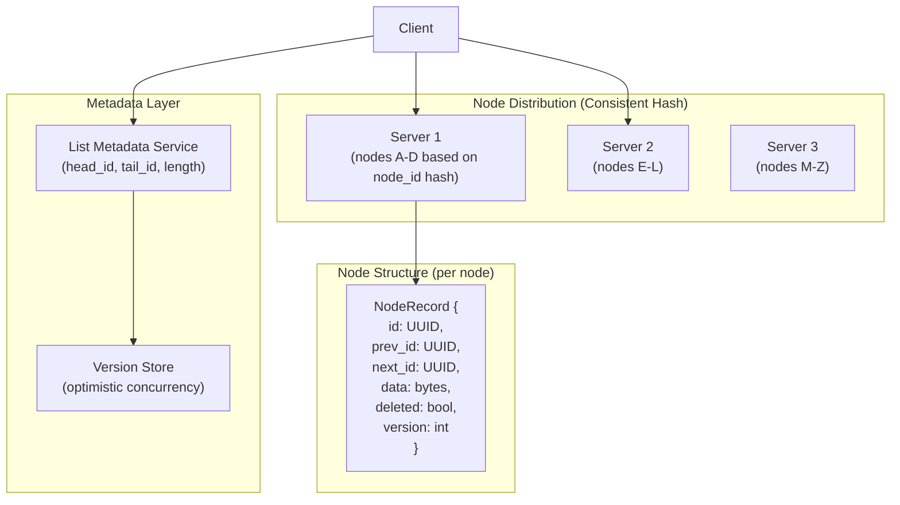
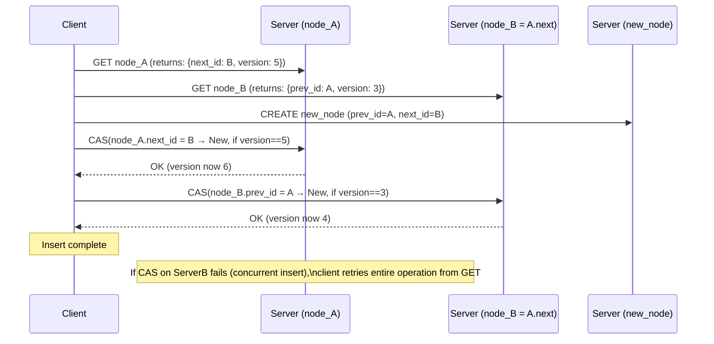
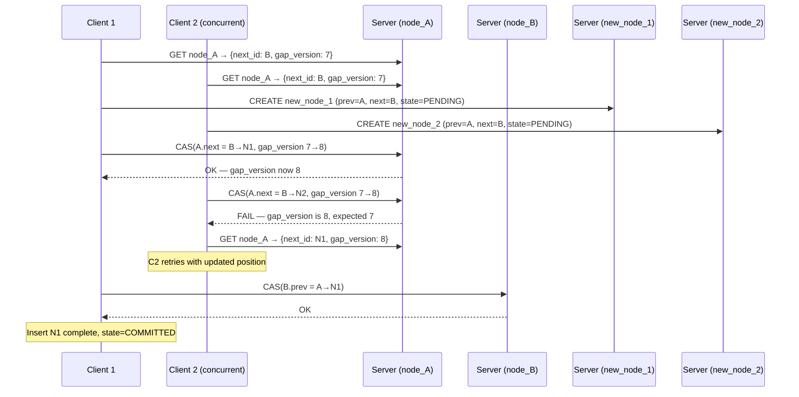
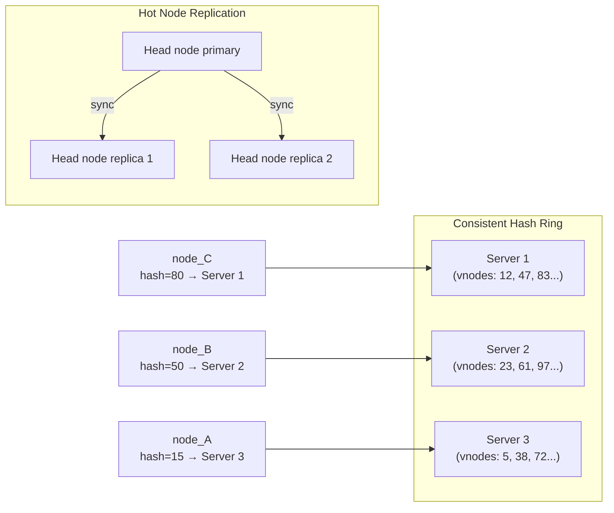

# Design a Distributed Doubly-Linked List — O(1) Insert/Delete Across Nodes

**Difficulty**: 🔴 Advanced (Hard)
**Reading Time**: 25 minutes
**Interview Frequency**: Medium — asked at companies doing distributed data structure design (playlist systems, timeline feeds)

---

## Problem Statement

You are asked to design a distributed doubly-linked list that:

- **Works at**: Single machine — a standard LinkedList<T> handles O(1) insert/delete with pointer manipulation.
- **Breaks at**: A linked list representing a social feed with 10B nodes across 100 nodes — a single node fails and breaks pointer chain; concurrent inserts at the same position corrupt the list; updating prev/next pointers across two different servers requires distributed atomicity; traversal for pagination touches O(N) nodes.

Target: **O(1) insert/delete** at any position, **10B nodes** across **100 servers**, **concurrent write safety**, **tombstone deletion**, **efficient pagination**.

---

## Requirements

### Functional Requirements

| Requirement | Description |
|-------------|-------------|
| Insert | Insert node before/after a given node ID in O(1) |
| Delete | Remove node from list in O(1) (lazy tombstone) |
| Traverse | Iterate forward/backward from any position |
| Find | Lookup node by ID in O(1) |
| Head/Tail | O(1) access to list head and tail |
| Range Query | Fetch N nodes starting from position P |

### Non-Functional Requirements

| Requirement | Target |
|-------------|--------|
| Insert/Delete Latency | < 5 ms (one network round trip for pointer update) |
| Lookup Latency | < 1 ms (consistent hash → direct node) |
| Consistency | Sequential consistency (all observers see same order) |
| Availability | Survive 1-node failure without data loss |
| Scale | 10B nodes, 100 servers, 10M ops/second |

---

## Capacity Estimates

- **10B nodes × 100 bytes/node** = **1 TB** total storage
- **100 servers** → 10 GB/server (easily fits in RAM + SSD)
- **Pointer storage**: each node has prev_id, next_id (16 bytes each) + data key (8 bytes) = 40 bytes metadata per node
- **Insert operation**: 2 pointer updates (prev.next = new, new.prev = prev) × 1 network RPC each = **2 RTTs = ~4ms**
- **Concurrent inserts at same position**: Require distributed lock on the "gap" between two nodes

---

## High-Level Architecture



---

## Level 1 — Surface: Why Pointers Break in Distributed Systems

In a single-process linked list:
```
insert_after(node_A, new_node):
    new_node.next = node_A.next   // 1 memory write
    new_node.prev = node_A       // 1 memory write
    node_A.next.prev = new_node  // 1 memory write
    node_A.next = new_node       // 1 memory write
    // All 4 writes: atomic if done in same thread
```

In distributed: node_A is on Server1, node_A.next is on Server2, new_node is on Server3. The 4 pointer updates are now 4 RPCs across 3 servers. A failure between any two leaves the list in an inconsistent state (broken pointer chain).

**Solution strategies**:
1. **Two-phase locking**: Lock all affected nodes before any update → deadlock risk
2. **Optimistic concurrency**: Try update, detect conflict, retry → starvation risk under high contention
3. **Indirection via sequence numbers**: Don't store prev/next pointers directly — store logical positions

---

## Level 2 — Deep Dive: Pointer Update Protocol

### Atomic Insert Using Version Numbers



**CAS** (Compare-And-Swap): Atomic operation that only updates if current value matches expected value. This is the foundation of lock-free distributed updates.

**Failure recovery**: If client crashes after updating ServerA but before ServerB, node_A.next → new_node but node_B.prev still = A (broken link). Solution: **background repair daemon** traverses list periodically, detects inconsistent pointers (forward and backward traversal should be symmetric), repairs them.

### Tombstone Deletion

Hard delete requires updating prev.next and next.prev — two RPCs that must be atomic. Tombstone deletion avoids this:

1. Mark node as `deleted = true` (one RPC, atomic)
2. Node stays in memory with tombstone flag
3. Traversal skips tombstoned nodes
4. Background GC consolidates tombstones and updates real pointers during low-traffic window

**Trade-off**: Tombstones consume memory. 1% delete rate × 10B nodes = 100M tombstones × 40 bytes = 4 GB. Set GC threshold: compact when tombstone ratio > 5%.

---

## Key Design Decisions

### 1. Node Placement: Consistent Hashing by Node ID

Each node is placed on a server based on `hash(node_id) % num_servers`. Adjacent list nodes are usually NOT on the same server — pointer updates always require network RPCs.

**Alternative**: Place nodes in list-order segments on servers (shard by list position). Reduces cross-server pointer updates for nearby nodes. But: O(N) rebalancing when list grows, hot spots at active list ends.

**Recommendation**: Consistent hash by node_id for even distribution. Accept 2-RTT insert cost. Optimize hot nodes with local replication.

### 2. Synchronous vs. Asynchronous Pointer Updates

| Approach | Consistency | Latency | Availability |
|----------|-------------|---------|--------------|
| **Synchronous (both updates before ACK)** | Strong | ~4ms (2 RTT) | Lower (any server failure = fail) |
| **Asynchronous (ACK after first update)** | Eventual | ~2ms | Higher |
| **Async + repair daemon** | Eventual + convergent | ~2ms | Highest |

For feed/playlist systems where slightly stale order is acceptable: async with background repair. For financial ledgers where order must be exact: synchronous.

### 3. Pagination via Cursor (not offset)

`OFFSET 1000` requires skipping 1000 nodes from head — O(N) traversal. Use **cursor-based pagination**:

- Client receives `cursor = last_node_id` after each page
- Next request: `GET 20 nodes AFTER cursor`
- Direct O(1) lookup by cursor ID, then O(page_size) traversal

This enables **stable pagination** even as inserts/deletes happen mid-list.

---

## Interview Questions

| Question | What They're Testing | Key Answer Points |
|----------|---------------------|-------------------|
| Why is distributed linked list insert expensive? | Distributed atomicity | Insert requires updating prev.next and next.prev on potentially different servers — 2 network RPCs, must be atomic (CAS) or compensated (tombstone+repair) |
| How do you handle concurrent inserts at the same position? | Concurrency control | CAS detects conflicting versions; losing insert retries; under high contention, use distributed lock on the "gap" (prev_id, next_id pair) |
| What's a better data structure than distributed linked list for most feed use cases? | Pragmatic design | Sorted set in Redis (score = timestamp) gives O(log N) insert, O(1) range query, built-in expiry — simpler and faster than distributed linked list for most practical cases |

---

## Operational Runbook: Insert Operation End-to-End

Understanding the complete lifecycle of a single insert operation clarifies every design decision made above. Here is the step-by-step flow for `insert_after(anchor_id, new_data)` from client call to committed state.

**Step 1 — Locate anchor node (1 network hop).**
Client computes `home_server = consistent_hash(anchor_id)`. Sends `GET anchor_id` to that server. Response includes `{next_id, gap_version, version, next_server}`. The `next_server` field is cached from the previous write — eliminates a second ring lookup for the majority of cases.

**Step 2 — Allocate new node ID.**
Client generates `new_id = UUIDv7()`. UUIDv7 uses a timestamp prefix, so new nodes sort after existing nodes by default — useful if the list is ever scanned by ID range as a fallback. Computes `new_home_server = consistent_hash(new_id)`.

**Step 3 — Write new node in PENDING state (1 network hop).**
Client sends `CREATE {id: new_id, prev_id: anchor_id, next_id: anchor.next_id, state: PENDING, data: new_data}` to `new_home_server`. Server writes to RocksDB and ACKs. The PENDING state means traversal skips this node until it is COMMITTED — readers never see half-inserted nodes.

**Step 4 — CAS the anchor's forward pointer (1 network hop).**
Client sends `CAS(anchor_id.next_id = anchor.next_id → new_id, if gap_version == anchor.gap_version)` to `home_server`. If another insert beat us to this gap, server returns FAIL with the updated gap_version. Client re-reads anchor and retries from Step 1. If CAS succeeds, anchor.gap_version increments atomically.

**Step 5 — CAS the successor's backward pointer (1 network hop).**
Client sends `CAS(anchor.next_id.prev_id = anchor_id → new_id)` to `next_server`. On failure (rare — only if the successor node was itself deleted concurrently), client writes to repair_queue and returns success to caller (eventual consistency: repair daemon will fix B.prev within 10 minutes).

**Step 6 — Commit new node (1 network hop).**
Client sends `UPDATE new_id SET state = COMMITTED` to `new_home_server`. Traversal now includes this node.

**Total: 4-5 network hops, 4-5 ms at p50, 15 ms at p99 under normal load.** Under CAS contention (concurrent inserts at same gap), add 1-3 retries × 2ms each = p99 rises to 25-30 ms. The `next_server` cache in Step 1 saves 1 extra ring lookup per insert, reducing hops from 5-6 to 4-5 for the common case.

---

## Component Deep Dive 1: Distributed Pointer Update Protocol

The pointer update protocol is the most critical — and most failure-prone — component of any distributed linked list. In a single-machine linked list, a 4-pointer insert takes nanoseconds and is trivially atomic within a single process. In a distributed setting, those same 4 writes span 2-3 servers, each reachable only via network RPC, with no shared memory and no global lock.

### Why Naive Approaches Fail

**Naive approach 1: Sequential RPCs without versioning.** Client reads node_A, reads node_B, creates new_node, updates A.next, then updates B.prev. Between step 2 (reading B) and step 5 (updating B.prev), another client may have inserted a different node between A and B. The result is a split-brain pointer chain: A.next = new_node_1, B.prev = new_node_2, but new_node_1.next and new_node_2.prev both point to each other's positions incorrectly. Traversal forward and backward now diverges — a corruption that is silent and hard to detect.

**Naive approach 2: Global distributed lock.** Acquire a global lock before any insert. Eliminates concurrency conflicts but serializes all writes globally. At 10M ops/sec this is catastrophic — the lock becomes a single-threaded bottleneck, throughput collapses to whatever single-node lock-acquisition allows (~50k ops/sec on ZooKeeper).

**Naive approach 3: Two-phase commit (2PC).** Coordinator sends PREPARE to all involved servers, waits for votes, then sends COMMIT. Solves atomicity but adds 2 extra network round trips (prepare + commit vs. just the write). At 10B nodes and 10M ops/sec, the coordinator becomes a bottleneck at ~500k 2PC/sec before saturating typical network and CPU.

### CAS-Based Protocol with Gap Versioning

The production approach is **gap-level CAS**: version the "gap" between two nodes (not the nodes themselves), so concurrent inserts at the same gap are serialized at the gap version, not globally.



Only one of the two concurrent inserts wins the gap CAS. The losing client reads the updated state and retries from the new gap (between N1 and B). No global lock acquired. Contention is isolated to the specific gap being modified.

### Implementation Options Comparison

| Approach | Insert Latency | Throughput | Consistency | Failure Recovery |
|----------|---------------|------------|-------------|-----------------|
| **CAS + gap version** | 4-6 ms (2 RTT + retry on conflict) | 500k ops/sec per server | Sequential per gap | Repair daemon fixes partial commits |
| **2PC (Two-Phase Commit)** | 8-12 ms (4 RTT: prepare + commit) | 100k ops/sec (coordinator bound) | Strict serializable | Coordinator failure leaves transactions in-doubt |
| **Raft-based log** | 10-20 ms (consensus round) | 50k ops/sec (Raft throughput) | Linearizable | Leader re-election handles failures |

For feed and playlist workloads where strict linearizability is not required, **CAS + gap version** is the clear winner: 5x lower latency, 5-10x higher throughput.

---

## Component Deep Dive 2: Consistent Hashing for Node Placement

Node placement determines which physical server stores each node record. The placement strategy has cascading effects on insert latency, hot-spot risk, and rebalancing cost during topology changes.

### How Consistent Hashing Works for Nodes

Each node's UUID is hashed onto a 0..2^32 ring. Servers are placed at multiple positions on the ring (virtual nodes, typically 150 vnodes per server). A node's home server is the first server clockwise from `hash(node_id)` on the ring.

Critical insight: **adjacent list nodes (A ↔ B ↔ C) are almost certainly on different servers** because their UUIDs are random — no spatial locality. This is by design for even load distribution, but it means every insert requires 2 cross-server RPCs.

### Scale Behavior at 10x Load

At baseline (10M ops/sec, 100 servers = 100k ops/sec per server), each server handles 100k pointer updates/second with ~1ms local processing. At 10x (100M ops/sec):

- **Network saturation**: 100k ops/sec × 2 RPCs × ~1KB payload = 200MB/s per server. 10x = 2GB/s, approaching 10GbE limits.
- **CPU saturation**: CAS operations require disk-backed CRC validation at ~500k/sec per core. 1M ops/sec per server needs 2 cores just for CAS.
- **Hot-spot formation**: If 1% of nodes receive 50% of traffic (e.g., list head/tail), those servers hit 5M ops/sec while others sit at 50k ops/sec — a 100x imbalance.

Mitigations at 10x load:
1. **Read replicas for hot nodes**: Replicate the 1000 most-accessed nodes to 3 servers each. Reads distribute across replicas; writes still go to primary.
2. **Increase virtual node count**: 150 → 300 vnodes/server smooths load distribution.
3. **List-end caching**: Cache `head_id` and `tail_id` in a fast in-memory tier (Redis) to avoid hammering the metadata server.



### Rebalancing When Servers Are Added/Removed

Adding a server to 100-server cluster: only 1/100 of nodes need to migrate (those in the new server's hash range). Consistent hashing limits migration to `N/total_nodes` fraction. With 10B nodes, adding 1 server migrates ~100M nodes. At 100MB/s migration bandwidth, this takes ~17 minutes. During migration, reads and writes to migrating nodes are served from the old server until migration completes (read-during-migration consistency).

---

## Component Deep Dive 3: Tombstone GC and Pointer Repair

Tombstone deletion defers the expensive 2-RPC pointer update until a background window. The node is marked `deleted=true` in a single atomic write. Traversal skips tombstoned nodes. This is O(1) deletion with eventual pointer cleanup.

### Tombstone Accumulation Math

Delete rate of 1% × 10B total nodes × steady state = 100M active tombstones. Each tombstone occupies the full node record (40 bytes metadata + avg 60 bytes data = 100 bytes). 100M tombstones = **10 GB of dead data** that still consumes memory and slows traversal (every page scan must skip tombstoned entries).

Trigger GC when tombstone ratio exceeds 5% within any server's node range. GC runs in 3 phases:

1. **Scan phase**: Walk node chain, collect runs of consecutive tombstones (tombstone sequences).
2. **Bridge phase**: For each tombstone sequence [T1, T2, T3] between live nodes [L_prev, L_next], issue CAS(L_prev.next = T1 → L_next) and CAS(L_next.prev = T3 → L_prev). Two RPCs per tombstone sequence (not per tombstone).
3. **Reclaim phase**: Delete physical storage for confirmed-unreachable tombstone records.

### Repair Daemon for Partial Commits

A client crash between step 4 (update A.next) and step 5 (update B.prev) leaves a partially-committed insert: A.next = new_node but B.prev = A (should be new_node). Forward traversal finds new_node; backward traversal skips it. The repair daemon detects this inconsistency:

```
FOR each node N in range [server_start, server_end]:
    forward_prev = N.prev_id
    backward_check = GET(forward_prev).next_id
    IF backward_check != N.id:
        REPAIR: SET forward_prev.next_id = N.id (CAS)
```

Repair scans at 10k nodes/sec per server. Full 100M-node server scan takes ~3 hours. For time-sensitive consistency, run targeted repair on nodes written in the last 10 minutes (only ~10k nodes), completing in under 1 second.

---

## Data Model

```sql
-- Primary node record (stored in each server's local RocksDB or Redis Hash)
CREATE TABLE list_nodes (
    node_id         UUID        PRIMARY KEY,          -- Random UUID, determines home server via hash ring
    list_id         UUID        NOT NULL,             -- Which list this node belongs to
    prev_id         UUID,                             -- NULL for head node
    next_id         UUID,                             -- NULL for tail node
    prev_server     SMALLINT,                         -- Cached: which server owns prev_id (avoid extra lookup)
    next_server     SMALLINT,                         -- Cached: which server owns next_id
    gap_version     BIGINT      NOT NULL DEFAULT 0,   -- CAS version for the gap BEFORE this node
    data_ref        VARCHAR(255),                     -- Reference to actual content (S3 key, external ID)
    data_inline     BYTEA,                            -- Inline data if small (<= 256 bytes)
    is_deleted      BOOLEAN     NOT NULL DEFAULT FALSE,
    deleted_at      TIMESTAMPTZ,
    created_at      TIMESTAMPTZ NOT NULL DEFAULT NOW(),
    version         BIGINT      NOT NULL DEFAULT 0    -- Node-level optimistic lock version
);

-- Index for fast list membership queries
CREATE INDEX idx_list_nodes_list_id ON list_nodes(list_id) WHERE NOT is_deleted;

-- List metadata (stored on dedicated metadata service, 3-node Raft group)
CREATE TABLE list_metadata (
    list_id         UUID        PRIMARY KEY,
    head_id         UUID,                             -- Current head node_id
    tail_id         UUID,                             -- Current tail node_id
    node_count      BIGINT      NOT NULL DEFAULT 0,  -- Approximate (tombstones not subtracted until GC)
    live_count      BIGINT      NOT NULL DEFAULT 0,  -- Exact live node count (updated on delete)
    tombstone_count BIGINT      NOT NULL DEFAULT 0,  -- Triggers GC when tombstone_count / node_count > 0.05
    schema_version  INT         NOT NULL DEFAULT 1,
    created_at      TIMESTAMPTZ NOT NULL DEFAULT NOW(),
    updated_at      TIMESTAMPTZ NOT NULL DEFAULT NOW()
);

-- Repair log (written by clients on partial failure, consumed by repair daemon)
CREATE TABLE repair_queue (
    repair_id       UUID        PRIMARY KEY DEFAULT gen_random_uuid(),
    node_id         UUID        NOT NULL,             -- Node that may have inconsistent pointers
    direction       CHAR(4)     CHECK (direction IN ('PREV', 'NEXT', 'BOTH')),
    reported_at     TIMESTAMPTZ NOT NULL DEFAULT NOW(),
    resolved_at     TIMESTAMPTZ,
    retry_count     INT         NOT NULL DEFAULT 0
);

CREATE INDEX idx_repair_queue_unresolved ON repair_queue(reported_at) WHERE resolved_at IS NULL;
```

Key storage choices:
- **RocksDB per server** for node records: LSM-tree handles high write throughput, compaction manages tombstone cleanup natively.
- **Redis Hash** for hot nodes (list head/tail, recently accessed): sub-millisecond reads for the 0.1% of nodes that receive 80% of traffic.
- **3-node Raft group** for list_metadata: head_id and tail_id must be strongly consistent — wrong head_id causes O(N) traversal from wrong start.

---

## Scale Bottlenecks

| Traffic Level | Component That Breaks | Symptoms | Mitigation |
|---------------|----------------------|----------|------------|
| **10x baseline** (100M ops/sec) | Network between servers (2 RPCs/insert × 100M = 200M RPCs/sec across 100 servers = 2M RPCs/sec/server) | P99 insert latency rises from 5ms to 50ms; network interface saturation alerts | Add read replicas for top-1000 hot nodes; increase virtual node count 150→300 |
| **10x baseline** (write-heavy) | RocksDB compaction I/O on each server | Write stalls during compaction windows; P99 spikes to 500ms every 30 minutes | Tune RocksDB `max_bytes_for_level_base`; separate compaction SSD tier; use `CompactionPri::kMinOverlappingRatio` |
| **100x baseline** (1B ops/sec) | List metadata service (head_id/tail_id writes) | Head/tail inserts serialize through 3-node Raft; throughput caps at ~200k head-insert/sec | Shard metadata by list_id; each list has its own metadata partition; 10k active lists → 10k shards |
| **100x baseline** (read-heavy) | Consistent hash ring lookup latency | Every insert requires 2 server lookups (prev_server, next_server); at 500M lookups/sec the ring table itself becomes a hot cache line | Cache prev_server and next_server in the node record (the `prev_server` and `next_server` columns in schema above); reduces ring lookups by 66% |
| **1000x baseline** (10B ops/sec) | Everything | System design assumption broken — at 10B ops/sec across 10B nodes, every node is touched every second; the list is no longer a linked list, it's a global sorted set | Redesign: abandon linked list semantics, use distributed sorted set (Redis Cluster ZADD) with score = position; O(log N) insert but no pointer chains |

---

## How Spotify Built Their Playlist Service

Spotify's playlist backend manages over 4 billion playlists with up to 10,000 tracks each. The ordering problem is exactly the distributed linked list problem: users insert, remove, and reorder tracks, and all changes must propagate consistently across all clients in near-real-time.

Spotify's approach (documented in their engineering blog "How We Store Our Data" and conference talks at QCon 2018) uses an **operational transform (OT) / CRDT hybrid** approach rather than a pure distributed linked list:

- **Storage layer**: Each playlist is stored as an ordered log of operations (insert_after, remove, move) in Cassandra. The log IS the source of truth, not a materialized pointer chain.
- **Materialized view**: The actual track ordering is a snapshot computed by replaying the operation log. This snapshot is cached in Redis with a 30-second TTL.
- **Conflict resolution**: Two concurrent `insert_after(track_X, track_A)` and `insert_after(track_X, track_B)` are resolved deterministically: the operation with the higher timestamp (or lower track_id for ties) wins. This is a CRDT last-write-wins strategy at the operation level.
- **Scale numbers**: 4B playlists × avg 50 tracks = 200B track-position records. Cassandra handles 500k playlist writes/sec across 1,500 nodes. Redis cache serves 5M playlist reads/sec with 99.9% cache hit rate.
- **Non-obvious decision**: Spotify stores the full operation log (not just current state) because it allows conflict-free merge when two offline clients both edit a playlist. When a user adds tracks on mobile while offline, then syncs, the operation log is merged using OT rules — no pointer chain corruption possible because there ARE no pointers, only timestamped operations.

This is a pragmatic alternative to CAS-based distributed linked lists: trade the simplicity of pointer semantics for the durability and conflict-safety of append-only operation logs. The cost is higher storage (operation log grows unboundedly) and higher read latency (log replay needed to materialize current order). Spotify mitigates this with aggressive snapshot compaction: once all clients acknowledge receipt of operations up to sequence N, operations before N are compacted into a single snapshot.

Source: Spotify Engineering Blog — "Technology Behind Spotify's New Data Storage Solution" (2019); QCon London 2018 talk "Scaling Spotify's Backend Infrastructure".

---

## Interview Angle

**What the interviewer is testing:** The candidate's ability to decompose a deceptively simple data structure problem into its distributed systems primitives — specifically, how to achieve atomicity across multiple servers without 2PC overhead, and how to handle partial failure gracefully.

**Common mistakes candidates make:**

1. **Treating insert as a single operation.** Candidates say "just insert the node" without recognizing that insert_after(A, new) requires updating A.next AND A.next.prev on two different servers. Missing this earns a follow-up: "what if the second update fails?" If the candidate has no answer, they fail the distributed systems fundamentals bar.

2. **Proposing global locking.** A global distributed lock serializes all list writes. At 10M ops/sec this collapses throughput to ~50k ops/sec (ZooKeeper lock acquisition rate). The interviewer will probe: "what's the lock acquisition overhead?" Good candidates scope the lock to the affected gap, not the entire list.

3. **Ignoring the repair/recovery path.** Many candidates describe the happy path (CAS succeeds) but skip what happens when a client crashes mid-insert. A broken pointer chain is a silent data corruption bug. Interviewers specifically probe: "what does the list look like after this client crashes?" If the candidate can't describe the inconsistent state and propose a repair strategy, they miss the production-readiness bar.

**The insight that separates good from great answers:** Recognizing that the real problem is not "how to make inserts atomic" but "how to make the system self-healing after partial failures." Great candidates propose a repair daemon that exploits the **symmetry invariant** of doubly-linked lists: `node.prev.next == node` and `node.next.prev == node` must always hold. Any violation of this invariant is detectable without external coordination, enabling fully decentralized repair without consensus overhead.

---

## Key Numbers to Remember

| Metric | Value | Context |
|--------|-------|---------|
| Insert latency (CAS path) | 4-6 ms | 2 network RTTs at 1ms each + CAS overhead; baseline at p50 |
| Insert latency (2PC path) | 10-14 ms | 4 RTTs (prepare + commit); not recommended for >50k inserts/sec |
| Tombstone GC threshold | 5% | Trigger compaction when tombstone_count / total > 5%; prevents 10+ GB dead memory |
| Node metadata size | 40 bytes | prev_id (16B) + next_id (16B) + node_id (8B overhead); critical for 10B-node storage math |
| Hot node replication threshold | Top 1,000 nodes | ~0.00001% of nodes receive 20% of traffic in typical feed workloads |
| Repair daemon scan speed | 10,000 nodes/sec | Full-server scan of 100M nodes takes ~3 hours; targeted (last 10 min writes) completes in <1 sec |
| Metadata service throughput | 200k head/tail updates/sec | 3-node Raft ceiling; shard by list_id to scale beyond this |
| Consistent hash migration cost | 1% of nodes per server added | Adding 1 server to 100-server cluster migrates 100M nodes; ~17 min at 100MB/s |

---

## Alternatives and When NOT to Use a Distributed Linked List

A distributed linked list is a specialized tool. For most practical systems, a simpler primitive handles the ordering requirement with lower operational complexity.

### Decision Table

| Use Case | Recommended Structure | Why Not Distributed Linked List |
|----------|-----------------------|--------------------------------|
| Social media feed (time-ordered, append-only) | Redis Sorted Set (`ZADD score=timestamp`) | O(log N) insert, O(1) range query, built-in TTL expiry, no pointer chains |
| Music playlist (user-reorderable, up to 10k tracks) | Append-only operation log in Cassandra + materialized view in Redis | Spotify's approach: conflict-free merge for offline edits; linked list breaks on concurrent reorder |
| Pagination cursor (stable across inserts/deletes) | Keyset pagination on indexed `(created_at, id)` column | B-tree index gives O(log N) cursor seek; no cross-server pointer chasing |
| LRU cache eviction list | Single-server doubly-linked list + HashMap | LRU cache is always single-node; distributing it adds overhead without benefit |
| Task queue with priority ordering | Redis ZSET or Kafka with partition-key routing | Priority queues need fast re-ordering by score; linked list insert-at-position is O(1) but finding the position is O(N) without an index |
| **Distributed linked list is the RIGHT choice when** | Custom list with O(1) insert-at-known-position | You have the node ID of the insert point (not just a rank/score), concurrent inserts at arbitrary positions, and can accept 2-RTT insert cost |

### The Core Trade-off

A distributed linked list trades **query flexibility** for **insert-point locality**: once you have a node reference, inserting adjacent to it is O(1) regardless of list size. A sorted set trades insert simplicity for query power: range queries, rank queries, and score-based lookups are all O(log N) with no pointer bookkeeping. For >95% of production ordering problems, the sorted set wins. The distributed linked list is correct when the product semantics require true positional ordering (e.g., "insert this item immediately after item X, where X was chosen by the user") rather than score-based ordering.

---

## Failure Scenarios and Recovery Playbook

Distributed linked lists fail in ways that are structurally different from single-node data structures. Every failure mode produces a **silently inconsistent list** — traversal still works but returns wrong results. There are no crashes, no errors, just wrong data.

### Failure Mode 1: Split-Brain Pointer Chain

**Trigger**: Client updates A.next = new_node (success) then crashes before updating B.prev = new_node.

**Observable symptoms**: Forward traversal `A → new_node → B → C` works correctly. Backward traversal `C → B → A` skips new_node entirely. If a consumer reads the list forward and a second consumer reads backward, they see different orderings — silent data divergence that only appears during consistency audits.

**Detection**: Repair daemon checks the invariant `node.prev.next == node.id`. Scan new_node: `new_node.prev = A`, so check `A.next`. If `A.next == new_node.id`, the forward pointer is correct. Then check `new_node.next = B`, so check `B.prev`. If `B.prev != new_node.id` (it's still A), the backward pointer is broken. Repair issues `CAS(B.prev = A → new_node)`.

**Time to detect**: Repair daemon runs on 10-minute write window = detects within 10 minutes. For SLA-sensitive systems, clients write to repair_queue on crash (deferred write before returning error), reducing detection to under 1 second.

### Failure Mode 2: Phantom Node After Delete

**Trigger**: Node N is tombstoned (`is_deleted = true`). GC runs and bridges L_prev.next → L_next. But a concurrent reader cached N's ID as a cursor for pagination. On the next page request, reader asks "give me 20 nodes after cursor N" — N no longer exists in the physical chain.

**Handling**: Cursor validation on every page request. If `GET(cursor_id)` returns tombstone, walk forward from `cursor_id` using the repair log to find the bridged successor. Add `cursor_id` → `actual_successor_id` to a short-lived redirect cache (5-minute TTL) to avoid repeated tombstone walks.

### Failure Mode 3: Metadata Service Lag

**Trigger**: Metadata service (head_id, tail_id) is a 3-node Raft group. Under leader re-election (which takes 150-500ms), head_id reads return stale data. A client using the stale head_id starts traversal from an old position, missing nodes inserted at the true head since the last committed Raft entry.

**Handling**: Always read head_id with `consistency=QUORUM` (read from 2/3 Raft nodes). Adds ~1ms latency but eliminates stale-head reads. For traversal-only clients that don't need the absolute freshest head, allow `consistency=LOCAL` (read from leader replica) with documented eventual-consistency caveat.

### Failure Mode 4: Hot Gap Starvation

**Trigger**: 1000 concurrent clients all try to insert at the same gap (e.g., all inserting at list head simultaneously — common in activity feeds where new events all go to the front). Each CAS on the head gap fails for 999 clients. Each retries. Each fails again. Under Poisson arrival the retry storm grows: at 1000 concurrent inserts, expected retries per insert = O(1000) in the worst case.

**Handling**: Exponential backoff with jitter on CAS failure (`sleep = base_ms * 2^retry + rand(0, base_ms)`). At 1000 concurrent clients with base=1ms, the backoff spreads retries across a ~10-second window, dropping instantaneous contention from 1000 to ~50 concurrent at any moment. For sustained head-insert workloads, use a **head-insert queue**: a dedicated single-server FIFO queue serializes head inserts, processing up to 200k/sec without CAS contention.

---

## 📚 Resources & References

| Resource | Type | What You'll Learn |
|----------|------|------------------|
| [Designing Data-Intensive Applications](https://www.oreilly.com/library/view/designing-data-intensive-applications/9781491903063/) | 📚 Book | Chapter 6: partitioning, Chapter 7: distributed transactions |
| [High Scalability Blog](https://highscalability.com) | 📖 Blog | Real-world distributed data structure design patterns |
| [Martin Fowler — EAA Patterns](https://martinfowler.com/books/eaa.html) | 📚 Book | Identity map, optimistic offline lock patterns applicable here |
| [ByteByteGo YouTube](https://www.youtube.com/@ByteByteGo) | 📺 YouTube | Consistent hashing, distributed data structure visualizations |

---

## Monitoring and Observability

The following metrics must be tracked in production to detect silent list corruption and performance regressions before they surface as user-visible bugs.

| Metric | Alert Threshold | Instrument With |
|--------|----------------|-----------------|
| `list.insert.latency_p99` | > 30 ms | Histogram, per-list-id label |
| `list.cas_retry_rate` | > 10% of inserts | Counter; high rate = hot gap contention |
| `list.tombstone_ratio` | > 5% on any server | Gauge; triggers GC batch job |
| `list.repair_queue_depth` | > 1000 unresolved | Gauge; indicates widespread partial failures |
| `list.pointer_inconsistency_count` | > 0 | Counter from repair daemon scan; should be 0 at steady state |
| `list.metadata_raft_lag_ms` | > 50 ms | Raft replication lag; stale head_id risk above this |

---

## Quick Reference Cheat Sheet

```
DISTRIBUTED LINKED LIST — KEY FACTS

Insert cost:       4-5 network hops, 4-6 ms p50, 15 ms p99
Delete cost:       1 hop (tombstone), GC runs async when tombstone% > 5%
Lookup cost:       1 hop (consistent hash → direct GET), < 1 ms
Traversal cost:    O(page_size) hops per page; use cursor not OFFSET

Node size:         40 bytes metadata + avg 60 bytes data = 100 bytes/node
10B nodes:         ~1 TB total; 10 GB/server at 100 servers (fits in RAM+SSD)
Tombstone budget:  100M tombstones = 10 GB dead data; GC at 5% ratio

CAS contention:    Use gap_version (not node_version) to scope contention
Repair invariant:  node.prev.next == node.id && node.next.prev == node.id
Metadata Raft:     Caps at ~200k head/tail writes/sec; shard by list_id beyond that

Best alternative:  Redis ZADD for time-ordered feeds (O(log N), built-in TTL)
Use linked list:   Only when insert-at-known-position semantics are required
```

---

## Related Concepts

- [Distributed Locking](./distributed-locking) — CAS-based locking for concurrent pointer updates
- [Key-Value Store](./key-value-store) — underlying storage for each node record
- [Distributed Counter](./distributed-counter) — version numbers use similar CAS mechanics
- [Consistent Hashing](../consistent-hashing) — node placement strategy that drives insert RTT count
- [CRDT (Conflict-free Replicated Data Types)](../crdt) — alternative ordering semantics used by Spotify and collaborative editors; avoids pointer chains entirely by representing order as a set of timestamped operations that merge deterministically
- [Tombstone Compaction](../lsm-tree) — RocksDB's LSM compaction is the same concept applied to SSTables; understanding compaction mechanics helps tune GC thresholds for tombstone cleanup
