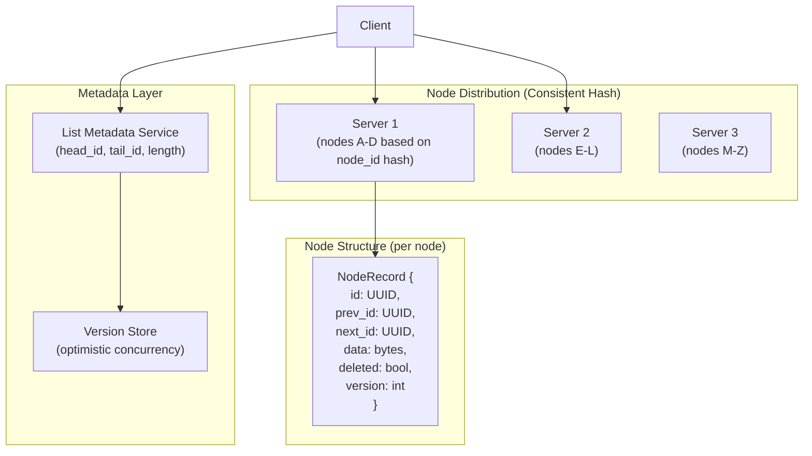
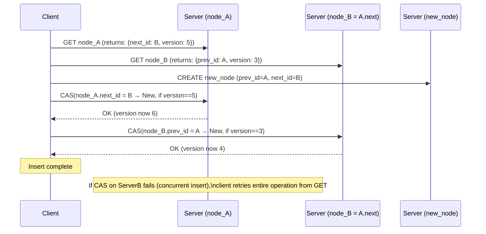

# Design a Distributed Doubly-Linked List — O(1) Insert/Delete Across Nodes

**Difficulty**: 🔴 Advanced (Hard)
**Reading Time**: 25 minutes
**Interview Frequency**: Medium — asked at companies doing distributed data structure design (playlist systems, timeline feeds)

---

## Problem Statement

You are asked to design a distributed doubly-linked list that:

- **Works at**: Single machine — a standard LinkedList<T> handles O(1) insert/delete with pointer manipulation.
- **Breaks at**: A linked list representing a social feed with 10B nodes across 100 nodes — a single node fails and breaks pointer chain; concurrent inserts at the same position corrupt the list; updating prev/next pointers across two different servers requires distributed atomicity; traversal for pagination touches O(N) nodes.

Target: **O(1) insert/delete** at any position, **10B nodes** across **100 servers**, **concurrent write safety**, **tombstone deletion**, **efficient pagination**.

---

## Requirements

### Functional Requirements

| Requirement | Description |
|-------------|-------------|
| Insert | Insert node before/after a given node ID in O(1) |
| Delete | Remove node from list in O(1) (lazy tombstone) |
| Traverse | Iterate forward/backward from any position |
| Find | Lookup node by ID in O(1) |
| Head/Tail | O(1) access to list head and tail |
| Range Query | Fetch N nodes starting from position P |

### Non-Functional Requirements

| Requirement | Target |
|-------------|--------|
| Insert/Delete Latency | < 5 ms (one network round trip for pointer update) |
| Lookup Latency | < 1 ms (consistent hash → direct node) |
| Consistency | Sequential consistency (all observers see same order) |
| Availability | Survive 1-node failure without data loss |
| Scale | 10B nodes, 100 servers, 10M ops/second |

---

## Capacity Estimates

- **10B nodes × 100 bytes/node** = **1 TB** total storage
- **100 servers** → 10 GB/server (easily fits in RAM + SSD)
- **Pointer storage**: each node has prev_id, next_id (16 bytes each) + data key (8 bytes) = 40 bytes metadata per node
- **Insert operation**: 2 pointer updates (prev.next = new, new.prev = prev) × 1 network RPC each = **2 RTTs = ~4ms**
- **Concurrent inserts at same position**: Require distributed lock on the "gap" between two nodes

---

## High-Level Architecture



---

## Level 1 — Surface: Why Pointers Break in Distributed Systems

In a single-process linked list:
```
insert_after(node_A, new_node):
    new_node.next = node_A.next   // 1 memory write
    new_node.prev = node_A       // 1 memory write
    node_A.next.prev = new_node  // 1 memory write
    node_A.next = new_node       // 1 memory write
    // All 4 writes: atomic if done in same thread
```

In distributed: node_A is on Server1, node_A.next is on Server2, new_node is on Server3. The 4 pointer updates are now 4 RPCs across 3 servers. A failure between any two leaves the list in an inconsistent state (broken pointer chain).

**Solution strategies**:
1. **Two-phase locking**: Lock all affected nodes before any update → deadlock risk
2. **Optimistic concurrency**: Try update, detect conflict, retry → starvation risk under high contention
3. **Indirection via sequence numbers**: Don't store prev/next pointers directly — store logical positions

---

## Level 2 — Deep Dive: Pointer Update Protocol

### Atomic Insert Using Version Numbers



**CAS** (Compare-And-Swap): Atomic operation that only updates if current value matches expected value. This is the foundation of lock-free distributed updates.

**Failure recovery**: If client crashes after updating ServerA but before ServerB, node_A.next → new_node but node_B.prev still = A (broken link). Solution: **background repair daemon** traverses list periodically, detects inconsistent pointers (forward and backward traversal should be symmetric), repairs them.

### Tombstone Deletion

Hard delete requires updating prev.next and next.prev — two RPCs that must be atomic. Tombstone deletion avoids this:

1. Mark node as `deleted = true` (one RPC, atomic)
2. Node stays in memory with tombstone flag
3. Traversal skips tombstoned nodes
4. Background GC consolidates tombstones and updates real pointers during low-traffic window

**Trade-off**: Tombstones consume memory. 1% delete rate × 10B nodes = 100M tombstones × 40 bytes = 4 GB. Set GC threshold: compact when tombstone ratio > 5%.

---

## Key Design Decisions

### 1. Node Placement: Consistent Hashing by Node ID

Each node is placed on a server based on `hash(node_id) % num_servers`. Adjacent list nodes are usually NOT on the same server — pointer updates always require network RPCs.

**Alternative**: Place nodes in list-order segments on servers (shard by list position). Reduces cross-server pointer updates for nearby nodes. But: O(N) rebalancing when list grows, hot spots at active list ends.

**Recommendation**: Consistent hash by node_id for even distribution. Accept 2-RTT insert cost. Optimize hot nodes with local replication.

### 2. Synchronous vs. Asynchronous Pointer Updates

| Approach | Consistency | Latency | Availability |
|----------|-------------|---------|--------------|
| **Synchronous (both updates before ACK)** | Strong | ~4ms (2 RTT) | Lower (any server failure = fail) |
| **Asynchronous (ACK after first update)** | Eventual | ~2ms | Higher |
| **Async + repair daemon** | Eventual + convergent | ~2ms | Highest |

For feed/playlist systems where slightly stale order is acceptable: async with background repair. For financial ledgers where order must be exact: synchronous.

### 3. Pagination via Cursor (not offset)

`OFFSET 1000` requires skipping 1000 nodes from head — O(N) traversal. Use **cursor-based pagination**:

- Client receives `cursor = last_node_id` after each page
- Next request: `GET 20 nodes AFTER cursor`
- Direct O(1) lookup by cursor ID, then O(page_size) traversal

This enables **stable pagination** even as inserts/deletes happen mid-list.

---

## Interview Questions

| Question | What They're Testing | Key Answer Points |
|----------|---------------------|-------------------|
| Why is distributed linked list insert expensive? | Distributed atomicity | Insert requires updating prev.next and next.prev on potentially different servers — 2 network RPCs, must be atomic (CAS) or compensated (tombstone+repair) |
| How do you handle concurrent inserts at the same position? | Concurrency control | CAS detects conflicting versions; losing insert retries; under high contention, use distributed lock on the "gap" (prev_id, next_id pair) |
| What's a better data structure than distributed linked list for most feed use cases? | Pragmatic design | Sorted set in Redis (score = timestamp) gives O(log N) insert, O(1) range query, built-in expiry — simpler and faster than distributed linked list for most practical cases |

---

## 📚 Resources & References

| Resource | Type | What You'll Learn |
|----------|------|------------------|
| [Designing Data-Intensive Applications](https://www.oreilly.com/library/view/designing-data-intensive-applications/9781491903063/) | 📚 Book | Chapter 6: partitioning, Chapter 7: distributed transactions |
| [High Scalability Blog](https://highscalability.com) | 📖 Blog | Real-world distributed data structure design patterns |
| [Martin Fowler — EAA Patterns](https://martinfowler.com/books/eaa.html) | 📚 Book | Identity map, optimistic offline lock patterns applicable here |
| [ByteByteGo YouTube](https://www.youtube.com/@ByteByteGo) | 📺 YouTube | Consistent hashing, distributed data structure visualizations |

---

## Related Concepts

- [Distributed Locking](./distributed-locking) — CAS-based locking for concurrent pointer updates
- [Key-Value Store](./key-value-store) — underlying storage for each node record
- [Distributed Counter](./distributed-counter) — version numbers use similar CAS mechanics
