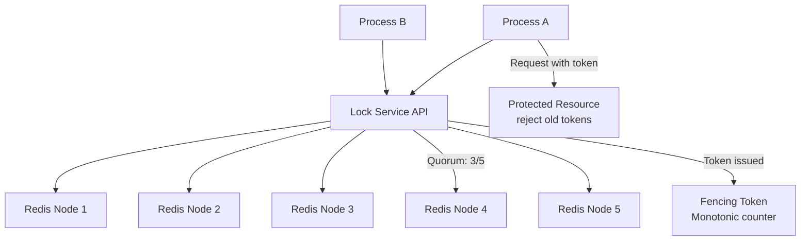

# Design a Distributed Locking Service

**Difficulty**: 🔴 Advanced
**Reading Time**: Coming Soon
**Interview Frequency**: High

---

> 🚧 **Full article coming soon.** This stub gives you the essentials to start thinking about this problem.

---

## The Core Problem

Providing mutual exclusion across distributed processes is unsafe with a naive single-node implementation — if the lock server crashes or the network partitions, a process can hold a lock indefinitely and another process can't acquire it. Even Redis Redlock has a fundamental flaw: a process can hold a lock after its TTL expires if GC pauses delay execution, leading to split-brain.

## Functional Requirements

- Acquire an exclusive lock on a named resource
- Release the lock when done
- Automatically release locks if the holder crashes (TTL-based)
- Support lock contention reporting and observability
- Safe across process restarts and partial network failures

## Non-Functional Requirements

| Requirement | Target |
|-------------|--------|
| Lock acquisition latency | p99 < 50ms |
| Safety | No two processes hold lock simultaneously |
| Liveness | Lock released within TTL (30s max) if holder crashes |
| Availability | Lock service available even with 1-node failure |

## Back-of-Envelope Estimates

- **Lock operations**: 10K lock acquisitions/sec (typical microservices workload)
- **Lock TTL overhead**: 30-second TTL × 10K concurrent locks = 300K active lock records (trivial)
- **Redlock quorum**: 5 Redis nodes; must acquire majority (3/5) within 10ms; each Redis round-trip ~1ms; total budget: 5ms for 3 successes

## Key Design Decisions

1. **Fencing Tokens for Safety** — even with Redlock, a GC-paused process can hold an expired lock; use monotonically increasing fencing token with each lock grant; the protected resource rejects requests with lower token than last seen, preventing stale lock holders from making changes.
2. **Redlock Algorithm** — acquire lock on N/2+1 independent Redis nodes within TTL/10 time; if quorum reached, lock is valid for (TTL - elapsed_time); if not, release all partial locks; tolerates failure of any single node.
3. **ZooKeeper for Strong Consistency** — if you need CP (consistency over availability), use ZooKeeper ephemeral znodes; lock holder creates ephemeral node; ZK deletes it if session times out; Paxos-based consensus guarantees no two nodes see lock as available.

## High-Level Architecture

## Top Interview Questions for This Problem

| Question | Tests |
|----------|-------|
| Why is a single Redis SETNX not sufficient for distributed locking? | Split-brain, crash recovery |
| What is a fencing token and why does Redlock still need one? | Clock skew, GC pause vulnerabilities |
| When would you use ZooKeeper locks instead of Redis Redlock? | CP vs AP trade-offs |

## Related Concepts

- [Distributed task scheduler using locks for leader election](../04-reservation-scheduling/task-scheduler)
- [Hotel booking using optimistic locking as an alternative](../04-reservation-scheduling/hotel-booking)

---

*📚 Full deep-dive with multiple approaches, trade-off tables, and pseudocode coming soon.*
