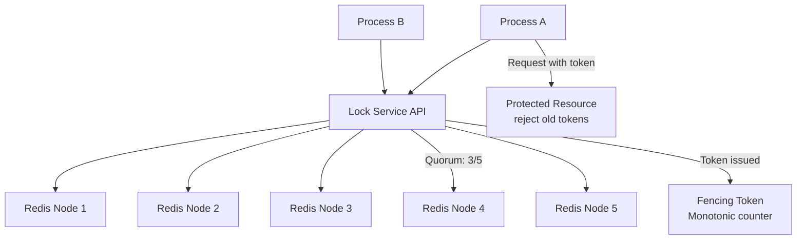
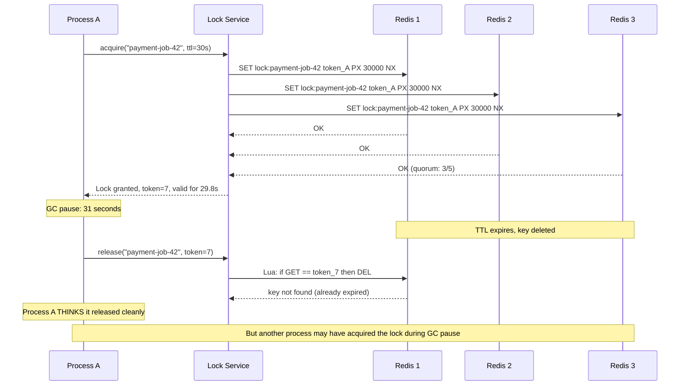
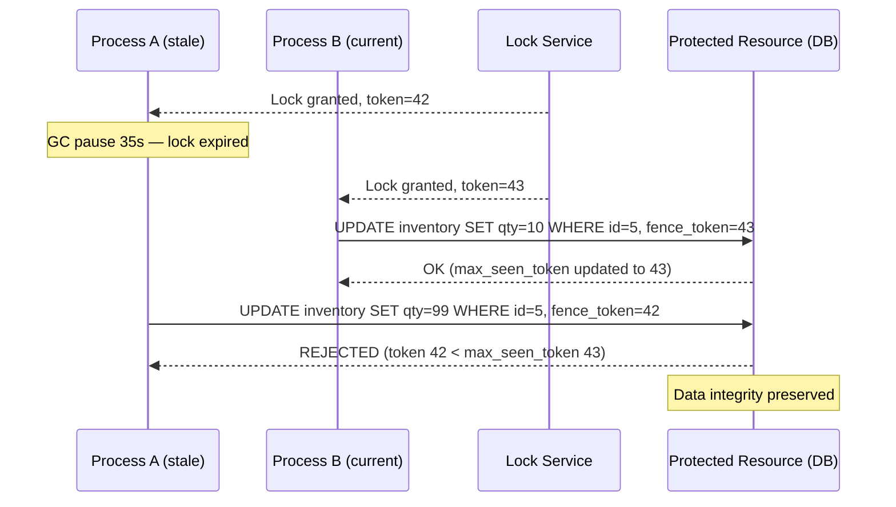
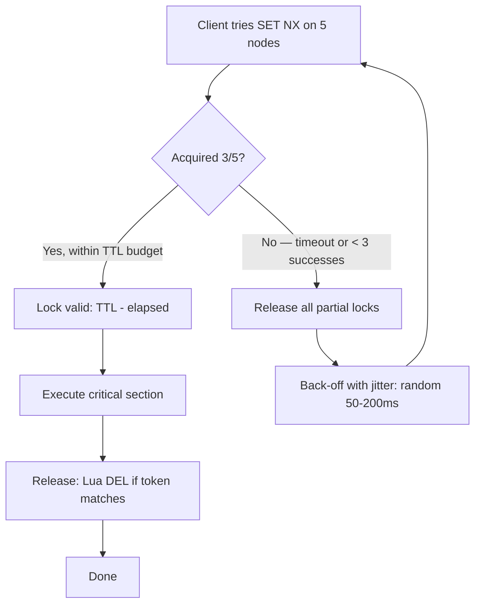
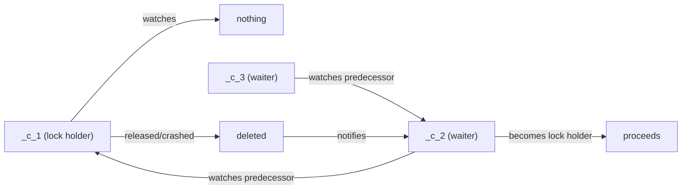
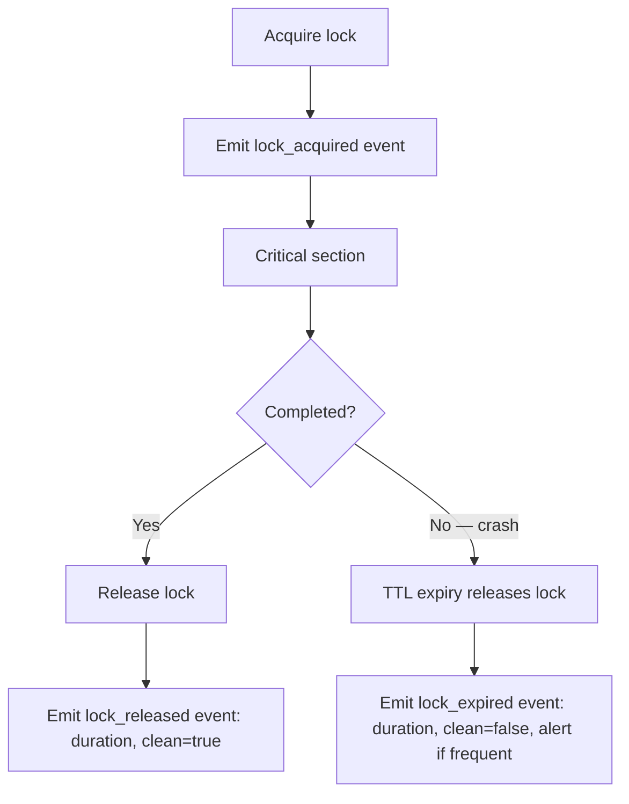
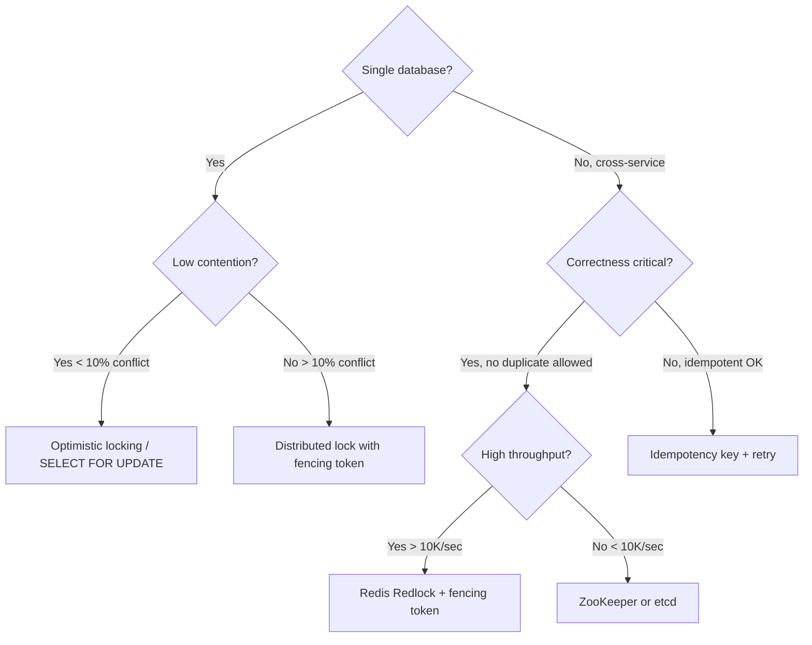

# Design a Distributed Locking Service

**Difficulty**: 🔴 Advanced
**Reading Time**: 25 min
**Interview Frequency**: High

---

## The Core Problem

Providing mutual exclusion across distributed processes is unsafe with a naive single-node implementation — if the lock server crashes or the network partitions, a process can hold a lock indefinitely and another process can't acquire it. Even Redis Redlock has a fundamental flaw: a process can hold a lock after its TTL expires if GC pauses delay execution, leading to split-brain.

## Functional Requirements

- Acquire an exclusive lock on a named resource
- Release the lock when done
- Automatically release locks if the holder crashes (TTL-based)
- Support lock contention reporting and observability
- Safe across process restarts and partial network failures

## Non-Functional Requirements

| Requirement | Target |
|-------------|--------|
| Lock acquisition latency | p99 < 50ms |
| Safety | No two processes hold lock simultaneously |
| Liveness | Lock released within TTL (30s max) if holder crashes |
| Availability | Lock service available even with 1-node failure |

## Back-of-Envelope Estimates

- **Lock operations**: 10K lock acquisitions/sec (typical microservices workload)
- **Lock TTL overhead**: 30-second TTL × 10K concurrent locks = 300K active lock records (trivial)
- **Redlock quorum**: 5 Redis nodes; must acquire majority (3/5) within 10ms; each Redis round-trip ~1ms; total budget: 5ms for 3 successes

## Key Design Decisions

1. **Fencing Tokens for Safety** — even with Redlock, a GC-paused process can hold an expired lock; use monotonically increasing fencing token with each lock grant; the protected resource rejects requests with lower token than last seen, preventing stale lock holders from making changes.
2. **Redlock Algorithm** — acquire lock on N/2+1 independent Redis nodes within TTL/10 time; if quorum reached, lock is valid for (TTL - elapsed_time); if not, release all partial locks; tolerates failure of any single node.
3. **ZooKeeper for Strong Consistency** — if you need CP (consistency over availability), use ZooKeeper ephemeral znodes; lock holder creates ephemeral node; ZK deletes it if session times out; Paxos-based consensus guarantees no two nodes see lock as available.

## High-Level Architecture



## Top Interview Questions for This Problem

| Question | Tests |
|----------|-------|
| Why is a single Redis SETNX not sufficient for distributed locking? | Split-brain, crash recovery |
| What is a fencing token and why does Redlock still need one? | Clock skew, GC pause vulnerabilities |
| When would you use ZooKeeper locks instead of Redis Redlock? | CP vs AP trade-offs |
| How do you handle a lock holder that is paused (GC, swap, VM migration) for longer than its TTL? | Fencing tokens, resource-side enforcement |
| What happens if two Redis nodes in a 5-node Redlock ensemble go down simultaneously? | Quorum loss, lock service unavailability, availability vs safety |
| How would you implement a fair (FIFO) distributed queue of lock waiters? | ZooKeeper sequential ephemeral znodes, predecessor-watch pattern |
| Explain the difference between a lock lease TTL and a session timeout. | Lease = per-key timer; session = per-client connection; ZK sessions own multiple locks |
| How would you detect and alert on a distributed lock leak in production? | `lock_held_duration` histogram, p99 > TTL × 2 alert threshold |

## Related Concepts

- [Distributed task scheduler using locks for leader election](../04-reservation-scheduling/task-scheduler)
- [Hotel booking using optimistic locking as an alternative](../04-reservation-scheduling/hotel-booking)

## Common Failure Modes

| Failure Mode | Trigger | Symptom | Fix |
|--------------|---------|---------|-----|
| **Split-brain** | Network partition between Redlock nodes; quorum achieved on both sides of partition | Two processes hold the same lock simultaneously | Use fencing tokens on protected resource; CP system (etcd/ZK) eliminates this |
| **Stale lock holder** | GC pause or VM live-migration longer than TTL | Process resumes post-GC, believes it holds valid lock, writes to resource | Resource enforces fencing token — rejects writes with token older than last seen |
| **Lock leak** | Bug in application: exception thrown before release, missing `finally` block | Locks only expire via TTL; max contention on that resource until TTL fires | Use context-manager client library; monitor `lock_held_duration > TTL * 0.8` |
| **Thundering herd on release** | All waiters poll and retry when lock is released | CPU spike, Redis SETNX storm, most retries fail | Exponential backoff with full jitter; or ZooKeeper predecessor-watch (only 1 waiter notified) |
| **Clock skew invalidation** | NTP jump on lock holder's machine advances system clock past TTL | Lock expires prematurely from lock service's perspective while holder is mid-operation | Use monotonic clocks for elapsed-time measurement (not wall clock); keep NTP drift < 50ms |
| **Redis AOF data loss on restart** | AOF `appendfsync everysec` (default) loses up to 1 second of writes on crash | Redis restarts without the lock key; another process acquires it while original holder is still active | Use `appendfsync always` for lock namespace Redis instances (5K writes/sec cap — acceptable for locks) |
| **Heartbeat thread starvation** | Application CPU saturation; heartbeat thread not scheduled before TTL expires | Lock expires while holder is still active and mid-critical-section | Give heartbeat thread elevated thread priority; use TTL ≥ 3 × expected critical section duration |

---

## Level 1 — Surface: What Is a Distributed Lock?

A distributed lock is a coordination primitive that ensures at most one process across a cluster may execute a critical section at a time. Unlike an in-process mutex (which uses CPU memory barriers), a distributed lock must survive network partitions, process crashes, and clock skew — which is why it requires an external coordination service rather than a shared variable.

**When you need one (with numbers)**:
- Deduplicating payment processing: 10K transactions/sec, each must execute exactly once
- Preventing double-booking: 50K reservation attempts/sec competing for the same hotel room inventory
- Leader election: 1 of N replicas must own a cron job or background worker at any time
- Cache stampede prevention: 50K concurrent cache misses must not all fetch from the DB simultaneously — only 1 should fetch, others wait

**When you do NOT need one**:
- The protected resource already has row-level locking (use `SELECT FOR UPDATE` instead)
- Writes are idempotent and occasional duplicates are survivable (use idempotency keys instead)
- Only one service writes to a resource (single-writer architecture eliminates coordination entirely)
- Contention rate is < 5% (optimistic concurrency / CAS is cheaper and simpler)

**Quick summary: use this when / don't use this when**:

| Use distributed lock | Use an alternative |
|---------------------|-------------------|
| Cross-service mutual exclusion required | Single-database writes — use `SELECT FOR UPDATE` |
| Crash safety needed (lock must auto-release) | Low contention — use optimistic locking |
| Non-idempotent critical section | Idempotent operation — use idempotency keys |
| Multiple resources being coordinated | Event ordering only — use Kafka consumer groups |

---

## Component Deep Dive 1: The Redlock Quorum Acquisition Protocol

The Redlock algorithm is the most widely deployed approach to distributed locking and its subtleties are the most common source of correctness bugs in production systems. Understanding why it works — and where it still fails — separates candidates who have read the Redis docs from those who have actually run distributed systems in production.

**How it works internally**: Redlock requires you to run N independent Redis nodes (N=5 is canonical). Independence means no replication between them — they must not share data through any mechanism. To acquire the lock:

1. Record the start timestamp `t1` in milliseconds.
2. Attempt `SET lock_name unique_random_value PX ttl_ms NX` on each Redis node sequentially (or in parallel with a per-node timeout of `ttl_ms / (N*2)` — typically 5ms for a 50ms TTL).
3. Count the number of successful SET operations. If `successes >= N/2 + 1` (3 out of 5), calculate the elapsed time `t2 - t1`. If `(t2 - t1) < ttl_ms`, the lock is valid for `ttl_ms - (t2 - t1)` milliseconds remaining.
4. If quorum is not reached or the elapsed time exceeds TTL, release all partial locks (DELETE with Lua script to check token before deleting).

**Why naive approaches fail**: A single `SETNX` on one Redis node fails in two scenarios: (a) the Redis node crashes before the key is written to an AOF-fsynced snapshot — the key is lost and another process can acquire the lock concurrently during replay; (b) the node is partitioned from the client but still running — the client times out and retries elsewhere while the key persists on the partitioned node. Both scenarios lead to two processes simultaneously holding the "same" lock.

**The GC pause problem that Redlock does NOT solve**: Suppose Process A acquires the Redlock successfully with a 30-second TTL. The JVM then triggers a stop-the-world GC for 35 seconds. By the time Process A wakes up, the lock has expired. Process B has since acquired it. Process A, having no awareness of time having passed, proceeds to modify the protected resource. Both A and B are now in the critical section simultaneously. This is why fencing tokens (see Component Deep Dive 2) are mandatory even when using Redlock.



| Approach | Latency | Throughput | Trade-off |
|----------|---------|------------|-----------|
| Redlock (5 nodes, sequential) | ~5ms p50, ~15ms p99 | ~8K acquisitions/sec | Simple to implement; vulnerable to GC pauses; no fencing built-in |
| Redlock (5 nodes, parallel) | ~2ms p50, ~8ms p99 | ~20K acquisitions/sec | Lower latency; more complex error handling; same GC-pause vulnerability |
| ZooKeeper ephemeral znodes | ~10ms p50, ~30ms p99 | ~5K acquisitions/sec | Strong CP consistency; built-in session heartbeat; heavier infrastructure |
| etcd/Raft leases | ~3ms p50, ~10ms p99 | ~15K acquisitions/sec | Strong consistency; revocation via lease API; best balance for new systems |

---

## Component Deep Dive 2: Fencing Tokens

Fencing tokens are the mechanism that actually makes distributed locking safe in the presence of GC pauses, long network delays, or any scenario where a process might wake up after its lock TTL has expired and believe it still holds the lock.

**Internal mechanics**: Every time the lock service grants a lock, it increments a global monotonically increasing counter (stored in the same durable store as the lock or in a separate sequence service) and attaches the resulting integer as a "fencing token" to the lock grant response. The client includes this token in every request to the protected resource. The protected resource maintains a `max_seen_token` value. It rejects any request where `request_token < max_seen_token`. This means even if a stale lock holder wakes up and tries to write to the resource, its old token (e.g., 42) is rejected because a newer holder has already used token 43 or higher.

**Critical detail**: The fencing token must be generated by the lock service itself (not by the client), must be strictly monotonically increasing across all lock holders (not per-resource), and the protected resource must be able to persist `max_seen_token` durably. If the resource is a database, store `max_seen_token` in the same row being modified and use a `WHERE max_token < :new_token` predicate in the UPDATE.

**Scale behavior at 10x load**: At baseline 10K acquisitions/sec, the fencing token counter increments 10K times per second — easily handled by a single Redis INCR (atomic, ~0.1ms per operation). At 100K acquisitions/sec, a single Redis INCR becomes a bottleneck at ~100K ops/sec (Redis single-threaded limit). Mitigation: shard the counter by resource prefix (e.g., `payment-*` counter vs `inventory-*` counter) — each shard increments independently. Tokens must then be scoped per-resource-namespace rather than globally.



---

## Component Deep Dive 3: Session Heartbeat and Lease Renewal

A lock acquired with a fixed TTL creates a liveness/safety tension: a TTL too short causes false expiry under GC or network delay; a TTL too long means a crashed process holds the lock for a long time before other processes can proceed. Lease renewal (heartbeating) resolves this by allowing a healthy lock holder to continuously extend its TTL while it is active.

**How session heartbeating works**: The lock client spawns a background goroutine/thread that sends a `EXPIRE lock_name ttl_ms` (or an equivalent lease-extend API call) every `ttl/3` seconds. If the background thread fails to heartbeat (because the process crashed, was paused, or lost connectivity), the TTL expires naturally and the lock is released. ZooKeeper implements this as a session: the lock holder maintains a TCP session to ZooKeeper; if the session drops (detected by ZK's session timeout, configurable from 2s to 40s), all ephemeral znodes owned by that session are deleted, implicitly releasing all locks.

**Technical decisions**: Choose TTL conservatively (30s is a common default, not 300s) because it bounds the worst-case recovery time when a holder crashes without releasing. Set the heartbeat interval to TTL/3 (10s for a 30s TTL) to have two missed heartbeats before expiry — this avoids false expiry due to a single delayed heartbeat. The heartbeat must use the same unique random token as the original lock acquisition so that a Lua script on Redis can verify ownership before extending: `if GET(key) == token then PEXPIRE(key, ttl)`.

**What breaks at 1000x load**: At 10M concurrent locks (unlikely but illustrative), 10M heartbeats per 10 seconds = 1M heartbeat ops/sec against the lock store. A single Redis node tops out around 100K-200K ops/sec. Solution: use Redis Cluster with 16 shards (~60K locks per shard, ~60K heartbeats/sec per shard — within limits). ZooKeeper scales to ~60K znodes and ~10K writes/sec; beyond this, use etcd with a Raft cluster of 3-5 nodes supporting ~50K writes/sec.

---

## Data Model

The lock record stored in Redis is minimal by design — the lock store should be fast, not feature-rich.

```sql
-- Conceptual relational model (for SQL-backed lock service like DynamoDB or PostgreSQL)
CREATE TABLE distributed_locks (
    lock_name        VARCHAR(255)   PRIMARY KEY,  -- e.g. "payment:job:42", "inventory:sku:9901"
    owner_token      CHAR(36)       NOT NULL,      -- UUIDv4 — unique per acquisition attempt
    fencing_token    BIGINT         NOT NULL,      -- monotonically increasing, global sequence
    acquired_at      TIMESTAMPTZ    NOT NULL DEFAULT NOW(),
    expires_at       TIMESTAMPTZ    NOT NULL,      -- acquired_at + TTL
    holder_host      VARCHAR(255),                 -- e.g. "worker-7.prod.internal" for debugging
    holder_pid       INT,                          -- process ID on holder_host
    heartbeat_at     TIMESTAMPTZ,                  -- last successful heartbeat timestamp
    CONSTRAINT lock_not_expired CHECK (expires_at > acquired_at)
);

-- Index for TTL cleanup job
CREATE INDEX idx_locks_expires_at ON distributed_locks (expires_at);

-- Protected resource must track max seen fencing token
CREATE TABLE inventory (
    sku_id           VARCHAR(64)    PRIMARY KEY,
    quantity         INT            NOT NULL,
    max_fence_token  BIGINT         NOT NULL DEFAULT 0,   -- reject writes with token <= this
    last_updated_at  TIMESTAMPTZ    NOT NULL DEFAULT NOW()
);
```

For the Redis implementation, the lock record is a single key-value pair:

```
Key:   lock:{lock_name}                      e.g.  lock:payment:job:42
Value: {owner_token}:{fencing_token}         e.g.  a3f7c2d1-...:1047
TTL:   30000ms (set with PX on SETNX)
```

The fencing counter is a separate key:

```
Key:   fencecounter:{namespace}              e.g.  fencecounter:payment
Value: 1047  (INCR atomically on each grant)
```

Lua script for atomic acquire + fencing token issue:

```lua
-- KEYS[1] = lock key, KEYS[2] = fence counter key
-- ARGV[1] = owner_token, ARGV[2] = ttl_ms
local current = redis.call('GET', KEYS[1])
if current == false then
    local fence = redis.call('INCR', KEYS[2])
    redis.call('SET', KEYS[1], ARGV[1] .. ':' .. fence, 'PX', ARGV[2])
    return fence   -- return fencing token to caller
else
    return -1      -- lock already held
end
```

---

## Scale Bottlenecks

| Traffic Level | Component That Breaks | Symptoms | Mitigation |
|---------------|----------------------|----------|------------|
| 10x baseline (100K acquires/sec) | Single Redis fencing counter | Counter INCR becomes CPU-bound; p99 latency spikes from 2ms to 20ms | Shard fence counter by resource namespace (16 shards handles ~1.6M/sec) |
| 100x baseline (1M acquires/sec) | Redlock serial node acquisition | 5 sequential Redis calls take 25ms+ at P99; lock acquisition timeout rate rises to 5% | Switch to parallel Redlock; or replace with etcd cluster with gRPC streaming |
| 100x baseline (1M acquires/sec) | Lock service API tier | Stateless API nodes become CPU-bound at ~50K req/sec per node (20 nodes needed) | Horizontal scale API tier; use connection pooling (Redis persistent connections); add client-side caching for non-contested locks |
| 1000x baseline (10M acquires/sec) | Redis node memory | 10M lock records × 200 bytes = 2GB per Redis node; with 5 nodes = 10GB total — still fine for 64GB nodes | Memory not the issue; CPU and network become the bottleneck — Redis can handle ~1M SET/sec per node with pipelining |
| 1000x baseline (10M acquires/sec) | Heartbeat storm | 10M locks × 1 heartbeat/10s = 1M heartbeat writes/sec — exceeds single-node Redis limit | Coalesce heartbeats (batch EXPIRE calls); or switch to ZooKeeper session model (no per-lock heartbeat, one session per process) |

---

## How Google Built Chubby

Google's Chubby is the canonical production distributed lock service, published in the 2006 OSDI paper "The Chubby lock service for loosely-coupled distributed systems" by Mike Burrows. It powers Google's core infrastructure: Bigtable uses Chubby for master election, GFS uses it for chunk server coordination, and Google's internal DNS resolution depends on Chubby for server registry.

**Technology choices**: Chubby is built on a Paxos replicated state machine with 5 replicas per cell, providing CP semantics — it prioritizes consistency over availability. Clients hold Chubby handles (analogous to file descriptors) to lock files stored in a small namespace (typically under 10K files per cell). The Paxos master serves all reads and writes; replicas only participate in consensus. The master lease (typically 12 seconds) allows the master to serve reads without round-tripping to replicas, bounding read latency to ~1ms inside a datacenter.

**Production numbers**: Each Chubby cell handles roughly 100,000 clients (not requests — concurrent open connections). The key insight is that Chubby is not designed for high-throughput locking (it handles ~200 writes/sec per cell) — it is designed for coarse-grained locking of long-lived resources like master election, not per-request locking. Google explicitly warns against using Chubby for fine-grained locking in the original paper. For fine-grained locking, Google recommends distributing lock state across many Chubby cells or using a different mechanism.

**Non-obvious architectural decision**: Chubby uses event notifications (callbacks) rather than polling to inform clients when a lock becomes available. When Process B wants a lock held by Process A, it does not poll in a loop — it registers a watch on the Chubby file. When Process A releases the lock (or its session expires), Chubby fires an event to Process B. This reduced Chubby traffic by ~10x compared to a polling-based approach in Google's internal measurements.

**Coarse-grained vs fine-grained locking**: Google's published finding is that Chubby is suitable for locks held for minutes or hours (e.g., master election) and unsafe to use for locks held for milliseconds (e.g., per-row database locking). If you suggest using Chubby or ZooKeeper for high-frequency transactional locking in an interview, it is a red flag.

Source: [The Chubby lock service for loosely-coupled distributed systems (OSDI 2006)](https://research.google/pubs/pub27897/)

---

## Interview Angle

**What the interviewer is testing:** Whether you understand that distributed locking is fundamentally unsolvable without fencing tokens when clocks are unreliable, and whether you can reason about the CP vs AP trade-off across Redis, ZooKeeper, and etcd.

**Common mistakes candidates make:**

1. **Proposing SETNX without explaining its failure modes.** Saying "use Redis SETNX with a TTL" without acknowledging that (a) crash between SET and EXPIRE leaves the lock indefinitely, (b) clock skew on the client can cause false expiry, and (c) the lock isn't durable across Redis restarts unless AOF is enabled with fsync-every-write (which tanks throughput to ~5K writes/sec). The fix: always use `SET key value PX ms NX` (atomic in one command) and acknowledge the persistence trade-off.

2. **Using Redlock and claiming it's safe without fencing tokens.** Redlock provides a probabilistic guarantee that at most one process holds the lock at a time under normal conditions, but GC pauses and long network delays can cause a process to continue using an expired lock. Claiming "Redlock is safe for correctness-critical operations" without adding fencing tokens on the protected resource is wrong. Martin Kleppmann's critique of Redlock (2016) is a standard reference — know it.

3. **Proposing ZooKeeper as a drop-in replacement for Redis without acknowledging the throughput difference.** ZooKeeper ephemeral znodes provide strong CP guarantees and built-in session heartbeating, but ZooKeeper peaks at ~10K writes/sec per ensemble. Redis can handle ~100K-1M operations/sec. If the use case involves high-frequency lock acquisition (e.g., per-payment-request, per-API-call), ZooKeeper will be a bottleneck. The correct answer is: use ZooKeeper for coarse-grained, long-lived coordination (master election, configuration management) and Redlock or etcd for fine-grained, short-lived mutual exclusion.

**The insight that separates good from great answers:** The lock service itself does not guarantee safety — the protected resource must participate in safety by enforcing fencing tokens. A distributed lock is not atomic mutual exclusion (like a mutex in a single process); it is a best-effort advisory mechanism. The resource being protected must be designed to reject stale requests via monotonic token comparison, making the system correct even when the lock service fails or clocks drift. This shifts the mental model from "lock = safe" to "lock + fencing token + resource-side enforcement = safe."

---

## Key Numbers to Remember

| Metric | Value | Context |
|--------|-------|---------|
| Redlock minimum nodes | 5 (N=5, quorum=3) | Even N gives no benefit; always use odd N; tolerate floor(N/2) failures |
| Redis SETNX throughput | ~100K ops/sec (single node) | With pipelining and no persistence; drops to ~5K/sec with fsync-every-write AOF |
| Redlock acquisition latency | ~2ms p50, ~8ms p99 | Parallel requests to 5 nodes, each round-trip ~1ms within same datacenter |
| ZooKeeper write throughput | ~10K writes/sec | Per 3-node ensemble; suitable for coarse-grained locks only |
| etcd write throughput | ~50K writes/sec | 3-node Raft cluster; linearizable writes; better than ZK for fine-grained locks |
| Chubby cell capacity | ~100K concurrent clients | Not 100K writes/sec — Chubby handles ~200 writes/sec; it's about sessions, not throughput |
| Fencing token overhead | ~0.1ms per INCR | Redis atomic INCR; negligible vs lock acquisition cost |
| GC pause danger zone | > lock TTL | JVM G1GC can pause for 10-100ms; ZGC keeps pauses < 10ms — use ZGC for lock-holding JVM services |
| Heartbeat interval | TTL / 3 | Allows 2 missed heartbeats before expiry; e.g. 10s interval for a 30s TTL |
| Redlock partial-lock timeout | TTL / (N * 2) | Per-node timeout during quorum acquisition; ~5ms for a 50ms TTL on 5 nodes |
| Lock release Lua script cost | ~0.1ms | Atomic check-and-delete; negligible vs acquisition round-trip cost |

---

## Three Approaches Compared

### Approach A: Redis Redlock (AP-biased, high throughput)

Best for: microservices needing fast, short-lived mutual exclusion (payment deduplication, job scheduling, cache stampede prevention) where an occasional duplicate execution is survivable IF combined with idempotency.

**Sequence of events on a contested lock**:



**Failure recovery**: if the lock holder crashes during the critical section, the TTL expires and the next waiter acquires the lock. The critical section must be idempotent or use fencing tokens on the protected resource to avoid double-processing.

**Persistence caveat**: Redlock nodes must NOT use async replication. If a Redis master receives a SET, replies OK, then crashes before replication, the replica promoted to master has no record of the lock — another client can acquire it. For Redlock correctness, each node must be standalone (no replica), and AOF must be enabled with `appendfsync always` (fsync on every write). This cuts throughput from ~100K ops/sec to ~5K ops/sec per node. Most teams accept this trade-off for the lock namespace only, keeping primary data on faster Redis instances.

### Approach B: ZooKeeper Ephemeral Znodes (CP, built-in session management)

Best for: leader election, master coordination, distributed configuration where split-brain is catastrophic and you can tolerate ~10ms acquisition latency.

ZooKeeper's lock recipe uses sequential ephemeral znodes under a parent path. All competing clients create nodes like `/locks/payment-job/_c_1`, `/locks/payment-job/_c_2`. The client with the lowest sequence number holds the lock. Others watch the node immediately preceding theirs — when it disappears (on release or session expiry), they re-evaluate whether they now hold the lowest number.

This "watch predecessor not all" design is critical: if every waiter watches the current lock holder, a single release triggers N-1 watch callbacks simultaneously (herd effect). ZooKeeper's predecessor-watch pattern limits each release to exactly 1 notification.



**Session expiry is automatic**: if the lock holder's ZooKeeper session times out (default 30s, configurable to 2s minimum), ALL ephemeral znodes owned by that session are deleted atomically by ZooKeeper. No TTL clock drift, no race between EXPIRE and crash — the session timeout IS the lock TTL.

**Throughput ceiling**: ZooKeeper is CPU-bound on the leader for all writes. A 3-node ensemble handles ~10K-15K writes/sec total. If you have 1,000 services each acquiring 15 locks/sec, you saturate ZooKeeper. Do not use ZooKeeper for per-request locking.

### Approach C: etcd Leases (CP, Raft-based, gRPC API)

Best for: Kubernetes-native environments, new greenfield systems, or anywhere you want ZooKeeper semantics without the JVM operational overhead.

etcd uses Raft consensus. Writes are linearizable — every read reflects all previous writes. Leases work analogously to ZooKeeper sessions: create a lease with a TTL, attach keys to it, and the keys are deleted when the lease expires. The client sends `LeaseKeepAlive` gRPC streams to renew the lease, which is more efficient than per-key EXPIRE calls.

```
etcdctl lease grant 30            # returns lease ID e.g. 694d71ddacfda227
etcdctl put --lease=694d71ddacfda227 lock:payment:job:42 "token:1047"
etcdctl lease keep-alive 694d71ddacfda227   # renews in background
etcdctl lease revoke 694d71ddacfda227       # releases all keys atomically
```

**etcd vs ZooKeeper in production numbers**:
- etcd: ~50K writes/sec (3-node Raft), 3-5ms p99 write latency
- ZooKeeper: ~10K-15K writes/sec (3-node Paxos), 5-10ms p99 write latency
- Both provide linearizable reads (strong consistency); etcd's watch API is more efficient (server-side filtering vs client-side)

| Dimension | Redis Redlock | ZooKeeper | etcd |
|-----------|--------------|-----------|------|
| Consistency model | Probabilistic (AP-biased) | Strong CP | Strong CP |
| Throughput | ~20K-100K acq/sec | ~10K writes/sec | ~50K writes/sec |
| Acquisition latency p99 | ~8ms (5 parallel nodes) | ~30ms | ~10ms |
| Session-based expiry | No (TTL only) | Yes | Yes (lease) |
| Built-in watch/notify | No | Yes | Yes |
| Operational complexity | Low (Redis is ubiquitous) | High (JVM, ZK config) | Medium (Go binary, etcd config) |
| Kubernetes-native | No | No | Yes (etcd is K8s backend) |
| Fencing token support | Manual (add INCR) | Built-in (zxid) | Manual (revision number) |

---

## Lock Contention Handling

High contention — many processes competing for the same lock — is a significant operational problem. Naive retry loops cause thundering herd: when a lock is released, all waiting processes retry simultaneously, and only one wins; the rest immediately retry again, creating a CPU-bound retry storm.

**Exponential backoff with jitter** is the minimum viable solution:

```python
def acquire_with_backoff(lock_name, ttl_ms, max_retries=10):
    base_delay_ms = 50
    for attempt in range(max_retries):
        token = lock_service.acquire(lock_name, ttl_ms)
        if token is not None:
            return token
        # Full jitter: sleep random between 0 and cap
        cap = min(base_delay_ms * (2 ** attempt), 2000)  # max 2s
        sleep_ms = random.uniform(0, cap)
        time.sleep(sleep_ms / 1000.0)
    raise LockAcquisitionTimeout(f"Failed to acquire {lock_name} after {max_retries} retries")
```

**Queue-based fairness** (ZooKeeper model): rather than all waiters retrying randomly, each waiter registers a sequential node and waits to be notified. This gives FIFO ordering and prevents starvation. The trade-off: one ZooKeeper write per attempt (even for the register step), and each waiter holds an open session.

**Optimistic locking as an alternative**: for resources that support versioning (e.g., database rows with a `version` column), optimistic locking avoids the lock service entirely. Read the row, remember the version, write with `WHERE version = :read_version`. If another writer modified it concurrently, the UPDATE affects 0 rows — retry. This works well when contention is low (< 5% of writes conflict). Above 20% conflict rate, optimistic locking degrades as retry storms dominate.

| Contention Rate | Recommended Approach | Reason |
|----------------|---------------------|--------|
| < 5% conflict rate | Optimistic locking (CAS) | Avoid lock service entirely; no coordination overhead |
| 5-30% conflict rate | Redis Redlock + jitter backoff | Fast acquisition; retry overhead acceptable |
| > 30% conflict rate | ZooKeeper/etcd queue-based | Fair FIFO ordering prevents starvation; no retry storms |
| Master election (1 winner) | ZooKeeper/etcd leader election | Long-held lock; session expiry handles crashes cleanly |

---

## Operational Runbook Patterns

**Detecting lock leaks in production**: a lock leak occurs when a process acquires a lock but never releases it (even after the critical section completes) due to a bug. Symptoms: increasing p99 acquisition latency, growing lock wait queue depth. Detection: monitor `lock_held_duration_seconds` histogram; alert when p99 > 2 × TTL (indicates repeated TTL-based expiry rather than clean release).

**Deadlock prevention**: distributed locks can deadlock if Process A holds Lock 1 and waits for Lock 2 while Process B holds Lock 2 and waits for Lock 1. Mitigation: always acquire locks in a globally consistent order (alphabetical by lock name). The lock service can enforce this by rejecting acquisition of lock B from a client that holds lock A where `A > B` lexicographically. Most teams instead use single-resource locking (acquire at most one lock at a time) and redesign workflows that need multiple locks.

**Lock audit trail**: for compliance and debugging, log every lock acquisition and release with:
- `lock_name`, `owner_token`, `fencing_token`, `acquired_at`, `released_at`, `holder_host`
- Whether the lock was released cleanly or expired
- Duration held

Ship these logs to your observability platform (Datadog, Grafana Loki). Alert on locks held > 80% of TTL — these indicate the holder is close to expiry and may be experiencing slowdown.



---

## Client Library Design

A raw lock service API (acquire/release over HTTP or gRPC) is error-prone because callers forget to release, forget to pass the fencing token, or silently swallow errors. A well-designed client library wraps these concerns so callers cannot misuse the primitive.

**Minimum viable client interface (Python)**:

```python
from contextlib import contextmanager
from typing import Optional
import uuid, time, random

class DistributedLock:
    """Context-manager-based distributed lock client.
    
    Usage:
        with DistributedLock(client, "payment:job:42", ttl_ms=30_000) as lock:
            # lock.fencing_token is available here
            db.update(item_id, new_value, fence=lock.fencing_token)
    # Lock is released automatically on __exit__, even on exception
    """

    def __init__(self, client: "LockServiceClient", name: str, ttl_ms: int = 30_000,
                 max_retries: int = 10, base_backoff_ms: int = 50):
        self.client = client
        self.name = name
        self.ttl_ms = ttl_ms
        self.max_retries = max_retries
        self.base_backoff_ms = base_backoff_ms
        self.owner_token: Optional[str] = None
        self.fencing_token: Optional[int] = None
        self._heartbeat_thread = None

    def __enter__(self) -> "DistributedLock":
        self.owner_token = str(uuid.uuid4())
        for attempt in range(self.max_retries):
            result = self.client.acquire(self.name, self.owner_token, self.ttl_ms)
            if result.success:
                self.fencing_token = result.fencing_token
                self._start_heartbeat()
                return self
            cap_ms = min(self.base_backoff_ms * (2 ** attempt), 2_000)
            time.sleep(random.uniform(0, cap_ms) / 1_000)
        raise LockAcquisitionError(f"Could not acquire lock '{self.name}' after {self.max_retries} retries")

    def __exit__(self, exc_type, exc_val, exc_tb):
        self._stop_heartbeat()
        if self.owner_token:
            self.client.release(self.name, self.owner_token)  # no-op if already expired
        return False  # do not suppress exceptions

    def _start_heartbeat(self):
        import threading
        interval_s = (self.ttl_ms / 3) / 1_000
        self._heartbeat_stop = threading.Event()
        def _beat():
            while not self._heartbeat_stop.wait(interval_s):
                self.client.renew(self.name, self.owner_token, self.ttl_ms)
        self._heartbeat_thread = threading.Thread(target=_beat, daemon=True)
        self._heartbeat_thread.start()

    def _stop_heartbeat(self):
        if self._heartbeat_stop:
            self._heartbeat_stop.set()
```

**Key design decisions in the client library**:

1. **Context manager enforces release** — callers cannot forget to release because `__exit__` always fires, even on exceptions. This eliminates the most common source of lock leaks in application code.
2. **Heartbeat is internal** — callers do not manage TTL renewal. The library starts a daemon thread that renews every `TTL/3` seconds. If the process crashes, the daemon thread dies with it and the TTL expires naturally.
3. **Fencing token is exposed on the lock object** — callers must pass `lock.fencing_token` to the protected resource. The library cannot enforce this (it doesn't know what the protected resource is), but making the token a first-class attribute of the lock object makes it visible and encourages correct usage.
4. **Release is best-effort** — if the release call fails (network error, lock already expired), the `__exit__` silently continues. The TTL will expire the lock eventually. Throwing an exception on release failure would cause the application to crash after successfully completing the critical section — wrong trade-off.

**gRPC vs HTTP for the lock service API**: gRPC (HTTP/2 multiplexed streams) is preferred for high-frequency lock operations. A single gRPC connection from a client handles acquisition, release, and lease keep-alive on one persistent stream — no per-request TCP handshake overhead. HTTP/1.1 requires a new connection per request unless using keep-alive, adding 1-2ms per request in TLS handshake cost. At 10K acquisitions/sec across 100 client processes, gRPC reduces connection overhead by ~90%.

---

## Alternatives to Distributed Locking

Distributed locks are often over-used. Before building or integrating a lock service, check whether one of these alternatives fits the use case with less complexity:

| Alternative | When it works | When it fails |
|-------------|--------------|---------------|
| **Database row-level locks** (`SELECT FOR UPDATE`) | Single database; low concurrency; PostgreSQL/MySQL available | Cross-service coordination; multiple databases; lock held across network calls |
| **Optimistic concurrency (CAS + version)** | Low contention (< 10% conflicts); idempotent writes | High contention; non-idempotent operations |
| **Exactly-once Kafka consumer groups** | Ordered event processing; stream-based architecture | Random-access resource protection; non-streaming workloads |
| **Idempotency keys** | Payment deduplication; API retry safety | Requires request-level unique ID discipline across all callers |
| **Single-writer architecture** | One service owns a resource type; no contention by design | Multi-service writes required for latency or availability reasons |

The decision tree for choosing a locking approach:



---

## 📚 Resources & References

| Resource | Type | What You'll Learn |
|----------|------|------------------|
| [ByteByteGo — Distributed Locking](https://www.youtube.com/@ByteByteGo) | 📺 YouTube | Search "distributed locking" — Redlock algorithm and fencing tokens |
| [Redis Distributed Locks (Redlock)](https://redis.io/docs/manual/patterns/distributed-locks/) | 📚 Docs | Official Redis documentation on the Redlock distributed locking algorithm |
| [Martin Kleppmann: How to do Distributed Locking](https://martin.kleppmann.com/2016/02/08/how-to-do-distributed-locking.html) | 📖 Blog | Critical analysis of Redlock and when distributed locks are safe to use |
| [Google Chubby: Distributed Lock Service](https://research.google/pubs/pub27897/) | 📖 Blog | Google's production distributed lock service powering Google's infrastructure |
| [Apache Zookeeper: Distributed Coordination](https://zookeeper.apache.org/doc/r3.1.2/recipes.html) | 📚 Docs | ZooKeeper-based distributed lock implementation patterns |
