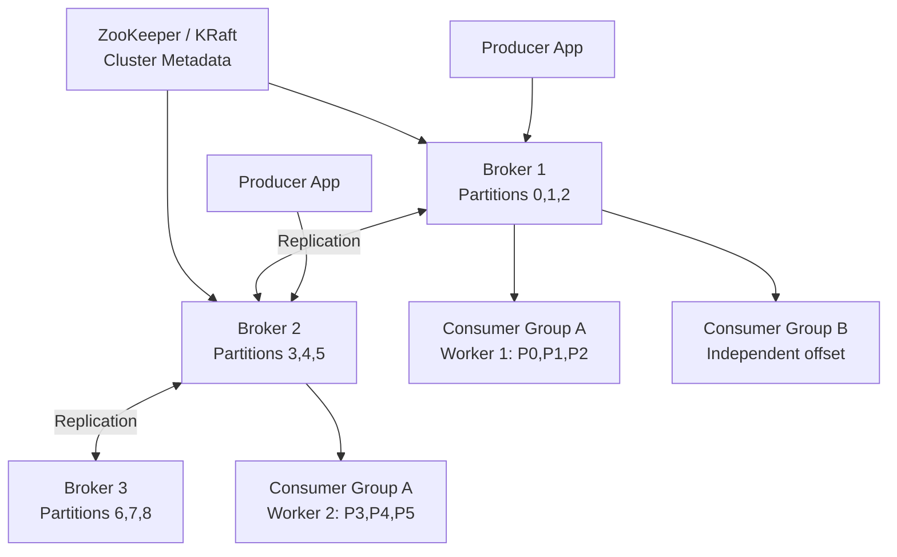

# Design a Distributed Messaging System (Kafka)

**Difficulty**: 🔴 Advanced
**Reading Time**: Coming Soon
**Interview Frequency**: High

---

> 🚧 **Full article coming soon.** This stub gives you the essentials to start thinking about this problem.

---

## The Core Problem

Processing 1 million messages per second with ordering guarantees and at-least-once delivery across horizontal scale requires a fundamentally different model than traditional message queues — consumers must be able to replay messages from arbitrary offsets, multiple independent consumer groups must read the same stream without interference, and partitions must fail independently.

## Functional Requirements

- Producers publish messages to named topics
- Consumers subscribe to topics and read messages in order
- Support multiple independent consumer groups per topic
- Retain messages for configurable period (e.g., 7 days)
- At-least-once delivery with consumer-managed offsets

## Non-Functional Requirements

| Requirement | Target |
|-------------|--------|
| Throughput | 1M messages/sec write, 10M messages/sec read |
| Latency | p99 < 10ms end-to-end |
| Durability | Replicated to 3 brokers (tolerate 1 failure) |
| Retention | 7-day message replay window |

## Back-of-Envelope Estimates

- **Storage**: 1M msgs/sec × 1KB avg × 7 days × 86,400 sec = ~600TB for 7-day retention
- **Partitions**: 1M msgs/sec ÷ 100K msgs/sec per partition = 10 partitions minimum; use 100 for headroom
- **Replication traffic**: 1M msgs/sec write × 2 replicas = 2M msgs/sec replication bandwidth

## Key Design Decisions

1. **Log-Structured Storage** — messages appended to immutable log segments per partition; consumers read sequentially using offsets; sequential I/O is 100x faster than random reads; old segments deleted by retention policy.
2. **Partition Strategy** — partition by key for ordering guarantees (all events for user_id go to same partition); random partitioning for throughput without ordering requirement; number of partitions limits consumer parallelism.
3. **Consumer Group Rebalancing** — when a consumer joins/leaves, partition assignment rebalances across group; during rebalance, consumption pauses; minimize rebalances by using static group membership for long-running consumers.

## High-Level Architecture

## Top Interview Questions for This Problem

| Question | Tests |
|----------|-------|
| How does Kafka guarantee message ordering within a partition but not across partitions? | Partition model, ordering guarantees |
| What happens when a consumer in a consumer group dies mid-processing? | Offset management, rebalancing |
| How do you implement exactly-once semantics in Kafka? | Idempotent producer, transactions |

## Related Concepts

- [Ad click aggregation using Kafka + Flink](../01-data-processing/ad-click-aggregation)
- [Distributed tracing using Kafka for event pipeline](./distributed-tracing)

---

*📚 Full deep-dive with multiple approaches, trade-off tables, and pseudocode coming soon.*
