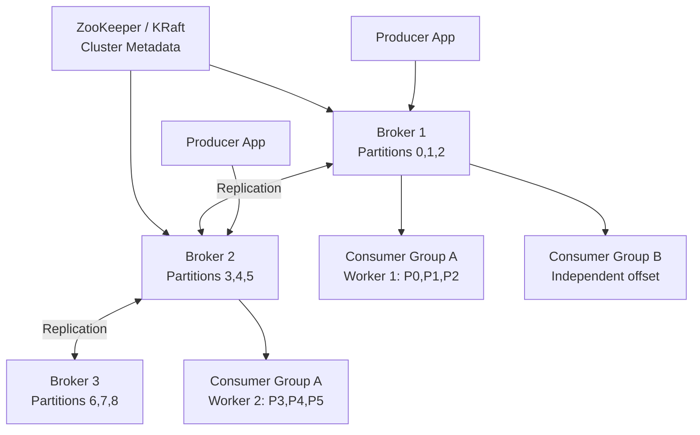
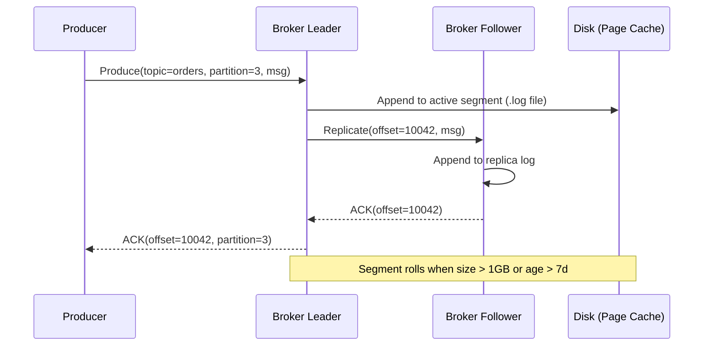
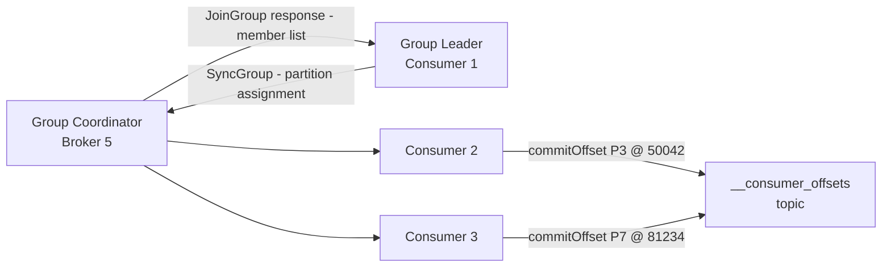

# Design a Distributed Messaging System (Kafka)

**Difficulty**: 🔴 Advanced
**Reading Time**: Coming Soon
**Interview Frequency**: High

---

## The Core Problem

Processing 1 million messages per second with ordering guarantees and at-least-once delivery across horizontal scale requires a fundamentally different model than traditional message queues — consumers must be able to replay messages from arbitrary offsets, multiple independent consumer groups must read the same stream without interference, and partitions must fail independently.

## Functional Requirements

- Producers publish messages to named topics
- Consumers subscribe to topics and read messages in order
- Support multiple independent consumer groups per topic
- Retain messages for configurable period (e.g., 7 days)
- At-least-once delivery with consumer-managed offsets

## Non-Functional Requirements

| Requirement | Target |
|-------------|--------|
| Throughput | 1M messages/sec write, 10M messages/sec read |
| Latency | p99 < 10ms end-to-end |
| Durability | Replicated to 3 brokers (tolerate 1 failure) |
| Retention | 7-day message replay window |

## Back-of-Envelope Estimates

- **Storage**: 1M msgs/sec × 1KB avg × 7 days × 86,400 sec = ~600TB for 7-day retention
- **Partitions**: 1M msgs/sec ÷ 100K msgs/sec per partition = 10 partitions minimum; use 100 for headroom
- **Replication traffic**: 1M msgs/sec write × 2 replicas = 2M msgs/sec replication bandwidth

## Key Design Decisions

1. **Log-Structured Storage** — messages appended to immutable log segments per partition; consumers read sequentially using offsets; sequential I/O is 100x faster than random reads; old segments deleted by retention policy.
2. **Partition Strategy** — partition by key for ordering guarantees (all events for user_id go to same partition); random partitioning for throughput without ordering requirement; number of partitions limits consumer parallelism.
3. **Consumer Group Rebalancing** — when a consumer joins/leaves, partition assignment rebalances across group; during rebalance, consumption pauses; minimize rebalances by using static group membership for long-running consumers.

## High-Level Architecture



## Top Interview Questions for This Problem

| Question | Tests |
|----------|-------|
| How does Kafka guarantee message ordering within a partition but not across partitions? | Partition model, ordering guarantees |
| What happens when a consumer in a consumer group dies mid-processing? | Offset management, rebalancing |
| How do you implement exactly-once semantics in Kafka? | Idempotent producer, transactions |

## Related Concepts

- [Ad click aggregation using Kafka + Flink](../01-data-processing/ad-click-aggregation)
- [Distributed tracing using Kafka for event pipeline](./distributed-tracing)

---

## Component Deep Dive 1: Log-Structured Partition Storage

The partition log is the single most critical component in a distributed messaging system. Every throughput claim, every ordering guarantee, and every replayability feature traces back to how the partition log physically stores and retrieves data.

### How It Works Internally

Each partition is an ordered, immutable, append-only sequence of records stored on disk. Physically, a partition is a directory containing multiple **segment files**. A segment is a pair of files: a `.log` file holding the raw message bytes and an `.index` file holding sparse offset-to-byte-position mappings.

When a producer sends a message, the broker appends it to the **active segment** — the most recently created segment file — using a single `write()` syscall. The OS page cache absorbs most writes, making them sub-millisecond. The broker doesn't `fsync()` after each message by default; instead, it relies on replication for durability. This is the key throughput insight: sequential writes to page cache are orders of magnitude faster than random disk writes.

When a consumer fetches messages, the broker uses the `.index` file to find the approximate byte position for the requested start offset, then performs a **zero-copy transfer** via the `sendfile()` syscall: data travels directly from page cache to the network socket without copying through user space. A single broker can sustain 600 MB/s read throughput using this technique.

Old segments beyond the retention window (time-based: 7 days, or size-based: 1TB per partition) are deleted by a background cleaner thread. For compacted topics (e.g., changelog topics), the cleaner instead merges segments to keep only the latest record per key.

### Why Naive Approaches Fail at Scale

A traditional message queue backed by a relational database (e.g., `SELECT … WHERE consumed = false LIMIT 100`) hits a wall at ~10K messages/sec. The problem: every consume operation is a random read followed by a write (`UPDATE messages SET consumed = true`). At 1M msg/sec, this generates 1M random disk seeks per second — mechanically impossible on spinning disks and expensive even on SSDs.

A naive in-memory queue (Redis LIST) loses durability on restart. A simple file-per-message approach (like old mail spools) causes filesystem inode exhaustion and slow directory listings at billions of files.

### Partition Log Internals



### Storage Implementation Trade-offs

| Approach | Latency (p99) | Throughput | Trade-off |
|----------|---------------|------------|-----------|
| Page cache + sequential write (Kafka default) | < 2ms | 600 MB/s per broker | Lose unflushed data if OS crashes before replication; mitigated by RF=3 |
| fsync per batch (acks=all + flush.ms=0) | 5–15ms | 100 MB/s per broker | Full durability; 6x throughput penalty |
| Memory-mapped files (LMDB style) | < 1ms | 400 MB/s | Complex crash recovery; good for low-latency, moderate-throughput use cases |

---

## Component Deep Dive 2: Consumer Group Protocol and Offset Management

Consumer groups are what make Kafka horizontally scalable on the read side. Without this abstraction, every consumer would either compete for the same messages (queue semantics) or each receive all messages (fan-out). Consumer groups give you **partitioned parallelism with independent replay**.

### Internal Mechanics

A consumer group is identified by a `group.id` string. Kafka maintains a **Group Coordinator** — a specific broker elected to manage that group's membership and offsets. Internally, offsets are stored in a special compacted topic: `__consumer_offsets` (50 partitions by default), keyed by `(group_id, topic, partition)`.

**Join/Sync Protocol (Rebalance)**:
1. Each consumer sends a `JoinGroup` request to the Group Coordinator.
2. One consumer is elected **Group Leader** (not the same as partition leader).
3. The Group Leader receives the full member list and runs the partition assignment algorithm (Range, RoundRobin, Sticky, or CooperativeSticky).
4. The Group Leader sends the assignment back via `SyncGroup`.
5. All consumers receive their assigned partitions and begin fetching.

**Offset Commit Strategies**:
- **Auto-commit** (default): consumer commits offsets every `auto.commit.interval.ms` (5 seconds). Risk: crash between commit and processing causes duplicate delivery.
- **Manual sync commit**: `commitSync()` after processing each batch. Slowest; blocks until broker ACKs commit.
- **Manual async commit**: `commitAsync()` with callback. Fast; risk of out-of-order commit on retry.

### Scale Behavior at 10x Load

At baseline (1M msg/sec, 100 partitions, 10 consumers per group), each consumer handles 10 partitions. At 10x load (10M msg/sec), options are:
1. **Add partitions**: increase from 100 to 1000. Problem: partitions cannot be decreased; changing partition count breaks ordering for key-based partitioning already in flight.
2. **Add consumers**: scale consumer group from 10 to 100 workers. Triggers a full rebalance (60–120 second pause with eager protocol; 5–10 seconds with CooperativeSticky).
3. **Increase fetch size**: raise `max.partition.fetch.bytes` from 1MB to 10MB. Reduces round trips but increases consumer memory pressure.



---

## Component Deep Dive 3: Replication and Leader Election

Replication is what transforms a fast single-node log into a fault-tolerant distributed system. Kafka uses a **leader-follower** model per partition, not a consensus protocol like Raft for the data path — this is a deliberate throughput trade-off.

### How Replication Works

Each partition has one **leader replica** and N-1 **follower replicas** (typically 2 followers for RF=3). Producers always write to the leader. Followers pull from the leader using the same consumer protocol. The leader maintains an **In-Sync Replica (ISR) list** — the set of replicas that have caught up within `replica.lag.time.max.ms` (10 seconds default).

A message is committed (visible to consumers) only when all ISR replicas have written it. This is why `acks=all` (wait for all ISR) provides the strongest durability: a committed message survives any single broker failure as long as at least one ISR member is alive.

**Leader election**: when a leader fails, the controller (one elected broker in the cluster, or the KRaft quorum) elects a new leader from the ISR. Only ISR members are eligible — this prevents data loss from electing an out-of-date replica. Election completes in ~30ms for KRaft (vs ~30 seconds for ZooKeeper-based elections).

### Minimum ISR Trap

A critical production configuration: `min.insync.replicas=2`. Without it, if 2 of 3 replicas fail, the ISR shrinks to 1 (just the leader), and `acks=all` still commits after only 1 replica writes — offering false durability. Setting `min.insync.replicas=2` causes the broker to reject produces when ISR falls below 2, making the unavailability explicit rather than silently weakening guarantees.

| Config | Durability | Availability | Use Case |
|--------|------------|--------------|----------|
| `acks=1, RF=3` | Medium (leader ACK only) | High | Log analytics, metrics |
| `acks=all, min.isr=1` | False strong (silent degradation) | High | Avoid in production |
| `acks=all, min.isr=2, RF=3` | Strong (survives 1 broker loss) | Medium | Payments, orders |

---

## Data Model

Kafka's on-disk record format (v2, introduced in 0.11) is a binary protocol optimized for batch compression and zero-copy reads.

```sql
-- Logical representation of Kafka's internal data structures

-- Topic metadata (stored in ZooKeeper / KRaft metadata log)
CREATE TABLE topic_metadata (
    topic_name         VARCHAR(255) NOT NULL,
    partition_count    INT NOT NULL DEFAULT 1,
    replication_factor INT NOT NULL DEFAULT 3,
    cleanup_policy     VARCHAR(20) DEFAULT 'delete',  -- 'delete' or 'compact'
    retention_ms       BIGINT DEFAULT 604800000,       -- 7 days in ms
    retention_bytes    BIGINT DEFAULT -1,              -- -1 = unlimited
    min_insync_replicas INT DEFAULT 2,
    PRIMARY KEY (topic_name)
);

-- Partition replica assignment
CREATE TABLE partition_assignment (
    topic_name     VARCHAR(255) NOT NULL,
    partition_id   INT NOT NULL,
    broker_id      INT NOT NULL,
    is_leader      BOOLEAN DEFAULT FALSE,
    is_in_sync     BOOLEAN DEFAULT TRUE,
    log_end_offset BIGINT DEFAULT 0,
    PRIMARY KEY (topic_name, partition_id, broker_id)
);

-- Consumer group offset tracking (maps to __consumer_offsets topic)
CREATE TABLE consumer_offsets (
    group_id        VARCHAR(255) NOT NULL,
    topic_name      VARCHAR(255) NOT NULL,
    partition_id    INT NOT NULL,
    committed_offset BIGINT NOT NULL,
    metadata        TEXT,           -- arbitrary consumer metadata string
    commit_timestamp BIGINT NOT NULL, -- epoch ms
    PRIMARY KEY (group_id, topic_name, partition_id)
);

-- On-disk Record Batch (binary format, pseudocode for readability)
-- Each segment file contains a sequence of RecordBatches
RECORD_BATCH {
    base_offset:           INT64,   -- offset of first record in batch
    batch_length:          INT32,   -- total batch byte size
    partition_leader_epoch: INT32,
    magic:                 INT8 = 2,
    crc:                   INT32,   -- CRC32C of everything after this field
    attributes:            INT16,   -- compression codec, timestamp type, transactional, idempotent
    last_offset_delta:     INT32,   -- (last_offset - base_offset) within batch
    base_timestamp:        INT64,   -- epoch ms of first record
    max_timestamp:         INT64,   -- epoch ms of last record
    producer_id:           INT64,   -- for idempotent/transactional producers
    producer_epoch:        INT16,
    base_sequence:         INT32,   -- for deduplication
    records_count:         INT32,
    records:               RECORD[] -- variable length, compressed as a unit
}

RECORD {
    length:         VARINT,
    attributes:     INT8,
    timestamp_delta: VARINT,   -- delta from base_timestamp
    offset_delta:   VARINT,    -- delta from base_offset
    key_length:     VARINT,    -- -1 = null key
    key:            BYTES,     -- partition key (e.g., user_id as string)
    value_length:   VARINT,
    value:          BYTES,     -- message payload
    headers_count:  VARINT,
    headers:        HEADER[]   -- key-value pairs for routing/tracing metadata
}

HEADER {
    key:   VARCHAR,   -- e.g., "trace-id", "schema-version", "source-service"
    value: BYTES
}
```

**Key index file structure** (`.index` file — sparse, 8 bytes per entry):

```
[relative_offset: INT32][file_position: INT32]
-- Example: every 4096 bytes (configurable via index.interval.bytes)
-- Binary search to find nearest offset, then scan forward in .log file
```

---

## Scale Bottlenecks

| Traffic Level | Component That Breaks | Symptoms | Mitigation |
|---------------|----------------------|----------|------------|
| 10x baseline (10M msg/sec) | Partition count ceiling | Consumer lag grows; producers hit `max.block.ms` timeout | Increase partition count before the fact (no easy way to rebalance after); add brokers |
| 10x baseline | Network bandwidth | Brokers saturate 10Gbps NICs (~1.2 GB/s); replication competes with consumer reads | Separate replication NIC from client NIC; enable rack-aware replication to reduce cross-rack traffic |
| 100x baseline (100M msg/sec) | ZooKeeper metadata throughput | Controller storm; 30-second leader elections; cluster goes unavailable | Migrate to KRaft (ZooKeeper-free mode); KRaft handles 1M+ partitions vs ZooKeeper's ~200K limit |
| 100x baseline | Page cache thrash | Consumers reading 7-day-old data evict hot producer data from OS cache; write latency spikes from sub-ms to 50ms+ | Tiered storage (Confluent, AWS MSK): move cold data to S3; keep only hot data in broker page cache |
| 1000x baseline (1B msg/sec) | Single cluster topology | No single cluster handles 1B msg/sec; operational complexity explodes | Mirror Maker 2 / Cluster Linking for geo-distributed active-active clusters; each cluster handles a region; global topic routing via service mesh |
| Any level | Consumer group rebalance storms | 60–120 second processing pause; lag spikes; downstream SLA breach | Use CooperativeSticky assignor (incremental rebalance, only moves changing partitions); static group membership (`group.instance.id`) eliminates join/leave rebalances for predictable deployments |

---

## How LinkedIn Built This

LinkedIn created Kafka in 2010 to solve a problem no existing tool could: unified, replayable, high-throughput activity stream processing across 300+ million professional profiles.

**The original problem**: LinkedIn's activity data (profile views, job clicks, connection requests, search queries) was flowing through a patchwork of point-to-point pipelines. Each analytics system had its own custom feed. Adding a new consumer meant a new ETL pipeline. The system produced ~1 billion events per day but couldn't replay historical data, and adding a new analytics consumer took weeks.

**Technology choices**:
- Chose sequential log over B-tree (like most databases use) because sequential reads are 6,000x faster on HDDs than random reads.
- Chose pull-based consumers over push-based delivery to give consumers full control of their own throughput — if a consumer falls behind, it applies back-pressure naturally without broker complexity.
- Chose broker-managed retention over consumer-managed deletion — messages stay until the retention window expires, not until consumers confirm processing. This enables replay without coordination.

**Specific numbers from LinkedIn's engineering blog (2019)**:
- 7 trillion messages per day across all LinkedIn deployments (~81 million msg/sec average, with peaks of 500 million msg/sec)
- 110 clusters globally
- Over 4,400 brokers
- More than 2 million partitions
- p99 produce latency: under 5ms end-to-end

**The non-obvious decision**: LinkedIn chose **pull-based** consumption instead of the push-based model used by traditional message brokers (ActiveMQ, RabbitMQ). Push-based brokers must track each consumer's state and manage back-pressure per consumer — this becomes the bottleneck at 100k+ consumers. With pull, each consumer polls at its own pace; the broker is stateless with respect to consumer progress. Offset state is minimal and stored in a compacted topic, not in the broker's hot path.

**Source**: [LinkedIn Engineering — Apache Kafka at LinkedIn](https://engineering.linkedin.com/blog/2019/apache-kafka-trillion-messages), Jay Kreps' original [The Log post](https://engineering.linkedin.com/distributed-systems/log-what-every-software-engineer-should-know-about-real-time-datas-unifying).

---

## Interview Angle

**What the interviewer is testing**: Whether you understand the fundamental trade-off between throughput and ordering — and specifically why Kafka provides per-partition ordering rather than global ordering. This tests your mental model of distributed systems constraints.

**Common mistakes candidates make**:

1. **Proposing global ordering across all partitions**: Candidates say "we need total ordering, so use one partition." One partition means one producer write path and one consumer — you've eliminated all horizontal scale. The correct answer is: partition by the entity requiring ordering (e.g., `user_id`, `order_id`) so all events for that entity land in the same partition, giving you per-entity ordering at full parallelism.

2. **Conflating acks=1 with durability**: Candidates say "`acks=1` is fine because we replicate to 3 brokers." `acks=1` means the leader ACKs before followers replicate. If the leader crashes after ACKing but before replication, that message is lost. For financial or order data, `acks=all` with `min.insync.replicas=2` is required.

3. **Ignoring the rebalance problem for consumer scaling**: Candidates say "just add more consumers to scale read throughput." They miss that adding a consumer triggers a rebalance that pauses all consumption in the group for 30–120 seconds with the default eager protocol. The correct answer includes mentioning CooperativeSticky assignor, pre-provisioning consumers, or using Kafka Streams with static membership.

**The insight that separates good from great answers**: Kafka's performance comes from treating the network layer and disk layer as a single pipeline via zero-copy I/O (`sendfile` syscall). Data written by the OS kernel to disk (page cache) is transferred directly to the network socket without ever copying into user-space memory. This is why a single broker can sustain 600 MB/s read throughput — it's bounded by NIC speed, not CPU or memory bandwidth. Candidates who can explain this show they understand why Kafka's architecture is fundamentally different from a database-backed queue.

---

## Key Numbers to Remember

| Metric | Value | Context |
|--------|-------|---------|
| Single broker write throughput | 600 MB/s | Sequential writes to page cache via zero-copy |
| Partition throughput ceiling | 100K msgs/sec | Rule of thumb; depends on message size and broker hardware |
| Minimum partitions for 1M msg/sec | 10 (use 100) | 10 is the math; 100 gives headroom for consumer parallelism |
| 7-day retention storage | ~600 TB | 1M msgs/sec × 1KB × 86,400s × 7 days |
| Replication bandwidth multiplier | 2x write throughput | Each message replicated to 2 additional followers (RF=3) |
| Consumer rebalance pause (eager) | 60–120 seconds | Full stop-the-world reassignment with default RangeAssignor |
| Consumer rebalance pause (CooperativeSticky) | 5–10 seconds | Incremental; only moving partitions are paused |
| KRaft leader election time | ~30ms | vs ~30 seconds for ZooKeeper-based election |
| LinkedIn peak throughput | 500M msgs/sec | Across 110 clusters, 4,400 brokers (2019 numbers) |
| Max partitions per ZooKeeper cluster | ~200K | Hard practical limit before metadata operations degrade |
| Max partitions per KRaft cluster | 1M+ | KRaft removes the ZooKeeper bottleneck |
| `__consumer_offsets` partitions | 50 | Default; determines consumer group coordinator distribution |

---

*📚 Full deep-dive with multiple approaches, trade-off tables, and pseudocode coming soon.*

## 📚 Resources & References

| Resource | Type | What You'll Learn |
|----------|------|------------------|
| [System Design Interview Vol 2 — Alex Xu](https://www.amazon.com/System-Design-Interview-Insiders-Guide/dp/1736049119) | 📚 Book | Chapter on designing a distributed message queue |
| [ByteByteGo — Design a Message Queue](https://www.youtube.com/@ByteByteGo) | 📺 YouTube | Search "message queue design" — partitioning, consumer groups, ordering guarantees |
| [Apache Kafka Architecture Deep Dive](https://developer.confluent.io/learn-kafka/apache-kafka/get-started/) | 📚 Docs | How Kafka achieves 1M+ msgs/sec per broker with log-structured storage |
| [LinkedIn Engineering: Kafka Origins](https://engineering.linkedin.com/blog/2016/04/kafka-ecosystem-at-linkedin) | 📖 Blog | Why LinkedIn built Kafka and how it evolved to handle 7 trillion messages/day |
| [Uber Engineering: Kafka at Scale](https://eng.uber.com/kafka/) | 📖 Blog | Uber's Kafka deployment handling 1T+ messages per day |
