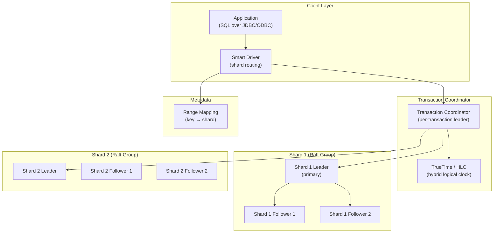
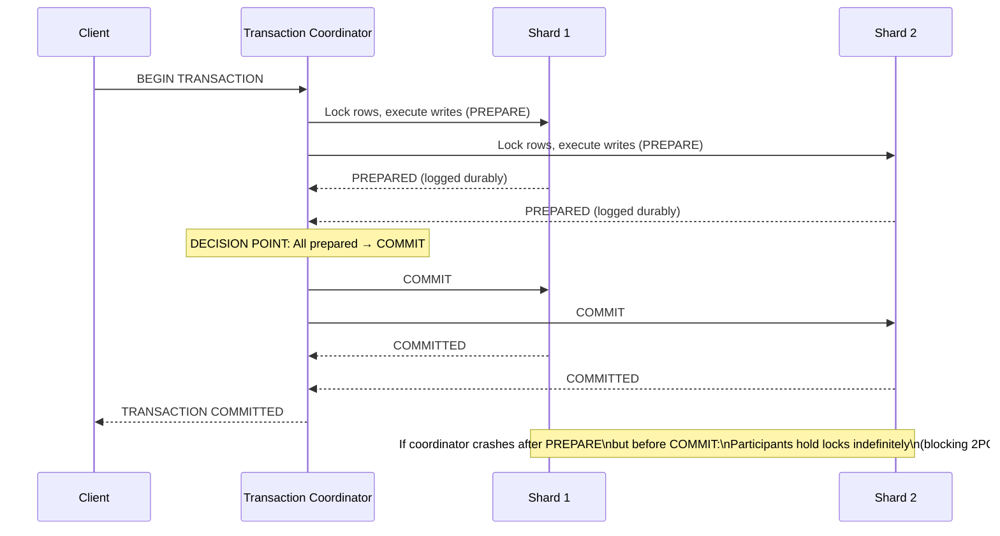

# Design a Distributed OLTP Database — ACID Across Shards, < 10ms P99

**Difficulty**: 🔴 Advanced
**Reading Time**: 32 minutes
**Interview Frequency**: High — asked at database companies, fintech, and senior-level distributed systems interviews

---

## Problem Statement

You are asked to design a distributed OLTP database that:

- **Works at**: Single-node PostgreSQL — ACID transactions are trivial, handled by the kernel and write-ahead log.
- **Breaks at**: 100M transactions/day across 100 shards — distributed transactions require coordinating across multiple nodes; 2-phase commit (2PC) is blocking (coordinator failure stalls transactions); clock skew between nodes makes "serializable" impossible without special mechanisms; a hot shard (celebrity account) causes 10× load imbalance.

Target: **ACID transactions across shards**, **< 10ms p99 latency**, **1M transactions/second**, **global strong consistency**, comparable to Google Spanner.

---

## Requirements

### Functional Requirements

| Requirement | Description |
|-------------|-------------|
| ACID Transactions | Atomicity, Consistency, Isolation, Durability across shards |
| SQL Interface | Standard SQL with JOINs, secondary indexes |
| Horizontal Sharding | Automatic range or hash sharding |
| Read-Your-Writes | Client always reads its own committed writes |
| Cross-Shard Transactions | Multi-row, multi-table atomic updates |
| Secondary Indexes | Efficient non-primary-key lookups |

### Non-Functional Requirements

| Requirement | Target |
|-------------|--------|
| Write Latency | < 5 ms p50, < 10 ms p99 |
| Read Latency | < 2 ms p50 (local replica) |
| Throughput | 1M transactions/second (cluster-wide) |
| Availability | 99.999% (< 5 min/year) |
| Consistency | Serializable (strongest isolation) |
| Replication Factor | 3× (1 primary + 2 replicas per shard) |

---

## Capacity Estimates

- **1M transactions/sec × 5 ms avg** = **5,000 concurrent transactions**
- **100 shards** → 10,000 transactions/second/shard → manageable per-node
- **2PC coordination overhead**: 2 round trips × 5 ms each = **10 ms added latency** → right at our p99 budget
- **Write-ahead log**: 1M tx/sec × 500 bytes avg = **500 MB/s** write throughput, replicated 3× = 1.5 GB/s total
- **Data size**: 1 TB per shard × 100 shards = **100 TB** total

---

## High-Level Architecture

---

## Level 1 — Surface: Why Distributed ACID is Hard

Single-node ACID: Atomicity via write-ahead log. Isolation via lock manager. All in one process — easy.

Distributed ACID: Transaction touches rows on Shard 1 and Shard 2.

**Problem 1 — Atomicity**: How do you ensure either both shards commit or both abort? → 2-Phase Commit (2PC).

**Problem 2 — Isolation**: How do you prevent a read on Shard 1 from seeing partial writes from an in-progress transaction that has committed to Shard 1 but not yet to Shard 2? → MVCC + consistent snapshot timestamp.

**Problem 3 — Ordering**: How do you define "happens before" when clocks on different servers differ by 100–500 µs? → Logical clocks (HLC) or atomic clocks (TrueTime).

---

## Level 2 — Deep Dive: 2-Phase Commit (2PC)

**2PC blocking problem**: If coordinator crashes after sending PREPARE but before COMMIT, all participants are locked in PREPARED state. They cannot commit (might violate atomicity) or abort (coordinator might have decided COMMIT). They block until coordinator recovers.

**Solutions**:
1. **Paxos Commit** (Spanner): Use a Paxos group as coordinator — coordinator can fail and be replaced. No blocking.
2. **3-Phase Commit (3PC)**: Add a "pre-commit" phase. Complex and still not perfect under network partitions.
3. **Saga pattern**: Split into compensating transactions. Eventual consistency, not ACID.

### MVCC for Isolation

Multi-Version Concurrency Control (MVCC) keeps multiple versions of each row:

- Each write creates a new version with a commit timestamp
- Reads use a snapshot timestamp — they see all versions committed before their timestamp
- No read-write conflicts: readers don't block writers, writers don't block readers
- Old versions garbage-collected after the oldest active transaction timestamp

### Hybrid Logical Clocks (HLC)

Physical clocks drift. NTP synchronizes to ±100ms (not ±10µs). Without synchronized clocks, we can't determine if transaction A happened before transaction B.

**HLC** = max(physical time, logical time + 1). Each message carries sender's HLC. Receiver advances to max(own HLC, received HLC). Guarantees causality: if event A causes event B, HLC(A) < HLC(B).

**Spanner's TrueTime**: Google uses GPS + atomic clocks to give time with bounded uncertainty ε (typically 7ms). A transaction waits ε before committing to ensure its timestamp is in the past for all nodes. This gives external consistency (real-world order = database order).

---

## Key Design Decisions

### 1. Optimistic vs. Pessimistic Concurrency

| Approach | Lock on Read? | Conflict Detection | Best For |
|----------|--------------|-------------------|----------|
| **Pessimistic (2PL)** | Yes | At lock time | High contention, short transactions |
| **Optimistic (OCC)** | No | At commit time | Low contention, read-heavy |
| **MVCC** | No | At commit time (version check) | Mixed workloads (most OLTP) |

CockroachDB uses **serializable snapshot isolation (SSI)** — MVCC with additional conflict detection for write skew anomalies (two transactions read overlapping data and each writes based on what the other read).

### 2. Range vs. Hash Sharding

| Sharding | Range Queries | Hot Spot Risk | Rebalancing |
|----------|--------------|---------------|-------------|
| **Hash** | Full scatter-gather | Low (random distribution) | Difficult (must re-hash) |
| **Range** | Efficient | High (sequential keys) | Easy (split/merge ranges) |
| **Hybrid** | Medium | Low | Medium |

Spanner and CockroachDB use **range sharding** with automatic split/merge: when a range grows beyond 64 MB, it splits. Hot ranges are automatically load-balanced by moving range leaders.

---

## Interview Questions

| Question | What They're Testing | Key Answer Points |
|----------|---------------------|-------------------|
| What is the 2PC blocking problem and how does Spanner solve it? | Distributed transactions depth | Coordinator crash leaves participants blocked; Spanner uses Paxos group as coordinator — coordinator leadership transfers on crash, no blocking |
| How does MVCC achieve isolation without locking readers? | Concurrency control | Each write creates new version with timestamp; reads use snapshot timestamp, see only versions before snapshot; no lock contention between readers and writers |
| Why is serializable isolation expensive in distributed systems? | Performance vs. correctness | Every cross-shard transaction needs 2+ RTTs for 2PC + conflict checking; Spanner commits 1M writes/sec but at 5–50ms latency; most systems default to read-committed or snapshot isolation for better performance |

---

## 📚 Resources & References

| Resource | Type | What You'll Learn |
|----------|------|------------------|
| [Google Spanner Paper](https://research.google/pubs/pub39966/) | 📖 Blog | TrueTime, Paxos-based 2PC, external consistency, global scale |
| [Designing Data-Intensive Applications](https://www.oreilly.com/library/view/designing-data-intensive-applications/9781491903063/) | 📚 Book | Chapter 7: transactions, Chapter 9: consistency — essential reading |
| [CockroachDB Architecture Docs](https://www.cockroachlabs.com/docs/stable/architecture/overview) | 📚 Docs | Open-source Spanner clone, HLC, range-based sharding |
| [ByteByteGo YouTube](https://www.youtube.com/@ByteByteGo) | 📺 YouTube | Distributed database transactions explained visually |

---

## Related Concepts

- [Distributed Locking](./distributed-locking) — 2PC uses distributed locks on participants
- [Key-Value Store](./key-value-store) — storage layer underlying most distributed databases
- [Wide-Column Database](./wide-column-database) — complementary NoSQL approach for different workloads
