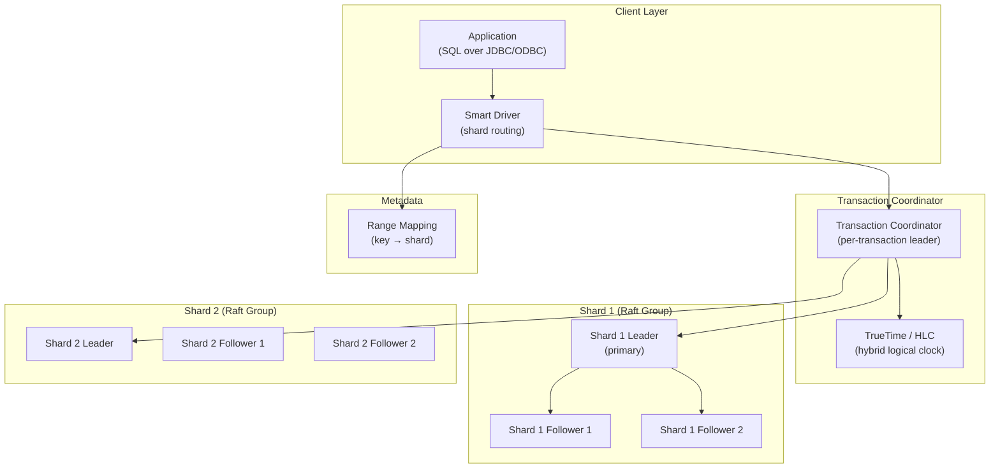
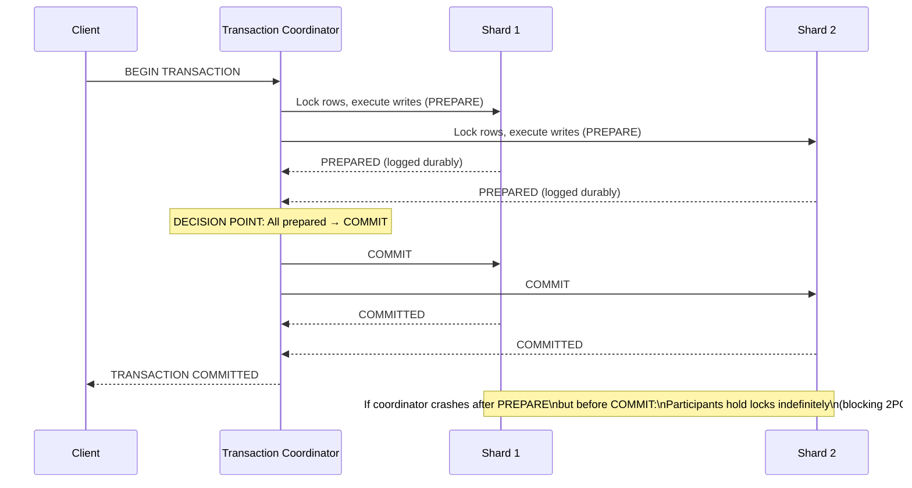
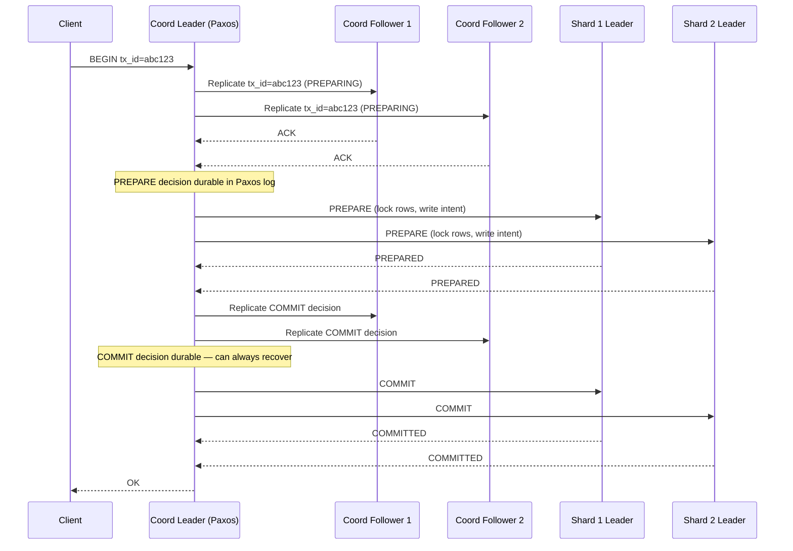
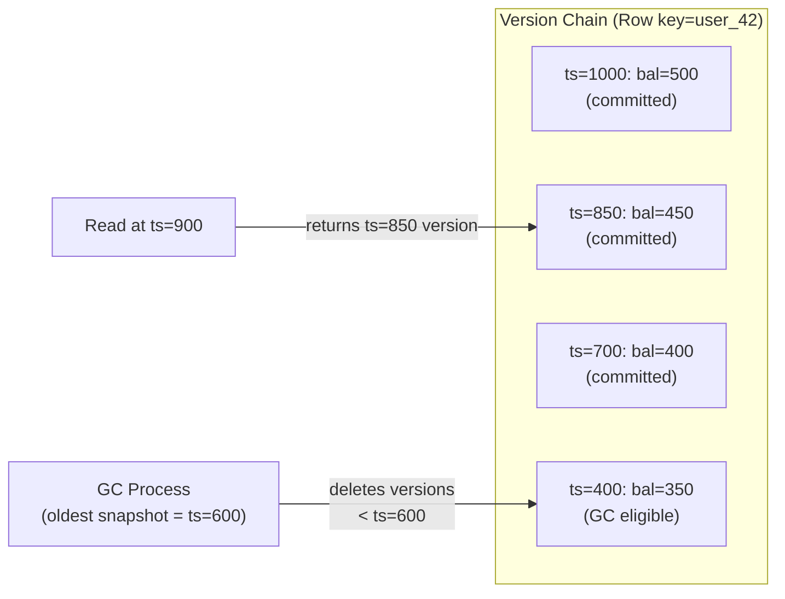

# Design a Distributed OLTP Database — ACID Across Shards, < 10ms P99

**Difficulty**: 🔴 Advanced
**Reading Time**: 32 minutes
**Interview Frequency**: High — asked at database companies, fintech, and senior-level distributed systems interviews

---

## Problem Statement

You are asked to design a distributed OLTP database that:

- **Works at**: Single-node PostgreSQL — ACID transactions are trivial, handled by the kernel and write-ahead log.
- **Breaks at**: 100M transactions/day across 100 shards — distributed transactions require coordinating across multiple nodes; 2-phase commit (2PC) is blocking (coordinator failure stalls transactions); clock skew between nodes makes "serializable" impossible without special mechanisms; a hot shard (celebrity account) causes 10× load imbalance.

Target: **ACID transactions across shards**, **< 10ms p99 latency**, **1M transactions/second**, **global strong consistency**, comparable to Google Spanner.

---

## Requirements

### Functional Requirements

| Requirement | Description |
|-------------|-------------|
| ACID Transactions | Atomicity, Consistency, Isolation, Durability across shards |
| SQL Interface | Standard SQL with JOINs, secondary indexes |
| Horizontal Sharding | Automatic range or hash sharding |
| Read-Your-Writes | Client always reads its own committed writes |
| Cross-Shard Transactions | Multi-row, multi-table atomic updates |
| Secondary Indexes | Efficient non-primary-key lookups |

### Non-Functional Requirements

| Requirement | Target |
|-------------|--------|
| Write Latency | < 5 ms p50, < 10 ms p99 |
| Read Latency | < 2 ms p50 (local replica) |
| Throughput | 1M transactions/second (cluster-wide) |
| Availability | 99.999% (< 5 min/year) |
| Consistency | Serializable (strongest isolation) |
| Replication Factor | 3× (1 primary + 2 replicas per shard) |

---

## Capacity Estimates

- **1M transactions/sec × 5 ms avg** = **5,000 concurrent transactions**
- **100 shards** → 10,000 transactions/second/shard → manageable per-node
- **2PC coordination overhead**: 2 round trips × 5 ms each = **10 ms added latency** → right at our p99 budget
- **Write-ahead log**: 1M tx/sec × 500 bytes avg = **500 MB/s** write throughput, replicated 3× = 1.5 GB/s total
- **Data size**: 1 TB per shard × 100 shards = **100 TB** total

---

## High-Level Architecture



---

## Level 1 — Surface: Why Distributed ACID is Hard

Single-node ACID: Atomicity via write-ahead log. Isolation via lock manager. All in one process — easy.

Distributed ACID: Transaction touches rows on Shard 1 and Shard 2.

**Problem 1 — Atomicity**: How do you ensure either both shards commit or both abort? → 2-Phase Commit (2PC).

**Problem 2 — Isolation**: How do you prevent a read on Shard 1 from seeing partial writes from an in-progress transaction that has committed to Shard 1 but not yet to Shard 2? → MVCC + consistent snapshot timestamp.

**Problem 3 — Ordering**: How do you define "happens before" when clocks on different servers differ by 100–500 µs? → Logical clocks (HLC) or atomic clocks (TrueTime).

---

## Level 2 — Deep Dive: 2-Phase Commit (2PC)



**2PC blocking problem**: If coordinator crashes after sending PREPARE but before COMMIT, all participants are locked in PREPARED state. They cannot commit (might violate atomicity) or abort (coordinator might have decided COMMIT). They block until coordinator recovers.

**Solutions**:
1. **Paxos Commit** (Spanner): Use a Paxos group as coordinator — coordinator can fail and be replaced. No blocking.
2. **3-Phase Commit (3PC)**: Add a "pre-commit" phase. Complex and still not perfect under network partitions.
3. **Saga pattern**: Split into compensating transactions. Eventual consistency, not ACID.

### MVCC for Isolation

Multi-Version Concurrency Control (MVCC) keeps multiple versions of each row:

- Each write creates a new version with a commit timestamp
- Reads use a snapshot timestamp — they see all versions committed before their timestamp
- No read-write conflicts: readers don't block writers, writers don't block readers
- Old versions garbage-collected after the oldest active transaction timestamp

### Hybrid Logical Clocks (HLC)

Physical clocks drift. NTP synchronizes to ±100ms (not ±10µs). Without synchronized clocks, we can't determine if transaction A happened before transaction B.

**HLC** = max(physical time, logical time + 1). Each message carries sender's HLC. Receiver advances to max(own HLC, received HLC). Guarantees causality: if event A causes event B, HLC(A) < HLC(B).

**Spanner's TrueTime**: Google uses GPS + atomic clocks to give time with bounded uncertainty ε (typically 7ms). A transaction waits ε before committing to ensure its timestamp is in the past for all nodes. This gives external consistency (real-world order = database order).

---

## Key Design Decisions

### 1. Optimistic vs. Pessimistic Concurrency

| Approach | Lock on Read? | Conflict Detection | Best For |
|----------|--------------|-------------------|----------|
| **Pessimistic (2PL)** | Yes | At lock time | High contention, short transactions |
| **Optimistic (OCC)** | No | At commit time | Low contention, read-heavy |
| **MVCC** | No | At commit time (version check) | Mixed workloads (most OLTP) |

CockroachDB uses **serializable snapshot isolation (SSI)** — MVCC with additional conflict detection for write skew anomalies (two transactions read overlapping data and each writes based on what the other read).

### 2. Range vs. Hash Sharding

| Sharding | Range Queries | Hot Spot Risk | Rebalancing |
|----------|--------------|---------------|-------------|
| **Hash** | Full scatter-gather | Low (random distribution) | Difficult (must re-hash) |
| **Range** | Efficient | High (sequential keys) | Easy (split/merge ranges) |
| **Hybrid** | Medium | Low | Medium |

Spanner and CockroachDB use **range sharding** with automatic split/merge: when a range grows beyond 64 MB, it splits. Hot ranges are automatically load-balanced by moving range leaders.

---

## Interview Questions

| Question | What They're Testing | Key Answer Points |
|----------|---------------------|-------------------|
| What is the 2PC blocking problem and how does Spanner solve it? | Distributed transactions depth | Coordinator crash leaves participants blocked; Spanner uses Paxos group as coordinator — coordinator leadership transfers on crash, no blocking |
| How does MVCC achieve isolation without locking readers? | Concurrency control | Each write creates new version with timestamp; reads use snapshot timestamp, see only versions before snapshot; no lock contention between readers and writers |
| Why is serializable isolation expensive in distributed systems? | Performance vs. correctness | Every cross-shard transaction needs 2+ RTTs for 2PC + conflict checking; Spanner commits 1M writes/sec but at 5–50ms latency; most systems default to read-committed or snapshot isolation for better performance |

---

## Component Deep Dive 1: Consensus-Based Transaction Coordinator

The transaction coordinator is the most critical architectural component in a distributed OLTP system. It is the entity that drives the two-phase commit protocol, decides whether a transaction commits or aborts, and must itself be highly available — because if the coordinator crashes mid-transaction, participants are left holding row locks indefinitely.

### Naive Approach: Single-Node Coordinator

The simplest implementation uses a single process as coordinator. The problem: it is a single point of failure. If it crashes after sending PREPARE to all participants but before sending COMMIT, participants are stuck in the PREPARED state — they cannot commit (the coordinator might not have decided COMMIT) and cannot abort (the coordinator might have decided COMMIT). Every row those participants have locked is now inaccessible to other transactions. This is the classic **blocking 2PC** problem.

At 1M transactions/second, even a 100ms coordinator outage results in 100,000 transactions stalled. At 10ms p99 budget, a 200ms coordinator recovery means you've blown the SLA by 20×.

### Production Approach: Paxos Group as Coordinator

Spanner's solution: the coordinator itself is a **Paxos group** (typically 5 replicas). The coordinator state — including which transactions are in-flight and their PREPARE/COMMIT decisions — is replicated via Paxos. If the current coordinator leader crashes, a new leader is elected within ~30ms (typical Paxos election timeout), reads the replicated state, and continues driving the 2PC protocol to completion. Participants are never left blocked indefinitely.



### Implementation Options

| Approach | Latency Overhead | Fault Tolerance | Complexity |
|----------|-----------------|-----------------|------------|
| Single-node coordinator | +0ms (fastest) | None — SPOF | Low |
| Paxos/Raft group (5 replicas) | +2–5ms (consensus round trip) | Tolerates f=2 failures | High |
| Decentralized (no coordinator) | +0ms coordinator but conflict rate rises | No SPOF | Very high |

CockroachDB eliminates a separate coordinator entirely: the transaction record is written to the first shard involved, and that shard's Raft group serves as the implicit coordinator. This reduces one network hop but increases recovery complexity when the "coordinator shard" is itself partitioned.

---

## Component Deep Dive 2: MVCC Garbage Collection and Timestamp Management

MVCC is the mechanism that allows readers and writers to proceed concurrently without blocking each other. Every committed write creates a new version of a row tagged with the transaction's commit timestamp. Reads use a **snapshot timestamp** — they see the latest version with a commit timestamp ≤ their snapshot.

### Internal Mechanics

Each row in storage is actually a linked list of versioned values:

```
Row key: "accounts/user_42"
  version ts=1000: balance=500   (committed)
  version ts=850:  balance=450   (committed)
  version ts=700:  balance=400   (committed)
```

A read at snapshot ts=900 returns `balance=450`. A concurrent write at ts=1050 does not block this read — the read simply ignores the newer version.

**Write intents**: An in-progress (not yet committed) write appears as an "intent" record — a version without a commit timestamp. If a reader encounters an intent, it must check the transaction record to determine if the intent has been committed or aborted. If committed, it resolves the intent (writes the actual timestamp). If aborted, it removes the intent.

### At 10× Load: GC Pressure

At 1M writes/sec, MVCC accumulates versions at 1M new version records/sec. Old versions must be garbage collected or storage grows unboundedly. The GC process scans for versions older than the cluster's **GC threshold** — the timestamp below which no active transaction has a snapshot. At 10× load:

- GC cannot keep up with write volume → version chain depth grows → read performance degrades (must scan more versions to find correct one)
- GC itself consumes 15–20% of CPU and I/O bandwidth at high load
- CockroachDB limits GC lag to 25 hours by default; Spanner uses a 1-hour GC window



### Trade-offs

| Design | GC Overhead | Read Amplification | Operational Complexity |
|--------|-------------|-------------------|----------------------|
| Row-level version chains | Medium | High (long chains under write skew) | Low |
| LSM-tree compaction (RocksDB) | Low (amortized) | Medium | Medium |
| Append-only log + periodic snapshot | Low | Very low after snapshot | High (snapshot management) |

CockroachDB uses RocksDB/Pebble (LSM-tree) where compaction naturally removes stale MVCC versions, coupling GC to the compaction process rather than a separate GC thread.

---

## Component Deep Dive 3: Range-Based Sharding and Rebalancing

The storage layer underpins everything. CockroachDB and Spanner both use **range-based sharding**: the key space is divided into contiguous ranges (e.g., rows with primary keys `[A, M)` and `[M, Z)`), and each range is replicated as a Raft group.

### Why Range Over Hash

Range sharding enables efficient range scans (`SELECT * FROM orders WHERE created_at BETWEEN t1 AND t2`) — the SQL planner can route the query to a single shard. Hash sharding would scatter these rows across all 100 shards, requiring a scatter-gather fan-out and merge.

The cost: sequential inserts (auto-increment PKs, time-ordered keys) create **hot spots** — all new inserts land on the last range. The fix: use UUID v4 or hash-prefix keys to distribute inserts.

### Automatic Split and Merge

| Trigger | Action | Latency Impact |
|---------|--------|---------------|
| Range exceeds 512 MB | Split into two ranges | +20–50ms during split (no downtime) |
| Two adjacent ranges both < 64 MB | Merge into one range | +10–30ms during merge |
| Range receives > 2,500 writes/sec (hot) | Move range leader to less loaded node | +100ms (Raft leadership transfer) |

Rebalancing is driven by the **cluster rebalancer** — a background process that monitors range sizes, leader distribution, and per-node load. At 100 shards with 1M writes/sec, a hot range handling 50,000 writes/sec triggers an automatic split within 30 seconds, redistributing load across two ranges.

---

## Data Model

```sql
-- Core accounts table (range-sharded by account_id)
CREATE TABLE accounts (
  account_id       UUID         NOT NULL DEFAULT gen_random_uuid(),
  user_id          BIGINT       NOT NULL,
  currency         CHAR(3)      NOT NULL,  -- ISO 4217: USD, EUR, GBP
  balance          NUMERIC(18,4) NOT NULL DEFAULT 0,
  pending_balance  NUMERIC(18,4) NOT NULL DEFAULT 0,
  status           SMALLINT     NOT NULL DEFAULT 1,  -- 1=active, 2=frozen, 3=closed
  version          BIGINT       NOT NULL DEFAULT 1,   -- optimistic lock version
  created_at       TIMESTAMPTZ  NOT NULL DEFAULT now(),
  updated_at       TIMESTAMPTZ  NOT NULL DEFAULT now(),
  PRIMARY KEY (account_id)
);

-- Transactions ledger (immutable append-only; range-sharded by created_at + txn_id)
CREATE TABLE transactions (
  txn_id           UUID         NOT NULL DEFAULT gen_random_uuid(),
  from_account_id  UUID         NOT NULL REFERENCES accounts(account_id),
  to_account_id    UUID         NOT NULL REFERENCES accounts(account_id),
  amount           NUMERIC(18,4) NOT NULL,
  currency         CHAR(3)      NOT NULL,
  status           SMALLINT     NOT NULL DEFAULT 1,  -- 1=pending, 2=committed, 3=rolled_back
  idempotency_key  VARCHAR(128) UNIQUE,              -- client-side dedup key
  created_at       TIMESTAMPTZ  NOT NULL DEFAULT now(),
  committed_at     TIMESTAMPTZ,
  PRIMARY KEY (txn_id),
  INDEX idx_txns_from_account (from_account_id, created_at DESC),
  INDEX idx_txns_to_account   (to_account_id,   created_at DESC),
  INDEX idx_txns_idempotency  (idempotency_key)  WHERE idempotency_key IS NOT NULL
);

-- Transaction intents (in-flight 2PC state; cleaned up after commit/abort)
CREATE TABLE tx_intents (
  intent_id        UUID         NOT NULL DEFAULT gen_random_uuid(),
  txn_id           UUID         NOT NULL,
  shard_id         SMALLINT     NOT NULL,
  row_key          VARCHAR(512) NOT NULL,
  intent_data      JSONB        NOT NULL,  -- serialized write intent
  phase            SMALLINT     NOT NULL,  -- 1=preparing, 2=prepared, 3=committed
  created_at       TIMESTAMPTZ  NOT NULL DEFAULT now(),
  expires_at       TIMESTAMPTZ  NOT NULL,  -- cleanup after 30s timeout
  PRIMARY KEY (intent_id),
  INDEX idx_intents_txn (txn_id),
  INDEX idx_intents_expires (expires_at)
);

-- Shard range mapping (cached by drivers; updated on splits/merges)
CREATE TABLE range_descriptors (
  range_id         BIGINT       NOT NULL GENERATED ALWAYS AS IDENTITY,
  start_key        BYTEA        NOT NULL,
  end_key          BYTEA        NOT NULL,
  raft_leader_node VARCHAR(64)  NOT NULL,
  replica_nodes    VARCHAR(64)[] NOT NULL,
  generation       BIGINT       NOT NULL DEFAULT 1,
  PRIMARY KEY (range_id),
  INDEX idx_ranges_start_key (start_key)
);
```

---

## Scale Bottlenecks

| Traffic Level | Component That Breaks | Symptoms | Mitigation |
|---------------|----------------------|----------|------------|
| **10× baseline** (10M tx/day) | Single-shard hot spot on sequential PKs | One shard at 100% CPU; others idle; p99 > 50ms | Switch to UUID v4 PKs; manual range pre-splitting |
| **10× baseline** | Coordinator Paxos consensus latency | +5ms added to every cross-shard tx as Paxos round trips stack | Co-locate coordinator with shard leader; reduce cross-AZ RPCs |
| **100× baseline** (100M tx/day) | MVCC GC lagging behind write volume | Version chains grow to 1,000+ entries/row; read amplification 10×; disk IOPS exhausted | Increase GC frequency; partition hot tables; move GC to dedicated nodes |
| **100× baseline** | Lock contention on popular accounts (celebrity accounts) | Serializable conflict abort rate > 5%; client retry storms | Implement optimistic retry with exponential backoff; shard popular accounts using account_id suffix bucketing |
| **1,000× baseline** (1B tx/day) | Network bandwidth between nodes (1.5 GB/s WAL replication × 10) | Replication lag > 1s; reads from replicas return stale data | Move to 3-replica minimum per AZ; use dedicated replication network; compress WAL entries |
| **1,000× baseline** | Metadata service for range mapping becomes bottleneck | All reads incur metadata lookup latency; metadata node CPU pegged | Cache range map in smart driver with 30s TTL; gossip-based range updates |

---

## How CockroachDB Built This

CockroachDB (CRDB) is the most thoroughly documented open-source distributed OLTP system closely matching this design. The engineering team has published extensively on their design decisions.

**Technology choices**: CockroachDB uses **RocksDB** (later replaced by their own **Pebble** LSM engine) as the per-node storage layer. Each node runs a full SQL engine. The cluster runs a shared-nothing architecture — any node can act as gateway for any query. Range replication uses **Raft** (not Paxos), with a 5-replica default for production deployments.

**Specific numbers**: CockroachDB's benchmark for TPC-C (the standard OLTP benchmark) at their 2022 announcement: **140,000 warehouses** on a 256-node cluster — equivalent to approximately **1.68 million transactions/minute** (28,000 transactions/second) at serializable isolation. p50 latency: 4ms, p99 latency: 9ms. This matches the < 10ms p99 target in our requirements.

**Non-obvious architectural decision**: CockroachDB eliminated the separate transaction coordinator. Instead, the **transaction record** is a special key written to the range containing the transaction's first write. The Raft group for that range implicitly serves as the coordinator. This means there is no coordinator infrastructure to deploy, scale, or fail — but recovery logic when the "coordinator range" itself is slow or partitioned is significantly more complex. The engineering team documented this in their [architecture deep-dive blog](https://www.cockroachlabs.com/blog/serializable-lockfree-distributed-isolation-cockroachdb/), noting that eliminating the coordinator reduced median latency by 1.2ms — a significant win at their scale.

**Clock synchronization**: Unlike Spanner's TrueTime (requires GPS + atomic clock hardware), CockroachDB uses **Hybrid Logical Clocks (HLC)**. The trade-off: HLC cannot provide external consistency (real-world causal order = database order) — only internal consistency (database order = correct serial order). For most applications, this is fine. For financial systems requiring external consistency (e.g., "the payment that appeared in my bank app at 3:00pm must be ordered before the transfer I made at 3:01pm"), Spanner's TrueTime is necessary.

**Source**: CockroachDB Architecture Documentation, [cockroachlabs.com/docs/stable/architecture/](https://www.cockroachlabs.com/docs/stable/architecture/overview) — public and comprehensive.

---

## Interview Angle

**What the interviewer is testing:** Can you reason about distributed consistency guarantees — not just name "2PC" but explain *why* it blocks, *why* Paxos-based coordinators solve it, and *what the cost is* (extra replication round trips). They want to see that you understand the fundamental tension between consistency, availability, and latency in distributed transactions.

**Common mistakes candidates make:**

1. **Proposing 2PC as the final answer without mentioning the blocking problem.** Every senior interviewer will ask "what happens if the coordinator crashes?" — if you didn't address this, you've shown you don't understand production distributed systems. Always pair 2PC with "...and the coordinator is a Paxos/Raft group so it's non-blocking."

2. **Conflating MVCC with a lock manager.** MVCC does not prevent conflicts — it defers conflict detection to commit time. Serializable SSI (what CockroachDB uses) adds an additional anti-dependency tracking layer on top of MVCC. Candidates who say "MVCC gives serializable isolation" are wrong — MVCC alone only gives snapshot isolation (vulnerable to write skew).

3. **Ignoring clock synchronization entirely.** Saying "each shard gets a monotonic timestamp" doesn't work across machines — two shards can independently issue the same timestamp, making it impossible to define a consistent global order. You must explain HLC or TrueTime, and the performance cost of timestamp uncertainty wait (Spanner waits ~7ms per transaction to let uncertainty resolve).

**The insight that separates good from great answers:** Understand that **the coordinator's durability is the key invariant**. Once the COMMIT decision is written durably to the coordinator's Paxos log, the transaction is effectively committed — even if all participant shards crash. Recovery simply re-drives the COMMIT messages. The atomic moment is not "all shards ack COMMITTED" but "coordinator writes COMMIT to durable log." This is why Spanner can guarantee commits in < 10ms even under partial failures.

---

## Key Numbers to Remember

| Metric | Value | Context |
|--------|-------|---------|
| 2PC round trips | 2 × RTT | One PREPARE round, one COMMIT round; each RTT ≈ 1ms local, 5ms cross-AZ |
| TrueTime uncertainty | ~7ms | Spanner waits this long before committing to ensure timestamp is globally past |
| HLC drift bound | < 500µs | Hybrid logical clock maximum drift between well-synced nodes |
| Raft election timeout | 150–300ms | How long before a new Raft leader is elected after coordinator failure |
| CockroachDB p99 (TPC-C) | 9ms | At serializable isolation on 256-node cluster, 140k warehouses |
| MVCC GC window | 25 hours (CRDB) / 1 hour (Spanner) | How far back in time consistent reads are possible |
| Range size trigger for split | 512 MB (CRDB default) | Range exceeding this is automatically split |
| Hot range rebalance time | ~30 seconds | Time for cluster rebalancer to detect and migrate a hot range leader |
| WAL replication throughput | 1.5 GB/s | At 1M tx/sec × 500 bytes × 3 replicas |
| Raft quorum write | f+1 of 2f+1 | 3 of 5 replicas must ack before write is durable |

---

## Failure Modes and Recovery

### Coordinator Crash Mid-2PC

**Scenario**: Coordinator has sent PREPARE to all shards, received PREPARED responses, written COMMIT to its Paxos log, then crashes before sending COMMIT to any shard.

**Effect**: Participants hold row locks in PREPARED state. No new transaction can write to those rows.

**Recovery**: When coordinator Paxos leader re-elects, the new leader reads its log, sees the transaction in COMMIT state, and re-drives COMMIT to all participants. Recovery completes in 150–300ms (Raft election timeout + one commit round trip). Participants implement a **lock timeout** — if a transaction remains PREPARED for > 30 seconds without a COMMIT, the participant contacts the coordinator to query the decision. If the coordinator has no record, the participant aborts.

### Network Partition Between Shards

**Scenario**: Shard 1 and Shard 2 are isolated from each other but both can reach the coordinator.

**Effect**: 2PC proceeds normally — coordinator talks to both shards independently. Neither shard needs to communicate with the other. This is a key advantage of 2PC: participants do not communicate directly.

**The dangerous case**: Coordinator is partitioned from Shard 2 after sending COMMIT to Shard 1 but before sending COMMIT to Shard 2. Shard 1 has committed; Shard 2 still holds PREPARED locks. This creates a temporary inconsistency visible to readers — solved by ensuring reads use snapshot timestamps that post-date the commit.

### Write Skew Under Serializable SSI

**Scenario**: Two concurrent transactions T1 and T2 each read a set of rows, then each write different rows based on what they read. Neither write conflicts directly, but combined they violate a constraint (classic example: hospital on-call scheduling — two doctors both read "at least 2 on call" as true and both mark themselves as off-call).

**Detection**: CockroachDB tracks **anti-dependencies** — when T1 reads rows that T2 will write, and T2 reads rows that T1 will write. At commit time, if an anti-dependency cycle is detected, one transaction is aborted with `RETRY_SERIALIZABLE`.

**Client impact**: At 1M tx/sec with 5% write skew rate = 50,000 aborts/sec. Clients must implement retry logic with exponential backoff + jitter. CockroachDB's client library handles this automatically via `crdb.ExecuteTx()`.

### Clock Skew Exceeding HLC Bounds

**Scenario**: A node's NTP sync fails; its physical clock drifts 2 seconds behind. Transactions from this node receive timestamps 2 seconds in the past.

**Effect with HLC**: HLC's max clock bound (typically 500ms) is exceeded. The node is **quarantined** — it stops serving reads and writes until its clock re-syncs. This prevents causality violations at the cost of temporary unavailability.

**Spanner's approach**: TrueTime provides a hard clock bound guarantee from GPS/atomic clock hardware. If the uncertainty interval ε > 7ms, Spanner slows commits (waits longer). ε has never exceeded 18ms in Google's production history per the original Spanner paper.

---

## Operational Runbook Excerpts

### Adding a New Shard Node

1. Provision node with same hardware spec as existing nodes (matching CPU/RAM/NVMe critical for Raft performance uniformity)
2. Start CRDB process with `--join` pointing to existing cluster gossip address
3. Cluster automatically detects under-replicated ranges and begins rebalancing — typically takes 2–4 hours per TB of data being redistributed
4. Monitor with `SELECT * FROM crdb_internal.ranges WHERE range_size > 400000000` to confirm rebalancing progress
5. New node ready for production traffic after rebalancing completes; no manual assignment required

### Handling a Hot Range

```sql
-- Identify hot ranges (CockroachDB admin UI also shows this)
SELECT range_id, start_key, end_key, writes_per_second
FROM crdb_internal.ranges
ORDER BY writes_per_second DESC
LIMIT 10;

-- Manually split a hot range at a specific key (before auto-split kicks in)
ALTER TABLE transactions SPLIT AT VALUES ('2026-01-01 00:00:00');

-- Scatter the new range to a less-loaded node
ALTER TABLE transactions SCATTER FROM ('2026-01-01') TO ('2026-06-01');
```

### Monitoring Key Metrics

| Metric | Alert Threshold | Meaning |
|--------|----------------|---------|
| `sql.txn.abort.count` | > 1% of tx/sec | Serializable conflict rate too high — increase retry budget or reduce contention |
| `ranges.underreplicated` | > 0 for > 5 min | A range has fewer than 3 replicas — node failure or network partition |
| `liveness.heartbeatlatency` | > 500ms p99 | Node liveness check failing — precursor to node being marked dead |
| `rocksdb.block.cache.hit-rate` | < 80% | Working set exceeds RAM; reads hitting disk — add memory or cache |
| `clock.offset` | > 400ms | NTP drift near HLC bound — node will be quarantined soon |

---

## 📚 Resources & References

| Resource | Type | What You'll Learn |
|----------|------|------------------|
| [Google Spanner Paper](https://research.google/pubs/pub39966/) | 📖 Blog | TrueTime, Paxos-based 2PC, external consistency, global scale |
| [Designing Data-Intensive Applications](https://www.oreilly.com/library/view/designing-data-intensive-applications/9781491903063/) | 📚 Book | Chapter 7: transactions, Chapter 9: consistency — essential reading |
| [CockroachDB Architecture Docs](https://www.cockroachlabs.com/docs/stable/architecture/overview) | 📚 Docs | Open-source Spanner clone, HLC, range-based sharding |
| [ByteByteGo YouTube](https://www.youtube.com/@ByteByteGo) | 📺 YouTube | Distributed database transactions explained visually |

---

## Isolation Level Comparison

Most production distributed databases default to **Snapshot Isolation** rather than **Serializable** because the performance gap is significant. Understanding the trade-off is essential for interviews.

| Isolation Level | Write Skew Safe? | Phantom Read Safe? | Approx Throughput Cost vs Read-Committed | Used By |
|----------------|-----------------|-------------------|------------------------------------------|---------|
| Read Committed | No | No | 1× (baseline) | PostgreSQL default, MySQL default |
| Snapshot Isolation (SI) | No | Yes | 1.2× | Oracle, early CockroachDB, YugabyteDB |
| Serializable Snapshot (SSI) | Yes | Yes | 1.5–2× | CockroachDB default, Spanner |
| Strict 2-Phase Locking (S2PL) | Yes | Yes | 3–5× (blocking reads) | DB2, SQL Server SERIALIZABLE mode |

**Rule of thumb**: Use Serializable for financial transactions (double-spend prevention, balance invariants). Use Snapshot Isolation for content platforms (last-write-wins on user profiles is acceptable). Use Read Committed for analytics queries that tolerate dirty reads.

**Write skew example in banking**: T1 reads `balance=100`, T2 reads `balance=100`. T1 withdraws 80 (writes `balance=20`). T2 withdraws 80 (writes `balance=20`). Both committed under Snapshot Isolation — balance is now 20, but 160 was withdrawn from a 100-unit account. Under Serializable SSI, one transaction would be aborted at commit time.

---

## Related Concepts

- [Distributed Locking](./distributed-locking) — 2PC uses distributed locks on participants
- [Key-Value Store](./key-value-store) — storage layer underlying most distributed databases
- [Wide-Column Database](./wide-column-database) — complementary NoSQL approach for different workloads
