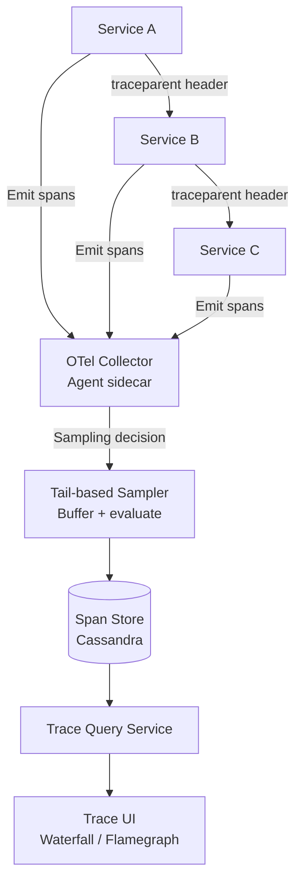

# Design a Distributed Tracing System (Zipkin/Jaeger)

**Difficulty**: 🔴 Advanced
**Reading Time**: Coming Soon
**Interview Frequency**: Medium

---

> 🚧 **Full article coming soon.** This stub gives you the essentials to start thinking about this problem.

---

## The Core Problem

Tracing 100 million requests per day across 500 microservices with under 1% overhead — if tracing adds 5ms to every request and p99 latency is 100ms, that's a 5% degradation just from instrumentation. The system must collect enough trace data to debug issues while discarding the majority of traces for cost and performance.

## Functional Requirements

- Instrument service calls to capture trace spans with timing
- Associate spans across services via propagated trace context (W3C TraceContext)
- Store and query traces by trace ID, service, error status, latency
- Visualize traces as waterfall or flamegraph
- Set sampling rates per service and globally

## Non-Functional Requirements

| Requirement | Target |
|-------------|--------|
| Instrumentation overhead | < 1ms per span, < 1% CPU overhead |
| Sampling rate | 0.1%–1% for normal traffic; 100% for errors |
| Query latency | Find trace by ID in < 500ms |
| Retention | 7 days hot storage; 30 days cold |

## Back-of-Envelope Estimates

- **Spans per request**: 100M requests/day × 10 spans avg = 1B spans/day
- **After sampling (1%)**: 1B × 1% = 10M spans/day stored → 10M × 1KB = 10GB/day
- **Trace storage (Cassandra)**: 10GB/day × 7 days = 70GB hot storage (easily manageable)

## Key Design Decisions

1. **Head-based vs Tail-based Sampling** — head-based: sampling decision made at first span (simple, low overhead, but can miss rare slow requests); tail-based: buffer all spans, make decision at trace completion based on latency/error outcome; tail-based catches the 1% slow traces you actually care about.
2. **W3C TraceContext Propagation** — propagate `traceparent` header through every service call; each service creates child span with parent_id linking to caller; HTTP and gRPC interceptors make this transparent to application code.
3. **Cassandra for Span Storage** — partition by (trace_id, service); TTL-based retention; supports point-lookup by trace_id in O(1); Cassandra's write throughput (10K writes/sec per node) handles 10M spans/day with a small cluster.

## High-Level Architecture

## Top Interview Questions for This Problem

| Question | Tests |
|----------|-------|
| What's the difference between head-based and tail-based sampling? | Sampling trade-offs, catch rare failures |
| How do you propagate trace context across async message queues? | Context propagation, W3C baggage |
| How would you find all traces for a specific user who reported a bug? | Search by attribute, indexing strategy |

## Related Concepts

- [Metrics and alerting system for complementary observability](./metrics-alerting)
- [Code deployment system where traces help verify deploys](./code-deployment)

---

*📚 Full deep-dive with multiple approaches, trade-off tables, and pseudocode coming soon.*

## 📚 Resources & References

| Resource | Type | What You'll Learn |
|----------|------|------------------|
| [ByteByteGo — Distributed Tracing System Design](https://www.youtube.com/@ByteByteGo) | 📺 YouTube | Search "distributed tracing design" — trace propagation, sampling, storage |
| [Google Dapper: Distributed Systems Tracing](https://research.google/pubs/pub36356/) | 📖 Blog | The foundational distributed tracing paper from Google |
| [Jaeger Architecture](https://www.jaegertracing.io/docs/1.6/architecture/) | 📚 Docs | OpenTracing-compatible distributed tracing with Cassandra storage |
| [OpenTelemetry: Vendor-Neutral Observability](https://opentelemetry.io/docs/concepts/) | 📚 Docs | The emerging standard for distributed tracing, metrics, and logs |
| [Uber Engineering: Jaeger Distributed Tracing](https://eng.uber.com/distributed-tracing/) | 📖 Blog | How Uber built and open-sourced Jaeger for microservices observability |
