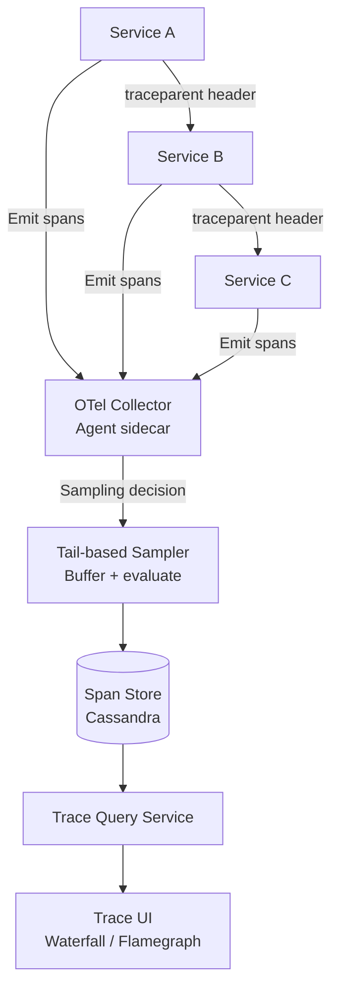
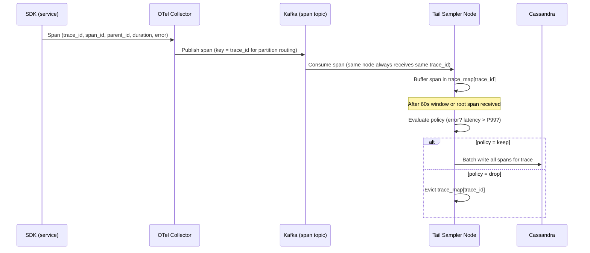
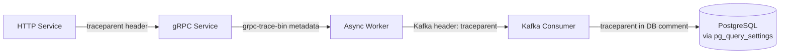
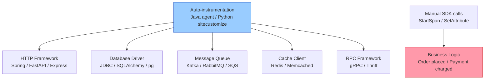
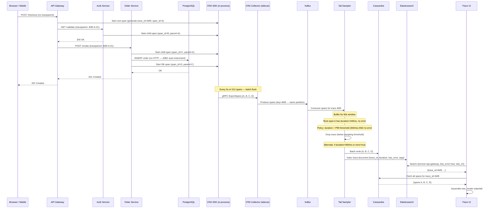

# Design a Distributed Tracing System (Zipkin/Jaeger)

**Difficulty**: 🔴 Advanced
**Reading Time**: Coming Soon
**Interview Frequency**: Medium

---

> 🚧 **Full article coming soon.** This stub gives you the essentials to start thinking about this problem.

---

## The Core Problem

Tracing 100 million requests per day across 500 microservices with under 1% overhead — if tracing adds 5ms to every request and p99 latency is 100ms, that's a 5% degradation just from instrumentation. The system must collect enough trace data to debug issues while discarding the majority of traces for cost and performance.

## Functional Requirements

- Instrument service calls to capture trace spans with timing
- Associate spans across services via propagated trace context (W3C TraceContext)
- Store and query traces by trace ID, service, error status, latency
- Visualize traces as waterfall or flamegraph
- Set sampling rates per service and globally

## Non-Functional Requirements

| Requirement | Target |
|-------------|--------|
| Instrumentation overhead | < 1ms per span, < 1% CPU overhead |
| Sampling rate | 0.1%–1% for normal traffic; 100% for errors |
| Query latency | Find trace by ID in < 500ms |
| Retention | 7 days hot storage; 30 days cold |

## Back-of-Envelope Estimates

- **Spans per request**: 100M requests/day × 10 spans avg = 1B spans/day
- **After sampling (1%)**: 1B × 1% = 10M spans/day stored → 10M × 1KB = 10GB/day
- **Trace storage (Cassandra)**: 10GB/day × 7 days = 70GB hot storage (easily manageable)

## Key Design Decisions

1. **Head-based vs Tail-based Sampling** — head-based: sampling decision made at first span (simple, low overhead, but can miss rare slow requests); tail-based: buffer all spans, make decision at trace completion based on latency/error outcome; tail-based catches the 1% slow traces you actually care about.
2. **W3C TraceContext Propagation** — propagate `traceparent` header through every service call; each service creates child span with parent_id linking to caller; HTTP and gRPC interceptors make this transparent to application code.
3. **Cassandra for Span Storage** — partition by (trace_id, service); TTL-based retention; supports point-lookup by trace_id in O(1); Cassandra's write throughput (10K writes/sec per node) handles 10M spans/day with a small cluster.

## High-Level Architecture



## Top Interview Questions for This Problem

| Question | Tests |
|----------|-------|
| What's the difference between head-based and tail-based sampling? | Sampling trade-offs, catch rare failures |
| How do you propagate trace context across async message queues? | Context propagation, W3C baggage |
| How would you find all traces for a specific user who reported a bug? | Search by attribute, indexing strategy |

## Related Concepts

- [Metrics and alerting system for complementary observability](./metrics-alerting)
- [Code deployment system where traces help verify deploys](./code-deployment)

---

## Component Deep Dive 1: Tail-Based Sampling Engine

The tail-based sampler is the most critical — and most misunderstood — component in a production tracing system. With head-based sampling you flip a coin at the root service: if the coin lands on "sample," every downstream span is emitted; if not, all spans are discarded immediately at the SDK level. This is cheap (zero buffering) but fundamentally broken for debugging: the 0.01% of requests that hit a slow database query or a downstream timeout are exactly the ones you want, yet the coin flip samples them at the same rate as the fast happy-path requests.

Tail-based sampling inverts this. Every span is emitted from every service regardless of sampling outcome. The spans stream into a cluster of sampler nodes. Each sampler node owns a partition of trace IDs (consistent hashing by trace_id ensures all spans of the same trace land on the same node). The node buffers spans in memory for a configurable window — typically 30–60 seconds to allow the slowest downstream call to complete and report back. At window expiry, the node evaluates a policy: if any span in the trace carries `error=true` or if root span duration > P99 threshold (e.g., > 500ms), the full trace is forwarded to persistent storage; otherwise it is discarded.

The hard engineering problem is the buffer. At 10,000 incoming spans/sec across a 60-second window, each sampler node must hold 600,000 spans in memory simultaneously. At 1KB per span, that is 600MB per node — manageable, but doubling sampling windows or traffic spikes can push this to several GB. Eviction under memory pressure must be LRU-by-trace-completion-time, not LRU-by-arrival-time, or you discard partial traces that haven't yet received their final spans.

**Internal flow of the tail-based sampler:**



**Sampling strategy trade-offs:**

| Approach | Latency Added | Memory per Node | Catches Rare Failures | Operational Complexity |
|----------|--------------|-----------------|----------------------|----------------------|
| Head-based (coin flip) | ~0.01ms | Negligible | No — misses P99+ outliers | Very low |
| Tail-based (buffer + evaluate) | 0ms to query latency (async) | 500MB–2GB | Yes — 100% error traces kept | Medium — stateful nodes |
| Probabilistic adaptive | ~0.01ms | Negligible | Partial — adjusts rate by error rate | Medium — requires feedback loop |

---

## Component Deep Dive 2: Trace Context Propagation

Context propagation is the glue that makes a distributed trace coherent. Without it, each service emits isolated spans with no parent-child relationship and the trace is just a disconnected set of timings. The W3C TraceContext specification (RFC 7230 extension) standardizes two HTTP headers: `traceparent` and `tracestate`.

`traceparent` encodes four fields in a compact 55-byte ASCII string: `version-trace_id-parent_id-flags`. Example: `00-4bf92f3577b34da6a3ce929d0e0e4736-00f067aa0ba902b7-01`. The `trace_id` (128-bit UUID) is immutable for the entire request chain. Each service generates a new `parent_id` (64-bit) representing its own span and passes it downstream. The `flags` byte indicates whether the trace is sampled (`01`) or not (`00`) — crucial for head-based sampling to let downstream services skip span emission entirely.

`tracestate` carries vendor-specific opaque key-value pairs up to 512 bytes, used by Datadog, Jaeger, etc. for vendor-specific metadata without polluting `traceparent`.

**What happens at 10x load:** Propagation itself is O(1) per request — parsing and serializing 55 bytes adds ~2 microseconds. The real problem at 10x load is context loss across async boundaries. When a service enqueues a Kafka message, the thread that produced the message is gone by the time a consumer thread processes it. The consumer starts a new trace unless the producer explicitly serializes `traceparent` into the Kafka message headers (Kafka supports arbitrary headers since v0.11). OpenTelemetry's Kafka instrumentation does this automatically, but hand-rolled producers often omit it, creating invisible trace gaps in async flows.

**Cross-protocol propagation:**



For gRPC, the canonical approach uses the `grpc-trace-bin` binary header (Protobuf-encoded) rather than the ASCII W3C format, cutting header size from 55 bytes to 29 bytes — relevant when you have 50,000 gRPC calls/sec and header overhead matters for latency percentiles.

---

## Component Deep Dive 3: Span Storage with Cassandra

Cassandra is the standard backing store for trace data because the access patterns map cleanly to its data model: every trace read is a point lookup by `trace_id`, which maps to a Cassandra partition key. All spans for a trace land on the same Cassandra node, so a full trace fetch is a single-partition scan with no cross-node coordination. Write throughput of 10K–50K writes/sec per Cassandra node easily handles the ingestion rate after 1% sampling.

The two critical table designs are the span table (raw span data) and an inverted index table for attribute search. The span table partitions by `(trace_id)` with clustering on `(span_id)`. TTL is set at the row level — Cassandra's native TTL propagates to SSTables automatically, eliminating the need for a separate compaction job.

The index table partitions by `(service_name, operation_name, date_bucket)` with clustering on `(timestamp, trace_id)`. This enables the "find all traces for service X between T1 and T2" query pattern. Date-bucketing (daily or hourly) prevents unbounded partition growth — without bucketing, a high-traffic service accumulates millions of rows per partition and read latency degrades from sub-millisecond to 50ms+ as Cassandra scans the partition.

**Compaction strategy choice:** Use `TimeWindowCompactionStrategy` (TWCS) with a 1-day window matching the retention TTL. TWCS groups SSTables by write time so expired TTL data is in separate SSTables that can be dropped wholesale without reading, giving 5–10x faster compaction compared to `SizeTieredCompactionStrategy` for time-series data.

For cold storage (7–30 days), export daily snapshots to object storage (S3/GCS) using Cassandra's `nodetool snapshot` + `aws s3 sync`. Query against cold data requires restoring the snapshot to a separate read-replica Cassandra cluster — typically an SLA of 5–10 minutes to access cold traces is acceptable for post-incident analysis.

---

## Data Model

```sql
-- Primary span storage (Cassandra CQL)
CREATE TABLE spans (
    trace_id       UUID,
    span_id        BIGINT,
    parent_span_id BIGINT,         -- NULL for root span
    service_name   TEXT,
    operation_name TEXT,
    start_time_us  BIGINT,         -- microseconds since epoch
    duration_us    BIGINT,         -- microseconds
    status_code    TINYINT,        -- 0=unset, 1=ok, 2=error
    status_message TEXT,
    tags           MAP<TEXT, TEXT>, -- e.g., {"http.method": "POST", "db.statement": "SELECT..."}
    logs           LIST<FROZEN<log_entry>>,
    PRIMARY KEY (trace_id, span_id)
) WITH default_time_to_live = 604800   -- 7 days TTL
  AND compaction = {'class': 'TimeWindowCompactionStrategy',
                    'compaction_window_unit': 'DAYS',
                    'compaction_window_size': 1};

-- Inverted index for attribute-based search
CREATE TABLE traces_by_service (
    service_name   TEXT,
    date_bucket    DATE,            -- partition by day to bound partition size
    start_time_us  BIGINT,
    trace_id       UUID,
    root_operation TEXT,
    duration_us    BIGINT,
    has_error      BOOLEAN,
    PRIMARY KEY ((service_name, date_bucket), start_time_us, trace_id)
) WITH CLUSTERING ORDER BY (start_time_us DESC)
  AND default_time_to_live = 604800;

-- Secondary index for user-level trace search (separate table, not Cassandra 2i)
CREATE TABLE traces_by_user (
    user_id        TEXT,
    date_bucket    DATE,
    start_time_us  BIGINT,
    trace_id       UUID,
    service_name   TEXT,
    duration_us    BIGINT,
    has_error      BOOLEAN,
    PRIMARY KEY ((user_id, date_bucket), start_time_us, trace_id)
) WITH CLUSTERING ORDER BY (start_time_us DESC)
  AND default_time_to_live = 604800;

-- UDT for structured log entries within a span
CREATE TYPE log_entry (
    timestamp_us BIGINT,
    level        TEXT,   -- "info", "warn", "error"
    message      TEXT,
    fields       MAP<TEXT, TEXT>
);
```

**Index strategy:** Avoid Cassandra secondary indexes (`CREATE INDEX`) on high-cardinality columns like `trace_id` — they create scatter-gather reads across all nodes. Use materialized denormalized tables (`traces_by_service`, `traces_by_user`) instead. This is the standard pattern used by Jaeger's Cassandra storage plugin.

---

## Scale Bottlenecks

| Traffic Level | Component That Breaks | Symptoms | Mitigation |
|---------------|----------------------|----------|------------|
| 10x baseline (1B spans/day → 10B spans/day) | Tail sampler memory buffer | OOM kills on sampler nodes; sampler falls back to drop-all, losing traces | Scale sampler cluster horizontally; reduce buffer window from 60s to 30s; increase sampling threshold |
| 10x baseline | Kafka consumer lag | Spans arrive faster than sampler consumes; Kafka partition lag grows to millions; traces arrive at storage hours late | Add Kafka partitions (from 32 to 256); scale sampler consumer group |
| 100x baseline (100B spans/day) | Cassandra write throughput | Write latency climbs from 1ms to 50ms+; coordinator timeouts; dropped writes | Add Cassandra nodes (target 10K writes/sec/node ceiling); shard by `service_name` prefix to distribute hot traces |
| 100x baseline | Trace index table partition size | `traces_by_service` partitions for high-traffic services hit 100K+ rows/hour; tombstone accumulation slows reads | Reduce date_bucket granularity from daily to hourly; introduce Elasticsearch for tag-based search, keeping Cassandra for trace_id lookups only |
| 1000x baseline (1T spans/day) | Single-datacenter Cassandra | Cross-DC replication lag; hot partitions for global top-traffic services | Multi-region active-active Cassandra with LOCAL_QUORUM writes; route traces to regional clusters by originating data center; async cross-region replication for cold analytics |
| 1000x baseline | OTel Collector agent sidecar | Each pod's sidecar saturates at ~100K spans/sec; sidecar CPU > 50% | Switch from sidecar-per-pod to daemonset-per-node collector; batch-export to Kafka rather than HTTP/gRPC to backend directly |

---

## How Uber Built This: Jaeger

Uber's engineering blog post ("Evolving Distributed Tracing at Uber," 2017) describes how they built Jaeger, which was later open-sourced under CNCF. The numbers: at the time of writing, Uber processed **100,000 microservice requests per second** across **2,000+ microservices** in production. Their tracing system ingested approximately **1 million spans per second** peak (10 spans/request × 100K RPS), stored after adaptive sampling at roughly 10,000 spans/second.

**Technology choices:**
- **Cassandra** for hot storage with a 7-day TTL; they initially tried MySQL but hit write bottlenecks above 5K writes/sec per node.
- **Kafka** as the ingestion buffer between collectors and the storage backend — this decouples ingestion from storage, so a Cassandra rolling restart doesn't cause span loss.
- **Adaptive (probabilistic) sampling** rather than pure tail-based: each service reports its request rate to a centralized sampling service, which computes per-operation sampling probabilities to achieve a target aggregate rate (e.g., "keep 1000 spans/sec for the checkout service regardless of traffic"). This is simpler to operate than tail-based sampling (no per-node trace buffers) while being smarter than a fixed percentage.
- **Elasticsearch** for the secondary index (service → trace lookups by tag/latency) while keeping Cassandra for the primary trace retrieval. Elasticsearch handles the "find all slow checkout traces in the last 15 minutes" query pattern that Cassandra's data model struggles with.

The non-obvious architectural decision: Uber's sampling agent runs **inside each service host**, not as a centralized gateway. The sampling config is pushed from a central sampling service to each host agent via polling (every 10 seconds). This means sampling rate changes propagate within 10 seconds without redeploying any services — critical for production incidents where you want to temporarily bump sampling to 100% for a specific operation to capture trace context for a live bug.

Source: [Uber Engineering — Evolving Distributed Tracing at Uber](https://eng.uber.com/distributed-tracing/)

---

## Interview Angle

**What the interviewer is testing:** Whether you understand the fundamental tension between observability completeness and system overhead, and whether you know the concrete mechanisms (W3C headers, Cassandra data model, tail-based buffering) rather than hand-waving about "collecting spans."

**Common mistakes candidates make:**

1. **Designing head-based sampling only.** Saying "we sample 1% of requests at the entry point" sounds reasonable but the interviewer knows this means you'll miss the 0.01% of requests that actually error or are slow — the ones your on-call engineer is trying to debug at 3am. The correct answer acknowledges tail-based sampling for error/latency-triggered retention.

2. **Ignoring the async propagation problem.** Candidates describe HTTP header propagation perfectly but skip Kafka, gRPC, and thread-pool handoffs. In real microservice architectures, 30–50% of service calls are asynchronous. If you don't propagate `traceparent` into Kafka message headers and thread-local context across executor boundaries, your traces have broken chains and are useless for debugging async flows.

3. **Using Cassandra secondary indexes for tag search.** Recommending `CREATE INDEX ON spans(service_name)` reveals unfamiliarity with Cassandra's scatter-gather index behavior. The correct answer is a separate denormalized materialized table partitioned by `(service_name, date_bucket)` — or Elasticsearch for full-text tag search.

**The insight that separates good from great answers:** Recognizing that the sampling decision and the trace collection pipeline are separate concerns. You can collect 100% of spans into a short-lived buffer (Kafka with 60-second retention) and make the "keep or discard" decision asynchronously after the trace completes — this is the architectural insight behind tail-based sampling that lets you have both low overhead and high signal capture.

---

## Key Numbers to Remember

| Metric | Value | Context |
|--------|-------|---------|
| Spans per request (typical microservice) | 8–15 spans | HTTP call tree: API gateway → auth → service A → DB × 2 → cache |
| Span serialization overhead (OTel SDK) | 0.1–0.3ms per span | Protobuf encoding + async queue push; negligible vs. network RTT |
| Tail sampler buffer window | 30–60 seconds | Must cover P99.9 latency of slowest downstream call |
| Cassandra write throughput per node | 10K–50K writes/sec | Depends on replication factor (RF=3 costs 3x writes) |
| Kafka throughput per partition | ~10MB/sec or ~10K msgs/sec | At 1KB span size: 10K spans/sec/partition |
| OTel Collector sidecar memory | 100–256MB per pod | For batching + retry buffer; configurable |
| Index table partition ceiling (Cassandra) | 100K–200K rows | Above this, reads degrade; use hourly date_bucket for high-traffic services |
| Cold storage query restore time | 5–15 minutes | Restore Cassandra snapshot from S3 to read-replica cluster |
| Uber Jaeger peak ingestion | 1M spans/sec | At 100K RPS × 10 spans/request with adaptive sampling |
| End-to-end trace write latency (Kafka path) | P50: 200ms, P99: 2s | Kafka buffering + async storage write; trace visible in UI within ~2s |

---

## Trace Query Service Design

The query service is the read path — it translates UI requests ("show me trace X", "show me all failing traces for service checkout between 14:00 and 14:15") into Cassandra and Elasticsearch queries, assembles the span tree, and returns a structured response.

### Trace Assembly Algorithm

Raw spans arrive in Cassandra in insertion order, not tree order. A single trace with 50 spans needs to be reassembled into a parent-child tree before it can render as a waterfall or flamegraph. The algorithm:

1. Fetch all rows for `trace_id` from Cassandra (single-partition scan, P50 < 5ms for traces up to 200 spans).
2. Build a map of `span_id → span`.
3. For each span with a `parent_span_id`, link it as a child of the parent.
4. The root span is the one where `parent_span_id IS NULL`.
5. Recursively compute `cumulative_duration` (sum of all child durations) and `self_time` (span duration minus child durations) for flamegraph rendering.

At 200 spans per trace, this in-memory tree assembly takes < 1ms in any modern language. The bottleneck is the Cassandra read, not the assembly logic.

### Search Path: Elasticsearch for Tag Queries

Cassandra can answer "give me trace X" efficiently but cannot answer "give me all traces where `http.status_code=500` AND `service=payment` in the last hour." For attribute-based search, Jaeger uses Elasticsearch as a secondary index.

When a trace is persisted to Cassandra, the query-side storage plugin also writes a document to Elasticsearch:

```json
{
  "trace_id": "4bf92f3577b34da6a3ce929d0e0e4736",
  "root_service": "api-gateway",
  "root_operation": "POST /checkout",
  "start_time": "2024-01-15T14:03:22.441Z",
  "duration_us": 847000,
  "has_error": true,
  "services": ["api-gateway", "auth", "payment", "inventory"],
  "tags": {
    "http.status_code": "500",
    "user.id": "usr_9421",
    "payment.provider": "stripe",
    "error.message": "connection timeout"
  }
}
```

Elasticsearch indexes `tags.*` as keyword fields. The UI query "find all Stripe payment failures in the last hour" translates to an ES query filtering on `tags.payment.provider=stripe AND has_error=true AND start_time > now-1h`, returning matching `trace_id` values. The UI then fetches full trace data from Cassandra using those IDs. This two-step lookup (ES for IDs → Cassandra for spans) is the standard pattern in Jaeger and Zipkin.

**Query latency budget:**

| Query Type | Cassandra P50 | ES P50 | Total P99 |
|------------|--------------|--------|-----------|
| Fetch by trace_id (UI deep-link) | 4ms | N/A | 20ms |
| List traces by service + time range | N/A | 30ms | 150ms |
| List traces by tag filter (user_id=X) | N/A | 50ms | 250ms |
| Trace count/histogram for dashboard | N/A | 80ms | 400ms |

---

## Instrumentation: SDK Design and Auto-Instrumentation

### What the SDK Must Do

The OTel SDK running inside each service is responsible for four things: span creation, context propagation, batching, and export. Getting any of these wrong has production consequences.

**Span creation** must be non-blocking. SDKs use a lock-free ring buffer (typically 2048–8192 slots) per thread or goroutine. If the ring buffer is full (exporter is too slow), spans are dropped silently with a counter increment on `otel_sdk_spans_dropped_total`. This is intentional — tracing must never slow down the application's critical path.

**Batching** is the single biggest lever on collector load. The default OTel SDK batch processor accumulates spans for 5 seconds or until 512 spans are queued, then flushes. For high-throughput services emitting 10K spans/sec, 5-second batches mean 50K spans per batch export call — this is efficient (single HTTP/gRPC connection, good compression ratio) but means traces are not visible in the UI until ~5 seconds after the request completes. For real-time debugging, reduce `OTEL_BSP_SCHEDULE_DELAY` to 1000ms at the cost of higher exporter CPU.

**Auto-instrumentation** (Java agent, Python sitecustomize, Go monkey-patching) injects span creation into framework interceptor hooks without application code changes. For Java, the OTel Java agent (~12MB JAR, ~50ms startup overhead) instruments Spring, gRPC, JDBC, Kafka, Redis clients automatically. The trade-off: auto-instrumentation captures every call but cannot add business-context tags (e.g., `user.tier=premium`) — those require manual span enrichment in application code.

### Instrumentation Coverage Matrix



Business-context spans (red) require manual instrumentation. Everything else (blue) can be auto-instrumented. A mature tracing setup uses both.

---

## Operational Runbook: Debugging the Tracing System Itself

When traces are missing or broken, the diagnosis follows a predictable checklist. Missing traces are the hardest problem because the system fails silently — there is no error, just absence of data.

**Step 1 — Check SDK drop counter.** `otel_sdk_spans_dropped_total > 0` means the exporter is too slow. Check collector CPU and network throughput. Increase batch size or scale collector replicas.

**Step 2 — Check Collector metrics.** `otelcol_receiver_accepted_spans` (spans received from SDK) vs. `otelcol_exporter_sent_spans` (spans forwarded to Kafka). A gap here means the collector's export queue is full. Check Kafka producer lag.

**Step 3 — Check Kafka consumer lag.** `kafka_consumer_group_lag` for the sampler consumer group. If lag > 1M messages, sampler cannot keep up. Scale sampler replicas or add Kafka partitions.

**Step 4 — Check sampler eviction rate.** Sampler exposes `sampler_traces_evicted_total`. High eviction means traces are being dropped before the window expires (memory pressure). Reduce buffer window or increase sampler node memory.

**Step 5 — Check Cassandra write errors.** `cassandra_errors_total{type="write_timeout"}`. Write timeouts mean Cassandra is overloaded. Check node CPU and compaction backlog. Add nodes.

This runbook is worth having memorized for the interview — being able to walk through "how would you debug missing traces?" end-to-end demonstrates production experience.

---

## Capacity Planning Reference

### Cluster Sizing for 10M Requests/Day at 1% Sampling

| Component | Count | Spec | Rationale |
|-----------|-------|------|-----------|
| OTel Collector (sidecar) | 1 per pod | 0.5 CPU, 256MB RAM | Batching + gRPC export; not CPU-bound |
| Kafka | 6 brokers | 8 CPU, 32GB RAM, 2TB SSD | 3x replication, 10K spans/sec ingress, 2-hour retention buffer |
| Tail Sampler | 4 nodes | 8 CPU, 16GB RAM | 600MB buffer × 2x headroom × 4 partitions |
| Cassandra (hot) | 6 nodes | 16 CPU, 64GB RAM, 4TB SSD | 10GB/day × 7 days = 70GB; 6 nodes gives 3x RF with headroom |
| Elasticsearch | 3 nodes | 8 CPU, 32GB RAM, 1TB SSD | Secondary index only; much smaller than Cassandra |
| Query Service | 3 replicas | 2 CPU, 4GB RAM | Stateless; scale based on UI traffic |

### Scaling Triggers

- Add Cassandra node when any node's disk > 70% or P99 write latency > 10ms
- Add Kafka partitions when consumer lag > 500K messages
- Add sampler nodes when heap usage > 80% sustained
- Add Elasticsearch nodes when index size > 500GB or P99 search > 500ms

---

## End-to-End Request Flow: From SDK to UI

Walking through the exact life of a single traced request clarifies where each component fits and what can go wrong at each hop.



**Key observations from this flow:**

1. The `traceparent` header is generated at the API gateway (the first service to receive the inbound request with no existing trace context). Client browsers do not generate traces — the server-side edge is always the trace root.

2. JDBC instrumentation (span D) happens transparently via the Java agent — the Order Service developer wrote no tracing code for the database call.

3. For a fast, error-free request, the sampler drops the trace after the 60-second window. The spans are never written to Cassandra. This is the normal case for 99%+ of traffic.

4. The UI performs a two-hop read: Elasticsearch for IDs, then Cassandra for full span data. The Elasticsearch query is the slow part (30–150ms); the Cassandra fetch is fast (< 10ms for a 4-span trace).

---

## Alternative Architecture: Probabilistic vs. Tail-Based Sampling Comparison

Both approaches are production-proven. Choosing between them depends on scale, team maturity, and the types of bugs you most need to catch.

**Probabilistic sampling** (used by Zipkin by default, Jaeger with adaptive sampling) makes the decision at the root span with a configured probability (e.g., 0.1%). Simple, stateless, low memory. The fatal flaw: at 100K RPS with 0.1% sampling, you keep 100 traces/sec. If a bug causes 0.01% of requests to fail (10 requests/sec), sampling captures only 0.1 of those per second on average — you might go hours without a single sample of the failing trace.

**Tail-based sampling** (used by OpenTelemetry Collector's tail sampling processor, Honeycomb's Refinery) keeps 100% of error traces and 100% of slow traces (above a latency threshold), sampling only the fast-and-healthy requests down to the target rate. The engineering cost is the stateful buffer cluster and the routing requirement (all spans for a trace must reach the same sampler node).

**Hybrid approach** (production best practice): Use head-based sampling for the initial gating (emit 10% of spans from all services, not 100%), then apply tail-based sampling on that 10% subset. This reduces the span volume hitting the tail sampler by 10x — cutting buffer memory from 2GB to 200MB per node — while still catching all errors and latency outliers within the sampled 10%.

| Dimension | Probabilistic | Tail-Based | Hybrid (10% head + tail) |
|-----------|--------------|------------|--------------------------|
| Catches rare errors (0.01% rate) | Rarely | Always | Always (within 10% gate) |
| Memory per sampler node | Negligible | 500MB–2GB | 50MB–200MB |
| Operational complexity | Low | High | Medium |
| Trace completeness | Random subset | Biased toward interesting | Biased toward interesting |
| Good for | Low-traffic / dev | High-traffic / prod | High-traffic / prod (recommended) |

---

## Retention Strategy and Cost Model

At 10M spans/day after 1% sampling, storage costs are modest. But poorly designed retention causes unnecessary cost and compliance risk.

**Hot tier (Cassandra, 7 days):**
- Storage: 10GB/day × 7 = 70GB raw; with RF=3 → 210GB physical on cluster
- Cost estimate (AWS i3.xlarge, $0.31/hr): 6 nodes × $0.31 × 730hr = ~$1,360/month
- Query SLA: trace by ID < 100ms; tag search via ES < 500ms

**Warm tier (Cassandra read-replica from S3 snapshot, 8–30 days):**
- Storage: 10GB/day × 23 = 230GB in S3 ($0.023/GB/month = ~$5/month)
- Restore time: 10–20 minutes to spin up read-replica from snapshot
- Use case: post-incident analysis, compliance requests ("show me all requests for user X in January")

**Cold tier (Parquet on S3, 31–365 days):**
- Convert Cassandra spans to Parquet, partition by `(service_name, date)` in S3
- Query with Athena ($5/TB scanned) — cost for a 30-day scan of one service: ~$0.50
- No always-on cluster needed; cold query latency is 30–300 seconds

**Total cost estimate for 10M requests/day system: ~$1,400/month** — dominated by the hot Cassandra cluster. At 10x scale (100M requests/day, 1% sampling = 100M spans/day), costs scale approximately linearly with Cassandra node count (~$14K/month).

---

*📚 Full deep-dive with multiple approaches, trade-off tables, and pseudocode coming soon.*

## Common Production Failures and Fixes

These are the failure modes that catch teams off guard in the first year of running distributed tracing in production. Each one has a characteristic symptom that makes it diagnosable without deep investigation.

### Failure 1: Trace ID Collision

**Symptom:** The UI shows traces that contain spans from unrelated requests — e.g., a checkout trace that also includes spans from a password reset flow happening at the same time.

**Root cause:** A service is generating `trace_id` using a non-cryptographic random source (e.g., `random.randint(0, 2^32)` in Python). With 32-bit IDs and 100K requests/sec, the birthday paradox gives a collision probability of ~1% per second. W3C TraceContext specifies 128-bit trace IDs for this reason.

**Fix:** Enforce 128-bit UUID v4 for trace_id generation. Lint SDK initialization to reject custom ID generators. Add a monitoring alert on `trace_span_count > 500` (legitimate traces rarely exceed 200 spans; 500+ is a collision signal).

### Failure 2: Clock Skew Corrupts Waterfall Order

**Symptom:** The waterfall diagram shows a child span starting 200ms before its parent — causality violation that makes the trace unreadable.

**Root cause:** Different service hosts have NTP drift. Two hosts with 50ms clock difference show child spans (on host B) appearing to start before the parent span finished (on host A) in absolute wall-clock time.

**Fix:** Use monotonic clock for duration measurement (never wall-clock subtraction for `duration_us`). Record `start_time` as wall-clock (for display) but compute `duration` as monotonic delta. Deploy PTP (Precision Time Protocol) or chrony with < 1ms NTP accuracy across the fleet. Jaeger's UI applies heuristic clock skew correction: if a child's `start_time < parent.start_time`, shift the child's timeline to `parent.start_time + network_propagation_estimate`.

### Failure 3: Sampler Node Hotspot

**Symptom:** One sampler node is at 90% CPU while others are at 10%. Traces for certain services are delayed by 30+ seconds.

**Root cause:** Consistent hashing by `trace_id` distributes evenly, but if a single service generates 80% of traffic (e.g., a CDN health-check endpoint hitting the API gateway at 50K RPS), the corresponding `trace_id` range falls on one hash ring segment and one sampler node.

**Fix:** Add virtual nodes to the consistent hash ring (increase from 150 to 500 virtual nodes per physical node). For known high-traffic low-value endpoints (health checks, metrics scrapes), apply head-based 0% sampling at the SDK level with a route-based exclusion list — these traces carry no debugging value and should never reach the sampler.

### Failure 4: ES Index Mapping Explosion

**Symptom:** Elasticsearch nodes hit 70% heap; index template rejects new documents with "field limit exceeded."

**Root cause:** Application developers are using `span.setAttribute("request.body", json.dumps(body))` — serializing arbitrary user-supplied JSON into span tags. A user with 500 unique JSON fields causes 500 new ES field mappings. ES default limit is 1000 fields per index; production systems with diverse services hit this in weeks.

**Fix:** Enforce a tag allowlist in the OTel Collector processor pipeline — only forward pre-approved tag keys (`http.method`, `http.status_code`, `db.system`, `user.id`, `error.message`, etc.). Reject all other tags at the collector with a counter metric. Update the allowlist through a config review process. This single change reduces ES index size by 60–80% in most organizations.

---

## Quick Reference: W3C TraceContext Header Format

For interviews, being able to write out the header format from memory is a strong signal.

```
traceparent: 00-4bf92f3577b34da6a3ce929d0e0e4736-00f067aa0ba902b7-01
             ^  ^                                ^                ^ ^
             |  |                                |                | |
         version trace_id (128-bit hex)      parent_id (64-bit)  | sampled flag (01=yes, 00=no)
           (00)                                                   |
                                                          flags byte
```

- `version`: Always `00` for current spec
- `trace_id`: 32 hex chars = 128 bits = cryptographically random UUID
- `parent_id`: 16 hex chars = 64 bits = this service's span ID (its children will use this as their parent)
- `flags`: `01` = sampled (downstream services should emit spans); `00` = not sampled (downstream SDKs skip span creation entirely)

The `tracestate` header carries vendor-specific data: `tracestate: jaeger=...;datadog=...`. Max 32 list-members, 512 bytes total. Downstream services must preserve and forward `tracestate` unchanged even if they don't understand its contents.

---

## 📚 Resources & References

| Resource | Type | What You'll Learn |
|----------|------|------------------|
| [ByteByteGo — Distributed Tracing System Design](https://www.youtube.com/@ByteByteGo) | 📺 YouTube | Search "distributed tracing design" — trace propagation, sampling, storage |
| [Google Dapper: Distributed Systems Tracing](https://research.google/pubs/pub36356/) | 📖 Blog | The foundational distributed tracing paper from Google |
| [Jaeger Architecture](https://www.jaegertracing.io/docs/1.6/architecture/) | 📚 Docs | OpenTracing-compatible distributed tracing with Cassandra storage |
| [OpenTelemetry: Vendor-Neutral Observability](https://opentelemetry.io/docs/concepts/) | 📚 Docs | The emerging standard for distributed tracing, metrics, and logs |
| [Uber Engineering: Jaeger Distributed Tracing](https://eng.uber.com/distributed-tracing/) | 📖 Blog | How Uber built and open-sourced Jaeger for microservices observability |
