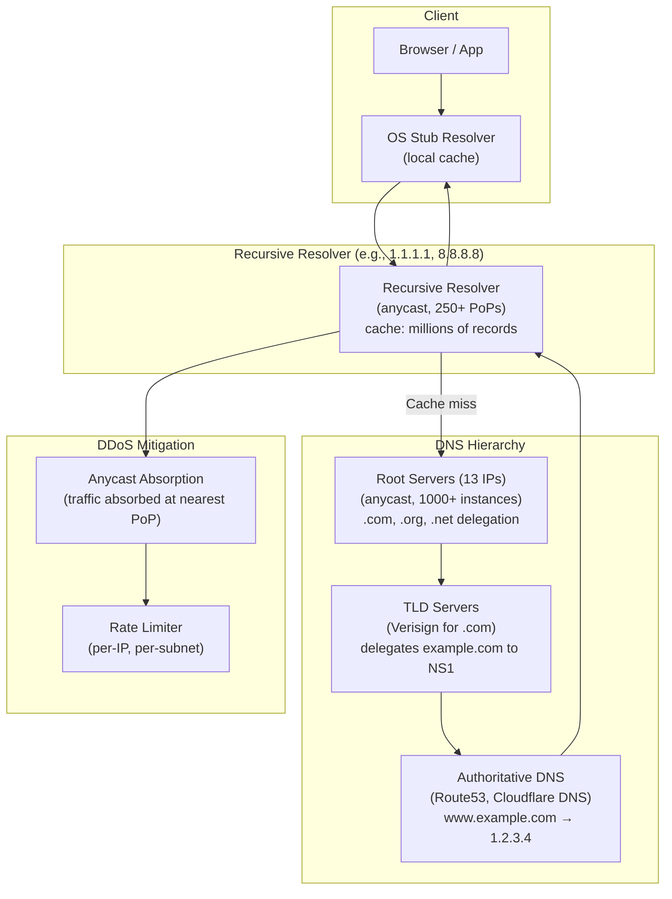
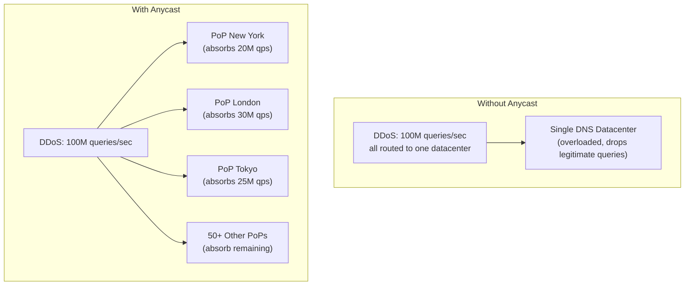

# Design a Global DNS System — 1 Trillion Queries/Day, < 1ms Latency

**Difficulty**: 🔴 Advanced
**Reading Time**: 27 minutes
**Interview Frequency**: Medium-High — asked at infrastructure, CDN, and networking companies

---

## Problem Statement

You are asked to design a global DNS infrastructure that:

- **Works at**: Single authoritative DNS server for one domain — BIND on a server handles millions of queries.
- **Breaks at**: Internet-scale DNS — 1 trillion queries/day globally; a DDoS with 100M spoofed queries/second; users in Tokyo can't afford 200ms round-trip to a single US-based resolver; TTL changes must propagate to 4B+ DNS resolvers within minutes for failover.

Target: **1 trillion queries/day** (~11.5M QPS), **< 1ms average latency globally**, **DDoS mitigation via anycast**, **DNSSEC for response authenticity**, **< 60-second failover via DNS**.

---

## Requirements

### Functional Requirements

| Requirement | Description |
|-------------|-------------|
| Name Resolution | Translate domain names to IP addresses (A, AAAA, CNAME records) |
| Recursive Resolution | Resolve on behalf of clients through the DNS hierarchy |
| Authoritative DNS | Serve records for delegated zones |
| GeoDNS | Return different IPs based on client geographic location |
| Health Checks | Automatically remove unhealthy IPs from DNS responses |
| DNSSEC | Cryptographically sign responses to prevent spoofing |

### Non-Functional Requirements

| Requirement | Target |
|-------------|--------|
| Query Throughput | 11.5M QPS (1T queries/day) |
| Latency | < 1 ms for cached, < 10 ms for recursive resolution |
| DDoS Capacity | Absorb 100M spoofed queries/sec via anycast absorption |
| Cache Hit Rate | > 90% (most queries answered from cache) |
| Availability | 100% — no production site can afford DNS downtime |
| TTL Propagation | < 60 seconds for failover records |

---

## Capacity Estimates

- **1T queries/day = 11.6M QPS** peak; with anycast, distributed across 250+ PoPs → **46K QPS/PoP**
- **Cache hit rate 90%**: only 1.16M QPS need recursive resolution
- **DNS packet size**: ~512 bytes (UDP) → 11.6M × 512 = **5.9 GB/s** global bandwidth
- **DNSSEC overhead**: Add ~1.5 KB per signed response (RRSIG, DNSKEY) → 30% bandwidth increase with DNSSEC enabled
- **Root server queries**: ~0.1% of queries reach root (cached by resolvers) → 11,600 QPS to root servers

---

## High-Level Architecture

---

## Level 1 — Surface: DNS Resolution Walk

When you visit `www.example.com` for the first time:

1. **Browser cache**: Not found (first visit)
2. **OS stub resolver**: Checks `/etc/hosts` and local cache → miss
3. **Recursive resolver** (1.1.1.1 or 8.8.8.8): Check cache → miss for first time
4. **Root server**: Knows only who handles `.com` → returns TLD server address
5. **TLD server** (Verisign): Knows who handles `example.com` → returns authoritative NS servers
6. **Authoritative NS** (example.com's DNS): Returns `www.example.com = 1.2.3.4`, TTL=300
7. **Recursive resolver** caches result for 300 seconds, returns to client
8. **OS caches** for TTL, **browser caches** for min(TTL, browser max)

Total recursive resolution: 3 round trips, ~50–100ms. Cached: < 1ms.

---

## Level 2 — Deep Dive: Anycast for DDoS Mitigation

### DNS Amplification DDoS

Attacker sends DNS queries with spoofed source IP (victim's IP). DNS server responds to victim. Small query (40 bytes) → large response (4000 bytes) = **100× amplification**. Volume: 1M bots × 100 queries/sec × 100× amplification = **10 Tbps** directed at victim.

### How Anycast Mitigates This

Anycast announces the same IP (e.g., 1.1.1.1) from 250 PoPs. BGP routes each packet to the nearest PoP. A DDoS of 100M QPS is spread across 250 PoPs → **400K QPS/PoP** — manageable with rate limiting and scrubbing.

### DNSSEC

DNSSEC adds cryptographic signatures to DNS records:

1. Zone operator generates public/private key pair
2. Each record set signed with private key (creates RRSIG record)
3. Public key published in DNS (DNSKEY record)
4. Resolvers verify signatures — cannot be forged without private key
5. Chain of trust: root signs .com key, .com signs example.com key

**DNSSEC trade-off**: Prevents cache poisoning but adds 1.5 KB per response (signatures), ~30% more bandwidth, and adds complexity. Many organizations skip DNSSEC due to operational overhead.

---

## Key Design Decisions

### 1. TTL Length — Freshness vs. Cache Effectiveness

| TTL | Cache Effectiveness | Failover Speed | Use Case |
|-----|---------------------|----------------|----------|
| **30 seconds** | Poor (90% cache miss after 30s) | 30 sec | Active-active, frequent changes |
| **5 minutes** | Good | 5 min | Most production sites |
| **1 hour** | Better | 1 hour | Stable services |
| **24 hours** | Best (minimal resolver load) | 24 hours | CDN origins, stable APIs |

**Failover strategy**: Use TTL=300 (5 min) for production. Pre-lower TTL to 60s **before** a planned maintenance. Raise back to 300s after traffic drains. For emergencies, lowering TTL has no immediate effect — must wait for current TTL to expire in all resolvers.

### 2. Split-Horizon DNS

Serve different responses to different clients:
- **Internal clients** (10.0.0.0/8): Return internal IP (10.x.x.x)
- **External clients**: Return public IP

Implementation: Configure authoritative DNS with views (BIND `view` directive or Route53 private hosted zones). Internal resolver returns private IP; public resolver returns public IP.

### 3. GeoDNS for Latency Optimization

Route53 Latency-Based Routing: Measure actual latency from each AWS region to each query source. Return IP of region with lowest latency. Example:
- Client in Tokyo → Asia-Pacific endpoint (20ms)
- Client in US East → US East endpoint (5ms)

versus Geolocation Routing: Return IP based on country/continent mapping (simpler, less accurate, no real latency measurement).

---

## Interview Questions

| Question | What They're Testing | Key Answer Points |
|----------|---------------------|-------------------|
| How does DNS failover work when a server goes down? | DNS mechanics | Health checker detects failure; removes unhealthy IP from record; new TTL must expire before change propagates; minimum failover = TTL seconds (e.g., 60s) |
| How do you prevent DNS cache poisoning? | Security knowledge | DNSSEC signatures verify record authenticity; also DNS-over-HTTPS (DoH) encrypts queries to prevent MITM; randomize source port + transaction ID (Kaminsky attack mitigation) |
| Why do root servers never go down despite being only 13 IPs? | Anycast understanding | Each of the 13 IPs is anycast — hundreds of physical servers. "Root server A" IP (198.41.0.4) is served from 50+ locations globally. Anycast provides DDoS absorption and geographic distribution. |

---

## 📚 Resources & References

| Resource | Type | What You'll Learn |
|----------|------|------------------|
| [Cloudflare: How DNS Works](https://www.cloudflare.com/learning/dns/what-is-dns/) | 📖 Blog | Complete DNS tutorial, hierarchy, record types, security |
| [AWS Route 53 Documentation](https://aws.amazon.com/route53/) | 📚 Docs | Routing policies, health checks, GeoDNS, DNSSEC |
| [Cloudflare 1.1.1.1 Launch Blog](https://blog.cloudflare.com/announcing-1111/) | 📖 Blog | Building a high-performance, privacy-first recursive resolver |
| [Hussein Nasser YouTube](https://www.youtube.com/@hnasr) | 📺 YouTube | DNS deep dives, anycast, DoH/DoT protocols |

---

## Related Concepts

- [Load Balancer](./load-balancer) — GeoDNS is a global traffic distribution mechanism
- [CDN](./cdn) — CDNs rely heavily on anycast DNS for PoP selection
- [Multi-Cloud API Gateway](./multi-cloud-api-gateway) — DNS failover is key component of multi-cloud routing
