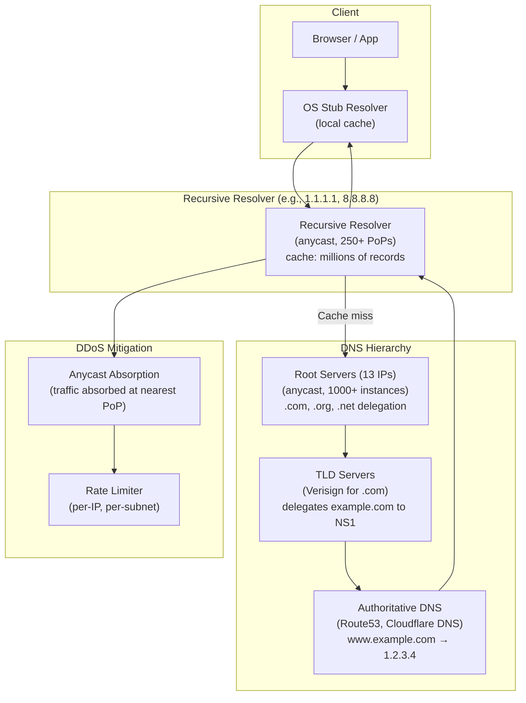
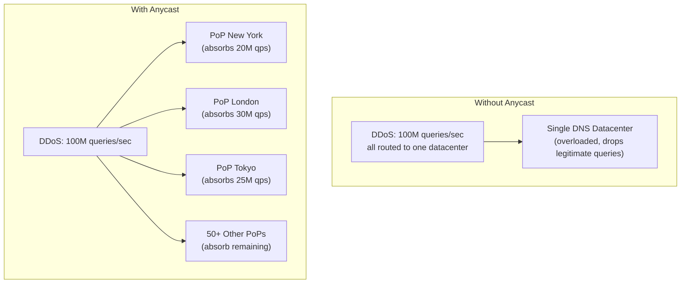
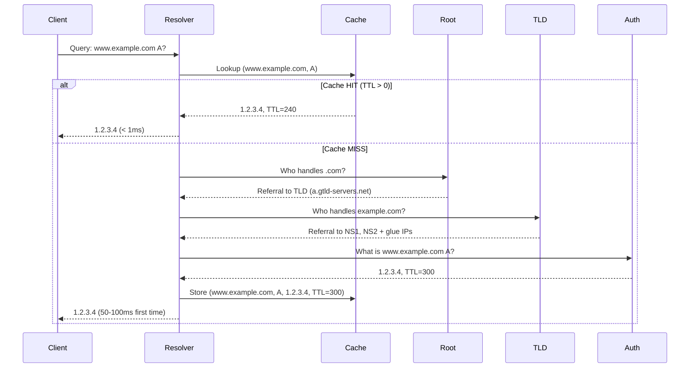
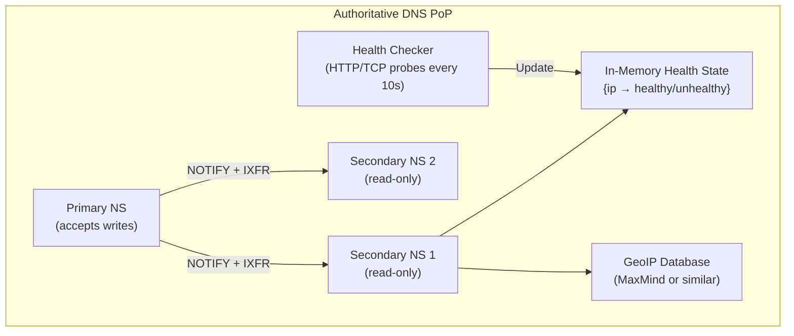

# Design a Global DNS System — 1 Trillion Queries/Day, < 1ms Latency

**Difficulty**: 🔴 Advanced
**Reading Time**: 27 minutes
**Interview Frequency**: Medium-High — asked at infrastructure, CDN, and networking companies

---

## Problem Statement

You are asked to design a global DNS infrastructure that:

- **Works at**: Single authoritative DNS server for one domain — BIND on a server handles millions of queries.
- **Breaks at**: Internet-scale DNS — 1 trillion queries/day globally; a DDoS with 100M spoofed queries/second; users in Tokyo can't afford 200ms round-trip to a single US-based resolver; TTL changes must propagate to 4B+ DNS resolvers within minutes for failover.

Target: **1 trillion queries/day** (~11.5M QPS), **< 1ms average latency globally**, **DDoS mitigation via anycast**, **DNSSEC for response authenticity**, **< 60-second failover via DNS**.

---

## Requirements

### Functional Requirements

| Requirement | Description |
|-------------|-------------|
| Name Resolution | Translate domain names to IP addresses (A, AAAA, CNAME records) |
| Recursive Resolution | Resolve on behalf of clients through the DNS hierarchy |
| Authoritative DNS | Serve records for delegated zones |
| GeoDNS | Return different IPs based on client geographic location |
| Health Checks | Automatically remove unhealthy IPs from DNS responses |
| DNSSEC | Cryptographically sign responses to prevent spoofing |

### Non-Functional Requirements

| Requirement | Target |
|-------------|--------|
| Query Throughput | 11.5M QPS (1T queries/day) |
| Latency | < 1 ms for cached, < 10 ms for recursive resolution |
| DDoS Capacity | Absorb 100M spoofed queries/sec via anycast absorption |
| Cache Hit Rate | > 90% (most queries answered from cache) |
| Availability | 100% — no production site can afford DNS downtime |
| TTL Propagation | < 60 seconds for failover records |

---

## Capacity Estimates

- **1T queries/day = 11.6M QPS** peak; with anycast, distributed across 250+ PoPs → **46K QPS/PoP**
- **Cache hit rate 90%**: only 1.16M QPS need recursive resolution
- **DNS packet size**: ~512 bytes (UDP) → 11.6M × 512 = **5.9 GB/s** global bandwidth
- **DNSSEC overhead**: Add ~1.5 KB per signed response (RRSIG, DNSKEY) → 30% bandwidth increase with DNSSEC enabled
- **Root server queries**: ~0.1% of queries reach root (cached by resolvers) → 11,600 QPS to root servers

---

## High-Level Architecture



---

## Level 1 — Surface: DNS Resolution Walk

When you visit `www.example.com` for the first time:

1. **Browser cache**: Not found (first visit)
2. **OS stub resolver**: Checks `/etc/hosts` and local cache → miss
3. **Recursive resolver** (1.1.1.1 or 8.8.8.8): Check cache → miss for first time
4. **Root server**: Knows only who handles `.com` → returns TLD server address
5. **TLD server** (Verisign): Knows who handles `example.com` → returns authoritative NS servers
6. **Authoritative NS** (example.com's DNS): Returns `www.example.com = 1.2.3.4`, TTL=300
7. **Recursive resolver** caches result for 300 seconds, returns to client
8. **OS caches** for TTL, **browser caches** for min(TTL, browser max)

Total recursive resolution: 3 round trips, ~50–100ms. Cached: < 1ms.

---

## Level 2 — Deep Dive: Anycast for DDoS Mitigation

### DNS Amplification DDoS

Attacker sends DNS queries with spoofed source IP (victim's IP). DNS server responds to victim. Small query (40 bytes) → large response (4000 bytes) = **100× amplification**. Volume: 1M bots × 100 queries/sec × 100× amplification = **10 Tbps** directed at victim.

### How Anycast Mitigates This



Anycast announces the same IP (e.g., 1.1.1.1) from 250 PoPs. BGP routes each packet to the nearest PoP. A DDoS of 100M QPS is spread across 250 PoPs → **400K QPS/PoP** — manageable with rate limiting and scrubbing.

### DNSSEC

DNSSEC adds cryptographic signatures to DNS records:

1. Zone operator generates public/private key pair
2. Each record set signed with private key (creates RRSIG record)
3. Public key published in DNS (DNSKEY record)
4. Resolvers verify signatures — cannot be forged without private key
5. Chain of trust: root signs .com key, .com signs example.com key

**DNSSEC trade-off**: Prevents cache poisoning but adds 1.5 KB per response (signatures), ~30% more bandwidth, and adds complexity. Many organizations skip DNSSEC due to operational overhead.

---

## Key Design Decisions

### 1. TTL Length — Freshness vs. Cache Effectiveness

| TTL | Cache Effectiveness | Failover Speed | Use Case |
|-----|---------------------|----------------|----------|
| **30 seconds** | Poor (90% cache miss after 30s) | 30 sec | Active-active, frequent changes |
| **5 minutes** | Good | 5 min | Most production sites |
| **1 hour** | Better | 1 hour | Stable services |
| **24 hours** | Best (minimal resolver load) | 24 hours | CDN origins, stable APIs |

**Failover strategy**: Use TTL=300 (5 min) for production. Pre-lower TTL to 60s **before** a planned maintenance. Raise back to 300s after traffic drains. For emergencies, lowering TTL has no immediate effect — must wait for current TTL to expire in all resolvers.

### 2. Split-Horizon DNS

Serve different responses to different clients:
- **Internal clients** (10.0.0.0/8): Return internal IP (10.x.x.x)
- **External clients**: Return public IP

Implementation: Configure authoritative DNS with views (BIND `view` directive or Route53 private hosted zones). Internal resolver returns private IP; public resolver returns public IP.

### 3. GeoDNS for Latency Optimization

Route53 Latency-Based Routing: Measure actual latency from each AWS region to each query source. Return IP of region with lowest latency. Example:
- Client in Tokyo → Asia-Pacific endpoint (20ms)
- Client in US East → US East endpoint (5ms)

versus Geolocation Routing: Return IP based on country/continent mapping (simpler, less accurate, no real latency measurement).

---

## Interview Questions

| Question | What They're Testing | Key Answer Points |
|----------|---------------------|-------------------|
| How does DNS failover work when a server goes down? | DNS mechanics | Health checker detects failure; removes unhealthy IP from record; new TTL must expire before change propagates; minimum failover = TTL seconds (e.g., 60s) |
| How do you prevent DNS cache poisoning? | Security knowledge | DNSSEC signatures verify record authenticity; also DNS-over-HTTPS (DoH) encrypts queries to prevent MITM; randomize source port + transaction ID (Kaminsky attack mitigation) |
| Why do root servers never go down despite being only 13 IPs? | Anycast understanding | Each of the 13 IPs is anycast — hundreds of physical servers. "Root server A" IP (198.41.0.4) is served from 50+ locations globally. Anycast provides DDoS absorption and geographic distribution. |

---

## Component Deep Dive 1: Recursive Resolver — The Caching Workhorse

The recursive resolver is the single most important component in the DNS ecosystem. It sits between the client and the rest of the DNS hierarchy, doing the heavy lifting of iterative resolution and caching results so that the global root and TLD infrastructure does not collapse under load.

### How It Works Internally

When a resolver receives a query for `www.example.com`, it maintains a resolution state machine:

1. **Cache lookup**: Check in-memory cache keyed by `(name, type, class)`. If found and TTL > 0, return immediately. This handles 90%+ of queries at < 1ms.
2. **Negative cache check**: Check if a previous NXDOMAIN (non-existent domain) is cached. NXDOMAIN also carries a TTL (from the SOA record) — resolvers cache negative answers to avoid re-querying for bad domains.
3. **Iterative resolution**: Starting from the root (whose IP is hardcoded in the "root hints" file), the resolver sends an iterative query. Root returns referral to `.com` TLD servers. TLD servers return referral to `example.com`'s authoritative NS. Authoritative NS returns the final A record.
4. **Glue records**: When a nameserver's name is inside the zone it serves (e.g., `ns1.example.com` is authoritative for `example.com`), the parent zone includes the IP address of that nameserver alongside the NS delegation record — called a glue record. Without this, resolution would be a circular dependency.
5. **EDNS0 Client Subnet**: The resolver can forward a partial client IP (e.g., first 24 bits) to the authoritative server, allowing GeoDNS to return the geographically nearest IP. Privacy trade-off: leaks partial user location to third-party DNS servers.

### Why Naive Approaches Fail at Scale

A single-instance resolver handling 11.5M QPS would need:
- In-memory cache: 50 million records × ~200 bytes each = 10 GB RAM
- Processing: 11.5M UDP packets/sec requires kernel bypass (DPDK or io_uring) to avoid system call overhead
- Single datacenter: 200ms latency from Tokyo to a US resolver — unacceptable

Naive approach failure modes:
- **Cache stampede**: Multiple clients query for an expired record simultaneously. All miss the cache. All fire recursive lookups. Authoritative server gets 10,000× normal load for that record. Fix: use "stale-while-revalidate" — serve slightly-expired records while refreshing in background.
- **Slow resolution poisoning**: Attacker floods recursive resolver with queries for random subdomains (`a1.attacker.com`, `a2.attacker.com`, ...). Each misses cache, triggers recursive lookup, evicts legitimate cached entries. Cache churn makes resolver useless for legitimate traffic.
- **Birthday attack / Kaminsky attack**: Attacker races to inject a forged response before the legitimate one arrives. Mitigation: randomize both UDP source port (16 bits) and transaction ID (16 bits) = 32 bits of entropy = 4 billion combinations to guess.



### Implementation Options for the Cache Layer

| Approach | Latency | Throughput | Trade-off |
|----------|---------|------------|-----------|
| In-process memory (hash map) | < 100ns lookup | 50M+ lookups/sec | No cross-process sharing; lost on restart; limited by single process heap |
| Shared memory (mmap) | ~200ns | 20M lookups/sec | Shared across resolver worker processes; survives worker restart; complex invalidation |
| Redis/Memcached (external) | 200–500μs | 1M lookups/sec (with pipelining) | Shared across servers; network hop; 500x slower than in-process; appropriate only for distributed cache tiering |

**Production choice**: Cloudflare's 1.1.1.1 uses an in-process cache in each server within a PoP. Servers within the same PoP do not share cache — each builds its own. The hit rate across a 10-server PoP is still 90%+ because the same popular domains are cached in all servers within minutes.

---

## Component Deep Dive 2: Authoritative DNS — GeoDNS and Health Checks

The authoritative DNS server is the source of truth for a zone. It does not perform recursive lookups — it only answers queries about records it owns. At internet scale, authoritative DNS must handle write-heavy operations (zone propagation) alongside extremely high read throughput.

### Internal Mechanics

An authoritative DNS server maintains a **zone file** — a structured record of all DNS entries for a domain. On each query:

1. Receive UDP packet (port 53), parse DNS wire format
2. Look up `(name, type)` in zone data (typically an in-memory hash table loaded from zone file)
3. For GeoDNS: use ECS (EDNS0 Client Subnet) or resolver IP to determine client region; select record from region-specific pool
4. For health-checked records: check in-memory health state (updated by background health checker); exclude unhealthy IPs from response
5. Sign response with DNSSEC private key (if DNSSEC enabled) — adds ~2ms for RSA signing, <0.1ms for ECDSA
6. Return response via UDP (or TCP if response > 512 bytes or client sends DO bit requesting DNSSEC)

### Zone Propagation at Scale

When you update a DNS record (e.g., add a new server IP), the change must reach all authoritative nameservers within seconds:

- **Primary → Secondary replication**: NOTIFY message sent from primary to secondaries on any zone change. Secondaries perform AXFR (full zone transfer) or IXFR (incremental) to sync. For a large zone (1M records), AXFR = 50–200 MB transfer.
- **Propagation time**: Primary to secondary: 1–5 seconds (NOTIFY + IXFR). Secondary to global recursive resolvers: depends on TTL. The zone itself propagates fast; the TTL on existing cached records in resolvers is the bottleneck.

### Scale Behavior at 10x Load

At 10x normal load (115M QPS total, ~460K QPS/PoP):
- Each authoritative server typically handles 100K–500K QPS (commodity hardware, DPDK networking)
- Health check frequency must scale: at 460K QPS returning 4 IPs each, even 0.1% unhealthy IPs = 460 queries/sec returning bad IPs before health check detects it
- Zone replication increases: 10x more frequent record changes → 10x IXFR volume → 10x load on secondary servers



| Routing Strategy | Accuracy | Latency | Operational Cost |
|-----------------|----------|---------|-----------------|
| Geolocation (country/continent mapping) | Medium (misclassified IPs common) | Depends on IP database freshness | Low — static mapping |
| Latency-based (AWS Route53) | High (actual measured latency) | Lowest for users | High — continuous probing from each region |
| Weighted round-robin | N/A (load balancing only) | Equal across all origins | Very low |
| Failover (primary + secondary) | N/A | Low when healthy | Low — binary health check only |

---

## Component Deep Dive 3: Anycast Routing — The DDoS Shield and Latency Optimizer

Anycast is the networking technique that makes global DNS possible. The same IP address (e.g., `1.1.1.1`) is announced from multiple physical locations via BGP. Routers route each packet to the topologically nearest announcement — the client never knows which physical server it hit, and doesn't need to.

### How BGP Anycast Works

Each PoP runs BGP sessions with upstream transit providers and Internet Exchange peers. Each PoP announces the same prefix (e.g., `1.1.1.0/24`) with its own AS path. BGP best-path selection (shortest AS path, lowest MED, local preference) causes each autonomous system on the internet to prefer its nearest PoP. A packet from a Tokyo ISP hits the Tokyo PoP; a packet from a London ISP hits the London PoP.

**Critical operational detail**: Anycast does not guarantee session stickiness. UDP DNS queries are stateless — each packet is independently routed. This is fine for DNS (each query is independent). It would be problematic for TCP-based protocols where a session must reach the same server for its duration. DNS-over-TCP and DNS-over-TLS use anycast carefully — some implementations use "stable anycast" techniques where the routing table is more stable.

### Capacity Planning for DDoS Scenarios

At 100M spoofed QPS (DNS amplification attack):
- 250 PoPs → average 400K QPS/PoP
- Each PoP has upstream transit capacity: typical tier-1 PoP has 100–400 Gbps upstream
- 400K QPS × 4 KB amplified response = 1.6 Gbps/PoP — manageable
- Extreme scenario: attacker concentrates traffic in one region. One PoP absorbs 10M QPS = 40 Gbps. Still within capacity for large PoPs.
- Scrubbing: Rate-limit per source IP (max 100 queries/sec per IP), drop queries with malformed flags, respond with REFUSED to known bad actors

### When Anycast Fails

- **BGP route hijacking**: Malicious AS announces the same prefix with a shorter path. Traffic diverts to attacker-controlled servers. Fix: RPKI (Resource Public Key Infrastructure) validates that an AS is authorized to originate a prefix.
- **PoP isolation**: A PoP loses all upstream connectivity. Traffic should re-route to next-nearest PoP within 30–90 seconds (BGP convergence time). During this window, clients in that region experience timeouts or fail to the next nameserver.
- **Asymmetric routing**: Query goes to Tokyo PoP, but response routes differently (different path). For UDP DNS this is harmless — response goes back to client directly.

---

## Data Model

DNS zone data is stored in **zone files** (RFC 1035 format) on authoritative servers. In-memory representation uses specialized hash structures. Below is the canonical zone file format alongside the in-memory representation for a production authoritative server:

```sql
-- Relational representation of a DNS zone (how Route53-style databases model it)

CREATE TABLE dns_zones (
    zone_id        UUID PRIMARY KEY,
    zone_name      VARCHAR(255) NOT NULL UNIQUE,   -- e.g., "example.com."
    serial         BIGINT NOT NULL,                -- SOA serial, incremented on each change
    refresh_secs   INT NOT NULL DEFAULT 3600,      -- How often secondaries poll primary
    retry_secs     INT NOT NULL DEFAULT 900,       -- Retry interval after failed refresh
    expire_secs    INT NOT NULL DEFAULT 86400,     -- When secondaries stop responding if primary unreachable
    minimum_ttl    INT NOT NULL DEFAULT 300,       -- Minimum TTL for negative caching
    created_at     TIMESTAMPTZ NOT NULL DEFAULT NOW(),
    updated_at     TIMESTAMPTZ NOT NULL DEFAULT NOW()
);

CREATE TABLE dns_records (
    record_id      UUID PRIMARY KEY,
    zone_id        UUID NOT NULL REFERENCES dns_zones(zone_id) ON DELETE CASCADE,
    name           VARCHAR(255) NOT NULL,          -- e.g., "www" or "@" for apex
    record_type    VARCHAR(10) NOT NULL,           -- A, AAAA, CNAME, MX, TXT, NS, SOA, SRV
    ttl            INT NOT NULL,                   -- seconds; 0 means use zone minimum
    value          TEXT NOT NULL,                  -- e.g., "1.2.3.4" for A, "mail.example.com." for MX
    priority       INT,                            -- for MX and SRV records only
    weight         INT DEFAULT 100,                -- for weighted routing policies
    region         VARCHAR(50),                    -- NULL = global; "us-east-1" = region-specific (GeoDNS)
    health_check_id UUID,                          -- FK to health checks table; NULL = no health check
    enabled        BOOLEAN NOT NULL DEFAULT TRUE,
    created_at     TIMESTAMPTZ NOT NULL DEFAULT NOW(),
    updated_at     TIMESTAMPTZ NOT NULL DEFAULT NOW()
);

CREATE INDEX idx_dns_records_zone_name_type ON dns_records(zone_id, name, record_type);
CREATE INDEX idx_dns_records_health_check ON dns_records(health_check_id) WHERE health_check_id IS NOT NULL;

CREATE TABLE health_checks (
    health_check_id UUID PRIMARY KEY,
    protocol        VARCHAR(10) NOT NULL,          -- HTTP, HTTPS, TCP
    host            VARCHAR(255) NOT NULL,         -- IP or hostname to probe
    port            INT NOT NULL,                  -- e.g., 80, 443, 8080
    path            VARCHAR(1024) DEFAULT '/',     -- HTTP path to check
    interval_secs   INT NOT NULL DEFAULT 10,       -- probe frequency
    failure_threshold INT NOT NULL DEFAULT 3,      -- consecutive failures before marking unhealthy
    status          VARCHAR(20) NOT NULL DEFAULT 'healthy',  -- healthy, unhealthy, unknown
    last_checked_at TIMESTAMPTZ,
    updated_at      TIMESTAMPTZ NOT NULL DEFAULT NOW()
);

-- DNSSEC key management
CREATE TABLE dnssec_keys (
    key_id         UUID PRIMARY KEY,
    zone_id        UUID NOT NULL REFERENCES dns_zones(zone_id),
    key_tag        INT NOT NULL,                   -- 16-bit identifier for the key
    algorithm      VARCHAR(20) NOT NULL,           -- ECDSAP256SHA256, RSASHA256
    key_type       VARCHAR(5) NOT NULL,            -- KSK (Key Signing Key) or ZSK (Zone Signing Key)
    public_key     TEXT NOT NULL,                  -- Base64 encoded
    private_key    TEXT,                           -- NULL on HSM-backed keys (retrieved at signing time)
    active_from    TIMESTAMPTZ NOT NULL,
    active_until   TIMESTAMPTZ,                    -- NULL = currently active
    created_at     TIMESTAMPTZ NOT NULL DEFAULT NOW()
);
```

**In-memory cache structure** on a recursive resolver:

```
cache_entry {
    key:        (name: string, type: uint16, class: uint16)
    records:    []rdata          // e.g., multiple A records for round-robin
    ttl:        uint32           // original TTL
    expires_at: unix_timestamp   // absolute expiration time
    stale_until: unix_timestamp  // serve stale up to this time while refreshing
    negative:   bool             // true = NXDOMAIN / NODATA
}

// Cache is a concurrent hash map with LRU eviction
// Typical size: 50M entries, 10 GB RAM per resolver process
// Key: hash(name + type + class) → cache_entry
```

---

## Scale Bottlenecks

| Traffic Level | Component That Breaks | Symptoms | Mitigation |
|---------------|----------------------|----------|------------|
| 10x baseline (115M QPS) | Recursive resolver cache | Cache hit rate drops as eviction pressure increases; more recursive lookups; higher latency P99 spikes from 5ms to 50ms | Add more resolver servers per PoP; increase cache RAM from 10 GB to 100 GB; tune LRU eviction policy |
| 10x baseline | Authoritative DNS zone replication | IXFR zone transfer backlog; secondaries fall behind primary by 10+ seconds; stale records served | Reduce zone size via split zones; use Dynamo-style eventual consistency replication instead of AXFR/IXFR |
| 100x baseline (1.15B QPS) | BGP peering capacity | PoPs with < 100 Gbps upstream become congested; packet loss; increased latency; amplification attack overwhelms smaller PoPs | Expand PoP count from 250 to 1000+; upgrade upstream capacity; anycast with more granular regional BGP communities |
| 100x baseline | Health checker → authoritative DNS consistency | Health state diverges across PoPs; some PoPs serve unhealthy IPs; users in specific regions get connection failures | Distribute health checker results via a global pub/sub (Kafka or similar); guarantee < 5 second propagation to all PoPs |
| 1000x baseline (11.5B QPS) | Root and TLD servers | Root server queries increase from 0.1% to cache-miss rate rising; even 0.01% of 11.5B = 1.15M QPS to root | Implement aggressive negative caching; pre-warm resolvers on startup with popular domains; QNAME minimization reduces root queries |
| 1000x baseline | DNSSEC signing latency | ECDSA signing adds 0.1ms; at 11.5B QPS with 10% DNSSEC-required = 1.15B signings/sec; hardware capacity exceeded | Distribute signing across dedicated HSM clusters; cache signed RRSETs (sign once, serve many); pre-sign all records offline |

---

## How Cloudflare Built 1.1.1.1

In April 2018, Cloudflare launched `1.1.1.1` — a public recursive resolver targeting the fastest DNS resolver on the internet while being privacy-preserving. Within 24 hours it was handling **72 billion queries/day** (~833K QPS). Within a year it reached **200 billion queries/day** (~2.3M QPS sustained, with peaks of 4–5M QPS).

**Technology choices:**

- **Unbound** (open source recursive resolver) as the base, heavily patched for Cloudflare's scale. They contributed significant upstream improvements to Unbound's cache locking and response rate limiting.
- **DPDK** (Data Plane Development Kit) for kernel-bypass networking — avoids Linux kernel's UDP socket overhead, enabling 10M+ PPS per server on commodity hardware.
- **Anycast from day one**: 1.1.1.1 announced from all 180+ Cloudflare PoPs simultaneously on launch day. This immediately distributed global traffic across all PoPs.
- **Privacy**: 1.1.1.1 does not log client IP addresses. Query logs are deleted within 24 hours. Audited by KPMG annually. This was a non-obvious differentiator — competitors (8.8.8.8) logged queries for product improvement.

**Non-obvious architectural decision**: Cloudflare uses the same global anycast network for both their CDN product and 1.1.1.1. This means every Cloudflare CDN PoP is also a DNS resolver PoP. The DNS resolver benefits from Cloudflare's BGP peering relationships built for CDN — they peer with 10,000+ ASes globally, meaning DNS queries rarely traverse more than 1-2 AS hops.

**Numbers**:
- 200B queries/day = 2.3M QPS average, 5M QPS peak
- 180+ PoPs globally
- Average response time: **11ms globally** (2018 benchmark), beating Google's 8.8.8.8 (34ms) and OpenDNS (20ms) significantly
- DNSSEC validation: enabled by default; adds < 0.5ms due to cached DNSKEY records

Source: [Cloudflare Blog — 1.1.1.1 One Year Later](https://blog.cloudflare.com/1-1-1-1-lookup-failures-on-october-4/)

---

## Interview Angle

**What the interviewer is testing:** Whether the candidate understands DNS as a distributed systems problem — specifically the tension between caching (availability, performance) and freshness (correctness, failover speed) — and whether they understand anycast as a load distribution mechanism, not just a networking curiosity.

**Common mistakes candidates make:**

1. **Treating DNS as a simple key-value store**: Candidates say "just put it in a database with the domain as the key." This ignores the hierarchical delegation model, TTL semantics, negative caching, and the fact that 4 billion resolvers worldwide maintain their own caches that you cannot directly invalidate.

2. **Proposing synchronous health checks in the query path**: Candidates suggest "check if the server is healthy before returning its IP." At 11.5M QPS, you cannot do a live HTTP probe per query. Health checks run asynchronously every 10–30 seconds; the result is stored in shared memory; queries read from pre-computed healthy-IP lists.

3. **Underestimating TTL propagation complexity**: Candidates say "just set TTL=0 for instant failover." TTL=0 is theoretically valid but many resolvers floor TTL at 30–60 seconds regardless. Also, TTL=0 means every query is a cache miss → 100% recursive lookup rate → 11.5M QPS hitting your authoritative servers instead of 1.15M QPS. The authoritative servers must be 10× larger to handle this.

**The insight that separates good from great answers:** The best candidates recognize that DNS failover speed is bounded by TTL but DNS load scaling is bounded by cache hit rate — these two forces pull in opposite directions. The production-grade solution is to run two TTL values: a short TTL (30–60 sec) for records that participate in health-check failover, and a long TTL (1–24 hours) for stable records. This minimizes authoritative server load while keeping failover fast for critical endpoints.

---

## Key Numbers to Remember

| Metric | Value | Context |
|--------|-------|---------|
| Global DNS query volume | 1 trillion queries/day (~11.5M QPS) | Entire internet; Cloudflare alone handles ~200B/day |
| Typical cache hit rate | 90–95% | At a well-warmed recursive resolver with popular domains |
| Recursive resolution latency | 50–100 ms | Cold cache; 3 round trips (root → TLD → auth) |
| Cached resolution latency | < 1 ms | In-process hash map lookup |
| DNS amplification factor | 28–100× | Small query (40 bytes) → large response (1.1–4 KB) |
| Anycast PoPs (Cloudflare) | 330+ PoPs | Each absorbs a share of DDoS traffic |
| 1.1.1.1 average latency | 11 ms globally | At launch (2018), beating Google 8.8.8.8's 34 ms |
| DNSSEC bandwidth overhead | ~30% increase | RRSIG + DNSKEY records add ~1.5 KB per signed response |
| TTL floor (practical) | 30–60 seconds | Many resolvers ignore TTL=0; floor at 30–60s |
| Root server instances | 1500+ physical servers | Behind 13 anycast IPs; operated by 12 organizations |
| Health check probe interval | 10–30 seconds | Route53 minimum is 10 seconds; minimum failover = 3 consecutive failures = 30s |
| Zone transfer (1M records) | 50–200 MB (AXFR) | IXFR is incremental; much smaller for single-record changes |

---

## Failover Runbook: DNS-Based Traffic Shifting

Understanding the operational mechanics of DNS failover is a common interview follow-up. Here is the production-grade sequence used by teams running health-checked authoritative DNS:

### Pre-Planned Maintenance Failover (Best Case)

1. **T-24h**: Verify failover target is healthy and receiving synthetic traffic at 5% load
2. **T-30 min**: Lower TTL on affected records from 300s → 30s. Wait for TTL to expire in all resolvers (worst case = current TTL = 5 minutes).
3. **T-5 min**: Confirm all resolver caches have expired (check `dig +short www.example.com @8.8.8.8` returns correct record with TTL≤30)
4. **T-0**: Flip DNS record from old IP to new IP. Change propagates within 30 seconds (new TTL).
5. **T+5 min**: Monitor error rate on old servers (should drop to near-zero). Monitor error rate on new servers (should match expected traffic).
6. **T+15 min**: Raise TTL back to 300s on new record.

### Emergency Failover (Unplanned Outage)

1. **Detect**: Health checker fires after 3 consecutive failures × 10-second interval = **30 seconds to detect**
2. **Propagate**: Authoritative DNS removes unhealthy IP. Change reaches recursive resolvers within **30–60 seconds** (new record TTL = 30s in production emergency config)
3. **Client impact**: Clients with cached records continue hitting dead server for up to **current TTL** seconds. At TTL=300, up to 5 minutes of failed requests. At TTL=30 (pre-lowered), up to 30 seconds.
4. **Total downtime window**: Detection (30s) + TTL propagation (30–300s) = **1–5.5 minutes** typical

### DNS Failover vs. Load Balancer Failover

| Property | DNS Failover | Load Balancer Failover |
|----------|-------------|----------------------|
| Detection speed | 10–30 seconds | < 1 second (health check every 1s) |
| Propagation speed | 30–300 seconds (TTL-bound) | Instant (LB just stops sending traffic) |
| Client caching | Clients cache DNS; cannot force flush | No client-side caching of routing |
| Infrastructure cost | Low — just DNS records | Higher — requires LB fleet in front |
| Granularity | Per-region or per-IP | Per-server, per-request |
| Best for | Multi-region failover (e.g., us-east → us-west) | Within-region server failover |

**Lesson**: DNS failover is not a replacement for a load balancer. Use DNS for coarse-grained geographic failover (region-level), and use load balancers for fine-grained within-region failover (server-level). The TTL makes DNS fundamentally unsuitable for sub-second failover.

### DNSSEC Key Rotation Procedure

DNSSEC keys must be rotated periodically (typically every 90 days for ZSK, annually for KSK). Incorrect rotation causes DNSSEC validation failures — all validating resolvers reject your records, causing total DNS failure for ~30% of internet users (those using DNSSEC-validating resolvers).

**Safe ZSK rotation (double-signature method)**:
1. Generate new ZSK, publish DNSKEY record (do not yet use for signing)
2. Wait one TTL period for new DNSKEY to propagate to all resolvers
3. Begin signing with both old ZSK and new ZSK (double-signing)
4. Wait one TTL period
5. Remove old ZSK from signing (only new ZSK signs)
6. Wait one signature lifetime (RRSIG expiry, typically 14 days)
7. Remove old ZSK from DNSKEY record

---

## Common Production Mistakes

1. **Not pre-lowering TTL before planned maintenance**: Teams change a record and expect instant propagation. The existing TTL (often 1 hour) means some resolvers serve the old record for up to 60 minutes. Always lower TTL 24 hours before planned changes.
2. **Setting TTL=0 to solve failover speed**: Every query becomes a cache miss. A site with TTL=0 at 10M DAU generates 10× the authoritative server load. Authoritative servers sized for 5% recursive rate now receive 100% — they collapse under the load, causing worse downtime than the original failure.
3. **Forgetting negative caching TTL**: A `dig non-existent.example.com` returns NXDOMAIN with a negative TTL from the SOA record. Resolvers cache this NXDOMAIN. If you then create that record, users see NXDOMAIN for up to the negative TTL (often 300–3600 seconds). Always set SOA minimum TTL to 60 seconds in production zones.
4. **Ignoring DNSSEC chain of trust during zone delegation**: When delegating a subdomain to a third-party DNS provider, if the parent zone has DNSSEC enabled, you must provide DS records to the parent. Forgetting this causes SERVFAIL for all validating resolvers querying your subdomain — silently breaking DNS for 30%+ of users.
5. **Relying solely on DNS for health-based routing without a LB**: DNS health checks remove an IP after 30 seconds of failures. But clients with cached DNS entries continue hitting the dead server until their local TTL expires. The correct architecture is DNS for regional routing + a load balancer within each region for per-server health checks.
6. **Underestimating anycast BGP convergence time during PoP failover**: When a PoP loses connectivity, BGP withdraws the route. Convergence across the internet takes 30–90 seconds. During this window, clients in that region experience DNS timeouts. Always configure at least 2 NS records (in separate anycast PoPs) so clients can retry on the second nameserver.

> **Rule of thumb**: DNS is eventually consistent by design — there is no such thing as "instant DNS propagation." Every operational decision — TTL length, DNSSEC key rotation, zone delegation, health check thresholds — must account for propagation delay. When in doubt, TTL=300 with a pre-lowering procedure covers 90% of production use cases without overloading authoritative infrastructure.

---

## 📚 Resources & References

| Resource | Type | What You'll Learn |
|----------|------|------------------|
| [Cloudflare: How DNS Works](https://www.cloudflare.com/learning/dns/what-is-dns/) | 📖 Blog | Complete DNS tutorial, hierarchy, record types, security |
| [AWS Route 53 Documentation](https://aws.amazon.com/route53/) | 📚 Docs | Routing policies, health checks, GeoDNS, DNSSEC |
| [Cloudflare 1.1.1.1 Launch Blog](https://blog.cloudflare.com/announcing-1111/) | 📖 Blog | Building a high-performance, privacy-first recursive resolver |
| [Hussein Nasser YouTube](https://www.youtube.com/@hnasr) | 📺 YouTube | DNS deep dives, anycast, DoH/DoT protocols |

---

---

## Related Concepts

- [Load Balancer](./load-balancer) — GeoDNS is a global traffic distribution mechanism
- [CDN](./cdn) — CDNs rely heavily on anycast DNS for PoP selection
- [Multi-Cloud API Gateway](./multi-cloud-api-gateway) — DNS failover is key component of multi-cloud routing
