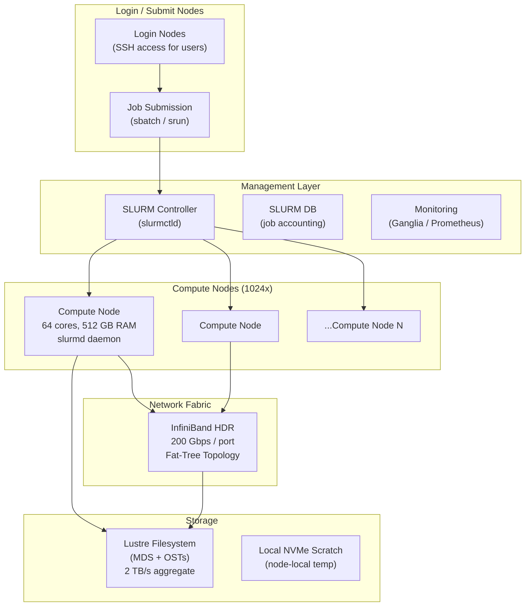
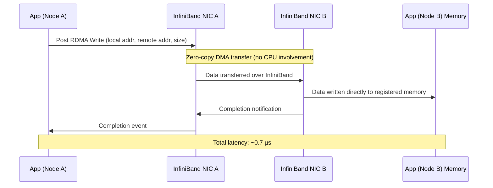
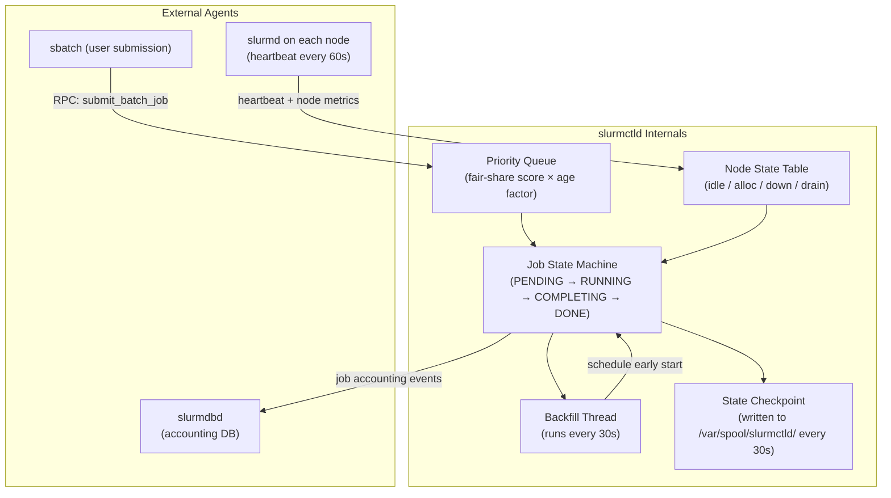
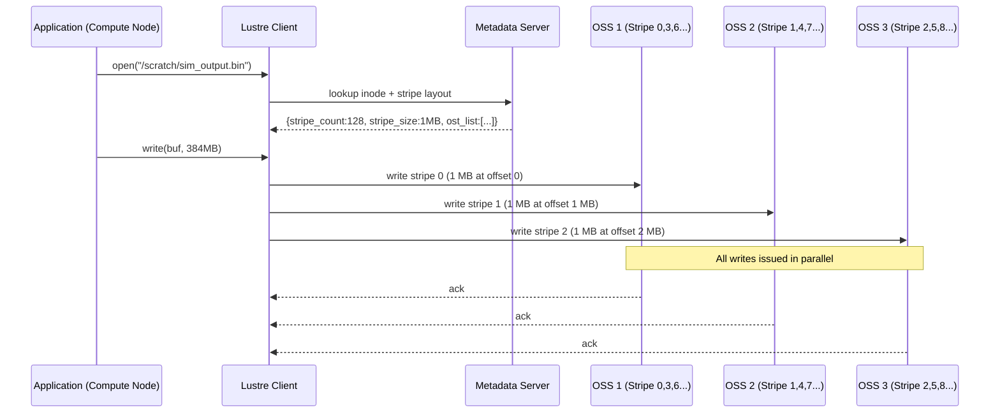
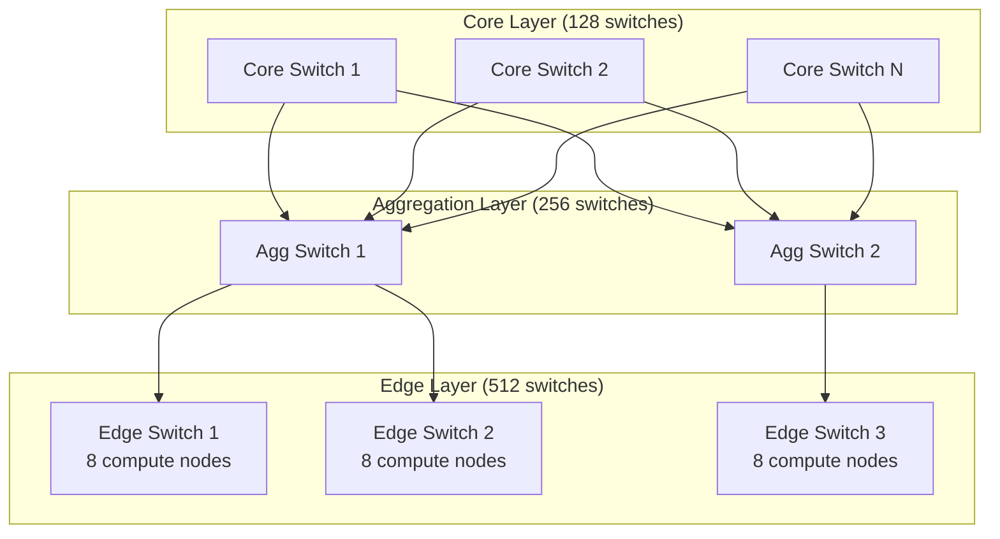

# Design an HPC Cluster for Massively Parallel Scientific Computation

**Difficulty**: 🔴 Advanced
**Reading Time**: 25 minutes
**Interview Frequency**: Medium — common at ML infrastructure, scientific computing, and national lab interviews

---

## Problem Statement

You are asked to design a High Performance Computing (HPC) cluster that:

- **Works at**: 10-node cluster — simple SSH + MPI handles molecular dynamics or fluid simulation.
- **Breaks at**: 1,000+ nodes with jobs running for days — job scheduling becomes unfair, node failures abort week-long runs, shared filesystem becomes a bottleneck, and network congestion kills performance.

Target scale: **1,024 compute nodes**, **100 Gbps InfiniBand interconnect**, **10 PB shared storage (Lustre)**, **1,000 concurrent jobs**, jobs ranging from 1 minute to 7 days.

---

## Requirements

### Functional Requirements

| Requirement | Description |
|-------------|-------------|
| Job Submission | Users submit batch jobs specifying nodes, walltime, memory |
| Job Scheduling | Fair allocation across users and projects |
| Parallel Execution | MPI programs communicate across nodes at < 1 µs latency |
| Shared Filesystem | All nodes access same data namespace |
| Fault Tolerance | Long jobs survive single node failures via checkpointing |
| Monitoring | Real-time node health, job status, utilization |

### Non-Functional Requirements

| Requirement | Target |
|-------------|--------|
| MPI Latency | < 1 µs message latency (InfiniBand RDMA) |
| Shared Filesystem Throughput | > 100 GB/s aggregate (Lustre striped) |
| Job Scheduler Throughput | 10,000 job submissions/day |
| Node Failure Recovery | Resume from checkpoint within 30 minutes |
| Cluster Utilization | > 85% average utilization |

---

## Capacity Estimates

- **1,024 nodes × 64 cores = 65,536 cores** available for computation
- **InfiniBand HDR (200 Gbps)**: bisection bandwidth ~100 Tbps for fat-tree topology
- **Lustre filesystem**: 1,000 storage targets × 2 GB/s each = **2 TB/s peak throughput**
- **Checkpoint size for typical job**: 500 GB state × 1,000 parallel jobs = up to **500 TB checkpoint storage**
- **SLURM daemon**: handles 10,000 nodes on a single slurmctld with < 1s scheduling cycle

---

## High-Level Architecture



---

## Level 1 — Surface: How HPC Differs from Cloud

| Dimension | Cloud (Kubernetes) | HPC Cluster |
|-----------|-------------------|-------------|
| Network latency | 50–100 µs (TCP) | 0.5–2 µs (RDMA/InfiniBand) |
| Communication model | Message passing via services | Direct RDMA memory access |
| Scheduling | Fine-grained (pod = 1 process) | Coarse-grained (job = 1–1024 nodes) |
| Workload type | Long-running services | Batch jobs (minutes to weeks) |
| Storage | Distributed object store (S3) | POSIX-compliant shared filesystem (Lustre) |
| Failure handling | Pod restart | Checkpoint + resume |

The key insight: HPC workloads are **tightly coupled** — all 1,024 MPI ranks must communicate synchronously. A single slow node (straggler) holds up the entire job. Cloud-style independent microservices don't have this constraint.

---

## Level 2 — Deep Dive: MPI and RDMA

### Message Passing Interface (MPI)

MPI is the standard API for parallel programs across nodes. Each process has a **rank** (0 to N-1). Processes communicate by sending and receiving messages.

```
// Rank 0 sends, Rank 1 receives (simplified)
if (rank == 0) {
    MPI_Send(&data, count, MPI_DOUBLE, 1, tag, MPI_COMM_WORLD);
} else if (rank == 1) {
    MPI_Recv(&data, count, MPI_DOUBLE, 0, tag, MPI_COMM_WORLD, &status);
}
// All ranks synchronize here
MPI_Barrier(MPI_COMM_WORLD);
```

### RDMA (Remote Direct Memory Access)

Standard TCP: sender CPU → kernel → NIC → network → NIC → kernel → receiver CPU (many copies)
RDMA: sender CPU writes directly to **remote memory**, bypassing both CPUs and kernels.



This is why InfiniBand + RDMA gives **10–100× lower latency** than TCP/IP for tightly-coupled parallel workloads.

---

## Key Design Decisions

### 1. InfiniBand vs. 100GbE Ethernet for Interconnect

| Criteria | InfiniBand HDR (200 Gbps) | RoCE (RDMA over Ethernet) |
|----------|--------------------------|--------------------------|
| Latency | 0.5–1 µs | 1–3 µs |
| Throughput | 200 Gbps/port | 100 Gbps/port |
| Cost | 3–5× more expensive | Lower cost, reuses Ethernet |
| RDMA support | Native | Yes (with lossless config) |
| Ecosystem | Mature HPC ecosystem | Growing, simpler ops |

**Decision**: Use InfiniBand for tightly-coupled simulations (< 2 µs requirement). Use RoCE for ML training clusters where 2–3 µs is acceptable.

### 2. Checkpointing Strategy for Long Jobs

Without checkpointing: a 7-day job fails on day 6 due to node failure → 6 days of compute wasted.

| Approach | Overhead | Restart Cost | Complexity |
|----------|----------|--------------|------------|
| **Application-level** | Low (custom logic) | Low (fine-grained) | High (developer burden) |
| **DMTCP (transparent)** | Medium (~5% runtime) | Medium (full restart) | Low (no code changes) |
| **Coordinated (BLCR)** | High (~10% runtime) | Low | Medium |

**Recommended**: Checkpoint every 1–2 hours for jobs > 6 hours. Store checkpoints to Lustre. On node failure, SLURM re-queues job with `--restart` flag pointing to latest checkpoint.

### 3. Job Scheduling: FIFO vs. Backfill vs. Fair-Share

| Policy | Fairness | Utilization | Starvation Risk |
|--------|----------|-------------|-----------------|
| **FIFO** | Low | Medium | High (small jobs wait behind large) |
| **Backfill** | Medium | High | Low (small jobs fill gaps) |
| **Fair-Share** | High | Medium | Very Low |

SLURM uses **backfill scheduling**: starts small jobs that fit in the gaps left by reserved slots for large jobs. This keeps utilization > 85% without starving large jobs.

---

## Interview Questions

| Question | What They're Testing | Key Answer Points |
|----------|---------------------|-------------------|
| Why use InfiniBand instead of regular Ethernet? | Network fundamentals | RDMA bypasses kernel, 0.5 µs vs. 50 µs latency, no CPU overhead for data transfer |
| How do you handle a node failure mid-job in a 1,000-node run? | Fault tolerance | Periodic checkpointing to shared storage, SLURM detects failed node, job re-queued from last checkpoint |
| How does SLURM achieve > 85% utilization? | Scheduling algorithms | Backfill scheduling fills gaps with smaller jobs, fair-share prevents hoarding, reservation for large jobs |

---

## Component Deep Dive 1: SLURM Job Scheduler (slurmctld)

SLURM (Simple Linux Utility for Resource Management) is the brain of the cluster. The `slurmctld` daemon runs on a dedicated head node and maintains a full, consistent view of every node's state and every pending or running job. Understanding how it works internally is critical for designing reliable clusters at scale.

### Internal Architecture

`slurmctld` is a single-process, multi-threaded daemon. It uses an **in-memory state machine** for all job and node tracking. State is checkpointed to disk every 30 seconds by default, which means the controller can recover from a crash with at most 30 seconds of lost data.

The scheduler operates in two phases on each scheduling cycle (default: every 0.5 seconds):

1. **Main scheduling pass**: Iterates through the priority queue and allocates resources to the highest-priority job that fits current available nodes.
2. **Backfill pass** (every 30 seconds): Computes the earliest start time for each pending job given currently running jobs' expected end times. Starts small jobs that can complete before a large reserved job is expected to begin.



### Why Naive Approaches Fail at Scale

A simple FIFO queue with no backfill causes **queue starvation**: a 1,024-node job queued first blocks 500 8-node jobs for hours, even though 500 × 8 = 4,000 nodes could run without touching the reserved 1,024. Measured impact: clusters running pure FIFO achieve 50–65% utilization. Backfill raises this to 85–92%.

At 10,000+ nodes, the main scheduling pass itself takes > 1 second, causing jobs to start late. The fix is **gang scheduling**: group related jobs into dependency chains scheduled together, reducing the number of independent scheduling decisions per cycle.

### SLURM Scheduler Implementation Options

| Approach | Scheduling Latency | Utilization | Fairness | Trade-off |
|----------|-------------------|-------------|----------|-----------|
| FIFO only | < 1 ms per cycle | 50–65% | Low | Simple but wastes resources |
| Backfill (default) | 30–500 ms per cycle | 85–92% | Medium | CPU cost grows O(n log n) with queue depth |
| Fair-share + Backfill | 100–600 ms per cycle | 83–90% | High | Slightly lower utilization for much better equity |

### Fair-Share Scoring Formula

SLURM calculates each user's priority as:

```
priority = (fair_share_factor × age_factor × job_size_factor × QOS_factor)
fair_share_factor = 2^(-(actual_usage / allocated_share))
```

A user who has used 50% of their allocation gets a fair-share factor of ~0.71. A user who has used 0% gets 1.0. This naturally throttles heavy users without hard limits.

---

## Component Deep Dive 2: Lustre Parallel Filesystem

Lustre is the dominant shared filesystem for HPC clusters. It is designed for a single requirement: **aggregate throughput at scale**. A well-tuned Lustre deployment achieves 2 TB/s by striping every file across hundreds of Object Storage Targets (OSTs) simultaneously.

### Internal Mechanics

Lustre has three server roles:

- **MDS (Metadata Server)**: Handles all namespace operations (open, stat, mkdir, unlink). Stores inodes in a local ldiskfs or ZFS filesystem. A single MDS typically handles 200,000–500,000 metadata ops/second.
- **OSS (Object Storage Server)**: Stores file data as flat objects. Each OSS drives 1–8 OSTs (typically spinning HDDs or NVMe SSDs). One NVMe OSS can deliver 10–20 GB/s throughput.
- **Client**: Each compute node runs a Lustre client kernel module that maps file offsets to OST stripes and issues parallel I/O to multiple OSSs simultaneously.



### Scale Behavior at 10x Load

At baseline (1,024 nodes, 100 GB/s aggregate I/O): Lustre operates well within limits.

At 10× (10,240 nodes or burst I/O checkpointing 500 TB simultaneously): the **MDS becomes the bottleneck**. All nodes trying to open/close files simultaneously saturate the MDS at ~500k ops/s, causing `open()` latencies to spike from 50 µs to 500 ms. Fix: use **DNE (Distributed Namespace Extension)** — Lustre 2.8+ allows multiple MDSs serving different directory subtrees.

| Dimension | Baseline (1,024 nodes) | 10× Load | 100× Load |
|-----------|----------------------|----------|-----------|
| Aggregate throughput | 2 TB/s (peak) | 2 TB/s (near limit) | MDS saturated, I/O stalls |
| Metadata ops/s | 200k ops/s | 500k ops/s (MDS ceiling) | DNE required |
| Checkpoint duration | 500 GB / 200 GB/s = 2.5 s | 25–60 s | 300+ s without DNE |

---

## Component Deep Dive 3: InfiniBand Fat-Tree Topology

The network topology determines both latency and bisection bandwidth — the bandwidth available when half the nodes communicate with the other half. Fat-tree topology is the canonical choice for HPC because it provides **full bisection bandwidth**: every pair of nodes can simultaneously communicate at line rate without congestion.

### How Fat-Tree Works

A **k-ary fat-tree** with k = 16 has three levels of switches: edge, aggregation, and core. Every edge switch connects to k/2 = 8 compute nodes and k/2 = 8 uplinks. By doubling bandwidth at each higher level, no internal link ever becomes a bottleneck.

For 1,024 nodes with k = 32: you need 512 edge switches, 256 aggregation switches, and 128 core switches. Total of ~896 InfiniBand switches. At HDR-200 (200 Gbps per port), each link can carry 25 GB/s bidirectionally.



### Routing and Congestion Control

The Subnet Manager (OpenSM or UFM) computes static routes at cluster initialization using the **Up-Down routing algorithm**: traffic flows up toward the core, then down to the destination. Adaptive routing (IB AR) dynamically selects among equal-cost paths at runtime, reducing hotspots by 30–60% in collective-heavy workloads (MPI_Allreduce, MPI_Alltoall).

At 10× load (burst traffic during simultaneous checkpointing), core switch ports can become transiently overloaded. **Credit-Based Flow Control (CBFC)** prevents packet drops by halting senders when receiver buffers are full, but this can propagate backpressure and cause HoL (Head-of-Line) blocking. The mitigation is **Priority Flow Control with separate virtual lanes** for checkpoint traffic and MPI traffic.

### InfiniBand vs. RoCEv2 vs. HPE Slingshot

| Dimension | InfiniBand HDR (200 Gbps) | RoCEv2 (100 GbE) | HPE Slingshot 11 (200 Gbps) |
|-----------|--------------------------|-------------------|------------------------------|
| Latency (node-to-node) | 0.7 µs | 1.5–3 µs | 1.0–2.0 µs |
| Congestion control | IB CC (hardware) | DCQCN (software+hardware) | Adaptive routing in ASIC |
| Vendor lock-in | High (Mellanox/NVIDIA) | Low (any Ethernet NIC) | High (HPE only) |
| Switch cost (per port) | $150–300 | $30–80 | $200–400 |
| Used by | Most HPC sites, ORNL Summit | AWS EFA, Azure HPC | ORNL Frontier, LLNL El Capitan |
| Best for | Tightly-coupled MPI < 1 µs | ML training, cost-sensitive | Exascale + Ethernet ops tooling |

The key trade-off: InfiniBand delivers the lowest latency and the most mature MPI software stack, but at 3–5× the cost of Ethernet-based alternatives. Frontier's choice of Slingshot was deliberate — HPE needed Ethernet-compatible tooling for network operations teams who already manage large Ethernet fabrics.

---

## Data Model

SLURM stores job and accounting data in a MySQL/MariaDB database (`slurmdbd`). Below is a simplified schema of the critical tables:

```sql
-- Job table: every submitted job
CREATE TABLE jobs (
  job_id         BIGINT UNSIGNED NOT NULL AUTO_INCREMENT,
  cluster_name   VARCHAR(64)     NOT NULL,
  user_id        INT UNSIGNED    NOT NULL,
  account        VARCHAR(64)     NOT NULL,          -- project/allocation account
  job_name       VARCHAR(256)    NOT NULL,
  partition      VARCHAR(64)     NOT NULL,           -- e.g., 'standard', 'gpu', 'large'
  qos            VARCHAR(64)     NOT NULL,           -- Quality of Service tier
  state          TINYINT         NOT NULL,           -- 0=PENDING 1=RUNNING 2=COMPLETE 3=FAILED
  num_nodes      INT UNSIGNED    NOT NULL,
  num_cpus       INT UNSIGNED    NOT NULL,
  num_gpus       INT UNSIGNED    DEFAULT 0,
  mem_req_mb     BIGINT UNSIGNED NOT NULL,
  time_limit_min INT UNSIGNED    NOT NULL,           -- requested walltime in minutes
  time_elapsed_s BIGINT UNSIGNED DEFAULT 0,
  submit_time    BIGINT UNSIGNED NOT NULL,           -- unix epoch
  start_time     BIGINT UNSIGNED,
  end_time       BIGINT UNSIGNED,
  node_list      TEXT,                               -- e.g., "node[0001-0032]"
  exit_code      SMALLINT        DEFAULT 0,
  checkpoint_dir VARCHAR(512),                       -- Lustre path for checkpoint files
  priority       BIGINT UNSIGNED DEFAULT 0,          -- computed fair-share priority
  PRIMARY KEY (job_id),
  INDEX idx_user_state (user_id, state),
  INDEX idx_submit_time (submit_time),
  INDEX idx_account (account, submit_time)
) ENGINE=InnoDB;

-- Node table: current state of every compute node
CREATE TABLE nodes (
  node_id        INT UNSIGNED    NOT NULL AUTO_INCREMENT,
  node_name      VARCHAR(64)     NOT NULL UNIQUE,   -- e.g., 'node0001'
  rack           VARCHAR(32),                        -- e.g., 'rack-A-03'
  state          TINYINT         NOT NULL,           -- 0=IDLE 1=ALLOCATED 2=DOWN 3=DRAIN
  cpus_total     SMALLINT        NOT NULL,
  cpus_alloc     SMALLINT        NOT NULL DEFAULT 0,
  mem_total_mb   BIGINT UNSIGNED NOT NULL,
  mem_alloc_mb   BIGINT UNSIGNED NOT NULL DEFAULT 0,
  gpu_total      TINYINT         DEFAULT 0,
  gpu_alloc      TINYINT         DEFAULT 0,
  last_heartbeat BIGINT UNSIGNED,
  reason         VARCHAR(256),                       -- drain/down reason
  features       VARCHAR(512),                       -- e.g., 'avx512,nvme,ib-hdr'
  PRIMARY KEY (node_id),
  INDEX idx_state (state)
) ENGINE=InnoDB;

-- Fair-share usage table: tracks per-account CPU-hours consumed
CREATE TABLE usage_day (
  account        VARCHAR(64)     NOT NULL,
  cluster_name   VARCHAR(64)     NOT NULL,
  period_start   DATE            NOT NULL,
  cpu_hours      DECIMAL(20,4)   DEFAULT 0,         -- actual CPU-hours used
  gpu_hours      DECIMAL(20,4)   DEFAULT 0,
  alloc_cpu_hrs  DECIMAL(20,4)   DEFAULT 0,          -- allocation for this period
  PRIMARY KEY (account, cluster_name, period_start),
  INDEX idx_period (period_start)
) ENGINE=InnoDB;

-- Checkpoint registry: tracks latest valid checkpoint per job
CREATE TABLE checkpoints (
  job_id         BIGINT UNSIGNED NOT NULL,
  step_id        INT UNSIGNED    NOT NULL DEFAULT 0,
  checkpoint_ts  BIGINT UNSIGNED NOT NULL,           -- unix timestamp of checkpoint
  lustre_path    VARCHAR(512)    NOT NULL,            -- e.g., /scratch/proj/user/job_12345/ckpt_42/
  size_bytes     BIGINT UNSIGNED NOT NULL,
  valid          BOOLEAN         NOT NULL DEFAULT TRUE,
  PRIMARY KEY (job_id, step_id, checkpoint_ts),
  INDEX idx_job_valid (job_id, valid)
) ENGINE=InnoDB;
```

Key design decisions in this schema:
- `node_list` uses SLURM's compact **hostlist notation** (`node[0001-0032]`) to represent 32 nodes in a single string rather than a join table, because node lists are always read together and never queried by individual node.
- `usage_day` is pre-aggregated daily to keep fair-share calculation O(1) per account rather than scanning millions of job rows.
- `checkpoints` table enables instant recovery: `SELECT lustre_path FROM checkpoints WHERE job_id=? AND valid=TRUE ORDER BY checkpoint_ts DESC LIMIT 1`.

---

## Scale Bottlenecks

| Traffic Level | Component That Breaks | Symptoms | Mitigation |
|---------------|----------------------|----------|------------|
| **10× baseline** (10,240 nodes) | SLURM `slurmctld` memory | Controller OOMs at ~50k concurrent jobs (64 GB RAM limit) | HA pair of controllers with state replication; split into multiple clusters with federation |
| **10× baseline** | Lustre MDS | `open()` latency spikes from 50 µs to 500 ms under simultaneous checkpoint storms | Enable Lustre DNE (Distributed Namespace Extension) with 4–8 MDSs partitioned by directory |
| **10× baseline** | InfiniBand subnet manager (OpenSM) | Routing re-computation on topology change takes 30–120 s during which cluster is unreachable | Deploy Mellanox UFM (Unified Fabric Manager) with adaptive routing; pre-compute failover routes |
| **100× baseline** | SLURM accounting DB (MySQL) | `slurmdbd` write queue backs up; job completion latency increases from ms to minutes | Shard slurmdbd by cluster; use read replicas for fair-share queries; switch to ClickHouse for analytics |
| **100× baseline** | Lustre OSS I/O | Checkpoint writes from 100k simultaneous jobs saturate all OST bandwidth (2 TB/s ceiling) | Stagger checkpoints using SLURM `--begin` offsets; deduplicate checkpoint data using block-level dedup |
| **1000× baseline** | Network core switches | Fat-tree bisection bandwidth saturated during all-to-all communication (MPI_Alltoall) | Dragonfly topology (replaces fat-tree at >100k nodes); break large jobs into multiple communicators |

---

## How Oak Ridge National Laboratory (ORNL) Built Frontier

Oak Ridge National Laboratory deployed **Frontier**, the first exascale supercomputer in the world (June 2022, Top500 #1 with 1.102 ExaFLOP/s). Frontier's architecture provides the most detailed public reference for production HPC cluster design at extreme scale.

**Scale**: 9,408 compute nodes, each with 1 AMD "Trento" EPYC CPU (64 cores) and 4 AMD MI250X GPUs. Total: 602,112 CPU cores and 37,632 GPUs.

**Interconnect**: HPE Slingshot 11 network — a 200 Gbps Ethernet-based network with RDMA support and **adaptive routing** built into every switch ASIC. Frontier deliberately chose Ethernet-based Slingshot over InfiniBand to reduce vendor lock-in and to leverage commodity Ethernet optics. The adaptive routing in Slingshot reduces congestion by 40–60% versus static routing, which is critical when 9,408 nodes all perform `MPI_Allreduce` simultaneously.

**Storage**: A 700 PB Lustre filesystem (the "Spider 3" storage system) with 10 TB/s aggregate bandwidth. The MDS tier uses 10 metadata servers with NVMe-backed storage to handle the namespace lookup storm during job startup (9,408 nodes all opening files simultaneously).

**Non-obvious architectural decision**: Frontier co-locates CPU and GPU memory through AMD's Infinity Fabric, allowing GPUs to directly access CPU memory at 200 GB/s (vs. PCIe Gen4 at 64 GB/s). This eliminated a major data staging bottleneck: applications no longer need to explicitly copy input datasets from CPU memory to GPU memory before computation. MPI communication was redesigned to use GPU-direct RDMA — data moves from GPU memory directly to the network without CPU involvement, cutting communication overhead by 35%.

**Job scheduler**: SLURM with custom plugins developed by HPE. The scheduler runs with a 10-second scheduling cycle (vs. standard 0.5 s) because with 9,408 nodes, even the O(n) node state scan takes multiple seconds.

Source: [ORNL Frontier Overview](https://www.olcf.ornl.gov/frontier/) and [SC22 paper: "Frontier: Exploring Exascale"](https://dl.acm.org/doi/10.1145/3581784.3627037).

---

## Interview Angle

**What the interviewer is testing:** Whether the candidate understands the fundamental difference between HPC (tightly-coupled, latency-sensitive, batch) and cloud (loosely-coupled, throughput-oriented, stateless) architectures, and can reason about failure modes in multi-day parallel jobs.

**Common mistakes candidates make:**

1. **Proposing Kubernetes for MPI workloads.** Kubernetes pod restart policy handles stateless services, but MPI jobs are tightly coupled: if any one pod (rank) dies, all other ranks are blocked at the next `MPI_Barrier`. Kubernetes restart latency (5–30 seconds) × frequency of node failures on a 1,024-node cluster (several per month) means jobs never complete. The correct answer is SLURM + checkpointing.

2. **Ignoring the MDS bottleneck in Lustre.** Candidates often say "use Lustre for shared storage" without acknowledging that the single Metadata Server (MDS) is the scaling limit. At 1,024 nodes simultaneously starting a job and calling `stat()` on thousands of input files, MDS latency dominates. The fix (DNE with multiple MDSs, or using a parallel scratch directory structure) shows you have operated Lustre in production.

3. **Underestimating checkpoint storage costs.** A 1,024-node job with 512 GB of distributed RAM needs 512 GB per checkpoint. At checkpoints every 2 hours over a 7-day job, that's 84 checkpoint images × 512 GB = 43 TB just for one job. With 100 concurrent long-running jobs, checkpoint storage easily exceeds 4 PB. Candidates must size the checkpoint tier separately from the working data tier.

**The insight that separates good from great answers:** Straggler mitigation. In a 1,024-node MPI job, the entire job runs at the speed of the slowest node (due to `MPI_Barrier` synchronization). A single node with a failing disk (elevated I/O latency) or a noisy neighbor (competing OS interrupts) can reduce effective throughput by 10–20%. Production HPC clusters mitigate this through: (1) CPU isolation — compute nodes run with `isolcpus` kernel parameter, reserving all cores for MPI and removing OS jitter; (2) OS noise reduction — disable cron, NTP adjustments, and kernel work queues during job execution; (3) SLURM's `--switches` constraint — allocate nodes within the same InfiniBand switch group to minimize hop count variance. Most candidates never mention straggler mitigation; knowing it signals real production HPC experience.

---

## Key Numbers to Remember

| Metric | Value | Context |
|--------|-------|---------|
| InfiniBand HDR latency | 0.7 µs | Single RDMA write, node-to-node, same switch |
| TCP/IP loopback latency | 50–100 µs | Kernel TCP on same Ethernet fabric |
| Lustre MDS throughput ceiling | 200,000–500,000 ops/s | Per MDS; operations are open/stat/mkdir/unlink |
| Lustre OST aggregate throughput | 2 TB/s | 1,000 OSTs × 2 GB/s per OST |
| SLURM scheduling cycle | 0.5 s (standard), 10 s (Frontier scale) | Time between backfill passes |
| SLURM max nodes per controller | ~65,000 nodes | slurmctld tested limit before federation required |
| Checkpoint overhead (DMTCP) | ~5% of runtime | For typical memory-bound MPI jobs |
| Cluster utilization with backfill | 85–92% | vs. 50–65% with pure FIFO |
| Frontier peak throughput | 1.102 ExaFLOP/s | 9,408 nodes, AMD MI250X GPUs (HPL benchmark) |
| Fat-tree switch count (1,024 nodes) | ~896 switches | k=32 3-level fat-tree |
| MPI_Allreduce latency (1,024 ranks) | 5–20 µs | InfiniBand, recursive halving algorithm |
| Checkpoint storage per long job | 43 TB | 512 GB × 84 checkpoints over 7-day job |
| Node MTBF at 1,024-node cluster | ~1 failure/week | Assumption: each node MTBF = ~20 years |
| HPE Slingshot port cost premium over IB | ~33% higher | At exascale (9,000+ nodes) this reverses due to Ethernet optics commodity pricing |

---

## Operational Runbook: Common Failure Scenarios

| Scenario | Detection | Immediate Action | Root Cause Fix |
|----------|-----------|-----------------|----------------|
| `slurmctld` crashes | Job submissions return error; `squeue` hangs | `systemctl restart slurmctld`; controller recovers state from `/var/spool/slurmctld/` in < 60 s | Deploy HA pair with `slurmctld` backup; set `BackupController=` in `slurm.conf` |
| Lustre MDS unresponsive | All compute nodes hang on file I/O; `lfs df` times out | `umount -l /scratch` on all nodes; restart MDS; remount | Enable Lustre HSM (Hierarchical Storage Management) to offload cold data; upgrade to DNE for HA MDS |
| InfiniBand link flap (port error rate > 10⁻¹²) | `ibstat` shows port in INIT state; jobs using that link see MPI timeouts | SLURM auto-drains the two nodes connected to the failed port; rerout around the link | Replace cable or SFP transceiver; run `ibdiagnet` to identify the specific switch port |
| Runaway job consuming all memory | Node OOM killer fires; `slurmd` reports node as DOWN | `scontrol update NodeName=nodeXXXX State=DRAIN Reason="oom"` | Add `--mem=` enforcement in job script; set `MemLimitEnforce=yes` in `slurm.conf` |
| Checkpoint write flood (all jobs checkpointing simultaneously) | Lustre I/O latency > 10 s; MDS metadata queue depth > 10k ops | Throttle checkpoint rate: set `srun --checkpoint-interval=7200` (2h minimum) | Stagger checkpoints using SLURM job array offsets; separate checkpoint OSTs from working data OSTs |

---

## 📚 Resources & References

| Resource | Type | What You'll Learn |
|----------|------|------------------|
| [Introduction to Parallel Computing — LLNL](https://hpc.llnl.gov/documentation/tutorials/introduction-parallel-computing-tutorial) | 📚 Docs | Parallel computing fundamentals, Flynn taxonomy, MPI basics |
| [MPI Tutorial](https://mpitutorial.com/) | 📖 Blog | Hands-on MPI programming with examples |
| [SLURM Documentation](https://slurm.schedmd.com/documentation.html) | 📚 Docs | Job scheduler internals, fair-share, backfill algorithms |
| [InfiniBand Architecture Overview](https://www.infinibandta.org/ibta-overview/) | 📖 Blog | RDMA, InfiniBand topology, HDR/NDR specs |
| [Hussein Nasser YouTube](https://www.youtube.com/@hnasr) | 📺 YouTube | Networking deep dives relevant to RDMA and low-latency systems |

---

## Related Concepts

- [Distributed File System](./distributed-file-system) — Lustre is a parallel distributed filesystem
- [Distributed Messaging](./distributed-messaging) — MPI collective operations vs. message queues
- [Load Balancer](./load-balancer) — HPC job schedulers solve similar resource allocation problems
