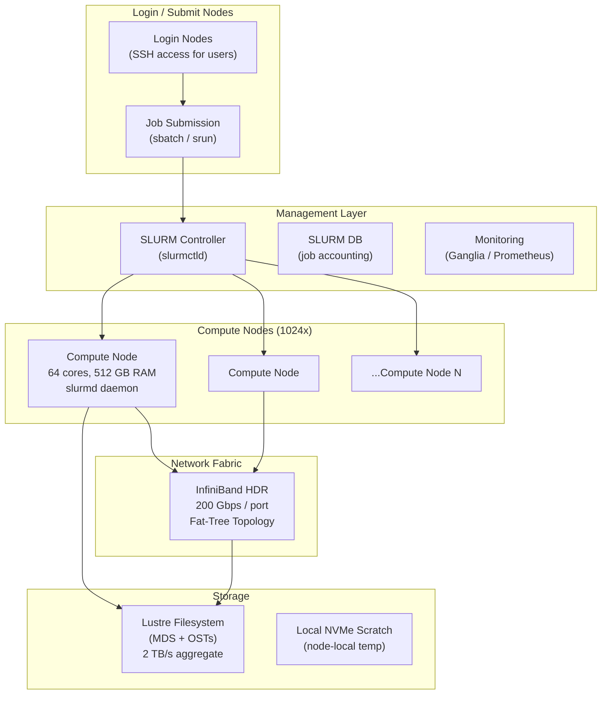
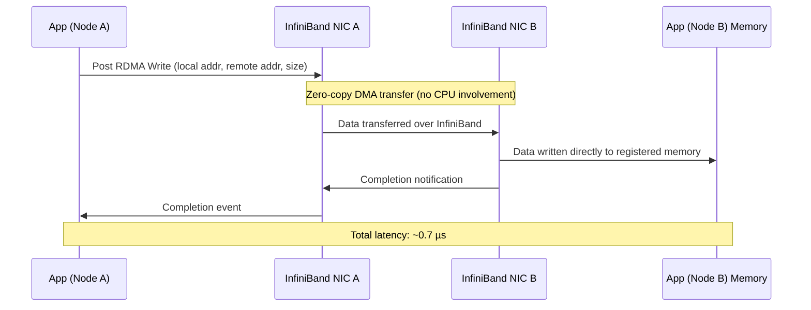

# Design an HPC Cluster for Massively Parallel Scientific Computation

**Difficulty**: 🔴 Advanced
**Reading Time**: 25 minutes
**Interview Frequency**: Medium — common at ML infrastructure, scientific computing, and national lab interviews

---

## Problem Statement

You are asked to design a High Performance Computing (HPC) cluster that:

- **Works at**: 10-node cluster — simple SSH + MPI handles molecular dynamics or fluid simulation.
- **Breaks at**: 1,000+ nodes with jobs running for days — job scheduling becomes unfair, node failures abort week-long runs, shared filesystem becomes a bottleneck, and network congestion kills performance.

Target scale: **1,024 compute nodes**, **100 Gbps InfiniBand interconnect**, **10 PB shared storage (Lustre)**, **1,000 concurrent jobs**, jobs ranging from 1 minute to 7 days.

---

## Requirements

### Functional Requirements

| Requirement | Description |
|-------------|-------------|
| Job Submission | Users submit batch jobs specifying nodes, walltime, memory |
| Job Scheduling | Fair allocation across users and projects |
| Parallel Execution | MPI programs communicate across nodes at < 1 µs latency |
| Shared Filesystem | All nodes access same data namespace |
| Fault Tolerance | Long jobs survive single node failures via checkpointing |
| Monitoring | Real-time node health, job status, utilization |

### Non-Functional Requirements

| Requirement | Target |
|-------------|--------|
| MPI Latency | < 1 µs message latency (InfiniBand RDMA) |
| Shared Filesystem Throughput | > 100 GB/s aggregate (Lustre striped) |
| Job Scheduler Throughput | 10,000 job submissions/day |
| Node Failure Recovery | Resume from checkpoint within 30 minutes |
| Cluster Utilization | > 85% average utilization |

---

## Capacity Estimates

- **1,024 nodes × 64 cores = 65,536 cores** available for computation
- **InfiniBand HDR (200 Gbps)**: bisection bandwidth ~100 Tbps for fat-tree topology
- **Lustre filesystem**: 1,000 storage targets × 2 GB/s each = **2 TB/s peak throughput**
- **Checkpoint size for typical job**: 500 GB state × 1,000 parallel jobs = up to **500 TB checkpoint storage**
- **SLURM daemon**: handles 10,000 nodes on a single slurmctld with < 1s scheduling cycle

---

## High-Level Architecture



---

## Level 1 — Surface: How HPC Differs from Cloud

| Dimension | Cloud (Kubernetes) | HPC Cluster |
|-----------|-------------------|-------------|
| Network latency | 50–100 µs (TCP) | 0.5–2 µs (RDMA/InfiniBand) |
| Communication model | Message passing via services | Direct RDMA memory access |
| Scheduling | Fine-grained (pod = 1 process) | Coarse-grained (job = 1–1024 nodes) |
| Workload type | Long-running services | Batch jobs (minutes to weeks) |
| Storage | Distributed object store (S3) | POSIX-compliant shared filesystem (Lustre) |
| Failure handling | Pod restart | Checkpoint + resume |

The key insight: HPC workloads are **tightly coupled** — all 1,024 MPI ranks must communicate synchronously. A single slow node (straggler) holds up the entire job. Cloud-style independent microservices don't have this constraint.

---

## Level 2 — Deep Dive: MPI and RDMA

### Message Passing Interface (MPI)

MPI is the standard API for parallel programs across nodes. Each process has a **rank** (0 to N-1). Processes communicate by sending and receiving messages.

```
// Rank 0 sends, Rank 1 receives (simplified)
if (rank == 0) {
    MPI_Send(&data, count, MPI_DOUBLE, 1, tag, MPI_COMM_WORLD);
} else if (rank == 1) {
    MPI_Recv(&data, count, MPI_DOUBLE, 0, tag, MPI_COMM_WORLD, &status);
}
// All ranks synchronize here
MPI_Barrier(MPI_COMM_WORLD);
```

### RDMA (Remote Direct Memory Access)

Standard TCP: sender CPU → kernel → NIC → network → NIC → kernel → receiver CPU (many copies)
RDMA: sender CPU writes directly to **remote memory**, bypassing both CPUs and kernels.



This is why InfiniBand + RDMA gives **10–100× lower latency** than TCP/IP for tightly-coupled parallel workloads.

---

## Key Design Decisions

### 1. InfiniBand vs. 100GbE Ethernet for Interconnect

| Criteria | InfiniBand HDR (200 Gbps) | RoCE (RDMA over Ethernet) |
|----------|--------------------------|--------------------------|
| Latency | 0.5–1 µs | 1–3 µs |
| Throughput | 200 Gbps/port | 100 Gbps/port |
| Cost | 3–5× more expensive | Lower cost, reuses Ethernet |
| RDMA support | Native | Yes (with lossless config) |
| Ecosystem | Mature HPC ecosystem | Growing, simpler ops |

**Decision**: Use InfiniBand for tightly-coupled simulations (< 2 µs requirement). Use RoCE for ML training clusters where 2–3 µs is acceptable.

### 2. Checkpointing Strategy for Long Jobs

Without checkpointing: a 7-day job fails on day 6 due to node failure → 6 days of compute wasted.

| Approach | Overhead | Restart Cost | Complexity |
|----------|----------|--------------|------------|
| **Application-level** | Low (custom logic) | Low (fine-grained) | High (developer burden) |
| **DMTCP (transparent)** | Medium (~5% runtime) | Medium (full restart) | Low (no code changes) |
| **Coordinated (BLCR)** | High (~10% runtime) | Low | Medium |

**Recommended**: Checkpoint every 1–2 hours for jobs > 6 hours. Store checkpoints to Lustre. On node failure, SLURM re-queues job with `--restart` flag pointing to latest checkpoint.

### 3. Job Scheduling: FIFO vs. Backfill vs. Fair-Share

| Policy | Fairness | Utilization | Starvation Risk |
|--------|----------|-------------|-----------------|
| **FIFO** | Low | Medium | High (small jobs wait behind large) |
| **Backfill** | Medium | High | Low (small jobs fill gaps) |
| **Fair-Share** | High | Medium | Very Low |

SLURM uses **backfill scheduling**: starts small jobs that fit in the gaps left by reserved slots for large jobs. This keeps utilization > 85% without starving large jobs.

---

## Interview Questions

| Question | What They're Testing | Key Answer Points |
|----------|---------------------|-------------------|
| Why use InfiniBand instead of regular Ethernet? | Network fundamentals | RDMA bypasses kernel, 0.5 µs vs. 50 µs latency, no CPU overhead for data transfer |
| How do you handle a node failure mid-job in a 1,000-node run? | Fault tolerance | Periodic checkpointing to shared storage, SLURM detects failed node, job re-queued from last checkpoint |
| How does SLURM achieve > 85% utilization? | Scheduling algorithms | Backfill scheduling fills gaps with smaller jobs, fair-share prevents hoarding, reservation for large jobs |

---

## 📚 Resources & References

| Resource | Type | What You'll Learn |
|----------|------|------------------|
| [Introduction to Parallel Computing — LLNL](https://hpc.llnl.gov/documentation/tutorials/introduction-parallel-computing-tutorial) | 📚 Docs | Parallel computing fundamentals, Flynn taxonomy, MPI basics |
| [MPI Tutorial](https://mpitutorial.com/) | 📖 Blog | Hands-on MPI programming with examples |
| [SLURM Documentation](https://slurm.schedmd.com/documentation.html) | 📚 Docs | Job scheduler internals, fair-share, backfill algorithms |
| [InfiniBand Architecture Overview](https://www.infinibandta.org/ibta-overview/) | 📖 Blog | RDMA, InfiniBand topology, HDR/NDR specs |
| [Hussein Nasser YouTube](https://www.youtube.com/@hnasr) | 📺 YouTube | Networking deep dives relevant to RDMA and low-latency systems |

---

## Related Concepts

- [Distributed File System](./distributed-file-system) — Lustre is a parallel distributed filesystem
- [Distributed Messaging](./distributed-messaging) — MPI collective operations vs. message queues
- [Load Balancer](./load-balancer) — HPC job schedulers solve similar resource allocation problems
