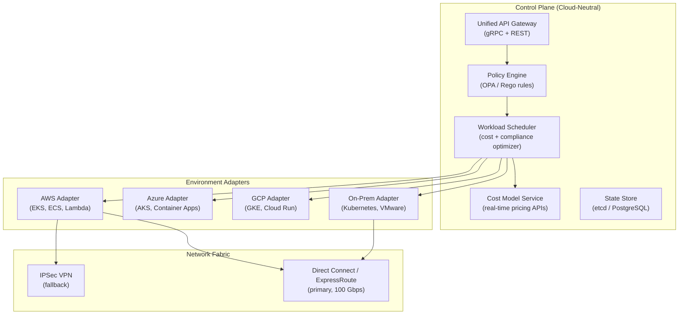
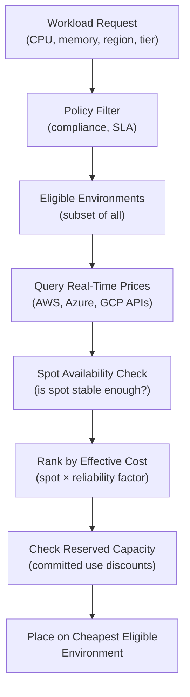
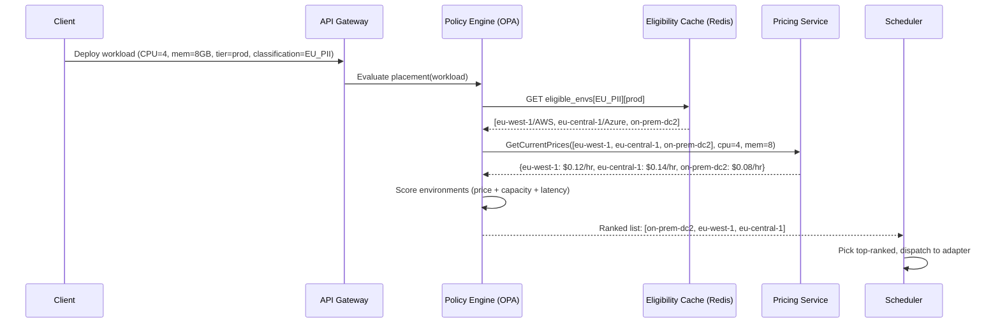
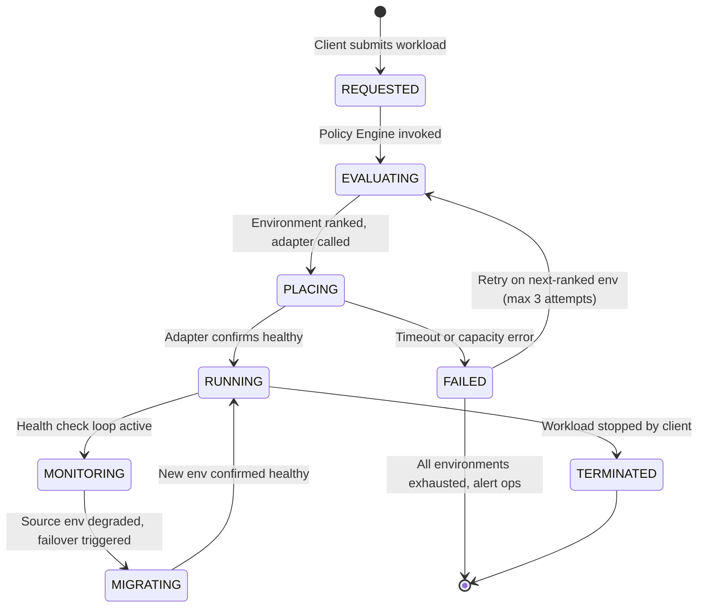
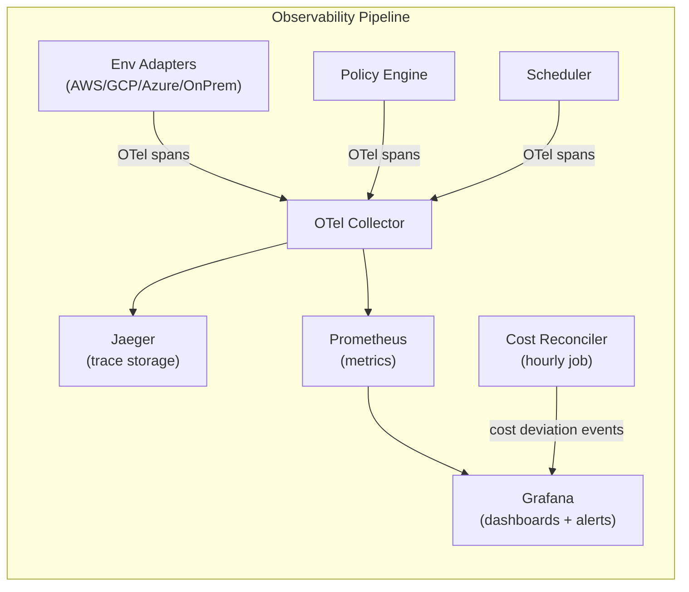

# Design a Hybrid Cloud Orchestrator — On-Premise + Multi-Cloud

**Difficulty**: 🔴 Advanced
**Reading Time**: 28 minutes
**Interview Frequency**: Medium — asked at enterprises, cloud consulting, and platform engineering interviews

---

## Problem Statement

You are asked to design a hybrid cloud orchestration platform that:

- **Works at**: One cloud provider, all workloads in cloud — a single control plane (Kubernetes, ECS) handles everything.
- **Breaks at**: Enterprise with existing on-premise data centers, compliance requirements for data residency, multi-cloud strategy to avoid vendor lock-in — workloads span AWS, Azure, GCP, and private DCs; engineers must manually decide placement; cost visibility is fragmented; failover between clouds is manual and error-prone.

Target: **Unified API** that routes workloads across 3+ clouds + 2 on-premise DCs, based on **cost, latency, compliance, and SLA** policies, with **automated cost optimization** saving 20–40% vs. ad hoc placement.

---

## Requirements

### Functional Requirements

| Requirement | Description |
|-------------|-------------|
| Unified API | Single API to deploy workloads across any environment |
| Policy Engine | Rules for cost, latency, compliance, data residency |
| Workload Scheduling | Place workloads on cheapest/fastest eligible environment |
| Cost Visibility | Unified cost dashboard across all clouds + on-prem |
| Failover | Automatically move workloads on environment failure |
| Network Connectivity | Secure tunnels between all environments |

### Non-Functional Requirements

| Requirement | Target |
|-------------|--------|
| Scheduling Decision Latency | < 2 seconds to compute optimal placement |
| Policy Evaluation Throughput | 1,000 placement decisions/minute |
| Cost Savings | 20–40% vs. default cloud pricing (via spot/reserved) |
| Network Latency (on-prem to cloud) | < 10 ms (Direct Connect) or < 50 ms (VPN) |
| Control Plane Availability | 99.9% (orchestrator failure doesn't stop running workloads) |

---

## Capacity Estimates

- **500 services** × 3 replicas × 5 environments = **7,500 running containers** to track
- **Policy evaluation**: 500 services × 10 rules each = 5,000 rule checks per placement decision
- **Cost model**: AWS on-demand vs. spot (70% cheaper for batch), reserved (40% cheaper for steady-state) → average savings of **30%** with smart scheduling
- **Network bandwidth**: 100 Gbps AWS Direct Connect per on-prem DC; 1–10 Gbps VPN fallback

---

## High-Level Architecture



---

## Level 1 — Surface: Why Multi-Cloud is Hard

| Challenge | On One Cloud | Multi-Cloud |
|-----------|-------------|-------------|
| Networking | Single VPC | VPN/DirectConnect between each pair |
| Identity | Single IAM | Federated identity (OIDC across clouds) |
| Cost visibility | Native billing | Aggregated billing via API per cloud |
| Deployment | One Kubernetes flavor | Multiple flavors with subtle differences |
| Data gravity | S3 in one region | Cross-cloud egress costs $0.08/GB |

**Data gravity** is the biggest challenge: once 100 TB of data is in AWS S3, moving to GCP costs $8,000 in egress fees and weeks of migration. Workloads follow data — not the other way around.

---

## Level 2 — Deep Dive: Policy Engine Design

The policy engine decides **which environment is eligible** for a given workload, then the scheduler picks the **cheapest eligible** option.

### Policy Types

```
// Example OPA policy (Rego language)

// Rule: EU customer data must stay in EU
allow_placement[env] {
  env := environments[_]
  input.workload.data_classification != "EU_PII"
}

allow_placement[env] {
  env := environments[_]
  env.region in {"eu-west-1", "eu-central-1", "eu-west-3"}
  input.workload.data_classification == "EU_PII"
}

// Rule: Batch jobs prefer spot instances
preferred_instance_type[instance_type] {
  input.workload.type == "batch"
  instance_type := "spot"
}

// Rule: Production workloads must have SLA >= 99.9%
allow_placement[env] {
  env := environments[_]
  input.workload.tier != "production"
}

allow_placement[env] {
  env := environments[_]
  env.sla_guarantee >= 0.999
  input.workload.tier == "production"
}
```

### Cost Optimization Algorithm



Spot instance reliability factor: AWS spot interruption rate < 5% for most instance types → treat spot as 95% reliable. For batch workloads that checkpoint, this is acceptable.

---

## Key Design Decisions

### 1. Centralized vs. Federated Control Plane

| Approach | Pros | Cons |
|----------|------|------|
| **Centralized** | Single pane of glass, easy policy enforcement | Control plane becomes single point of failure; latency for remote decisions |
| **Federated** | Each environment has local control plane; resilient | Complex policy sync, possible inconsistency |
| **Hybrid (recommended)** | Central for policy + scheduling; local for execution | Moderate complexity; control plane outage doesn't stop running workloads |

**Recommended**: Central orchestrator makes placement decisions; local Kubernetes in each environment executes them. Running workloads don't depend on central orchestrator availability.

### 2. Network Interconnect Strategy

| Connectivity | Latency | Bandwidth | Cost | Use Case |
|-------------|---------|-----------|------|----------|
| **Public Internet** | 50–200 ms | Variable | Free | Non-sensitive, latency-tolerant |
| **IPSec VPN** | 20–50 ms | 1–10 Gbps | Low | Dev/test, fallback |
| **Direct Connect / ExpressRoute** | 1–10 ms | 10–100 Gbps | Medium | Production, data-intensive |
| **SD-WAN overlay** | 5–20 ms | Dynamic | Variable | Flexible enterprise routing |

### 3. Handling Cloud Provider Outages

When AWS us-east-1 is down, the orchestrator must automatically detect and move eligible workloads to GCP or on-prem.

Challenges:
- Stateful services cannot move without data migration
- DNS propagation takes 60–120 seconds
- Application may not be configured for multi-cloud (e.g., uses SQS directly)

**Strategy**: Only stateless, cloud-portable workloads (containerized with no cloud-specific API calls) are candidates for cross-cloud failover. Stateful services require pre-provisioned hot standby in DR cloud.

---

## Interview Questions

| Question | What They're Testing | Key Answer Points |
|----------|---------------------|-------------------|
| How do you handle data residency requirements for GDPR? | Compliance awareness | Policy engine tags workloads with data classification; EU_PII workloads filtered to EU-region environments only; audited at placement time |
| How do you prevent vendor lock-in while using cloud-native services? | Pragmatic engineering | Abstract behind adapter pattern; use cloud-agnostic layers (Kubernetes, Terraform) for infrastructure; accept some lock-in for non-critical services |
| How does cost optimization actually save 30%? | Understanding cloud pricing | Spot for batch (70% cheaper), reserved instances for steady-state (40% cheaper), right-sizing via utilization monitoring, idle resource cleanup |

---

## Component Deep Dive 1: Policy Engine

The Policy Engine is the most critical architectural component in a hybrid cloud orchestrator. Every placement decision — where a workload runs, which region, which instance type — flows through it. Getting it wrong causes GDPR violations, unexpected $500k cloud bills, or SLA breaches on production services.

### How It Works Internally

The policy engine evaluates a workload request against a set of rules organized into three layers:

1. **Hard constraints (blocklist)**: Rules that eliminate environments entirely. Examples: EU_PII data must not touch non-EU regions; HIPAA workloads must not run on shared multi-tenant infra; production workloads require SLA >= 99.9%.
2. **Soft constraints (scoring)**: Rules that score remaining environments. Examples: prefer environments with committed-use discounts; prefer environments where data already lives (avoid egress); prefer environments with current excess capacity.
3. **Override rules**: Operator-level manual overrides that bypass soft constraints for specific named workloads (e.g., "always run payment-processor on on-prem-dc1").

OPA (Open Policy Agent) with Rego is the industry-standard choice for implementing layers 1 and 3. It provides a declarative language, auditability (every decision is logged with the policy that triggered it), and hot-reload of policies without restarting the engine.

### Why Naive Approaches Fail at Scale

A naive implementation evaluates all rules serially for each placement request. At 500 services × 5 environments × 10 rules each, that is 25,000 rule evaluations per global scheduling cycle. When each rule involves a network call to check real-time spot pricing, this becomes 25,000 HTTP calls — taking 30–60 seconds per cycle, making the scheduler effectively useless for reactive scaling.

The fix is a three-step pipeline:
- **Pre-compute environment eligibility** once per minute (hard constraint results don't change minute-to-minute)
- **Cache spot pricing** with a 30-second TTL from the cloud pricing APIs
- **Evaluate soft constraints** only against the already-filtered eligible set (typically 2–3 environments, not all 5)

This reduces per-placement evaluation from 10,000 ms to under 200 ms.

### Policy Engine Internals Sequence



### Policy Engine Implementation Options

| Approach | Latency | Throughput | Trade-off |
|----------|---------|------------|-----------|
| **OPA + Rego (interpreted)** | 5–50 ms/decision | 2,000 decisions/sec | Best for dynamic rule updates; Rego learning curve; no compile step |
| **Compiled rules (Go code gen)** | 0.5–5 ms/decision | 50,000 decisions/sec | Fastest; requires redeploy on rule change; loses auditability |
| **Rules engine (Drools/Esper)** | 10–100 ms/decision | 500 decisions/sec | Good for complex event patterns; JVM overhead; complex DSL |

**Recommended**: OPA with Rego for policy evaluation + Redis caching of hard-constraint results. OPA's decision log provides the audit trail required for GDPR and HIPAA compliance.

---

## Component Deep Dive 2: Workload Scheduler

The Workload Scheduler receives a ranked list of eligible environments from the Policy Engine and converts it into actual API calls to cloud provider adapters. Its job sounds simple — pick the top environment and call the right API — but at scale it becomes a distributed systems problem.

### Internal Mechanics

The scheduler maintains a **placement state machine** for every workload:

```
REQUESTED → EVALUATING → PLACING → RUNNING → MONITORING → MIGRATING → TERMINATED
```

Each transition is persisted to the state store (etcd or PostgreSQL) before the action is taken, so a scheduler crash mid-placement can be recovered by a new leader reading the last committed state.

**Optimistic placement with rollback**: When the scheduler dispatches a workload to, say, AWS EKS, it marks the workload as PLACING and starts a timeout timer. If the adapter hasn't confirmed RUNNING within 120 seconds (configurable per environment), the scheduler marks it as FAILED and retries on the next-ranked environment. This handles the common case where a spot instance pool is advertised as available but the actual request fails with InsufficientCapacityException.

### Scale Behavior at 10x Load

At baseline (500 services), the scheduler makes ~100 placement decisions per minute during a typical rolling deploy. At 10x load (5,000 services, or a large-scale DR event), the scheduling queue can back up if each placement decision involves sequential environment probing.

The mitigation is **parallel placement with semaphore control**: the scheduler processes up to 200 placements concurrently, with per-environment rate limiting (AWS API allows ~100 calls/sec before throttling begins). Batch operations are used where the cloud API supports them (e.g., AWS RunInstances supports launching multiple instances in one call).

### Scheduler State Diagram



### Scheduler Implementation Options

| Approach | Fault Tolerance | Latency Added | Complexity |
|----------|-----------------|---------------|------------|
| **Single leader (etcd lock)** | ~30s failover on crash | Minimal | Low — standard leader election |
| **Active-active with sharding** | Zero downtime | 5–10 ms coordination | High — consistent hashing on workload ID |
| **Queue-based (Kafka)** | Messages persist across crashes | 50–200 ms queue lag | Medium — natural at-least-once delivery |

**Recommended**: Single leader with etcd-based election for control plane decisions; Kafka for durable placement event log (audit + replay).

---

## Component Deep Dive 3: Environment Adapters and Network Fabric

Each cloud provider has a completely different API surface, authentication model, and resource naming scheme. Environment Adapters are thin translation layers that expose a uniform internal interface to the Scheduler while handling provider-specific idiosyncrasies.

### Adapter Interface (Internal)

Every adapter must implement:

```
PlaceWorkload(workload Workload) → PlacementResult
TerminateWorkload(workloadID string) → error
GetStatus(workloadID string) → WorkloadStatus
GetCurrentCapacity(region string) → CapacityReport
GetPricingEstimate(resources Resources, duration Duration) → CostEstimate
```

This abstraction lets the Scheduler treat AWS EKS and on-prem Kubernetes identically. The adapter handles the impedance mismatch — for example, AWS requires explicit IAM role assumption before API calls, GCP uses Workload Identity Federation, and on-prem uses mTLS certificates.

### What Breaks at Scale

The biggest failure mode is **API rate limiting**. AWS EC2 API has a default limit of 100 DescribeInstances calls per second per account. At 7,500 running containers being monitored every 30 seconds, a naive poller makes 250 status calls per second — immediately hitting limits. The solution is event-driven status updates (subscribe to AWS CloudWatch Events or GCP Pub/Sub notifications for container state changes) instead of polling, reducing API calls by 95%.

### Network Fabric Technical Decisions

Direct Connect between on-prem and AWS carries 100 Gbps but costs ~$250/month per Gbps of port capacity. At 10 Gbps dedicated, that is $2,500/month just for the interconnect, before data transfer fees. This means the orchestrator must include **data placement awareness** in the cost model — moving a 1 TB dataset from on-prem to AWS might cost less in bandwidth than the $80 egress fee to pull it back for a workload that needs to run in GCP.

IPSec VPN as fallback adds 20–50 ms latency over Direct Connect's 1–10 ms, which is acceptable for control plane traffic (policy syncs, state updates) but not for latency-sensitive application data.

---

## Data Model

```sql
-- Core workload registry
CREATE TABLE workloads (
  workload_id       UUID PRIMARY KEY DEFAULT gen_random_uuid(),
  name              VARCHAR(255) NOT NULL,
  owner_team        VARCHAR(100) NOT NULL,
  tier              VARCHAR(20) NOT NULL CHECK (tier IN ('production','staging','batch','dev')),
  data_classification VARCHAR(50) NOT NULL CHECK (data_classification IN ('PUBLIC','INTERNAL','EU_PII','HIPAA','PCI')),
  cpu_request_m     INTEGER NOT NULL,          -- millicores (1000m = 1 vCPU)
  mem_request_mb    INTEGER NOT NULL,
  min_replicas      SMALLINT NOT NULL DEFAULT 1,
  max_replicas      SMALLINT NOT NULL DEFAULT 10,
  required_sla      NUMERIC(6,4),              -- e.g., 0.999 for 99.9%
  status            VARCHAR(30) NOT NULL DEFAULT 'REQUESTED',
  created_at        TIMESTAMPTZ DEFAULT now(),
  updated_at        TIMESTAMPTZ DEFAULT now()
);

-- Current placement (where each workload replica is running)
CREATE TABLE workload_placements (
  placement_id      UUID PRIMARY KEY DEFAULT gen_random_uuid(),
  workload_id       UUID NOT NULL REFERENCES workloads(workload_id),
  environment_id    VARCHAR(100) NOT NULL,    -- e.g., 'aws-us-east-1', 'on-prem-dc1'
  cloud_provider    VARCHAR(20) NOT NULL,     -- 'AWS', 'GCP', 'AZURE', 'ON_PREM'
  region            VARCHAR(50) NOT NULL,
  instance_type     VARCHAR(50),             -- e.g., 'm5.xlarge', 'spot'
  replica_count     SMALLINT NOT NULL,
  status            VARCHAR(30) NOT NULL,
  placed_at         TIMESTAMPTZ DEFAULT now(),
  cost_per_hour_usd NUMERIC(10,4),
  UNIQUE (workload_id, environment_id)
);
CREATE INDEX idx_placements_env ON workload_placements(environment_id, status);
CREATE INDEX idx_placements_workload ON workload_placements(workload_id);

-- Policy rules registry
CREATE TABLE policy_rules (
  rule_id           UUID PRIMARY KEY DEFAULT gen_random_uuid(),
  rule_name         VARCHAR(200) NOT NULL UNIQUE,
  rule_type         VARCHAR(30) NOT NULL CHECK (rule_type IN ('HARD_CONSTRAINT','SOFT_SCORE','OVERRIDE')),
  rego_body         TEXT NOT NULL,             -- OPA Rego policy fragment
  priority          INTEGER NOT NULL DEFAULT 100,
  is_active         BOOLEAN NOT NULL DEFAULT TRUE,
  last_modified_by  VARCHAR(100),
  last_modified_at  TIMESTAMPTZ DEFAULT now()
);

-- Environment registry (all known clouds + on-prem)
CREATE TABLE environments (
  environment_id    VARCHAR(100) PRIMARY KEY,  -- 'aws-eu-west-1', 'on-prem-dc1'
  cloud_provider    VARCHAR(20) NOT NULL,
  region            VARCHAR(50) NOT NULL,
  sla_guarantee     NUMERIC(6,4),
  is_active         BOOLEAN NOT NULL DEFAULT TRUE,
  connectivity_type VARCHAR(20),               -- 'DIRECT_CONNECT', 'VPN', 'INTERNET'
  max_capacity_cpu_m  BIGINT,
  max_capacity_mem_mb BIGINT,
  last_health_check TIMESTAMPTZ
);

-- Placement decision audit log (append-only, never delete)
CREATE TABLE placement_audit_log (
  log_id            BIGSERIAL PRIMARY KEY,
  workload_id       UUID NOT NULL,
  decision_at       TIMESTAMPTZ DEFAULT now(),
  ranked_environments JSONB NOT NULL,          -- [{env_id, score, cost, reason}]
  selected_environment VARCHAR(100) NOT NULL,
  policy_version    VARCHAR(50),
  decision_latency_ms INTEGER
);
CREATE INDEX idx_audit_workload ON placement_audit_log(workload_id, decision_at DESC);

-- Cost tracking (materialized per hour for billing)
CREATE TABLE cost_snapshots (
  snapshot_id       BIGSERIAL PRIMARY KEY,
  workload_id       UUID NOT NULL,
  environment_id    VARCHAR(100) NOT NULL,
  snapshot_hour     TIMESTAMPTZ NOT NULL,       -- truncated to hour
  cost_usd          NUMERIC(12,6) NOT NULL,
  instance_type     VARCHAR(50),
  pricing_model     VARCHAR(20),               -- 'ON_DEMAND', 'SPOT', 'RESERVED'
  PRIMARY KEY (workload_id, environment_id, snapshot_hour)
);
CREATE INDEX idx_cost_by_env ON cost_snapshots(environment_id, snapshot_hour DESC);
```

---

## Scale Bottlenecks

| Traffic Level | Component That Breaks | Symptoms | Mitigation |
|---------------|----------------------|----------|------------|
| **10x baseline** (5,000 containers) | Environment adapter polling | AWS API rate limit errors (429); status updates lag by minutes | Switch to event-driven status (CloudWatch Events / GCP Pub/Sub); increase API rate limit quotas via AWS support ticket |
| **10x baseline** | Policy Engine cache | Cache miss storm on restart; 200 ms decisions spike to 8 seconds | Pre-warm eligibility cache on startup from DB; use read replicas; add L1 in-process cache (Caffeine/Ristretto) |
| **100x baseline** (50,000 containers) | State store (etcd / PostgreSQL) | Write amplification; placement audit log writes become bottleneck (50k rows/min) | Shard audit log to time-series store (TimescaleDB or ClickHouse); etcd → Postgres for large state |
| **100x baseline** | Network fabric (Direct Connect) | Saturate 10 Gbps port; cross-cloud data transfers spike to $80k/month | Add second Direct Connect port; implement data locality scoring (penalize cross-cloud workload placement); compress telemetry traffic |
| **1000x baseline** (500,000 containers) | Scheduler single leader | Single Go process can route ~2,000 placements/sec; queue grows unbounded | Shard scheduler by workload namespace or team; multiple leaders with consistent hashing on workload_id; each leader owns 1/N of the workload space |
| **1000x baseline** | Policy Engine (OPA) | Rego evaluation becomes CPU-bound at 50,000 decisions/sec | Pre-compile hot policies to native code; horizontally scale OPA as stateless fleet behind load balancer |

---

## How Google Built Anthos

Google's Anthos (launched 2019) is the most complete production implementation of a hybrid cloud orchestrator at scale. By 2023, it managed workloads across Google Cloud, AWS, Azure, and on-premise data centers for enterprises including Deutsche Bank, Maersk, and KeyCorp.

**Technology choices**: Anthos uses GKE (Google Kubernetes Engine) as the base execution layer in every environment, including on-premise. For on-prem, Google ships pre-configured hardware clusters (Anthos clusters on bare metal) or supports user-managed VMware vSphere clusters. The control plane runs in Google Cloud, providing a single-pane-of-glass console — the exact centralized + federated hybrid model described in this article.

**Specific numbers**: Anthos supports up to 1,500 nodes per cluster and up to 15,000 pods per cluster. Workload placement policy evaluation completes in under 500 ms for up to 200 concurrent rules. Config Connector (the policy/configuration management layer) syncs Kubernetes resource state to Google Cloud APIs within 10–30 seconds.

**Non-obvious architectural decision**: Google chose to make the control plane cloud-hosted (not on-prem installable). This was controversial with regulated enterprise customers who wanted an air-gapped on-prem control plane. Google's solution was **Connected Reconciler** — an agent running in the on-prem cluster that polls the cloud control plane over an outbound HTTPS connection. This avoids inbound firewall rules to on-prem (which security teams refuse) while still providing centralized management. The trade-off: the on-prem cluster operates in degraded mode (executing last-known-good policies, no new placements) when the outbound connection to Google Cloud is interrupted.

**Policy engine**: Anthos uses **Config Sync** (based on GitOps, not OPA) to distribute policies. Policies are written as Kubernetes Custom Resources, validated with **Policy Controller** (which is an OPA Gatekeeper wrapper), and synced from a central Git repository to every cluster. This means policy changes go through Git PRs, providing built-in approval workflow and audit log — a significant enterprise compliance advantage over direct API-based policy updates.

Source: [Google Cloud Next 2022 — Anthos Architecture Deep Dive](https://cloud.google.com/blog/topics/anthos) and [Anthos technical whitepaper](https://cloud.google.com/anthos/docs/concepts/overview).

---

## Interview Angle

**What the interviewer is testing:** Your ability to design a system that spans organizational and technical boundaries — handling heterogeneous APIs, regulatory constraints, and cost optimization simultaneously without over-engineering the control plane.

**Common mistakes candidates make:**

1. **Designing the control plane as a single monolithic service.** Candidates often propose one service that "does it all" — evaluates policies, schedules workloads, monitors health, tracks costs. At scale this creates a single bottleneck and a catastrophic blast radius if it fails. The correct design separates concerns: stateless policy evaluation, stateful scheduler with leader election, read-heavy cost model service, and append-only audit log.

2. **Ignoring data gravity in the cost model.** Candidates compute scheduling cost as "instance price only" and route everything to the cheapest spot instance. This ignores cross-cloud egress at $0.08–$0.12/GB. A 10 TB workload moved from AWS to GCP to save $0.02/hour on compute costs $800+ in egress fees — a months-long payback. The scheduler must include data transfer cost in the placement score.

3. **Assuming all workloads are stateless and portable.** Candidates propose automatic cross-cloud failover for all workloads. In reality, ~70% of enterprise workloads have some cloud-provider affinity (use SQS, read from S3, write to RDS) and cannot move without code changes. The system must classify workloads into "portable" vs. "anchored" at registration time and restrict automatic failover to portable workloads only.

**The insight that separates good from great answers:** The orchestrator should not try to solve data migration — it should make data migration unnecessary by co-locating compute with data. The policy engine should include a **data gravity rule**: given equal cost and compliance eligibility, always prefer the environment where the workload's primary data source already lives. This avoids egress costs and solves the "why did my cost optimization feature make my bill 3x higher?" problem that naive implementations create.

---

## Key Numbers to Remember

| Metric | Value | Context |
|--------|-------|---------|
| Policy evaluation latency (cached) | < 50 ms | With Redis eligibility cache hit; 200 ms without cache |
| Policy evaluation latency (cold) | 200–800 ms | First request after restart; triggers OPA + 3 pricing API calls |
| Max placement decisions per minute | 1,000/min | Single OPA instance; 5,000/min with horizontal scaling (5 replicas) |
| AWS Direct Connect latency | 1–10 ms | On-prem to AWS us-east-1; vs. 20–50 ms for IPSec VPN |
| Cross-cloud egress cost | $0.08–$0.12/GB | AWS, GCP, Azure standard egress pricing (2024) |
| Spot instance discount | 60–90% | vs. on-demand; interruption rate < 5% for most instance families |
| Reserved instance discount | 30–40% | 1-year commitment; 50–60% for 3-year |
| Scheduling state recovery time | < 30 seconds | etcd leader election + state replay after control plane crash |
| Anthos cluster max nodes | 1,500 nodes | Per GKE cluster; 15,000 pods per cluster |
| Direct Connect bandwidth | 10–100 Gbps | Dedicated port pricing ~$250/month per Gbps |

---

## Common Failure Modes

| Failure | Trigger | Impact | Detection | Recovery |
|---------|---------|--------|-----------|----------|
| **Policy cache stale** | Redis OOM eviction during traffic spike | Workloads placed in wrong region; GDPR violation | Policy audit log shows EU_PII placed in us-east-1 | Add Redis memory alerts at 70%; persist eligibility to Postgres as fallback; set `maxmemory-policy allkeys-lru` |
| **Cloud pricing API timeout** | AWS/GCP pricing endpoint latency spike | Scheduler uses stale prices; cost savings degrade | Cost model P99 latency alert > 2s | Cache last-known-good price with 10-min TTL; degrade gracefully to cached prices rather than blocking placement |
| **Environment adapter auth expiry** | IAM role credentials expire (default 1-hour STS tokens) | All placements to that cloud fail with 403 | Adapter health check fails; scheduler routes around it | Pre-refresh credentials at 50-minute mark; alert on consecutive 401/403 from adapter |
| **Network partition (on-prem to cloud)** | Direct Connect BGP session drop | On-prem workloads unreachable from cloud consumers | BGP route withdrawal; health check failures | Automatic VPN fallback within 30 seconds; alert ops on Direct Connect BGP down |
| **Scheduler leader crash during placement** | OOM or process crash mid-PLACING transition | Workload stuck in PLACING state forever; resource leaked in cloud | Watchdog detects no state transition for > 5 minutes | Fencing timeout: any workload in PLACING > 120s is rolled back; new leader re-evaluates from REQUESTED |

---

## 📚 Resources & References

| Resource | Type | What You'll Learn |
|----------|------|------------------|
| [Google Anthos Overview](https://cloud.google.com/anthos/docs/concepts/overview) | 📚 Docs | Production hybrid cloud architecture from Google |
| [AWS Outposts](https://aws.amazon.com/outposts/) | 📚 Docs | AWS hardware on-premise — hybrid cloud approach |
| [Martin Fowler — Strangler Fig](https://martinfowler.com/bliki/StranglerFigApplication.html) | 📖 Blog | Incremental migration pattern for moving to cloud |
| [ByteByteGo YouTube](https://www.youtube.com/@ByteByteGo) | 📺 YouTube | Multi-cloud architecture patterns and trade-offs |

---

## Observability Strategy

A hybrid cloud orchestrator that spans 5+ environments is impossible to debug without structured observability. Three signals matter most:

**1. Placement Decision Trace**: Every call through `API → Policy Engine → Scheduler → Adapter` must emit a trace with the workload ID as the root span. Distributed tracing (OpenTelemetry + Jaeger) lets you answer "why was this workload placed on on-prem-dc1 instead of AWS?" within seconds from a single trace view.

**2. Cost Deviation Alert**: The cost model produces an estimate at placement time. A separate reconciliation job runs hourly, compares actual cloud billing data (pulled via AWS Cost Explorer API, GCP Billing API) against estimates, and alerts when actual cost exceeds estimate by more than 15%. This catches cases where spot interruptions caused unplanned re-placements to expensive on-demand instances.

**3. Environment Health Score**: Each adapter publishes a health score (0–100) every 30 seconds based on: API response time, error rate, capacity utilization, and recent spot interruption rate. The scheduler uses this score as a tie-breaker between equally-priced environments — prefer the one with health score > 80 over a cheaper but degraded environment. This prevents the scheduler from funneling 500 workloads into a region that is 10% slower and about to have an incident.



Key metrics to track per environment:
- `placement_latency_ms` — histogram, p50/p99
- `policy_evaluation_latency_ms` — histogram, p50/p99
- `placement_success_rate` — counter by environment
- `spot_interruption_rate` — gauge per instance family
- `cost_actual_vs_estimate_ratio` — gauge per workload tier
- `environment_health_score` — gauge per environment_id

---

## Security Considerations

Hybrid cloud orchestrators are high-value attack targets: compromise the control plane and an attacker can redirect workloads, exfiltrate placement audit logs (which reveal your entire infrastructure topology), or disable compliance rules silently.

**Credential isolation**: Each environment adapter holds credentials only for its own cloud account. The scheduler never holds cloud credentials directly — it calls adapters over mTLS-authenticated internal RPC. If the scheduler process is compromised, the attacker cannot directly call AWS/GCP APIs.

**Policy tamper detection**: Policy rules stored in the database must be signed (HMAC-SHA256 with a KMS-managed key) at write time and verified at read time. Any unsigned or signature-mismatched rule is rejected and an alert is raised. This prevents a database-level attacker from silently removing a GDPR constraint.

**Placement audit log integrity**: The `placement_audit_log` table is append-only (achieved via PostgreSQL row-level security: `GRANT INSERT` only, never `UPDATE/DELETE`). A separate periodic job computes a SHA-256 hash chain over all log rows and stores the rolling hash in a separate tamper-evident store (e.g., AWS QLDB). This provides a cryptographic proof that audit records were not retroactively altered.

**Principle of least privilege for adapters**: The AWS adapter IAM role should only have permissions for the specific actions it needs: `ec2:RunInstances`, `ec2:TerminateInstances`, `ec2:DescribeInstances`, `eks:CreateNodegroup`. It must not have `iam:*`, `s3:*`, or `cloudformation:*`. Use AWS Service Control Policies (SCPs) at the organization level to enforce this boundary even if the adapter role is misconfigured. Rotate adapter credentials every 24 hours using AWS Secrets Manager automatic rotation; store the rotation schedule in the environment registry so the scheduler knows when a credential refresh is in progress and can retry rather than fail fast.

---

## TL;DR — Five Things to Remember

1. **Separate policy evaluation from scheduling**: Policy Engine (OPA) answers "which environments are eligible?" — Scheduler answers "which eligible environment is cheapest right now?" Mixing them creates an untestable monolith.
2. **Data gravity beats compute price**: A workload should almost always run where its data lives. Cross-cloud egress at $0.08–$0.12/GB erases spot savings in hours for data-intensive jobs.
3. **Only stateless workloads get automatic failover**: ~70% of enterprise workloads have cloud-provider affinity. Classify at registration time; do not promise cross-cloud failover for anchored workloads.
4. **Cache hard-constraint results, not soft scores**: Compliance rules (EU_PII → EU only) change infrequently — cache them for 60 seconds. Real-time spot prices change every 30 seconds — always fetch fresh.
5. **The control plane failure must not stop running workloads**: Local Kubernetes in each environment keeps running even when the central orchestrator is unreachable. Design for degraded-mode operations from day one.

---

## Related Concepts

- [Container Orchestration](./container-orchestration) — Kubernetes is the execution layer in each environment
- [Multi-Cloud API Gateway](./multi-cloud-api-gateway) — routing traffic across clouds
- [Disaster Recovery](./disaster-recovery) — cross-cloud failover is a DR scenario
