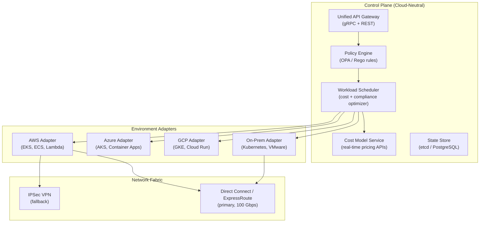
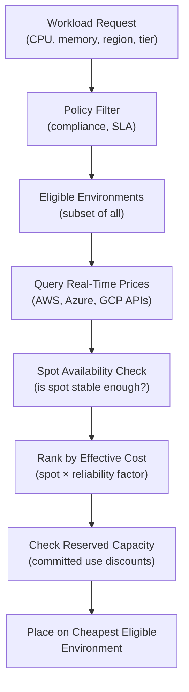

# Design a Hybrid Cloud Orchestrator — On-Premise + Multi-Cloud

**Difficulty**: 🔴 Advanced
**Reading Time**: 28 minutes
**Interview Frequency**: Medium — asked at enterprises, cloud consulting, and platform engineering interviews

---

## Problem Statement

You are asked to design a hybrid cloud orchestration platform that:

- **Works at**: One cloud provider, all workloads in cloud — a single control plane (Kubernetes, ECS) handles everything.
- **Breaks at**: Enterprise with existing on-premise data centers, compliance requirements for data residency, multi-cloud strategy to avoid vendor lock-in — workloads span AWS, Azure, GCP, and private DCs; engineers must manually decide placement; cost visibility is fragmented; failover between clouds is manual and error-prone.

Target: **Unified API** that routes workloads across 3+ clouds + 2 on-premise DCs, based on **cost, latency, compliance, and SLA** policies, with **automated cost optimization** saving 20–40% vs. ad hoc placement.

---

## Requirements

### Functional Requirements

| Requirement | Description |
|-------------|-------------|
| Unified API | Single API to deploy workloads across any environment |
| Policy Engine | Rules for cost, latency, compliance, data residency |
| Workload Scheduling | Place workloads on cheapest/fastest eligible environment |
| Cost Visibility | Unified cost dashboard across all clouds + on-prem |
| Failover | Automatically move workloads on environment failure |
| Network Connectivity | Secure tunnels between all environments |

### Non-Functional Requirements

| Requirement | Target |
|-------------|--------|
| Scheduling Decision Latency | < 2 seconds to compute optimal placement |
| Policy Evaluation Throughput | 1,000 placement decisions/minute |
| Cost Savings | 20–40% vs. default cloud pricing (via spot/reserved) |
| Network Latency (on-prem to cloud) | < 10 ms (Direct Connect) or < 50 ms (VPN) |
| Control Plane Availability | 99.9% (orchestrator failure doesn't stop running workloads) |

---

## Capacity Estimates

- **500 services** × 3 replicas × 5 environments = **7,500 running containers** to track
- **Policy evaluation**: 500 services × 10 rules each = 5,000 rule checks per placement decision
- **Cost model**: AWS on-demand vs. spot (70% cheaper for batch), reserved (40% cheaper for steady-state) → average savings of **30%** with smart scheduling
- **Network bandwidth**: 100 Gbps AWS Direct Connect per on-prem DC; 1–10 Gbps VPN fallback

---

## High-Level Architecture



---

## Level 1 — Surface: Why Multi-Cloud is Hard

| Challenge | On One Cloud | Multi-Cloud |
|-----------|-------------|-------------|
| Networking | Single VPC | VPN/DirectConnect between each pair |
| Identity | Single IAM | Federated identity (OIDC across clouds) |
| Cost visibility | Native billing | Aggregated billing via API per cloud |
| Deployment | One Kubernetes flavor | Multiple flavors with subtle differences |
| Data gravity | S3 in one region | Cross-cloud egress costs $0.08/GB |

**Data gravity** is the biggest challenge: once 100 TB of data is in AWS S3, moving to GCP costs $8,000 in egress fees and weeks of migration. Workloads follow data — not the other way around.

---

## Level 2 — Deep Dive: Policy Engine Design

The policy engine decides **which environment is eligible** for a given workload, then the scheduler picks the **cheapest eligible** option.

### Policy Types

```
// Example OPA policy (Rego language)

// Rule: EU customer data must stay in EU
allow_placement[env] {
  env := environments[_]
  input.workload.data_classification != "EU_PII"
}

allow_placement[env] {
  env := environments[_]
  env.region in {"eu-west-1", "eu-central-1", "eu-west-3"}
  input.workload.data_classification == "EU_PII"
}

// Rule: Batch jobs prefer spot instances
preferred_instance_type[instance_type] {
  input.workload.type == "batch"
  instance_type := "spot"
}

// Rule: Production workloads must have SLA >= 99.9%
allow_placement[env] {
  env := environments[_]
  input.workload.tier != "production"
}

allow_placement[env] {
  env := environments[_]
  env.sla_guarantee >= 0.999
  input.workload.tier == "production"
}
```

### Cost Optimization Algorithm



Spot instance reliability factor: AWS spot interruption rate < 5% for most instance types → treat spot as 95% reliable. For batch workloads that checkpoint, this is acceptable.

---

## Key Design Decisions

### 1. Centralized vs. Federated Control Plane

| Approach | Pros | Cons |
|----------|------|------|
| **Centralized** | Single pane of glass, easy policy enforcement | Control plane becomes single point of failure; latency for remote decisions |
| **Federated** | Each environment has local control plane; resilient | Complex policy sync, possible inconsistency |
| **Hybrid (recommended)** | Central for policy + scheduling; local for execution | Moderate complexity; control plane outage doesn't stop running workloads |

**Recommended**: Central orchestrator makes placement decisions; local Kubernetes in each environment executes them. Running workloads don't depend on central orchestrator availability.

### 2. Network Interconnect Strategy

| Connectivity | Latency | Bandwidth | Cost | Use Case |
|-------------|---------|-----------|------|----------|
| **Public Internet** | 50–200 ms | Variable | Free | Non-sensitive, latency-tolerant |
| **IPSec VPN** | 20–50 ms | 1–10 Gbps | Low | Dev/test, fallback |
| **Direct Connect / ExpressRoute** | 1–10 ms | 10–100 Gbps | Medium | Production, data-intensive |
| **SD-WAN overlay** | 5–20 ms | Dynamic | Variable | Flexible enterprise routing |

### 3. Handling Cloud Provider Outages

When AWS us-east-1 is down, the orchestrator must automatically detect and move eligible workloads to GCP or on-prem.

Challenges:
- Stateful services cannot move without data migration
- DNS propagation takes 60–120 seconds
- Application may not be configured for multi-cloud (e.g., uses SQS directly)

**Strategy**: Only stateless, cloud-portable workloads (containerized with no cloud-specific API calls) are candidates for cross-cloud failover. Stateful services require pre-provisioned hot standby in DR cloud.

---

## Interview Questions

| Question | What They're Testing | Key Answer Points |
|----------|---------------------|-------------------|
| How do you handle data residency requirements for GDPR? | Compliance awareness | Policy engine tags workloads with data classification; EU_PII workloads filtered to EU-region environments only; audited at placement time |
| How do you prevent vendor lock-in while using cloud-native services? | Pragmatic engineering | Abstract behind adapter pattern; use cloud-agnostic layers (Kubernetes, Terraform) for infrastructure; accept some lock-in for non-critical services |
| How does cost optimization actually save 30%? | Understanding cloud pricing | Spot for batch (70% cheaper), reserved instances for steady-state (40% cheaper), right-sizing via utilization monitoring, idle resource cleanup |

---

## 📚 Resources & References

| Resource | Type | What You'll Learn |
|----------|------|------------------|
| [Google Anthos Overview](https://cloud.google.com/anthos/docs/concepts/overview) | 📚 Docs | Production hybrid cloud architecture from Google |
| [AWS Outposts](https://aws.amazon.com/outposts/) | 📚 Docs | AWS hardware on-premise — hybrid cloud approach |
| [Martin Fowler — Strangler Fig](https://martinfowler.com/bliki/StranglerFigApplication.html) | 📖 Blog | Incremental migration pattern for moving to cloud |
| [ByteByteGo YouTube](https://www.youtube.com/@ByteByteGo) | 📺 YouTube | Multi-cloud architecture patterns and trade-offs |

---

## Related Concepts

- [Container Orchestration](./container-orchestration) — Kubernetes is the execution layer in each environment
- [Multi-Cloud API Gateway](./multi-cloud-api-gateway) — routing traffic across clouds
- [Disaster Recovery](./disaster-recovery) — cross-cloud failover is a DR scenario
