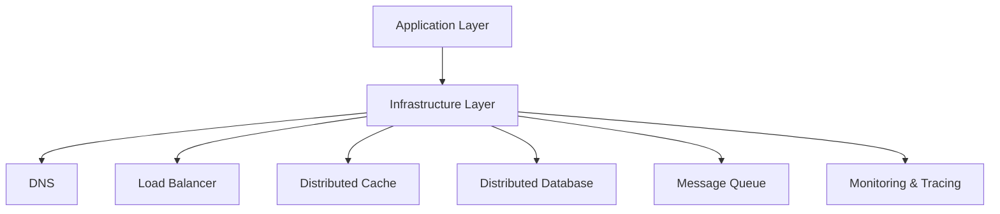

# 🔧 Infrastructure

Infrastructure problems are different: you're not designing for end users — you're designing **the platform that all other services depend on**.

## The Reliability Hierarchy

| Problem | Key Challenge | Difficulty |
|---------|---------------|-----------|
| [API Rate Limiter](./rate-limiter) | 5 algorithms, distributed state | 🟡 Medium |
| [Key-Value Store](./key-value-store) | Consistency, replication, compaction | 🔴 Hard |
| [Load Balancer](./load-balancer) | Health checks, algorithms, sticky sessions | 🔴 Hard |
| [CDN](./cdn) | Edge caching, cache invalidation, PoP selection | 🔴 Hard |
| [Distributed Locking](./distributed-locking) | Leader election, fencing tokens | 🟡 Medium |
| [Unique ID Generator](./unique-id-generator) | Snowflake, UUID, trade-offs | 🟡 Medium |
| [Distributed Tracing](./distributed-tracing) | Trace propagation, sampling, storage | 🔴 Hard |
| [Metrics & Alerting](./metrics-alerting) | Time-series DB, anomaly detection | 🔴 Hard |

## The Core Challenge

Every infrastructure system must answer: **What breaks when this is unavailable?**

The answer forces the right consistency/availability trade-off for each design.
