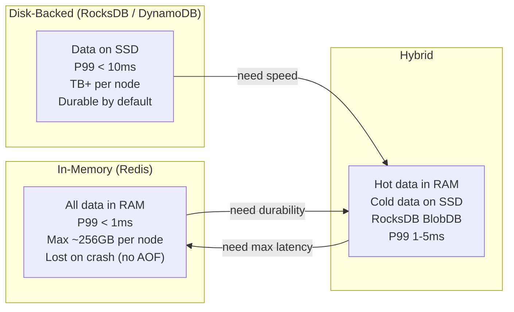
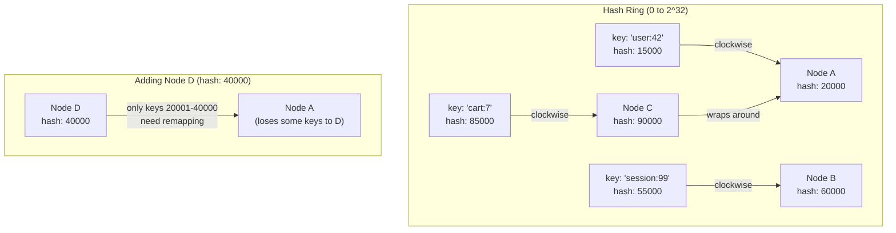
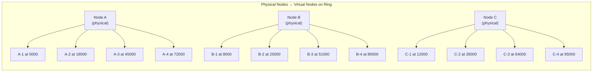
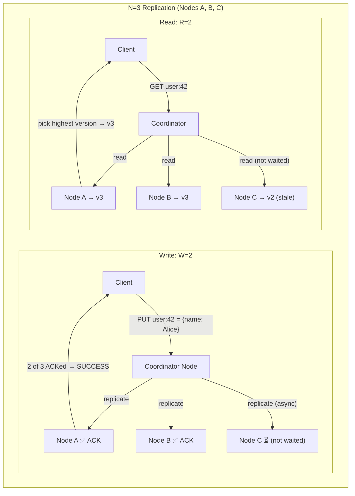
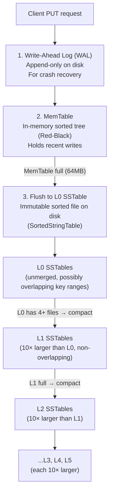
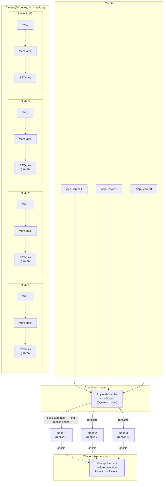

# Design a Distributed Key-Value Store — Redis to DynamoDB

**Difficulty**: 🔴 Advanced → ⚫ Senior
**Reading Time**: 40 minutes
**Interview Frequency**: Very High — one of the 5 most-asked system design problems at FAANG

> **Core Challenge**: Handle 1 million operations/second across distributed nodes with configurable consistency guarantees, sub-10ms P99 latency, and zero single points of failure.

---

## Table of Contents

1. [The Mental Model](#1-the-mental-model)
2. [Requirements](#2-requirements)
3. [Capacity Estimation](#3-capacity-estimation)
4. [Deep Dive 1 — Consistent Hashing + Virtual Nodes](#4-deep-dive-1--consistent-hashing--virtual-nodes)
5. [Deep Dive 2 — Quorum Reads and Writes (Tunable Consistency)](#5-deep-dive-2--quorum-reads-and-writes)
6. [Deep Dive 3 — LSM Tree Write Path](#6-deep-dive-3--lsm-tree-write-path)
7. [Full System Architecture](#7-full-system-architecture)
8. [Conflict Resolution](#8-conflict-resolution)
9. [Failure Detection — Gossip Protocol](#9-failure-detection--gossip-protocol)
10. [Problems at Scale](#10-problems-at-scale)
11. [Interview Questions Mapped](#11-interview-questions-mapped)
12. [Key Takeaways](#12-key-takeaways)
13. [Related Concepts](#13-related-concepts)

---

## 1. The Mental Model

### What Is a Key-Value Store?

A key-value store is the simplest possible database: a giant hash map that supports three operations:

```
PUT(key, value)   → store a value
GET(key)          → retrieve a value (null if missing)
DELETE(key)       → remove a key
```

No joins. No schemas. No transactions across keys (in most implementations). Just blazingly fast reads and writes at massive scale.

### The Spectrum: In-Memory vs Disk-Backed



**When to choose which**:
- **Redis (in-memory)**: Sessions, caches, leaderboards, pub/sub — data can be reconstructed
- **DynamoDB/Cassandra (disk-backed)**: User profiles, orders, configs — data is source of truth
- **RocksDB embedded**: Inside larger systems (Kafka log storage, TiKV, CockroachDB)

---

## 2. Requirements

### Functional Requirements

| Feature | Spec |
|---------|------|
| Operations | `GET(key)`, `PUT(key, value)`, `DELETE(key)` |
| Value size | Up to 1 MB per value (larger → object store) |
| Key format | Arbitrary bytes, up to 256 bytes |
| Consistency | Tunable: strong / eventual / quorum-based |
| Replication | Configurable replication factor N (default N=3) |
| TTL support | Optional per-key expiry |

### Non-Functional Requirements

| Requirement | Target | Rationale |
|-------------|--------|-----------|
| Read latency | P50 < 1ms, P99 < 10ms | User-facing applications need sub-10ms |
| Write latency | P50 < 5ms, P99 < 20ms | Disk flush adds variance |
| Throughput | 1M ops/sec total | 100K QPS per node × 10 nodes |
| Availability | 99.99% (52 min downtime/year) | Must survive node failures |
| Durability | 99.999999999% (11 nines) | No data loss on hardware failure |
| Scalability | Horizontal — add nodes without downtime | Linear throughput with node count |
| Data size | 10TB total stored | ~100GB per node × 100 nodes |

### Explicit Non-Requirements

- No SQL joins or relational queries
- No ACID transactions across multiple keys
- No full-text search

---

## 3. Capacity Estimation

### Traffic

```
1,000,000 ops/sec total
→ 700,000 reads/sec (70% read-heavy workload)
→ 300,000 writes/sec

Peak multiplier: 3× average
→ Peak reads: 2,100,000 reads/sec
→ Peak writes: 900,000 writes/sec
```

### Storage

```
10 billion key-value pairs
× avg key size:     64 bytes
× avg value size: 1024 bytes  (1 KB)
= 10B × 1088 bytes = ~10 TB raw data

Replication factor N=3:
→ 30 TB total storage needed

With 1TB SSD per node:
→ 30 nodes minimum for storage
→ Aim for 50 nodes for headroom (60% utilization)
```

### Network

```
1M ops/sec × 1KB avg value = 1 GB/sec throughput
Per-node: 1 GB/sec ÷ 50 nodes = 20 MB/sec per node
→ 160 Mbps per node (well within 10 Gbps NIC capacity)

Replication traffic (N=3, async):
→ Additional 2× write traffic = 60 MB/sec extra
→ Total cluster network: ~60 MB/sec aggregate write replication
```

### Nodes

```
At 100K ops/sec per node (CPU-bound limit):
→ 1M ops/sec ÷ 100K = 10 nodes minimum
→ With 3× peak headroom: 30 nodes

Practical design: 50 nodes
→ Storage: 30TB / 50 = 600GB per node (workable)
→ Throughput: 1M / 50 = 20K ops/sec per node (well within limit)
→ Peak: 3M / 50 = 60K ops/sec per node (still below 100K ceiling)
```

---

## 4. Deep Dive 1 — Consistent Hashing + Virtual Nodes

### The Problem: Naive Hash Distribution

Naive approach: `node = hash(key) % num_nodes`

**Fatal flaw**: When you add or remove a node, `num_nodes` changes. Nearly every key must be remapped to a different node — up to 99% of all data must be migrated. With 10TB of data, that's ~10TB of network traffic just to add one node.

### Consistent Hashing

Place both nodes and keys on a circular hash ring (0 to 2^32 - 1). Each key is owned by the first node found by walking clockwise from the key's hash position.



**When node D joins** (hash = 40,000): Only keys between 20,001 and 40,000 move from Node A to Node D. All other keys are unaffected.

**When node fails**: Only that node's keys must be redistributed to the next clockwise node.

### Virtual Nodes — Solving Uneven Distribution

With only a few physical nodes, consistent hashing creates uneven load distribution. One node might own 30% of the ring while another owns 5%.

**Solution**: Each physical node appears at **150 positions** (virtual nodes / vnodes) on the ring.



With 150 vnodes per physical node, the load distribution standard deviation drops from ~25% to ~3.5%.

### Key Distribution Algorithm (Pseudocode)

```
class ConsistentHashRing:
  ring = SortedMap()           # position → node_id
  node_positions = Map()       # node_id → [positions]
  VNODES_PER_NODE = 150

  function addNode(node_id):
    positions = []
    for i in range(VNODES_PER_NODE):
      vnode_key = "{node_id}-{i}"
      position = hash(vnode_key) % (2^32)
      ring[position] = node_id
      positions.append(position)
    node_positions[node_id] = positions

  function removeNode(node_id):
    for position in node_positions[node_id]:
      delete ring[position]
    delete node_positions[node_id]

  function getNode(key):
    position = hash(key) % (2^32)
    # Find the first node clockwise from position
    successor = ring.ceilingKey(position)
    if successor is None:
      # Wrap around to the first node
      successor = ring.firstKey()
    return ring[successor]

  function getReplicaNodes(key, N):
    # Return N distinct physical nodes clockwise from key
    nodes = []
    position = hash(key) % (2^32)
    for entry in ring.tailMap(position) + ring.headMap(position):
      node = entry.value
      if node not in nodes:
        nodes.append(node)
      if len(nodes) == N:
        break
    return nodes
```

### Comparison Table

| Approach | Data Moved on Node Add/Remove | Load Balance | Complexity |
|----------|------------------------------|--------------|------------|
| Modulo hashing (`hash % N`) | ~99% of all keys | Perfect | Trivial |
| Consistent hashing (no vnodes) | Only 1/N of keys | Poor (±25%) | Low |
| Consistent hashing + vnodes (150) | Only 1/N of keys | Good (±3.5%) | Medium |
| Rendezvous hashing | Only 1/N of keys | Good | Low |

**Production choice**: Consistent hashing with 150 vnodes (used by DynamoDB, Cassandra, Riak).

---

## 5. Deep Dive 2 — Quorum Reads and Writes

### The CAP Theorem Tradeoff

A distributed key-value store must choose during a network partition:
- **CP** (Consistency + Partition Tolerance): Refuse writes until the partition heals (strong consistency, lower availability)
- **AP** (Availability + Partition Tolerance): Accept writes on both sides of the partition (high availability, potential conflicts)

The Dynamo model (DynamoDB, Cassandra, Riak) chooses **AP** with **tunable consistency** via quorum.

### Quorum Parameters

With replication factor **N**:
- **W** = number of nodes that must acknowledge a write before success
- **R** = number of nodes that must respond to a read

**The quorum rule for strong consistency**: `W + R > N`

This guarantees that the read set and write set overlap by at least one node — ensuring the most recent write is always included in a read.



### Quorum Configurations

| Config | W | R | N | Guarantee | Use Case |
|--------|---|---|---|-----------|----------|
| Strong consistency | 2 | 2 | 3 | Always reads latest write | Financial data, inventory |
| Write-heavy | 1 | 3 | 3 | Strong read, weak write durability | High write throughput |
| Read-heavy | 3 | 1 | 3 | Strong write, fast reads | Read-heavy workloads |
| Eventual consistency | 1 | 1 | 3 | No guarantee — fastest | Session data, counters |
| Default (Cassandra) | 1 | 1 | 3 | Eventual, max throughput | Most use cases |

**DynamoDB**: Offers `ConsistentRead=true` (R=N, strong) or `ConsistentRead=false` (R=1, eventual, default, cheaper).

### Read Repair

When a read returns stale data from some nodes, the coordinator can silently repair it:

```
function read(key, R):
  responses = []
  for node in getReplicaNodes(key, N):
    responses.append(asyncRead(node, key))

  # Wait for R responses
  wait_for(responses, count=R, timeout=100ms)

  # Find highest version among R responses
  latest = max(responses, key=lambda r: r.version)

  # Read repair: async-update nodes with stale data
  for response in responses:
    if response.version < latest.version:
      asyncWrite(response.node, key, latest.value, latest.version)

  return latest.value
```

**Read repair cost**: Adds write traffic proportional to stale reads. Disable under very high read load.

### Hinted Handoff

If one of the N replica nodes is down during a write:
1. The coordinator stores the write in a "hint" on another available node
2. When the failed node recovers, the hint is replayed to bring it up to date
3. Guarantees durability even during node failures

```
function write(key, value, W):
  nodes = getReplicaNodes(key, N)
  acks = 0
  hints = []

  for node in nodes:
    if node.isAlive():
      result = node.put(key, value)
      if result == SUCCESS: acks += 1
    else:
      # Store hint for later delivery
      hints.append(Hint(target=node, key=key, value=value))
      storeHintOnAlternateNode(hints.last())

  if acks >= W:
    return SUCCESS
  else:
    return FAILURE  # Couldn't reach quorum even with hints
```

---

## 6. Deep Dive 3 — LSM Tree Write Path

### Why Not B-Trees?

B-trees are standard for OLTP databases, but they have a problem: **write amplification**. Every `PUT` requires a random disk seek to find the correct page, potentially updating multiple pages (for rebalancing). On HDD, random I/O is 100× slower than sequential. On SSD, random writes cause excessive write amplification, wearing out the drive faster.

**LSM (Log-Structured Merge) Tree** solves this by converting all random writes into sequential writes.

### The LSM Write Path



### SSTable Structure

Each SSTable is an **immutable, sorted file** on disk:

```
SSTable File Layout:
┌─────────────────────────────────────────┐
│  Data Block 0: keys [a...f], values     │ (4KB blocks)
│  Data Block 1: keys [g...m], values     │
│  Data Block 2: keys [n...z], values     │
│  ...                                    │
├─────────────────────────────────────────┤
│  Index Block: key → data block offset   │ (binary search)
├─────────────────────────────────────────┤
│  Bloom Filter: "does key X exist?"      │ (probabilistic)
├─────────────────────────────────────────┤
│  Footer: index offset, magic number     │
└─────────────────────────────────────────┘
```

**Bloom Filter**: Before scanning an SSTable for a key, check the Bloom filter. If it says "absent", skip the file (1% false positive rate). Reduces read amplification by avoiding unnecessary disk reads.

### Compaction

Compaction merges SSTables to:
1. Remove deleted keys (tombstones)
2. Remove overwritten versions (keep only latest)
3. Reduce read amplification (fewer files to check)

```
function compact(level_n_files, level_n1_files):
  # Merge-sort all files at level N with overlapping files at level N+1
  all_entries = merge_sort([level_n_files, level_n1_files])

  new_sstables = []
  current_table = new SSTable(target_size=64MB)

  for entry in all_entries:
    if entry.is_tombstone() and entry.timestamp < gc_grace_period:
      continue  # Drop deleted key permanently
    if entry.key == last_key:
      continue  # Drop older version of same key
    current_table.append(entry)
    if current_table.size >= 64MB:
      new_sstables.append(finalize(current_table))
      current_table = new SSTable()

  return new_sstables
```

### Read Path (with LSM)

A `GET` must check multiple locations in order:

```
1. MemTable (in-memory) → O(log N) lookup
2. Immutable MemTable (being flushed) → O(log N)
3. L0 SSTables (binary search each, bloom filter first) → O(L0 files × log N)
4. L1 SSTable (non-overlapping, binary search index) → O(log N)
5. L2, L3... (same as L1) → O(log N) per level

Total read amplification without bloom filters: O(L0 + log(N) × levels)
With bloom filters: ~1-2 disk reads for non-existent keys
```

### LSM vs B-Tree Tradeoffs

| Dimension | LSM Tree | B-Tree |
|-----------|----------|--------|
| Write throughput | Very high (sequential I/O) | Medium (random I/O) |
| Read throughput | Medium (check multiple levels) | High (O(log N) always) |
| Write amplification | 10-30× | 2-5× |
| Read amplification | 10-100× | 1-5× |
| Space amplification | 10-50% overhead (compaction) | ~20% overhead |
| Range scans | Efficient (sorted SSTables) | Efficient (sorted pages) |
| Delete | Tombstone (deferred) | Immediate |
| Best for | Write-heavy workloads | Read-heavy workloads |
| Used by | RocksDB, Cassandra, LevelDB | PostgreSQL, MySQL InnoDB, SQLite |

---

## 7. Full System Architecture



### Request Flow: PUT Operation

```
1. Client sends PUT(key="user:42", value={name:"Alice"}) to any node
2. Coordinator receives request
3. Coordinator computes: nodes = consistentHash.getReplicaNodes("user:42", N=3)
   → [Node-7, Node-15, Node-23]
4. Coordinator sends write to all 3 nodes simultaneously
5. Each node: append to WAL → write to MemTable → ACK
6. Coordinator waits for W=2 ACKs (quorum)
7. Return SUCCESS to client (Node-23 still replicating async)
8. Node-23 applies write when it receives the replication message
```

### Request Flow: GET Operation

```
1. Client sends GET(key="user:42") to any node
2. Coordinator computes replica nodes: [Node-7, Node-15, Node-23]
3. Coordinator sends read to all 3 nodes simultaneously
4. Each node:
   a. Check MemTable → found? return with version
   b. Check immutable MemTable
   c. Check L0 SSTables (bloom filter first, then binary search)
   d. Check L1, L2... until found
5. Coordinator waits for R=2 responses
6. Return value with highest version number
7. Async read repair: update any nodes with stale versions
```

---

## 8. Conflict Resolution

### Last-Write-Wins (LWW)

Simplest approach: every write carries a timestamp. On conflict, the higher timestamp wins.

```
Node A receives: PUT("user:42", {name:"Alice"}, ts=1000)
Node B receives: PUT("user:42", {name:"Bob"},   ts=1001)

On merge: ts=1001 wins → {name: "Bob"}
```

**Problem**: Clock skew between nodes means timestamps are unreliable. A write with a lower timestamp could actually happen later in real time. NTP synchronization reduces this to ~100ms but doesn't eliminate it.

**Used by**: Redis (AOF), Cassandra (default), DynamoDB (last-writer-wins mode)

### Vector Clocks

Each value carries a vector of `{nodeId: sequenceNumber}` pairs. This precisely captures causal relationships between writes.

```
Initial: VC = {}

Node A writes "Alice": VC_A = {A:1}
Node B writes "Bob":   VC_B = {B:1}  (concurrent with A's write)

On merge: VC_A and VC_B are concurrent (neither dominates)
→ Conflict! Present both values to client for resolution

Client resolves: picks "Alice", writes with VC = {A:1, B:1}
Next read: VC = {A:1, B:1} dominates all previous → no conflict
```

**Problem**: Vector clocks grow unbounded if many nodes write the same key. Must be pruned.

**Used by**: Amazon Dynamo (original paper), Riak

### Comparison

| Strategy | Conflict Detection | Conflict Resolution | Data Loss Risk | Complexity |
|----------|-------------------|--------------------|--------------:|-----------|
| LWW (timestamp) | None | Automatic (higher ts wins) | Yes (concurrent writes) | Low |
| Vector clocks | Yes (concurrent writes flagged) | Client-side merge | No | High |
| CRDT (merge function) | N/A | Automatic (commutative merge) | No | Very High |
| Multi-version (MVCC) | Yes | Read both, app merges | No | High |

**Production recommendation**: Use LWW for most workloads. Use vector clocks when data loss is unacceptable and you control the client.

---

## 9. Failure Detection — Gossip Protocol

### Why Not Centralized Monitoring?

Centralized heartbeat monitoring creates a single point of failure and doesn't scale. At 1000 nodes sending heartbeats every 1 second to one monitor = 1000 QPS sustained, plus the monitor becomes critical infrastructure.

### How Gossip Works

Every node, every second:
1. Picks K random peers (K=3 typically)
2. Sends its **membership list** (node IDs + heartbeat counters + last-seen timestamps)
3. Merges received membership with its own (take max heartbeat counter per node)
4. If a node's heartbeat hasn't incremented in T seconds → suspect it as failed

```
Each node maintains:
membershipList = {
  "node-1": {heartbeat: 4521, lastSeen: 1706000120},
  "node-2": {heartbeat: 4519, lastSeen: 1706000118},
  "node-3": {heartbeat: 0,    lastSeen: 1706000001},  # suspect: no update in 119s
  ...
}

Every 1 second:
  myHeartbeat += 1
  membershipList["self"].heartbeat = myHeartbeat

  peers = randomSample(membershipList, K=3)
  for peer in peers:
    peer.send(membershipList)

  # On receive:
  for (nodeId, info) in received_list:
    if info.heartbeat > membershipList[nodeId].heartbeat:
      membershipList[nodeId] = info  # update with fresher info
```

### Phi Accrual Failure Detector

Binary "up/down" is too coarse. The **Phi Accrual Failure Detector** (used by Akka, Cassandra) outputs a continuous suspicion level φ:

```
φ = 1 → "probably alive" (1 in 10 chance of false positive)
φ = 5 → "likely failed"  (1 in 100,000 chance of false positive)
φ = 8 → "almost certainly failed"

Suspicion threshold φ_threshold = 8 (configurable)
```

**How it works**: Track the distribution of heartbeat inter-arrival times. If the current gap since last heartbeat is much larger than historical average → high φ.

This adapts to network jitter: on a flaky network, the threshold auto-adjusts upward, reducing false positives.

---

## 10. Problems at Scale

### Problem 1: Hot Key — 90% of Traffic on One Key

**Root Cause**: A viral post, trending product, or misconfigured client hammers one key. Consistent hashing routes all requests for that key to the same node, which becomes saturated (CPU/network bottleneck).

**Symptoms**: One node at 100% CPU; P99 latency spikes to seconds; other nodes are idle.

**Detection**: Monitor per-key QPS. Alert when one key exceeds 1% of total traffic.

**Fix 1 — Key Sharding**: Append a random suffix to the key on write, read from all shards and merge.

```
# Write: distribute across 10 shards
suffix = random(0, 9)
put(f"trending:post:42:{suffix}", value)

# Read: fan out to all shards
results = [get(f"trending:post:42:{i}") for i in range(10)]
return merge(results)
```

**Fix 2 — Local Client Cache**: Cache the hot key in application memory for 1 second. At 100K req/sec, this reduces store traffic by 99%.

**Fix 3 — Replica Read Spreading**: For the hot key's replicas, allow reads from any of N replicas (not just the primary). Distributes read load across 3 nodes.

---

### Problem 2: Network Partition — Split-Brain with Conflicting Writes

**Root Cause**: A network switch fails, splitting the cluster into two halves. Both halves continue accepting writes with W=1 (eventual consistency). The same key gets conflicting values on each side.

**Symptoms**: After partition heals, two versions of a key exist with no clear "winner". Applications see stale or inconsistent data.

**Example**:
```
Partition at t=0:
  Side A: PUT("inventory:widget", count=5)
  Side B: PUT("inventory:widget", count=3)  # concurrent, different value

Partition heals at t=60:
  Both writes exist. LWW picks one — but both were "correct" to their side.
  Result: inventory count silently loses one write.
```

**Fix 1 — Raise W for Critical Data**: Use W=2 (quorum) so writes require nodes from both sides of a partition. Writes fail during partition (CP behavior) rather than diverging (AP behavior). Correct for financial data; wrong for high-availability chat.

**Fix 2 — CRDT for Counters**: Instead of `SET count=5`, use a CRDT counter that supports `INCREMENT`. Increments are commutative — merging them never loses data.

**Fix 3 — Application-Level Conflict Resolution**: After partition heals, surface both versions to the application. Let the application decide the merge strategy (e.g., for inventory: take the minimum to be conservative about overselling).

---

### Problem 3: Node Failure During Replication — Data Loss Window

**Root Cause**: Node A receives a write (acknowledged to client), then fails before replicating to Node B and Node C. The WAL on Node A is lost.

**Scenario**:
```
W=1 (fastest mode):
  Client sends PUT("order:999", {status: "paid"})
  Coordinator routes to Node A
  Node A: writes WAL, updates MemTable, ACKs client
  Node A: crashes before replicating to B or C
  Cluster: marks A as failed, promotes B as new primary
  GET("order:999") → B and C have no record → returns null

Result: Order status is "paid" in client's view, but lost from the store.
```

**Fix 1 — Increase W**: Use W=2 or W=3. With W=2, the write must reach 2 nodes before ACK. Node A's failure loses one copy but B still has it.

**Fix 2 — Synchronous WAL Replication**: Before ACKing the client, replicate the WAL entry (not the data) to a secondary node. The WAL entry is tiny (~100 bytes) so replication is fast. This gives durability without full data replication latency.

**Fix 3 — Disable W=1 for Durable Writes**: Use W=1 only for cache-like data (sessions, rate counters). For anything financial or irreplaceable, enforce W=2 minimum at the client library level.

---

## 11. Interview Questions Mapped

| Question | What It Tests | Level |
|----------|---------------|-------|
| "How do you distribute keys across 100 nodes without rehashing everything when you scale?" | Consistent hashing knowledge | Mid |
| "How does DynamoDB guarantee that a read sees the latest write?" | Quorum reads, W+R>N | Mid |
| "What happens when two clients write the same key concurrently?" | Conflict resolution (LWW vs vector clocks) | Senior |
| "How does a node know when another node has failed?" | Gossip protocol, Phi accrual detector | Senior |
| "Why is an LSM tree faster for writes than a B-tree?" | Write path, WAL, MemTable, compaction | Senior |
| "A single key is getting 500K req/sec — what do you do?" | Hot key detection + mitigation | Staff |
| "How do you handle a network partition in an eventually consistent store?" | CAP theorem, AP vs CP tradeoff | Staff |
| "Walk me through the full read path when a key is not in MemTable" | LSM levels, bloom filters, read amplification | Senior |

---

## 12. Key Takeaways

- **Consistent hashing + 150 virtual nodes** reduces data migration on scale-out to ~1/N of total data (vs ~99% for modulo hashing), with load balance standard deviation of ~3.5%
- **Quorum rule W + R > N** guarantees strong consistency: with N=3, W=2, R=2, every read is guaranteed to include the latest write — at the cost of 1 extra round-trip vs W=1/R=1 eventual
- **LSM trees turn random writes into sequential I/O** — MemTable absorbs writes in memory, flushes to immutable SSTables, background compaction removes deleted/stale versions; result is 5-10× higher write throughput than B-trees at cost of read amplification
- **Gossip propagation reaches all N nodes in O(log N) rounds** — 50-node cluster reaches full consistency in ~6 gossip rounds (~6 seconds with 1s intervals); Phi accrual detector adapts to network jitter, reducing false positives by 10× vs fixed timeouts
- **Hot keys need sharding at the application layer** — client-side key sharding (append random 0-9 suffix) distributes a 500K req/sec hot key into 50K req/sec per shard, keeping each node well below its 100K ops/sec ceiling

---

## 13. Related Concepts

- [Rate Limiter](./rate-limiter) — Uses Redis (a key-value store) internally for counter storage
- [Distributed Locking](./distributed-locking) — Built on top of key-value stores (Redlock algorithm)
- [Distributed Counter](./distributed-counter) — CRDT-based counters in key-value stores
- [Consistent Hashing](../../13-agent-workflows/concepts/llm-caching) — Core technique for partitioning

## 📚 Resources & References

| Resource | Type | What You'll Learn |
|----------|------|------------------|
| [System Design Interview — Alex Xu](https://www.amazon.com/System-Design-Interview-insiders-Second/dp/B08CMF2CQF) | 📚 Book | Chapter on designing a key-value store — hashing, replication, consistency |
| [ByteByteGo — Design a Key-Value Store](https://www.youtube.com/@ByteByteGo) | 📺 YouTube | Walkthrough of consistent hashing, LSM trees, and replication factor |
| [Amazon DynamoDB: Paper and Architecture](https://www.usenix.org/conference/atc22/presentation/elhemali) | 📖 Blog | How DynamoDB achieves single-digit millisecond latency at any scale |
| [Redis Architecture and Data Structures](https://redis.io/docs/data-types/) | 📚 Docs | In-memory key-value store — persistence modes, replication, clustering |
| [Apache Cassandra: Distributed KV Design](https://cassandra.apache.org/doc/latest/cassandra/architecture/overview.html) | 📚 Docs | Wide-column key-value store with tunable consistency |
