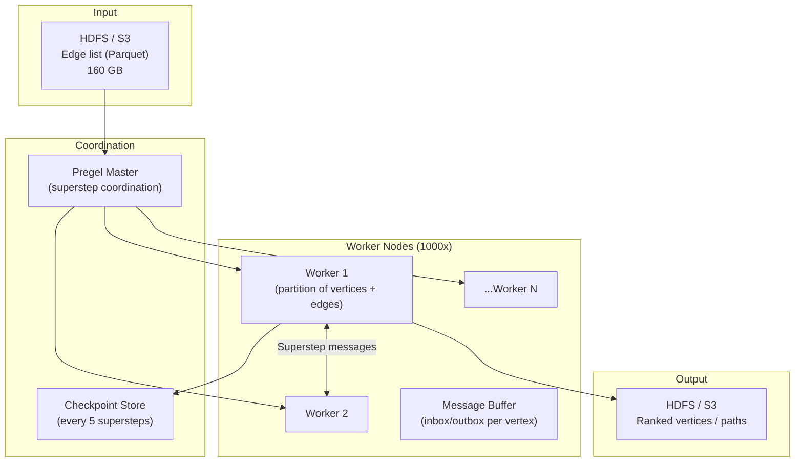
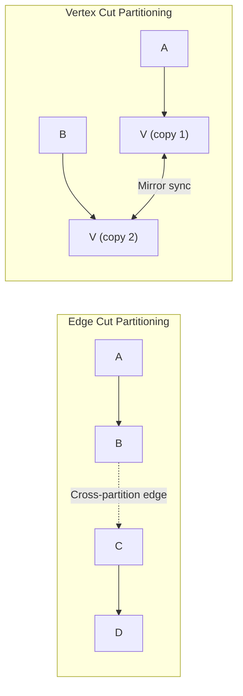
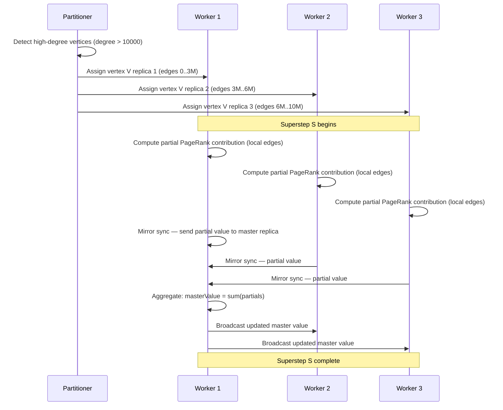
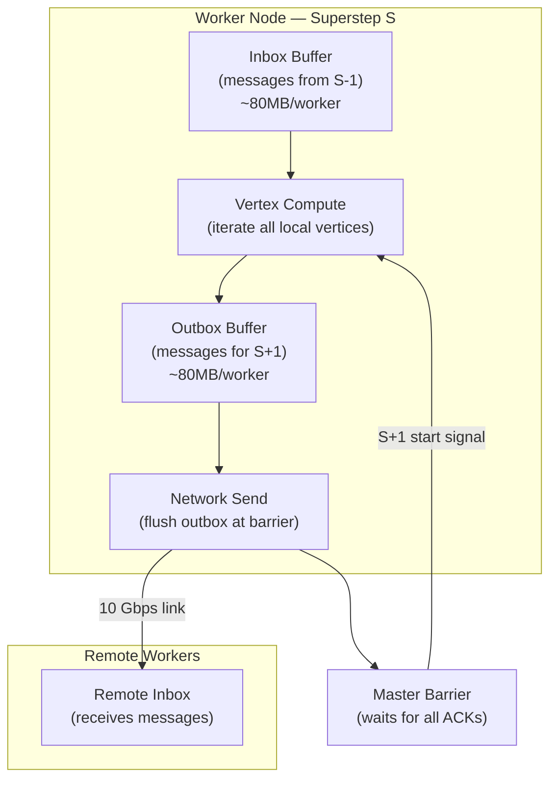

# Design a Large-Scale Graph Processing System — 1B Vertices, 10B Edges

**Difficulty**: 🔴 Advanced
**Reading Time**: 28 minutes
**Interview Frequency**: Medium — asked at social networks, recommendation systems, and data platform companies

---

## Problem Statement

You are asked to design a distributed graph processing system that:

- **Works at**: 1M vertices, 10M edges — NetworkX in Python or single-node Neo4j handles PageRank in minutes.
- **Breaks at**: 1B vertices (Facebook-scale social graph), 10B edges — the graph doesn't fit in a single machine's RAM (10B edges × 16 bytes = 160 GB minimum); PageRank requires 30+ iterations, each touching all edges; naive partitioning causes 90% of messages to cross network boundaries.

Target: **1B vertices**, **10B edges**, **PageRank in < 30 minutes**, **community detection**, **shortest path queries**, on a 1,000-node cluster.

---

## Requirements

### Functional Requirements

| Requirement | Description |
|-------------|-------------|
| Graph Loading | Ingest edge list from HDFS/S3 (CSV or Parquet) |
| PageRank | Compute vertex authority scores (iterative) |
| Shortest Path | Single-source shortest path (BFS/Dijkstra) |
| Community Detection | Find clusters (connected components, Louvain) |
| Graph Updates | Batch updates to graph (new edges/vertices) |
| Result Export | Write results back to HDFS/S3 |

### Non-Functional Requirements

| Requirement | Target |
|-------------|--------|
| Graph Size | 1B vertices, 10B edges |
| PageRank Convergence | < 30 minutes (30 iterations × < 1 min/iteration) |
| Cluster Size | 1,000 nodes × 128 GB RAM = 128 TB total |
| Fault Tolerance | Resume from checkpoint on node failure |
| Communication Overhead | < 20% of total compute time |

---

## Capacity Estimates

- **Graph storage**: 10B edges × 16 bytes (src, dst, weight) = **160 GB** for adjacency list
- **Vertex state (PageRank)**: 1B vertices × 8 bytes = **8 GB** per worker
- **Total working memory**: 160 GB edges + 8 GB vertex state × 30 iterations = ~250 GB → need distributed processing
- **Message passing per iteration**: Each vertex sends score to all neighbors → 10B messages × 8 bytes = **80 GB/iteration**
- **Network bandwidth**: 80 GB / 60 seconds = **1.3 GB/s** inter-node communication → fine at 10 Gbps

---

## High-Level Architecture



---

## Level 1 — Surface: Bulk Synchronous Parallel (BSP) Model

Pregel (and GraphX) uses the **BSP model**:

1. **Superstep S**: Each vertex processes messages received in S-1, updates its value, sends messages to neighbors
2. **Barrier**: All vertices complete superstep S before any starts S+1
3. **Repeat** until convergence (no messages sent or max iterations)

```
// PageRank in Pregel (pseudocode)
class PageRankVertex extends Vertex {
    compute(messages) {
        if (superstep == 0) {
            this.value = 1.0 / numVertices;
        } else {
            // Sum of weighted contributions from incoming messages
            double sum = messages.sum();
            this.value = 0.15 / numVertices + 0.85 * sum;
        }

        // Send score to each neighbor
        double msg = this.value / this.outEdges.count();
        this.outEdges.forEach(e -> sendMessage(e.target, msg));

        if (superstep >= 30) voteToHalt(); // Stop after 30 iterations
    }
}
```

**Why barriers?**: Simplifies fault tolerance — checkpoint after each superstep. Re-run from last checkpoint on failure, not from scratch.

---

## Level 2 — Deep Dive: Graph Partitioning

Graph partitioning determines which vertices/edges live on which worker. Poor partitioning → 90% of messages cross network → communication dominates compute.

### Edge Cut vs. Vertex Cut



| Partitioning | Communication | Balance | Best For |
|-------------|--------------|---------|----------|
| **Random** | High (cuts many edges) | Perfect balance | Baseline |
| **Edge Cut** | Low (fewer cross edges) | Imbalanced (hub vertices) | Power-law graphs |
| **Vertex Cut** | Medium (mirror sync) | Better balance | Power-law graphs (hub vertices split) |
| **Label Propagation** | Lowest | Good | Community-structured graphs |

**Social graphs follow power-law distribution**: 0.1% of users (celebrities) have millions of followers. Edge cut puts celebrity vertex on one partition, sending millions of messages out. Vertex cut replicates the celebrity across multiple partitions — messages stay local.

**GraphX uses vertex cut** by default: celebrity vertex replicated N times; each replica handles a subset of its edges locally. Mirror synchronization after each superstep: O(replicas) messages vs O(edges) messages.

### Handling Stragglers

BSP barrier means entire system waits for the slowest worker. Mitigation strategies:

1. **Speculative execution**: If a task is 2× slower than median, launch duplicate on another worker; use first result
2. **Work stealing**: Idle workers pull tasks from slow workers' queues
3. **Partition rebalancing**: Detect overloaded partitions and migrate vertices between supersteps

---

## Key Design Decisions

### 1. In-Memory vs. Disk-Based Graph Processing

| Approach | Performance | Graph Size Limit | Cost |
|----------|-------------|-----------------|------|
| **In-memory (Pregel, GraphX)** | Fast (no I/O) | RAM capacity (128 TB cluster) | High (lots of RAM) |
| **Disk-based (GraphChi, X-Stream)** | 10–100× slower | Unlimited (disk) | Low |
| **Semi-external (GraphBolt)** | Medium | Limited by vertex state in RAM | Medium |

For 160 GB graph: fits comfortably in 1,000 nodes × 128 GB RAM. Use in-memory processing. If graph grows to 10× (1.6 TB), either add nodes or switch to disk-based.

### 2. Batch vs. Streaming Graph Updates

| Model | Freshness | Consistency | Use Case |
|-------|-----------|-------------|----------|
| **Batch (daily)** | Stale (24h) | Strong (full recompute) | Offline analytics (PageRank) |
| **Incremental (streaming)** | Fresh (minutes) | Approximate | Real-time fraud detection |
| **Hybrid** | Near-real-time (1h) | Good enough | Recommendation systems |

Facebook recomputes social graph recommendations daily (batch) but updates friendship graph incrementally (streaming).

### 3. Fault Tolerance via Checkpointing

Without checkpointing: 30-superstep PageRank, node fails at step 25 → restart from step 0 (5 hours wasted). With checkpointing every 5 supersteps: restart from step 20 → recompute 5 steps (< 5 minutes wasted).

Checkpoint cost: serialize all vertex states to HDFS after every 5 supersteps. 1B vertices × 8 bytes = **8 GB** checkpoint at ~1 GB/s → **8 seconds** overhead per checkpoint.

---

## Interview Questions

| Question | What They're Testing | Key Answer Points |
|----------|---------------------|-------------------|
| How do you handle celebrity vertices with millions of edges? | Graph-specific knowledge | Vertex cut: replicate high-degree vertices across multiple partitions; each replica handles subset of edges; sync mirror values after each superstep |
| Why can't you just use a relational database for graph queries? | Fundamentals | SQL joins for path queries require N self-joins for N hops — exponential cost; graph DB and BSP systems use vertex-centric iteration which is O(edges) |
| How do you achieve < 30 minutes for PageRank on 10B edges? | Performance estimation | 30 iterations × 10B edges × 8 bytes / 1,000 workers / 10 Gbps bandwidth = ~2.4s/iteration for communication + compute; feasible in < 5 min/iteration = < 30 min total |

---

## Component Deep Dive 1: Graph Partitioning Engine

Graph partitioning is the single most important decision in a distributed graph processing system. It determines how work is divided across 1,000 workers, how many messages must cross network boundaries per superstep, and whether the system achieves < 30 minutes or degrades to 3+ hours for PageRank.

### Why Naive Partitioning Fails

The most intuitive approach — hash the vertex ID modulo number of workers — distributes vertices uniformly but ignores graph structure. Social graphs follow a power-law degree distribution: roughly 0.1% of users (celebrities, brands) have millions of edges while 80% of users have fewer than 150 connections. Hash partitioning puts each high-degree vertex on one partition. Every PageRank iteration, that vertex sends millions of messages to neighbors on other partitions. With 10B edges and 1,000 workers, random hash partitioning results in ~99.9% of messages crossing partition boundaries — turning a compute problem into a network bandwidth problem.

At 80 GB/iteration × 99.9% cross-partition rate = 79.9 GB over the network per iteration × 30 iterations = 2.4 TB of network traffic. At 10 Gbps inter-node, that's 32 minutes just for communication — blowing the 30-minute SLA before any compute happens.

### How Vertex Cut Partitioning Works Internally



The key insight: a vertex with 10M edges is split across multiple replicas. Each replica handles ~3.3M edges locally (no network). Mirror sync costs O(replicas) messages instead of O(edges) messages — reducing network traffic for that vertex from 10M messages to 3 messages per superstep.

### Partitioning Strategy Comparison

| Strategy | Cross-Partition Messages | Load Balance | High-Degree Vertex Handling | Best Use Case |
|----------|--------------------------|--------------|----------------------------|---------------|
| Random hash | ~99% cross-partition | Perfect | Single overloaded worker | Uniform-degree graphs only |
| Edge cut (METIS) | ~30-40% cross-partition | Imbalanced | Hub overloaded | Sparse graphs, no power-law |
| Vertex cut (PowerGraph) | ~5-15% cross-partition | Good | Vertex replicated, load spread | Power-law social graphs |
| Label propagation | ~10-20% cross-partition | Moderate | Community-aware | Community-structured graphs |

**GraphX uses vertex cut with random edge assignment** for initial partitioning because it requires only a single pass over the edge list (O(E)) and achieves near-optimal balance for power-law graphs without needing to know the global degree distribution upfront.

---

## Component Deep Dive 2: Superstep Message Passing and Barrier Synchronization

The BSP barrier is both the greatest strength and greatest weakness of Pregel-style systems. Every worker must complete superstep S before any worker can begin S+1. This simplifies fault tolerance (checkpoint at barrier boundaries) but creates a straggler problem: 1 slow worker stalls all 999 others.

### Internal Message Buffer Architecture

Each worker maintains two message buffers per vertex:
- **Inbox (current superstep)**: messages received in S-1, ready to read in S
- **Outbox (next superstep)**: messages sent during S, flushed to neighbors at barrier



### What Happens at 10x Load

At 10x graph size (10B vertices, 100B edges), message volume grows proportionally:
- **Message count per iteration**: 100B messages × 8 bytes = **800 GB/iteration**
- **Network requirement**: 800 GB / 60s = **13.3 GB/s** — exceeds 10 Gbps per-node bandwidth
- **Mitigation**: Message combining (combiner function) — aggregate all messages to the same vertex before sending. For PageRank, sum all outgoing contributions into one message per destination vertex per superstep. Reduces 100B messages to at most 1B unique destination messages (one per unique target vertex) = 8 GB/iteration.

**Combiner function for PageRank**:
```
// Instead of sending N messages to vertex V from different local vertices,
// combine into one: sum all contributions, send single message
combiner(msgs) -> sum(msgs)
// Reduces network traffic by average_out_degree factor (~10x for social graphs)
```

At 10x scale, combiners reduce network traffic from 800 GB/iteration to ~80 GB/iteration — same order as baseline.

### Straggler Mitigation

| Technique | Overhead | Effectiveness | When to Use |
|-----------|----------|---------------|-------------|
| Speculative execution | 2x resource cost | High for consistent stragglers | Long supersteps (>30s) |
| Work stealing | ~5% overhead | Medium | Uneven partition sizes |
| Barrier relaxation (async BSP) | Consistency risk | High for throughput | When approximate results acceptable |
| Adaptive checkpointing | ~8% overhead | Reduces recovery cost | High failure probability |

### Async BSP vs. Strict BSP

Strict BSP guarantees that every vertex in superstep S sees messages from superstep S-1 and nothing later — deterministic, reproducible results. Asynchronous BSP (used by systems like PowerGraph's GAS model and GraphLab) relaxes this: vertices can process messages as soon as they arrive, even if other vertices are still in an earlier superstep.

**Async advantages**: No straggler blocking; workers with fast partitions run ahead; convergence can be 2-3x faster in wall-clock time for many algorithms (PageRank, collaborative filtering).

**Async disadvantages**: Results differ run-to-run (non-deterministic); debugging is harder; some algorithms (exact shortest path, connected components) require synchronous semantics to produce correct results.

**Rule of thumb**: Use async BSP for iterative algorithms where approximate convergence is acceptable (PageRank, personalized recommendations). Use strict BSP for correctness-critical algorithms (exact connected components, graph coloring, minimum spanning tree).

For the 1B vertex / 10B edge PageRank job: PageRank tolerates async execution well — convergence is still mathematically guaranteed, just non-deterministic in iteration count. Switching from strict BSP to async can cut wall-clock time from 30 minutes to 12-15 minutes on a straggler-heavy cluster.

---

## Component Deep Dive 3: Checkpoint and Fault Recovery Layer

A 30-superstep PageRank job running on 1,000 nodes with 0.1% hourly node failure rate has ~63% chance of at least one failure during the run. Checkpointing is not optional — it's what separates a research prototype from a production system.

### Checkpoint Mechanics

After every 5 supersteps, each worker serializes all vertex states (value + edge list metadata) to HDFS/S3:

- **Checkpoint size**: 1B vertices × (8 bytes value + 8 bytes vertex ID) = **16 GB total** across all workers, ~16 MB per worker
- **Write time**: 16 MB at 500 MB/s local disk → **32ms per worker**, overlapped with barrier sync
- **Recovery on failure**: Lost worker's vertices are reassigned to surviving workers; they reload the last checkpoint and recompute the missed supersteps

**Checkpoint interval trade-off**: Checkpoint every K supersteps.
- Small K (e.g., K=1): Maximum overhead (~8 seconds every superstep for serialization/write)
- Large K (e.g., K=10): Minimum overhead but longer re-computation on failure (up to 10 supersteps × 1 min = 10 minutes lost)
- **Optimal K** at 0.1% failure rate: K=5 balances overhead against expected recovery cost — 8 seconds overhead every 5 minutes vs. average 2.5 supersteps re-computation on failure.

### Incremental Checkpointing

Full checkpointing writes all vertex states every K supersteps. For algorithms where most vertices converge early (typical in PageRank: 80% of vertices stabilize by iteration 10), full checkpointing writes the same data repeatedly. Incremental checkpointing writes only vertices whose state changed since the last checkpoint.

**Implementation**: Each vertex tracks a `dirty` flag set when its value changes by more than a delta threshold (e.g., 0.001 for PageRank). Checkpoint serializes only dirty vertices. At iteration 20 of PageRank, typically only ~5% of vertices are still changing — incremental checkpoint size drops from 16 GB to ~800 MB, taking < 1 second instead of 8 seconds.

**Recovery complexity**: To reconstruct full state at superstep S, the system must replay: full checkpoint at superstep S0 + all incremental checkpoints from S0 to S. Recovery time grows with the number of incremental checkpoints. Hybrid approach: full checkpoint every 20 supersteps, incremental every 5 supersteps. Full recovery at worst replays 4 incremental checkpoints (< 30 seconds total).

### Distributed Checkpoint Coordination

On a 1,000-node cluster, checkpoint is a distributed operation. All workers must write their state atomically — partial checkpoints (some workers wrote, others failed) are unusable. The master uses a two-phase protocol:
1. **Phase 1**: Master sends CHECKPOINT_BEGIN; workers flush outbox and serialize vertex states to local temp files
2. **Phase 2**: All workers ACK Phase 1; master sends CHECKPOINT_COMMIT; workers atomically rename temp files to final checkpoint paths on HDFS

If any worker fails before Phase 2 commit, the partial checkpoint is discarded and the previous valid checkpoint is used. HDFS atomic rename guarantees either the full checkpoint is visible or none of it is.

---

## Monitoring a Running Graph Job

A 30-minute PageRank job on 1,000 nodes is opaque without instrumentation. Operators need to answer three questions in real time: Is the job making progress? Which workers are slow? Is it going to finish on time?

### Per-Superstep Metrics

Each worker emits the following counters to a central aggregator (e.g., Prometheus + Grafana) at the end of every superstep:

| Metric | What It Tells You | Alert Threshold |
|--------|-------------------|-----------------|
| `superstep_duration_seconds` (p99) | Straggler detection | > 2× median worker duration |
| `messages_sent_total` | Convergence progress (should decrease each superstep) | Flat for 3+ supersteps = not converging |
| `active_vertices_count` | How many vertices still computing (should trend to 0) | Still > 1% at superstep 25 = slow convergence |
| `checkpoint_write_seconds` | Checkpoint overhead | > 30s = storage bottleneck |
| `network_bytes_sent` | Bandwidth pressure | > 8 GB/s aggregate = approaching 10 Gbps limit |
| `vertices_voted_to_halt` | Convergence indicator | Increasing monotonically = healthy |

### Convergence Curve

For PageRank, plot `max_delta` (maximum change in any vertex's score) against superstep number. A healthy run shows exponential decay: delta drops from ~0.5 at superstep 1 to ~0.001 at superstep 25-30. A flat convergence curve after superstep 10 indicates either a graph cycle issue or a bug in the damping factor.

```
Superstep:  1     5    10    15    20    25    30
Max delta:  0.50  0.20  0.05  0.01  0.003  0.001  0.0003
Active V:   1B    900M  700M  400M  100M   10M    500K
```

Jobs that deviate from this curve by > 2× at any superstep should trigger an alert — either the partition is skewed, a worker is failing silently, or the graph contains disconnected components that prevent global convergence.

---

## Data Model

Graph data is stored in columnar Parquet format on HDFS/S3. In-memory representation uses CSR (Compressed Sparse Row) for efficient neighbor iteration.

```sql
-- Edge table (stored as Parquet on HDFS)
CREATE TABLE graph_edges (
    src_vertex_id   BIGINT NOT NULL,   -- 8 bytes, up to 2^63 vertex IDs
    dst_vertex_id   BIGINT NOT NULL,   -- 8 bytes
    edge_weight     FLOAT  NOT NULL DEFAULT 1.0,  -- 4 bytes
    edge_type       SMALLINT NOT NULL DEFAULT 0,  -- 2 bytes (follows, likes, retweets)
    created_at      INT    NOT NULL,   -- 4 bytes Unix timestamp
    partition_id    SMALLINT NOT NULL  -- 2 bytes, which worker owns this edge
) STORED AS PARQUET
PARTITIONED BY (partition_id)
SORTED BY (src_vertex_id);
-- Total: 28 bytes/edge × 10B edges = 280 GB on disk (before Parquet compression ~60% ratio = 168 GB)

-- Vertex state table (updated each superstep, in-memory per worker)
CREATE TABLE vertex_state (
    vertex_id       BIGINT  NOT NULL PRIMARY KEY,
    pagerank_score  DOUBLE  NOT NULL DEFAULT 0.0,
    out_degree      INT     NOT NULL,
    partition_id    SMALLINT NOT NULL,
    is_halted       BOOLEAN NOT NULL DEFAULT FALSE,
    last_updated_superstep INT NOT NULL DEFAULT 0
);
-- 1B vertices × 35 bytes = 35 GB vertex state across cluster

-- Checkpoint table (written to HDFS after every 5 supersteps)
CREATE TABLE checkpoint_vertex_state (
    superstep_id    INT     NOT NULL,
    vertex_id       BIGINT  NOT NULL,
    pagerank_score  DOUBLE  NOT NULL,
    PRIMARY KEY (superstep_id, vertex_id)
) STORED AS PARQUET;
-- 16 bytes/vertex × 1B = 16 GB per checkpoint
```

**In-memory CSR layout per worker** (most cache-friendly for neighbor iteration):
```
// Compressed Sparse Row — neighbor list for local vertices
struct CSRGraph {
    long[]   vertexIds;      // [V_local] vertex IDs owned by this worker
    int[]    rowPtr;         // [V_local + 1] index into adjList where neighbors start
    long[]   adjList;        // [E_local] destination vertex IDs (sorted by src)
    float[]  edgeWeights;    // [E_local] edge weights (parallel array to adjList)
    double[] vertexValues;   // [V_local] current PageRank values
    double[] newVertexValues;// [V_local] values for next superstep (double-buffered)
}
// Memory per worker: (10B edges / 1000 workers) × 20 bytes = 200 MB edge data
// + (1B vertices / 1000 workers) × 35 bytes = 35 MB vertex data
// Total: ~235 MB/worker — easily fits in 128 GB RAM
```

---

## Scale Bottlenecks

| Traffic Level | Component That Breaks | Symptoms | Mitigation |
|---------------|----------------------|----------|------------|
| 10x baseline (10B vertices, 100B edges) | Network bandwidth (message passing) | Iteration time grows from 1 min to 10+ min; 10 Gbps link saturation | Enable combiners; upgrade to 100 Gbps networking; add workers proportionally |
| 100x baseline (100B vertices, 1T edges) | HDFS checkpoint throughput | Checkpoint takes 5+ minutes per 5 supersteps; checkpointing overhead > compute | Switch to incremental checkpointing (only changed vertices); use erasure coding instead of full replication |
| 100x baseline | Master node coordination | Master tracks all 100B vertex states — single machine OOM | Shard master across 10 nodes; use consistent hashing for vertex-to-master assignment |
| 1000x baseline (1T edges) | RAM capacity per worker | Working set exceeds 128 GB per worker; disk spill → 100x slowdown | Switch to disk-based processing (GraphChi X-Stream); accept 10-100× slower convergence; or use 10,000-node cluster |
| Any scale | BSP stragglers | 1 slow worker stalls 999 workers at barrier; tail latency dominates | Speculative execution; asynchronous BSP (sacrifice exact consistency for throughput) |
| Any scale | Power-law degree imbalance | Top 0.1% vertices create 10× more work | Vertex cut with degree-aware splitting; assign replicas proportional to degree |

---

## How LinkedIn Built This: Graph-Based People You May Know

LinkedIn's "People You May Know" (PYMK) feature runs on a graph with 900M+ member vertices and billions of connection edges. Their system, described in engineering blog posts and QCon talks, offers the most detailed public reference for production graph processing at this scale.

**Technology choices**: LinkedIn uses a combination of Apache Spark GraphX for offline batch processing and a custom online graph store (Expander, later replaced by Venice + Samza). The offline PageRank-style influence scoring runs nightly on a Hadoop/Spark cluster processing ~800GB of graph data.

**Specific numbers from LinkedIn engineering**:
- Graph size: ~900M vertices (members), ~30B edges (connections + profile views + endorsements)
- PYMK model retraining: daily batch job, targeting < 4-hour end-to-end latency from data cutoff to serving
- Feature generation throughput: ~2M feature vectors computed per second during peak batch window
- Serving latency: P99 < 100ms for online PYMK API calls

**Non-obvious architectural decision — Two-tier graph**: LinkedIn separates the "explicit graph" (direct connections, O(30B) edges) from the "implicit graph" (profile views, InMail interactions, O(hundreds of billions) of weak-signal events). PageRank runs only on the explicit graph (manageable size), then implicit signals are applied as re-ranking during serving. This avoids running BSP computation over hundreds of billions of noisy implicit edges each night — cutting batch time by ~5x.

**Specific challenge — multi-hop traversal for PYMK**: Friends-of-friends queries require 2-hop traversal. Naively, this is O(avg_degree^2) = O(500^2) = 250,000 candidates per member. LinkedIn pre-materializes 2-hop candidate lists per member during the nightly batch job (using GraphX's aggregateMessages API), storing top-K candidates by edge weight. Serving then becomes a lookup rather than a graph traversal.

Source: [LinkedIn Engineering Blog — PYMK Architecture](https://engineering.linkedin.com/blog/2021/people-you-may-know) and QCon SF 2019 talk on LinkedIn's recommendation infrastructure.

---

## Interview Angle

**What the interviewer is testing:** Whether you understand the fundamental tension between graph structure (power-law degree distribution) and distributed computing (load balance, network overhead) — and whether you can reason about the BSP trade-off between fault tolerance simplicity and straggler sensitivity.

**Common mistakes candidates make:**

1. **Proposing a relational database or standard MapReduce**: Candidates say "store edges in MySQL and JOIN for PageRank." This shows lack of understanding that graph algorithms require iterative computation — SQL would require 30 self-joins for 30 PageRank iterations, each scanning 10B rows. MapReduce forces every iteration to read/write HDFS, turning 30 supersteps into 30 MapReduce jobs × 5 minutes each = 2.5 hours. The correct answer explains why vertex-centric BSP avoids this.

2. **Ignoring power-law distribution**: Candidates design partitioning as simple hash modulo N and assume "uniform load." At 1B vertices and 10B edges in a social graph, the top 1,000 accounts have ~100M edges total. Any partitioning that doesn't handle high-degree vertices specially will have those 1,000 workers at 100× the load of others, stalling every BSP barrier.

3. **Underestimating checkpoint cost**: Candidates say "checkpoint after every superstep for safety." At 1B vertices × 8 bytes = 8 GB per checkpoint, and 30 supersteps, that's 240 GB of checkpoint writes. At 1 GB/s HDFS write throughput, that's 240 seconds of checkpoint overhead — adding 4 minutes to a 30-minute job. The correct answer calculates optimal checkpoint interval K based on expected failure rate and recovery cost.

**The insight that separates good from great answers:** Great candidates explain the combiner function and its impact on network traffic. Without combiners, message volume for PageRank is O(edges) per superstep. With combiners, it's O(unique destination vertices) per superstep — typically a 10-100x reduction for dense graphs. This single optimization often makes the difference between "fits in bandwidth budget" and "saturates the network."

---

## Key Numbers to Remember

| Metric | Value | Context |
|--------|-------|---------|
| Graph memory (edges) | 160 GB | 10B edges × 16 bytes (src_id, dst_id, weight) |
| Graph memory (vertex state) | 8 GB | 1B vertices × 8 bytes PageRank score |
| Messages per PageRank iteration | 10B messages × 8 bytes = 80 GB | Without combiners |
| Messages per iteration with combiners | ~1B messages × 8 bytes = 8 GB | 10x reduction for social graphs |
| Network bandwidth per iteration | 1.3 GB/s (without combiner) → 133 MB/s (with) | At 10 Gbps inter-node, combiner leaves 87% headroom |
| Checkpoint size | 16 GB | 1B vertices × 16 bytes (ID + PageRank value) |
| Checkpoint write time | 8 seconds | At 2 GB/s HDFS aggregate write bandwidth |
| Optimal checkpoint interval | Every 5 supersteps | Balance: 8s overhead vs 5-min re-computation on failure |
| PageRank convergence | 30 iterations | Delta < 0.001 for typical social graphs |
| Target iteration time | < 60 seconds | To hit 30-minute total SLA for 30 iterations |
| Worker memory per node | ~235 MB working set | For 1/1000th of graph — easily fits in 128 GB node |
| Vertex cut replication factor | 3-5x for top 0.1% vertices | Celebrity with 10M edges split across 3-5 workers |

---

## Comparison: Pregel vs. GraphX vs. Neo4j

| System | Model | Best For | Limitations |
|--------|-------|----------|-------------|
| **Google Pregel / Apache Giraph** | Strict BSP, vertex-centric | Large iterative algorithms (PageRank, SSSP) on Hadoop clusters | Java-only API; tight coupling to Hadoop ecosystem; no interactive queries |
| **Apache Spark GraphX** | BSP on top of RDDs | Teams already using Spark; mixed graph + SQL workloads | RDD overhead adds 2-5× memory vs. native BSP; GC pauses on large heaps |
| **Neo4j** | Native graph store, Cypher queries | Interactive multi-hop queries (< 1 second); OLTP graph workloads; up to ~100M nodes | Does not scale horizontally for analytical workloads; PageRank on 1B nodes is not practical |
| **PowerGraph / GraphLab** | Async BSP (GAS model) | Algorithms that benefit from async execution (matrix factorization, Gibbs sampling) | Less deterministic; harder to debug; limited open-source support post-2015 |
| **AWS Neptune / Azure Cosmos DB (graph)** | Managed Gremlin/SPARQL | Small-medium graphs (< 100M nodes) requiring managed operations | Very expensive at scale; no support for custom iterative algorithms |

**Decision rule**: For batch analytical graph processing at 1B+ vertices, use Pregel-style BSP (Apache Giraph or Spark GraphX). For interactive graph queries at < 100M vertices, use Neo4j or a managed graph database. For streaming graph updates with approximate analytics, use a hybrid: streaming layer (Kafka + Flink) feeding a nightly batch BSP job.

**Cost benchmark**: Running a 30-minute PageRank job on 1B vertices on AWS using 1,000 × r5.4xlarge instances (128 GB RAM, 16 vCPU) costs approximately $3,200/run at on-demand pricing, or ~$960/run with spot instances. At daily frequency, annual cost is ~$350,000 on-demand or ~$105,000 spot. This makes partitioning quality a direct financial lever: cutting superstep count from 30 to 20 via better initialization (e.g., warm-starting from yesterday's PageRank scores) saves ~$35,000/year on spot.

---

## 📚 Resources & References

| Resource | Type | What You'll Learn |
|----------|------|------------------|
| [Google Pregel Paper (2010)](https://research.google/pubs/pub37252/) | 📖 Blog | BSP model, message passing, fault tolerance, PageRank at scale |
| [Apache Spark GraphX Docs](https://spark.apache.org/graphx/) | 📚 Docs | Graph API, vertex-centric programming, RDD-based graph storage |
| [Facebook Graph Search Engineering](https://engineering.fb.com/2013/08/06/core-infra/under-the-hood-building-graph-search/) | 📖 Blog | Real social graph at billion-scale, inverted index for graph queries |
| [TechDummies YouTube](https://www.youtube.com/@TechDummiesNarendraL) | 📺 YouTube | Distributed computing concepts, MapReduce, graph processing |

---

## Algorithm Selection Guide

Not all graph algorithms map equally well to the BSP model. Choosing the wrong algorithm implementation is one of the most common causes of graph jobs running 10-100x slower than necessary.

| Algorithm | BSP Supersteps | Convergence Behavior | Key Optimization |
|-----------|---------------|----------------------|------------------|
| PageRank | 30 iterations (fixed) | Smooth exponential decay in delta | Combiner: sum messages before send; reduces network from O(edges) to O(vertices) |
| Single-source shortest path (BFS) | O(diameter) — ~6 for social graphs | Waves outward from source; most vertices finish early | Vote-to-halt as soon as shortest path found; typically < 10 supersteps for social graphs |
| Connected components (label propagation) | O(diameter) — up to 100 for sparse graphs | Slow for low-connectivity graphs | Use hash-min: propagate minimum vertex ID; converges faster than random label |
| Triangle counting | 2 supersteps | Not iterative | Send edge lists to neighbors, intersect locally; O(E × avg_degree) compute |
| Community detection (Louvain) | 10-50 iterations | Phase alternation: move + aggregate | Partition by community after phase 1; dramatically reduces cross-partition messages in phase 2 |
| Betweenness centrality | O(V × diameter) | Computationally expensive | Sample from K source vertices instead of all V; 1,000 samples gives ~95% accurate ranking |

**Rule of thumb for algorithm selection in interviews**: If the algorithm requires each vertex to know its global neighborhood (e.g., exact betweenness centrality on 1B vertices), it cannot be computed exactly in a distributed system within practical time limits. The interviewer wants you to recognize when approximate algorithms (sampling, sketching) are the only feasible option at billion-scale.

---

## TL;DR — Key Takeaways

- **Use vertex cut, not edge cut** for power-law social graphs — celebrity vertices must be replicated across workers, not concentrated on one
- **Enable combiners** for PageRank: reduces per-iteration network traffic from 80 GB to ~8 GB (10x reduction) by aggregating messages to the same destination before sending
- **Checkpoint every 5 supersteps**: 8-second overhead per checkpoint vs. 5-minute re-computation on failure at 0.1% node failure rate
- **BSP barriers simplify fault tolerance** but expose straggler sensitivity — one slow worker stalls all 999 others; speculative execution or async BSP mitigates this
- **30-minute SLA is achievable**: 30 iterations × ~50s per iteration (compute + 8 GB network at 200 MB/s effective throughput) = 25 minutes, with 5-minute buffer for checkpoints and stragglers

---

## Related Concepts

- [Big Data Pipeline](./big-data-pipeline) — ingestion layer that feeds the graph processor
- [Distributed File System](./distributed-file-system) — HDFS stores graph data and checkpoints
- [Distributed Tracing](./distributed-tracing) — observability for long-running distributed jobs
