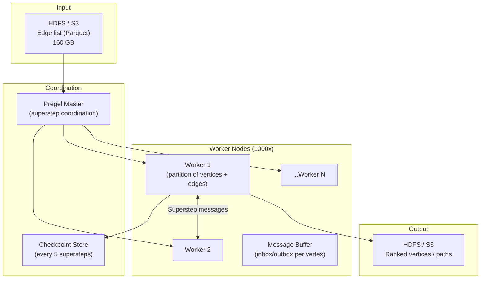
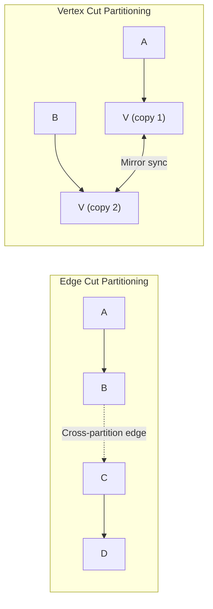

# Design a Large-Scale Graph Processing System — 1B Vertices, 10B Edges

**Difficulty**: 🔴 Advanced
**Reading Time**: 28 minutes
**Interview Frequency**: Medium — asked at social networks, recommendation systems, and data platform companies

---

## Problem Statement

You are asked to design a distributed graph processing system that:

- **Works at**: 1M vertices, 10M edges — NetworkX in Python or single-node Neo4j handles PageRank in minutes.
- **Breaks at**: 1B vertices (Facebook-scale social graph), 10B edges — the graph doesn't fit in a single machine's RAM (10B edges × 16 bytes = 160 GB minimum); PageRank requires 30+ iterations, each touching all edges; naive partitioning causes 90% of messages to cross network boundaries.

Target: **1B vertices**, **10B edges**, **PageRank in < 30 minutes**, **community detection**, **shortest path queries**, on a 1,000-node cluster.

---

## Requirements

### Functional Requirements

| Requirement | Description |
|-------------|-------------|
| Graph Loading | Ingest edge list from HDFS/S3 (CSV or Parquet) |
| PageRank | Compute vertex authority scores (iterative) |
| Shortest Path | Single-source shortest path (BFS/Dijkstra) |
| Community Detection | Find clusters (connected components, Louvain) |
| Graph Updates | Batch updates to graph (new edges/vertices) |
| Result Export | Write results back to HDFS/S3 |

### Non-Functional Requirements

| Requirement | Target |
|-------------|--------|
| Graph Size | 1B vertices, 10B edges |
| PageRank Convergence | < 30 minutes (30 iterations × < 1 min/iteration) |
| Cluster Size | 1,000 nodes × 128 GB RAM = 128 TB total |
| Fault Tolerance | Resume from checkpoint on node failure |
| Communication Overhead | < 20% of total compute time |

---

## Capacity Estimates

- **Graph storage**: 10B edges × 16 bytes (src, dst, weight) = **160 GB** for adjacency list
- **Vertex state (PageRank)**: 1B vertices × 8 bytes = **8 GB** per worker
- **Total working memory**: 160 GB edges + 8 GB vertex state × 30 iterations = ~250 GB → need distributed processing
- **Message passing per iteration**: Each vertex sends score to all neighbors → 10B messages × 8 bytes = **80 GB/iteration**
- **Network bandwidth**: 80 GB / 60 seconds = **1.3 GB/s** inter-node communication → fine at 10 Gbps

---

## High-Level Architecture



---

## Level 1 — Surface: Bulk Synchronous Parallel (BSP) Model

Pregel (and GraphX) uses the **BSP model**:

1. **Superstep S**: Each vertex processes messages received in S-1, updates its value, sends messages to neighbors
2. **Barrier**: All vertices complete superstep S before any starts S+1
3. **Repeat** until convergence (no messages sent or max iterations)

```
// PageRank in Pregel (pseudocode)
class PageRankVertex extends Vertex {
    compute(messages) {
        if (superstep == 0) {
            this.value = 1.0 / numVertices;
        } else {
            // Sum of weighted contributions from incoming messages
            double sum = messages.sum();
            this.value = 0.15 / numVertices + 0.85 * sum;
        }

        // Send score to each neighbor
        double msg = this.value / this.outEdges.count();
        this.outEdges.forEach(e -> sendMessage(e.target, msg));

        if (superstep >= 30) voteToHalt(); // Stop after 30 iterations
    }
}
```

**Why barriers?**: Simplifies fault tolerance — checkpoint after each superstep. Re-run from last checkpoint on failure, not from scratch.

---

## Level 2 — Deep Dive: Graph Partitioning

Graph partitioning determines which vertices/edges live on which worker. Poor partitioning → 90% of messages cross network → communication dominates compute.

### Edge Cut vs. Vertex Cut



| Partitioning | Communication | Balance | Best For |
|-------------|--------------|---------|----------|
| **Random** | High (cuts many edges) | Perfect balance | Baseline |
| **Edge Cut** | Low (fewer cross edges) | Imbalanced (hub vertices) | Power-law graphs |
| **Vertex Cut** | Medium (mirror sync) | Better balance | Power-law graphs (hub vertices split) |
| **Label Propagation** | Lowest | Good | Community-structured graphs |

**Social graphs follow power-law distribution**: 0.1% of users (celebrities) have millions of followers. Edge cut puts celebrity vertex on one partition, sending millions of messages out. Vertex cut replicates the celebrity across multiple partitions — messages stay local.

**GraphX uses vertex cut** by default: celebrity vertex replicated N times; each replica handles a subset of its edges locally. Mirror synchronization after each superstep: O(replicas) messages vs O(edges) messages.

### Handling Stragglers

BSP barrier means entire system waits for the slowest worker. Mitigation strategies:

1. **Speculative execution**: If a task is 2× slower than median, launch duplicate on another worker; use first result
2. **Work stealing**: Idle workers pull tasks from slow workers' queues
3. **Partition rebalancing**: Detect overloaded partitions and migrate vertices between supersteps

---

## Key Design Decisions

### 1. In-Memory vs. Disk-Based Graph Processing

| Approach | Performance | Graph Size Limit | Cost |
|----------|-------------|-----------------|------|
| **In-memory (Pregel, GraphX)** | Fast (no I/O) | RAM capacity (128 TB cluster) | High (lots of RAM) |
| **Disk-based (GraphChi, X-Stream)** | 10–100× slower | Unlimited (disk) | Low |
| **Semi-external (GraphBolt)** | Medium | Limited by vertex state in RAM | Medium |

For 160 GB graph: fits comfortably in 1,000 nodes × 128 GB RAM. Use in-memory processing. If graph grows to 10× (1.6 TB), either add nodes or switch to disk-based.

### 2. Batch vs. Streaming Graph Updates

| Model | Freshness | Consistency | Use Case |
|-------|-----------|-------------|----------|
| **Batch (daily)** | Stale (24h) | Strong (full recompute) | Offline analytics (PageRank) |
| **Incremental (streaming)** | Fresh (minutes) | Approximate | Real-time fraud detection |
| **Hybrid** | Near-real-time (1h) | Good enough | Recommendation systems |

Facebook recomputes social graph recommendations daily (batch) but updates friendship graph incrementally (streaming).

### 3. Fault Tolerance via Checkpointing

Without checkpointing: 30-superstep PageRank, node fails at step 25 → restart from step 0 (5 hours wasted). With checkpointing every 5 supersteps: restart from step 20 → recompute 5 steps (< 5 minutes wasted).

Checkpoint cost: serialize all vertex states to HDFS after every 5 supersteps. 1B vertices × 8 bytes = **8 GB** checkpoint at ~1 GB/s → **8 seconds** overhead per checkpoint.

---

## Interview Questions

| Question | What They're Testing | Key Answer Points |
|----------|---------------------|-------------------|
| How do you handle celebrity vertices with millions of edges? | Graph-specific knowledge | Vertex cut: replicate high-degree vertices across multiple partitions; each replica handles subset of edges; sync mirror values after each superstep |
| Why can't you just use a relational database for graph queries? | Fundamentals | SQL joins for path queries require N self-joins for N hops — exponential cost; graph DB and BSP systems use vertex-centric iteration which is O(edges) |
| How do you achieve < 30 minutes for PageRank on 10B edges? | Performance estimation | 30 iterations × 10B edges × 8 bytes / 1,000 workers / 10 Gbps bandwidth = ~2.4s/iteration for communication + compute; feasible in < 5 min/iteration = < 30 min total |

---

## 📚 Resources & References

| Resource | Type | What You'll Learn |
|----------|------|------------------|
| [Google Pregel Paper (2010)](https://research.google/pubs/pub37252/) | 📖 Blog | BSP model, message passing, fault tolerance, PageRank at scale |
| [Apache Spark GraphX Docs](https://spark.apache.org/graphx/) | 📚 Docs | Graph API, vertex-centric programming, RDD-based graph storage |
| [Facebook Graph Search Engineering](https://engineering.fb.com/2013/08/06/core-infra/under-the-hood-building-graph-search/) | 📖 Blog | Real social graph at billion-scale, inverted index for graph queries |
| [TechDummies YouTube](https://www.youtube.com/@TechDummiesNarendraL) | 📺 YouTube | Distributed computing concepts, MapReduce, graph processing |

---

## Related Concepts

- [Big Data Pipeline](./big-data-pipeline) — ingestion layer that feeds the graph processor
- [Distributed File System](./distributed-file-system) — HDFS stores graph data and checkpoints
- [Distributed Tracing](./distributed-tracing) — observability for long-running distributed jobs
