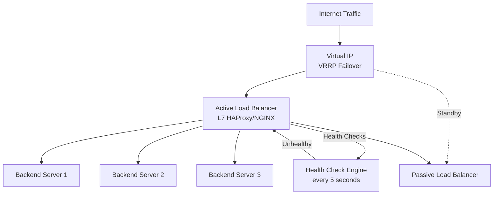

# Design a Load Balancer

**Difficulty**: 🟡 Intermediate
**Reading Time**: Coming Soon
**Interview Frequency**: High

---

> 🚧 **Full article coming soon.** This stub gives you the essentials to start thinking about this problem.

---

## The Core Problem

Distributing traffic across 100 backend servers with health checking and zero-downtime deploys requires a load balancer that can detect failed backends within 2 seconds, route around them transparently, and handle the complexity of sticky sessions (shopping carts, WebSocket upgrades) while not becoming a single point of failure itself.

## Functional Requirements

- Distribute incoming requests across multiple backend servers
- Health check backends and remove unhealthy ones from rotation
- Support multiple routing algorithms (round-robin, least-connections, IP-hash)
- Handle WebSocket and long-lived connections
- Enable zero-downtime backend deploys (graceful drain)

## Non-Functional Requirements

| Requirement | Target |
|-------------|--------|
| Throughput | 1M requests/sec |
| Latency overhead | < 1ms added by LB |
| Health check frequency | Every 5 seconds per backend |
| Failover time | < 10 seconds after backend failure |

## Back-of-Envelope Estimates

- **Request routing**: 1M req/sec ÷ 100 backends = 10,000 req/sec per backend target
- **Health check overhead**: 100 backends × 1 check/5sec = 20 health checks/sec (negligible)
- **Connection table**: 1M concurrent connections × 32 bytes per entry = 32MB state (fits in memory)

## Key Design Decisions

1. **L4 vs L7 Load Balancing** — L4 (TCP) routes by IP/port without reading HTTP; ultra-low latency (< 0.5ms overhead); can't do path-based routing or SSL termination. L7 reads HTTP headers/paths enabling content-based routing, sticky sessions, and SSL offload at 1-2ms overhead.
2. **Consistent Hashing for Sticky Sessions** — IP-hash breaks when servers are added/removed (all sessions rerouted); consistent hashing minimizes disruption — adding 1 server to 10 only reroutes ~10% of sessions instead of 100%.
3. **Active-Passive HA for LB itself** — load balancer must not be SPOF; run active-passive pair sharing a VIP (virtual IP) via VRRP/keepalived; passive becomes active in <2 seconds if active fails.

## High-Level Architecture

## Top Interview Questions for This Problem

| Question | Tests |
|----------|-------|
| How do you route WebSocket connections without breaking them on rebalance? | Sticky sessions, consistent hashing |
| How would you do a zero-downtime deploy of all backend servers? | Graceful drain, rolling restart |
| What's the difference between a load balancer and an API gateway? | Feature comparison, use cases |

## Related Concepts

- [CDN as a distributed edge load balancer](./cdn)
- [Rate limiter that often runs alongside a load balancer](./rate-limiter)

---

*📚 Full deep-dive with multiple approaches, trade-off tables, and pseudocode coming soon.*

## 📚 Resources & References

| Resource | Type | What You'll Learn |
|----------|------|------------------|
| [ByteByteGo — How Load Balancers Work](https://www.youtube.com/@ByteByteGo) | 📺 YouTube | Search "load balancer design" — L4 vs L7, algorithms, health checks |
| [NGINX Load Balancing Guide](https://docs.nginx.com/nginx/admin-guide/load-balancer/http-load-balancer/) | 📚 Docs | Production load balancing configuration with upstream health checks |
| [HAProxy Architecture and Features](https://www.haproxy.org/download/1.8/doc/architecture.txt) | 📚 Docs | How HAProxy handles millions of connections with minimal CPU overhead |
| [AWS Application Load Balancer Design](https://docs.aws.amazon.com/elasticloadbalancing/latest/application/introduction.html) | 📚 Docs | L7 load balancing in cloud — path-based routing, sticky sessions, WAF |
| [Cloudflare: Global Load Balancing](https://www.cloudflare.com/learning/cdn/glossary/global-server-load-balancing-gslb/) | 📖 Blog | Anycast-based global load balancing for latency minimization |
