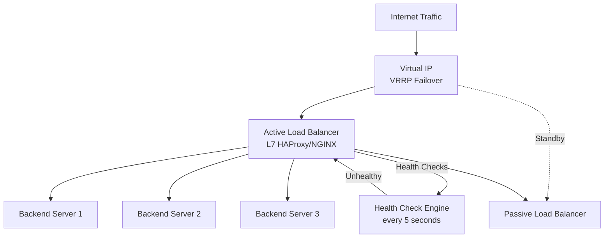
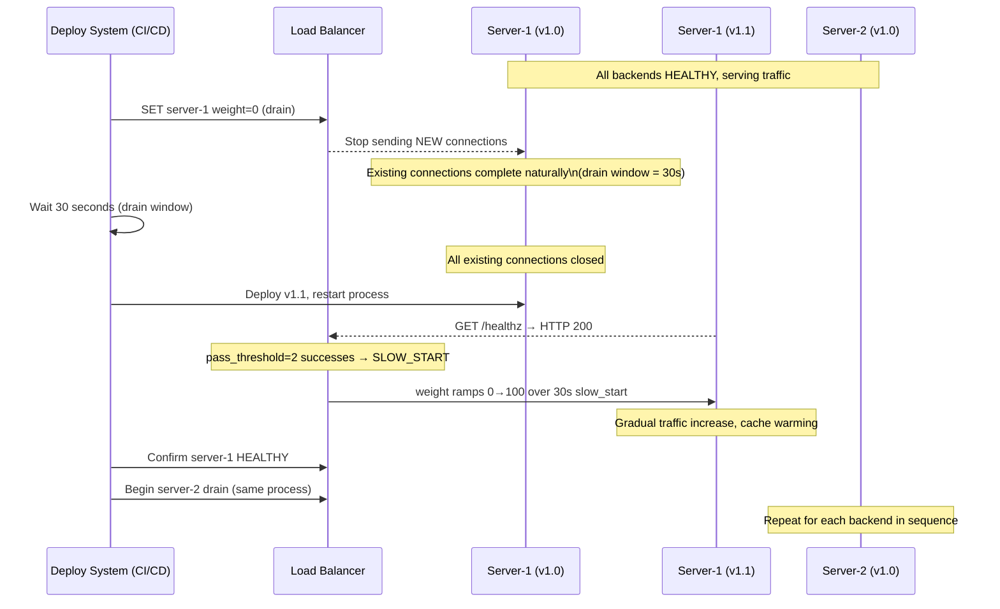
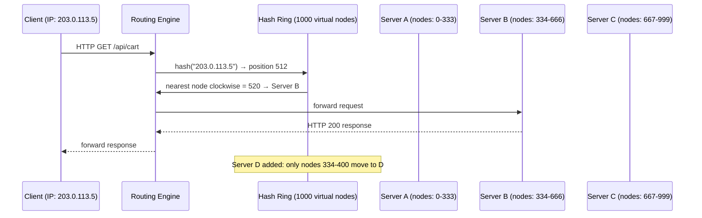
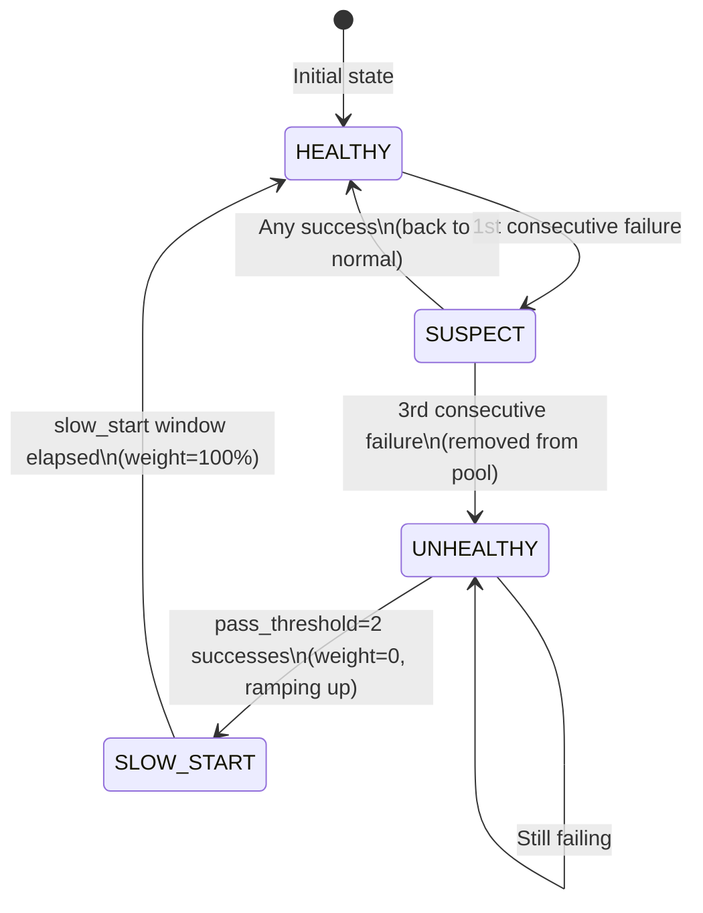
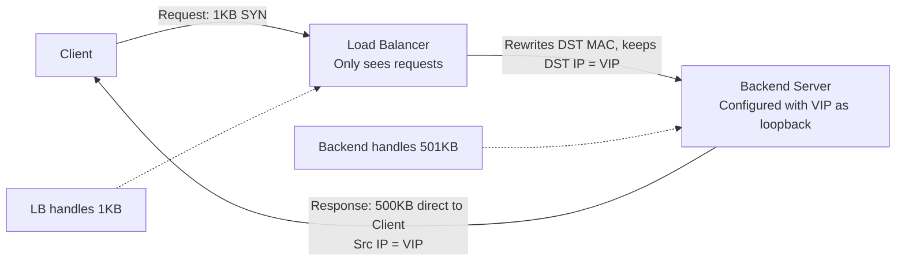

# Design a Load Balancer

**Difficulty**: 🟡 Intermediate
**Reading Time**: Coming Soon
**Interview Frequency**: High

---

## The Core Problem

Distributing traffic across 100 backend servers with health checking and zero-downtime deploys requires a load balancer that can detect failed backends within 2 seconds, route around them transparently, and handle the complexity of sticky sessions (shopping carts, WebSocket upgrades) while not becoming a single point of failure itself.

## Functional Requirements

- Distribute incoming requests across multiple backend servers
- Health check backends and remove unhealthy ones from rotation
- Support multiple routing algorithms (round-robin, least-connections, IP-hash)
- Handle WebSocket and long-lived connections
- Enable zero-downtime backend deploys (graceful drain)

## Non-Functional Requirements

| Requirement | Target |
|-------------|--------|
| Throughput | 1M requests/sec |
| Latency overhead | < 1ms added by LB |
| Health check frequency | Every 5 seconds per backend |
| Failover time | < 10 seconds after backend failure |

## Back-of-Envelope Estimates

- **Request routing**: 1M req/sec ÷ 100 backends = 10,000 req/sec per backend target
- **Health check overhead**: 100 backends × 1 check/5sec = 20 health checks/sec (negligible)
- **Connection table**: 1M concurrent connections × 32 bytes per entry = 32MB state (fits in memory)

## Key Design Decisions

1. **L4 vs L7 Load Balancing** — L4 (TCP) routes by IP/port without reading HTTP; ultra-low latency (< 0.5ms overhead); can't do path-based routing or SSL termination. L7 reads HTTP headers/paths enabling content-based routing, sticky sessions, and SSL offload at 1-2ms overhead.
2. **Consistent Hashing for Sticky Sessions** — IP-hash breaks when servers are added/removed (all sessions rerouted); consistent hashing minimizes disruption — adding 1 server to 10 only reroutes ~10% of sessions instead of 100%.
3. **Active-Passive HA for LB itself** — load balancer must not be SPOF; run active-passive pair sharing a VIP (virtual IP) via VRRP/keepalived; passive becomes active in <2 seconds if active fails.

## High-Level Architecture



## Top Interview Questions for This Problem

| Question | Tests |
|----------|-------|
| How do you route WebSocket connections without breaking them on rebalance? | Sticky sessions, consistent hashing |
| How would you do a zero-downtime deploy of all backend servers? | Graceful drain, rolling restart |
| What's the difference between a load balancer and an API gateway? | Feature comparison, use cases |

## Related Concepts

- [CDN as a distributed edge load balancer](./cdn)
- [Rate limiter that often runs alongside a load balancer](./rate-limiter)

---

## L4 vs L7 Load Balancing — Full Comparison

Understanding the OSI layer at which a load balancer operates is foundational. The choice affects latency, feature set, and operational complexity.

### L4 (Transport Layer) Load Balancing

An L4 load balancer operates on TCP/UDP segments. It sees only source IP, destination IP, source port, and destination port. It does not read the HTTP body, headers, or URL. Routing decisions are made purely from network-layer metadata.

**How it works**: When a TCP SYN arrives, the L4 LB picks a backend using its configured algorithm (round-robin, least-connections, or hash). It rewrites the destination IP to the chosen backend and forwards the packet. For the remainder of that TCP connection, all packets are forwarded to the same backend using a 5-tuple connection table (`src_ip:src_port:dst_ip:dst_port:proto → backend`). The backend receives packets as if the client connected directly — it sees the client's IP as the source (or the LB IP in NAT mode).

**Advantages**:
- Latency overhead < 0.5ms — no payload parsing
- Handles any TCP/UDP protocol (MySQL, Redis, SMTP, gRPC, custom binary)
- Scales to millions of concurrent connections with minimal CPU
- Transparent to TLS — the TLS handshake happens between client and backend directly

**Limitations**:
- Cannot route by URL path (`/api/*` vs `/static/*`)
- Cannot read `Host` header for virtual hosting
- Cannot inject headers (X-Forwarded-For requires extra work at L4)
- Cannot terminate TLS (the encrypted stream is opaque at L4)

### L7 (Application Layer) Load Balancing

An L7 load balancer terminates the client TCP connection, parses the full HTTP request, makes a routing decision based on HTTP metadata, then opens a (potentially pooled) connection to the backend.

**How it works**: The LB completes the TCP and TLS handshake with the client. It reads HTTP headers — `Host`, `Cookie`, `Authorization`, `Content-Type`, URL path. It evaluates routing rules (ACLs in HAProxy terminology). It selects a backend. It forwards the request, optionally modifying headers (adding `X-Forwarded-For`, `X-Request-ID`, stripping internal tokens). The backend receives an HTTP request as if the LB were the client.

**Advantages**:
- Path-based routing: `/api/*` → API cluster, `/static/*` → CDN origin
- Host-based routing: `api.example.com` → API servers, `app.example.com` → app servers
- SSL/TLS termination: one certificate on the LB, plain HTTP to backends
- Cookie injection for sticky sessions
- Request/response header manipulation
- WebSocket upgrade detection and protocol-aware routing

**Limitations**:
- 1–2ms added latency (two TCP connections: client→LB and LB→backend)
- Higher CPU per request (TLS, HTTP parsing)
- Two TCP connections means double the state to manage

### Side-by-Side Comparison

| Dimension | L4 LB | L7 LB |
|-----------|-------|-------|
| OSI layer | 4 (Transport) | 7 (Application) |
| Protocols | Any TCP/UDP | HTTP/1.1, HTTP/2, WebSocket |
| Routing basis | IP + port only | URL, headers, cookies, body |
| Latency added | < 0.5ms | 1–2ms |
| SSL termination | No | Yes |
| Path-based routing | No | Yes |
| Sticky sessions (cookie) | No | Yes |
| Header injection | No | Yes |
| Throughput ceiling | ~10M req/sec per instance | ~500k–1M req/sec per instance |
| CPU per request | ~1µs | ~10–50µs |
| Example tools | LVS/IPVS, AWS NLB, F5 BIG-IP | HAProxy, NGINX, AWS ALB, Envoy |

**Rule of thumb**: Use L4 when you need maximum throughput and don't need HTTP-level features. Use L7 when you need content-based routing, SSL termination, or observability at the request level. Most modern production systems deploy both: an L4 LB at the edge for raw throughput and DDoS absorption, with L7 LBs behind it for application-aware routing.

---

## Zero-Downtime Deploy Walkthrough

Zero-downtime deploys are one of the most important operational features of a load balancer. Here is the exact sequence for a rolling restart of 10 backend servers, one at a time, without dropping a single user request.



**Key parameters that make this work**:
- `drain_timeout = 30s` — how long to wait for existing connections to close before forcibly terminating. For git clone traffic (large repos), this may need to be 300s.
- `slow_start = 30s` — ramp window after recovery. Without this, a freshly started JVM with cold caches would receive 10k req/sec instantly and likely OOM or timeout.
- `max_concurrent_draining = 1` — only drain one server at a time. Draining 2 of 10 simultaneously means 20% capacity drop; draining 1 means only 10%.
- `health_check_interval = 2s` — during deploys, reduce from 5s to 2s so a newly healthy backend enters rotation faster.

**What happens to a WebSocket connection during drain**: A WebSocket is a long-lived TCP connection upgraded from HTTP. When the LB sets a backend to weight=0, new HTTP requests stop going there, but the existing WebSocket TCP connection stays open (the LB doesn't close it). The drain window must be long enough for WebSocket sessions to either close naturally or for the application to send a close frame. If the drain window expires before WebSocket sessions close, the LB closes the TCP connection and clients see a disconnect event — they typically reconnect automatically.

---

## Component Deep Dive 1: Routing Algorithm Engine

The routing algorithm engine is the most critical component — it makes 1M+ decisions per second, must be lock-free under concurrent access, and directly determines whether backends are evenly utilized or whether some are overloaded while others sit idle.

### How It Works Internally

At its core, the routing engine maintains an in-memory data structure representing the pool of available backends. For round-robin, this is a simple atomic counter. For least-connections, this is a min-heap or sorted structure keyed by active connection count. For consistent hashing, this is a ring of 1000+ virtual nodes mapped to physical backends.

**Round-Robin (naive approach)**: A global counter is incremented on each request and taken modulo the server count. The problem at scale: this counter is a shared mutable integer. At 500k req/sec, a mutex around this counter becomes a hot bottleneck — benchmarks show lock contention degrading throughput by 40% beyond 8 CPU cores. The fix is per-thread counters that are reconciled periodically, or lock-free CAS (compare-and-swap) operations.

**Least-Connections (naive approach)**: Iterating a list of backends to find the minimum active connection count is O(n) per request. At n=1000 backends and 500k req/sec, that is 500M comparisons per second — clearly unacceptable. Production implementations use a heap structure for O(log n) selection, but even heap updates under concurrent decrement/increment require careful atomic updates to avoid stale reads.

**Consistent Hashing** distributes backends across a hash ring with multiple virtual nodes per physical server (typically 150 virtual nodes per server). A client's key (IP, session ID) is hashed to a ring position, and the request routes to the nearest virtual node clockwise. Adding a server only displaces the virtual nodes immediately counterclockwise — approximately `(1/n)` of total traffic — not a full reshuffle.



### Trade-off Table: Routing Algorithms

| Approach | Latency Overhead | Fairness | Session Continuity | Best For |
|----------|-----------------|----------|--------------------|----------|
| Round-Robin | ~0.1µs | Equal request count, not equal load | None — next request goes elsewhere | Stateless, uniform request cost |
| Least-Connections | ~1µs (heap lookup) | Equal active load | None | Mixed workloads, variable request duration |
| Consistent Hashing | ~2µs (hash compute) | Uneven unless virtual nodes tuned | Strong — same client → same backend | Sticky sessions, caches, stateful backends |
| Weighted Round-Robin | ~0.2µs | Proportional to weight | None | Heterogeneous hardware (2x CPU → 2x weight) |

---

## Component Deep Dive 2: Health Check Engine

The health check engine runs asynchronously from the request path and is responsible for maintaining the authoritative view of backend availability. A false-positive unhealthy verdict silently removes capacity; a false-negative keeps a broken backend in rotation, causing user-facing errors. Both are production disasters.

### Internal Mechanics

Each backend has a health check probe running on a configurable interval (typically 5 seconds). The probe opens a TCP connection or sends an HTTP request (e.g., `GET /healthz`) and expects a response within a timeout (typically 2 seconds). A backend transitions to UNHEALTHY only after `fail_threshold` consecutive failures (typically 3), and transitions back to HEALTHY only after `pass_threshold` consecutive successes (typically 2). This hysteresis prevents flapping — a backend oscillating between states would otherwise cause a storm of routing table updates.

**The slow-start problem**: When a backend recovers from failure, it has empty caches, cold JVM JIT, and zero warm-up. Instantly sending it 10% of 1M req/sec = 100k req/sec causes a second failure cascade. Production load balancers implement slow-start: the backend's effective weight ramps linearly from 0 to full over a configurable window (e.g., 30 seconds). HAProxy calls this `slowstart` and NGINX calls it `slow_start`.

**At 10x load (10M req/sec, 1000 backends)**: Health check overhead becomes non-trivial. 1000 backends × 1 probe/5sec = 200 probes/sec. Each probe requires a TCP handshake + HTTP round-trip. If the health check runs on the same thread pool as request routing, 200 concurrent TCP connections compete for file descriptors and CPU. Production systems dedicate a separate event loop to health checks with its own connection pool.



### Trade-off: Health Check Depth

| Check Type | Detects | False Negatives | Overhead |
|------------|---------|-----------------|----------|
| TCP ping | Port is listening | App is hung, DB is down | Minimal — 1 SYN/ACK |
| HTTP /healthz (shallow) | App process alive | DB connection pool exhausted | Low — 1 HTTP round-trip |
| HTTP /healthz (deep) | App + all dependencies | Cascading removes if shared DB degrades | Medium — hits DB on every probe |
| Synthetic transaction | End-to-end user path | N/A | High — runs actual business logic |

---

## Component Deep Dive 3: Session Persistence (Sticky Sessions)

Sticky sessions solve the problem of stateful backends: if a user's shopping cart lives in the memory of Server A, routing their next request to Server B means their cart is gone. The load balancer must recognize "this client belongs to Server A" and maintain that binding.

### Implementation Options

**Cookie-based persistence**: The load balancer injects a cookie (e.g., `SERVERID=serverA`) into the first response. On subsequent requests, the LB reads this cookie and routes to the same backend. This is transparent to the backend and works through NAT (where IP-hash fails because millions of users share one corporate NAT IP). HAProxy calls this `cookie insert` mode. The downside: the cookie reveals backend topology (security concern), and it requires the LB to parse HTTP headers (cannot be done at L4).

**IP-hash persistence**: The client IP is hashed to a backend. Simple, but breaks when millions of users share one egress IP (corporate proxies, mobile carrier NAT). Adding/removing a backend causes O(n) session rerouting.

**Consistent-hash persistence**: Client IP or session ID is hashed to a ring position. Adding a backend only displaces ~1/n sessions. Virtual nodes (150 per backend) ensure even distribution even with an uneven hash ring.

**Session state externalization**: The most scalable approach is to make backends truly stateless by storing session data in Redis or Memcached. Any backend can handle any request because session state is fetched from the external store. This eliminates sticky sessions entirely, but adds ~1ms latency per request for the Redis lookup and a Redis dependency.

### Sticky Session Trade-off Table

| Approach | NAT-safe | Server add/remove disruption | Requires L7 | Security concern |
|----------|----------|------------------------------|-------------|------------------|
| IP-hash | No — NAT breaks it | ~100% rerouted | No (works at L4) | Low |
| Cookie insert | Yes | 0% — cookie pinned to backend_id | Yes — must read cookie | Medium — leaks server names |
| Consistent hash (IP) | No | ~1/n rerouted | No | Low |
| Consistent hash (session ID) | Yes | ~1/n rerouted | Yes — must read session cookie | Low |
| External session store (Redis) | Yes | 0% — no stickiness needed | Yes | Low — session in Redis, not in cookie |

**Recommendation for new systems**: Use external session store (Redis) from day one. Sticky sessions are a workaround for stateful backends — eliminate the statefulness rather than routing around it. The only valid exception is WebSocket connections, where the persistent TCP connection inherently pins the client to one backend for the session's lifetime.

---

## Data Model

The load balancer maintains several in-memory and persistent data structures. Below is the schema for the backend registry, health state, and sticky session table:

```sql
-- Backend pool registry (persisted to config file / service registry)
CREATE TABLE backends (
    backend_id     VARCHAR(64)  PRIMARY KEY,          -- "server-prod-001"
    address        VARCHAR(128) NOT NULL,              -- "10.0.1.15:8080"
    weight         SMALLINT     NOT NULL DEFAULT 100,  -- 1-100, used for weighted round-robin
    zone           VARCHAR(32),                        -- "us-east-1a" (prefer local zone routing)
    max_connections INT          NOT NULL DEFAULT 10000,
    slow_start_secs SMALLINT    NOT NULL DEFAULT 30,
    created_at     TIMESTAMPTZ  NOT NULL DEFAULT now(),
    drain_started_at TIMESTAMPTZ                       -- NULL = active, non-NULL = draining
);

-- Health state (in-memory; snapshotted to disk for warm restarts)
CREATE TABLE backend_health (
    backend_id          VARCHAR(64) PRIMARY KEY REFERENCES backends(backend_id),
    state               VARCHAR(16) NOT NULL,           -- HEALTHY | SUSPECT | UNHEALTHY | SLOW_START
    consecutive_failures SMALLINT   NOT NULL DEFAULT 0,
    consecutive_passes   SMALLINT   NOT NULL DEFAULT 0,
    last_check_at        TIMESTAMPTZ,
    last_failure_reason  TEXT,                          -- "timeout after 2000ms", "HTTP 503"
    slow_start_started_at TIMESTAMPTZ,                  -- when SLOW_START began
    effective_weight     SMALLINT   NOT NULL DEFAULT 0  -- 0 during drain/slow_start, ramps to weight
);

-- Sticky session table (in-memory hash map; evicted on TTL)
CREATE TABLE sticky_sessions (
    session_key   VARCHAR(256) PRIMARY KEY,  -- hash of client IP or cookie value
    backend_id    VARCHAR(64)  NOT NULL REFERENCES backends(backend_id),
    created_at    TIMESTAMPTZ  NOT NULL DEFAULT now(),
    last_seen_at  TIMESTAMPTZ  NOT NULL DEFAULT now(),
    ttl_seconds   INT          NOT NULL DEFAULT 3600
);
CREATE INDEX idx_sticky_sessions_backend ON sticky_sessions(backend_id);
CREATE INDEX idx_sticky_sessions_last_seen ON sticky_sessions(last_seen_at);

-- Routing metrics (ring buffer, 60-second rolling window)
CREATE TABLE backend_metrics (
    backend_id       VARCHAR(64) NOT NULL,
    window_start     TIMESTAMPTZ NOT NULL,
    requests_routed  BIGINT      NOT NULL DEFAULT 0,
    active_conns     INT         NOT NULL DEFAULT 0,
    p50_latency_ms   FLOAT,
    p99_latency_ms   FLOAT,
    error_rate_pct   FLOAT,
    PRIMARY KEY (backend_id, window_start)
);
```

**Key indexes**: `idx_sticky_sessions_backend` is critical for draining — when a backend is marked for drain, look up all sessions pinned to it and either let them expire or reroute to a healthy backend. `idx_sticky_sessions_last_seen` powers the TTL sweeper that evicts stale sessions (runs every 60 seconds).

---

## Scale Bottlenecks

| Traffic Level | Component That Breaks | Symptoms | Mitigation |
|---------------|----------------------|----------|------------|
| **10x baseline** (10M req/sec) | Routing algorithm shared state (lock contention on connection counter) | CPU spikes to 100% on LB cores, latency climbs from 0.5ms to 5ms | Per-thread round-robin counters; lock-free CAS for least-connections heap |
| **10x baseline** | Sticky session hash map (~10M entries × 64 bytes = 640MB) | LB memory pressure, OOM if session TTL too long | Reduce TTL from 1h to 5min, or offload sticky state to Redis |
| **100x baseline** (100M req/sec) | Single LB NIC bandwidth (10Gbps NIC saturates at ~83M req/sec at 150 bytes avg) | Packet drops at NIC, increasing retransmits | ECMP (Equal-Cost Multi-Path) with multiple LB instances behind Anycast VIP; DSR (Direct Server Return) to remove LB from response path |
| **100x baseline** | SSL termination CPU (RSA-2048 handshake = 1-2ms, 10k handshakes/sec saturates 8 cores) | TLS handshake latency spikes, connection timeouts | TLS session resumption (reduces handshakes by 80%), hardware SSL offload (Cavium Nitrox), ECDHE with P-256 (4x faster than RSA-2048) |
| **1000x baseline** (1B req/sec) | Single-region LB cluster (no single machine or cluster handles 1B req/sec) | Regional packet loss, cross-region latency | Global Server Load Balancing (GSLB) with Anycast DNS; traffic sharded by geography before reaching per-region LB clusters |
| **1000x baseline** | Health check fan-out (100k backends × 200ms check = 500k probes/sec) | Health check loop falls behind real failures; false-negatives spike | Hierarchical health checking — regional LBs check local backends, global LB checks regional LBs; gossip-based failure detection (Serf/Consul) |

---

## How GitHub Built Their Load Balancing Infrastructure

GitHub operates one of the world's largest Git hosting platforms — over 100 million repositories, 3.5+ billion Git operations per month, and global traffic peaks of several hundred thousand requests per second. Their load balancing architecture is well-documented through their engineering blog.

**The core challenge**: Git operations are not simple HTTP requests. A `git clone` on a large repository streams gigabytes of pack objects over a single long-lived HTTP connection. A `git push` involves a negotiation phase followed by a data transfer. The load balancer must handle connections that last from milliseconds (API calls) to several minutes (large clones), without treating them identically.

**Technology stack**: GitHub runs HAProxy as their primary L7 load balancer. They use it for its combination of extreme performance (HAProxy is single-threaded event loop in older versions, multi-threaded in 2.0+), rich ACL capabilities, and excellent observability (HAProxy stats socket exposes per-backend metrics). They also use it in front of GitHub.com's Ruby on Rails app tier, with separate HAProxy instances for git-specific traffic.

**Non-obvious decision — connection draining for deploys**: GitHub deploys to production multiple times per day. During a backend deploy, HAProxy's `maxconn` and `weight` settings are programmatically reduced to zero by their deploy system (Hubot/Chatops integration). The backend is left in rotation for its drain window (30 seconds for API, 5 minutes for git clone traffic), then removed. Long-running git clone connections are not interrupted — they complete naturally while the backend shuts down. This is operationally critical: forcibly killing a 2GB clone mid-stream frustrates users and wastes both client and server work.

**Specific numbers published**: In a 2017 blog post, GitHub reported that a single HAProxy instance handles 160,000 connections per second with < 1ms added latency, running on commodity hardware with 64 cores and 256GB RAM. Their git tier uses consistent hashing to pin repositories to specific backend groups (improving pack cache hit rates by 40%), since the pack objects for a given repository are likely already in memory on the "owner" backend.

**Source**: GitHub Engineering Blog — "Building GitHub's Infrastructure" (2017), and GitHub Universe talks on their deploy architecture. HAProxy is also used by Twitter, Reddit, and Stack Overflow in similar configurations.

### DSR (Direct Server Return) Architecture

One technique GitHub and other hyperscalers use to break the throughput ceiling of a single LB is Direct Server Return. In standard proxy mode, every byte of both request and response passes through the LB — for a 1MB API response, the LB handles 1MB inbound (from backend) and 1MB outbound (to client). Response traffic is typically 10-100x request traffic for content-heavy workloads. DSR eliminates the response hairpin:



In DSR, the backend is configured with the VIP as a loopback interface (`ip addr add 203.0.113.1/32 dev lo`). The backend responds directly to the client with source IP = VIP. The LB only touches the inbound request — it rewrites the destination MAC address to the chosen backend's MAC (same L2 broadcast domain required), but leaves the destination IP as the VIP. The backend accepts the packet because it has the VIP on its loopback. This means the LB's outbound bandwidth is zero — it only forwards inbound packets. A 10Gbps LB that was handling 83M req/sec at 150 bytes/request can now handle the same inbound volume while backends handle all response bandwidth directly.

---

## Interview Angle

**What the interviewer is testing:** Whether the candidate can reason about the load balancer itself as a distributed system component — not just a black box in front of backends. Specifically: does the candidate proactively identify the LB as a potential SPOF, and do they know the practical tradeoffs between L4 and L7?

**Common mistakes candidates make:**

1. **Designing a single load balancer with no HA.** Candidates draw one LB box and move on. The interviewer is waiting for the candidate to say "but now the LB is the single point of failure." The correct answer immediately introduces VRRP/keepalived with a VIP, or notes that cloud LBs (AWS ALB/NLB) are managed and multi-AZ by design. Skipping this signals the candidate doesn't think end-to-end about failure modes.

2. **Defaulting to round-robin for all workloads.** Candidates say "use round-robin" without qualifying when it breaks. Round-robin is wrong when requests have variable cost (a 10ms API call vs. a 30-second report generation). Least-connections is the correct default for mixed workloads, with round-robin reserved for uniform-cost stateless APIs.

3. **Confusing sticky sessions with session storage.** Candidates mix up "sticky sessions route the same client to the same backend" with "the session state is stored in the backend." They are distinct. Sticky sessions paper over a stateful backend. The production-grade fix is stateless backends with externalized session storage (Redis), which eliminates sticky sessions entirely. Knowing this distinction shows operational maturity.

**The insight that separates good from great answers:** Great candidates mention **Direct Server Return (DSR)** or **Maglev-style** consistent hashing. In DSR, the load balancer only handles inbound traffic — backend servers respond directly to clients without hairpinning through the LB, effectively doubling LB throughput. Maglev (Google's software load balancer) uses a consistent hashing algorithm optimized to minimize connection disruption when LBs scale horizontally. Mentioning either of these signals awareness of how hyperscalers actually solve the 1M+ req/sec problem.

---

## Key Numbers to Remember

| Metric | Value | Context |
|--------|-------|---------|
| L4 routing overhead | < 0.5ms | TCP passthrough, no header inspection |
| L7 routing overhead | 1–2ms | Full HTTP parse, SSL termination |
| VRRP failover time | ~1–2 seconds | Active → Passive promotion via keepalived |
| Health check interval | 5 seconds | Standard; reduce to 2s for latency-sensitive services |
| Consecutive failures before remove | 3 | Prevents flapping on transient hiccups |
| Slow-start ramp window | 30 seconds | Cold-start ramp to prevent cascade on recovery |
| Consistent hash virtual nodes | 150 per backend | Ensures ≤5% distribution variance at n=10+ backends |
| Session rerouted on server add (IP-hash) | ~100% | Why IP-hash is broken for sticky sessions at scale |
| Session rerouted on server add (consistent hash) | ~1/n | Adding 1 server to 10 reroutes ~10% of sessions |
| Single HAProxy instance capacity | ~160k conn/sec | 64-core, 256GB RAM server (GitHub production data) |
| SSL RSA-2048 handshake cost | 1–2ms, ~5k/sec/core | Use ECDHE P-256 (4x faster) or session resumption |
| NIC saturation (10GbE at 150B avg) | ~83M req/sec | Beyond this, need ECMP multi-LB or DSR |

---

## Pseudocode: Core Routing Loop

The following pseudocode illustrates how a production L7 load balancer's main request-handling loop works, combining health state, sticky session lookup, and least-connections selection:

```python
# In-memory state (shared across threads via thread-safe structures)
backends: List[Backend]          # all configured backends
health: Dict[str, HealthState]   # backend_id → HEALTHY/SUSPECT/UNHEALTHY/SLOW_START
active_conns: Dict[str, AtomicInt]  # backend_id → current active connection count
sticky_map: LRUCache             # session_key → backend_id (TTL=3600s)
rr_counter: AtomicInt = 0        # for round-robin fallback

class Backend:
    id: str              # "server-prod-001"
    address: str         # "10.0.1.15:8080"
    weight: int          # 1-100
    effective_weight: int  # 0 during drain/slow_start, ramps to weight
    max_connections: int

def handle_request(request: HttpRequest) -> HttpResponse:
    # Step 1: Sticky session lookup (O(1) hash map)
    session_key = extract_session_key(request)  # cookie value or hashed IP
    if session_key and session_key in sticky_map:
        pinned_backend_id = sticky_map[session_key]
        pinned_backend = get_backend(pinned_backend_id)
        if health[pinned_backend_id] == HEALTHY:
            return forward(request, pinned_backend)
        # else: pinned backend is down, fall through to normal selection

    # Step 2: Select backend (least-connections among healthy backends)
    candidate = select_backend_least_connections()
    if candidate is None:
        return HttpResponse(503, "No healthy backends available")

    # Step 3: Update sticky session binding
    if session_key:
        sticky_map[session_key] = candidate.id  # refresh TTL

    # Step 4: Forward and track connection
    active_conns[candidate.id].increment()
    try:
        response = forward(request, candidate)
        return response
    except BackendError as e:
        health_check_engine.record_failure(candidate.id, reason=str(e))
        return HttpResponse(502, "Bad Gateway")
    finally:
        active_conns[candidate.id].decrement()

def select_backend_least_connections() -> Optional[Backend]:
    # Filter to healthy backends with capacity
    available = [
        b for b in backends
        if health[b.id] == HEALTHY
        and b.effective_weight > 0
        and active_conns[b.id].get() < b.max_connections
    ]
    if not available:
        return None
    # Pick backend with fewest active connections, weighted by effective_weight
    # weighted_score = active_conns / effective_weight (lower = better)
    return min(available, key=lambda b: active_conns[b.id].get() / b.effective_weight)

def extract_session_key(request: HttpRequest) -> Optional[str]:
    # Cookie-based: read SERVERID cookie
    cookie = request.cookies.get("SERVERID")
    if cookie:
        return f"cookie:{cookie}"
    # Fallback: hash client IP (less accurate through NAT)
    return f"ip:{hash(request.remote_addr) % 1000}"

# Health check loop (runs in separate thread, every 5 seconds per backend)
def health_check_loop():
    while True:
        for backend in backends:
            result = probe(backend)  # TCP connect or HTTP GET /healthz
            update_health_state(backend.id, result)
        sleep(5)

def update_health_state(backend_id: str, probe_success: bool):
    state = health[backend_id]
    if probe_success:
        state.consecutive_failures = 0
        state.consecutive_passes += 1
        if state.current == UNHEALTHY and state.consecutive_passes >= PASS_THRESHOLD:
            state.current = SLOW_START
            state.slow_start_started_at = now()
            state.effective_weight = 0  # ramp up in background
    else:
        state.consecutive_passes = 0
        state.consecutive_failures += 1
        if state.consecutive_failures >= FAIL_THRESHOLD:
            state.current = UNHEALTHY
            state.effective_weight = 0  # immediately remove from rotation
```

**Critical implementation notes**:

- `active_conns` must use atomic integers (e.g., `std::atomic<int>` in C++, `AtomicInteger` in Java). A race condition where two threads both read 99 connections, both decide the backend is under limit, and both route to it simultaneously can cause backends to exceed `max_connections` by the number of concurrent threads.
- The `sticky_map` LRU cache must have bounded size. At 1M req/sec with 1-hour TTL, unbounded sticky_map grows to millions of entries. Cap at 10M entries × 64 bytes = 640MB, then evict LRU entries.
- `select_backend_least_connections` is O(n) where n = number of healthy backends. For n ≤ 100 this is fine (100 comparisons at 1M req/sec = 100M comparisons/sec, ~100µs of CPU time per second — acceptable). For n = 10,000 backends, use a min-heap for O(log n) = ~130 comparisons, 300x less work.

---

## Request Lifecycle: End-to-End

A complete trace of a single HTTPS API request through an L7 load balancer, from TCP SYN to response delivered:

```
t=0ms     Client → SYN → LB VIP (203.0.113.1:443)
t=0.1ms   LB → SYN-ACK → Client  [TCP handshake complete]
t=0.2ms   Client → TLS ClientHello → LB
t=1.5ms   LB completes TLS handshake (ECDHE P-256, ~1.3ms)
           LB has client certificate, SNI hostname = "api.example.com"
t=1.6ms   Client → HTTP/2 GET /api/v1/users?page=2
           Headers: Cookie=SERVERID=server-prod-007; Authorization=Bearer xyz

t=1.7ms   LB parses HTTP headers
           → sticky_map lookup: "cookie:server-prod-007" → backend "server-prod-007"
           → health["server-prod-007"] = HEALTHY ✓
           → active_conns["server-prod-007"] = 42 (well under max 10000)
           → route to server-prod-007 (10.0.1.7:8080)

t=1.8ms   LB → TCP SYN → server-prod-007:8080  [connection from LB's pool, already open]
           (LB maintains keep-alive connection pool to each backend; no new handshake needed)
t=1.9ms   LB → HTTP/1.1 GET /api/v1/users?page=2
           X-Forwarded-For: 198.51.100.42  (original client IP)
           X-Request-ID: 7f3a9b2c-...      (LB-injected for tracing)
           Host: api.example.com

t=5ms     server-prod-007 → HTTP 200 + JSON body (8KB)
t=5.1ms   LB → TLS-encrypted HTTP/2 DATA frames → Client
t=5.2ms   active_conns["server-prod-007"].decrement() → 41

Total LB added latency: ~1.9ms (1.3ms TLS + 0.6ms routing + connection pooling)
Backend processing time: ~3.1ms
End-to-end: ~5.2ms
```

**Connection pooling is critical**: Without connection pooling, every request would require a new TCP + TLS handshake to the backend (another 1-2ms). HAProxy and NGINX maintain persistent keep-alive connection pools to each backend. At 1M req/sec with 100 backends, that is 10k req/sec per backend — a pool of 50-200 connections per backend handles this with ~1ms average wait time (Little's Law: N = λW → 200 = 10k × 0.02s).

---

## Common Production Failure Modes

| Failure | Root Cause | Detection | Recovery |
|---------|-----------|-----------|----------|
| **Thundering herd on backend restart** | All backends restarted simultaneously; cold caches; LB sends 100% traffic to new instances | P99 latency spike from 50ms to 5000ms; error rate >1% | Rolling restart (1 at a time) + slow_start; never restart >20% of pool simultaneously |
| **Health check false positive (removed healthy backend)** | Transient network blip between LB and backend causing 3 consecutive timeouts | Capacity drops unexpectedly; remaining backends see 10-15% traffic spike | Increase fail_threshold from 3 to 5; use shorter timeout (500ms) with more retries |
| **Sticky session storm (backend removed, all sessions reroute)** | Unhealthy backend had 200k sticky sessions; all re-pinned to remaining backends in one second | 200k req spike to remaining backends; possible cascade failure | Use consistent hashing to spread re-pinning; rate-limit session re-pinning to 10k/sec |
| **SSL certificate expiry** | Certificate on LB expired; all HTTPS connections refused | 100% error rate for HTTPS clients; HTTP still works | Automate cert renewal (Let's Encrypt + certbot); alert at 30 days, 7 days, 1 day before expiry |
| **Backend connection pool exhaustion** | Backend has maxconn=10000; 10001 concurrent requests queued; LB queue grows unbounded | Backend response time climbs; LB queue depth metric rises; clients see timeouts | Set LB queue timeout (e.g., 5s); return 503 if queue full; add backend capacity or shed load upstream |

---

*📚 Full deep-dive with multiple approaches, trade-off tables, and pseudocode coming soon.*

## 📚 Resources & References

| Resource | Type | What You'll Learn |
|----------|------|------------------|
| [ByteByteGo — How Load Balancers Work](https://www.youtube.com/@ByteByteGo) | 📺 YouTube | Search "load balancer design" — L4 vs L7, algorithms, health checks |
| [NGINX Load Balancing Guide](https://docs.nginx.com/nginx/admin-guide/load-balancer/http-load-balancer/) | 📚 Docs | Production load balancing configuration with upstream health checks |
| [HAProxy Architecture and Features](https://www.haproxy.org/download/1.8/doc/architecture.txt) | 📚 Docs | How HAProxy handles millions of connections with minimal CPU overhead |
| [AWS Application Load Balancer Design](https://docs.aws.amazon.com/elasticloadbalancing/latest/application/introduction.html) | 📚 Docs | L7 load balancing in cloud — path-based routing, sticky sessions, WAF |
| [Cloudflare: Global Load Balancing](https://www.cloudflare.com/learning/cdn/glossary/global-server-load-balancing-gslb/) | 📖 Blog | Anycast-based global load balancing for latency minimization |
