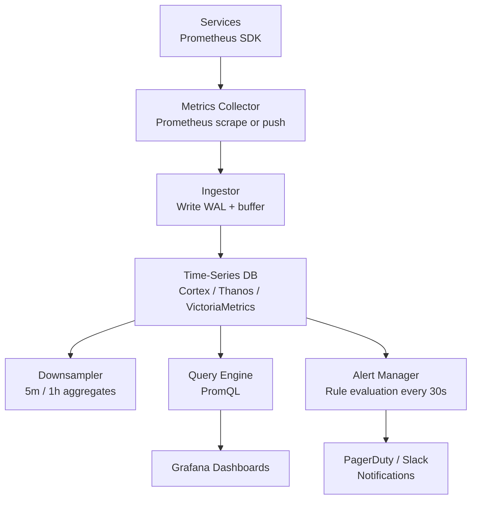

# Design a Metrics & Alerting System (Datadog/Prometheus)

**Difficulty**: 🔴 Advanced
**Reading Time**: Coming Soon
**Interview Frequency**: High

---

> 🚧 **Full article coming soon.** This stub gives you the essentials to start thinking about this problem.

---

## The Core Problem

Storing 1 million time-series metrics at 10-second resolution for 1 year — with sub-second query response for dashboards — requires specialized storage that general-purpose databases can't provide efficiently. High cardinality (100K unique label combinations per metric) and the need for range aggregation queries make this a hard storage problem.

## Functional Requirements

- Ingest metric data points (metric_name, labels, value, timestamp)
- Store 1M metrics at 10-second resolution
- Query: aggregations over time ranges, downsampling, rate calculation
- Alerting: evaluate alert rules every 30 seconds, notify when threshold exceeded
- Retention: 1-year hot storage with downsampling for historical data

## Non-Functional Requirements

| Requirement | Target |
|-------------|--------|
| Ingest throughput | 1M data points/sec |
| Query latency | p99 < 1 second for 24-hour range query |
| Alert evaluation | Every 30 seconds, < 5-second trigger delay |
| Storage efficiency | 2 bytes/sample with compression (vs 16 bytes raw) |

## Back-of-Envelope Estimates

- **Raw storage**: 1M metrics × 6 samples/min × 525,600 min/year × 16 bytes = ~50TB/year raw
- **With Gorilla compression**: 50TB × 12% compression ratio ≈ 6TB/year — manageable
- **Alert rules**: 100K alert rules × 1 evaluation/30sec = 3,333 evaluations/sec

## Key Design Decisions

1. **TSDBs Use Delta-of-Delta Encoding** — timestamps are nearly sequential (Δ=10s always); values often change slowly; Gorilla encoding stores Δ of Δ of timestamps and XOR of successive float values achieving ~1.37 bytes/sample vs 16 bytes raw.
2. **Downsampling for Long-Term Retention** — keep raw 10s data for 7 days; downsample to 5-minute aggregates for 90 days; 1-hour aggregates for 1 year; reduces storage 60x for old data while preserving long-term trends.
3. **Cardinality Explosion Prevention** — each unique label combination creates a new time series; adding `user_id` label to a metric creates 100M series instead of 1; enforce label cardinality limits (<10K unique values per label) at ingest time.

## High-Level Architecture

## Top Interview Questions for This Problem

| Question | Tests |
|----------|-------|
| What is high cardinality and why does it kill a metrics system? | Label explosion, memory implications |
| How does Gorilla compression achieve 12x compression on time-series data? | Delta encoding, XOR floats |
| How would you design alerts that avoid false positives during deployments? | Alert inhibition, deployment awareness |

## Related Concepts

- [Distributed tracing for request-level observability complement](./distributed-tracing)
- [Web analytics for similar time-series aggregation challenges](../01-data-processing/web-analytics)

---

*📚 Full deep-dive with multiple approaches, trade-off tables, and pseudocode coming soon.*
