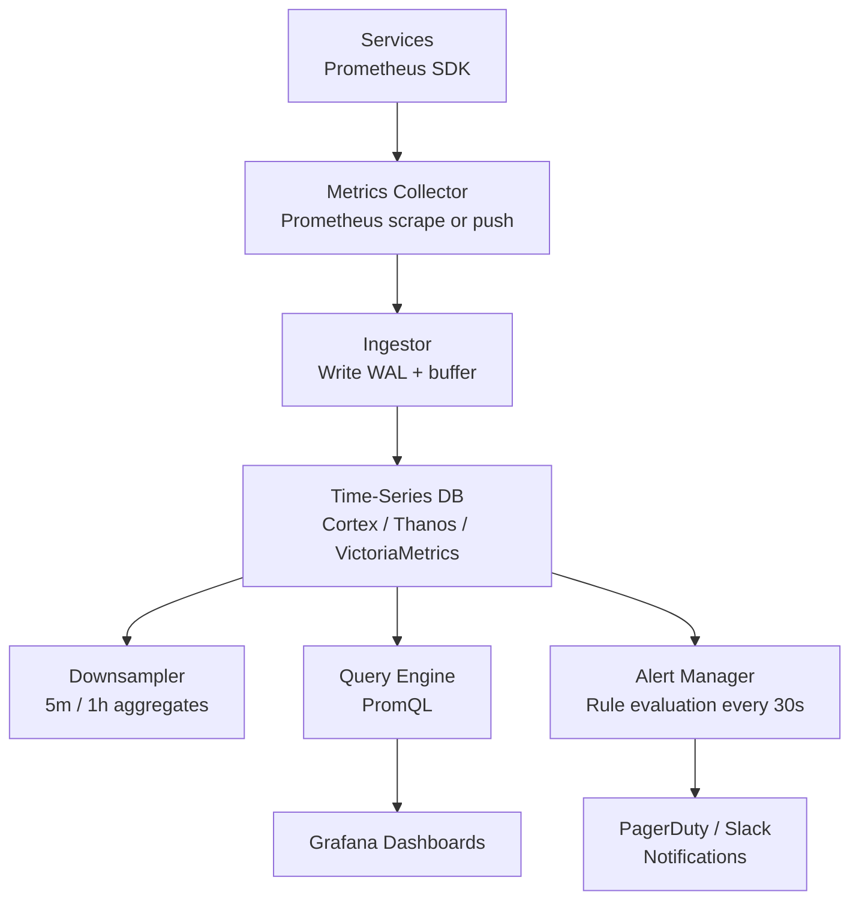
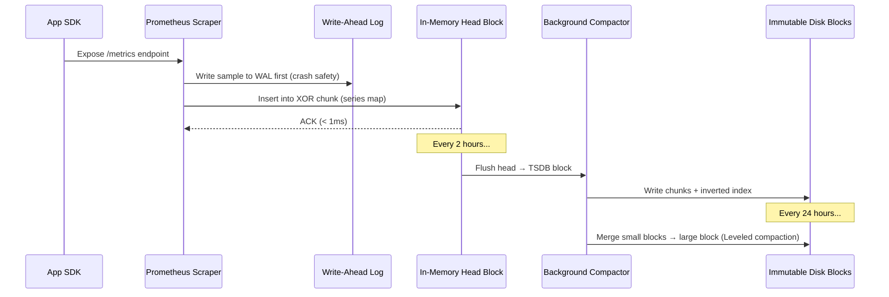
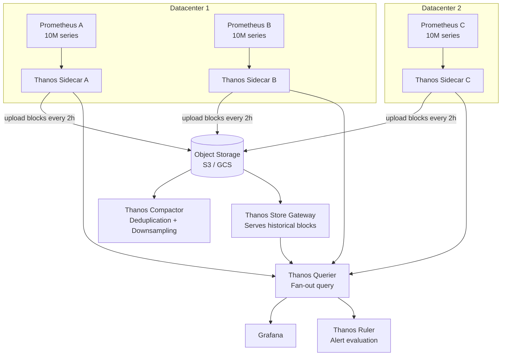

# Design a Metrics & Alerting System (Datadog/Prometheus)

**Difficulty**: 🔴 Advanced
**Reading Time**: Coming Soon
**Interview Frequency**: High

---

> 🚧 **Full article coming soon.** This stub gives you the essentials to start thinking about this problem.

---

## The Core Problem

Storing 1 million time-series metrics at 10-second resolution for 1 year — with sub-second query response for dashboards — requires specialized storage that general-purpose databases can't provide efficiently. High cardinality (100K unique label combinations per metric) and the need for range aggregation queries make this a hard storage problem.

## Functional Requirements

- Ingest metric data points (metric_name, labels, value, timestamp)
- Store 1M metrics at 10-second resolution
- Query: aggregations over time ranges, downsampling, rate calculation
- Alerting: evaluate alert rules every 30 seconds, notify when threshold exceeded
- Retention: 1-year hot storage with downsampling for historical data

## Non-Functional Requirements

| Requirement | Target |
|-------------|--------|
| Ingest throughput | 1M data points/sec |
| Query latency | p99 < 1 second for 24-hour range query |
| Alert evaluation | Every 30 seconds, < 5-second trigger delay |
| Storage efficiency | 2 bytes/sample with compression (vs 16 bytes raw) |

## Back-of-Envelope Estimates

- **Raw storage**: 1M metrics × 6 samples/min × 525,600 min/year × 16 bytes = ~50TB/year raw
- **With Gorilla compression**: 50TB × 12% compression ratio ≈ 6TB/year — manageable
- **Alert rules**: 100K alert rules × 1 evaluation/30sec = 3,333 evaluations/sec

## Key Design Decisions

1. **TSDBs Use Delta-of-Delta Encoding** — timestamps are nearly sequential (Δ=10s always); values often change slowly; Gorilla encoding stores Δ of Δ of timestamps and XOR of successive float values achieving ~1.37 bytes/sample vs 16 bytes raw.
2. **Downsampling for Long-Term Retention** — keep raw 10s data for 7 days; downsample to 5-minute aggregates for 90 days; 1-hour aggregates for 1 year; reduces storage 60x for old data while preserving long-term trends.
3. **Cardinality Explosion Prevention** — each unique label combination creates a new time series; adding `user_id` label to a metric creates 100M series instead of 1; enforce label cardinality limits (<10K unique values per label) at ingest time.

## High-Level Architecture



## Top Interview Questions for This Problem

| Question | Tests |
|----------|-------|
| What is high cardinality and why does it kill a metrics system? | Label explosion, memory implications |
| How does Gorilla compression achieve 12x compression on time-series data? | Delta encoding, XOR floats |
| How would you design alerts that avoid false positives during deployments? | Alert inhibition, deployment awareness |

## Related Concepts

- [Distributed tracing for request-level observability complement](./distributed-tracing)
- [Web analytics for similar time-series aggregation challenges](../01-data-processing/web-analytics)

---

## Component Deep Dive 1: Time-Series Storage Engine (TSDB)

The TSDB is the heart of any metrics platform — every other component's performance is bounded by how fast the storage layer can ingest and serve data. Naive approaches fail immediately.

**Why naïve databases fail:** A relational database like PostgreSQL with a table of `(metric_name, timestamp, value, labels)` immediately hits problems at scale. A 1M-series system at 10-second resolution generates 100k inserts/second. Each insert requires updating B-tree indexes. At this rate PostgreSQL saturates its WAL writer at ~50k rows/second and index fragmentation grows unbounded. A standard columnar store like Parquet on S3 solves compression but not sub-second query latency — you cannot scan 6TB of Parquet to answer "show me HTTP errors in the last 5 minutes."

**How production TSDBs work internally:** Prometheus uses a two-layer model. The **head block** holds the most recent 2 hours of data entirely in memory, structured as a hash map from label set → chunked time-series. Each series stores samples in a 128-byte Gorilla-compressed XOR chunk that fits in a CPU cache line. When a chunk fills, it's appended to a write-ahead log (WAL) on disk. Every 2 hours, the head block is persisted as an immutable **block** on disk — a directory containing chunks (raw compressed data), an index (posting list of label → series IDs), and tombstones (for deletes). Queries merge results across in-memory head and on-disk blocks.

**Gorilla Compression Mechanics:** Facebook's Gorilla paper showed that timestamps in a 10-second interval metric series have delta-of-delta = 0 most of the time (10, 10, 10…). The first timestamp takes 64 bits, the first delta takes 14 bits, subsequent deltas-of-deltas are 0 bits (98%+ of the time) or stored in small fixed-width buckets. For values, successive floats are XOR'd — if values don't change (flat metrics like a stable memory gauge), XOR = 0 and stored in 1 bit. Spiky metrics (request counters) XOR well too since sign bits and exponents rarely flip. Result: ~1.37 bytes/sample vs 16 bytes raw = **11.7x compression**.

**The out-of-order problem:** Real distributed systems have clock skew. A scrape arriving 30 seconds late for a timestamp already committed forces a retroactive insert into an immutable block. Prometheus originally rejected out-of-order samples entirely. VictoriaMetrics solves this with a **persistence-optimized merge tree** — incoming samples buffer in memory per series, sorted on flush. Thanos allows out-of-order ingestion through a separate "out-of-order head block" merged at query time.



| Storage Approach | Write Latency | Query Latency (24h range) | Compression | Scale Ceiling |
|------------------|--------------|--------------------------|-------------|---------------|
| Prometheus (local) | < 1ms | < 200ms | 1.37 bytes/sample | ~10M active series per node |
| Cortex / Thanos (distributed) | < 5ms | < 1s | 1.37 bytes/sample + object store | Unlimited (horizontal) |
| InfluxDB (columnar) | 2–5ms | < 500ms | ~2 bytes/sample | ~5M series per node |

---

## Component Deep Dive 2: Alert Evaluation Engine

The alerting pipeline is deceptively hard to build correctly. It must evaluate 100K+ rules every 30 seconds reliably — that is 3,333 evaluations/second — while avoiding alert storms, duplicate notifications, and missed transitions.

**Internal mechanics:** Prometheus's Alertmanager separates rule evaluation from notification routing. The **Ruler** component (in Cortex/Thanos) runs PromQL queries against the TSDB at configurable intervals (default 30s). Each rule is a PromQL expression like `rate(http_errors_total[5m]) > 0.01`. If the query returns results, the rule enters `PENDING` state. If it stays firing longer than the configured `for:` duration (e.g., 5 minutes), it transitions to `FIRING` and emits an alert to the Alertmanager.

The `for:` clause is critical: without it, a 1-second spike in error rate triggers a page. With `for: 5m`, the service must be broken for 5 continuous minutes before anyone is paged — this eliminates 90% of false positives from deployment restarts and transient errors.

**The thundering herd at 10x load:** At 10x rule volume (1M rules), naive evaluation with a single goroutine pool serializes all evaluations. A slow TSDB query (say 2 seconds for a high-cardinality rule) backs up the queue — rules meant to fire at T=0 don't evaluate until T=30 seconds. The mitigation is **rule sharding**: partition rules across multiple Ruler replicas by consistent hashing on rule group name. Each replica owns a subset and queries the TSDB independently.

**Flap prevention and inhibition:** When a service deploys, you get N "firing" alerts followed by N "resolved" alerts 10 minutes later. Alertmanager's **inhibition rules** suppress child alerts when a parent fires (e.g., suppress HTTP error alerts when the entire datacenter is down). **Silences** temporarily mute specific label matchers during maintenance windows. **Grouping** batches related alerts (all services in the same datacenter) into a single notification with a configurable group wait (default 30s).

```mermaid
graph LR
    TSDB[(TSDB)] --> Ruler[Ruler\nPromQL evaluation\nevery 30s]
    Ruler -->|PENDING| PendingState[Pending State\nfor: 5m timer]
    PendingState -->|still firing| AlertMgr[Alertmanager]
    PendingState -->|resolved before for:| Silent[No Alert Sent]
    AlertMgr --> Dedup[Deduplication\nhash(labels)]
    Dedup --> Inhibit[Inhibition Rules\nparent/child suppression]
    Inhibit --> Silence[Silence Check\nmaintenance windows]
    Silence --> Route[Route Tree\nlabel matchers]
    Route --> PD[PagerDuty\nSeverity: critical]
    Route --> Slack[Slack\nSeverity: warning]
    Route --> Email[Email\nSeverity: info]
```

| Alertmanager Feature | What It Prevents | Config Parameter |
|---------------------|-----------------|-----------------|
| `for:` clause | Transient spikes | `for: 5m` on rule |
| Group wait | Notification flood at incident start | `group_wait: 30s` |
| Repeat interval | Re-alerting on ongoing issues | `repeat_interval: 4h` |
| Inhibition rules | Child alert noise when parent fires | `inhibit_rules:` |
| Silences | Maintenance window noise | API or UI |

---

## Component Deep Dive 3: Metrics Ingestion Pipeline and Cardinality Control

**The cardinality problem in depth:** Cardinality is the count of unique time series. Each unique combination of metric name + label set = one series. A metric `http_requests_total` with labels `{service, endpoint, status_code}` has cardinality = (num services) × (num endpoints) × (num status codes). If `service` has 50 values, `endpoint` has 200 values, and `status_code` has 10 values, that is 100,000 series — manageable. Now add `user_id` with 1M unique users: 100,000,000,000 series. This is a cardinality explosion. Each active series in Prometheus head block consumes ~3–4 KB of RAM. 1 billion series = 3–4 TB RAM. The system dies.

**Ingestor design decisions:**
1. **Label cardinality enforcement at ingest:** Before writing to WAL, the ingestor looks up a cardinality index (Redis sorted set or an in-process bloom filter). If any label key exceeds 10K unique values, the sample is dropped and a counter `tsdb_symbol_table_size_bytes` is incremented for monitoring. Datadog enforces this at the agent level — the agent itself refuses to emit metrics with unbounded labels.
2. **Write path aggregation:** Rather than storing raw per-request metrics, aggregate at the edge. Instead of emitting `http_request{user_id=X, status=200}` per request, the SDK aggregates locally and emits a histogram `http_request_duration_seconds{le="0.1"}` — histograms bucket values into fixed ranges, bounding cardinality at (num services × num endpoints × num buckets) regardless of traffic volume.
3. **Batching and WAL:** The ingestor batches incoming samples for 100ms, sorts by series ID (improves cache locality during WAL write), then appends to the WAL in a single `fsync`. This converts 100K random small writes into ~10 sequential writes, reducing disk IOPS from 100K to 10 — a 10,000x improvement in write efficiency.

**Specific technical decision — push vs pull:** Prometheus uses pull (scrape). Datadog uses push. Pull has a key advantage: the collector controls the scrape interval and retains metadata about which services are alive (a service that stops exposing `/metrics` is immediately detectable). Push is better for short-lived jobs (lambda functions, batch jobs) that may terminate before being scraped. Production systems use both: Prometheus scraping for long-running services, Pushgateway for batch jobs.

---

## Data Model

The TSDB stores data in a format optimized for time-range scans, not point lookups. Here is the logical schema and on-disk layout:

```sql
-- Logical series identity table (in-memory inverted index)
CREATE TABLE series (
    series_id     BIGINT PRIMARY KEY,     -- hash(sorted_labels)
    metric_name   VARCHAR(256) NOT NULL,  -- e.g. "http_requests_total"
    labels        JSONB NOT NULL,         -- {"service":"api","endpoint":"/users","status_code":"200"}
    created_at    TIMESTAMP NOT NULL,
    last_seen_at  TIMESTAMP NOT NULL,
    chunk_refs    TEXT[]                  -- pointers to on-disk chunks
);

-- Inverted index for label-based lookups
CREATE INDEX idx_series_labels ON series USING GIN(labels);
CREATE INDEX idx_series_metric ON series(metric_name);

-- Samples table (conceptual — never actually stored as rows)
-- In practice: binary XOR-compressed chunks, 128 bytes each
-- Each chunk holds ~120 samples at 10s resolution = 20 minutes of data
CREATE TABLE samples_chunk (
    series_id    BIGINT NOT NULL REFERENCES series(series_id),
    min_time     BIGINT NOT NULL,    -- Unix epoch milliseconds
    max_time     BIGINT NOT NULL,    -- Unix epoch milliseconds
    data         BYTEA NOT NULL,     -- Gorilla XOR-encoded binary blob
    num_samples  SMALLINT NOT NULL   -- count of samples in this chunk
);

-- Downsampled aggregates (written by the compactor)
CREATE TABLE downsampled_5m (
    series_id    BIGINT NOT NULL,
    bucket_time  BIGINT NOT NULL,   -- truncated to 5-minute boundary
    min_val      DOUBLE PRECISION,
    max_val      DOUBLE PRECISION,
    sum_val      DOUBLE PRECISION,
    count_val    INTEGER,
    PRIMARY KEY (series_id, bucket_time)
);

-- Alert rule definitions
CREATE TABLE alert_rules (
    rule_id      UUID PRIMARY KEY DEFAULT gen_random_uuid(),
    rule_name    VARCHAR(256) NOT NULL,
    promql_expr  TEXT NOT NULL,           -- e.g. "rate(http_errors[5m]) > 0.01"
    for_duration INTERVAL NOT NULL,       -- e.g. '5 minutes'
    severity     VARCHAR(50) NOT NULL,    -- critical|warning|info
    labels       JSONB,                   -- extra labels to attach to alert
    annotations  JSONB,                   -- runbook_url, description
    created_by   VARCHAR(256),
    created_at   TIMESTAMP DEFAULT NOW()
);

-- Alert state tracking
CREATE TABLE alert_state (
    rule_id          UUID REFERENCES alert_rules(rule_id),
    label_fingerprint BIGINT NOT NULL,    -- hash of alert labels
    state            VARCHAR(20) NOT NULL, -- pending|firing|resolved
    fired_at         TIMESTAMP,
    resolved_at      TIMESTAMP,
    last_evaluated   TIMESTAMP NOT NULL,
    PRIMARY KEY (rule_id, label_fingerprint)
);
```

**Key index strategy:** The inverted index on labels enables `SELECT series_id FROM series WHERE labels @> '{"service":"api"}'` to complete in < 1ms even with 10M series. Series lookups by label set use a pre-computed hash stored as `series_id` (Prometheus uses FNV-1a hash of sorted `{key="value"}` pairs).

---

## Scale Bottlenecks

| Traffic Level | Component That Breaks | Symptoms | Mitigation |
|---------------|----------------------|----------|------------|
| 10x baseline (10M active series) | Prometheus head block RAM | OOM kills, scrape timeouts, GC pressure | Shard scrape targets across multiple Prometheus replicas (Cortex/Thanos) |
| 10x baseline (10M series) | WAL write throughput | Disk IOPS saturation, > 100ms scrape duration | NVMe SSD, increase WAL batch size, parallel WAL writers |
| 100x baseline (100M active series) | Alertmanager notification fan-out | Duplicate pages, missed alerts during failover | Alertmanager HA cluster (3-node gossip), dedup via consistent hashing |
| 100x baseline (100M series) | Query engine memory | Dashboard timeouts, OOM on aggregation queries | Query pushdown to storage, result caching, enforced query timeouts (30s) |
| 100x baseline — ingest | Ingestor write path | Samples dropped, cardinality index misses | Kafka-backed ingest buffer, increase ingestor replicas behind load balancer |
| 1000x baseline (1B series) | Object storage costs | S3 API costs > $100K/month, GET latency | Tiered retention (7d hot / 90d warm / 1y cold), aggressive downsampling |
| 1000x baseline — alerting | Rule evaluation latency | 30s evaluation window breached, delayed alerts | Distributed Ruler with 1000+ shards, pre-computed recording rules |
| Any level — cardinality explosion | TSDB inverted index | `series_not_found` errors, query planner timeouts | Per-label cardinality limits, metric relabeling, pre-aggregation at agent |

**Specific numbers at Uber's M3 scale (500M samples/sec):**
- 30+ ingestor nodes, each handling ~17M samples/sec
- 200+ storage nodes with NVMe SSDs
- Separate read path (M3Query) with 100+ query nodes
- Per-datacenter replication factor of 3 for durability

---

## How Uber Built M3

Uber's metrics platform, M3, is one of the best-documented large-scale TSDB deployments. By 2018, Uber's microservices architecture had grown to 3,000+ services with 50,000+ metrics per service, producing **500 million metric samples per second** across 4 datacenters. Off-the-shelf solutions like InfluxDB and Prometheus (single-node) couldn't handle this volume.

**Technology choices:** Uber built M3 as an open-source Go project with three components: **M3DB** (distributed TSDB), **M3Query** (distributed query engine), and **M3Coordinator** (ingest proxy with Prometheus remote-write compatibility). M3DB uses a custom **commit log** (similar to Prometheus WAL but distributed-aware) and stores data in a ring-based consistent hash cluster — every node owns a range of the series ID space. Replication factor 3 means any 2-of-3 replicas must acknowledge a write before it's confirmed.

**Non-obvious architectural decision — separate namespaces with different retention:** M3DB uses the concept of "namespaces" — each namespace has its own retention period, resolution, and replication factor. Uber runs three namespaces per datacenter: `unagg` (raw 10s samples, 2-day retention), `agg-1m` (1-minute aggregates, 30-day retention), and `agg-5m` (5-minute aggregates, 1-year retention). The M3Coordinator fans out writes to all three namespaces simultaneously. This eliminates a separate downsampling job — aggregation happens at write time. The result is that 1-year historical queries hit only the `agg-5m` namespace (50x smaller than raw), completing in < 500ms.

**Specific numbers:**
- 500M samples/second ingest across all datacenters
- 200+ storage nodes per datacenter
- ~ 1 billion active time series at peak
- p99 write latency < 15ms end-to-end
- Query p99 < 1.5s for 30-day range queries
- 70% storage cost reduction vs InfluxDB with equivalent durability

**Source**: [Uber Engineering — M3: Uber's Open Source, Large-scale Metrics Platform for Prometheus](https://eng.uber.com/m3/)

---

## Interview Angle

**What the interviewer is testing:** Whether you understand the fundamental mismatch between general-purpose databases and time-series workloads, and whether you can reason about cardinality as the primary scalability lever — not throughput.

**Common mistakes candidates make:**

1. **Proposing MySQL/PostgreSQL with a timestamp index.** This fails because B-tree indexes on `(series_id, timestamp)` fragment badly at high insert rates. Candidates who make this mistake don't know about append-only write patterns, WAL-based TSDBs, or Gorilla compression. The correct answer names a TSDB (Prometheus, InfluxDB, VictoriaMetrics) and explains *why* it's different.

2. **Ignoring cardinality entirely.** Many candidates focus on write throughput (easy to reason about) but never mention cardinality. An interviewer who asks "what happens if I add a `user_id` label?" expects you to immediately say "cardinality explosion — 10M users × existing labels creates a billion new series, exhausts RAM in the TSDB head block, and makes queries impossible." Not saying this signals you haven't operated a metrics system.

3. **Designing alerting as a cron job polling the DB.** A candidate who says "run a SQL query every 30 seconds against the metrics table" hasn't thought about fan-out (100K alert rules = 100K concurrent queries), evaluation consistency (evaluating rule A at T=0 and rule B at T=5s within the same 30s window means they see different data), or the `for:` clause (stateful tracking of how long a condition has been true). The correct answer uses a dedicated Ruler with PromQL evaluation, stateful pending/firing transitions, and Alertmanager for deduplication and routing.

**The insight that separates good from great answers:** The best candidates recognize that the **read path and write path have fundamentally different access patterns** and should be separated. Writes are always append-only, sequential, ordered by timestamp. Reads aggregate across many series over time ranges. Separating these allows the write path to be optimized for sequential disk I/O (WAL + chunk append) while the read path pre-builds inverted indexes and downsampled aggregates. Candidates who propose this separation — and explain why it enables 10x better throughput on both paths — demonstrate staff-level systems thinking.

---

## PromQL Deep Dive: Query Language Design

PromQL (Prometheus Query Language) is a functional query language purpose-built for time-series aggregation. Understanding its semantics is essential for both building and debugging metrics systems.

### Instant vs Range Vectors

PromQL has two fundamental data types:

- **Instant vector**: A single sample per series at one point in time. Example: `http_requests_total` returns the latest value for every matching series.
- **Range vector**: Multiple samples per series over a time window. Example: `http_requests_total[5m]` returns all samples in the last 5 minutes for each series.

Most useful queries convert range vectors into instant vectors using aggregation functions:

```promql
# Rate of HTTP requests per second over last 5 minutes
rate(http_requests_total[5m])

# P99 latency across all services
histogram_quantile(0.99, sum by (le) (rate(http_request_duration_seconds_bucket[5m])))

# Error rate as fraction of total requests
sum(rate(http_requests_total{status=~"5.."}[5m]))
  /
sum(rate(http_requests_total[5m]))

# CPU usage aggregated by datacenter
avg by (datacenter) (
  1 - rate(node_cpu_seconds_total{mode="idle"}[5m])
)

# Alert rule: error rate > 1% for 5 minutes
ALERT HighErrorRate
  IF rate(http_errors_total[5m]) / rate(http_requests_total[5m]) > 0.01
  FOR 5m
  LABELS { severity="critical" }
  ANNOTATIONS {
    summary = "High error rate on {{ $labels.service }}",
    runbook = "https://wiki.example.com/runbooks/high-error-rate"
  }
```

### Recording Rules: Pre-computation for Dashboard Performance

A common performance anti-pattern is running expensive PromQL expressions on every dashboard load. Grafana dashboards with 20 panels, each running a `histogram_quantile` over 7 days, can issue queries that scan billions of samples.

**Recording rules** pre-compute expensive expressions on a schedule and store results as new time series:

```yaml
# prometheus/rules/recording_rules.yml
groups:
  - name: http_aggregations
    interval: 1m          # pre-compute every minute
    rules:
      # Store per-service error rate as a new series
      - record: job:http_error_rate:rate5m
        expr: |
          sum by (job) (rate(http_errors_total[5m]))
          /
          sum by (job) (rate(http_requests_total[5m]))

      # Store P99 latency pre-computed
      - record: job:http_request_duration_p99:rate5m
        expr: |
          histogram_quantile(0.99,
            sum by (job, le) (
              rate(http_request_duration_seconds_bucket[5m])
            )
          )

      # Store total active series count (cardinality monitoring)
      - record: prometheus:tsdb_head_series:count
        expr: prometheus_tsdb_head_series
```

Dashboard queries then hit `job:http_error_rate:rate5m` instead of recomputing the expensive expression — query latency drops from 2–5 seconds to < 50ms.

### Staleness and Lookback

When a target stops scraping (crash, deployment), Prometheus marks the last sample as a **stale marker**. Queries looking back 5 minutes after a crash will see "no data" rather than stale values. This is intentional — it prevents alert rules from evaluating against stale data and missing real failures.

Default lookback delta is 5 minutes. If a scrape interval is 60 seconds and a scrape is missed, the previous value is used for up to 5 minutes before being marked stale. This is configurable via `--query.lookback-delta`.

---

## Distributed Architecture: Cortex / Thanos Pattern

Single-node Prometheus tops out at ~10M active series. For larger deployments, two dominant open-source solutions exist: **Thanos** and **Cortex** (now **Grafana Mimir**). Both extend Prometheus to be horizontally scalable with long-term storage.

### Thanos Architecture

Thanos uses a sidecar pattern — a Thanos Sidecar process runs alongside each Prometheus instance, uploading completed 2-hour blocks to object storage (S3, GCS) every 2 hours.



**Key design properties of Thanos:**
- **No central write path**: each Prometheus writes locally, sidecars upload asynchronously
- **Query fan-out**: Thanos Querier sends the same PromQL to all sidecars and store gateways, merges results
- **Deduplication**: when two Prometheus replicas scrape the same targets (HA pair), Thanos Compactor deduplicates on upload using `replica` label
- **Downsampling in compactor**: Thanos Compactor automatically creates 5-minute and 1-hour downsampled blocks from raw data in object storage, enabling fast historical queries

### Cortex / Grafana Mimir Architecture

Cortex (now Grafana Mimir) takes a microservices approach with a **shared write path** — all Prometheus instances remote-write to a central Distributor.

```
Write path:
Prometheus → Distributor → Ingester (×3 replicas, in-memory) → Object Storage (async)

Read path:
Grafana → Querier → Ingester (recent data) + Store Gateway (historical)
```

**Mimir-specific innovations:**
- **Shuffle sharding**: each tenant's data is assigned to a random subset of ingesters, limiting blast radius of ingester failures to 2–3 tenants instead of all
- **OTLP-native ingest**: accepts OpenTelemetry protocol directly, no Prometheus remote-write needed
- **Per-tenant cardinality limits**: enforced at the Distributor, prevents one noisy tenant from exhausting cluster-wide series budget

| Feature | Thanos | Grafana Mimir |
|---------|--------|---------------|
| Write path | Decentralized (sidecar) | Centralized (Distributor) |
| Operational complexity | Lower (existing Prometheus) | Higher (new microservices) |
| Query latency (historical) | Higher (object store fan-out) | Lower (shared ingesters cache) |
| Multi-tenancy | Limited | First-class |
| Deduplication | Compactor (async) | Ingester (synchronous) |
| Best for | Existing Prometheus fleets | Greenfield, SaaS metrics |

---

## Notification Pipeline: Routing, Dedup, and On-Call

The final mile — getting alerts to the right person at the right time — is as complex as the storage layer. A poorly designed notification pipeline causes alert fatigue, missed pages, and 3am wake-ups for the wrong engineer.

### Alertmanager Configuration Structure

```yaml
# alertmanager.yml
global:
  resolve_timeout: 5m
  pagerduty_url: https://events.pagerduty.com/v2/enqueue

route:
  # Default: group all alerts, wait 30s before first notification
  receiver: default-receiver
  group_by: [alertname, datacenter, service]
  group_wait: 30s
  group_interval: 5m
  repeat_interval: 4h

  routes:
    # Critical alerts → PagerDuty immediately
    - match:
        severity: critical
      receiver: pagerduty-critical
      group_wait: 10s         # faster for critical
      repeat_interval: 1h

    # Database alerts → DBA on-call team
    - match:
        team: database
      receiver: dba-oncall
      continue: false         # stop routing after first match

    # Deployment-related alerts → suppress during deploy window
    - match:
        alertname: HighErrorRate
      receiver: slack-deploys
      active_time_intervals:
        - business-hours

inhibit_rules:
  # Suppress service alerts when entire datacenter is down
  - source_match:
      alertname: DatacenterDown
    target_match_re:
      alertname: .+
    equal: [datacenter]

  # Suppress individual endpoint alerts when service is down
  - source_match:
      alertname: ServiceDown
    target_match:
      alertname: EndpointHighLatency
    equal: [service]

receivers:
  - name: pagerduty-critical
    pagerduty_configs:
      - routing_key: ${PAGERDUTY_KEY}
        severity: critical
        description: '{{ .CommonAnnotations.summary }}'
        details:
          runbook: '{{ .CommonAnnotations.runbook }}'
          firing_count: '{{ len .Alerts.Firing }}'

  - name: slack-deploys
    slack_configs:
      - api_url: ${SLACK_WEBHOOK}
        channel: '#alerts-deploys'
        text: '{{ range .Alerts }}{{ .Annotations.summary }}{{ end }}'
```

### On-Call Rotation Integration

Production-grade alerting integrates with on-call schedule APIs:

- **PagerDuty**: alert routes to a "service" which maps to a schedule; escalation policies auto-escalate after 15 minutes if not acknowledged
- **OpsGenie**: team-based routing, schedule-aware; supports "override" for vacations
- **Incident.io**: newer tool combining alerting, incident declaration, and postmortem in one workflow

**The key metric**: Mean Time To Acknowledge (MTTA) should be < 5 minutes for P0 incidents. Alert design directly impacts this — an alert with a clear title, runbook link, and exact metric values gets acknowledged faster than a generic "something is wrong" alert.

### Alert Quality Rules

| Rule | Anti-Pattern | Best Practice |
|------|-------------|---------------|
| Actionability | Alert fires but no runbook exists | Every alert links to `runbook_url` annotation |
| Specificity | "High CPU" on any of 500 servers | Alert on user-visible symptom (latency, errors), not resource usage |
| Sensitivity | Alert on 1 data point exceeding threshold | Use `for: 5m` and `rate()` over 5-minute window |
| Noise ratio | > 50% of alerts are auto-resolved without action | Audit monthly; suppress or fix noisy alerts |
| Deduplication | Same alert fires from 3 Prometheus replicas | Group by `alertname, service`; use Alertmanager HA |

---

## Key Numbers to Remember

| Metric | Value | Context |
|--------|-------|---------|
| Gorilla compression ratio | 1.37 bytes/sample | vs 16 bytes raw; 11.7x compression |
| Prometheus head block RAM | ~3–4 KB per active series | 1M series ≈ 3–4 GB RAM minimum |
| TSDB block size (Prometheus) | 2 hours of data per block | head block flushed to disk every 2h |
| Alert evaluation interval | 30 seconds | default `evaluation_interval` in Prometheus |
| Max label cardinality (safe) | 10,000 unique values per label | beyond this, query planning degrades |
| Raw storage before compression | ~50 TB/year | 1M metrics × 10s resolution × 1 year |
| With Gorilla compression | ~6 TB/year | same dataset; 12% of raw size |
| Uber M3 peak ingest | 500M samples/sec | 4 datacenters, 200+ storage nodes each |
| Downsampling factor | 60x reduction for 1y data | raw 10s → 1h aggregates |
| Prometheus single-node limit | ~10M active series | bounded by RAM for head block |

---

## Retention and Downsampling Strategy

| Tier | Resolution | Retention | Storage Cost | Use Case |
|------|-----------|-----------|-------------|----------|
| Hot (raw) | 10 seconds | 7 days | ~1 GB/day per 1M series | Real-time dashboards, recent incident debugging |
| Warm (5m agg) | 5 minutes | 90 days | ~20 MB/day per 1M series | Weekly trends, SLO burn rate |
| Cold (1h agg) | 1 hour | 1 year | ~1 MB/day per 1M series | Quarterly capacity planning, year-over-year |
| Archive (1d agg) | 1 day | 5 years | ~40 KB/day per 1M series | Annual reviews, long-term anomaly detection |

Downsampling must preserve `min`, `max`, `sum`, and `count` — not just `avg`. Storing only averages loses spike information: a 10-second CPU spike to 100% averaged into a 5-minute bucket appears as 3% and becomes invisible in dashboards. Always store `max` in downsampled aggregates alongside `avg`.

---

## 📚 Resources & References

| Resource | Type | What You'll Learn |
|----------|------|------------------|
| [ByteByteGo — Design a Metrics Monitoring System](https://www.youtube.com/@ByteByteGo) | 📺 YouTube | Search "metrics monitoring design" — time-series storage, alerting, dashboards |
| [Prometheus Architecture](https://prometheus.io/docs/introduction/overview/) | 📚 Docs | Pull-based metrics collection with PromQL and Alertmanager |
| [Uber Engineering: M3 Metrics Platform](https://eng.uber.com/m3/) | 📖 Blog | How Uber built their own metrics platform handling 500M samples/sec |
| [Netflix Engineering: Atlas Metrics](https://netflixtechblog.com/introducing-atlas-netflixs-primary-telemetry-platform-bd31f4d8ed9a) | 📖 Blog | Netflix's time-series monitoring platform for operational visibility |
| [Grafana Architecture and Scaling](https://grafana.com/docs/grafana/latest/introduction/) | 📚 Docs | Metrics visualization and alerting at scale |
| [VictoriaMetrics — How It Works](https://docs.victoriametrics.com/#how-victoriametrics-works) | 📚 Docs | High-performance alternative to Prometheus with better out-of-order support |
| [Gorilla: A Fast, Scalable, In-Memory TSDB (Facebook)](https://www.vldb.org/pvldb/vol8/p1816-teller.pdf) | 📖 Paper | The original XOR compression paper that underpins all modern TSDBs |
| [Grafana Mimir Architecture](https://grafana.com/docs/mimir/latest/get-started/about-grafana-mimir-architecture/) | 📚 Docs | Horizontally scalable, multi-tenant Prometheus successor |
| [Thanos — Overview and Architecture](https://thanos.io/tip/thanos/quick-tutorial.md/) | 📚 Docs | Long-term, highly available Prometheus with object storage backend |
| [Alertmanager Configuration Docs](https://prometheus.io/docs/alerting/latest/configuration/) | 📚 Docs | Complete reference for routing trees, inhibition, silences, and receivers |
