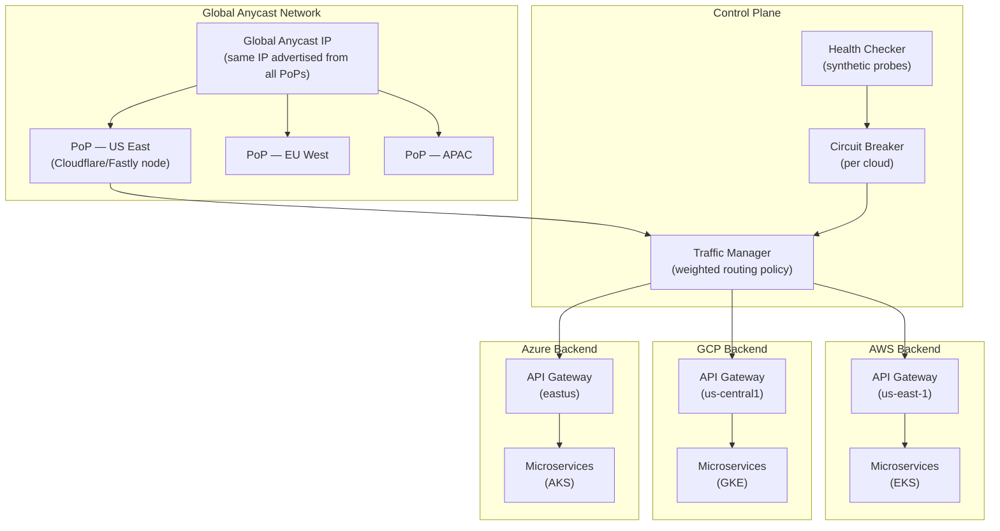
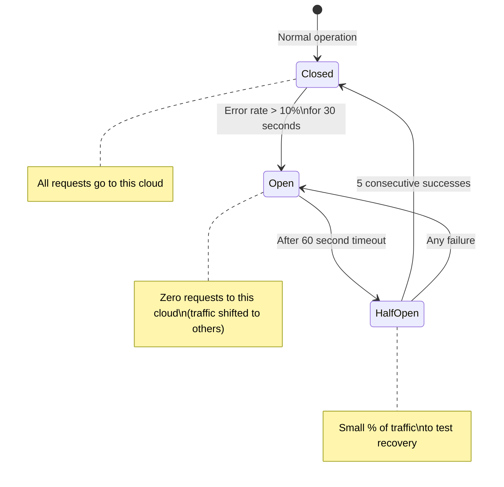

# Design a Multi-Cloud API Gateway — Single Endpoint Across AWS, GCP, Azure

**Difficulty**: 🔴 Advanced
**Reading Time**: 26 minutes
**Interview Frequency**: Medium-High — asked at platform engineering, SRE, and cloud-native companies

---

## Problem Statement

You are asked to design a multi-cloud API gateway that:

- **Works at**: Single cloud provider — one API Gateway (AWS API GW, Kong, Nginx) handles all routing.
- **Breaks at**: Deploying across AWS, GCP, and Azure for redundancy and latency optimization — each cloud has separate endpoints; clients must know which cloud to call; cloud-specific failures need manual rerouting; canary deployments across clouds have no unified control plane.

Target: **Single global anycast IP**, route to AWS/GCP/Azure based on proximity and health, **< 50 ms** latency from any location, **99.99% availability**, automated failover between clouds in **< 30 seconds**.

---

## Requirements

### Functional Requirements

| Requirement | Description |
|-------------|-------------|
| Single Endpoint | One IP/hostname for all clients globally |
| Geo-based Routing | Route to nearest cloud based on client location |
| Health-based Routing | Automatically avoid unhealthy cloud backends |
| Weighted Routing | Split traffic (e.g., 90% AWS, 10% GCP) for canary |
| Authentication | Unified auth (JWT/OAuth2) regardless of backend cloud |
| Request Transformation | Normalize differences between cloud-specific APIs |

### Non-Functional Requirements

| Requirement | Target |
|-------------|--------|
| Global Latency | < 50 ms from any PoP to nearest backend |
| Availability | 99.99% (< 52 min/year downtime) |
| Failover Time | < 30 seconds on cloud provider outage |
| Throughput | 1M RPS globally |
| DNS TTL | 30 seconds (for fast failover) |

---

## Capacity Estimates

- **1M RPS global** → ~333K RPS per cloud at 3 equal clouds
- **50 ms latency budget**: 10 ms network to PoP + 5 ms gateway processing + 35 ms backend = 50 ms
- **Health check frequency**: 10 checks/second per cloud endpoint → 30 checks/second total, minimal overhead
- **Anycast PoP overhead**: BGP convergence on failover ~30–60 seconds (matches RTO requirement)
- **Bandwidth**: 1M RPS × 2 KB avg response = **2 GB/s** egress from gateways

---

## High-Level Architecture



---

## Level 1 — Surface: Routing Strategies

| Strategy | Mechanism | Latency | Failover Speed | Use Case |
|----------|-----------|---------|----------------|----------|
| **GeoDNS** | DNS returns different IPs by client geo | High (DNS TTL bound) | 30–120 s (TTL) | Simple geo-routing |
| **Anycast** | Same IP routed via BGP to nearest PoP | Lowest | 30–60 s (BGP) | CDN-style low latency |
| **Client-side load balancing** | SDK picks endpoint from discovery service | Low | Immediate | gRPC, service mesh |
| **Global load balancer** | Managed service (AWS Global Accelerator) | Low | < 30 s | Simplified ops |

**Anycast** is the gold standard: the same IP address is announced from multiple locations via BGP. The internet's routing protocol automatically directs clients to the nearest PoP. No DNS propagation delay — BGP converges in 30–60 seconds.

---

## Level 2 — Deep Dive: Circuit Breaker Per Cloud

A circuit breaker prevents cascading failures when one cloud is degraded but not fully down (e.g., elevated error rate).



**Traffic rebalancing on open circuit**:
- Normally: AWS 60%, GCP 30%, Azure 10%
- AWS circuit opens → GCP gets 75%, Azure gets 25% (proportional to original weights)
- AWS circuit closes (recovery) → gradually restore to 60% (5% per minute to avoid thundering herd)

### Canary Deployment Across Clouds

Rolling out v2 across 3 clouds safely:

```
Week 1: AWS 1%, GCP 0%, Azure 0%  (canary on one cloud)
Week 2: AWS 10%, GCP 0%, Azure 0%  (expand canary)
Week 3: AWS 50%, GCP 10%, Azure 0%  (promote to GCP)
Week 4: AWS 100%, GCP 100%, Azure 10%  (final cloud)
Week 5: All 100%
```

Each step monitors error rate, latency p99, and business metrics (conversion rate). Automated rollback if any metric regresses > 10% from baseline.

---

## Key Design Decisions

### 1. Anycast vs. GeoDNS

| Criteria | Anycast | GeoDNS |
|----------|---------|--------|
| Failover speed | 30–60 s (BGP) | 30–120 s (TTL dependent) |
| Latency | Optimal (network-layer routing) | Good (DNS-layer routing) |
| Complexity | High (requires BGP PoP infrastructure) | Low (managed service) |
| Cost | High (own PoP network or use CDN) | Low |

**Recommendation**: Use **Anycast via CDN** (Cloudflare, Fastly, Akamai) — they provide anycast IP with global PoP network as a managed service. Cost-effective at $0.01–0.05/GB.

### 2. Unified Authentication Across Clouds

Challenge: AWS uses IAM/Cognito, GCP uses Cloud Identity, Azure uses Azure AD. Clients can't use cloud-specific auth tokens.

Solution: **OIDC with cloud-neutral token issuer** (Auth0, Okta, or self-hosted Keycloak):
1. Client authenticates to neutral OIDC provider
2. Receives JWT with `sub` and `roles` claims
3. Sends JWT to multi-cloud API gateway
4. Gateway validates JWT (same public key regardless of backend cloud)
5. Gateway passes validated identity to backend via trusted headers

### 3. Request Normalization

Each cloud has slightly different behavior (rate limits, error codes, headers). The gateway normalizes these for clients:

| Difference | AWS | GCP | Gateway Normalizes To |
|------------|-----|-----|-----------------------|
| Rate limit header | `x-ratelimit-remaining` | `x-goog-quota-remaining` | `RateLimit-Remaining` (RFC 6585) |
| Error format | AWS error XML/JSON | GCP error JSON | Standard problem+json |
| Auth header | `x-amz-security-token` | `Authorization: Bearer` | `Authorization: Bearer` |

---

## Interview Questions

| Question | What They're Testing | Key Answer Points |
|----------|---------------------|-------------------|
| How do you ensure the same request doesn't get routed to two clouds simultaneously? | Consistency | Anycast routes to single PoP which routes to single backend; circuit breaker state is consistent within PoP; cross-PoP state eventual-consistent via gossip |
| How do you handle a cloud provider charging $0.08/GB egress? | Cost awareness | Route API responses back through same PoP used for ingress; use CDN with contracted egress rates; prefer clouds with free egress tier for responses |
| What if Cloudflare (your anycast provider) goes down? | Vendor risk | Multi-CDN failover via GeoDNS with 2 CDNs as backup; Cloudflare has better uptime than any single cloud (Anycast more resilient than unicast) |

---

## 📚 Resources & References

| Resource | Type | What You'll Learn |
|----------|------|------------------|
| [Cloudflare Anycast Explained](https://www.cloudflare.com/learning/cdn/glossary/anycast-network/) | 📖 Blog | How anycast routing works, BGP-based failover |
| [AWS Global Accelerator](https://aws.amazon.com/global-accelerator/) | 📚 Docs | Managed anycast for AWS workloads |
| [Netflix Tech Blog](https://netflixtechblog.com) | 📖 Blog | Traffic routing, canary analysis, Zuul gateway architecture |
| [Hussein Nasser YouTube](https://www.youtube.com/@hnasr) | 📺 YouTube | API gateway patterns, reverse proxy, circuit breakers |

---

## Related Concepts

- [Load Balancer](./load-balancer) — global load balancing fundamentals
- [Rate Limiter](./rate-limiter) — per-cloud rate limiting in the gateway
- [Hybrid Cloud Orchestrator](./hybrid-cloud-orchestrator) — workload placement that feeds into routing decisions
