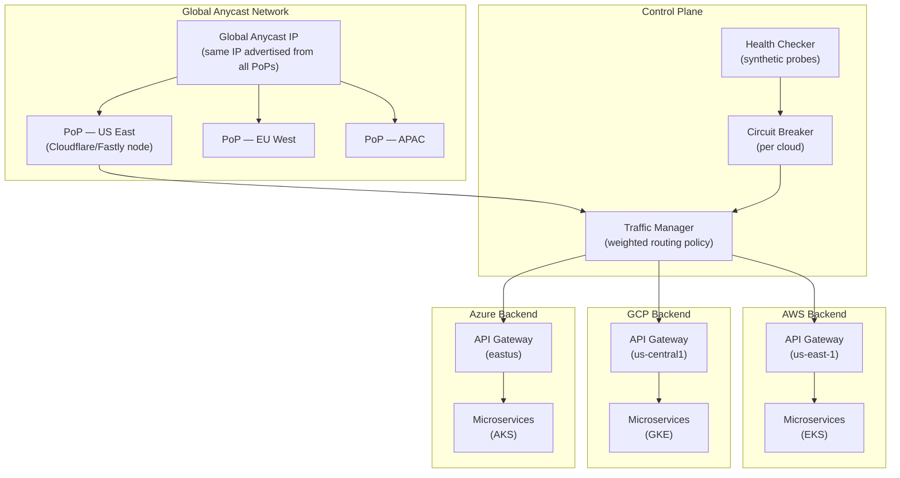
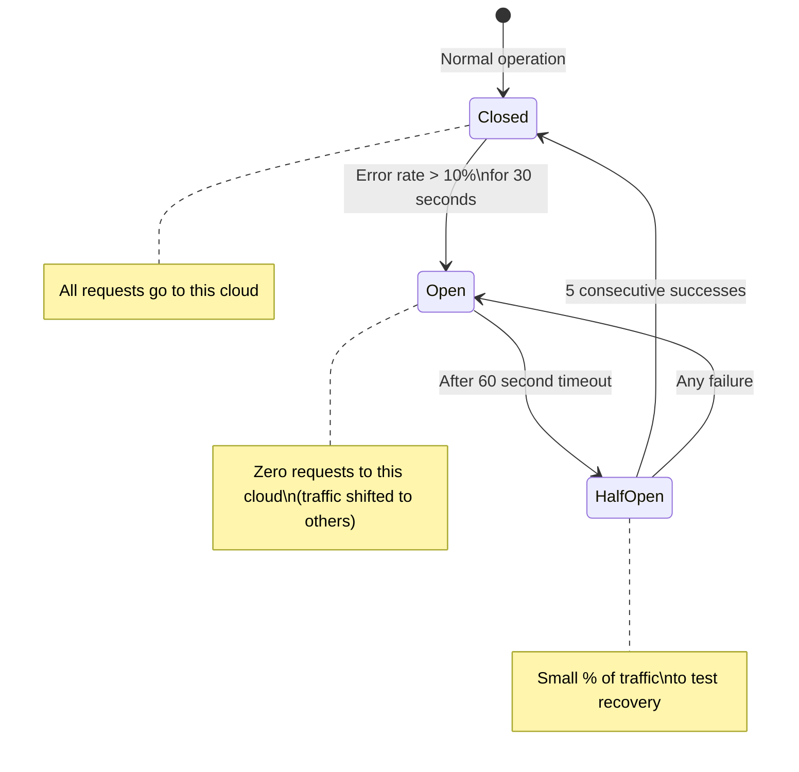
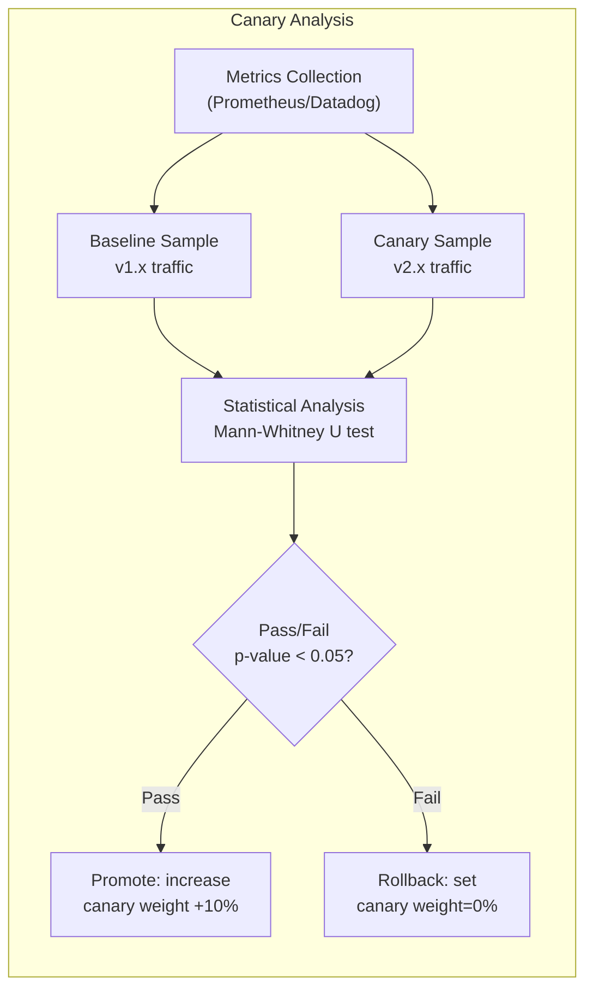
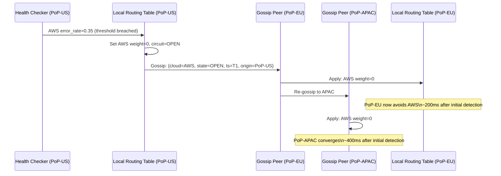
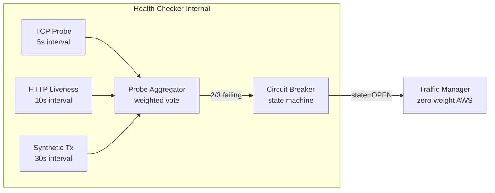

# Design a Multi-Cloud API Gateway — Single Endpoint Across AWS, GCP, Azure

**Difficulty**: 🔴 Advanced
**Reading Time**: 26 minutes
**Interview Frequency**: Medium-High — asked at platform engineering, SRE, and cloud-native companies

---

## Problem Statement

You are asked to design a multi-cloud API gateway that:

- **Works at**: Single cloud provider — one API Gateway (AWS API GW, Kong, Nginx) handles all routing.
- **Breaks at**: Deploying across AWS, GCP, and Azure for redundancy and latency optimization — each cloud has separate endpoints; clients must know which cloud to call; cloud-specific failures need manual rerouting; canary deployments across clouds have no unified control plane.

Target: **Single global anycast IP**, route to AWS/GCP/Azure based on proximity and health, **< 50 ms** latency from any location, **99.99% availability**, automated failover between clouds in **< 30 seconds**.

---

## Requirements

### Functional Requirements

| Requirement | Description |
|-------------|-------------|
| Single Endpoint | One IP/hostname for all clients globally |
| Geo-based Routing | Route to nearest cloud based on client location |
| Health-based Routing | Automatically avoid unhealthy cloud backends |
| Weighted Routing | Split traffic (e.g., 90% AWS, 10% GCP) for canary |
| Authentication | Unified auth (JWT/OAuth2) regardless of backend cloud |
| Request Transformation | Normalize differences between cloud-specific APIs |

### Non-Functional Requirements

| Requirement | Target |
|-------------|--------|
| Global Latency | < 50 ms from any PoP to nearest backend |
| Availability | 99.99% (< 52 min/year downtime) |
| Failover Time | < 30 seconds on cloud provider outage |
| Throughput | 1M RPS globally |
| DNS TTL | 30 seconds (for fast failover) |

---

## Capacity Estimates

- **1M RPS global** → ~333K RPS per cloud at 3 equal clouds
- **50 ms latency budget**: 10 ms network to PoP + 5 ms gateway processing + 35 ms backend = 50 ms
- **Health check frequency**: 10 checks/second per cloud endpoint → 30 checks/second total, minimal overhead
- **Anycast PoP overhead**: BGP convergence on failover ~30–60 seconds (matches RTO requirement)
- **Bandwidth**: 1M RPS × 2 KB avg response = **2 GB/s** egress from gateways

---

## High-Level Architecture



---

## Level 1 — Surface: Routing Strategies

| Strategy | Mechanism | Latency | Failover Speed | Use Case |
|----------|-----------|---------|----------------|----------|
| **GeoDNS** | DNS returns different IPs by client geo | High (DNS TTL bound) | 30–120 s (TTL) | Simple geo-routing |
| **Anycast** | Same IP routed via BGP to nearest PoP | Lowest | 30–60 s (BGP) | CDN-style low latency |
| **Client-side load balancing** | SDK picks endpoint from discovery service | Low | Immediate | gRPC, service mesh |
| **Global load balancer** | Managed service (AWS Global Accelerator) | Low | < 30 s | Simplified ops |

**Anycast** is the gold standard: the same IP address is announced from multiple locations via BGP. The internet's routing protocol automatically directs clients to the nearest PoP. No DNS propagation delay — BGP converges in 30–60 seconds.

---

## Level 2 — Deep Dive: Circuit Breaker Per Cloud

A circuit breaker prevents cascading failures when one cloud is degraded but not fully down (e.g., elevated error rate).



**Traffic rebalancing on open circuit**:
- Normally: AWS 60%, GCP 30%, Azure 10%
- AWS circuit opens → GCP gets 75%, Azure gets 25% (proportional to original weights)
- AWS circuit closes (recovery) → gradually restore to 60% (5% per minute to avoid thundering herd)

### Canary Deployment Across Clouds

Rolling out v2 across 3 clouds safely:

```
Week 1: AWS 1%, GCP 0%, Azure 0%  (canary on one cloud)
Week 2: AWS 10%, GCP 0%, Azure 0%  (expand canary)
Week 3: AWS 50%, GCP 10%, Azure 0%  (promote to GCP)
Week 4: AWS 100%, GCP 100%, Azure 10%  (final cloud)
Week 5: All 100%
```

Each step monitors error rate, latency p99, and business metrics (conversion rate). Automated rollback if any metric regresses > 10% from baseline.

### Canary Analysis Pipeline

Automated canary analysis (inspired by Netflix's Kayenta) compares canary vs. baseline metrics across three dimensions:

1. **Error rate delta**: If canary error rate exceeds baseline by more than 0.5 percentage points, flag as regression.
2. **Latency percentiles**: Compare P50, P95, P99. A canary that improves P50 but degrades P99 by >20% is still a regression — tail latency matters for SLAs.
3. **Business metrics**: Conversion rate, revenue per request (for e-commerce), API success rate. Infrastructure metrics alone miss user-visible regressions.

The canary controller uses the **Mann-Whitney U test** (non-parametric statistical test) to determine if the canary distribution is statistically different from baseline — a simple threshold comparison misses situations where canary metrics fluctuate within normal range but with higher variance.



---

## Key Design Decisions

### 1. Anycast vs. GeoDNS

| Criteria | Anycast | GeoDNS |
|----------|---------|--------|
| Failover speed | 30–60 s (BGP) | 30–120 s (TTL dependent) |
| Latency | Optimal (network-layer routing) | Good (DNS-layer routing) |
| Complexity | High (requires BGP PoP infrastructure) | Low (managed service) |
| Cost | High (own PoP network or use CDN) | Low |

**Recommendation**: Use **Anycast via CDN** (Cloudflare, Fastly, Akamai) — they provide anycast IP with global PoP network as a managed service. Cost-effective at $0.01–0.05/GB.

### 2. Unified Authentication Across Clouds

Challenge: AWS uses IAM/Cognito, GCP uses Cloud Identity, Azure uses Azure AD. Clients can't use cloud-specific auth tokens.

Solution: **OIDC with cloud-neutral token issuer** (Auth0, Okta, or self-hosted Keycloak):
1. Client authenticates to neutral OIDC provider
2. Receives JWT with `sub` and `roles` claims
3. Sends JWT to multi-cloud API gateway
4. Gateway validates JWT (same public key regardless of backend cloud)
5. Gateway passes validated identity to backend via trusted headers

### 3. Request Normalization

Each cloud has slightly different behavior (rate limits, error codes, headers). The gateway normalizes these for clients:

| Difference | AWS | GCP | Gateway Normalizes To |
|------------|-----|-----|-----------------------|
| Rate limit header | `x-ratelimit-remaining` | `x-goog-quota-remaining` | `RateLimit-Remaining` (RFC 6585) |
| Error format | AWS error XML/JSON | GCP error JSON | Standard problem+json |
| Auth header | `x-amz-security-token` | `Authorization: Bearer` | `Authorization: Bearer` |

---

## Interview Questions

| Question | What They're Testing | Key Answer Points |
|----------|---------------------|-------------------|
| How do you ensure the same request doesn't get routed to two clouds simultaneously? | Consistency | Anycast routes to single PoP which routes to single backend; circuit breaker state is consistent within PoP; cross-PoP state eventual-consistent via gossip |
| How do you handle a cloud provider charging $0.08/GB egress? | Cost awareness | Route API responses back through same PoP used for ingress; use CDN with contracted egress rates; prefer clouds with free egress tier for responses |
| What if Cloudflare (your anycast provider) goes down? | Vendor risk | Multi-CDN failover via GeoDNS with 2 CDNs as backup; Cloudflare has better uptime than any single cloud (Anycast more resilient than unicast) |

---

## Component Deep Dive 1: Traffic Manager & Weighted Routing Engine

The Traffic Manager is the brain of the multi-cloud API gateway. It decides, for every incoming request at a PoP, which cloud backend to forward to — and it must make this decision in microseconds, not milliseconds.

### How It Works Internally

Internally, the Traffic Manager maintains a **weighted routing table** per PoP that is continuously updated by the Health Checker. The routing decision at request time is a simple weighted random selection over the active (non-open-circuit) cloud backends. Implementation uses an alias method or a pre-built integer array (e.g., index 0–59 = AWS, 60–89 = GCP, 90–99 = Azure for 60/30/10 weights) — O(1) lookup with no floating-point math on the hot path.

The challenge is keeping the routing table **consistent across all PoPs worldwide** without introducing a distributed coordination bottleneck. Naive approaches fail in two ways:

1. **Strong consistency via a central coordinator** (e.g., ZooKeeper): Every routing decision requires a round-trip to the coordinator. At 333K RPS per PoP and 50 ms latency budget, this adds 5–20 ms to every request and makes the coordinator the single point of failure.
2. **Per-PoP local state with no synchronization**: Each PoP has stale health data. During a cloud outage, some PoPs route to the broken cloud for minutes while others have already failed over. Client experience is inconsistent.

The production-grade solution is **gossip-based propagation with bounded staleness**: each PoP runs a local copy of the routing table, health check results are gossiped between PoPs using a protocol similar to Cassandra's gossip or Consul's anti-entropy sync. Convergence time is O(log N) hops where N is the number of PoPs — for 200 PoPs, convergence happens in ~8 gossip rounds. Each round is ~100 ms, so global consistency is achieved in under 1 second — well within the 30-second failover SLA.



### Routing Table Implementation Options

| Approach | Latency | Throughput | Trade-off |
|----------|---------|------------|-----------|
| Central coordinator (ZooKeeper) | +10–20 ms/request | Limited by coordinator (~50K RPS) | Strong consistency, single point of failure |
| Gossip + local routing table | +0 ms/request (in-process) | Unlimited (no network call) | Eventual consistency, ~1s convergence |
| DNS-based (TTL routing) | +0 ms (cached) | Unlimited | Failover bounded by TTL (30s–2min) |

**Recommendation**: Gossip + local routing table. For 1M RPS globally, the zero-latency overhead of in-process routing table lookup is the only viable approach. Acceptable 1-second inconsistency window during failover is far better than 30–120 second DNS TTL or central coordinator bottleneck.

---

## Component Deep Dive 2: Health Checker & Probe Design

The Health Checker runs synthetic probes against each cloud backend at regular intervals and feeds results into the circuit breaker logic. Getting probe design wrong leads to two catastrophic failure modes: **false positives** (marking a healthy cloud as down → unnecessary failover, lost traffic) and **false negatives** (missing a real outage → routing traffic to a broken cloud).

### Internal Mechanics

Each cloud backend gets three types of probes running independently:

1. **TCP connectivity probe** (every 5 seconds): Verifies the API Gateway process is listening. Fastest, but doesn't test application logic. False-positive rate: ~0.1% due to transient network blips.
2. **HTTP liveness probe** (every 10 seconds): Sends `GET /health` and expects HTTP 200 in < 500 ms. Tests that the gateway is serving requests. Can be fooled by health endpoint not reflecting real backend state.
3. **Synthetic transaction probe** (every 30 seconds): Executes a complete end-to-end test request (authenticated, through routing logic, hitting a known-good backend service). Most accurate signal, but also highest overhead.

The circuit breaker opens only when **multiple probe types agree**: a single TCP failure is ignored, but TCP failure + HTTP liveness failure within the same 30-second window triggers circuit evaluation against the error rate threshold.

### Scale Behavior at 10x Load

At 1M RPS baseline, probes add ~30 checks/second — negligible. At 10M RPS (10x), the probe overhead remains constant (probes don't scale with traffic). However, the health check **thresholds must adapt**: at 10M RPS, an error rate of 0.01% means 1,000 erroring requests per second — still a very bad user experience. Thresholds should be tuned as absolute error counts, not just percentages, at scale.



| Probe Type | Frequency | Cost | Signal Quality |
|------------|-----------|------|----------------|
| TCP | 5s | Minimal | Low (no app logic) |
| HTTP liveness | 10s | Low | Medium |
| Synthetic transaction | 30s | Medium | High |
| Canary traffic analysis | Continuous | High | Highest (real user traffic) |

---

## Component Deep Dive 3: Request Normalization Layer

When a request arrives at the PoP and is forwarded to a cloud backend, it may need transformation before being sent — and the response must be normalized before returning to the client. This normalization layer sits between the anycast PoP edge and the cloud-specific API gateways.

### What Gets Normalized

**Request normalization** (edge → cloud-specific gateway):
- Strip cloud-neutral auth token, exchange for cloud-specific identity credential (e.g., AWS STS AssumeRoleWithWebIdentity using the OIDC JWT)
- Translate route parameters: `/api/v1/users/{id}` may map to different internal paths per cloud deployment
- Add cloud-specific headers required by downstream services (e.g., `x-cloud-region`, `x-request-id` formatted per cloud standard)

**Response normalization** (cloud backend → client):
- Translate error formats to RFC 7807 Problem Details JSON
- Normalize rate limit headers to IETF draft standard (`RateLimit-Remaining`, `RateLimit-Reset`)
- Strip cloud-internal headers that leak infrastructure details (`x-amz-request-id`, `x-goog-trace-id` → unified `x-trace-id`)

The normalization rules are stored in a configuration store (etcd or Consul) and hot-reloaded at the gateway without restart. This is critical: incorrect normalization rules for one cloud cannot require a full gateway redeploy that affects all clouds.

**Technical decision**: Use a **declarative transformation DSL** (similar to Kong's request-transformer plugin or Envoy's LuaFilter) rather than hardcoded Go/Java logic. Operators can deploy rule changes in seconds via API. The DSL must support header manipulation, body transformation (JSON path rewrite), and conditional logic (apply rule only if routing to GCP). This avoids a full code deployment cycle for every cloud-specific difference.

---

## Data Model

The Traffic Manager stores routing state, health check history, and circuit breaker state in two places: **in-memory** (hot path, microsecond reads) and **persistent store** (Etcd/Consul for recovery, audit, and cross-PoP coordination seed).

```sql
-- Routing policy table (persisted in etcd as JSON, shown here in relational form)
CREATE TABLE routing_policy (
  policy_id       UUID PRIMARY KEY,
  version         INT NOT NULL,
  created_at      TIMESTAMPTZ NOT NULL,
  updated_at      TIMESTAMPTZ NOT NULL,
  updated_by      VARCHAR(128) NOT NULL  -- operator or automation system
);

-- Per-cloud backend entry
CREATE TABLE cloud_backend (
  backend_id      UUID PRIMARY KEY,
  policy_id       UUID REFERENCES routing_policy(policy_id),
  cloud_provider  VARCHAR(16) NOT NULL,  -- 'aws' | 'gcp' | 'azure'
  region          VARCHAR(32) NOT NULL,  -- 'us-east-1', 'us-central1', 'eastus'
  endpoint_url    VARCHAR(256) NOT NULL, -- internal API gateway URL
  base_weight     INT NOT NULL,          -- 0–100, normalized to sum=100
  min_weight      INT NOT NULL DEFAULT 0,
  max_weight      INT NOT NULL DEFAULT 100,
  is_canary       BOOLEAN NOT NULL DEFAULT FALSE,
  canary_version  VARCHAR(64),           -- e.g. 'v2.3.1' for canary deployments
  created_at      TIMESTAMPTZ NOT NULL
);

-- Circuit breaker state (in-memory primary, persisted for recovery)
CREATE TABLE circuit_breaker_state (
  backend_id      UUID REFERENCES cloud_backend(backend_id),
  pop_id          VARCHAR(32) NOT NULL,  -- 'pop-us-east', 'pop-eu-west'
  state           VARCHAR(16) NOT NULL,  -- 'CLOSED' | 'OPEN' | 'HALF_OPEN'
  error_count     INT NOT NULL DEFAULT 0,
  success_count   INT NOT NULL DEFAULT 0,  -- used in HALF_OPEN state
  last_transition TIMESTAMPTZ NOT NULL,
  next_probe_at   TIMESTAMPTZ,             -- when to attempt HALF_OPEN probe
  PRIMARY KEY (backend_id, pop_id)
);

-- Health check result log (retained for 7 days, queried for trend analysis)
CREATE TABLE health_check_log (
  check_id        BIGSERIAL PRIMARY KEY,
  backend_id      UUID REFERENCES cloud_backend(backend_id),
  pop_id          VARCHAR(32) NOT NULL,
  probe_type      VARCHAR(16) NOT NULL,   -- 'tcp' | 'http' | 'synthetic'
  checked_at      TIMESTAMPTZ NOT NULL,
  duration_ms     INT NOT NULL,
  status_code     INT,                    -- HTTP status, NULL for TCP
  is_healthy      BOOLEAN NOT NULL,
  error_message   VARCHAR(512)
);
CREATE INDEX idx_health_check_log_backend_time ON health_check_log(backend_id, checked_at DESC);

-- Normalization rule (declarative transformation DSL)
CREATE TABLE normalization_rule (
  rule_id         UUID PRIMARY KEY,
  cloud_provider  VARCHAR(16),            -- NULL = applies to all clouds
  direction       VARCHAR(8) NOT NULL,    -- 'request' | 'response'
  rule_order      INT NOT NULL,           -- lower = applied first
  rule_type       VARCHAR(32) NOT NULL,   -- 'header_set' | 'header_remove' | 'body_rewrite' | 'error_translate'
  rule_config     JSONB NOT NULL,         -- DSL rule definition
  is_active       BOOLEAN NOT NULL DEFAULT TRUE,
  deployed_at     TIMESTAMPTZ NOT NULL
);
```

**Key indexes**: `health_check_log` is the only write-heavy table. Partition by `checked_at` monthly, retain 7 days in hot storage, archive to S3/GCS for 90 days. Circuit breaker state reads/writes happen millions of times per second — this lives exclusively in Redis (with etcd as the durable backup on state transitions only).

---

## Scale Bottlenecks

| Traffic Level | Component That Breaks | Symptoms | Mitigation |
|---------------|----------------------|----------|------------|
| 10x baseline (10M RPS) | Gossip convergence latency | Routing table diverges for 2–5s per PoP during failover; some PoPs still route to failed cloud | Increase gossip fanout from 3→6 peers; use hierarchical gossip (regional aggregators) |
| 10x baseline (10M RPS) | Health check false-positive rate | At 10M RPS, even 0.01% transient errors trigger circuit breaker; frequent unnecessary failovers | Raise circuit breaker threshold from absolute count to rolling P99 error rate; use canary traffic analysis |
| 100x baseline (100M RPS) | Single-region Traffic Manager CPU | Traffic Manager process saturates CPU normalizing 100M requests/sec; request latency spikes | Shard Traffic Manager by tenant/namespace; push normalization to edge PoP processes; use eBPF for header rewriting at kernel level |
| 100x baseline (100M RPS) | Etcd write throughput | Circuit breaker state transitions write to etcd; at 100M RPS, even 0.001% state transitions = 1K writes/sec; etcd limit ~10K writes/sec | Move circuit breaker state to Redis Cluster (1M ops/sec); etcd used only for routing policy (low-write) |
| 1000x baseline (1B RPS) | BGP anycast convergence | BGP reconvergence during failover takes 30–60s; at 1B RPS, 60s of even 10% misrouting = 6B failed requests | Multi-layer routing: anycast for initial routing + application-layer health check redirect; push failover below BGP layer using SDN |
| 1000x baseline (1B RPS) | Egress bandwidth cost | 1B RPS × 2KB avg = 2TB/s egress; at $0.08/GB = $166K/hour egress costs | Negotiate enterprise egress contracts; move to private interconnects (AWS Direct Connect, Google Partner Interconnect); aggressively cache at PoP level |

---

## How Cloudflare Built This

Cloudflare operates one of the largest anycast networks in the world and their own API gateway (Cloudflare Workers + Load Balancing) faces exactly this multi-origin routing challenge. Their system routes **57 million HTTP requests per second** across 310+ PoPs in 100+ countries to multi-cloud customer origins.

**Technology choices**: Cloudflare uses **Nginx with custom Lua scripts** at the edge (pre-Workers era) and **Rust-based Workers runtime** (post-2017) for request transformation and routing decisions. The routing table is maintained in **Cloudflare's distributed KV store** (similar to their Workers KV product — globally replicated, eventually consistent, 25–50ms global propagation). Health checks use **Argo Smart Routing** which combines active probes with real user traffic measurements to score each origin's latency and error rate continuously.

**Specific numbers**: Their Load Balancing product advertises **60-second failover** for DNS-based routing and **sub-second steering changes** for their proxy-based (Orange-Cloud) routing. In practice, during the Fastly CDN outage of June 2021, Cloudflare's customers who used multi-CDN with Cloudflare as secondary saw automatic failover in under 30 seconds for proxy-mode configurations. Their health check system runs **1.5 billion health checks per day** globally — approximately 17,000 checks per second across all customers.

**Non-obvious architectural decision**: Cloudflare does NOT use a centralized routing coordinator. Instead, each PoP independently makes routing decisions based on its own locally-cached routing table. The routing table is pushed from a central control plane to all PoPs using a **reliable broadcast protocol** with per-PoP acknowledgment. This means the control plane can be down (or undergoing maintenance) and all 310 PoPs continue routing correctly based on their last-known-good configuration. The control plane is entirely out of the request path — it only handles configuration changes.

**Source**: [Cloudflare Load Balancing documentation](https://developers.cloudflare.com/load-balancing/), [Cloudflare Blog: Traffic Management](https://blog.cloudflare.com/traffic-managers/), [Cloudflare 2021 Outage Post-Mortem](https://blog.cloudflare.com/cloudflare-outage-on-june-21-2022/)

---

## Interview Angle

**What the interviewer is testing:** Whether the candidate can reason about distributed systems trade-offs in a multi-cloud context — specifically consistency vs. availability during partial failures, and the operational complexity of maintaining a global routing layer.

**Common mistakes candidates make:**

1. **Treating multi-cloud as just "add more load balancers"**: Candidates often propose adding an AWS ELB, GCP Load Balancer, and Azure Application Gateway and pointing a Route 53 weighted policy at them. This misses the point — each cloud LB only routes within that cloud, and Route 53 DNS TTL means failover takes 30–120 seconds, not the required < 30 seconds. The actual problem is providing a unified ingress layer that sits *above* all three clouds.

2. **Ignoring clock skew and ordering in health state propagation**: When multiple PoPs gossip health check results simultaneously, you can have conflicting state updates arriving out of order. Candidates often propose "last write wins" without recognizing that clock drift between PoPs means wall-clock timestamps are unreliable. The correct answer is vector clocks or Lamport timestamps — or more practically, use the circuit breaker's local state as ground truth and gossip only *transitions* (CLOSED→OPEN) with monotonic sequence numbers.

3. **Not addressing egress cost as a first-class constraint**: Multi-cloud architectures can spend $50K–$500K/month on inter-cloud and cloud-to-internet egress at 1M RPS scale. Candidates who don't mention egress pricing, hairpinning (where a response traverses back through the origin cloud to the PoP), and the tradeoff between CDN edge caching and response freshness reveal they haven't thought about operational economics.

**The insight that separates good from great answers:** The routing control plane and the routing data plane must be architecturally independent. The data plane (in-process routing table lookup) must continue operating correctly even when the control plane (health checkers, gossip protocol, policy API) is entirely unavailable. This is the "fail-safe" principle: during a control plane outage (which is when you most need your multi-cloud routing to work), each PoP uses its last-known-good routing state to continue serving traffic. Candidates who conflate control plane availability with data plane availability fundamentally misunderstand how resilient systems are designed.

---

## Key Numbers to Remember

| Metric | Value | Context |
|--------|-------|---------|
| Global anycast failover time | 30–60 seconds | BGP reconvergence across the internet |
| Proxy-mode failover (Cloudflare) | < 1 second | Application-layer steering, bypasses BGP |
| DNS TTL minimum practical value | 30 seconds | Below 30s, DNS resolvers often ignore TTL |
| Cloudflare PoP count | 310+ PoPs | In 100+ countries as of 2024 |
| Gossip convergence (200 PoPs) | ~800 ms | 8 rounds × 100 ms per round |
| Circuit breaker half-open window | 60 seconds | Standard timeout before testing recovery |
| Health check overhead | 30 checks/sec total | For 3 clouds × 10 checks/sec, negligible vs. 1M RPS |
| Egress cost range | $0.08–$0.12/GB | AWS/GCP/Azure standard egress pricing |
| Cloudflare health check volume | 17,000 checks/sec | Across all customers globally |
| Canary rollout error threshold | 10% regression | Triggers automated rollback in 1 step |

---

## 📚 Resources & References

| Resource | Type | What You'll Learn |
|----------|------|------------------|
| [Cloudflare Anycast Explained](https://www.cloudflare.com/learning/cdn/glossary/anycast-network/) | 📖 Blog | How anycast routing works, BGP-based failover |
| [AWS Global Accelerator](https://aws.amazon.com/global-accelerator/) | 📚 Docs | Managed anycast for AWS workloads |
| [Netflix Tech Blog](https://netflixtechblog.com) | 📖 Blog | Traffic routing, canary analysis, Zuul gateway architecture |
| [Hussein Nasser YouTube](https://www.youtube.com/@hnasr) | 📺 YouTube | API gateway patterns, reverse proxy, circuit breakers |

---

## Related Concepts

- [Load Balancer](./load-balancer) — global load balancing fundamentals
- [Rate Limiter](./rate-limiter) — per-cloud rate limiting in the gateway
- [Hybrid Cloud Orchestrator](./hybrid-cloud-orchestrator) — workload placement that feeds into routing decisions
