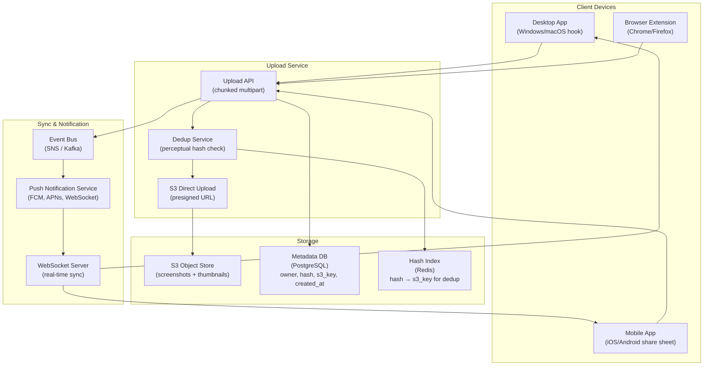
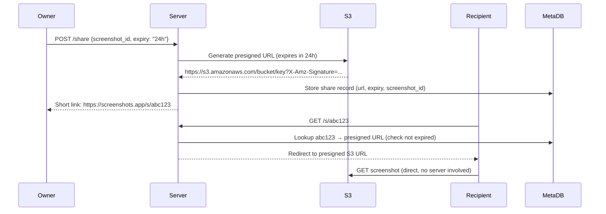

# Design a Multi-Device Screenshot Sync System

**Difficulty**: 🟢 Beginner → 🟡 Intermediate
**Reading Time**: 20 minutes
**Interview Frequency**: Medium — good entry-level system design question; tests file storage, sync, and notification design

---

## Problem Statement

You are asked to design a screenshot sync system that:

- **Works at**: One device, manual upload to Google Drive — trivial.
- **Breaks at**: 10M users × 3 devices each (desktop, mobile, browser extension) — screenshots taken on phone should appear on laptop within 5 seconds; duplicate detection prevents storing same screenshot 3× on accidental re-sync; 100M screenshots/day at avg 500 KB each = 50 TB/day storage; sharing with teammates needs secure temporary links.

Target: **10M users**, **3 devices/user**, **< 5 second sync latency**, **automatic deduplication**, **secure sharing**, **100M screenshots/day ingested**.

---

## Requirements

### Functional Requirements

| Requirement | Description |
|-------------|-------------|
| Capture | Screenshot captured via OS hook, mobile app, or browser extension |
| Upload | Chunked upload to cloud storage (handles large screenshots, retries) |
| Sync | New screenshots appear on all other user's devices within 5 seconds |
| Deduplication | Same screenshot (accidental re-upload) stored once |
| Share | Generate temporary secure link to share with others |
| Gallery | Browse, search, and delete screenshots |

### Non-Functional Requirements

| Requirement | Target |
|-------------|--------|
| Upload Latency | < 3 seconds for 500 KB screenshot on 10 Mbps connection |
| Sync Latency | < 5 seconds from upload to notification on other devices |
| Storage Efficiency | Dedup eliminates ~15% duplicate uploads |
| Availability | 99.9% (screenshots can wait briefly if service down) |
| Retention | Unlimited (user controls deletion) |
| Sharing Link Expiry | Configurable (1 hour to 1 year) |

---

## Capacity Estimates

- **100M screenshots/day = 1,157 uploads/second** peak (with 2× peak factor = 2,314 uploads/sec)
- **Average screenshot size**: 500 KB → **57.8 GB/s** peak upload bandwidth
- **Storage**: 100M × 500 KB = **50 TB/day** gross; dedup saves ~15% → **42.5 TB/day** net
- **Metadata**: 100M screenshots × 512 bytes metadata = **50 GB/day** metadata
- **Thumbnails**: 1 thumbnail at 10 KB per screenshot → **1 TB/day** additional
- **Sharing links**: 1M shares/day × 100 bytes = 100 MB/day (negligible)

---

## High-Level Architecture



---

## Level 1 — Surface: Upload Flow

```
1. Client captures screenshot (PNG/JPEG)
2. Client computes perceptual hash (pHash) locally
3. Client sends hash to /upload/check endpoint
   → Server checks Redis: "hash exists?"
   → YES: return existing S3 URL (dedup hit, no upload needed)
   → NO: server returns presigned S3 URL (valid 15 min)
4. Client uploads directly to S3 (bypasses app servers)
5. Client notifies server: /upload/complete (s3_key, metadata)
6. Server stores metadata in PostgreSQL
7. Server publishes event to SNS: "new_screenshot for user_id X"
8. Push service notifies all user's devices via WebSocket/FCM/APNs
```

**Why direct upload to S3?** 50 GB/s of upload traffic would require hundreds of app servers as proxies. S3 can handle it directly — app servers only handle metadata (< 1 KB/request).

---

## Level 2 — Deep Dive: Perceptual Hashing for Deduplication

Regular cryptographic hash (SHA-256): pixel-identical images → same hash. Even 1 pixel different → completely different hash. Fails for:
- Same screenshot captured twice (screenshots sometimes differ by 1-2 pixels due to rendering timing)
- Screenshot of same content on different screen resolutions

**Perceptual hash (pHash)**: Computes hash based on visual content, not exact bytes. Similar images → similar hashes (Hamming distance < 10 = "same"). Different images → very different hashes.

```
// pHash algorithm (simplified)
1. Resize image to 32×32 pixels
2. Convert to grayscale
3. Compute 2D DCT (discrete cosine transform)
4. Take top-left 8×8 block (low frequencies = visual structure)
5. Compute average of 64 values
6. Each of 64 bits = 1 if pixel > average, else 0
// Result: 64-bit hash

// Comparison: Hamming distance
distance(hash1, hash2) = popcount(hash1 XOR hash2)
// 0 = identical, < 10 = similar, > 15 = different
```

**Storage**: Hash stored in Redis as `hash_value → s3_key`. Lookup: `HGET hashes {hash_value}`. If distance check needed: SSIM or LSH (Locality-Sensitive Hashing) for approximate nearest neighbor search.

### Sharing with Presigned URLs



Presigned URL embeds: bucket, key, expiry time, HMAC signature. S3 validates signature and expiry without any server involvement. Scales to any download traffic without app server load.

---

## Key Design Decisions

### 1. Client-Side vs. Server-Side Deduplication

| Approach | Bandwidth Saved | Client CPU | Privacy |
|----------|----------------|------------|---------|
| **Client-side** (compute hash before upload) | Maximum (never upload duplicate) | Low (pHash is fast, ~10ms) | Better (hash sent, not data) |
| **Server-side** (upload, check after) | None (duplicate fully uploaded) | None on client | Lower |
| **Hash-first check** (send hash, server decides) | Maximum | Low | Good |

**Best practice**: Client computes pHash → sends to server for check → server returns presigned URL or existing URL. This pattern saves bandwidth on mobile data connections.

### 2. WebSocket vs. Push Notifications for Sync

| Mechanism | Latency | Battery Impact | Works When App Closed? |
|-----------|---------|---------------|----------------------|
| **WebSocket** | < 100 ms | Medium (keep connection alive) | No |
| **FCM/APNs Push** | 1–5 seconds | Low (OS manages) | Yes |
| **Long polling** | 1–30 seconds | High | No |

**Strategy**: Use WebSocket when app is active (fast sync), FCM/APNs when app is backgrounded/closed (background sync badge).

---

## Interview Questions

| Question | What They're Testing | Key Answer Points |
|----------|---------------------|-------------------|
| How do you handle a screenshot being taken simultaneously on two devices? | Race condition | Both devices send hash-check request; first to arrive creates record; second finds existing record and deduplicates; both devices get notification with same screenshot |
| Why upload directly to S3 instead of through your server? | Scalability | 50 GB/s upload throughput would require ~500 app servers at 100 Mbps each; S3 handles it natively; presigned URL approach lets client upload directly, app server only handles metadata |
| How would you implement full-text search of screenshot content? | Feature extension | OCR on upload (Tesseract or AWS Textract) → store extracted text in Elasticsearch → enable full-text search; run OCR async (doesn't block upload) |

---

## 📚 Resources & References

| Resource | Type | What You'll Learn |
|----------|------|------------------|
| [AWS S3 Presigned URLs](https://docs.aws.amazon.com/AmazonS3/latest/userguide/ShareObjectPreSignedURL.html) | 📚 Docs | Generating, using, and expiring presigned URLs |
| [ByteByteGo YouTube](https://www.youtube.com/@ByteByteGo) | 📺 YouTube | Design file sharing systems, upload flows, deduplication patterns |
| [Designing Data-Intensive Applications](https://www.oreilly.com/library/view/designing-data-intensive-applications/9781491903063/) | 📚 Book | Chapter 1: fundamentals of reliable, scalable systems |
| [Hussein Nasser YouTube](https://www.youtube.com/@hnasr) | 📺 YouTube | WebSocket design, real-time notification systems |

---

## Related Concepts

- [Distributed File System](./distributed-file-system) — storage layer concepts for large-scale file storage
- [CDN](./cdn) — serving screenshots globally with low latency
- [Unique ID Generator](./unique-id-generator) — generating screenshot IDs for sharing URLs
