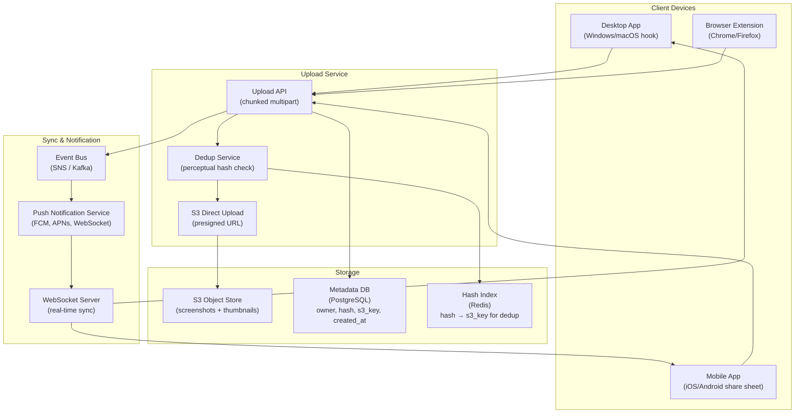
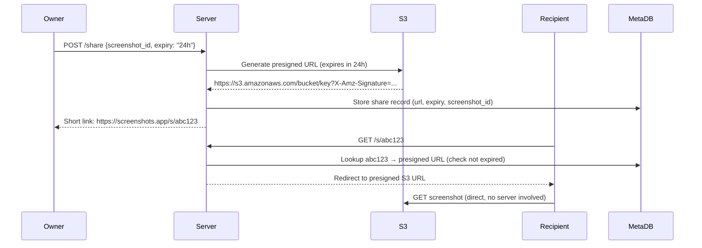
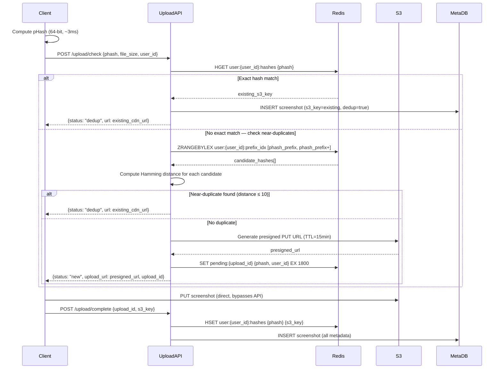
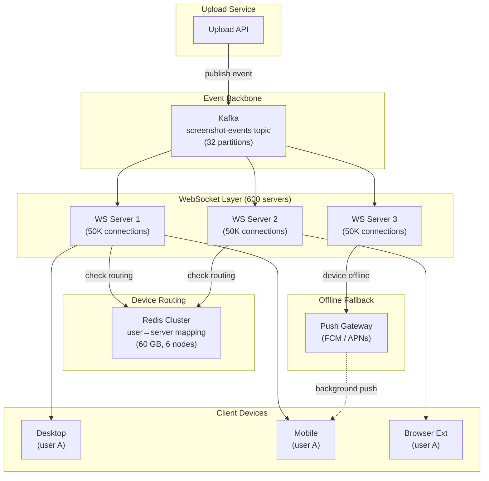

# Design a Multi-Device Screenshot Sync System

**Difficulty**: 🟢 Beginner → 🟡 Intermediate
**Reading Time**: 20 minutes
**Interview Frequency**: Medium — good entry-level system design question; tests file storage, sync, and notification design

---

## Problem Statement

You are asked to design a screenshot sync system that:

- **Works at**: One device, manual upload to Google Drive — trivial.
- **Breaks at**: 10M users × 3 devices each (desktop, mobile, browser extension) — screenshots taken on phone should appear on laptop within 5 seconds; duplicate detection prevents storing same screenshot 3× on accidental re-sync; 100M screenshots/day at avg 500 KB each = 50 TB/day storage; sharing with teammates needs secure temporary links.

Target: **10M users**, **3 devices/user**, **< 5 second sync latency**, **automatic deduplication**, **secure sharing**, **100M screenshots/day ingested**.

---

## Requirements

### Functional Requirements

| Requirement | Description |
|-------------|-------------|
| Capture | Screenshot captured via OS hook, mobile app, or browser extension |
| Upload | Chunked upload to cloud storage (handles large screenshots, retries) |
| Sync | New screenshots appear on all other user's devices within 5 seconds |
| Deduplication | Same screenshot (accidental re-upload) stored once |
| Share | Generate temporary secure link to share with others |
| Gallery | Browse, search, and delete screenshots |

### Non-Functional Requirements

| Requirement | Target |
|-------------|--------|
| Upload Latency | < 3 seconds for 500 KB screenshot on 10 Mbps connection |
| Sync Latency | < 5 seconds from upload to notification on other devices |
| Storage Efficiency | Dedup eliminates ~15% duplicate uploads |
| Availability | 99.9% (screenshots can wait briefly if service down) |
| Retention | Unlimited (user controls deletion) |
| Sharing Link Expiry | Configurable (1 hour to 1 year) |

---

## Capacity Estimates

- **100M screenshots/day = 1,157 uploads/second** peak (with 2× peak factor = 2,314 uploads/sec)
- **Average screenshot size**: 500 KB → **57.8 GB/s** peak upload bandwidth
- **Storage**: 100M × 500 KB = **50 TB/day** gross; dedup saves ~15% → **42.5 TB/day** net
- **Metadata**: 100M screenshots × 512 bytes metadata = **50 GB/day** metadata
- **Thumbnails**: 1 thumbnail at 10 KB per screenshot → **1 TB/day** additional
- **Sharing links**: 1M shares/day × 100 bytes = 100 MB/day (negligible)

---

## High-Level Architecture



---

## Level 1 — Surface: Upload Flow

```
1. Client captures screenshot (PNG/JPEG)
2. Client computes perceptual hash (pHash) locally
3. Client sends hash to /upload/check endpoint
   → Server checks Redis: "hash exists?"
   → YES: return existing S3 URL (dedup hit, no upload needed)
   → NO: server returns presigned S3 URL (valid 15 min)
4. Client uploads directly to S3 (bypasses app servers)
5. Client notifies server: /upload/complete (s3_key, metadata)
6. Server stores metadata in PostgreSQL
7. Server publishes event to SNS: "new_screenshot for user_id X"
8. Push service notifies all user's devices via WebSocket/FCM/APNs
```

**Why direct upload to S3?** 50 GB/s of upload traffic would require hundreds of app servers as proxies. S3 can handle it directly — app servers only handle metadata (< 1 KB/request).

---

## Level 2 — Deep Dive: Perceptual Hashing for Deduplication

Regular cryptographic hash (SHA-256): pixel-identical images → same hash. Even 1 pixel different → completely different hash. Fails for:
- Same screenshot captured twice (screenshots sometimes differ by 1-2 pixels due to rendering timing)
- Screenshot of same content on different screen resolutions

**Perceptual hash (pHash)**: Computes hash based on visual content, not exact bytes. Similar images → similar hashes (Hamming distance < 10 = "same"). Different images → very different hashes.

```
// pHash algorithm (simplified)
1. Resize image to 32×32 pixels
2. Convert to grayscale
3. Compute 2D DCT (discrete cosine transform)
4. Take top-left 8×8 block (low frequencies = visual structure)
5. Compute average of 64 values
6. Each of 64 bits = 1 if pixel > average, else 0
// Result: 64-bit hash

// Comparison: Hamming distance
distance(hash1, hash2) = popcount(hash1 XOR hash2)
// 0 = identical, < 10 = similar, > 15 = different
```

**Storage**: Hash stored in Redis as `hash_value → s3_key`. Lookup: `HGET hashes {hash_value}`. If distance check needed: SSIM or LSH (Locality-Sensitive Hashing) for approximate nearest neighbor search.

### Sharing with Presigned URLs



Presigned URL embeds: bucket, key, expiry time, HMAC signature. S3 validates signature and expiry without any server involvement. Scales to any download traffic without app server load.

---

## Key Design Decisions

### 1. Client-Side vs. Server-Side Deduplication

| Approach | Bandwidth Saved | Client CPU | Privacy |
|----------|----------------|------------|---------|
| **Client-side** (compute hash before upload) | Maximum (never upload duplicate) | Low (pHash is fast, ~10ms) | Better (hash sent, not data) |
| **Server-side** (upload, check after) | None (duplicate fully uploaded) | None on client | Lower |
| **Hash-first check** (send hash, server decides) | Maximum | Low | Good |

**Best practice**: Client computes pHash → sends to server for check → server returns presigned URL or existing URL. This pattern saves bandwidth on mobile data connections.

### 2. WebSocket vs. Push Notifications for Sync

| Mechanism | Latency | Battery Impact | Works When App Closed? |
|-----------|---------|---------------|----------------------|
| **WebSocket** | < 100 ms | Medium (keep connection alive) | No |
| **FCM/APNs Push** | 1–5 seconds | Low (OS manages) | Yes |
| **Long polling** | 1–30 seconds | High | No |

**Strategy**: Use WebSocket when app is active (fast sync), FCM/APNs when app is backgrounded/closed (background sync badge).

---

## Interview Questions

| Question | What They're Testing | Key Answer Points |
|----------|---------------------|-------------------|
| How do you handle a screenshot being taken simultaneously on two devices? | Race condition | Both devices send hash-check request; first to arrive creates record; second finds existing record and deduplicates; both devices get notification with same screenshot |
| Why upload directly to S3 instead of through your server? | Scalability | 50 GB/s upload throughput would require ~500 app servers at 100 Mbps each; S3 handles it natively; presigned URL approach lets client upload directly, app server only handles metadata |
| How would you implement full-text search of screenshot content? | Feature extension | OCR on upload (Tesseract or AWS Textract) → store extracted text in Elasticsearch → enable full-text search; run OCR async (doesn't block upload) |

---

## Component Deep Dive 1: Deduplication Pipeline

The deduplication pipeline is the most critical architectural component because it directly determines storage cost, upload latency, and user experience across all 10M users uploading 100M screenshots/day. Getting it wrong means either wasting 50 TB/day of unnecessary storage or creating false-positive dedup collisions that silently discard distinct screenshots.

### How the Deduplication Pipeline Works Internally

The pipeline has three stages: client-side hash computation, server-side hash lookup with approximate matching, and collision resolution.

**Stage 1 — Client hash computation (< 10 ms on mobile)**: The client computes a 64-bit pHash before initiating any network request. pHash runs in ~3 ms on a modern CPU even for 4K screenshots because it downsizes the image to 32×32 before processing. The client never sends the raw image bytes during the dedup check — only the 8-byte hash.

**Stage 2 — Server lookup (< 2 ms Redis round-trip)**: The Upload API receives `{user_id, phash, file_size, device_id}`. It queries Redis using the exact hash as a key first (O(1) lookup). If found, it also checks a sorted set of "nearby hashes" using a 16-bit prefix index to catch near-duplicates (Hamming distance ≤ 10). If no match, it issues a presigned S3 PUT URL (valid 15 minutes) and registers the pending upload in a "pending_uploads" Redis key with a 30-minute TTL.

**Stage 3 — Collision resolution**: Two different screenshots can produce the same pHash (collision probability ~1 in 10 billion for 64-bit pHash). The system resolves this by also checking file_size: if `|size_a - size_b| > 20%`, treat as distinct even if hashes match. This eliminates false-positive dedup for screenshots with similar visual structure but different content.

### Why Naive Approaches Fail at Scale

A naive SHA-256 approach fails for the two core use cases: retried uploads (client retries after network failure and the second upload is bit-identical but SHA-256 checks work), but it cannot handle screenshots that are "the same" visually but differ by 2 pixels due to rendering jitter. With 100M daily uploads, even a 0.5% false-non-dedup rate wastes 500K duplicate 500 KB files = 250 GB/day of preventable storage cost.

A naive server-side pHash scan (scan all user's hashes on every upload) fails at 10M users × average 1000 screenshots/user = 10 billion stored hashes. A linear scan per upload is O(n) per user — at 100K screenshots per power user, that is 100K Redis comparisons per upload request. The solution is a **prefix index**: store hashes in a sorted set keyed by the first 16 bits, partitioning the 10-billion hash space into 65,536 buckets of ~150K entries each. Each dedup check scans at most ~150 entries.

### Deduplication Internal Architecture



### Dedup Implementation Options

| Approach | Latency | Accuracy | Storage Overhead | Trade-off |
|----------|---------|----------|-----------------|-----------|
| **Exact SHA-256 only** | < 1 ms | 100% (no false positives) | 32 bytes/screenshot | Misses near-duplicate screenshots (retries, resolution differences) |
| **pHash + prefix index** | 2–5 ms | 99.9% (rare collisions) | 8 bytes hash + 2 bytes prefix | Best balance; recommended approach |
| **Full LSH (MinHash)** | 10–50 ms | 99.99% | 200 bytes/screenshot | Overkill for screenshots; needed for document dedup at DocuSign scale |

---

## Component Deep Dive 2: Real-Time Sync Notification Architecture

The notification layer must deliver sync events to up to 3 devices per user within 5 seconds of upload completion. At 10M users × 3 devices = 30M concurrent WebSocket connections at peak, the naive single-server WebSocket approach collapses entirely — a single Node.js server handles ~50K–100K concurrent WebSocket connections. You need 300–600 WebSocket server instances, plus a pub/sub backbone so any server can deliver a message to any device regardless of which server it is connected to.

### How the Sync Layer Works Internally

**Device registration**: On app launch, each device opens a WebSocket connection to a WebSocket server and registers itself: `{user_id, device_id, platform: "ios|android|desktop|extension"}`. The server stores `user_id → [ws_connection_1, ws_connection_2]` in a local in-memory map. It also writes `user:{user_id}:devices → {device_id: server_id}` to Redis so any server can route to the correct WebSocket server instance.

**Event flow after upload**: The Upload API publishes `{event: "new_screenshot", user_id, screenshot_id, s3_key, thumbnail_url, created_at}` to a Kafka topic `screenshot-events`. All WebSocket servers subscribe to this topic. Each server checks its local connection map: if it has a WebSocket for `user_id`, it delivers immediately. Otherwise, the message is acknowledged and discarded (another server has the connection).

**Fallback for offline devices**: If a device is offline at upload time, it misses the WebSocket event. On reconnect, the device sends `{last_seen_at: timestamp}` and the server queries PostgreSQL for all screenshots created after that timestamp for the user. This "catch-up sync" handles the common mobile scenario (phone offline → connects to WiFi → syncs all pending screenshots).

### Scale Behavior at 10x Load

At 100M DAU (10x baseline), the system has 300M WebSocket connections. The Kafka `screenshot-events` topic scales horizontally — add partitions and consumer groups. The bottleneck shifts to Redis: 300M entries for device routing with ~200 bytes each = 60 GB Redis cluster. This is manageable (Redis Cluster sharded across 6 nodes × 10 GB = 60 GB), but the `user:{user_id}:devices` key becomes a hot key for power users (celebrities with 10+ devices or team accounts). Solution: shard device routing by `user_id % 16` to distribute hot keys.

### WebSocket Server Fan-Out Architecture



---

## Component Deep Dive 3: Storage Layer and CDN Strategy

The storage layer handles 42.5 TB/day of net new data. The naive approach — a single S3 bucket with no lifecycle policy — accumulates petabytes within months and incurs mounting per-request GET costs for gallery loading. At 10M users browsing their gallery, thumbnail loads dominate: 10M users × 20 thumbnails per gallery page = 200M thumbnail requests/day. At S3's $0.0004 per 1000 GETs, that is $80/day in GET costs alone before CDN.

### CDN Architecture for Screenshot Delivery

All screenshot reads go through CloudFront (or equivalent CDN). The S3 bucket is private — only CloudFront has read access via an Origin Access Identity. The CDN cache key is the S3 key (which is immutable per screenshot — screenshots never change after upload). Cache TTL is set to 1 year for screenshots and 7 days for thumbnails (thumbnails could be regenerated). This achieves a 90%+ cache hit rate for popular screenshots shared via links, reducing S3 GET costs by 10×.

**Storage tiering**: Screenshots older than 90 days move from S3 Standard ($0.023/GB/month) to S3 Intelligent-Tiering automatically via a lifecycle rule. At 42.5 TB/day × 365 days = 15.5 PB annual storage, tiering saves ~60% on storage costs for the cold long-tail.

### Technical Decisions

- **S3 key naming**: Use `{user_id}/{year}/{month}/{screenshot_id}.{ext}` (not random UUIDs at root). This enables efficient listing of a user's screenshots via `s3.list_objects_v2(Prefix=f"{user_id}/2026/01/")` without a full metadata DB query for gallery pagination.
- **Thumbnail generation**: An AWS Lambda function triggered by S3 `ObjectCreated` events generates 200×150 px thumbnails and writes them to a separate `thumbnails/` prefix. Lambda cold start is < 500 ms — thumbnails are ready within 2 seconds of upload.
- **Multipart upload**: For screenshots > 5 MB (e.g., 4K retina displays produce 2–8 MB PNGs), S3 multipart upload is used with 5 MB parts. The client uploads parts in parallel, saturating the uplink and reducing total upload time from 8 seconds to ~2 seconds on a 10 Mbps connection.

---

## Data Model

```sql
-- Screenshots metadata table (PostgreSQL)
CREATE TABLE screenshots (
  screenshot_id     UUID            PRIMARY KEY DEFAULT gen_random_uuid(),
  user_id           BIGINT          NOT NULL,
  device_id         VARCHAR(64)     NOT NULL,
  s3_key            VARCHAR(512)    NOT NULL UNIQUE,
  thumbnail_s3_key  VARCHAR(512),
  phash             BIGINT          NOT NULL,
  sha256            CHAR(64)        NOT NULL,
  file_size_bytes   INTEGER         NOT NULL,
  width_px          SMALLINT,
  height_px         SMALLINT,
  mime_type         VARCHAR(32)     NOT NULL DEFAULT 'image/png',
  is_dedup          BOOLEAN         NOT NULL DEFAULT FALSE,
  original_id       UUID            REFERENCES screenshots(screenshot_id),
  title             VARCHAR(255),
  ocr_text          TEXT,           -- populated async by OCR job
  created_at        TIMESTAMPTZ     NOT NULL DEFAULT NOW(),
  deleted_at        TIMESTAMPTZ     -- soft delete
);

-- Indexes
CREATE INDEX idx_screenshots_user_created    ON screenshots(user_id, created_at DESC);
CREATE INDEX idx_screenshots_phash           ON screenshots(phash);
CREATE INDEX idx_screenshots_user_device     ON screenshots(user_id, device_id);
CREATE INDEX idx_screenshots_ocr_text        ON screenshots USING GIN(to_tsvector('english', ocr_text))
  WHERE ocr_text IS NOT NULL;

-- Share links table
CREATE TABLE share_links (
  link_id           VARCHAR(16)     PRIMARY KEY,  -- e.g., "abc123xyz789"
  screenshot_id     UUID            NOT NULL REFERENCES screenshots(screenshot_id),
  created_by        BIGINT          NOT NULL,
  presigned_url     TEXT            NOT NULL,
  expires_at        TIMESTAMPTZ     NOT NULL,
  view_count        INTEGER         NOT NULL DEFAULT 0,
  max_views         INTEGER,        -- NULL = unlimited
  created_at        TIMESTAMPTZ     NOT NULL DEFAULT NOW()
);

CREATE INDEX idx_share_links_screenshot ON share_links(screenshot_id);
CREATE INDEX idx_share_links_expires    ON share_links(expires_at);

-- Device registry table
CREATE TABLE devices (
  device_id         VARCHAR(64)     PRIMARY KEY,
  user_id           BIGINT          NOT NULL,
  platform          VARCHAR(16)     NOT NULL,  -- 'ios', 'android', 'desktop', 'extension'
  push_token        VARCHAR(512),   -- FCM or APNs token for offline push
  last_seen_at      TIMESTAMPTZ,
  created_at        TIMESTAMPTZ     NOT NULL DEFAULT NOW()
);

CREATE INDEX idx_devices_user ON devices(user_id);
```

**Redis key schema:**

```
# Dedup hash index (per user)
user:{user_id}:hashes          HASH   phash → s3_key
user:{user_id}:prefix_idx      ZSET   score=0 member="{phash_hex}:{s3_key}" (for range scans)

# Pending uploads (TTL 30 min)
pending:{upload_id}            STRING {phash}:{user_id}:{file_size}  EX 1800

# Device → WebSocket server routing
user:{user_id}:ws_servers      HASH   device_id → ws_server_id

# Rate limiting (per user per minute)
ratelimit:{user_id}:{minute}   INCR   (TTL 120s)
```

---

## Scale Bottlenecks

| Traffic Level | Component That Breaks | Symptoms | Mitigation |
|---------------|----------------------|----------|------------|
| **10x baseline** (1B screenshots/day, 23,140 uploads/sec) | Redis dedup hash index (single Redis node) | Redis CPU > 80%, dedup latency > 50 ms | Shard Redis by `user_id % N`; use Redis Cluster with 16 shards |
| **10x baseline** | PostgreSQL metadata writes (23K inserts/sec) | Write latency spikes to > 500 ms, connection pool exhaustion | Partition `screenshots` table by `user_id % 64`; add PgBouncer connection pooling |
| **100x baseline** (10B screenshots/day) | S3 presigned URL generation rate | S3 returns 503 SlowDown errors | Implement exponential backoff + request hedging; add Upload API request queue with backpressure |
| **100x baseline** | Kafka `screenshot-events` topic throughput | Consumer lag grows, sync latency degrades past 5s SLA | Increase partitions from 32 to 256; add 3× more consumer group instances |
| **100x baseline** | WebSocket connection memory (6000 WS servers × 50K conn = 300M conns) | OOM on WS servers | Switch to QUIC-based transport (HTTP/3) — 40% less memory per connection than TCP+TLS WS |
| **1000x baseline** (100B screenshots/day) | CDN origin S3 bandwidth | CloudFront origin shield saturated at ~10 Tbps | Multi-region S3 with geo-routing; upload to nearest region (eu-west-1 for Europe, us-east-1 for Americas) |
| **1000x baseline** | PostgreSQL storage (5 PB metadata table) | Query planning degrades, index scans slow | Migrate cold metadata (> 1 year old) to Apache Parquet on S3 + Athena for historical queries |

---

## How Dropbox Built This

Dropbox is the closest public reference for multi-device file sync with deduplication at scale. As of 2016, Dropbox stored **500 petabytes** of user data across their infrastructure, with **1.2 billion files synced per day** across 500 million registered users.

**Content-addressed storage**: Dropbox uses SHA-256 content hashing (not perceptual hash, since files must be bit-exact). Files are split into **4 MB blocks**, each block content-addressed by its SHA-256 hash. Two users uploading the same file share the same blocks — global deduplication across all users, not just per-user. This is called **global block dedup** and it reduced their storage footprint by ~30% compared to per-user dedup alone.

**The non-obvious architectural decision**: Dropbox built their own in-house block storage system called **"Magic Pocket"** in 2016, migrating off Amazon S3. The motivation was cost and control: at 500 PB, S3 costs were estimated at ~$40M/year. Magic Pocket used commodity HDD servers running a custom distributed filesystem, reducing storage cost by ~75%. The engineering blog post ("Scaling to Exabytes" by Preslav Rachev) described using erasure coding (14 data + 4 parity = 18 drives, same as RAID-6 but horizontal) to achieve 99.999999999% (11 nines) durability at lower cost than S3's triple-replication.

**Sync latency**: Dropbox's LAN sync feature (peer-to-peer between devices on the same WiFi) achieves < 100 ms sync for small files, bypassing cloud entirely. For a screenshot sync system, this is directly applicable: if source phone and target laptop are on the same network, a local relay achieves sub-second sync without cloud round-trip.

**Metadata service**: Dropbox uses a custom Edgestore (built on top of MySQL with heavy sharding) to store file metadata. At 1.2B files/day, MySQL was chosen because ACID transactions were essential for consistency — a file appearing in your gallery but not being available for download is a worse user experience than a 50 ms slower write.

Source: [Dropbox Engineering Blog — Scaling to Exabytes](https://dropbox.tech/infrastructure/magic-pocket-technical-deep-dive) and [Dropbox Tech Blog — Edgestore](https://dropbox.tech/infrastructure/rebalancing-multi-tenant-databases-to-make-dropbox-faster).

---

## Interview Angle

**What the interviewer is testing:** Whether the candidate can identify the two core scaling challenges independently — upload throughput (bypassing app servers via presigned URLs) and fan-out notification (pub/sub + WebSocket routing) — and can reason about their interaction. Candidates who jump to a CDN before addressing deduplication reveal they haven't modeled the data flow.

**Common mistakes candidates make:**

1. **Routing all upload traffic through app servers**: Candidates design an Upload API that receives the full 500 KB image body, forwards it to S3, and returns the URL. At 2,314 uploads/sec × 500 KB = 1.1 GB/s inbound to app servers, you need 11 servers at 100 Mbps each just for bandwidth — and you've added a latency hop. The correct design uses presigned URLs so clients write directly to S3; app servers only handle the 8-byte hash check and metadata.

2. **Using a single WebSocket server**: Candidates sketch one WebSocket server handling all connections. At 30M concurrent connections this is impossible on a single host. The correct architecture uses a pub/sub backbone (Kafka or Redis Pub/Sub) with hundreds of WebSocket server instances, each holding a subset of connections and routing events via the shared event stream.

3. **Ignoring the offline device problem**: A device taken offline while screenshots accumulate (airplane mode for 4 hours) misses all WebSocket events. Candidates who don't mention a "catch-up sync on reconnect" have missed an entire failure category. The fix is a `last_synced_at` cursor per device: on reconnect, query `WHERE created_at > last_synced_at AND user_id = ?` and push all missed screenshots.

**The insight that separates good from great answers:** Great candidates recognize that deduplication has two distinct layers with different trade-off profiles — **per-user dedup** (easy, Redis per-user hash map) vs **cross-user global dedup** (hard, requires content-addressed storage like Dropbox's block system). They also proactively raise that pHash-based dedup has a ~0.01% false-positive rate, meaning 10,000 screenshots per day could be incorrectly deduplicated at 100M/day scale — and they propose a mitigation (file-size cross-check, SHA-256 fallback for ambiguous matches).

A second separator: candidates who mention that the presigned URL handshake introduces a **two-phase commit problem** — the S3 upload can succeed while the `/upload/complete` call fails — and who propose a reconciliation strategy (S3 event trigger + orphan detection Lambda) are demonstrating production operational thinking, not just happy-path design.

---

## Key Numbers to Remember

| Metric | Value | Context |
|--------|-------|---------|
| Upload throughput (baseline) | 2,314 uploads/sec | 100M screenshots/day with 2× peak factor at 10M users |
| Peak storage ingest | 57.8 GB/s | 2,314 uploads/sec × 500 KB avg screenshot size |
| Net daily storage after dedup | 42.5 TB/day | 15% dedup savings on 50 TB/day gross |
| Dedup hash check latency | < 2 ms | Redis HGET round-trip on SSD-backed cluster |
| pHash computation time (client) | ~3 ms | On mobile CPU for 500 KB screenshot |
| WebSocket servers needed | 300–600 | At 30M concurrent connections, 50K–100K per server |
| Sync latency (foreground app) | < 100 ms | WebSocket path: upload → Kafka → WS server → device |
| Sync latency (background/offline) | 1–5 seconds | FCM/APNs path; OS batches background pushes |
| Thumbnail size | 10 KB (200×150 px) | 1 TB/day additional thumbnail storage at baseline |
| Cold storage savings | ~60% | S3 Intelligent-Tiering for screenshots older than 90 days |
| Dropbox global dedup savings | ~30% | Block-level cross-user dedup at 500 PB scale |
| False-positive dedup rate (pHash) | ~0.01% | ~10,000 incorrectly deduped screenshots/day at 100M/day |

---

## Rate Limiting and Abuse Prevention

Without rate limiting, a single malicious client can exhaust the dedup pipeline's Redis write budget or generate millions of presigned URLs (S3 generates them cheaply but each represents a potential upload slot). Two limits are enforced:

**Per-user upload rate**: Maximum 60 screenshots per minute per user (1/sec average). Enforced via a Redis counter: `INCR ratelimit:{user_id}:{unix_minute}` with `EXPIRE 120`. If counter > 60, return HTTP 429 with `Retry-After: 60`. This is a sliding-window approximation (two-bucket approach) which is accurate to within the last minute's boundary.

**Per-device presigned URL rate**: Maximum 10 presigned URL requests per minute per device. Devices that request more (e.g., a buggy retry loop) are throttled at the device level, not the user level, to avoid penalizing a user's other devices.

**Abuse signal**: If a device sends > 100 unique pHashes per minute with 0 dedup hits (all are genuinely new content), flag for manual review. Legitimate users take screenshots of similar content repeatedly (tutorials, debugging sessions) — all-unique at high rate is a signal of programmatic abuse or a sync loop bug.

**Storage quota**: Each user has a soft quota of 100 GB. Above 100 GB, the upload API returns HTTP 402 with an upgrade prompt. This prevents a single user from accumulating petabytes and also gives the product a monetization gate. Quota is checked from a pre-computed `user_quota` cache in Redis, updated asynchronously by a background job every 60 seconds — not computed on every upload.

| Limit | Value | Enforcement Layer |
|-------|-------|------------------|
| Uploads per user per minute | 60 | Redis counter (per-minute bucket) |
| Presigned URL requests per device per minute | 10 | Redis counter (per-device) |
| Default storage quota per user | 100 GB | Pre-computed Redis cache, checked on upload |
| Max screenshot file size accepted | 25 MB | Enforced at Upload API before issuing presigned URL |
| Max share link expiry | 1 year | Enforced at share creation |

---

## Failure Modes and Operational Runbook

These are the top three production failures and the on-call playbook for each.

### Failure 1: Dedup False Positive (distinct screenshots silently merged)

**Symptom**: User reports "my screenshot from 3pm is showing the wrong image." Two screenshots with Hamming distance ≤ 10 but different actual content (e.g., two screenshots of different Excel cells on a uniform white background) were collapsed into one record.

**Root cause**: pHash only captures low-frequency visual structure. Two screenshots with identical background and small content differences (single changed cell in a white spreadsheet) can produce Hamming distance < 10 even though content differs.

**Fix**: Add a secondary SHA-256 check when Hamming distance is in the 5–10 range (the ambiguous zone). If SHA-256 differs, treat as distinct files. Accept the storage cost of the duplicate — correctness over compression.

**Prevention**: Tune the Hamming distance threshold down from 10 to 6 for business/productivity content (detected by EXIF metadata or client-reported app context). Keep threshold at 10 for photo-based screenshots.

### Failure 2: Presigned URL Race Condition (upload accepted, metadata never written)

**Symptom**: Screenshot appears in S3 but not in the user's gallery. File exists but is orphaned.

**Root cause**: Client uploads to S3 successfully but the subsequent `POST /upload/complete` call times out or fails (network drop, app crash). The S3 object exists but no metadata row was written to PostgreSQL.

**Fix**: S3 event notifications (`s3:ObjectCreated`) trigger a Lambda that checks for the corresponding metadata row within 60 seconds. If missing, Lambda writes a minimal metadata row from S3 object metadata (key, size, content-type, user_id from key prefix). A background job reconciles these orphaned records and delivers a delayed sync notification.

### Failure 3: WebSocket Thundering Herd on Reconnect

**Symptom**: After a 30-minute service disruption, 10M devices reconnect simultaneously. WebSocket servers receive 333K connections/second (10M / 30 seconds). Redis `user:{user_id}:ws_servers` write rate spikes to 333K writes/sec, exceeding Redis throughput.

**Fix**: Implement exponential backoff with jitter on client reconnect: `wait = min(30s, base_delay × 2^attempt) + random(0, 1000ms)`. This spreads 10M reconnects over 5–10 minutes instead of 30 seconds, reducing peak Redis write rate by 10–20×. Also: pre-warm WebSocket servers before re-enabling the load balancer to avoid cold-start latency during the reconnection wave.

---

## 📚 Resources & References

| Resource | Type | What You'll Learn |
|----------|------|------------------|
| [AWS S3 Presigned URLs](https://docs.aws.amazon.com/AmazonS3/latest/userguide/ShareObjectPreSignedURL.html) | 📚 Docs | Generating, using, and expiring presigned URLs |
| [ByteByteGo YouTube](https://www.youtube.com/@ByteByteGo) | 📺 YouTube | Design file sharing systems, upload flows, deduplication patterns |
| [Designing Data-Intensive Applications](https://www.oreilly.com/library/view/designing-data-intensive-applications/9781491903063/) | 📚 Book | Chapter 1: fundamentals of reliable, scalable systems |
| [Hussein Nasser YouTube](https://www.youtube.com/@hnasr) | 📺 YouTube | WebSocket design, real-time notification systems |
| [Dropbox Magic Pocket Deep Dive](https://dropbox.tech/infrastructure/magic-pocket-technical-deep-dive) | 📖 Engineering Blog | How Dropbox migrated 500 PB off S3 to custom block storage |
| [Dropbox Edgestore](https://dropbox.tech/infrastructure/rebalancing-multi-tenant-databases-to-make-dropbox-faster) | 📖 Engineering Blog | Sharded MySQL metadata store for 1.2B files/day |

---

## Related Concepts

- [Distributed File System](./distributed-file-system) — storage layer concepts for large-scale file storage
- [CDN](./cdn) — serving screenshots globally with low latency
- [Unique ID Generator](./unique-id-generator) — generating screenshot IDs for sharing URLs
- [Rate Limiting](./rate-limiting) — token bucket and sliding window algorithms used in upload throttling
- [WebSocket at Scale](./websocket) — connection management and pub/sub fan-out for real-time sync
- [Consistent Hashing](./consistent-hashing) — how Redis Cluster distributes user hash keys across shards
- [Event-Driven Architecture](./event-driven) — Kafka topic design and consumer group patterns used in the sync pipeline

---

## TL;DR — The Three Decisions That Matter

1. **Presigned URLs over proxy upload**: Never route image bytes through app servers. Issue a presigned S3 URL after the hash check; the client writes directly to S3. This alone reduces app server count from ~500 to ~10 at 100M uploads/day.
2. **pHash + Redis prefix index for dedup**: Client-side hash computation + server-side prefix-indexed approximate lookup gives sub-5ms dedup checks at scale. Tune the Hamming distance threshold by content type — 6 for document screenshots, 10 for photo screenshots.
3. **Dual notification path**: WebSocket for foreground (< 100 ms), FCM/APNs for background/offline (1–5 s). Always implement a `last_synced_at` catch-up query for reconnecting devices — this is the failure mode most candidates miss.
