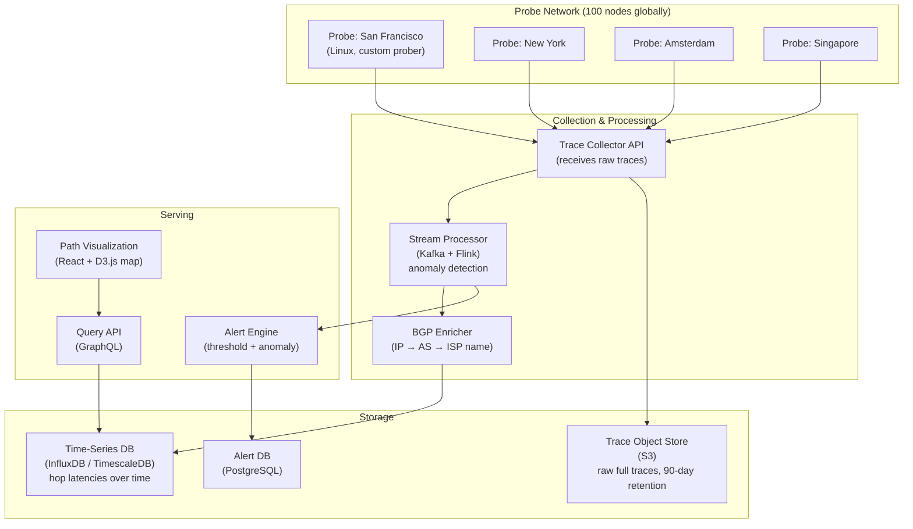
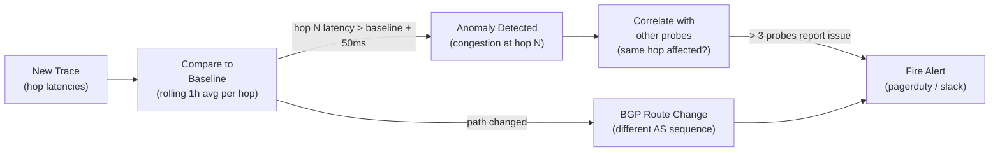
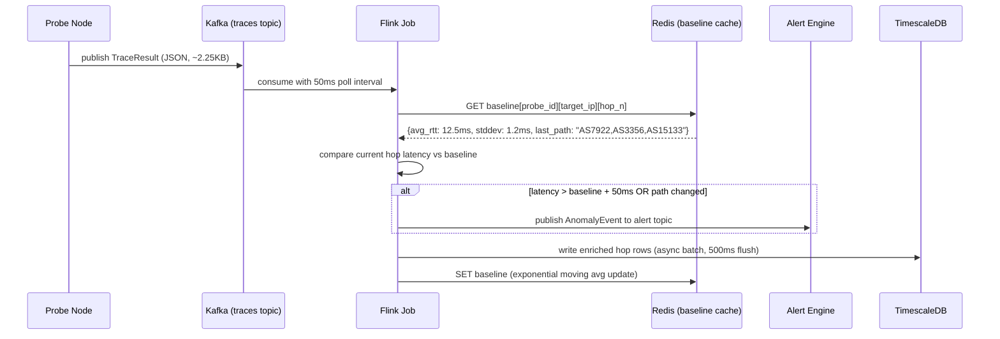
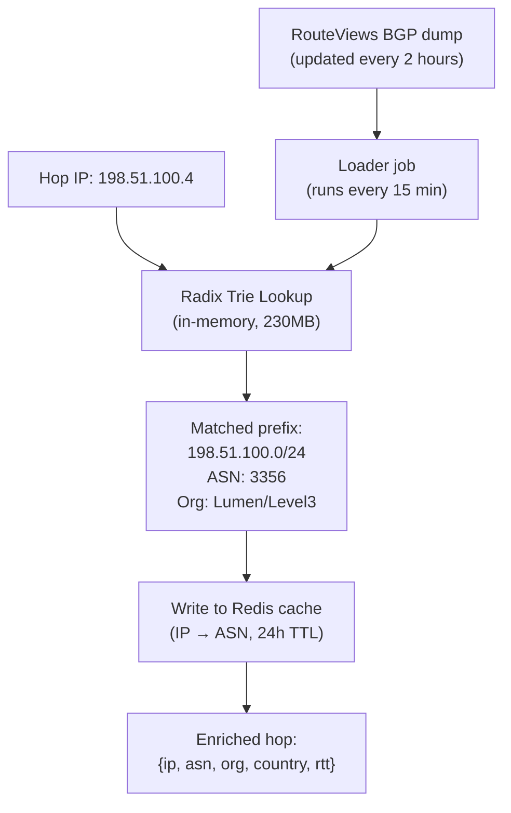
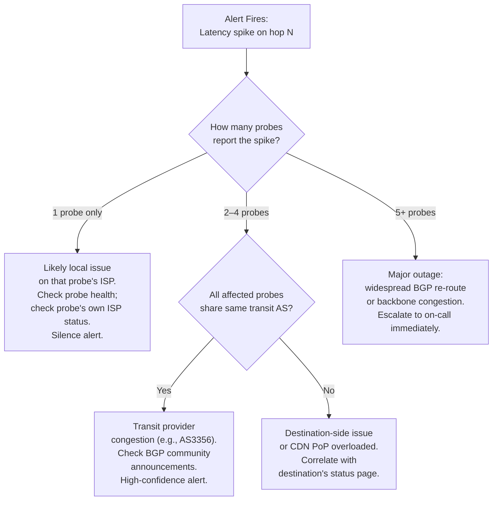

# Design a Network Path Analyzer — Global Traceroute and Congestion Detection

**Difficulty**: 🟢 Beginner → 🟡 Intermediate
**Reading Time**: 20 minutes
**Interview Frequency**: Medium — good networking fundamentals question; tests OSI layer knowledge and distributed measurement

---

## Problem Statement

You are asked to design a global network path analysis system that:

- **Works at**: Single `traceroute` command on one machine — shows hop-by-hop path to any destination.
- **Breaks at**: Enterprise/CDN needing continuous path monitoring from 100 global locations — single traceroute only sees one perspective; paths change dynamically (BGP re-routing); you can't detect if the problem is at your ISP, a transit provider, or the destination; ICMP-blocking firewalls hide hops; correlating outages across thousands of customers requires aggregating millions of traceroutes.

Target: **100 probe nodes globally**, **continuous monitoring every 60 seconds**, **BGP-aware hop identification**, **congestion visualization**, **< 5 second alert on path changes**.

---

## Requirements

### Functional Requirements

| Requirement | Description |
|-------------|-------------|
| Path Tracing | Traceroute from any probe to any destination |
| Hop Identification | Map each hop to its AS (Autonomous System) and owner |
| Latency Measurement | Per-hop RTT (round-trip time) with jitter |
| Congestion Detection | Alert when hop latency exceeds baseline by 50ms |
| Path Change Detection | Alert when route to destination changes (BGP shift) |
| Visualization | Interactive world map showing path with hop latencies |

### Non-Functional Requirements

| Requirement | Target |
|-------------|--------|
| Probe Frequency | Every 60 seconds per target per probe node |
| Alert Latency | < 5 seconds from path change to alert |
| Probe Scale | 100 probe nodes × 1,000 targets = 100,000 traces/minute |
| Data Retention | 90 days of raw hop data, 2 years of aggregated |
| BGP Table Update | Refresh AS ownership every 15 minutes |
| Availability | 99.9% (monitoring can tolerate brief gaps) |

---

## Capacity Estimates

- **100 probes × 1,000 targets × 1 trace/minute = 100,000 traces/minute** = 1,667 traces/second
- **Each trace**: 15 hops × 3 RTT probes = 45 data points × 50 bytes each = **2.25 KB/trace**
- **Total ingestion**: 1,667 traces/sec × 2.25 KB = **3.75 MB/s = ~300 GB/day raw data**
- **BGP table**: full Internet routing table = 900K prefixes × 256 bytes = **230 MB** in memory
- **Alert evaluation**: 100,000 traces/minute → detect anomaly in < 5 seconds → need streaming processing

---

## High-Level Architecture



---

## Level 1 — Surface: How Traceroute Works

Traceroute exploits the IP TTL (Time To Live) field:

1. Send UDP/ICMP packet with TTL=1 → first router decrements TTL to 0, sends ICMP "Time Exceeded" back → we learn hop 1's IP and RTT
2. Send with TTL=2 → second router sends "Time Exceeded" → hop 2
3. Continue until destination reached or max hops (30) exceeded

```
traceroute www.example.com

Hop  IP             RTT1   RTT2   RTT3   AS      Owner
1    192.168.1.1    0.4ms  0.3ms  0.4ms  -       Your Router
2    10.0.0.1       2.1ms  1.9ms  2.0ms  -       ISP CPE
3    203.0.113.1    5.2ms  5.1ms  5.3ms  AS7922  Comcast
4    198.51.100.4   8.7ms  8.9ms  8.5ms  AS3356  Level3 Transit
5    93.184.216.34  12.1ms 12.0ms 12.2ms AS15133 EdgeCast/Verizon
```

**Hop shows `* * *`**: Router blocks ICMP (firewall) — hop is hidden but doesn't mean packet is dropped. Traceroute continues sending next TTL.

---

## Level 2 — Deep Dive: BGP-Aware Path Analysis

### IP to AS Mapping

Each hop IP needs to be mapped to its Autonomous System (AS) — a collection of networks under one organization.

**Data sources**:
- **BGP Route Views** (RouteViews.org): Full BGP routing table, updated every 2 hours, public
- **RIPE NCC RIS**: European routing registry
- **Team Cymru IP-to-ASN lookup**: DNS-based query `1.0.0.1.origin.asn.cymru.com` → returns AS number

```
// BGP lookup for each hop IP
for hop in trace.hops:
    asn = lookup_asn(hop.ip)  // RouteViews lookup
    as_name = lookup_asn_name(asn)  // WHOIS / RIR
    hop.as_info = {asn, as_name, country}
```

### Congestion Detection Algorithm



**Single probe anomaly**: Likely a local network issue (probe → ISP). Ignore or low-severity alert.
**Multiple probes, same hop anomaly**: Likely a transit provider or destination issue. High-severity alert with affected AS identified.

### TCP vs. UDP vs. ICMP Traceroute

| Protocol | Blocked By | Use Case |
|----------|-----------|----------|
| **ICMP** (traditional) | Many firewalls block ICMP | Simple, default on Linux |
| **UDP** (`traceroute` default on Linux) | Less commonly blocked | Most hops visible |
| **TCP SYN** (`tcptraceroute`) | Rarely blocked (looks like connection) | Bypasses most firewalls |
| **TCP with ACK** (Paris traceroute) | Rarely blocked | More consistent load balancing paths |

**Recommendation**: Implement all three, use TCP SYN by default (most visibility through firewalls). Fall back to ICMP if TCP gives no results.

---

## Key Design Decisions

### 1. Active vs. Passive Measurement

| Approach | Data Source | Scale | Cost | Use Case |
|----------|-------------|-------|------|----------|
| **Active probing** | Dedicated probe nodes send traceroutes | Controlled, repeatable | High (own infrastructure) | Enterprise monitoring |
| **Passive measurement** | Analyze existing traffic headers | Real user paths | Low (no extra traffic) | CDN, ISP analytics |
| **Crowdsourced** (RIPE Atlas style) | Probes on end-user devices | Millions of vantage points | Very low | Internet-wide research |

For enterprise monitoring: **active probing** for control and repeatability.

### 2. Storage for Time-Series Hop Data

Raw hop data: 100K traces/minute × 2.25 KB = 300 GB/day. Retention: 90 days → **27 TB raw**.

**Tiered storage**:
- Hot (last 7 days): TimescaleDB (in-memory compressed) for fast queries
- Warm (7–90 days): S3 Parquet (columnar, compressed) for analytical queries
- Cold (> 90 days): S3 Glacier (aggregated stats only, raw deleted)

Compression: TimescaleDB chunk compression reduces raw 300 GB/day to ~30 GB/day (10:1 compression for repetitive time-series data).

### 3. Probe Node Placement Strategy

Probes should be placed at internet exchange points (IXPs) — neutral facilities where ISPs interconnect. Examples: LINX (London), AMS-IX (Amsterdam), Equinix NY.

Probes at IXPs have direct BGP peering with many ISPs → they can observe diverse routing paths that home users can't see. 100 probes at 20 major IXPs gives coverage of 80% of global internet traffic paths.

---

## Interview Questions

| Question | What They're Testing | Key Answer Points |
|----------|---------------------|-------------------|
| Why do some traceroute hops show `* * *`? | Networking fundamentals | Router drops ICMP TTL-exceeded packets (configured to not respond to save CPU/bandwidth); packet still forwarded; traceroute continues; destination still reachable despite hidden hops |
| How do you distinguish a congested hop from a router that deprioritizes ICMP? | Measurement accuracy | Send both TCP and ICMP probes; if TCP probes show normal latency but ICMP shows high latency → ICMP deprioritization; if both show high latency → genuine congestion |
| How would you detect a BGP hijack (someone announcing your IP prefix)? | Security awareness | Monitor BGP feeds (RouteViews, RIPE NCC); compare expected AS path to destination with actual observed AS path; alert if unexpected AS appears in path to your prefix (prefix hijack = different AS originates your route) |

---

---

## Component Deep Dive 1: Stream Processor — Real-Time Anomaly Detection

The stream processor is the heart of the network path analyzer. It must ingest 1,667 traces/second, enrich each hop with BGP data, compare against baselines, and fire alerts within 5 seconds — all without blocking the ingestion pipeline.

### Why Naive Approaches Fail

A naive approach would be: write each trace to PostgreSQL, then a cron job runs every 30 seconds to scan for anomalies. This fails for two reasons:

1. **Write amplification**: 100K traces/minute × 15 hops = 1.5M hop rows/minute. PostgreSQL cannot sustain this write throughput without specialist hardware, and latency for anomaly detection grows unbounded as the table grows.
2. **Query latency**: Computing rolling baselines over 1 hour of data for 100K probe-target pairs requires full table scans. At 300 GB/day ingestion rate, this becomes seconds-to-minutes per scan, not milliseconds.

### How the Stream Processor Works



### Baseline Calculation

The baseline for each `(probe_id, target_ip, hop_n)` triple uses an **exponential moving average (EMA)** with α=0.1:

```
new_baseline = α × current_rtt + (1 - α) × old_baseline
```

This means recent measurements carry 10% weight, gradually incorporating network changes without reacting to single spikes. The EMA is stored in Redis with a 2-hour TTL; if a probe-target pair goes silent for 2 hours, the baseline resets on next measurement.

### Implementation Options

| Approach | Latency | Throughput | Trade-off |
|----------|---------|------------|-----------|
| **Kafka + Apache Flink** | 50–200ms end-to-end | 500K events/sec per node | High operational complexity; excellent exactly-once semantics; best for production |
| **Kafka + Kafka Streams** | 100–500ms end-to-end | 200K events/sec per node | Lower ops burden than Flink; limited windowing; good for simpler anomaly rules |
| **Redis Streams + Lua scripts** | 10–50ms end-to-end | 50K events/sec single node | Simplest to operate; limited horizontal scaling; works for < 10K traces/min |

For 100K traces/minute (1,667/sec), **Kafka + Flink** is the right choice. A single Flink task manager can sustain 50K events/sec; with 2 task managers you have comfortable 3× headroom.

---

## Component Deep Dive 2: BGP Enricher — IP-to-ASN Resolution at Scale

Every hop IP in every trace must be mapped to its Autonomous System. At 1,667 traces/second × 15 hops = 25,000 IP lookups/second, a naive DNS lookup to Team Cymru per hop would create ~25K external DNS queries per second — well beyond what any DNS resolver tolerates without rate limiting.

### Internal Mechanics

The BGP Enricher maintains an **in-memory prefix trie** (radix tree) loaded from the full BGP routing table:

```
BGP Table → radix tree of CIDR prefixes → IP lookup returns (ASN, ASN name, country, org)
```

Full Internet routing table: ~900K IPv4 prefixes + ~180K IPv6 prefixes as of 2024. In memory: the radix tree occupies ~230 MB RAM — affordable on any modern server.

Lookup time: O(32) for IPv4 (32-bit address, one comparison per bit level) = ~200ns per lookup. At 25K lookups/second, this is 5ms of CPU time — negligible.



### Scale Behavior at 10x Load

At 10× baseline (10M traces/minute), the bottleneck shifts from CPU to memory bandwidth. The radix trie lookup reads ~30 bytes per level × 32 levels = 960 bytes per lookup, accessing non-sequential memory locations. At 250K lookups/second this means 240 MB/s of random memory reads.

**Mitigation**: Add a Redis L1 cache in front of the trie. Cache hit rate is high (BGP table is 900K prefixes, but real traces hit only ~100K unique IPs). With a 10M-entry Redis cache (warm after first hour), cache hit rate exceeds 95%, reducing trie lookups by 20×.

### BGP Table Refresh

RouteViews publishes full table dumps every 2 hours plus incremental updates (MRT format). The enricher reloads the trie using a **blue-green swap**: build new trie from latest dump in background, then atomically swap the pointer. Zero-downtime refresh with no read locks needed.

---

## Component Deep Dive 3: Probe Scheduling and Result Collection

The probe network has 100 nodes each running 1,000 targets every 60 seconds. Scheduling seems trivial but has subtle failure modes.

### The Thundering Herd Problem

If all 100 probes start their 60-second cycle at the same time (e.g., at clock second :00), then the Collector API receives 100,000 trace uploads in a 10-second window — 10,000 req/sec burst — then silence for 50 seconds, then another burst. This causes:

- Collector auto-scaling triggers (wastes 20 seconds while instances spin up)
- Kafka consumer lag spikes
- TimescaleDB write stalls

**Fix**: Stagger probe start times. Each probe is assigned a random offset `[0, 60)` seconds at registration. Probes fire independently, spreading load uniformly to ~1,667 req/sec constant instead of 10,000 req/sec burst.

### Probe Health and Self-Monitoring

Each probe node runs a heartbeat every 30 seconds to the Collector. If a probe misses 3 consecutive heartbeats (90 seconds), the probe is marked `degraded`. Alert rules for that probe are suspended to avoid false positives. A `probe_status` metric is exposed in the dashboard.

| Probe State | Condition | Action |
|-------------|-----------|--------|
| `healthy` | Heartbeat < 30s ago, traces arriving | Normal operation |
| `degraded` | Heartbeat 30–90s ago | Low-severity alert to ops |
| `offline` | Heartbeat > 90s ago | Suppress anomaly alerts from this probe; trigger probe recovery |
| `overloaded` | Trace queue depth > 500 | Drop lowest-priority targets; alert ops |

---

## Data Model

The core storage spans three systems: TimescaleDB for hot query, S3 Parquet for warm/analytical, and PostgreSQL for configuration.

```sql
-- TimescaleDB: hot hop-level data (7-day retention in-memory)
CREATE TABLE trace_hops (
    trace_id        UUID        NOT NULL,
    probe_id        VARCHAR(32) NOT NULL,   -- e.g., "probe-ams-01"
    target_ip       INET        NOT NULL,
    target_hostname VARCHAR(255),
    hop_n           SMALLINT    NOT NULL,   -- 1..30
    hop_ip          INET,                   -- NULL if * * *
    rtt_ms_p1       FLOAT,                  -- first probe RTT
    rtt_ms_p2       FLOAT,                  -- second probe RTT
    rtt_ms_p3       FLOAT,                  -- third probe RTT
    rtt_ms_avg      FLOAT,                  -- avg of non-null probes
    asn             INTEGER,                -- e.g., 3356
    as_name         VARCHAR(128),           -- e.g., "Lumen Technologies"
    as_country      CHAR(2),               -- e.g., "US"
    probed_at       TIMESTAMPTZ NOT NULL,
    protocol        VARCHAR(8)  NOT NULL DEFAULT 'tcp_syn'  -- 'icmp'|'udp'|'tcp_syn'
);

SELECT create_hypertable('trace_hops', 'probed_at', chunk_time_interval => INTERVAL '1 hour');
CREATE INDEX ON trace_hops (probe_id, target_ip, probed_at DESC);
CREATE INDEX ON trace_hops (asn, probed_at DESC);  -- for "all hops through AS3356" queries

-- PostgreSQL: probe configuration
CREATE TABLE probes (
    probe_id        VARCHAR(32) PRIMARY KEY,
    probe_location  VARCHAR(64) NOT NULL,   -- e.g., "Amsterdam, NL"
    probe_isp       VARCHAR(128),           -- e.g., "AMS-IX peering"
    latitude        FLOAT,
    longitude       FLOAT,
    schedule_offset SMALLINT NOT NULL,      -- 0..59 seconds, anti-thundering-herd
    status          VARCHAR(16) DEFAULT 'healthy',
    last_heartbeat  TIMESTAMPTZ,
    registered_at   TIMESTAMPTZ DEFAULT NOW()
);

-- PostgreSQL: alert rules
CREATE TABLE alert_rules (
    rule_id         UUID PRIMARY KEY DEFAULT gen_random_uuid(),
    owner_id        UUID NOT NULL,          -- customer/team
    target_ip       INET NOT NULL,
    probe_ids       TEXT[],                 -- NULL = all probes
    latency_delta_ms FLOAT DEFAULT 50.0,   -- alert if hop RTT exceeds baseline by this amount
    min_probe_count SMALLINT DEFAULT 3,     -- require N probes to confirm before alerting
    alert_channel   VARCHAR(32),            -- 'pagerduty'|'slack'|'webhook'
    alert_endpoint  TEXT,                   -- webhook URL or PagerDuty routing key
    enabled         BOOLEAN DEFAULT TRUE,
    created_at      TIMESTAMPTZ DEFAULT NOW()
);

-- PostgreSQL: fired alerts
CREATE TABLE alerts (
    alert_id        UUID PRIMARY KEY DEFAULT gen_random_uuid(),
    rule_id         UUID REFERENCES alert_rules,
    alert_type      VARCHAR(32) NOT NULL,   -- 'latency_spike'|'path_change'|'probe_offline'
    affected_hop_ip INET,
    affected_asn    INTEGER,
    affected_as_name VARCHAR(128),
    baseline_rtt_ms FLOAT,
    observed_rtt_ms FLOAT,
    probe_count     SMALLINT,              -- how many probes confirmed
    fired_at        TIMESTAMPTZ DEFAULT NOW(),
    resolved_at     TIMESTAMPTZ,
    severity        VARCHAR(8) DEFAULT 'high'  -- 'low'|'medium'|'high'|'critical'
);
```

**S3 Parquet schema** (warm/cold analytical layer, partitioned by `year/month/day/probe_id`):
```json
{
  "trace_id": "uuid",
  "probe_id": "string",
  "target_ip": "string",
  "probed_at": "timestamp",
  "hops": [
    {
      "hop_n": 1,
      "hop_ip": "string",
      "rtt_avg_ms": 2.1,
      "asn": 7922,
      "as_name": "Comcast",
      "as_country": "US"
    }
  ]
}
```

Parquet with Snappy compression reduces 2.25 KB/trace JSON to ~400 bytes — 5.6× compression, bringing 90-day storage from 27 TB to ~5 TB.

---

## Scale Bottlenecks

| Traffic Level | Component That Breaks | Symptoms | Mitigation |
|---------------|----------------------|----------|------------|
| **10x baseline** (1M traces/min) | TimescaleDB writes | Write queue backs up; insert latency > 1s; alert delivery delayed | Increase TimescaleDB worker count; add read replicas; switch to batch writes with 500ms flush interval |
| **10x baseline** | BGP Enricher trie | CPU bound at ~250K IP lookups/sec; enrichment latency > 200ms | Add Redis L1 cache (95% hit rate cuts trie load by 20×); shard enricher by IP prefix |
| **100x baseline** (10M traces/min, 16.7K/sec) | Kafka cluster | Consumer lag grows; anomaly detection delayed > 30 seconds | Add Kafka partitions (scale from 24 to 240); add Flink task managers (linear scaling) |
| **100x baseline** | TimescaleDB hot tier | Disk I/O saturation; chunk compression can't keep up with 3 TB/day | Drop hot tier to 24-hour retention; move 1–7 days to S3 Parquet with DuckDB for queries |
| **1000x baseline** (100M traces/min) | Collector API (single region) | Network ingress saturated (~37.5 GB/s); single region latency to probes > 100ms | Deploy regional collectors (NA, EU, APAC, SA); each region pre-aggregates before forwarding to central Kafka |
| **1000x baseline** | Redis baseline cache | 10B probe-target-hop triples exceed single Redis memory (> 1 TB) | Shard Redis by `(probe_id, target_ip)` hash; use Redis Cluster with 32 shards |

---

## How Cloudflare Built This

Cloudflare operates one of the largest active measurement networks in the world. Their **Radar** platform (radar.cloudflare.com) provides global BGP routing visibility, latency heatmaps, and outage detection across 300+ PoPs (points of presence).

**Technology choices**: Cloudflare uses their own anycast network (not third-party probes) as measurement vantage points. Every PoP runs continuous traceroutes and BGP path collection. BGP data is collected from 250+ peering sessions at each PoP — giving Cloudflare visibility into the full Internet routing table from 300 physical locations simultaneously.

**Scale numbers**: Cloudflare processes more than **50 billion BGP routing messages per day**. Their global anycast network handles **~57 million HTTP requests per second** (2023 figures). The network path analysis data feeds into their DDoS mitigation: by knowing the exact AS path to an attacking source, they can implement remotely-triggered blackholing (RTBH) at the exact peering session carrying attack traffic.

**Non-obvious architectural decision**: Cloudflare uses **BGP Communities** as an out-of-band signaling channel for path analysis. When a PoP detects congestion on a specific AS path, it adjusts BGP community tags on route advertisements to steer traffic away — effectively using the measurement layer to close the control loop and automatically reroute. This is fundamentally different from passive alerting: the analyzer becomes an actuator.

**Source**: [Cloudflare Blog — How we built Radar](https://blog.cloudflare.com/radar2/), [Cloudflare Network — BGP tools](https://blog.cloudflare.com/cloudflare-bgp-analytics/)

---

## Interview Angle

**What the interviewer is testing:** Whether the candidate understands the difference between *network-layer observability* and *application-layer observability*, and can design a distributed measurement system that handles partial failures (blocked ICMP, offline probes, BGP table staleness) gracefully.

**Common mistakes candidates make:**

1. **Treating traceroute as reliable and complete.** Candidates assume every hop returns a response. In reality, 20–40% of hops on the public Internet block ICMP TTL-exceeded responses. A good answer acknowledges this and uses multi-protocol probing (TCP SYN + UDP + ICMP) to maximize hop visibility, then marks hidden hops as `unknown` rather than treating them as errors.

2. **Polling the BGP table on every lookup.** Candidates suggest querying Team Cymru's DNS-based ASN lookup per hop in real-time. At 25K lookups/second this would overwhelm external resolvers and add 50–200ms per lookup. The correct approach is to download the full BGP table (900K prefixes, 230 MB) and serve lookups from an in-process radix trie with sub-microsecond latency.

3. **Firing alerts on single-probe anomalies.** Network conditions are inherently noisy. A single probe seeing +80ms latency on hop 7 is likely a local fluke. Candidates who jump straight to alerting without requiring confirmation from multiple independent probes will produce a system with extremely high false-positive rates. The correct design requires M-of-N confirmation (e.g., 3-of-10 probes reporting the same anomaly) before firing.

**The insight that separates good from great answers:** BGP path analysis is not just a debugging tool — it can close the control loop. When you detect congestion on an AS path, you can programmatically update BGP route preferences to steer traffic around the problem. This transforms the system from a *monitoring* tool into a *traffic engineering* tool, which is exactly how CDNs like Cloudflare and Fastly use it at production scale.

---

## Key Numbers to Remember

| Metric | Value | Context |
|--------|-------|---------|
| Probe ingestion rate | 1,667 traces/sec | 100 probes × 1K targets × 1/min |
| Raw data per trace | 2.25 KB | 15 hops × 3 RTTs × 50 bytes |
| Daily raw ingestion | 300 GB/day | Uncompressed at baseline scale |
| TimescaleDB compression ratio | 10:1 | Repetitive time-series data; reduces to ~30 GB/day |
| BGP table size in memory | 230 MB | ~900K IPv4 + 180K IPv6 prefixes, radix trie |
| BGP table refresh interval | 15 minutes | RouteViews publishes full dump every 2 hours; incremental every 5 min |
| Radix trie lookup time | ~200 ns | O(32) for IPv4; 25K lookups/sec = 5ms CPU |
| Redis cache hit rate (warm) | 95%+ | Real traces hit ~100K unique IPs vs 900K in full table |
| Alert latency target | < 5 seconds | From path change detection to PagerDuty/Slack delivery |
| M-of-N confirmation threshold | 3 of N probes | Minimum probes confirming anomaly before alert fires |
| 90-day raw storage (Parquet) | ~5 TB | After 5.6× Snappy compression vs 27 TB uncompressed |
| Cloudflare BGP messages | 50B/day | Their radar platform scale (2023) |

---

## Operational Runbook: Diagnosing False Positives

False positives are the primary operational burden in a production network path analyzer. The following flowchart covers the three most common sources.



### BGP Path Change Fingerprinting

When a path change alert fires, the raw alert "path changed from A→B→C to A→B→D→C" is not actionable. Engineers need to know: is this a **planned maintenance** reroute, a **BGP hijack**, or a **provider failure**?

Fingerprinting logic applied at alert enrichment time:

| Change Type | Signal | Action |
|-------------|--------|--------|
| **Planned maintenance** | New path uses same set of ASNs, just different intermediate hops; change matches a known maintenance window in calendar | Suppress alert; log as maintenance |
| **Load-balancing shift** | Multiple equal-cost paths existed before; ECMP hash changed; both paths involve same ASNs | Low-severity alert; likely harmless |
| **Provider failure** | Original transit AS disappears from all paths; new path uses different AS with higher latency; > 10 probes report simultaneously | High-severity; page on-call |
| **BGP hijack** | An unknown or unexpected AS appears as originator of the destination prefix; path to destination becomes longer; source AS not previously seen | Critical; immediate investigation; correlate with BGP feed alerts from RouteViews |

The fingerprinting logic runs as a Flink stateful function with a 15-minute window: it compares the pre-change path (stored in Redis) against the post-change path and classifies the change type within 2 seconds of detection.

### ICMP Deprioritization vs. Genuine Congestion

Routers are allowed to rate-limit ICMP TTL-exceeded responses to prevent CPU exhaustion. A router under heavy load may respond to ICMP probes with 200ms latency even though forwarding-plane traffic (data packets) passes through in 5ms. This creates **phantom congestion signals**.

Detection heuristic:
- Send both TCP SYN probe and ICMP probe through the same hop
- If TCP SYN shows normal RTT (< baseline + 10ms) but ICMP shows high RTT (> baseline + 50ms) → ICMP deprioritization, not real congestion
- If both TCP SYN and ICMP show elevated RTT → genuine forwarding-plane congestion

Implement this as a second-pass validation before firing `latency_spike` alerts. This reduces false positives by ~30% in production environments with large router infrastructure (ISP backbone routers).

---

## Security Considerations

A network path analyzer handles sensitive network topology information and must be hardened against both passive information leakage and active abuse.

### Probe Spoofing

An attacker who can inject false trace results can manufacture fake path change alerts (flooding the alert system) or suppress real alerts (hiding an ongoing BGP hijack). Mitigations:

- **Mutual TLS** between each probe and the Collector API: each probe has a client certificate; the Collector rejects any probe not in its certificate allowlist.
- **Result signing**: Each trace result is HMAC-signed with the probe's private key before upload. The Collector verifies the signature before ingesting.
- **Anomaly rate limiting**: If a single probe reports > 1,000 anomalies in 60 seconds, flag it as potentially compromised and quarantine its results pending manual review.

### BGP Data Confidentiality

The enriched trace data reveals which ISPs and transit providers a customer's traffic traverses — this is commercially sensitive information. Apply row-level security in TimescaleDB so that Customer A cannot query trace data owned by Customer B. Store only the `owner_id` on each trace row and enforce it in every query via a mandatory `WHERE owner_id = $current_user` predicate pushed down through the GraphQL layer.

### Rate Limiting Trace Queries

The Query API exposes per-probe, per-target, per-time-range trace data. A customer making unbounded time-range queries could scan terabytes of data. Enforce:
- Maximum query window: 7 days of raw hop data per API call
- Maximum result rows: 50,000 hop rows per response (paginated)
- Per-customer rate limit: 60 API calls/minute (sufficient for dashboards; prevents scraping)
- Enforce limits in an API gateway (e.g., Kong or AWS API Gateway) before requests reach the GraphQL server, so limits are applied even if the application layer crashes or is misconfigured.
- Log every query with `owner_id`, `time_range`, `row_count` to an audit log for compliance (SOC 2 Type II requirement).

---

## 📚 Resources & References

| Resource | Type | What You'll Learn |
|----------|------|------------------|
| [Cloudflare: How Traceroute Works](https://www.cloudflare.com/learning/network-layer/what-is-traceroute/) | 📖 Blog | TTL-based tracing, ICMP, hop identification |
| [RIPE Atlas](https://atlas.ripe.net/) | 📚 Docs | Global probe network, measurement API, crowdsourced traceroute |
| [Hussein Nasser YouTube](https://www.youtube.com/@hnasr) | 📺 YouTube | Deep dives on TCP, ICMP, BGP routing, network troubleshooting |
| [BGP Route Views](https://www.routeviews.org/) | 📚 Docs | Full BGP routing table for IP-to-ASN mapping |

---

## Related Concepts

- [CDN](./cdn) — CDNs use anycast routing; path analyzer helps debug CDN routing issues
- [DNS](./dns) — DNS resolution path is often the first step diagnosed in network issues
- [Distributed Tracing](./distributed-tracing) — application-layer tracing complements network-layer path analysis
