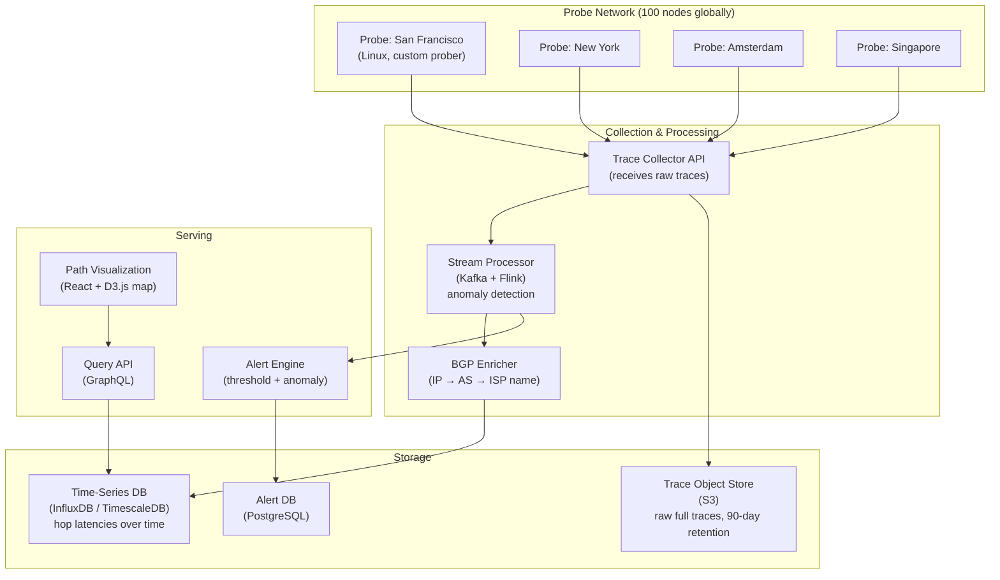
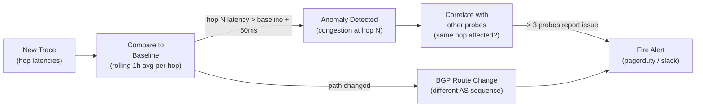

# Design a Network Path Analyzer — Global Traceroute and Congestion Detection

**Difficulty**: 🟢 Beginner → 🟡 Intermediate
**Reading Time**: 20 minutes
**Interview Frequency**: Medium — good networking fundamentals question; tests OSI layer knowledge and distributed measurement

---

## Problem Statement

You are asked to design a global network path analysis system that:

- **Works at**: Single `traceroute` command on one machine — shows hop-by-hop path to any destination.
- **Breaks at**: Enterprise/CDN needing continuous path monitoring from 100 global locations — single traceroute only sees one perspective; paths change dynamically (BGP re-routing); you can't detect if the problem is at your ISP, a transit provider, or the destination; ICMP-blocking firewalls hide hops; correlating outages across thousands of customers requires aggregating millions of traceroutes.

Target: **100 probe nodes globally**, **continuous monitoring every 60 seconds**, **BGP-aware hop identification**, **congestion visualization**, **< 5 second alert on path changes**.

---

## Requirements

### Functional Requirements

| Requirement | Description |
|-------------|-------------|
| Path Tracing | Traceroute from any probe to any destination |
| Hop Identification | Map each hop to its AS (Autonomous System) and owner |
| Latency Measurement | Per-hop RTT (round-trip time) with jitter |
| Congestion Detection | Alert when hop latency exceeds baseline by 50ms |
| Path Change Detection | Alert when route to destination changes (BGP shift) |
| Visualization | Interactive world map showing path with hop latencies |

### Non-Functional Requirements

| Requirement | Target |
|-------------|--------|
| Probe Frequency | Every 60 seconds per target per probe node |
| Alert Latency | < 5 seconds from path change to alert |
| Probe Scale | 100 probe nodes × 1,000 targets = 100,000 traces/minute |
| Data Retention | 90 days of raw hop data, 2 years of aggregated |
| BGP Table Update | Refresh AS ownership every 15 minutes |
| Availability | 99.9% (monitoring can tolerate brief gaps) |

---

## Capacity Estimates

- **100 probes × 1,000 targets × 1 trace/minute = 100,000 traces/minute** = 1,667 traces/second
- **Each trace**: 15 hops × 3 RTT probes = 45 data points × 50 bytes each = **2.25 KB/trace**
- **Total ingestion**: 1,667 traces/sec × 2.25 KB = **3.75 MB/s = ~300 GB/day raw data**
- **BGP table**: full Internet routing table = 900K prefixes × 256 bytes = **230 MB** in memory
- **Alert evaluation**: 100,000 traces/minute → detect anomaly in < 5 seconds → need streaming processing

---

## High-Level Architecture



---

## Level 1 — Surface: How Traceroute Works

Traceroute exploits the IP TTL (Time To Live) field:

1. Send UDP/ICMP packet with TTL=1 → first router decrements TTL to 0, sends ICMP "Time Exceeded" back → we learn hop 1's IP and RTT
2. Send with TTL=2 → second router sends "Time Exceeded" → hop 2
3. Continue until destination reached or max hops (30) exceeded

```
traceroute www.example.com

Hop  IP             RTT1   RTT2   RTT3   AS      Owner
1    192.168.1.1    0.4ms  0.3ms  0.4ms  -       Your Router
2    10.0.0.1       2.1ms  1.9ms  2.0ms  -       ISP CPE
3    203.0.113.1    5.2ms  5.1ms  5.3ms  AS7922  Comcast
4    198.51.100.4   8.7ms  8.9ms  8.5ms  AS3356  Level3 Transit
5    93.184.216.34  12.1ms 12.0ms 12.2ms AS15133 EdgeCast/Verizon
```

**Hop shows `* * *`**: Router blocks ICMP (firewall) — hop is hidden but doesn't mean packet is dropped. Traceroute continues sending next TTL.

---

## Level 2 — Deep Dive: BGP-Aware Path Analysis

### IP to AS Mapping

Each hop IP needs to be mapped to its Autonomous System (AS) — a collection of networks under one organization.

**Data sources**:
- **BGP Route Views** (RouteViews.org): Full BGP routing table, updated every 2 hours, public
- **RIPE NCC RIS**: European routing registry
- **Team Cymru IP-to-ASN lookup**: DNS-based query `1.0.0.1.origin.asn.cymru.com` → returns AS number

```
// BGP lookup for each hop IP
for hop in trace.hops:
    asn = lookup_asn(hop.ip)  // RouteViews lookup
    as_name = lookup_asn_name(asn)  // WHOIS / RIR
    hop.as_info = {asn, as_name, country}
```

### Congestion Detection Algorithm



**Single probe anomaly**: Likely a local network issue (probe → ISP). Ignore or low-severity alert.
**Multiple probes, same hop anomaly**: Likely a transit provider or destination issue. High-severity alert with affected AS identified.

### TCP vs. UDP vs. ICMP Traceroute

| Protocol | Blocked By | Use Case |
|----------|-----------|----------|
| **ICMP** (traditional) | Many firewalls block ICMP | Simple, default on Linux |
| **UDP** (`traceroute` default on Linux) | Less commonly blocked | Most hops visible |
| **TCP SYN** (`tcptraceroute`) | Rarely blocked (looks like connection) | Bypasses most firewalls |
| **TCP with ACK** (Paris traceroute) | Rarely blocked | More consistent load balancing paths |

**Recommendation**: Implement all three, use TCP SYN by default (most visibility through firewalls). Fall back to ICMP if TCP gives no results.

---

## Key Design Decisions

### 1. Active vs. Passive Measurement

| Approach | Data Source | Scale | Cost | Use Case |
|----------|-------------|-------|------|----------|
| **Active probing** | Dedicated probe nodes send traceroutes | Controlled, repeatable | High (own infrastructure) | Enterprise monitoring |
| **Passive measurement** | Analyze existing traffic headers | Real user paths | Low (no extra traffic) | CDN, ISP analytics |
| **Crowdsourced** (RIPE Atlas style) | Probes on end-user devices | Millions of vantage points | Very low | Internet-wide research |

For enterprise monitoring: **active probing** for control and repeatability.

### 2. Storage for Time-Series Hop Data

Raw hop data: 100K traces/minute × 2.25 KB = 300 GB/day. Retention: 90 days → **27 TB raw**.

**Tiered storage**:
- Hot (last 7 days): TimescaleDB (in-memory compressed) for fast queries
- Warm (7–90 days): S3 Parquet (columnar, compressed) for analytical queries
- Cold (> 90 days): S3 Glacier (aggregated stats only, raw deleted)

Compression: TimescaleDB chunk compression reduces raw 300 GB/day to ~30 GB/day (10:1 compression for repetitive time-series data).

### 3. Probe Node Placement Strategy

Probes should be placed at internet exchange points (IXPs) — neutral facilities where ISPs interconnect. Examples: LINX (London), AMS-IX (Amsterdam), Equinix NY.

Probes at IXPs have direct BGP peering with many ISPs → they can observe diverse routing paths that home users can't see. 100 probes at 20 major IXPs gives coverage of 80% of global internet traffic paths.

---

## Interview Questions

| Question | What They're Testing | Key Answer Points |
|----------|---------------------|-------------------|
| Why do some traceroute hops show `* * *`? | Networking fundamentals | Router drops ICMP TTL-exceeded packets (configured to not respond to save CPU/bandwidth); packet still forwarded; traceroute continues; destination still reachable despite hidden hops |
| How do you distinguish a congested hop from a router that deprioritizes ICMP? | Measurement accuracy | Send both TCP and ICMP probes; if TCP probes show normal latency but ICMP shows high latency → ICMP deprioritization; if both show high latency → genuine congestion |
| How would you detect a BGP hijack (someone announcing your IP prefix)? | Security awareness | Monitor BGP feeds (RouteViews, RIPE NCC); compare expected AS path to destination with actual observed AS path; alert if unexpected AS appears in path to your prefix (prefix hijack = different AS originates your route) |

---

## 📚 Resources & References

| Resource | Type | What You'll Learn |
|----------|------|------------------|
| [Cloudflare: How Traceroute Works](https://www.cloudflare.com/learning/network-layer/what-is-traceroute/) | 📖 Blog | TTL-based tracing, ICMP, hop identification |
| [RIPE Atlas](https://atlas.ripe.net/) | 📚 Docs | Global probe network, measurement API, crowdsourced traceroute |
| [Hussein Nasser YouTube](https://www.youtube.com/@hnasr) | 📺 YouTube | Deep dives on TCP, ICMP, BGP routing, network troubleshooting |
| [BGP Route Views](https://www.routeviews.org/) | 📚 Docs | Full BGP routing table for IP-to-ASN mapping |

---

## Related Concepts

- [CDN](./cdn) — CDNs use anycast routing; path analyzer helps debug CDN routing issues
- [DNS](./dns) — DNS resolution path is often the first step diagnosed in network issues
- [Distributed Tracing](./distributed-tracing) — application-layer tracing complements network-layer path analysis
