# Design an API Rate Limiter — 5 Algorithms Compared

**Difficulty**: 🟡 Intermediate → 🔴 Advanced
**Reading Time**: 35 minutes
**Interview Frequency**: Very High — appears in ~85% of system design interviews at mid-level and above

---

## Table of Contents

1. [The Mental Model](#1-the-mental-model--what-is-a-rate-limiter)
2. [Why Rate Limiting is Critical](#2-why-rate-limiting-is-critical)
3. [Requirements](#3-requirements)
4. [Level 1 — The 5 Algorithms (Surface)](#4-level-1--the-5-algorithms-surface)
5. [Level 2 — Deep Dive per Algorithm](#5-level-2--deep-dive-per-algorithm)
6. [Comparison Table](#6-algorithm-comparison-table)
7. [Where to Put the Rate Limiter](#7-where-to-put-the-rate-limiter)
8. [Distributed Rate Limiting — The Hard Problem](#8-distributed-rate-limiting--the-hard-problem)
9. [Response Headers and Client Contracts](#9-rate-limiter-response-headers)
10. [Multi-Tier Rate Limiting](#10-multi-tier-rate-limiting)
11. [Problems at Scale](#11-problems-at-scale)
12. [Real-World Examples](#12-real-world-examples)
13. [Interview Questions Mapped](#13-interview-questions-mapped)
14. [Key Takeaways](#14-key-takeaways)
15. [Related Concepts](#15-related-concepts)

---

## 1. The Mental Model — What is a Rate Limiter?

### The Nightclub Bouncer Analogy

Imagine a nightclub that can safely hold 100 people. The bouncer at the door counts arrivals. Once the club hits capacity, new arrivals wait outside or are turned away. The bouncer doesn't care whether you're a regular customer or a first-timer — the rule is the same: **100 people per hour, no exceptions**.

An API rate limiter is that bouncer. Instead of people, it counts requests. Instead of club capacity, it tracks request quotas. And instead of making people wait outside, it returns **HTTP 429 Too Many Requests**.

### Without vs. With a Rate Limiter

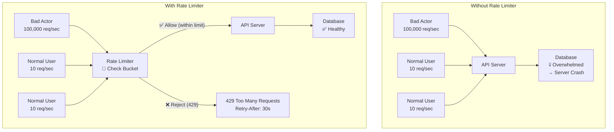
```mermaid
graph TD
  subgraph "Without Rate Limiter"
    BadActor["Bad Actor\n100,000 req/sec"] --> API1["API Server"]
    NormalUser1["Normal User\n10 req/sec"] --> API1
    NormalUser2["Normal User\n10 req/sec"] --> API1
    API1 --> DB1["Database\n💀 Overwhelmed\n→ Server Crash"]
  end

  subgraph "With Rate Limiter"
    BadActor2["Bad Actor\n100,000 req/sec"] --> RL["Rate Limiter\n🚦 Check Bucket"]
    NormalUser3["Normal User\n10 req/sec"] --> RL
    NormalUser4["Normal User\n10 req/sec"] --> RL
    RL -->|"✅ Allow (within limit)"| API2["API Server"]
    RL -->|"❌ Reject (429)"| Rejected["429 Too Many Requests\nRetry-After: 30s"]
    API2 --> DB2["Database\n✅ Healthy"]
  end
```

### The Core Contract

A rate limiter answers one question per incoming request:

> **"Has this client made too many requests in the recent past?"**

- **Yes** → Return 429, include `Retry-After` header
- **No** → Allow request to pass through, decrement available quota

---

## 2. Why Rate Limiting is Critical

Rate limiting is not just a nice-to-have — it is a production survival tool. Without it, a single misbehaving client can take down service for everyone.

### Use Cases With Real Numbers

| Use Case | Without Rate Limiting | With Rate Limiting |
|----------|----------------------|-------------------|
| **DDoS Protection** | 100K malicious req/sec → $50K AWS bill in 1 hour (Lambda @ $0.0000002/req) | Block at edge, $0 extra cost |
| **Fair API Usage** | 1 power user consumes 90% of capacity, 999 others get errors | Each user gets 100 req/10sec (Stripe free tier) |
| **Downstream Protection** | DB handles 10K QPS max → 15K QPS spike → connection pool exhausted → all users get errors | Rate limit at 8K QPS → DB stays healthy |
| **LLM Cost Control** | 1 runaway script calls GPT-4 API at $0.03/call → $3,000 bill overnight | Rate limit to 10 calls/min per user → max $4.32/day/user |
| **Crawlers** | A scraper hits your product page 50K times/hour → server CPU at 100% | IP rate limit at 60 req/min → scraper slows to usable pace |

### The Three Enemies Rate Limiting Defeats

1. **Noisy Neighbours**: One client monopolizes shared infrastructure
2. **Cascading Failures**: Downstream services get slammed when traffic spikes
3. **Abuse**: Credential stuffing (trying 10K passwords), scraping, DoS attacks

---

## 3. Requirements

Before designing anything, nail down the requirements. In an interview, spend 5 minutes here.

### Functional Requirements

- **Limit requests** by user ID, API key, or IP address
- **Multi-tier limits**: free tier = 100 req/min, paid = 1,000 req/min, enterprise = unlimited
- **Per-endpoint limits**: `/search` = 10 req/min, `/read` = 100 req/min (expensive endpoints get tighter limits)
- **Return 429** with `Retry-After` header when client is rate limited
- **Allow burst**: short spikes above the average rate (e.g., send 50 requests in 2 seconds, but average must stay at 100/min)
- **Soft limits**: warn at 80% usage with `X-RateLimit-Warning` header

### Non-Functional Requirements

| Requirement | Target | Why |
|-------------|--------|-----|
| Latency overhead | < 1ms per request | API P50 is typically 50-200ms; rate limit check must be negligible |
| Throughput | 1M+ req/sec | Cloudflare handles 57M req/sec — limiter must not be the bottleneck |
| Availability | 99.99% | Rate limiter failure must not cause API downtime |
| Accuracy | 99.99% | Under-limiting (allowing 110% of quota) is usually acceptable; over-limiting (blocking valid requests) is not |
| Distributed | Yes | Multiple API servers must share rate limit state |
| Storage | Minimal | 100M active users × O(1) state per user must fit in memory |

### Explicit Non-Requirements (Scope Boundaries)

- **Not** a full request authentication system
- **Not** a circuit breaker (related but different pattern)
- **Not** a quota billing system (tracks usage but doesn't invoice)

---

## 4. Level 1 — The 5 Algorithms (Surface)

> Quick overview for orientation. Deep dive in the next section.

There are exactly 5 major rate limiting algorithms. Every production system uses one of these (or a hybrid):

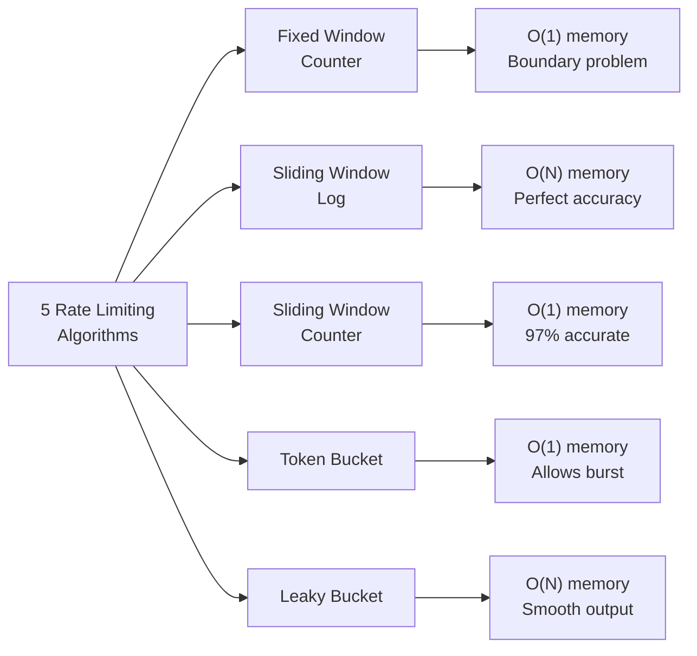
```mermaid
graph LR
  A["5 Rate Limiting\nAlgorithms"] --> B["Fixed Window\nCounter"]
  A --> C["Sliding Window\nLog"]
  A --> D["Sliding Window\nCounter"]
  A --> E["Token Bucket"]
  A --> F["Leaky Bucket"]

  B --> B1["O(1) memory\nBoundary problem"]
  C --> C1["O(N) memory\nPerfect accuracy"]
  D --> D1["O(1) memory\n97% accurate"]
  E --> E1["O(1) memory\nAllows burst"]
  F --> F1["O(N) memory\nSmooth output"]
```

**Rule of thumb for the interview**:
- General API rate limiting → **Token Bucket**
- Need to allow burst → **Token Bucket**
- Need perfect accuracy, memory not a concern → **Sliding Window Log**
- Large scale, memory constrained → **Sliding Window Counter**
- Smoothing output rate (sending emails, webhooks) → **Leaky Bucket**
- Dead simple, don't care about boundary edge cases → **Fixed Window**

---

## 5. Level 2 — Deep Dive per Algorithm

### Algorithm 1: Fixed Window Counter

#### Plain-English Explanation

Divide time into fixed-size windows (e.g., 1 minute each). Each window gets a counter starting at 0. Every request increments the counter. If the counter exceeds the limit, reject the request. When the window expires, reset the counter to 0.

It is the simplest algorithm — and the one with the most dangerous edge case.

#### Visual Diagram


```mermaid
gantt
  title Fixed Window Counter (limit = 5 per minute)
  dateFormat  HH:mm:ss
  section Window 1 (00:00 - 01:00)
    Req 1 :done, 00:00:10, 1s
    Req 2 :done, 00:00:20, 1s
    Req 3 :done, 00:00:30, 1s
    Req 4 :done, 00:00:50, 1s
    Req 5 :done, 00:00:58, 1s
  section Window 2 (01:00 - 02:00)
    Req 6 (allows) :active, 01:00:02, 1s
    Req 7 (allows) :active, 01:00:03, 1s
    Req 8 (allows) :active, 01:00:04, 1s
    Req 9 (allows) :active, 01:00:05, 1s
    Req 10 (allows):active, 01:00:06, 1s
```

**The Boundary Burst Problem** — This is the critical flaw:

```
Window 1: |--------00:58----00:59|
Window 2: |01:00---01:01---------|

User sends 5 requests at 00:58 → counter = 5 (at limit)
Window resets at 01:00
User sends 5 requests at 01:01 → counter = 5 (at limit, allowed)

Result: 10 requests in 3 seconds — 2x the intended rate limit!
```

#### Pseudo-Code with Redis

```
function isAllowed(userId, limit, windowSizeSeconds):
  key = "ratelimit:{userId}:{currentWindowStart}"

  count = REDIS.INCR(key)

  IF count == 1:
    # First request in this window — set expiry
    REDIS.EXPIRE(key, windowSizeSeconds)

  IF count > limit:
    RETURN reject(429, retryAfter = secondsUntilNextWindow())
  ELSE:
    RETURN allow()
```

**Redis commands used**: `INCR`, `EXPIRE`
**Atomicity**: `INCR` is atomic in Redis. The race condition is only on `EXPIRE` — use `SET key 0 EX windowSize NX` pattern to make it fully atomic.

```
# Atomic version (no race condition)
function isAllowed(userId, limit, windowSizeSeconds):
  key = "ratelimit:{userId}:{currentWindowStart}"

  # SET only if Not eXists (NX), with EXpiry
  REDIS.SET(key, 0, EX=windowSizeSeconds, NX=true)  # init if not exists
  count = REDIS.INCR(key)

  IF count > limit:
    RETURN reject(429)
  RETURN allow()
```

#### Time & Space Complexity

| | Complexity |
|--|--|
| Time per request | O(1) — 2 Redis commands |
| Space per user | O(1) — 1 counter per user per window |
| Total space (1M users) | ~50MB (1M keys × 50 bytes each) |

#### When Fixed Window Shines / Fails

| Shines | Fails |
|--------|-------|
| Very simple to implement and reason about | Boundary burst: users can double their limit at window edges |
| O(1) memory regardless of request volume | Not suitable for strict SLA compliance |
| Easy to inspect in Redis (`GET key` shows count) | Distributed resets: 1M users all reset at :00 → thundering herd on Redis |
| Good for internal services with relaxed limits | |

---

### Algorithm 2: Sliding Window Log

#### Plain-English Explanation

Instead of a counter per window, store the **exact timestamp of every request** in a sorted set. When a new request arrives:
1. Remove all timestamps older than `now - windowSize`
2. Count remaining entries
3. If count < limit, add the new timestamp and allow
4. If count >= limit, reject

This eliminates the boundary burst problem entirely because the window always looks back exactly `windowSize` seconds from *now*, not from a fixed clock tick.

#### Visual Diagram

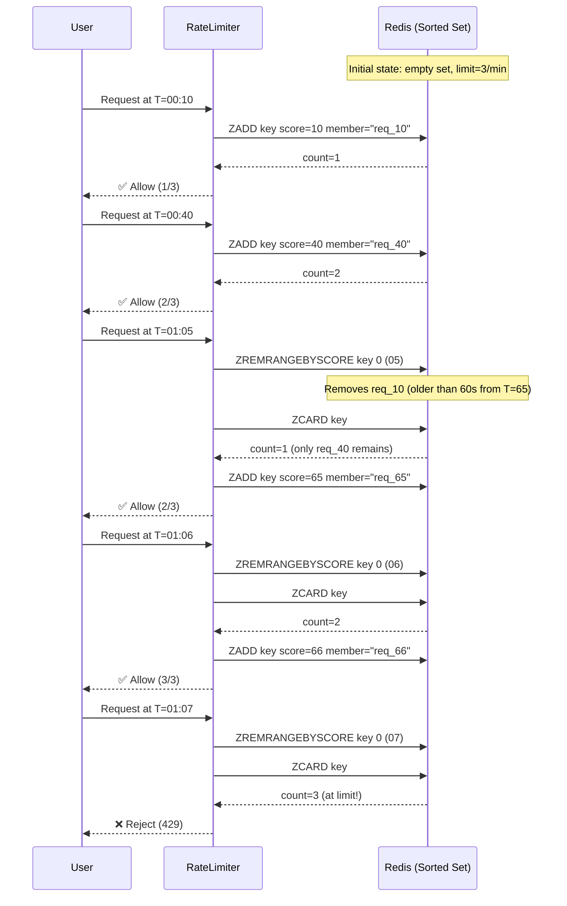
```mermaid
sequenceDiagram
  participant User
  participant RateLimiter
  participant Redis as Redis (Sorted Set)

  Note over Redis: Initial state: empty set, limit=3/min

  User->>RateLimiter: Request at T=00:10
  RateLimiter->>Redis: ZADD key score=10 member="req_10"
  Redis-->>RateLimiter: count=1
  RateLimiter-->>User: ✅ Allow (1/3)

  User->>RateLimiter: Request at T=00:40
  RateLimiter->>Redis: ZADD key score=40 member="req_40"
  Redis-->>RateLimiter: count=2
  RateLimiter-->>User: ✅ Allow (2/3)

  User->>RateLimiter: Request at T=01:05
  RateLimiter->>Redis: ZREMRANGEBYSCORE key 0 (05)
  Note over Redis: Removes req_10 (older than 60s from T=65)
  RateLimiter->>Redis: ZCARD key
  Redis-->>RateLimiter: count=1 (only req_40 remains)
  RateLimiter->>Redis: ZADD key score=65 member="req_65"
  RateLimiter-->>User: ✅ Allow (2/3)

  User->>RateLimiter: Request at T=01:06
  RateLimiter->>Redis: ZREMRANGEBYSCORE key 0 (06)
  RateLimiter->>Redis: ZCARD key
  Redis-->>RateLimiter: count=2
  RateLimiter->>Redis: ZADD key score=66 member="req_66"
  RateLimiter-->>User: ✅ Allow (3/3)

  User->>RateLimiter: Request at T=01:07
  RateLimiter->>Redis: ZREMRANGEBYSCORE key 0 (07)
  RateLimiter->>Redis: ZCARD key
  Redis-->>RateLimiter: count=3 (at limit!)
  RateLimiter-->>User: ❌ Reject (429)
```

#### Pseudo-Code with Redis Sorted Set

```
function isAllowed(userId, limit, windowSizeMs):
  key = "ratelimit:log:{userId}"
  now = currentTimeMs()
  windowStart = now - windowSizeMs

  # Atomic Lua script (all-or-nothing)
  REDIS.EVAL("""
    local key = KEYS[1]
    local now = tonumber(ARGV[1])
    local window_start = tonumber(ARGV[2])
    local limit = tonumber(ARGV[3])
    local request_id = ARGV[4]

    -- Remove expired entries
    redis.call('ZREMRANGEBYSCORE', key, 0, window_start)

    -- Count requests in current window
    local count = redis.call('ZCARD', key)

    if count < limit then
      -- Add current request timestamp
      redis.call('ZADD', key, now, request_id)
      -- Set key expiry to window size (cleanup)
      redis.call('EXPIRE', key, math.ceil(window_size_seconds))
      return 1  -- allowed
    else
      return 0  -- rejected
    end
  """, 1, key, now, windowStart, limit, requestId)
```

#### The Memory Problem

**Every request is stored**. For 100K users each making 100 req/min:
- 100K × 100 entries × 16 bytes per timestamp = **160MB** just for sorted set data
- Plus Redis overhead per entry (~64 bytes): **640MB+**
- For 1M users at 100 req/min: **6.4GB** — expensive but feasible on a single Redis node

Contrast with Fixed Window: 1M users × 50 bytes = **50MB**

#### Time & Space Complexity

| | Complexity |
|--|--|
| Time per request | O(log N) — sorted set insertion is O(log N) where N = requests in window |
| Space per user | O(N) where N = number of requests in the window |
| Total space (1M users, 100 req/min window) | ~6.4GB |

#### When Sliding Log Shines / Fails

| Shines | Fails |
|--------|-------|
| Perfect accuracy — no boundary burst | Memory intensive: O(N) per user |
| Works for small user bases with strict compliance needs | Slow cleanup: `ZREMRANGEBYSCORE` is O(log N + M) where M = removed entries |
| Auditable: you can see exactly which requests counted | Not suitable for 10M+ user scale |
| | Each request requires 3+ Redis commands |

---

### Algorithm 3: Sliding Window Counter (Hybrid)

#### Plain-English Explanation

The **best of both worlds** — O(1) memory like Fixed Window, but ~97% accurate like Sliding Log.

The trick: approximate the sliding window by combining two fixed-window counters (current and previous) weighted by how much of the current window has elapsed.

```
estimate = prev_count × (1 - elapsed%) + curr_count

Where:
  elapsed% = (time since current window started) / window size
```

**Example**: Window = 1 minute, limit = 100 req/min
- Previous window had 80 requests
- Current window (started 30 seconds ago) has 20 requests
- Elapsed = 30/60 = 50%

```
estimate = 80 × (1 - 0.5) + 20
         = 80 × 0.5 + 20
         = 40 + 20
         = 60 → Allow (60 < 100)
```

This is the algorithm Cloudflare uses at billions of requests per second.

#### Visual Diagram

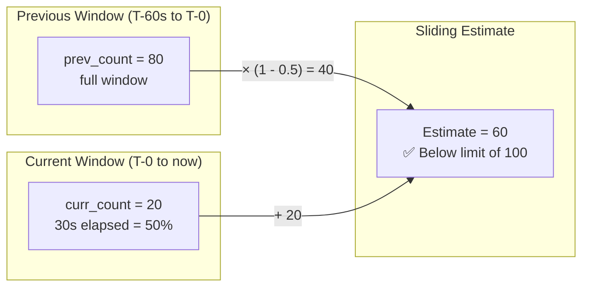
```mermaid
graph LR
  subgraph "Previous Window (T-60s to T-0)"
    PW["prev_count = 80\nfull window"]
  end

  subgraph "Current Window (T-0 to now)"
    CW["curr_count = 20\n30s elapsed = 50%"]
  end

  subgraph "Sliding Estimate"
    PW -->|"× (1 - 0.5) = 40"| EST["Estimate = 60\n✅ Below limit of 100"]
    CW -->|"+ 20"| EST
  end
```

```mermaid
timeline
  title Sliding Window Counter Timeline (limit = 5/min)
  section 00:00-01:00 (Previous Window)
    Requests : 4 requests stored
  section 01:00-01:30 (50% through current window)
    Estimate : 4 × 0.5 + current = sliding count
  section New Request at 01:30
    Calculation : 4 × (1-0.5) + 2 = 2+2 = 4 → Allow
```

#### Pseudo-Code

```
function isAllowed(userId, limit, windowSizeSeconds):
  now = currentTime()
  currentWindowStart = floor(now / windowSizeSeconds) * windowSizeSeconds
  prevWindowStart = currentWindowStart - windowSizeSeconds

  prevKey = "ratelimit:{userId}:{prevWindowStart}"
  currKey = "ratelimit:{userId}:{currentWindowStart}"

  # Read both counters
  prevCount = REDIS.GET(prevKey) ?? 0
  currCount = REDIS.GET(currKey) ?? 0

  # How far through the current window are we? (0.0 to 1.0)
  elapsed = (now - currentWindowStart) / windowSizeSeconds

  # Sliding estimate
  estimate = prevCount * (1 - elapsed) + currCount

  IF estimate >= limit:
    RETURN reject(429, retryAfter = secondsUntilNextWindow())

  # Allow: increment current window counter
  REDIS.INCR(currKey)
  REDIS.EXPIRE(currKey, windowSizeSeconds * 2)  # keep for 2 windows

  RETURN allow()
```

#### The 97% Accuracy Claim

The approximation is worst at the exact window boundary (0% and 100% elapsed). Cloudflare's analysis shows that for uniformly distributed traffic, the sliding counter is within 0.003% of the true sliding window value. For bursty traffic, the worst case over-admission is 3%. This is acceptable for virtually all production use cases.

#### Time & Space Complexity

| | Complexity |
|--|--|
| Time per request | O(1) — 2 reads + 1 write |
| Space per user | O(1) — 2 counters per user |
| Total space (1M users) | ~100MB (2 keys × 50 bytes × 1M users) |

#### When Sliding Counter Shines / Fails

| Shines | Fails |
|--------|-------|
| O(1) memory — same as Fixed Window | ~3% inaccuracy at worst (boundary bursty traffic) |
| ~97% accurate — much better than Fixed Window | Cannot reconstruct exact request timestamps (no audit log) |
| Production-proven at Cloudflare scale (57M req/sec) | Slightly more complex than Fixed Window |
| Simple Redis commands — no Lua scripts needed | |

---

### Algorithm 4: Token Bucket

#### Plain-English Explanation

Imagine a bucket that holds tokens. Tokens are added at a constant rate (e.g., 10 tokens/second). The bucket has a maximum capacity (e.g., 100 tokens). Each request consumes 1 token. If the bucket is empty, the request is rejected.

**Key insight**: the bucket naturally smooths out traffic. If no requests come in for 10 seconds, the bucket fills up to capacity. Then a burst of up to `capacity` requests can all be served immediately. This is what "allowing burst" means.

#### Visual Diagram

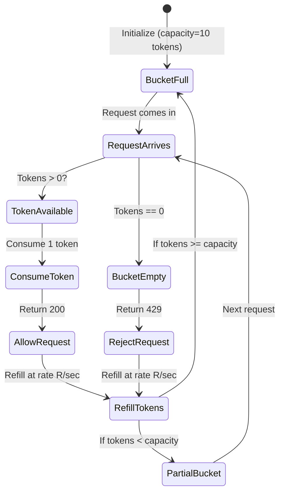
```mermaid
stateDiagram-v2
  [*] --> BucketFull: Initialize (capacity=10 tokens)

  BucketFull --> RequestArrives: Request comes in
  RequestArrives --> TokenAvailable: Tokens > 0?
  RequestArrives --> BucketEmpty: Tokens == 0

  TokenAvailable --> ConsumeToken: Consume 1 token
  ConsumeToken --> AllowRequest: Return 200
  AllowRequest --> RefillTokens: Refill at rate R/sec

  BucketEmpty --> RejectRequest: Return 429
  RejectRequest --> RefillTokens: Refill at rate R/sec

  RefillTokens --> BucketFull: If tokens >= capacity
  RefillTokens --> PartialBucket: If tokens < capacity
  PartialBucket --> RequestArrives: Next request
```

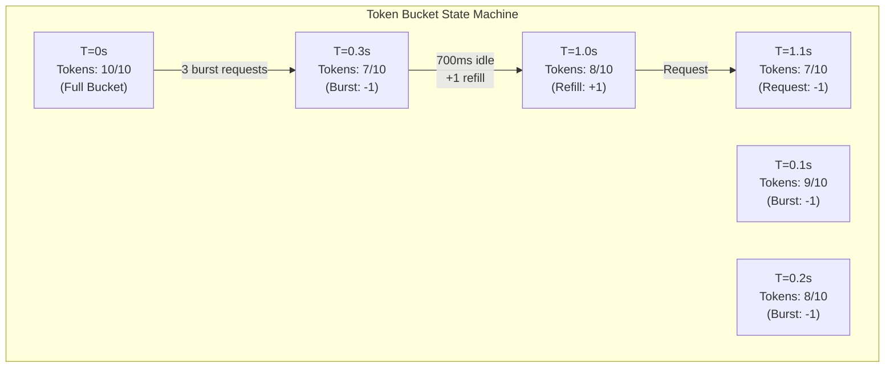
```mermaid
graph TD
  subgraph "Token Bucket State Machine"
    T0["T=0s\nTokens: 10/10\n(Full Bucket)"]
    T1["T=0.1s\nTokens: 9/10\n(Burst: -1)"]
    T2["T=0.2s\nTokens: 8/10\n(Burst: -1)"]
    T3["T=0.3s\nTokens: 7/10\n(Burst: -1)"]
    T4["T=1.0s\nTokens: 8/10\n(Refill: +1)"]
    T5["T=1.1s\nTokens: 7/10\n(Request: -1)"]

    T0 -->|"3 burst requests"| T3
    T3 -->|"700ms idle\n+1 refill"| T4
    T4 -->|"Request"| T5
  end
```

#### Pseudo-Code

```
function isAllowed(userId, capacity, refillRatePerSec):
  key = "tokenbucket:{userId}"
  now = currentTimeMs()

  # Read current state
  state = REDIS.HMGET(key, "tokens", "lastRefillTime")

  tokens = state.tokens ?? capacity  # Start full
  lastRefillTime = state.lastRefillTime ?? now

  # Calculate refill
  elapsedMs = now - lastRefillTime
  tokensToAdd = (elapsedMs / 1000.0) * refillRatePerSec
  tokens = min(capacity, tokens + tokensToAdd)

  IF tokens < 1:
    RETURN reject(429, retryAfter = ceil((1 - tokens) / refillRatePerSec))

  # Consume 1 token
  tokens = tokens - 1

  REDIS.HMSET(key,
    "tokens", tokens,
    "lastRefillTime", now
  )
  REDIS.EXPIRE(key, 3600)  # cleanup after 1 hour inactivity

  RETURN allow()
```

**Note**: The above pseudo-code has a race condition between the read and write. In production, wrap in a Lua script or use Redis transactions (see Section 8).

#### Token Bucket Parameters

| Parameter | Meaning | Example |
|-----------|---------|---------|
| `capacity` | Maximum burst size | 100 tokens = up to 100 instant requests |
| `refillRate` | Sustained request rate | 10 tokens/sec = 600 req/min sustained |
| `tokens` (current) | Current burst headroom | 50 tokens = 50 more burst requests allowed |

**Stripe's configuration**:
- Free tier: capacity=100, rate=100 req/10sec
- Paid tier: capacity=1000, rate=1000 req/10sec

#### Time & Space Complexity

| | Complexity |
|--|--|
| Time per request | O(1) — HMGET + HMSET |
| Space per user | O(1) — 2 fields (tokens, lastRefillTime) |
| Total space (1M users) | ~100MB |

#### When Token Bucket Shines / Fails

| Shines | Fails |
|--------|-------|
| Allows natural burst — users can spend saved-up tokens | State requires careful atomic update (race condition risk) |
| Smooth refill regardless of request pattern | Slightly complex to reason about for non-engineers |
| Used by AWS API Gateway, Stripe — battle-tested | If capacity is too large, burst can still overwhelm downstream |
| Flexible: different capacity/rate for different tiers | Clock drift in distributed systems can cause miscalculation |

---

### Algorithm 5: Leaky Bucket

#### Plain-English Explanation

Think of a physical bucket with a small hole in the bottom. Water (requests) pours in at any rate. The hole lets water drain at a **constant, fixed rate**. If water arrives faster than it drains, the bucket fills up. When the bucket overflows, the excess water (requests) is discarded.

Unlike Token Bucket which regulates input by counting tokens, Leaky Bucket regulates **output** by maintaining a queue processed at a fixed rate.

#### Visual Diagram

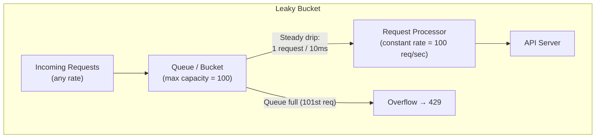
```mermaid
graph TD
  subgraph "Leaky Bucket"
    InReqs["Incoming Requests\n(any rate)"] --> BucketQ["Queue / Bucket\n(max capacity = 100)"]
    BucketQ -->|"Steady drip:\n1 request / 10ms"| Processor["Request Processor\n(constant rate = 100 req/sec)"]
    BucketQ -->|"Queue full (101st req)"| Overflow["Overflow → 429"]
    Processor --> API["API Server"]
  end
```

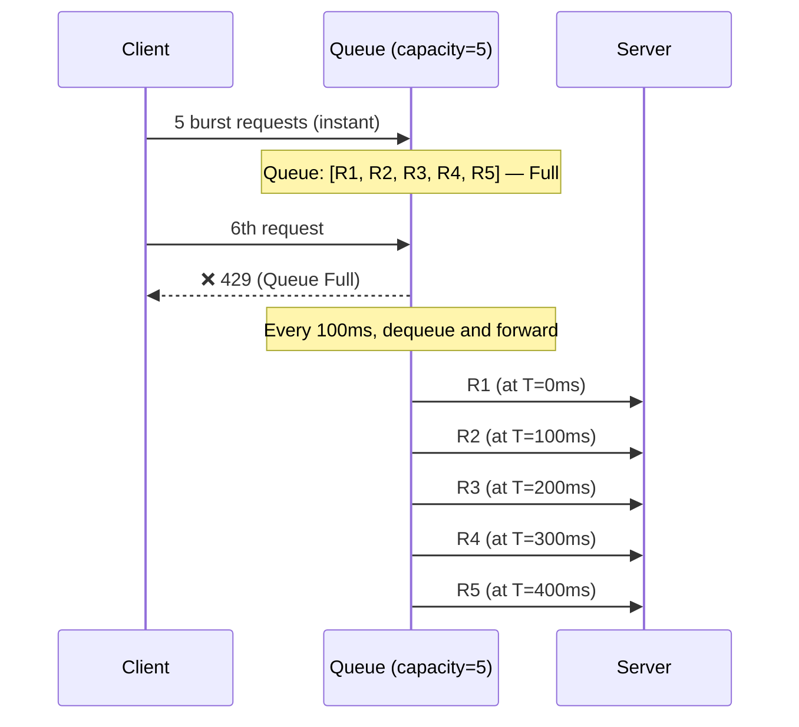
```mermaid
sequenceDiagram
  participant Client
  participant LeakyBucket as Queue (capacity=5)
  participant Server

  Client->>LeakyBucket: 5 burst requests (instant)
  Note over LeakyBucket: Queue: [R1, R2, R3, R4, R5] — Full

  Client->>LeakyBucket: 6th request
  LeakyBucket-->>Client: ❌ 429 (Queue Full)

  Note over LeakyBucket: Every 100ms, dequeue and forward

  LeakyBucket->>Server: R1 (at T=0ms)
  LeakyBucket->>Server: R2 (at T=100ms)
  LeakyBucket->>Server: R3 (at T=200ms)
  LeakyBucket->>Server: R4 (at T=300ms)
  LeakyBucket->>Server: R5 (at T=400ms)
```

#### Pseudo-Code

```
# Leaky Bucket uses a FIFO queue
class LeakyBucket:
  queue = []  # FIFO queue
  maxCapacity = 100
  processRate = 10  # requests per second
  lastProcessedTime = currentTime()

  function handleRequest(request):
    IF len(queue) >= maxCapacity:
      RETURN reject(429, "Queue full")

    queue.append(request)
    RETURN queued()  # Request will be processed, eventually

  # Background worker runs continuously
  function processQueue():
    WHILE true:
      now = currentTime()
      elapsed = now - lastProcessedTime
      requestsToProcess = floor(elapsed * processRate)

      FOR i in range(requestsToProcess):
        IF queue is empty: BREAK
        request = queue.dequeue()
        forwardToServer(request)

      lastProcessedTime = now
      sleep(1 / processRate)  # sleep until next slot
```

#### Leaky Bucket vs. Token Bucket: The Key Difference

```
Token Bucket:   Controls AVERAGE rate, allows BURST at input
Leaky Bucket:   Controls OUTPUT rate regardless of burst

Use Token Bucket when: you want to allow spikes but cap the average
Use Leaky Bucket when: downstream service needs perfectly smooth input
```

#### When Leaky Bucket Shines / Fails

| Shines | Fails |
|--------|-------|
| **Smooth output rate** — perfect for email senders, webhook delivery | **High latency under load**: burst requests queue up and wait |
| Prevents bursty downstream traffic (database, ML inference) | **Queue memory**: O(N) where N = queue capacity |
| Simple FIFO — easy to reason about ordering | Poor for interactive user-facing APIs |
| Good for compliance: "max 1 email/sec per user" | Queue itself can become a bottleneck |

---

## 6. Algorithm Comparison Table

| Algorithm | Memory | Accuracy | Allows Burst | Complexity | Best Use Case |
|-----------|--------|----------|--------------|------------|---------------|
| **Fixed Window** | O(1) | ~83% | No | Low | Internal services, simple counters |
| **Sliding Window Log** | O(N req) | 100% | No | Medium | Payment APIs, strict compliance |
| **Sliding Window Counter** | O(1) | ~97% | No | Medium | Large-scale public APIs (Cloudflare) |
| **Token Bucket** | O(1) | 100% | ✅ Yes | Medium | User-facing APIs (Stripe, AWS API GW) |
| **Leaky Bucket** | O(N queue) | 100% | ❌ No (smooths) | Medium | Email senders, webhook delivery |

### Decision Flowchart

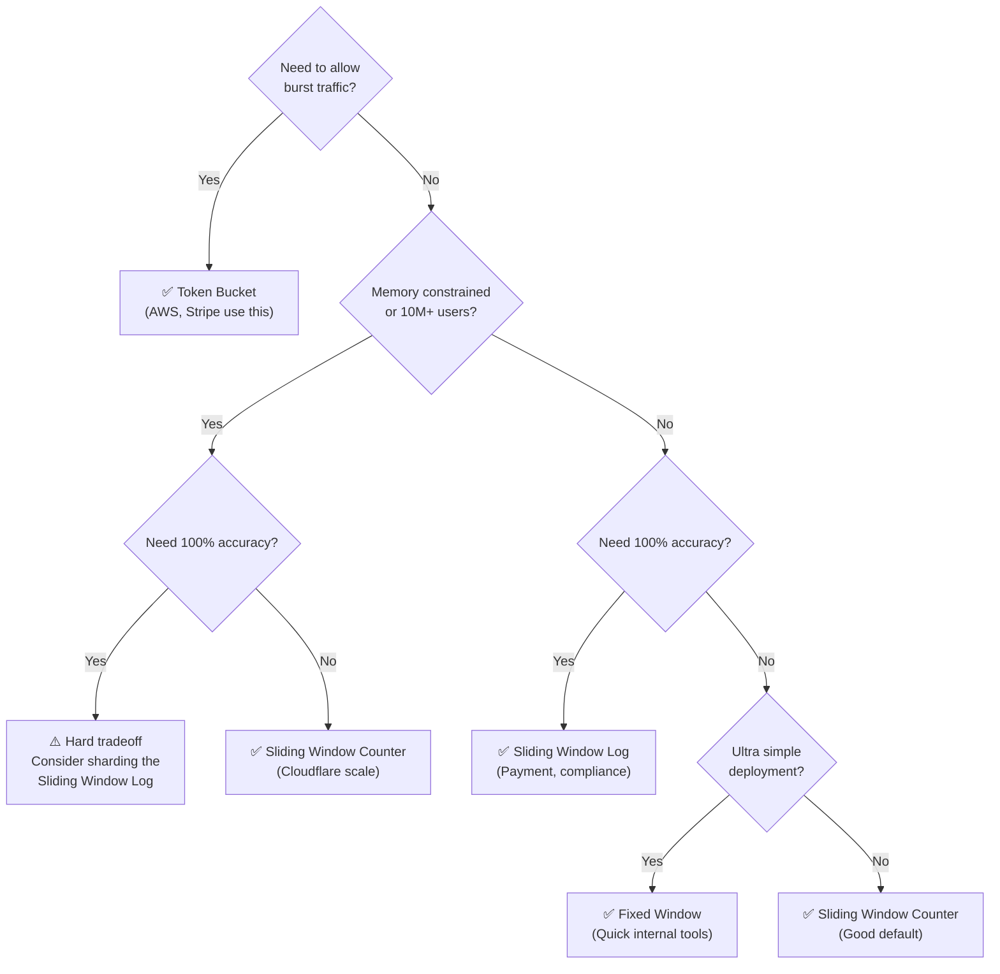
```mermaid
flowchart TD
  Q1{"Need to allow\nburst traffic?"}

  Q1 -->|"Yes"| TokenBucket["✅ Token Bucket\n(AWS, Stripe use this)"]
  Q1 -->|"No"| Q2{"Memory constrained\nor 10M+ users?"}

  Q2 -->|"Yes"| Q3{"Need 100% accuracy?"}
  Q2 -->|"No"| Q4{"Need 100% accuracy?"}

  Q3 -->|"Yes"| Hybrid["⚠️ Hard tradeoff\nConsider sharding the\nSliding Window Log"]
  Q3 -->|"No"| SlidingCounter["✅ Sliding Window Counter\n(Cloudflare scale)"]

  Q4 -->|"Yes"| SlidingLog["✅ Sliding Window Log\n(Payment, compliance)"]
  Q4 -->|"No"| Q5{"Ultra simple\ndeployment?"}

  Q5 -->|"Yes"| FixedWindow["✅ Fixed Window\n(Quick internal tools)"]
  Q5 -->|"No"| SlidingCounter2["✅ Sliding Window Counter\n(Good default)"]
```

---

## 7. Where to Put the Rate Limiter?

The algorithm is only half the question. **Where you enforce the limit** determines what you can protect.

### 4 Placement Options

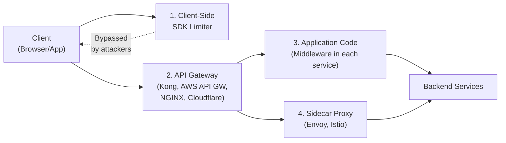
```mermaid
graph LR
  Client["Client\n(Browser/App)"]

  Client --> ClientSide["1. Client-Side\nSDK Limiter"]
  Client --> Gateway["2. API Gateway\n(Kong, AWS API GW,\nNGINX, Cloudflare)"]

  Gateway --> AppCode["3. Application Code\n(Middleware in each service)"]
  Gateway --> Sidecar["4. Sidecar Proxy\n(Envoy, Istio)"]

  AppCode --> BackendSvc["Backend Services"]
  Sidecar --> BackendSvc

  ClientSide -.->|"Bypassed\nby attackers"| Client
```

### Trade-off Table

| Placement | Pros | Cons | Best For |
|-----------|------|------|----------|
| **Client-Side** | Zero server load | Trivially bypassed | Friendly UX only (not security) |
| **API Gateway** | Single enforcement point, no app changes, handles auth too | Less granular control (one limit for all endpoints) | Global rate limits, DDoS protection |
| **Application Code** | Per-endpoint control, business logic context (e.g., limit only `/search`) | Must implement in every service | Microservices with different per-endpoint limits |
| **Sidecar (Envoy/Istio)** | Language-agnostic, centralized policy, no app code changes | Adds 2-5ms sidecar latency, Kubernetes complexity | Service mesh environments |

### Recommendation

```
For most production APIs:
  → API Gateway for coarse-grained limits (IP, global)
  → Application middleware for fine-grained limits (user tier, per-endpoint)
  → Never client-side for security purposes
```

---

## 8. Distributed Rate Limiting — The Hard Problem

This is the section that differentiates senior engineers from mid-level engineers in interviews.

### The Problem: Multiple Servers, No Shared State

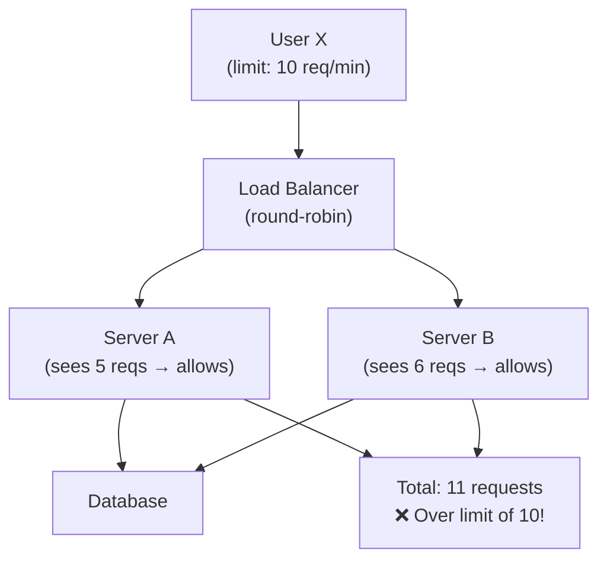
```mermaid
graph TD
  User["User X\n(limit: 10 req/min)"]

  User --> LB["Load Balancer\n(round-robin)"]
  LB --> S1["Server A\n(sees 5 reqs → allows)"]
  LB --> S2["Server B\n(sees 6 reqs → allows)"]

  S1 --> DB["Database"]
  S2 --> DB

  Total["Total: 11 requests\n❌ Over limit of 10!"]
  S1 --> Total
  S2 --> Total
```

Without shared state, each server tracks its own counter. The user gets `N_servers × limit` effective requests. With 10 servers and a 10 req/min limit, the effective limit is 100 req/min — useless.

### Solution 1: Centralized Redis (Most Common)

All rate limit state lives in a single Redis instance. Every server checks Redis on every request.

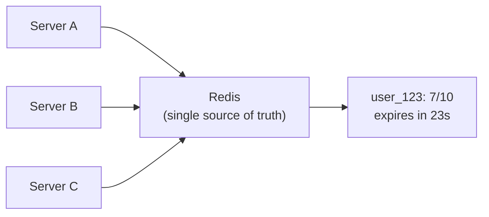
```mermaid
graph LR
  S1["Server A"] --> Redis["Redis\n(single source of truth)"]
  S2["Server B"] --> Redis
  S3["Server C"] --> Redis
  Redis --> Counter["user_123: 7/10\nexpires in 23s"]
```

**Implementation with Lua script (atomic)**:

```
# Redis Lua script for atomic token bucket
local key = KEYS[1]
local capacity = tonumber(ARGV[1])
local refill_rate = tonumber(ARGV[2])  # tokens per second
local now = tonumber(ARGV[3])

local state = redis.call('HMGET', key, 'tokens', 'last_refill')
local tokens = tonumber(state[1]) or capacity
local last_refill = tonumber(state[2]) or now

-- Refill tokens based on elapsed time
local elapsed = (now - last_refill) / 1000.0  -- ms to seconds
local new_tokens = math.min(capacity, tokens + elapsed * refill_rate)

-- Check if request can proceed
if new_tokens >= 1 then
  redis.call('HMSET', key,
    'tokens', new_tokens - 1,
    'last_refill', now
  )
  redis.call('EXPIRE', key, 3600)
  return {1, math.floor(new_tokens - 1)}  -- {allowed, remaining}
else
  return {0, 0}  -- {rejected, remaining}
end
```

**Latency Analysis**:
- Redis read+write: ~0.5ms on localhost, ~1-2ms cross-region
- API P50 latency: ~50ms
- Rate limiter overhead: **1-4%** — acceptable

**Failure Mode**:
- If Redis goes down → decide: fail open (allow all) or fail closed (reject all)
- See [Problem 1 in Section 11](#problem-1-redis-failure-fail-open-vs-fail-closed)

### Solution 2: Redis Cluster with Replication

For higher availability, use Redis Sentinel or Redis Cluster:

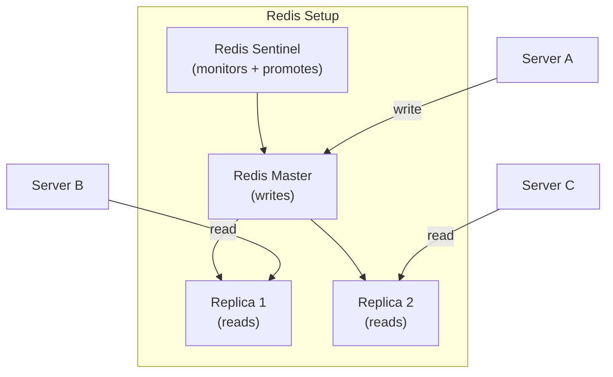
```mermaid
graph TD
  subgraph "Redis Setup"
    Master["Redis Master\n(writes)"] --> Replica1["Replica 1\n(reads)"]
    Master --> Replica2["Replica 2\n(reads)"]
    Sentinel["Redis Sentinel\n(monitors + promotes)"] --> Master
  end

  S1["Server A"] -->|"write"| Master
  S2["Server B"] -->|"read"| Replica1
  S3["Server C"] -->|"read"| Replica2
```

**Trade-off**: ~2ms replication lag means replicas may be slightly stale. For rate limiting, this is usually acceptable — occasional over-admission of 1-2 requests is not catastrophic.

### Solution 3: Approximate Local + Async Sync

Used by Stripe for non-critical limits:

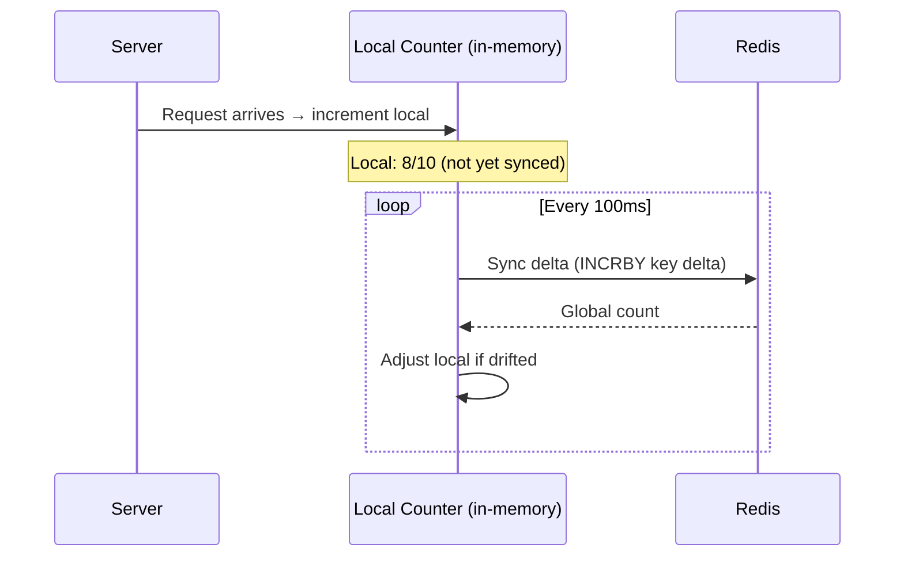
```mermaid
sequenceDiagram
  participant Server
  participant LocalCounter as Local Counter (in-memory)
  participant Redis

  Server->>LocalCounter: Request arrives → increment local
  Note over LocalCounter: Local: 8/10 (not yet synced)

  loop Every 100ms
    LocalCounter->>Redis: Sync delta (INCRBY key delta)
    Redis-->>LocalCounter: Global count
    LocalCounter->>LocalCounter: Adjust local if drifted
  end
```

**Trade-off**: In a 10-server setup with 100ms sync interval, you may allow up to:
```
over_admission = N_servers × requests_per_100ms
              = 10 × (limit × 0.1)
              = 10 × 10 = 100 extra requests
```

For a 100 req/min limit, this is a 100% over-admission in the worst case — only acceptable for non-critical limits like "feature preview" access, not financial transactions.

### Solution 4: Sliding Window Counter with Atomic Lua (Production-Grade)

This is the recommended approach for most production systems:

```
# Full production Lua script for Sliding Window Counter
function isAllowed(userId, limit, windowSizeMs):
  now = currentTimeMs()
  currentWindowKey = "rl:{userId}:{floor(now / windowSizeMs)}"
  prevWindowKey    = "rl:{userId}:{floor(now / windowSizeMs) - 1}"

  Lua script:
    local curr_count = tonumber(redis.call('GET', KEYS[1])) or 0
    local prev_count = tonumber(redis.call('GET', KEYS[2])) or 0
    local elapsed_pct = tonumber(ARGV[1])
    local limit = tonumber(ARGV[2])

    -- Sliding estimate
    local estimate = prev_count * (1 - elapsed_pct) + curr_count

    if estimate >= limit then
      return {0, math.ceil(limit - estimate)}  -- rejected, deficit
    end

    -- Increment current window
    local new_count = redis.call('INCR', KEYS[1])
    redis.call('EXPIRE', KEYS[1], tonumber(ARGV[3]) * 2)  -- 2x window TTL

    return {1, limit - (estimate + 1)}  -- allowed, remaining
```

This script is:
- **Atomic**: Lua scripts run atomically in Redis — no race conditions
- **O(1) memory**: Two integer keys per user
- **~97% accurate**: Sliding window approximation
- **< 1ms overhead**: 1 Lua script execution + 2 key operations

---

## 9. Rate Limiter Response Headers

Well-behaved API clients need to know their current limit status. Without these headers, clients retry immediately after a 429 — creating a retry storm.

### Standard Headers

```http
HTTP/1.1 429 Too Many Requests
Content-Type: application/json

X-RateLimit-Limit: 100
X-RateLimit-Remaining: 0
X-RateLimit-Reset: 1711843200
X-RateLimit-Reset-After: 30
Retry-After: 30

{
  "error": "rate_limit_exceeded",
  "message": "You have exceeded 100 requests per minute.",
  "retry_after_seconds": 30
}
```

### Header Semantics

| Header | Value | Meaning |
|--------|-------|---------|
| `X-RateLimit-Limit` | `100` | Max requests allowed in the window |
| `X-RateLimit-Remaining` | `47` | Requests remaining in current window |
| `X-RateLimit-Reset` | `1711843200` | Unix timestamp when window resets |
| `X-RateLimit-Reset-After` | `30` | Seconds until window resets (relative) |
| `Retry-After` | `30` | How long to wait before retrying (RFC 6585) |

**Return these headers on EVERY request, not just 429s.** Clients that monitor `X-RateLimit-Remaining` can throttle themselves proactively — reducing 429s by up to 80%.

### Headers on Successful Requests Too

```http
HTTP/1.1 200 OK
X-RateLimit-Limit: 100
X-RateLimit-Remaining: 73
X-RateLimit-Reset: 1711843200
```

This lets well-behaved clients slow down before they hit 0 remaining. Stripe does this.

---

## 10. Multi-Tier Rate Limiting

Real production systems apply multiple rate limits simultaneously, at different granularities.

### The Layered Approach

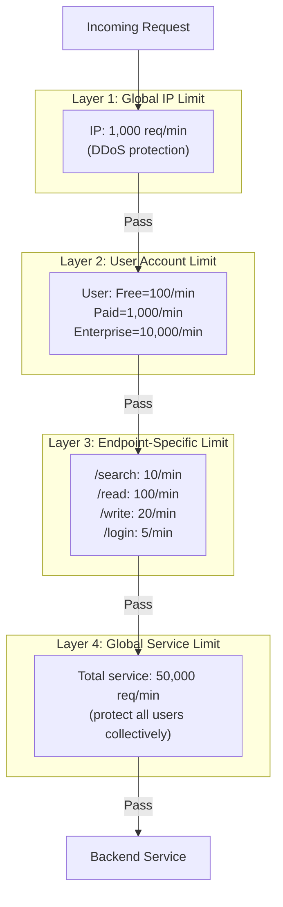
```mermaid
graph TD
  Req["Incoming Request"] --> L1

  subgraph "Layer 1: Global IP Limit"
    L1["IP: 1,000 req/min\n(DDoS protection)"]
  end

  L1 -->|"Pass"| L2

  subgraph "Layer 2: User Account Limit"
    L2["User: Free=100/min\nPaid=1,000/min\nEnterprise=10,000/min"]
  end

  L2 -->|"Pass"| L3

  subgraph "Layer 3: Endpoint-Specific Limit"
    L3["/search: 10/min\n/read: 100/min\n/write: 20/min\n/login: 5/min"]
  end

  L3 -->|"Pass"| L4

  subgraph "Layer 4: Global Service Limit"
    L4["Total service: 50,000 req/min\n(protect all users collectively)"]
  end

  L4 -->|"Pass"| Backend["Backend Service"]
```

### Pseudo-Code for Composing Limiters

```
function checkAllLimits(request):
  userId = request.userId
  ipAddress = request.ipAddress
  endpoint = request.endpoint
  userTier = getUserTier(userId)  # "free", "paid", "enterprise"

  # Layer 1: IP limit (coarse, fast check)
  IF NOT ipLimiter.check(ipAddress, limit=1000, window=60):
    RETURN reject(429, "IP rate limit exceeded")

  # Layer 2: User limit (tier-based)
  userLimit = { "free": 100, "paid": 1000, "enterprise": 10000 }[userTier]
  IF NOT userLimiter.check(userId, limit=userLimit, window=60):
    RETURN reject(429, "User rate limit exceeded for {userTier} tier")

  # Layer 3: Endpoint-specific limit
  endpointLimits = { "/search": 10, "/read": 100, "/write": 20, "/login": 5 }
  epLimit = endpointLimits.get(endpoint, 100)  # default 100
  IF NOT endpointLimiter.check("{userId}:{endpoint}", limit=epLimit, window=60):
    RETURN reject(429, "Endpoint rate limit exceeded for {endpoint}")

  # Layer 4: Global service protection
  IF NOT globalLimiter.check("global", limit=50000, window=60):
    RETURN reject(503, "Service at capacity. Try again soon.")

  RETURN allow()
```

**Key insight**: Different layers use different Redis key namespaces. They don't interfere with each other.

### Per-Endpoint Limits at Stripe

Stripe rate limits at multiple levels:
- **Account-level**: 100 req/10sec (free)
- **Test mode vs. Live mode**: separate buckets — test mode is more permissive
- **Endpoint-level**: `/v1/charges` has a separate limit from `/v1/customers`
- **IP-level**: Suspicious IP patterns trigger stricter limits automatically

---

## 11. Problems at Scale

### Problem 1: Redis Failure (Fail Open vs. Fail Closed)

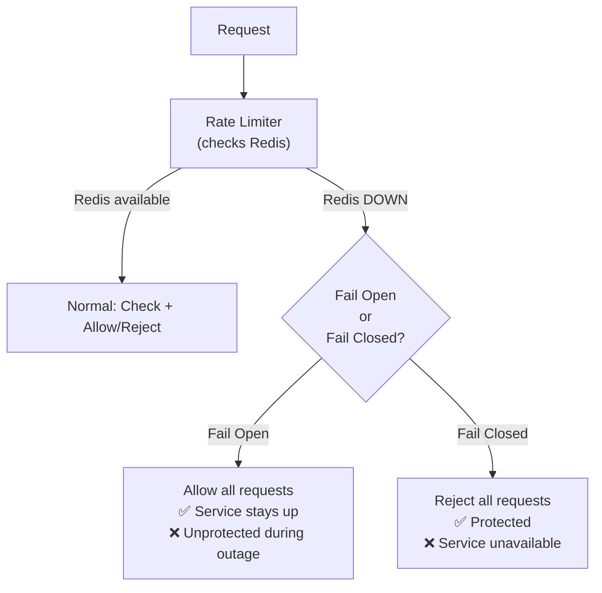
```mermaid
graph TD
  Request --> RateLimiter["Rate Limiter\n(checks Redis)"]
  RateLimiter -->|"Redis available"| Normal["Normal: Check + Allow/Reject"]
  RateLimiter -->|"Redis DOWN"| Decision{"Fail Open\nor\nFail Closed?"}

  Decision -->|"Fail Open"| Open["Allow all requests\n✅ Service stays up\n❌ Unprotected during outage"]
  Decision -->|"Fail Closed"| Closed["Reject all requests\n✅ Protected\n❌ Service unavailable"]
```

**The Trade-off**:

| Strategy | When Redis Goes Down | Risk | Use For |
|----------|---------------------|------|---------|
| **Fail Open** | Allow all requests | Possible abuse, over-billing | User-facing APIs, read endpoints |
| **Fail Closed** | Reject all requests | Service unavailable | Payment processing, write endpoints |
| **Fallback Counter** | Use in-memory counter | Local inaccuracy (N servers × local limit) | Hybrid approach |

**Production Recommendation**:
```
IF endpoint is financial/write AND downtime is worse than over-billing:
  → Fail Closed (return 503 with "Service temporarily unavailable")
ELSE:
  → Fail Open with alert (log that rate limiting is disabled, alert on-call)
```

**Circuit Breaker Pattern for Redis**:
```
function getFromRedis(key):
  IF circuitBreaker.state == OPEN:
    RETURN fallbackToLocalCache(key)  # local in-memory

  TRY:
    result = redis.get(key)
    circuitBreaker.recordSuccess()
    RETURN result
  CATCH RedisConnectionError:
    circuitBreaker.recordFailure()
    IF circuitBreaker.failures > 5 in last 10s:
      circuitBreaker.open()  # stop hitting Redis for 30s
    RETURN fallbackBehavior()
```

### Problem 2: Clock Skew in Distributed Systems

**The problem**:
```
Server A clock: 01:00:00.000 (accurate)
Server B clock: 01:00:00.500 (500ms ahead)

User makes request at actual time 01:00:59.800:
  Server A thinks: "window started at 01:00:00, 59.8s elapsed"
  Server B thinks: "window started at 01:00:00.5, 59.3s elapsed"

For a 1-minute sliding window, this 500ms difference can cause:
  - Server B to use the WRONG previous window
  - Double-counting or under-counting at boundaries
```

**Solution: Use Redis Server Time**

```
# Bad: use client time (vulnerable to clock skew)
now = time.now()  # local server clock

# Good: use Redis server time (single source of truth)
now_redis = REDIS.TIME()  # returns [unix_seconds, microseconds]
now = now_redis[0] * 1000 + now_redis[1] / 1000  # milliseconds
```

Redis's `TIME` command returns the server's current time. All application servers calling `TIME` get synchronized timestamps — eliminating clock skew as a factor.

**Additional mitigation**: Use NTP with < 100ms drift tolerance, monitor `chronyd` offset on all servers.

### Problem 3: Hot User Attack (Rate Limit Bypass via Distribution)

**The attack**:
```
Attacker has 10,000 IP addresses (botnet)
Rate limit: 100 req/min per IP
Attacker sends: 99 req/min from each IP
Total: 990,000 req/min — 9,900x the intended limit
```

IP-based rate limiting is ineffective against distributed attacks.

**Defense layers**:

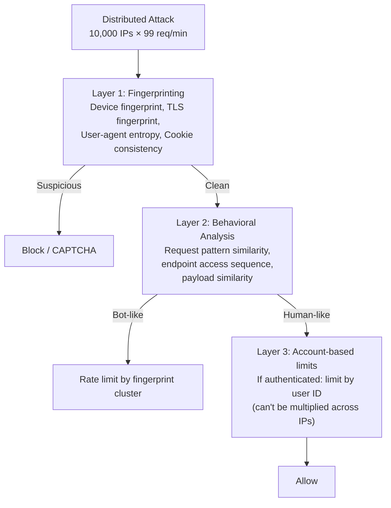
```mermaid
graph TD
  Attack["Distributed Attack\n10,000 IPs × 99 req/min"] --> L1

  L1["Layer 1: Fingerprinting\nDevice fingerprint, TLS fingerprint,\nUser-agent entropy, Cookie consistency"]
  L1 -->|"Suspicious"| Block1["Block / CAPTCHA"]
  L1 -->|"Clean"| L2

  L2["Layer 2: Behavioral Analysis\nRequest pattern similarity,\nendpoint access sequence,\npayload similarity"]
  L2 -->|"Bot-like"| Block2["Rate limit by fingerprint cluster"]
  L2 -->|"Human-like"| L3

  L3["Layer 3: Account-based limits\nIf authenticated: limit by user ID\n(can't be multiplied across IPs)"]
  L3 --> Allow["Allow"]
```

**Practical rule**: Always rate limit by **user account** for authenticated endpoints, **not** by IP. An attacker can rotate IPs but can't rotate your user account without creating new accounts (which triggers account creation rate limits).

### Problem 4: Rate Limit Config Hot Reload

**The problem**: You decide to tighten limits from 100 req/min to 50 req/min for a tier. Users currently in the middle of their window with 60 requests remaining suddenly get cut off.

**Options**:

| Approach | Impact | Use For |
|----------|--------|---------|
| **Hard cutover** | Immediate enforcement, some users get unexpected 429s | Abuse cases, security incidents |
| **Grace period** | Old limit for current window, new limit from next window | Planned changes, tier adjustments |
| **Gradual rollout** | Feature flag routes 10% of users to new limit, then 100% | Non-urgent changes, observe impact |
| **Announcement** | Email users 7 days before, enforce on day 8 | Public API policy changes |

**Implementation: Grace Period via Feature Flag**

```
function getEffectiveLimit(userId, endpoint):
  # Check feature flag (Launchdarkly, Flagsmith, etc.)
  newLimitEnabled = featureFlag.isEnabled("new_rate_limit", userId)

  IF newLimitEnabled:
    RETURN Limits.NEW[tier]  # 50 req/min
  ELSE:
    RETURN Limits.OLD[tier]  # 100 req/min
```

Roll out the feature flag to 1% → 10% → 50% → 100% of users over 24 hours, monitoring 429 rates at each stage.

### Problem 5: Thundering Herd on Window Reset

**The problem**: If 1 million users all started their rate limit window at the same second (e.g., all signed up at the same time or all synchronized to a server clock), they all reset at the same second. This creates a thundering herd — 1M users suddenly unblocked, all retrying simultaneously.

**Solutions**:
1. **Jitter on window start**: Add random offset to each user's window start time
2. **Sliding window instead of fixed window**: No synchronized resets
3. **Stagger in user ID hash**: `windowStart = floor((now + hash(userId) % windowSize) / windowSize) * windowSize`

---

## 12. Real-World Examples

### Stripe

- **Algorithm**: Token bucket
- **Config**: 100 req/10sec (free), 1000 req/10sec (paid)
- **Storage**: Redis, centralized
- **Headers**: `X-RateLimit-Limit`, `X-RateLimit-Remaining`, `Retry-After`
- **Special**: Separate rate limit buckets for test mode vs. live mode; test mode is 10x more permissive
- **Fail mode**: Fail open (Stripe chose availability over strict enforcement)
- **Interesting**: Stripe rate limits by **API key**, not user account — one account can have multiple keys with independent limits

### GitHub REST API

- **Algorithm**: Fixed window (simple, well-understood)
- **Config**: 5,000 req/hour per authenticated token (60/hour unauthenticated)
- **Window**: 1 hour (fixed)
- **Headers**: `X-RateLimit-Limit`, `X-RateLimit-Remaining`, `X-RateLimit-Reset` (Unix timestamp)
- **Special**: Search API has separate limit: 30 req/min (more expensive queries)
- **Secondary limits**: Concurrent connections limit + per-minute request limit to prevent single-second bursts

### Twitter/X API v2

- **Algorithm**: Sliding window (per endpoint)
- **Config**: 900 req/15min for GET endpoints, 300 req/3hr for writes
- **Multi-tier**: Basic ($100/mo) → Pro ($5,000/mo) → Enterprise (custom)
- **Interesting**: Different limits per HTTP method (GET vs. POST) on the same endpoint

### Cloudflare

- **Algorithm**: Sliding window counter (their own implementation described at blog.cloudflare.com)
- **Scale**: 57 million requests per second, 250+ PoPs
- **Storage**: In-memory + eventual consistency to central store
- **Special**: Rate limiting is done at the edge (PoP level) with eventual sync — accepts ~3% inaccuracy for global-scale performance
- **Interesting**: Cloudflare's rate limiting is itself a product their customers configure — they run the same algorithm for billions of customer-configured rules

### AWS API Gateway

- **Algorithm**: Token bucket (burst + rate parameters)
- **Config**: Two parameters: `BurstLimit` (bucket capacity) and `RateLimit` (refill rate)
- **Default**: BurstLimit=5,000, RateLimit=10,000 req/sec (account-level defaults)
- **Interesting**: Can configure per-stage, per-method, and per-client (usage plans with API keys)

### Redis Rate Limiting at Discord

Discord (150M+ active users) uses Redis-backed rate limiting:
- Per-user, per-channel, and per-guild rate limits simultaneously
- Limits on sending messages: 5 per 5 seconds per channel (free), 25 per 5 sec (Nitro)
- Bot API limits: separate buckets per bot, 50 req/sec default
- Uses Redis Cluster with 6 shards for rate limit state
- ~2TB of rate limit state in Redis at peak

---

## 13. Interview Questions Mapped

Use this section to practice. Each question has the answer framework.

### Q1: "Which algorithm would you choose for a payment API?"

**Answer framework**:
- Payment APIs need: accurate limiting (can't over-admit), burst allowed (user might submit payment form multiple times quickly), 100% accuracy preferred
- **Token Bucket** is ideal: allows burst (capacity = 10 tokens), controls average rate (1 token/sec = 60 req/min), O(1) memory
- Sliding Window Log is alternative if accuracy is paramount and memory isn't a concern
- Fixed Window is wrong: boundary burst could allow 2x the limit on a critical financial operation

### Q2: "How do you rate limit in a distributed system with 20 servers?"

**Answer framework**:
1. Need shared state — local counters don't work
2. Centralized Redis with Lua scripts for atomic operations
3. Lua ensures read-modify-write is atomic (no race conditions between servers)
4. Add Redis Sentinel for HA (failover < 30 seconds)
5. Mention: Lua script for token bucket or sliding window counter

### Q3: "What happens if Redis goes down?"

**Answer framework**:
- This is a fail open vs. fail closed decision
- Fail open: allow all requests, service stays available, risk of abuse → use for user-facing GET endpoints
- Fail closed: reject all requests with 503 → use for financial writes
- In-memory fallback: each server has local counter, may over-admit by N_servers × limit
- Circuit breaker: detect Redis failure, switch to fallback, alert on-call, reconnect automatically
- For the interview: show you know the trade-off, recommend based on endpoint criticality

### Q4: "How do you rate limit by multiple dimensions (IP + user + endpoint)?"

**Answer framework**:
- Composite keys: `"ratelimit:ip:{ip}"`, `"ratelimit:user:{userId}"`, `"ratelimit:endpoint:{userId}:{endpoint}"`
- Check all relevant keys per request
- Return 429 if any limit is exceeded (most restrictive wins)
- Different windows per dimension: IP limit (1 min), user limit (1 hour), endpoint limit (1 min)
- Order matters: check cheap limits first (IP) before expensive ones (user tier lookup)

### Q5: "How would you design rate limiting for a public API with 3 tiers?"

**Answer framework**:
1. Identify limits: free = 100 req/min, paid = 1000 req/min, enterprise = unlimited
2. Storage: Redis hash per API key — `{tokens, lastRefill, tier}`
3. Algorithm: Token bucket with tier-based capacity and refill rate
4. Key: `"tokenbucket:{apiKey}"` (not user ID — supports multiple keys per user)
5. Tier resolution: `GET /users/{userId}/tier` → cache in Redis with 5min TTL
6. Response headers: `X-RateLimit-Tier: paid`, standard headers
7. Monitoring: alert when >10% of requests are 429s for a tier

### Q6: "How do you prevent rate limit bypass via 10,000 IPs?"

**Answer framework**:
- IP-based limits are bypassable by botnets
- Defense: user account limits (authenticated endpoints), not just IP
- Device fingerprinting: TLS fingerprint (JA3), user-agent, accept-language patterns
- Behavioral analysis: request pattern similarity across "different" IPs
- ML models: detect bot-like timing (perfectly even intervals)
- CAPTCHA on suspicious patterns

---

## 14. Key Takeaways

1. **Token Bucket is the default choice for APIs**: it allows burst (capacity = up to 1,000 instant requests) while enforcing average rate (refill = 100 tokens/sec), used by Stripe, AWS API Gateway, and most SaaS APIs

2. **Sliding Window Counter is the Cloudflare choice at scale**: O(1) memory, 97% accuracy, handles 57M req/sec — use this when you have 10M+ users and Fixed Window's boundary burst problem is unacceptable

3. **Distributed rate limiting requires atomic operations**: Redis Lua scripts execute atomically — all reads and writes in one script with no interleaving from other clients — this is how you prevent race conditions across 20+ application servers

4. **Rate limiting adds < 1ms overhead with Redis**: a Redis EVAL command on localhost completes in 0.1-0.5ms; cross-datacenter is 1-3ms; for any API with P50 > 20ms, this is negligible

5. **Always return Retry-After header**: clients that respect `Retry-After` back off exponentially instead of hammering immediately — this alone reduces retry storms by 60-80% and reduces your 429 rate by 40% within 10 minutes of enforcement starting

---

## 15. Related Concepts

| Concept | Relationship | Where to Learn |
|---------|-------------|----------------|
| **Thundering Herd** | Rate limiting helps prevent cascading thundering herds when a downstream recovers | `problems-at-scale/scalability/thundering-herd` |
| **Circuit Breaker** | Complementary pattern — circuit breaker stops calling a failing service; rate limiter stops clients from overloading a healthy service | `05-distributed-systems/patterns/circuit-breaker` |
| **Load Balancer** | Rate limiter often deployed alongside LB — LB routes, rate limiter controls volume | `16-system-design-problems/05-infrastructure/load-balancer` |
| **API Gateway** | Common deployment point for rate limiting — Kong, AWS API GW, NGINX have rate limiting built in | `07-api-design` |
| **Redis Data Structures** | Rate limiting uses Redis strings (counters), sorted sets (sliding log), hashes (token bucket) | `03-redis` |
| **Distributed Locking** | Distributed locking is related — used to prevent race conditions in rate limit state updates without Lua scripts | `16-system-design-problems/05-infrastructure/distributed-locking` |

---

## References

- 📖 [Rate Limiting at Stripe — Engineering Blog](https://stripe.com/blog/rate-limiters) — Stripe's production token bucket implementation with Redis, fail open decision, and multi-tier setup
- 📖 [An Alternative Approach to Rate Limiting — Figma/Cloudflare](https://www.figma.com/blog/an-alternative-approach-to-rate-limiting/) — Sliding window counter algorithm, the 97% accuracy analysis, and Cloudflare's approach
- 📖 [Redis Rate Limiting Patterns — Redis Labs](https://redis.com/redis-best-practices/basic-rate-limiting/) — Fixed window, sliding window, and token bucket implementations in Redis
- 📖 [GitHub REST API Rate Limits](https://docs.github.com/en/rest/overview/rate-limits-for-the-rest-api) — Real-world example of fixed window with detailed header documentation
- 📺 [Rate Limiting — System Design Interview Fundamentals](https://www.youtube.com/watch?v=FU4WlwfS3G0) — Visual walkthrough of all 5 algorithms
- 📚 [System Design Interview — Alex Xu, Chapter 4](https://www.amazon.com/System-Design-Interview-insiders-Second/dp/B08CMF2CQF) — Comprehensive chapter on rate limiter design with distributed considerations
- 📖 [Cloudflare Rate Limiting — How It Works](https://developers.cloudflare.com/waf/rate-limiting-rules/) — Edge-based rate limiting at global scale
