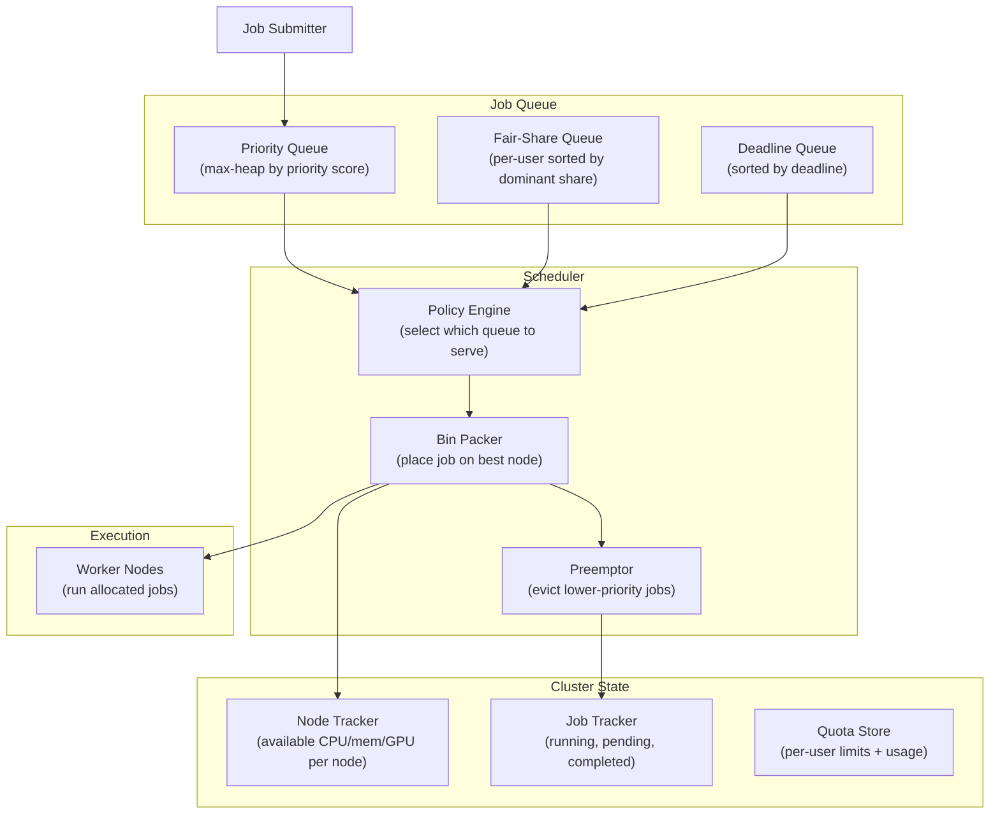
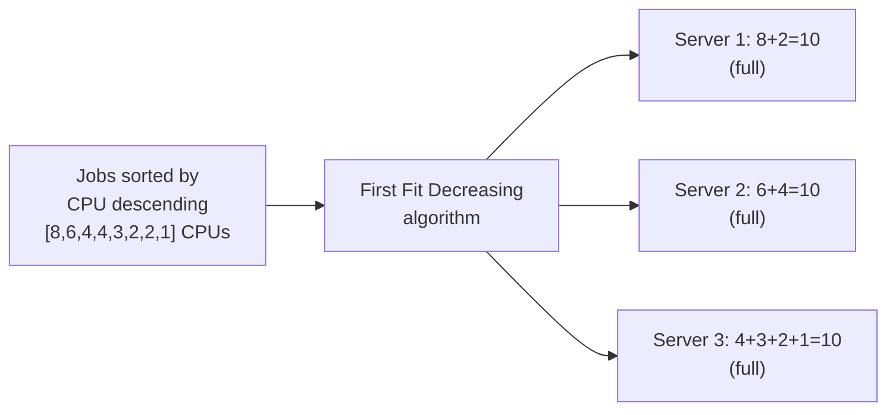
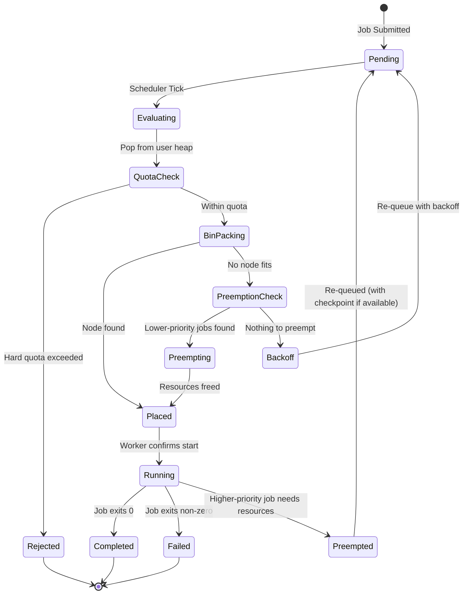
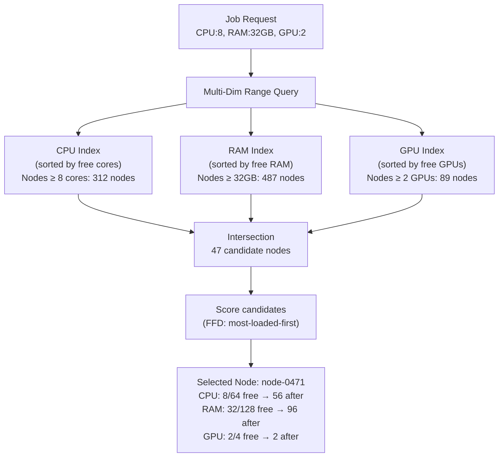
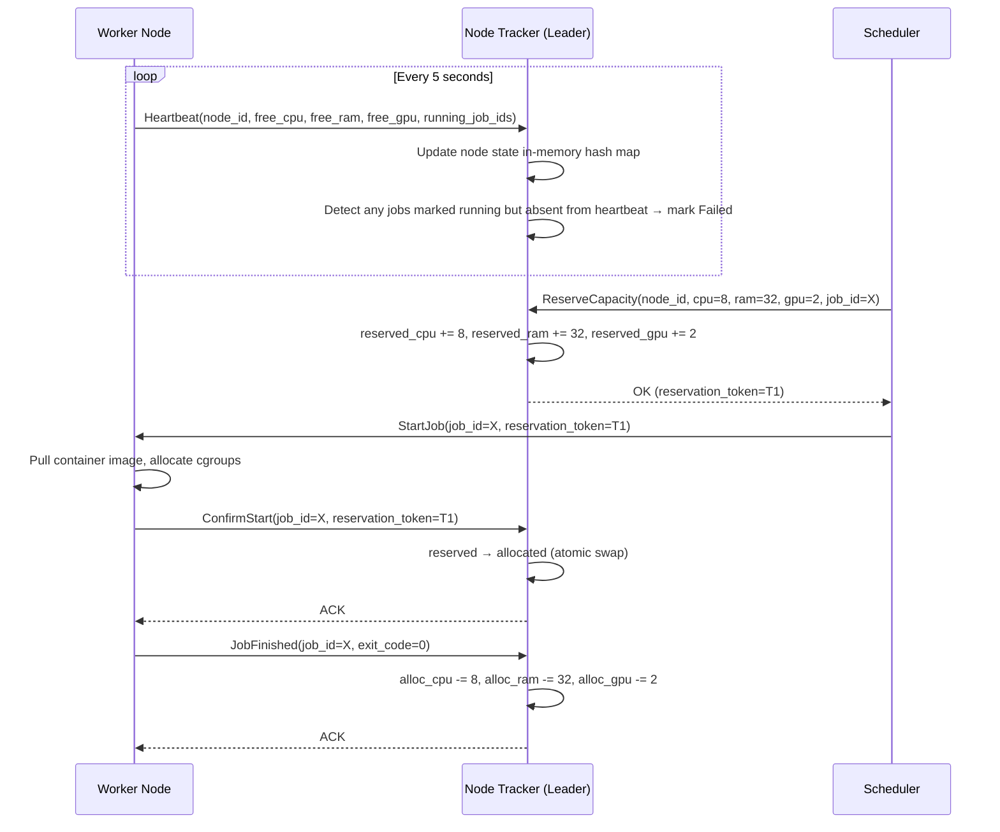

# Design a Resource Allocation System — 10K Jobs, Priority + Fairness

**Difficulty**: 🔴 Advanced (Hard)
**Reading Time**: 27 minutes
**Interview Frequency**: Medium — asked at cloud infrastructure, ML platform, and HPC companies

---

## Problem Statement

You are asked to design a resource allocation system that:

- **Works at**: 10 jobs on 3 servers — manually assign jobs to servers, trivial.
- **Breaks at**: 10,000 simultaneous jobs from 500 users competing for 1,000 servers — FIFO starvation (large job blocks all smaller ones), a single greedy user can consume all cluster resources, high-priority jobs wait behind low-priority ones, deadline-constrained jobs miss SLAs.

Target: **10,000 jobs**, **1,000 servers**, **priority + fairness**, **preemption for urgent jobs**, **< 100ms scheduling decision**, **90% cluster utilization**.

---

## Requirements

### Functional Requirements

| Requirement | Description |
|-------------|-------------|
| Job Submission | Submit jobs with CPU/memory/GPU requirements + priority |
| Fair Allocation | Each user gets fair share of cluster resources |
| Priority Scheduling | High-priority jobs preempt lower-priority ones |
| Bin Packing | Minimize wasted resources on each server |
| Preemption | Kill lower-priority job to make room for urgent job |
| Quota Enforcement | Per-user/team resource quotas |

### Non-Functional Requirements

| Requirement | Target |
|-------------|--------|
| Scheduling Latency | < 100 ms per scheduling decision |
| Cluster Utilization | > 90% (minimal fragmentation) |
| Fairness | Gini coefficient < 0.1 across users |
| Preemption Overhead | < 5% of jobs preempted in steady state |
| Scale | 10,000 concurrent jobs, 1,000 nodes |
| Scheduler Throughput | 1,000 scheduling decisions/second |

---

## Capacity Estimates

- **1,000 nodes × 64 cores = 64,000 CPU cores** available
- **10,000 jobs × avg 6 cores = 60,000 cores needed** → 93.75% utilization (matches target)
- **Scheduling cycle**: 10,000 jobs evaluated in < 100ms → 100,000 evaluations/second → 10 µs/evaluation (feasible with in-memory data structures)
- **State size**: 10,000 job records × 1 KB each = 10 MB (trivially fits in memory)
- **Fragmentation**: bin-packing reduces wasted capacity from ~15% (random) to ~5% (First Fit Decreasing)

---

## High-Level Architecture



---

## Level 1 — Surface: Scheduling Queue Policies

| Policy | Description | Fairness | Starvation | Utilization |
|--------|-------------|----------|------------|-------------|
| **FIFO** | First in, first out | Poor | High (small waits for large) | Medium |
| **Priority** | Highest priority served first | Poor (low priority starves) | High | High |
| **Round-Robin** | Each user gets turn | Perfect | None | Low (fragmentation) |
| **Fair-Share** | Each user gets equal share | Good | Low | High |
| **DRF** | Fair based on dominant resource | Excellent | Very Low | Highest |

**Dominant Resource Fairness (DRF)** is the gold standard: allocate resources so each user's **dominant resource share** (whichever of CPU or memory they use proportionally more) is equalized.

---

## Level 2 — Deep Dive: DRF Algorithm

With 9 CPUs and 18 GB RAM total:
- User A's jobs need 1 CPU + 4 GB RAM → dominant share = RAM (4/18 = 22.2%)
- User B's jobs need 3 CPU + 1 GB RAM → dominant share = CPU (3/9 = 33.3%)

DRF maximizes allocations while keeping dominant shares equal:

```
// Simplified DRF allocation loop
while cluster_has_resources():
    // Pick user with minimum dominant share
    user = min(users, key=lambda u: u.dominant_share)

    job = user.next_pending_job()
    if can_allocate(job, cluster_available):
        allocate(job)
        update_dominant_share(user)
    else:
        // Try bin packing on different node
        node = bin_pack(job)
        if node:
            allocate(job, node)
        else:
            // No space — try preemption or wait
            consider_preemption(job)
```

**DRF result**: No user can improve their allocation by changing their job requirements. No user is "jealous" — they wouldn't prefer another user's allocation to their own. This is the **envy-free** property.

### Bin-Packing: First Fit Decreasing (FFD)

Goal: Pack jobs onto minimum number of servers to maximize utilization.



FFD achieves > 95% utilization vs. ~70% for random placement. Time complexity: O(n log n) for sorting + O(n × m) for placement (n jobs, m servers).

**Online FFD** (for streaming job arrivals): Sort only by current dominant resource usage. Accept slightly worse packing in exchange for O(log m) lookup per job.

### Preemption Policy

When a high-priority job cannot be placed:
1. Find candidate jobs to preempt: running jobs with lower priority than incoming job
2. Select minimum set of preemptions to free required resources (minimize disruption)
3. Checkpoint preempted jobs if they support it (or kill and re-queue)
4. Place high-priority job
5. Re-queue preempted jobs (they start over or resume from checkpoint)

**Preemption limits**: Never preempt > 10% of running jobs per minute. Never preempt jobs that have been running > threshold (e.g., 6 hours) unless absolute emergency.

---

## Key Design Decisions

### 1. Preemptive vs. Non-Preemptive Scheduling

| Approach | Priority Responsiveness | Job Disruption | Complexity |
|----------|------------------------|----------------|------------|
| **Non-preemptive** | Low (wait for job completion) | None | Simple |
| **Preemptive (kill)** | High | High (restart from scratch) | Medium |
| **Preemptive (checkpoint)** | High | Low (resume from checkpoint) | High |

Google Borg uses preemption with checkpointing for ML training jobs. For batch jobs without checkpointing: only preempt at natural boundaries (task completion).

### 2. Resource Quotas

Without quotas: one team submits 10,000 GPU jobs → monopolizes entire cluster.

With quotas:
- Per-team hard quota: max 500 GPUs at any time
- Per-team soft quota: guaranteed minimum 100 GPUs even under contention
- Burst: use up to hard quota when cluster is underutilized

Implementation: Quota check at admission (reject submissions over quota), not at scheduling (avoid orphaning jobs mid-run).

### 3. Dealing with Heterogeneous Resources

Cluster has mix of GPU nodes (expensive), high-memory nodes, and standard compute. DRF extended for multiple resource dimensions:

- Job that needs GPU: dominant share = GPU share
- Job that needs lots of RAM: dominant share = RAM share
- Job that needs CPU only: dominant share = CPU share

Each dimension tracked separately. Allocation stops when any resource dimension is fully allocated.

---

## Interview Questions

| Question | What They're Testing | Key Answer Points |
|----------|---------------------|-------------------|
| How do you prevent a single team from starving everyone else? | Fairness | DRF equalizes dominant resource share per user; hard quotas cap per-team max; if team exceeds quota, jobs queued but not scheduled until usage drops below quota |
| How do you achieve 90% utilization without fragmentation? | Bin packing | FFD sorts jobs by size descending, packs largest first (reduces fragmentation); split large multi-CPU jobs into smaller tasks that fit in gaps |
| What happens when a high-priority deadline job arrives but cluster is full? | Preemption design | Identify minimum set of lower-priority jobs to preempt; checkpoint if supported; free resources; place high-priority job; re-queue preempted jobs at front of their user's queue |

---

---

## Component Deep Dive 1: Scheduler Core — Policy Engine + DRF State Machine

The Policy Engine is the brain of the resource allocation system. It runs in a tight scheduling loop, deciding which job to place next by consulting the active queue policies and cluster state. Naive approaches fail at scale for a simple reason: evaluating all 10,000 pending jobs against all 1,000 nodes on every cycle is O(n × m) = 10 million comparisons per tick. At a 100ms scheduling cycle target, that leaves only 10 nanoseconds per comparison — physically impossible with cache misses.

**How it works internally:**

The Policy Engine maintains a multi-level priority structure. At the top level, it partitions jobs into three categories: (1) deadline-critical jobs (those whose deadline is within 2× their estimated runtime), (2) high-priority non-deadline jobs (priority class ≥ 8 out of 10), and (3) fair-share best-effort jobs. The engine always drains category 1 first, then interleaves 2 and 3 using a weighted round-robin with DRF tie-breaking.

For each scheduling tick, rather than scanning all jobs, the engine pops the head of the appropriate heap — O(log n) per decision. The DRF state (each user's dominant share vector) is maintained incrementally: when a job starts or finishes, only that user's vector is updated, not all users. This reduces the DRF recomputation from O(users × resources) to O(resources) per event.

**Why naive FIFO fails at scale:**

With FIFO, a 1,000-core ML training job submitted at 9:01 AM blocks 200 ten-core ETL jobs submitted at 9:02 AM until 3 PM. Those ETL jobs had 30-minute SLAs. At 10,000 jobs/day, head-of-line blocking destroys cluster throughput because large jobs hold the queue while they wait for fragmented resources to consolidate.

**DRF State Machine — internal flow:**



**Implementation option trade-offs:**

| Approach | Scheduling Latency | Fairness | Complexity |
|----------|--------------------|----------|------------|
| Single-threaded DRF loop | 50–80 ms at 10k jobs | Excellent (serial, no races) | Low |
| Parallel candidate generation + serial commit | 10–20 ms at 10k jobs | Good (occasional stale reads) | Medium |
| Optimistic concurrency (Omega-style) | 5–10 ms at 10k jobs | Good (conflict retries) | High |

Google's Omega scheduler (2013) proved that optimistic concurrency — letting multiple schedulers speculatively assign resources and resolving conflicts via CAS — scales to hundreds of thousands of jobs. For 10,000 jobs, the single-threaded DRF loop is simpler and sufficient.

---

## Component Deep Dive 2: Bin Packer — FFD with Multi-Dimensional Constraints

The Bin Packer takes a job's resource request (CPU cores, RAM GB, GPU count, disk IOPS) and finds the best node to place it on. This is a multi-dimensional bin-packing problem, which is NP-hard in general. In practice, approximation algorithms achieve within 5–10% of optimal in milliseconds.

**Internal mechanics:**

The packer maintains a sorted index of nodes by available capacity. For each resource dimension (CPU, RAM, GPU), nodes are indexed in a separate sorted structure. When a job arrives requesting `(c CPU, r RAM, g GPU)`, the packer queries: "give me all nodes with at least c cores AND r GB RAM AND g GPUs available." This is a multi-dimensional range query.

Implementation uses a segment tree per resource dimension with O(log m) lookup per dimension. Intersection of results across dimensions is computed on the fly. For the common case (CPU + RAM only), this runs in under 1 ms for 1,000 nodes.

**Placement heuristics compared:**

| Strategy | Fragmentation | Bin Packing Quality | Best For |
|----------|--------------|---------------------|----------|
| Best Fit Decreasing (BFD) | Very Low (~3%) | Highest | Batch jobs, predictable sizes |
| First Fit Decreasing (FFD) | Low (~5%) | High | General workloads |
| Worst Fit (spread) | High (~15%) | Poor | Latency-sensitive (isolation) |
| Random | Very High (~20%) | Poor | Only for testing |

FFD is preferred because it is online-friendly: sort pending jobs by dominant resource descending, then for each job find the first node that fits. This achieves near-BFD quality without requiring global re-sorting on every node update.

**Scale behavior at 10x load (100,000 jobs, 10,000 nodes):**

The O(n log m) bin-packing loop now runs 100,000 × log(10,000) ≈ 100,000 × 14 = 1.4 million operations per scheduling cycle. At 10 ns/op, that is 14 ms — still within the 100ms budget. However, maintaining sorted node indexes across 10,000 nodes requires O(log 10,000) = 14 comparisons per node update. With nodes reporting heartbeats every second, that is 10,000 updates/second × 14 ops = 140,000 operations/second for index maintenance alone — manageable with a single-threaded event loop.



---

## Component Deep Dive 3: Node Tracker — Distributed State Consistency

The Node Tracker maintains the ground truth of cluster resource availability. It receives heartbeats from 1,000 worker nodes every 5 seconds and must answer: "which nodes have capacity for job X right now?" with sub-millisecond read latency.

**Technical decisions:**

The Node Tracker stores all node state in-memory as a hash map of `node_id → NodeState` where NodeState contains: total capacity per resource, allocated capacity per resource (by running job_id), last heartbeat timestamp, and health status. At 1,000 nodes × 500 bytes per state = 500 KB — trivially fits in L2 cache of a modern server.

**Consistency model:** The Node Tracker uses eventual consistency between the scheduler's view and actual worker state. A job is marked "allocated" in the tracker the moment the scheduler decides to place it (optimistic), and "running" when the worker confirms startup (confirmed). The window between these two states is typically 200–500ms (container start time). During this window, the tracker must not double-allocate those resources to another job. Implementation: maintain a "reserved" capacity separate from "allocated" and "free":

```
free_capacity = total - allocated - reserved
```

When scheduler places a job: subtract from free, add to reserved.  
When worker confirms: subtract from reserved, add to allocated.  
When job finishes: subtract from allocated.  
If worker does not confirm within 30s: release reservation (job failed to start).

**Node state transitions and heartbeat protocol:**



**Split-brain prevention:** The Node Tracker is a single-leader service backed by Raft (etcd). The leader handles all writes; followers serve stale reads for monitoring/observability only. The scheduler always reads from the leader to avoid placing jobs based on stale capacity data. With 1,000 nodes sending heartbeats every 5s, write throughput to the leader is 200 writes/second — well within etcd's 10,000 writes/second capacity.

**Failure handling for offline nodes:** If a node misses 3 consecutive heartbeats (15 seconds), the Node Tracker marks it `offline` and moves all its allocated jobs to state `unknown`. After 60 seconds without recovery, those jobs are re-queued as `pending` with their preempt_count incremented. Jobs that have been re-queued 3+ times are moved to a dead-letter queue for human inspection — they may be hitting a systematic node affinity problem (e.g., a job that requires a feature only present on a broken node class).

---

## Data Model

```sql
-- Jobs table: pending, running, completed jobs
CREATE TABLE jobs (
    job_id          UUID PRIMARY KEY DEFAULT gen_random_uuid(),
    user_id         VARCHAR(64)     NOT NULL,
    team_id         VARCHAR(64)     NOT NULL,
    priority        SMALLINT        NOT NULL DEFAULT 5,  -- 1=lowest, 10=highest
    state           VARCHAR(16)     NOT NULL DEFAULT 'pending',
    cpu_request     FLOAT           NOT NULL,  -- cores (fractional allowed)
    ram_request_gb  FLOAT           NOT NULL,
    gpu_request     INT             NOT NULL DEFAULT 0,
    disk_iops       INT             NOT NULL DEFAULT 0,
    deadline_at     TIMESTAMPTZ,               -- NULL = no deadline
    submitted_at    TIMESTAMPTZ     NOT NULL DEFAULT NOW(),
    started_at      TIMESTAMPTZ,
    completed_at    TIMESTAMPTZ,
    assigned_node   VARCHAR(64),
    checkpoint_uri  TEXT,                      -- S3 URI for checkpoint if preempted
    preempt_count   SMALLINT        NOT NULL DEFAULT 0,
    estimated_runtime_s INT,
    queue_name      VARCHAR(64)     NOT NULL DEFAULT 'default'
);

CREATE INDEX idx_jobs_state_priority   ON jobs (state, priority DESC, submitted_at ASC);
CREATE INDEX idx_jobs_user_state       ON jobs (user_id, state);
CREATE INDEX idx_jobs_deadline         ON jobs (deadline_at ASC) WHERE state = 'pending';

-- Nodes table: cluster node capacity and availability
CREATE TABLE nodes (
    node_id         VARCHAR(64)     PRIMARY KEY,
    node_pool       VARCHAR(32)     NOT NULL,  -- 'gpu', 'highmem', 'standard'
    total_cpu       FLOAT           NOT NULL,
    total_ram_gb    FLOAT           NOT NULL,
    total_gpu       INT             NOT NULL DEFAULT 0,
    alloc_cpu       FLOAT           NOT NULL DEFAULT 0.0,
    alloc_ram_gb    FLOAT           NOT NULL DEFAULT 0.0,
    alloc_gpu       INT             NOT NULL DEFAULT 0,
    reserved_cpu    FLOAT           NOT NULL DEFAULT 0.0,  -- scheduler reserved, not yet confirmed
    reserved_ram_gb FLOAT           NOT NULL DEFAULT 0.0,
    reserved_gpu    INT             NOT NULL DEFAULT 0,
    last_heartbeat  TIMESTAMPTZ     NOT NULL DEFAULT NOW(),
    status          VARCHAR(16)     NOT NULL DEFAULT 'ready',  -- ready, draining, offline
    taints          JSONB                                        -- e.g. {"gpu_model": "A100"}
);

CREATE INDEX idx_nodes_pool_status ON nodes (node_pool, status);
CREATE INDEX idx_nodes_free_cpu    ON nodes ((total_cpu - alloc_cpu - reserved_cpu) DESC);

-- Quotas table: per-team resource limits
CREATE TABLE quotas (
    team_id         VARCHAR(64)     PRIMARY KEY,
    hard_cpu        FLOAT           NOT NULL,
    hard_ram_gb     FLOAT           NOT NULL,
    hard_gpu        INT             NOT NULL DEFAULT 0,
    soft_cpu        FLOAT           NOT NULL,  -- guaranteed minimum
    soft_ram_gb     FLOAT           NOT NULL,
    soft_gpu        INT             NOT NULL DEFAULT 0,
    current_cpu     FLOAT           NOT NULL DEFAULT 0.0,  -- live usage (updated on alloc/dealloc)
    current_ram_gb  FLOAT           NOT NULL DEFAULT 0.0,
    current_gpu     INT             NOT NULL DEFAULT 0,
    updated_at      TIMESTAMPTZ     NOT NULL DEFAULT NOW()
);

-- DRF state: per-user dominant share tracking (in-memory in scheduler, persisted for auditability)
CREATE TABLE drf_state (
    user_id         VARCHAR(64)     PRIMARY KEY,
    cpu_share       FLOAT           NOT NULL DEFAULT 0.0,  -- fraction of cluster CPU in use
    ram_share       FLOAT           NOT NULL DEFAULT 0.0,
    gpu_share       FLOAT           NOT NULL DEFAULT 0.0,
    dominant_share  FLOAT           NOT NULL DEFAULT 0.0,  -- max(cpu_share, ram_share, gpu_share)
    updated_at      TIMESTAMPTZ     NOT NULL DEFAULT NOW()
);
```

---

## Scale Bottlenecks

| Traffic Level | Component That Breaks | Symptoms | Mitigation |
|---------------|----------------------|----------|------------|
| 10x baseline (100k jobs, 10k nodes) | Bin packer — O(n log m) per scheduling tick exceeds 100ms | Scheduling backlog grows; P99 placement latency > 500ms | Shard scheduler by queue/pool; run parallel bin-packers per node pool |
| 100x baseline (1M jobs, 100k nodes) | DRF state update — recomputing dominant shares serially | Single-user share changes delay all other users | Switch to approximate DRF: batch updates every 500ms instead of per-job |
| 100x baseline (write path) | Node tracker leader (etcd) — 20k heartbeats/sec write throughput | etcd write latency spikes; stale capacity reads; double-allocations | Hierarchical node tracking: rack-level aggregators report to cluster tracker; 10 rack-trackers × 2k writes/sec vs 20k writes/sec to one leader |
| 1000x baseline (10M jobs, 1M nodes) | Job state DB — single PostgreSQL node at ~500k writes/sec for job lifecycle events | DB write latency cascades to scheduler decision time | Shard jobs table by team_id; use append-only event log (Kafka) as source of truth; job DB becomes read replica |
| 1000x baseline (scheduler logic) | Single-leader scheduler — cannot parallelize decisions safely | Scheduling throughput caps at ~5k decisions/sec on one core | Omega-style optimistic concurrency: N schedulers speculatively assign, central arbiter resolves conflicts with CAS; measured at Google: 100k decisions/sec |

---

## How Google Borg Built This

Google's Borg system manages hundreds of thousands of machines across multiple clusters, scheduling both long-running services and batch jobs with strict priority and fairness requirements. The Borg paper (published at EuroSys 2015) provides the most detailed public description of a production-scale resource allocator.

**Technology choices:** Borg uses a centralized scheduler written in C++ with a custom in-memory state store — not a general-purpose database. All cluster state (job specs, task assignments, machine availability) lives in a replicated in-memory store called the Borg Master, backed by Paxos. This is why scheduling decisions take 25ms median latency even at 100,000-machine scale: no disk I/O on the critical path.

**Specific numbers:** At peak, Borg runs approximately 10 billion task-hours of work per month across ~12,000 machines per cluster (as of 2015). A single Borg cell (cluster) handles up to 10,000 scheduling decisions per second. Machine utilization averages 60% for CPU and 55% for RAM — Google chose these targets deliberately to leave headroom for load spikes rather than maximizing to 90%+, accepting higher hardware cost for better SLA headroom.

**Priority classes:** Borg uses 11 priority levels (0–10). Classes 9–10 are "monitoring" (unkillable), 6–8 are "production" (can preempt batch), 0–3 are "batch" (can be preempted freely). The non-obvious decision: Borg does not checkpoint batch jobs before preemption — it simply kills and re-queues them. Google found that checkpointing overhead (S3/GCS write latency) exceeded the savings from not re-running jobs for batch workloads averaging under 2 hours.

**DRF variant:** Borg does not implement pure DRF. Instead it uses a variant called "weighted DRF" where each team has a resource weight (reflecting their allocation agreement with Google infra). Teams that have paid for more capacity have higher weights, so their dominant share target is proportionally higher. This aligns billing with scheduling.

**Source:** Verma et al., "Large-scale cluster management at Google with Borg," EuroSys 2015. [https://research.google/pubs/pub43438/](https://research.google/pubs/pub43438/)

---

## Interview Angle

**What the interviewer is testing:** Whether the candidate can reason about multi-dimensional optimization problems (fairness + efficiency + latency simultaneously) and knows the difference between theoretical fairness algorithms and practical approximations that work at production scale.

**Common mistakes candidates make:**

1. **Proposing a priority queue and calling it done.** A pure priority queue starves low-priority users completely — at FAANG scale, a single ML team would monopolize all GPUs indefinitely. Candidates must explain DRF or weighted fair-share to show they understand multi-user fairness.

2. **Ignoring the bin-packing dimension.** Many candidates focus entirely on which job to schedule next but forget to explain where (which node). Without bin-packing, a cluster with 1,000 nodes each 90% full rejects a job needing 20 cores even though 10,000 cores are free in aggregate — just fragmented. FFD solves this.

3. **Proposing synchronous preemption.** Candidates often say "kill the lower-priority job, place the high-priority job." Real preemption is asynchronous: send eviction signal → wait for graceful shutdown (30s timeout) → confirm resources freed → place new job. Skipping this causes double-allocation bugs where both the old and new job hold the same CPU for up to 30s.

**The insight that separates good from great answers:** The scheduler's bottleneck is not the algorithm — it is the state consistency model. The reason Borg, YARN, and Kubernetes all use an in-memory state store with Raft consensus (not a relational DB) is that scheduling decisions require sub-millisecond reads of cluster state. Any network round-trip to a database adds 1–5ms per decision; at 1,000 decisions/second that is 1–5 seconds of added latency per second — the system falls over. Great candidates recognize that the "database" for the scheduler is RAM, and persistence is a background concern.

---

## Operational Considerations

### Admission Control vs. Scheduling

A common design mistake is doing quota enforcement inside the scheduler loop. This creates two problems: (1) jobs that exceed quota are inserted into the priority queue, consuming memory and evaluation time, only to be rejected at scheduling time; (2) quota accounting races — if two jobs from the same user are evaluated in the same tick, both may pass the quota check individually even though together they breach it.

Correct approach: enforce quotas at **submission time** (the API gateway or job intake service), not inside the scheduler. The scheduler can assume every job in its queues has already been admitted. This separates concerns cleanly:

- **Admission controller**: checks quota, validates job spec, assigns priority class, returns 429 if quota exceeded
- **Scheduler**: assumes all queued jobs are valid; focuses only on placement and fairness

### Handling Heterogeneous Node Pools

Production clusters are never homogeneous. A typical ML platform cluster has:
- Standard pool: 500 nodes × 64 CPU, 256 GB RAM, 0 GPU
- GPU pool: 200 nodes × 32 CPU, 512 GB RAM, 8× A100
- High-memory pool: 100 nodes × 64 CPU, 2 TB RAM, 0 GPU
- Spot/preemptible pool: 200 nodes × 64 CPU, 256 GB RAM (can be reclaimed by cloud provider with 2-min notice)

Each pool has different cost profiles. The scheduler should prefer spot nodes for batch jobs (60–80% cheaper) and standard/GPU nodes for production services. Implement this via **node affinity rules**: jobs tag their preferred pool (`pool: spot`) and the bin-packer scores spot nodes higher for batch-class jobs. If no spot nodes are available, fall back to standard — do not block indefinitely.

For spot node reclamation (cloud gives 2-minute warning): the Node Tracker watches cloud metadata APIs for preemption notices. On notice, it triggers graceful job migration: checkpoint running batch jobs to object storage, notify scheduler to re-queue, drain node over 90 seconds. This limits spot preemption impact to a brief re-queue delay rather than full job failure.

### Monitoring and Alerting

Key metrics to expose from the scheduler:

| Metric | Alert Threshold | Indicates |
|--------|----------------|-----------|
| `scheduler_queue_depth{priority=high}` | > 50 jobs for > 2 min | High-priority jobs accumulating; possible deadlock or fragmentation |
| `scheduler_decisions_per_second` | < 100/s | Scheduler overloaded; reduce batch size or scale vertically |
| `cluster_utilization_cpu` | < 70% | Under-utilized; check for fragmentation or admission throttling |
| `preemption_rate_per_minute` | > 5% of running jobs | Priority inversion spike; check for quota misconfiguration |
| `node_offline_count` | > 10 nodes | Infrastructure incident; scheduler may start failing placements |
| `job_wait_p99_seconds` | > 600s | Tail latency starvation; check DRF skew between users |

---

## Key Numbers to Remember

| Metric | Value | Context |
|--------|-------|---------|
| Scheduling decision latency | < 100 ms | Target for 10k jobs / 1k nodes |
| Google Borg scheduling throughput | ~10,000 decisions/sec | Per Borg cell, 2015 data |
| Google Borg cluster utilization | 60% CPU, 55% RAM | Deliberately below 90% for SLA headroom |
| FFD fragmentation | ~5% waste | vs ~20% for random placement |
| DRF recomputation cost | O(resources) per job event | Incremental update, not full scan |
| Node heartbeat interval | 5 seconds | Standard in Kubernetes, YARN, Borg |
| Preemption grace period | 30 seconds | Graceful shutdown before SIGKILL |
| Cluster state memory (1k nodes) | ~500 KB | Fits in CPU L2 cache |
| Cluster state memory (100k nodes) | ~50 MB | Fits in RAM, not L2; affects latency |
| Bin-pack index query (1k nodes) | < 1 ms | Multi-dim range query with sorted index |
| etcd write throughput (1k nodes, 5s heartbeat) | 200 writes/sec | Well within etcd's 10k writes/sec limit |
| Node offline detection threshold | 15 seconds (3 missed heartbeats) | Standard across Kubernetes, YARN, Borg |
| Job re-queue dead-letter threshold | 3 preemptions | Prevents infinite re-queue loops |
| Spot node preemption warning | 2 minutes | AWS/GCP standard; enough for checkpoint + drain |
| Quota enforcement point | Admission (API layer) | Never inside scheduler loop — causes races |
| DRF update complexity per job event | O(R) where R = resource dimensions | Incremental; R = 3 (CPU/RAM/GPU) in practice |

---

## Summary: When to Use Each Scheduling Policy

The right scheduling policy depends on your workload mix. Most production clusters run a hybrid:

- **Interactive / production services**: strict priority queue (classes 8–10). Never preempted except by monitoring jobs. Latency SLA is the primary constraint.
- **ML training / long-running batch**: DRF fair-share with per-team quotas. Preemptable by production jobs. Checkpointing strongly recommended for jobs > 1 hour.
- **Short ETL / CI jobs**: best-effort FIFO within fair-share quota. Accept occasional starvation; optimize for throughput over individual latency.
- **Deadline-constrained jobs**: deadline-aware scheduler moves jobs to priority class 7 automatically when `time_remaining < 2 × estimated_runtime`. This prevents SLA breaches without requiring users to manually set high priority.

The combination of DRF (fairness) + FFD bin-packing (utilization) + priority preemption (SLA protection) + admission-time quota enforcement (isolation) is the architecture that Google Borg, Apache YARN's FairScheduler, and Kubernetes with the Scheduler Framework all converge on — because it is the minimal set of mechanisms that handles all four failure modes simultaneously.

Starting with just a priority queue and iterating toward DRF + bin-packing as cluster size grows is a valid evolutionary path. The migration trigger is typically when cluster utilization drops below 70% despite demand exceeding supply — the classic sign that fragmentation has overtaken simple placement logic.

Each mechanism has a specific failure mode it prevents: DRF prevents monopolization, FFD prevents fragmentation, preemption prevents SLA breaches, quotas prevent noisy-neighbor collapse. In an interview, name the failure mode each mechanism solves — this shows you understand the design rationale, not just the names of the algorithms.

For most companies at < 500 nodes: a weighted fair-share queue with bin-packing and hard quotas is sufficient. Full DRF + preemption + checkpointing is worth implementing only once you hit either > 1,000 nodes or > 10 teams competing for the same GPU pool — below those thresholds, the operational complexity exceeds the benefit.

---

## 📚 Resources & References

| Resource | Type | What You'll Learn |
|----------|------|------------------|
| [Dominant Resource Fairness Paper](https://cs.berkeley.edu/~alig/papers/drf.pdf) | 📖 Blog | DRF algorithm, envy-free allocation, multi-resource fairness |
| [Google Borg Paper](https://research.google/pubs/pub43438/) | 📖 Blog | Large-scale cluster management, preemption, priority classes |
| [Apache YARN](https://hadoop.apache.org/docs/stable/hadoop-yarn/hadoop-yarn-site/YARN.html) | 📚 Docs | Open-source resource manager, fair scheduler, capacity scheduler |
| [TechDummies YouTube](https://www.youtube.com/@TechDummiesNarendraL) | 📺 YouTube | Resource scheduling patterns, distributed computing fundamentals |

---

## Related Concepts

- [Container Orchestration](./container-orchestration) — Kubernetes implements similar bin-packing and preemption
- [Service Pool Allocation](./service-pool-allocation) — pool management for shared resources
- [HPC Cluster](./hpc-cluster) — SLURM implements fair-share scheduling for HPC jobs
