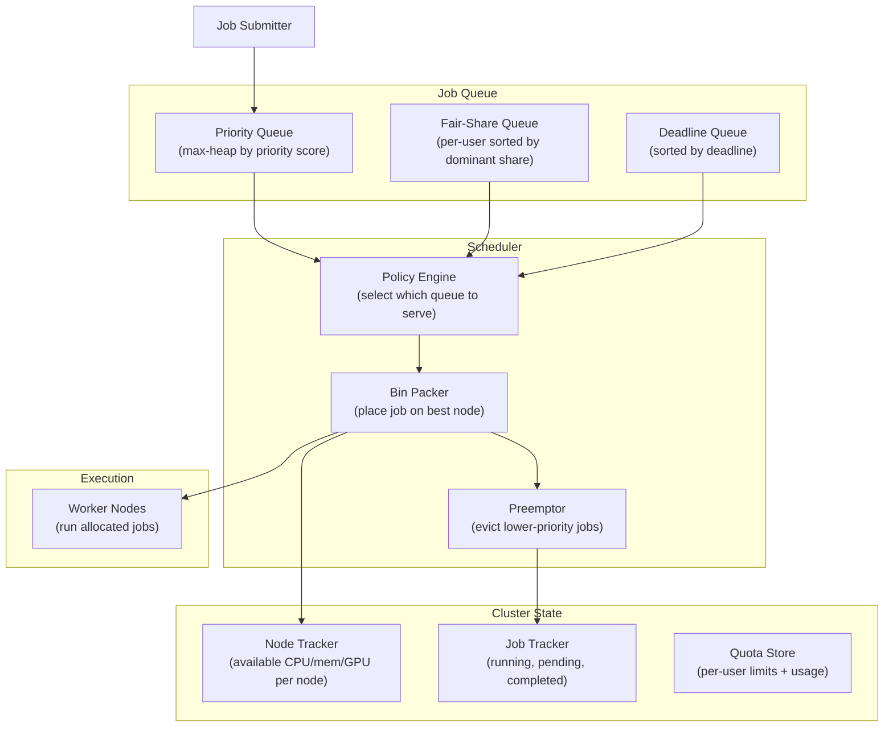
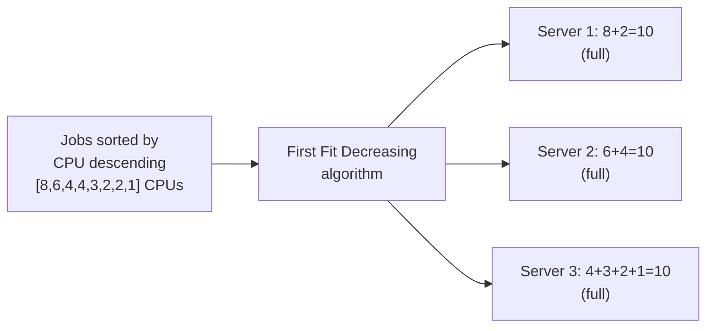

# Design a Resource Allocation System — 10K Jobs, Priority + Fairness

**Difficulty**: 🔴 Advanced (Hard)
**Reading Time**: 27 minutes
**Interview Frequency**: Medium — asked at cloud infrastructure, ML platform, and HPC companies

---

## Problem Statement

You are asked to design a resource allocation system that:

- **Works at**: 10 jobs on 3 servers — manually assign jobs to servers, trivial.
- **Breaks at**: 10,000 simultaneous jobs from 500 users competing for 1,000 servers — FIFO starvation (large job blocks all smaller ones), a single greedy user can consume all cluster resources, high-priority jobs wait behind low-priority ones, deadline-constrained jobs miss SLAs.

Target: **10,000 jobs**, **1,000 servers**, **priority + fairness**, **preemption for urgent jobs**, **< 100ms scheduling decision**, **90% cluster utilization**.

---

## Requirements

### Functional Requirements

| Requirement | Description |
|-------------|-------------|
| Job Submission | Submit jobs with CPU/memory/GPU requirements + priority |
| Fair Allocation | Each user gets fair share of cluster resources |
| Priority Scheduling | High-priority jobs preempt lower-priority ones |
| Bin Packing | Minimize wasted resources on each server |
| Preemption | Kill lower-priority job to make room for urgent job |
| Quota Enforcement | Per-user/team resource quotas |

### Non-Functional Requirements

| Requirement | Target |
|-------------|--------|
| Scheduling Latency | < 100 ms per scheduling decision |
| Cluster Utilization | > 90% (minimal fragmentation) |
| Fairness | Gini coefficient < 0.1 across users |
| Preemption Overhead | < 5% of jobs preempted in steady state |
| Scale | 10,000 concurrent jobs, 1,000 nodes |
| Scheduler Throughput | 1,000 scheduling decisions/second |

---

## Capacity Estimates

- **1,000 nodes × 64 cores = 64,000 CPU cores** available
- **10,000 jobs × avg 6 cores = 60,000 cores needed** → 93.75% utilization (matches target)
- **Scheduling cycle**: 10,000 jobs evaluated in < 100ms → 100,000 evaluations/second → 10 µs/evaluation (feasible with in-memory data structures)
- **State size**: 10,000 job records × 1 KB each = 10 MB (trivially fits in memory)
- **Fragmentation**: bin-packing reduces wasted capacity from ~15% (random) to ~5% (First Fit Decreasing)

---

## High-Level Architecture



---

## Level 1 — Surface: Scheduling Queue Policies

| Policy | Description | Fairness | Starvation | Utilization |
|--------|-------------|----------|------------|-------------|
| **FIFO** | First in, first out | Poor | High (small waits for large) | Medium |
| **Priority** | Highest priority served first | Poor (low priority starves) | High | High |
| **Round-Robin** | Each user gets turn | Perfect | None | Low (fragmentation) |
| **Fair-Share** | Each user gets equal share | Good | Low | High |
| **DRF** | Fair based on dominant resource | Excellent | Very Low | Highest |

**Dominant Resource Fairness (DRF)** is the gold standard: allocate resources so each user's **dominant resource share** (whichever of CPU or memory they use proportionally more) is equalized.

---

## Level 2 — Deep Dive: DRF Algorithm

With 9 CPUs and 18 GB RAM total:
- User A's jobs need 1 CPU + 4 GB RAM → dominant share = RAM (4/18 = 22.2%)
- User B's jobs need 3 CPU + 1 GB RAM → dominant share = CPU (3/9 = 33.3%)

DRF maximizes allocations while keeping dominant shares equal:

```
// Simplified DRF allocation loop
while cluster_has_resources():
    // Pick user with minimum dominant share
    user = min(users, key=lambda u: u.dominant_share)

    job = user.next_pending_job()
    if can_allocate(job, cluster_available):
        allocate(job)
        update_dominant_share(user)
    else:
        // Try bin packing on different node
        node = bin_pack(job)
        if node:
            allocate(job, node)
        else:
            // No space — try preemption or wait
            consider_preemption(job)
```

**DRF result**: No user can improve their allocation by changing their job requirements. No user is "jealous" — they wouldn't prefer another user's allocation to their own. This is the **envy-free** property.

### Bin-Packing: First Fit Decreasing (FFD)

Goal: Pack jobs onto minimum number of servers to maximize utilization.



FFD achieves > 95% utilization vs. ~70% for random placement. Time complexity: O(n log n) for sorting + O(n × m) for placement (n jobs, m servers).

**Online FFD** (for streaming job arrivals): Sort only by current dominant resource usage. Accept slightly worse packing in exchange for O(log m) lookup per job.

### Preemption Policy

When a high-priority job cannot be placed:
1. Find candidate jobs to preempt: running jobs with lower priority than incoming job
2. Select minimum set of preemptions to free required resources (minimize disruption)
3. Checkpoint preempted jobs if they support it (or kill and re-queue)
4. Place high-priority job
5. Re-queue preempted jobs (they start over or resume from checkpoint)

**Preemption limits**: Never preempt > 10% of running jobs per minute. Never preempt jobs that have been running > threshold (e.g., 6 hours) unless absolute emergency.

---

## Key Design Decisions

### 1. Preemptive vs. Non-Preemptive Scheduling

| Approach | Priority Responsiveness | Job Disruption | Complexity |
|----------|------------------------|----------------|------------|
| **Non-preemptive** | Low (wait for job completion) | None | Simple |
| **Preemptive (kill)** | High | High (restart from scratch) | Medium |
| **Preemptive (checkpoint)** | High | Low (resume from checkpoint) | High |

Google Borg uses preemption with checkpointing for ML training jobs. For batch jobs without checkpointing: only preempt at natural boundaries (task completion).

### 2. Resource Quotas

Without quotas: one team submits 10,000 GPU jobs → monopolizes entire cluster.

With quotas:
- Per-team hard quota: max 500 GPUs at any time
- Per-team soft quota: guaranteed minimum 100 GPUs even under contention
- Burst: use up to hard quota when cluster is underutilized

Implementation: Quota check at admission (reject submissions over quota), not at scheduling (avoid orphaning jobs mid-run).

### 3. Dealing with Heterogeneous Resources

Cluster has mix of GPU nodes (expensive), high-memory nodes, and standard compute. DRF extended for multiple resource dimensions:

- Job that needs GPU: dominant share = GPU share
- Job that needs lots of RAM: dominant share = RAM share
- Job that needs CPU only: dominant share = CPU share

Each dimension tracked separately. Allocation stops when any resource dimension is fully allocated.

---

## Interview Questions

| Question | What They're Testing | Key Answer Points |
|----------|---------------------|-------------------|
| How do you prevent a single team from starving everyone else? | Fairness | DRF equalizes dominant resource share per user; hard quotas cap per-team max; if team exceeds quota, jobs queued but not scheduled until usage drops below quota |
| How do you achieve 90% utilization without fragmentation? | Bin packing | FFD sorts jobs by size descending, packs largest first (reduces fragmentation); split large multi-CPU jobs into smaller tasks that fit in gaps |
| What happens when a high-priority deadline job arrives but cluster is full? | Preemption design | Identify minimum set of lower-priority jobs to preempt; checkpoint if supported; free resources; place high-priority job; re-queue preempted jobs at front of their user's queue |

---

## 📚 Resources & References

| Resource | Type | What You'll Learn |
|----------|------|------------------|
| [Dominant Resource Fairness Paper](https://cs.berkeley.edu/~alig/papers/drf.pdf) | 📖 Blog | DRF algorithm, envy-free allocation, multi-resource fairness |
| [Google Borg Paper](https://research.google/pubs/pub43438/) | 📖 Blog | Large-scale cluster management, preemption, priority classes |
| [Apache YARN](https://hadoop.apache.org/docs/stable/hadoop-yarn/hadoop-yarn-site/YARN.html) | 📚 Docs | Open-source resource manager, fair scheduler, capacity scheduler |
| [TechDummies YouTube](https://www.youtube.com/@TechDummiesNarendraL) | 📺 YouTube | Resource scheduling patterns, distributed computing fundamentals |

---

## Related Concepts

- [Container Orchestration](./container-orchestration) — Kubernetes implements similar bin-packing and preemption
- [Service Pool Allocation](./service-pool-allocation) — pool management for shared resources
- [HPC Cluster](./hpc-cluster) — SLURM implements fair-share scheduling for HPC jobs
