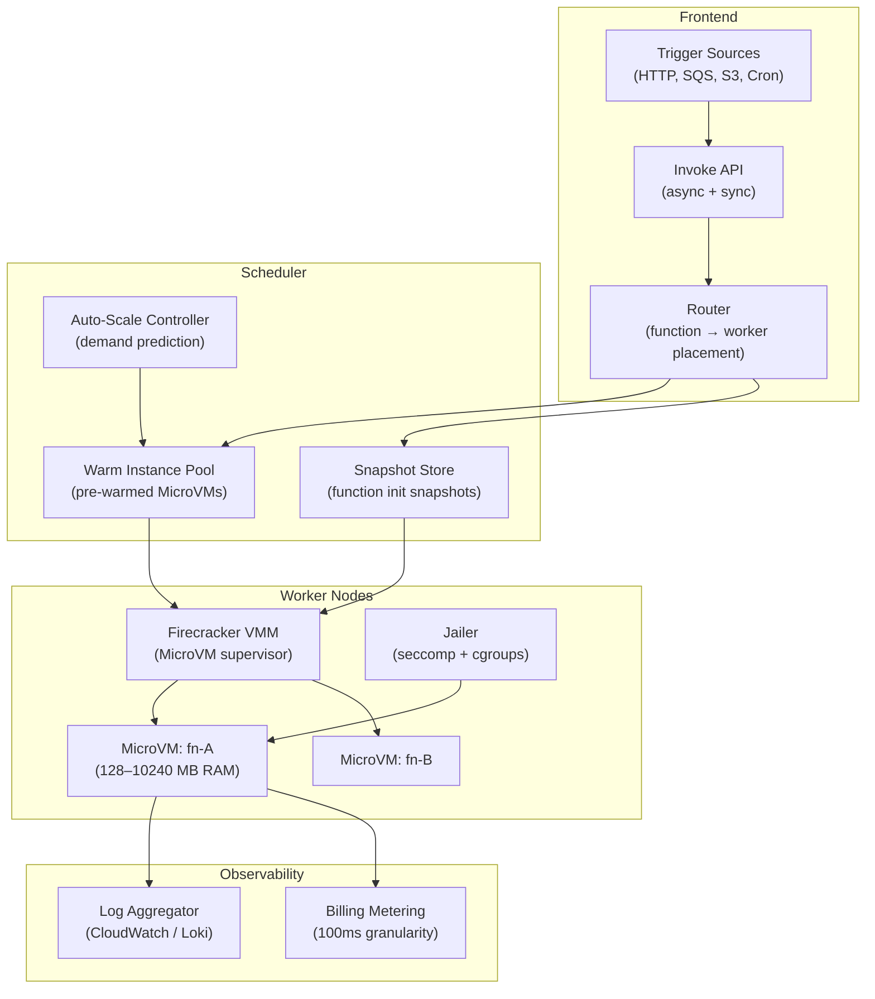
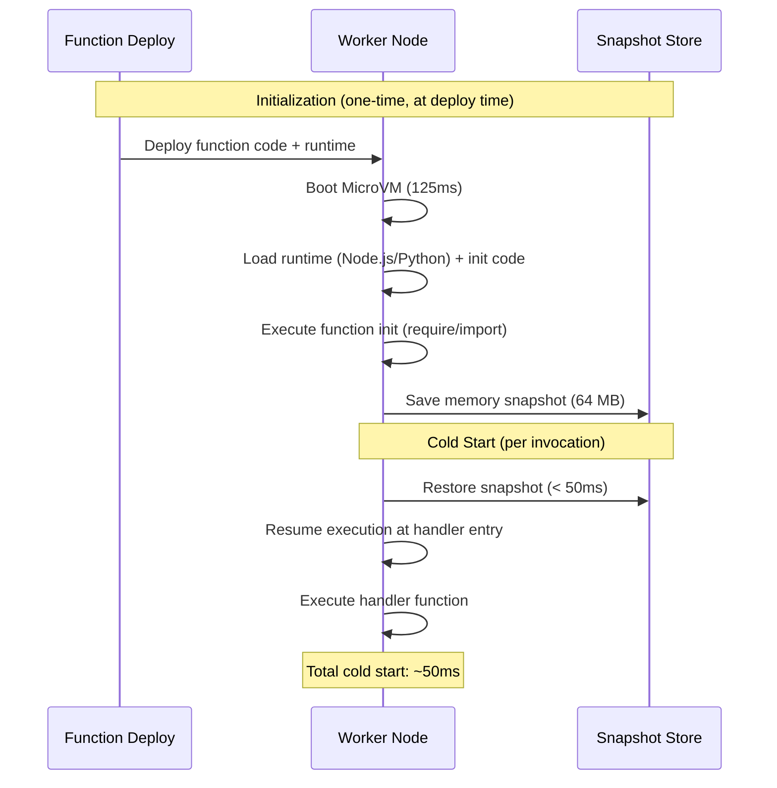

# Design a Serverless Execution Framework — 50ms Cold Start, Scale to Zero

**Difficulty**: 🔴 Advanced
**Reading Time**: 30 minutes
**Interview Frequency**: High — asked at cloud providers, platform engineering, and infrastructure-focused companies

---

## Problem Statement

You are asked to design a serverless execution framework that:

- **Works at**: 10 functions with predictable traffic — always-warm containers have no cold start.
- **Breaks at**: 10,000 functions with bursty, unpredictable traffic — keeping all 10,000 always-warm wastes $2M/month; true scale-to-zero creates 5–10 second cold starts (Docker container startup); per-tenant isolation requires new sandbox for every cold start; billing accuracy at 100ms granularity needs sub-ms timekeeping.

Target: **< 50ms cold start**, **scale to zero** (0 idle cost), **per-invocation billing at 100ms granularity**, **strong isolation** (multi-tenant, untrusted code), **1M function invocations/second** globally.

---

## Requirements

### Functional Requirements

| Requirement | Description |
|-------------|-------------|
| Code Execution | Run arbitrary code (Node.js, Python, Go, Java) |
| Scale to Zero | No idle capacity billing when function inactive |
| Event Triggers | HTTP, queue messages, cron, S3 events |
| Concurrency | Horizontal scaling to handle burst traffic |
| Isolation | Each invocation in isolated sandbox (multi-tenant) |
| Execution Logs | Capture stdout/stderr per invocation |

### Non-Functional Requirements

| Requirement | Target |
|-------------|--------|
| Cold Start Latency | < 50 ms (MicroVM snapshot/restore) |
| Warm Invocation Latency | < 1 ms framework overhead |
| Scale-Out Speed | 1,000 new instances/second burst |
| Billing Granularity | 100 ms increments, 1 ms precision |
| Memory Range | 128 MB to 10 GB per function |
| Maximum Execution Time | 15 minutes per invocation |

---

## Capacity Estimates

- **1M invocations/second** × 500ms avg duration = **500,000 concurrent function instances**
- **MicroVM boot time**: Firecracker boots in ~125ms cold; with snapshot/restore → **< 50ms**
- **Memory per MicroVM**: 128 MB minimum, typical Node.js = 256 MB → 256K concurrent functions on 64 TB cluster RAM
- **Storage for snapshots**: 1 snapshot per function version (~64 MB) × 10,000 functions × 10 versions = **6.4 TB snapshot storage**
- **Function package cache**: Average function zip = 10 MB × 10,000 functions = **100 GB** (fits in RAM on worker fleet)

---

## High-Level Architecture

---

## Level 1 — Surface: Cold Start vs. Always-Warm Trade-off

| Approach | Cold Start | Idle Cost | Use Case |
|----------|-----------|-----------|----------|
| **Container (Docker)** | 1–5 seconds | Low (scale to 0) | Dev/test, infrequent functions |
| **Always-warm pool** | < 1 ms | High ($2M/month for 10K fns) | Latency-critical, high-traffic |
| **MicroVM snapshot/restore** | 50–150 ms | Low (snapshot stored, not running) | **Production serverless** |
| **Process-based (V8 isolate)** | < 5 ms | Very low | Same-language isolation (Cloudflare Workers) |

**AWS Lambda uses Firecracker MicroVM**: boots in 125ms from scratch, < 50ms from snapshot. Google Cloud Run uses containers. Cloudflare Workers use V8 isolates (< 5ms, same-language only).

---

## Level 2 — Deep Dive: MicroVM and Snapshot/Restore

### Why Not Docker Containers for Serverless?

Docker containers share the host kernel — container startup = pulling layers + namespace setup = 1–5 seconds. Multi-tenant security is harder (shared kernel = larger attack surface).

**Firecracker MicroVM**:
- Full hardware virtualization (KVM-based)
- Each function runs in isolated kernel (< 5 MB memory footprint for VMM)
- Boot time: ~125 ms from zero to running
- Security: virtualized hardware boundary, not just namespace isolation

### Snapshot/Restore for 50ms Cold Start

The key insight: **function initialization code** (importing libraries, connecting to DB) runs once at deploy time during snapshot creation. On cold start, we restore the snapshot — the function is already past the expensive init phase.

### Concurrency Limits and Throttling

Each AWS account has a default limit of **3,000 concurrent invocations** (soft limit, can increase). The scaling model:

- **Burst limit**: 3,000 new instances/minute (not per second)
- **Steady-state scaling**: 500 additional instances/minute
- Beyond burst limit: requests are queued (sync) or held in SQS (async)

This prevents one customer from consuming all capacity on shared worker fleet.

---

## Key Design Decisions

### 1. Process Isolation: gVisor vs. Firecracker vs. V8 Isolates

| Technology | Isolation Level | Cold Start | Use Case |
|------------|----------------|-----------|----------|
| **V8 Isolates** (Cloudflare Workers) | JS engine isolation | < 5 ms | Single-language (JS only), untrusted code |
| **gVisor** (Google) | Syscall interception | 20–50 ms | Multi-language, moderate security |
| **Firecracker MicroVM** (AWS Lambda) | Full hardware virtualization | 50–125 ms | Strongest isolation, arbitrary code |
| **Docker + seccomp** | Namespace + syscall filter | 500ms–5s | Dev workloads, trusted code |

**Decision**: Firecracker for strong multi-tenant isolation with acceptable 50ms cold start. V8 isolates for JavaScript-only functions requiring ultra-low latency.

### 2. Billing Precision

Billing per 100ms invocation requires measuring actual execution time (not wall clock). Implementation:

1. Start timer when function handler is called (not MicroVM boot)
2. Round up to nearest 100ms
3. Charge for memory × duration (e.g., 256 MB × 200ms = 51,200 MB-ms)
4. AWS Lambda pricing: $0.0000166667 per GB-second

Metering data is written to a high-throughput append-only log (Kinesis/Kafka) and aggregated per billing cycle.

### 3. Pre-Warming Heuristics

Scale-to-zero creates cold starts. Pre-warm heuristics reduce cold start frequency:

- **Traffic prediction**: If function had > 100 invocations yesterday at 9am, pre-warm at 8:55am today
- **Minimum instances**: Allow customers to set `minInstances = 1` (pay for always-warm)
- **KeepAlive pings**: CloudWatch Events trigger function every 5 minutes to prevent eviction
- **Provisioned Concurrency** (AWS): Pre-warm N instances, billed continuously

---

## Interview Questions

| Question | What They're Testing | Key Answer Points |
|----------|---------------------|-------------------|
| How do you achieve 50ms cold start vs. 5 seconds for Docker? | Technical depth | MicroVM snapshot/restore: function init runs once at deploy → save 64 MB memory snapshot → cold start restores snapshot in < 50ms, bypassing init |
| How do you handle 10,000 concurrent invocations bursting from zero? | Scaling design | Pre-warmed MicroVM pool (generic, not function-specific); router assigns function code to warm MicroVM; burst limited to 3,000/minute to protect shared infrastructure |
| Why use MicroVM instead of containers for isolation? | Security knowledge | Containers share host kernel (namespace isolation only) — kernel exploit affects all containers; MicroVM has dedicated kernel per function, hardware virtualization boundary, < 5MB VMM footprint |

---

## 📚 Resources & References

| Resource | Type | What You'll Learn |
|----------|------|------------------|
| [Firecracker NSDI 2020 Paper](https://www.usenix.org/conference/nsdi20/presentation/agache) | 📖 Blog | Firecracker internals, MicroVM design, cold start optimization |
| [AWS Lambda Best Practices](https://aws.amazon.com/blogs/architecture/best-practices-for-developing-on-aws-lambda/) | 📖 Blog | Lambda architecture, concurrency model, cold start mitigation |
| [Cloudflare Workers Architecture](https://blog.cloudflare.com/cloudflare-workers-unleashed/) | 📖 Blog | V8 isolate approach, ultra-low cold start, JavaScript-only constraints |
| [ByteByteGo YouTube](https://www.youtube.com/@ByteByteGo) | 📺 YouTube | Serverless architecture patterns, Lambda internals explained visually |

---

## Related Concepts

- [Container Orchestration](./container-orchestration) — serverless builds on container primitives
- [Rate Limiter](./rate-limiter) — concurrency limits in serverless are a form of rate limiting
- [Distributed Tracing](./distributed-tracing) — tracing distributed serverless function chains
